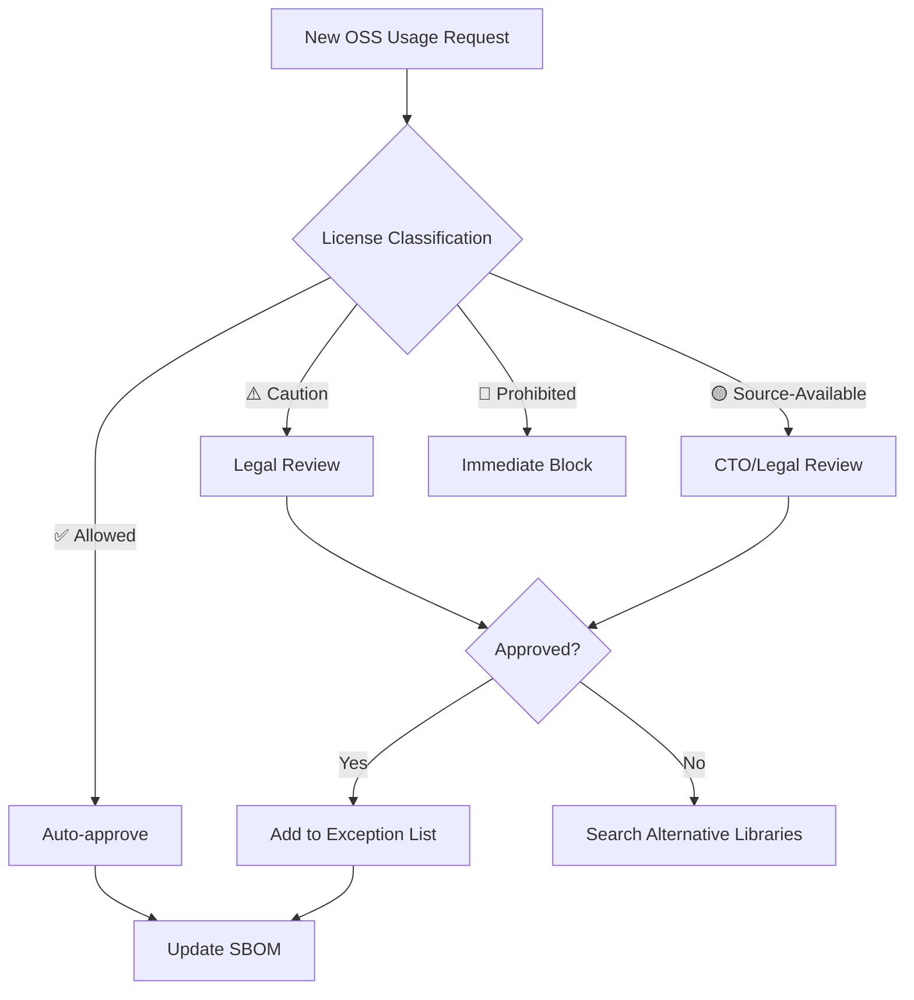
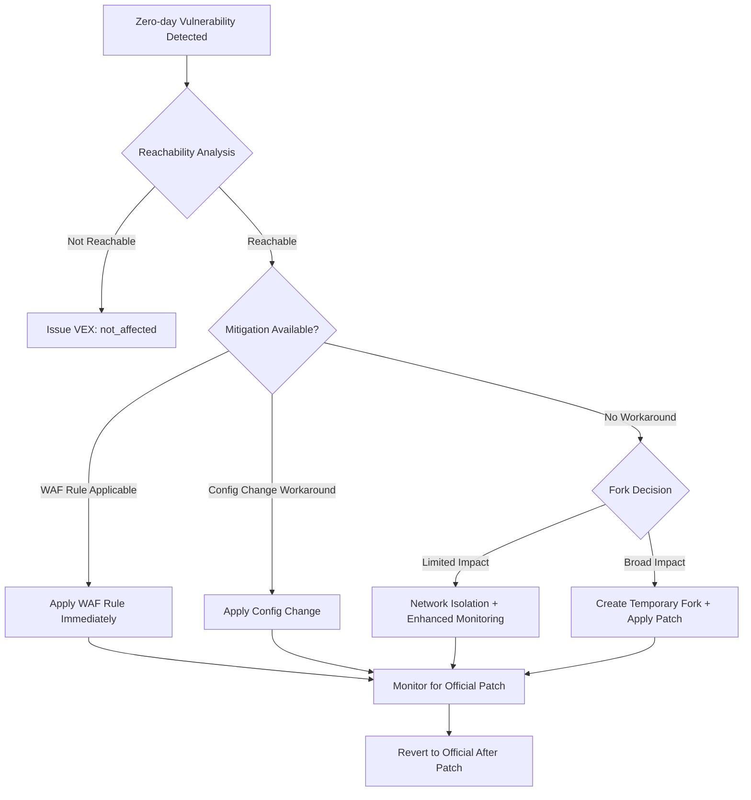
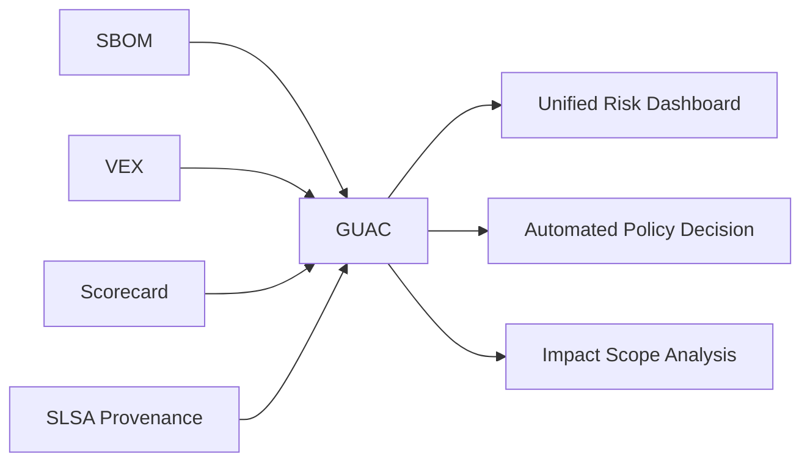
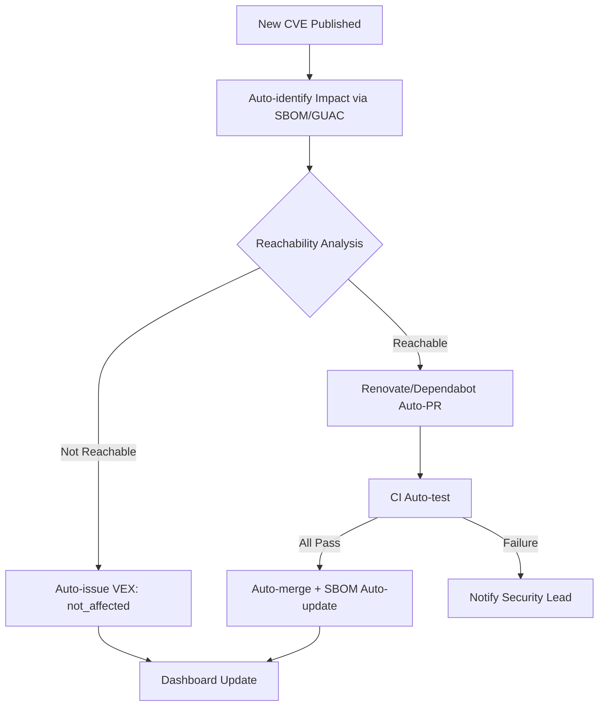

# 62. License & Dependency Management

> [!CAUTION]
> **This file is a Universal Rule (Immutable). Editing is prohibited unless an explicit "Amend Constitution" instruction is given.**
> Last Updated: 2026-03-24

> [!IMPORTANT]
> **Supreme Directive**
> "Every dependency is a trust decision — unmanaged licenses are legal time bombs."
> All third-party dependencies must be audited, approved, and continuously monitored.
> Strictly follow: **License Compliance > Security > Stability > Convenience**.
> **49 Sections.**

---

## Table of Contents

| § | Section |
|---|---|
| 1 | [License Classification & Policy](#1-license-classification--policy) |
| 2 | [License Compatibility Matrix](#2-license-compatibility-matrix) |
| 3 | [AI/ML Model Licensing](#3-aiml-model-licensing) |
| 4 | [Container Image License Management](#4-container-image-license-management) |
| 5 | [IaC Module & Action Licensing](#5-iac-module--action-licensing) |
| 6 | [Font & Media Asset Licensing](#6-font--media-asset-licensing) |
| 7 | [SBOM (Software Bill of Materials)](#7-sbom-software-bill-of-materials) |
| 8 | [SBOM Regulatory Compliance](#8-sbom-regulatory-compliance) |
| 9 | [Supply Chain Security Foundation](#9-supply-chain-security-foundation) |
| 10 | [SCA Tool Integration](#10-sca-tool-integration) |
| 11 | [CI Pipeline Guardrails](#11-ci-pipeline-guardrails) |
| 12 | [Dependency Selection Criteria](#12-dependency-selection-criteria) |
| 13 | [Bundle Size & Performance Impact](#13-bundle-size--performance-impact) |
| 14 | [Lockfile Integrity](#14-lockfile-integrity) |
| 15 | [Automated Update Strategy (Renovate / Dependabot)](#15-automated-update-strategy-renovate--dependabot) |
| 16 | [Security Patch SLA](#16-security-patch-sla) |
| 17 | [Monorepo Dependency Management](#17-monorepo-dependency-management) |
| 18 | [Private Registry / Artifactory](#18-private-registry--artifactory) |
| 19 | [Transitive Dependency Management](#19-transitive-dependency-management) |
| 20 | [EOL / Deprecated Package Management](#20-eol--deprecated-package-management) |
| 21 | [Attribution & NOTICE Generation](#21-attribution--notice-generation) |
| 22 | [OSPO (Open Source Program Office)](#22-ospo-open-source-program-office) |
| 23 | [Dependency Compromise Incident Response](#23-dependency-compromise-incident-response) |
| 24 | [Audit & Reporting](#24-audit--reporting) |
| 25 | [FinOps: Dependency Cost Optimization](#25-finops-dependency-cost-optimization) |
| 26 | [OpenSSF Scorecard Integration](#26-openssf-scorecard-integration) |
| 27 | [Dependency Confusion Attack Defense](#27-dependency-confusion-attack-defense) |
| 28 | [VEX (Vulnerability Exploitability eXchange)](#28-vex-vulnerability-exploitability-exchange) |
| 29 | [CBOM (Cryptographic Bill of Materials)](#29-cbom-cryptographic-bill-of-materials) |
| 30 | [Multi-Ecosystem Dependency Management](#30-multi-ecosystem-dependency-management) |
| 31 | [Package Publishing Security & OIDC Migration](#31-package-publishing-security--oidc-migration) |
| 32 | [GitHub Dependency Review Integration](#32-github-dependency-review-integration) |
| 33 | [OSS Legal Risk Management](#33-oss-legal-risk-management) |
| 34 | [Zero-Day Dependency Response Playbook](#34-zero-day-dependency-response-playbook) |
| 35 | [AI-Generated Code License Risk](#35-ai-generated-code-license-risk) |
| 36 | [Slopsquatting / AI Package Hallucination Defense](#36-slopsquatting--ai-package-hallucination-defense) |
| 37 | [SBOM Long-Term Retention & CRA Technical Documentation](#37-sbom-long-term-retention--cra-technical-documentation) |
| 38 | [Runtime Dependency Monitoring (Runtime SCA)](#38-runtime-dependency-monitoring-runtime-sca) |
| 39 | [Dependency Minimization Principle](#39-dependency-minimization-principle) |
| 40 | [Supply Chain Incident Case Database](#40-supply-chain-incident-case-database) |
| 41 | [Dependency Governance Maturity Model](#41-dependency-governance-maturity-model) |
| 42 | [License Laundering Defense](#42-license-laundering-defense) |
| 43 | [Remote Dynamic Dependencies (RDD) Defense](#43-remote-dynamic-dependencies-rdd-defense) |
| 44 | [DORA ICT Supply Chain Requirements](#44-dora-ict-supply-chain-requirements) |
| 45 | [Continuous Verification](#45-continuous-verification) |
| 46 | [OpenSSF GUAC Integration](#46-openssf-guac-integration) |
| 47 | [Maintainer Burnout Risk Mitigation](#47-maintainer-burnout-risk-mitigation) |
| 48 | [Automated Dependency Security Response](#48-automated-dependency-security-response) |
| 49 | [Developer Security Education & Awareness](#49-developer-security-education--awareness) |
| A | [Appendix A: Quick Reference Index](#appendix-a-quick-reference-index) |

---

## §1. License Classification & Policy

### 1.1 Three-Tier Classification

**✅ Allowed (Safe — Immediate Use)**:

| License | Risk | Notes |
|:--------|:-----|:------|
| MIT | ✅ Safe | Most permissive. Commercial use OK. Attribution required |
| Apache-2.0 | ✅ Safe | Includes patent clause. Commercial use OK. NOTICE retention required |
| BSD-2-Clause | ✅ Safe | Commercial use OK |
| BSD-3-Clause | ✅ Safe | Commercial use OK. Name use restriction |
| ISC | ✅ Safe | Equivalent to MIT |
| CC0-1.0 | ✅ Safe | Public domain equivalent |
| 0BSD | ✅ Safe | No attribution required |
| Unlicense | ✅ Safe | Public domain equivalent |
| Zlib | ✅ Safe | Commercial use OK |
| PSF-2.0 | ✅ Safe | Python standard library |

**⚠️ Caution (Legal Review Required)**:

| License | Risk | Action |
|:--------|:-----|:-------|
| LGPL-2.1 / LGPL-3.0 | ⚠️ Conditional | Dynamic linking OK. Legal review + exception approval |
| MPL-2.0 | ⚠️ Conditional | File-level copyleft. Legal review + exception approval |
| EPL-2.0 | ⚠️ Conditional | Module-level copyleft. Legal review |
| CDDL-1.0 | ⚠️ Conditional | File-level copyleft. Legal review |
| Artistic-2.0 | ⚠️ Conditional | Perl-derived. Name change obligation on modification |
| CC-BY-4.0 | ⚠️ Conditional | For documentation/data, not code |
| CC-BY-SA-4.0 | ⚠️ Conditional | ShareAlike condition. Legal review |
| EUPL-1.2 | ⚠️ Conditional | EU public license. Copyleft compatibility clause. Check compatible license list |

**🔴 Prohibited (Immediate Block)**:

| License | Risk | Reason |
|:--------|:-----|:-------|
| GPL-2.0 / GPL-3.0 | 🔴 High | Source disclosure obligation for entire project |
| AGPL-3.0 | 🔴 Highest | Disclosure obligation even for SaaS/network use |
| SSPL | 🔴 Highest | MongoDB-origin. Similar viral effect |
| CC-BY-NC-* | 🔴 High | No commercial use |
| CC-BY-ND-* | 🔴 High | No modifications allowed |
| CAL-1.0 | 🔴 High | Strong copyleft. User data encryption obligation |

### 1.2 Source-Available License Handling

| License | Classification | Notes |
|:--------|:-------------|:------|
| BSL-1.1 (Business Source License) | 🔴 Prohibited | Converts to Apache-2.0 after time limit, but commercial restrictions before conversion. HashiCorp Terraform, etc. |
| FSL-1.1 (Functional Source License) | 🔴 Prohibited | Converts to Apache-2.0/MIT after 2 years. Competitive use prohibited before conversion |
| Elastic License 2.0 | 🔴 Prohibited | SaaS provision prohibited. Redistribution restricted |
| PolyForm Shield 1.0.0 | 🔴 Prohibited | Competitive use prohibited |
| BUSL (MariaDB BSL) | 🔴 Prohibited | BSL-1.1 derivative. Equivalent restrictions |

> [!CAUTION]
> Source-Available licenses mean "source code is visible ≠ OSS." They are NOT OSI-approved and MUST NOT be treated like traditional open source.

### 1.3 Dual Licensing Strategy

- **Rule**: For dual-licensed packages, select the **most commercially favorable license** and specify it in `package.json`'s `license` field
- **Rule**: For Copyleft/Permissive dual licenses, always choose the Permissive side
- **Rule**: Document license selection rationale in the `licenses/decisions/` directory

→ Cross-reference: [`601_data_governance.md`](./601_data_governance.md) §GenAI Copyright

---

## §2. License Compatibility Matrix

### 2.1 Compatibility Rules

| Output Form | Compatible License Requirements |
|:-----------|:-------------------------------|
| Static linking | All library licenses must be compatible |
| Dynamic linking | LGPL allowed. GPL not allowed |
| SaaS delivery | AGPL exclusion mandatory. SSPL exclusion mandatory |
| Container distribution | Full layer compatibility including base image |
| WebAssembly distribution | Treated same as static linking |
| npm / PyPI publishing | Verify transitivity dependency compatibility |

### 2.2 Automated Compatibility Check

```yaml
# .github/workflows/license-compat.yml
- name: License Compatibility Check
  run: |
    npx license-checker --production --json > licenses.json
    node scripts/check-license-compat.js licenses.json
```

```javascript
// scripts/check-license-compat.js
const fs = require('fs');
const PROHIBITED = ['GPL-2.0', 'GPL-3.0', 'AGPL-3.0', 'SSPL'];
const REVIEW_REQUIRED = ['LGPL-2.1', 'LGPL-3.0', 'MPL-2.0', 'EPL-2.0'];
const SOURCE_AVAILABLE = ['BSL-1.1', 'FSL-1.1', 'Elastic-2.0'];

const licenses = JSON.parse(fs.readFileSync(process.argv[2]));
const violations = [];
for (const [pkg, info] of Object.entries(licenses)) {
  const lic = info.licenses || '';
  if (PROHIBITED.some(l => lic.includes(l))) {
    violations.push({ pkg, license: lic, severity: 'BLOCK' });
  } else if (SOURCE_AVAILABLE.some(l => lic.includes(l))) {
    violations.push({ pkg, license: lic, severity: 'BLOCK' });
  } else if (REVIEW_REQUIRED.some(l => lic.includes(l))) {
    violations.push({ pkg, license: lic, severity: 'REVIEW' });
  }
}
if (violations.some(v => v.severity === 'BLOCK')) {
  console.error('❌ Prohibited license detected:', JSON.stringify(violations, null, 2));
  process.exit(1);
}
if (violations.some(v => v.severity === 'REVIEW')) {
  console.warn('⚠️ Review-required license:', JSON.stringify(violations, null, 2));
}
```

→ Cross-reference: [`600_security_privacy.md`](./600_security_privacy.md) §Supply Chain Security

---

## §3. AI/ML Model Licensing

### 3.1 Model Weight License Classification

| License | Commercial | Modify | Redistribute | Notes |
|:--------|:----------|:-------|:------------|:------|
| Apache-2.0 (Llama 3, etc.) | ✅ | ✅ | ✅ | User count limit (Meta: 700M MAU) |
| Gemma Terms of Use | ✅ | ✅ | ⚠️ | Subject to Google Terms |
| OpenRAIL-M | ✅ | ✅ | ⚠️ | Responsible AI use restrictions |
| CC-BY-NC-4.0 | ❌ | ✅ | ⚠️ | Non-commercial. Research only |
| Llama 2 Community License | ✅ | ✅ | ⚠️ | Separate contract required for 700M+ MAU |
| Mistral Research License | ❌ | ⚠️ | ❌ | Research use only |

### 3.2 Rules

- **Rule**: Verify license and Acceptable Use Policy before downloading model weights
- **Rule**: Confirm "derivative work" conditions of the original license before distributing fine-tuned models
- **Rule**: Monitor user counts monthly when model license defines MAU limits
- **Rule**: Monitor model license changes quarterly (e.g., Llama 2→3 license change)

→ Cross-reference: [`601_data_governance.md`](./601_data_governance.md) §GenAI Copyright, [`400_ai_engineering.md`](./400_ai_engineering.md)

---

## §4. Container Image License Management

### 4.1 Rules

- **Rule**: Always verify base image license (e.g., Alpine=MIT, Ubuntu=GPL mix, Distroless=Apache-2.0 recommended)
- **Rule**: Only packages in the final multi-stage build stage are subject to licensing
- **Rule**: Generate container SBOM with `syft` or `trivy` and auto-verify in CI

```bash
# Container SBOM generation
syft packages myapp:latest -o spdx-json > container-sbom.spdx.json
# License check
trivy image --scanners license --severity HIGH,CRITICAL myapp:latest
```

### 4.2 Base Image Selection Criteria

| Image | License Risk | Recommendation |
|:------|:-----------|:-------------|
| gcr.io/distroless | ✅ Low (Apache-2.0) | ⭐ Most recommended |
| chainguard/static | ✅ Low (Apache-2.0) | ⭐ Recommended (minimal attack surface) |
| alpine | ✅ Low (MIT) | ⭐ Recommended |
| debian-slim | ⚠️ Medium (GPL mix) | Allowed (attribution attention) |
| ubuntu | ⚠️ Medium (GPL mix) | Allowed (attribution attention) |

---

## §5. IaC Module & Action Licensing

### 5.1 Rules

- **Rule**: Verify license when adopting Terraform modules (registry/GitHub)
- **Rule**: Pin third-party GitHub Actions with **SHA pinning**
- **Rule**: Prefer official/Verified Creator actions over forks
- **Rule**: Helm chart licenses are also subject to review
- **Rule**: Understand the license difference between OpenTofu/Terraform (MPL-2.0 vs BSL-1.1) and determine project policy

```yaml
# ✅ Correct: SHA pinning
- uses: actions/checkout@b4ffde65f46336ab88eb53be808477a3936bae11 # v4.1.1

# ❌ Wrong: Tag only
- uses: actions/checkout@v4
```

→ Cross-reference: [`600_security_privacy.md`](./600_security_privacy.md) §Supply Chain

---

## §6. Font & Media Asset Licensing

### 6.1 Rules

- **Rule**: Google Fonts (OFL/Apache-2.0) are safe. Verify license when self-hosting
- **Rule**: Strictly follow seat and usage limits for commercial fonts (Adobe Fonts, etc.)
- **Rule**: Store stock image/icon license certificates in `licenses/` directory
- **Rule**: Provide attribution for CC-BY images in alt text or caption
- **Rule**: Verify copyright attribution for AI-generated images per service ToS (see §35)

| Asset Type | Safe Licenses | Licenses Requiring Attention |
|:----------|:-------------|:---------------------------|
| Fonts | OFL-1.1, Apache-2.0 | Commercial fonts (seat limits) |
| Icons | MIT, CC0 | CC-BY (attribution required) |
| Images | Unsplash License, CC0 | CC-BY-NC (no commercial use) |

→ Cross-reference: [`200_design_ux.md`](./200_design_ux.md)

---

## §7. SBOM (Software Bill of Materials)

### 7.1 SBOM Generation Mandate

- **Rule**: Auto-generate SBOM for all release builds (mandatory CI integration)
- **Rule**: Use **CycloneDX 1.6+** (security automation) or **SPDX 3.0+** (license compliance)
- **Rule**: Parallel generation of both formats recommended (complementary coverage)

### 7.2 SBOM Minimum Data Elements (CISA 2025 Standard)

| Field | Description | Required |
|:------|:-----------|:---------|
| Component Name | Package name | ✅ |
| Version | Version | ✅ |
| Supplier | Supplier/Vendor | ✅ |
| Component Hash | SHA-256 or equivalent | ✅ |
| License Information | SPDX identifier | ✅ |
| Dependency Relationship | Direct/transitive distinction | ✅ |
| Tool Name | SBOM generation tool name | ✅ |
| Generation Context | Timestamp, build ID | ✅ |
| Unique Identifier | PURL (Package URL) recommended | ✅ (2026~) |

### 7.3 SBOM Generation Snippet

```yaml
# .github/workflows/sbom.yml
sbom:
  runs-on: ubuntu-latest
  steps:
    - uses: actions/checkout@v4
    - run: npm ci
    - name: Generate CycloneDX SBOM
      run: npx @cyclonedx/cyclonedx-npm --output-file sbom.cdx.json
    - name: Generate SPDX SBOM
      run: |
        syft dir:. -o spdx-json > sbom.spdx.json
    - name: Upload SBOM artifacts
      uses: actions/upload-artifact@v4
      with:
        name: sbom-${{ github.sha }}
        path: |
          sbom.cdx.json
          sbom.spdx.json
        retention-days: 3650  # EU CRA 10-year retention requirement
```

### 7.4 SBOM Lifecycle Management

- **Rule**: Refresh SBOM not only per release, but per build when dependencies change
- **Rule**: Link SBOM to Git commit hash and CI/CD pipeline ID for traceability
- **Rule**: Apply SemVer to SBOM versioning, incrementing minor version on component changes
- **Rule**: Centrally manage SBOMs in a repository or platform (DependencyTrack, etc.)

→ Cross-reference: [`300_engineering_standards.md`](./300_engineering_standards.md) §CI/CD

---

## §8. SBOM Regulatory Compliance

### 8.1 Global Regulation Timeline

| Regulation | Effective Date | Requirement | Penalty |
|:-----------|:-------------|:-----------|:--------|
| US EO 14028 | 2021~ (phased) | SBOM mandatory for federal procurement software | Procurement disqualification |
| CISA SBOM Minimum Elements v2 | **2025-08** | Component hash, license, tool name, generation context, PURL added | — |
| India CERT-In SBOM GL 2.0 | **2025-07** | SBOM mandatory for essential services. Recommended for private sector | — |
| DORA (EU Financial) | **2025-01 effective** | ICT third-party risk management. Software supply chain visibility mandate | Up to €10M or 5% revenue |
| EU CRA: Delegated Regulation (EU) 2025/1535 | **2025-07** | Technical descriptions for important/critical product categories | — |
| EU CRA: Implementing Regulation (EU) 2025/2392 | **2025-11** | Detailed conformity assessment requirements | — |
| EU CRA: Conformity Assessment Body Notification | **2026-06** | Conformity assessment body notification obligation begins | — |
| EU CRA: Vulnerability Reporting | **2026-09** | 24-hour reporting obligation for actively exploited vulnerabilities. ENISA notification mandatory | Up to €15M or 2.5% revenue |
| EU CRA: Full Enforcement | **2027-12** | SBOM mandatory in product technical documentation. Machine-readable format. **10-year retention obligation**. 5-year security update obligation | Up to €15M or 2.5% revenue |
| Japan METI SBOM Guidelines | 2023~ (recommended) | SBOM for software management. Effectively mandatory for government procurement | — |
| NIST SSDF Update | 2026 (planned) | SBOM requirement strengthening, SLSA compliance recommendation | — |

> [!IMPORTANT]
> EU CRA is phased: the 2026-09 vulnerability reporting obligation is the first substantive deadline. The intermediate horizontal standard (including SBOM schema) is expected from CEN/CENELEC by mid-2026.

### 8.2 Rules

- **Rule**: If placing products on the EU market, begin preparation for CRA 2026-09 vulnerability reporting requirements **now**
- **Rule**: CRA technical documentation SBOM retention period is **10 years**. Establish long-term storage strategy (see §37)
- **Rule**: For financial sector, conduct ICT third-party risk assessment per DORA requirements (see §44)
- **Rule**: For government procurement, provide SBOM fully compliant with CISA SBOM Minimum Elements v2

→ Cross-reference: [`601_data_governance.md`](./601_data_governance.md) §EU Data Act

---

## §9. Supply Chain Security Foundation

### 9.1 SLSA (Supply-chain Levels for Software Artifacts) v1.1

| Level | Requirements | Protection Target |
|:------|:-----------|:----------------|
| SLSA 1 | Build process documentation. Provenance existence | Tampering audit initiation |
| SLSA 2 | Hosted build service. Signed provenance | Build environment tampering |
| SLSA 3 | Isolated build environment. Reproducible builds. Ephemeral workers | Insider threats, build injection |

- **Rule**: Achieve minimum **SLSA 2** (achievable with GitHub Actions + Artifact Attestation)
- **Rule**: Target SLSA 3 with ephemeral runners + hermetic builds

### 9.2 OIDC Trusted Publishing

- **Rule**: OIDC Trusted Publishing is the **sole method** for package publishing (see §31)
- **Rule**: **Completely prohibit** long-lived access tokens (npm/PyPI/GitHub Packages universal)

### 9.3 GitHub Artifact Attestation

- **Rule**: Generate Provenance Attestation using `actions/attest-build-provenance` in CI/CD builds
- **Rule**: Verify provenance on consumer side with `gh attestation verify`
- **Rule**: Comply with in-toto attestation framework for end-to-end supply chain verification

### 9.4 Sigstore Integration

- **Rule**: Sign container images with `cosign` (Keyless mode recommended)
- **Rule**: Enforce signature verification via Kubernetes Admission Controller

```bash
# Keyless signing (Sigstore Fulcio + Rekor)
cosign sign myregistry.com/myapp:v1.0.0
# Keyless verification
cosign verify myregistry.com/myapp:v1.0.0 \
  --certificate-identity=workflow@github.com \
  --certificate-oidc-issuer=https://token.actions.githubusercontent.com
```

→ Cross-reference: [`600_security_privacy.md`](./600_security_privacy.md) §Supply Chain, [`300_engineering_standards.md`](./300_engineering_standards.md) §CI/CD

---

## §10. SCA Tool Integration

### 10.1 Recommended Tool Stack (2026 Edition)

| Tool | Primary Strength | Use Case |
|:-----|:----------------|:---------|
| Snyk | Vulnerability detection + AI fix suggestions + Snyk Code SAST integration | Primary choice for vulnerability management |
| FOSSA | License compliance + SBOM + NOTICE auto-generation | Primary choice for license management |
| Socket.dev | Malware detection + AI behavior analysis + **Reachability analysis (Coana integration)** | Primary choice for supply chain attack defense |
| Semgrep Supply Chain | Transitive reachability analysis | False positive reduction |
| Trivy | Container + IaC + SBOM + License | Container security |
| Endor Labs | DCA (Dependency Caller Analysis) + Binary-to-Source AI | Reachability analysis, context-centric |
| Grype | OSS CLI scanner (SBOM/container image) | Cloud-native workflows |
| `npm audit` | npm built-in | Minimum baseline |

> [!NOTE]
> Socket.dev acquired Coana in April 2025, integrating reachability analysis capabilities. Can reduce CVE false positives by up to 80%. Trusted Publishing support also completed July 2025.

### 10.2 Rules

- **Rule**: Integrate at least one SCA tool into CI (Snyk recommended)
- **Rule**: Execute license checks and security scans as **separate jobs**
- **Rule**: Include Go modules, Python pyproject.toml, Rust Cargo.toml in SCA scope beyond npm/yarn/pnpm
- **Rule**: Suppress false positives explicitly via `.snyk` policy files with documented reason and expiry
- **Rule**: Enable Socket.dev behavior analysis alerts (install scripts/network access/filesystem access)
- **Rule**: Deploy reachability analysis tools (Socket.dev / Endor Labs / Semgrep SC) to focus on genuinely actionable vulnerabilities
- **Rule**: Integrate AI-generated code license contamination scanning into SCA pipeline (see §42)

---

## §11. CI Pipeline Guardrails

### 11.1 Auto-Block Rules

| Detection | Action | Exception Procedure |
|:---------|:-------|:-------------------|
| 🔴 Prohibited license (GPL/AGPL/SSPL) | PR merge auto-block | CTO written approval |
| 🟡 Source-Available license (BSL/FSL/Elastic) | PR merge auto-block | CTO/Legal approval |
| Critical vulnerability (CVSS ≥ 9.0) | PR merge auto-block | Security lead approval (within 24h) |
| High vulnerability (CVSS ≥ 7.0) | Warning + 7-day fix obligation | Team lead approval |
| Unknown license (UNKNOWN) | PR merge auto-block | Manual review then add to allowlist |
| OpenSSF Scorecard < 4.0 | Warning | See §26 |
| Socket.dev behavior analysis: High-risk | PR merge auto-block | Security lead approval |

### 11.2 CI Configuration Example

```yaml
# .github/workflows/dependency-guard.yml
name: Dependency Guard
on: [pull_request]
jobs:
  license-check:
    runs-on: ubuntu-latest
    steps:
      - uses: actions/checkout@v4
      - run: npm ci
      - name: License Check
        run: |
          npx license-checker --production --failOn \
            "GPL-2.0;GPL-3.0;AGPL-3.0;SSPL;UNKNOWN"

  vulnerability-scan:
    runs-on: ubuntu-latest
    steps:
      - uses: actions/checkout@v4
      - run: npm ci
      - name: Snyk Test
        uses: snyk/actions/node@master
        env:
          SNYK_TOKEN: ${{ secrets.SNYK_TOKEN }}
        with:
          args: --severity-threshold=high

  supply-chain-check:
    runs-on: ubuntu-latest
    steps:
      - uses: actions/checkout@v4
      - name: Socket Security
        uses: SocketDev/socket-security-action@v1
        with:
          api_key: ${{ secrets.SOCKET_API_KEY }}
```

→ Cross-reference: [`300_engineering_standards.md`](./300_engineering_standards.md) §CI/CD

---

## §12. Dependency Selection Criteria

### 12.1 Health Metrics (Pre-Adoption Checklist)

| Indicator | Minimum | Ideal |
|:---------|:--------|:------|
| GitHub Stars | ≥ 500 | ≥ 5,000 |
| Last Commit | Within 6 months | Within 1 month |
| Maintainer Count | ≥ 2 | ≥ 5 |
| Open Issue Resolution Rate | ≥ 50% | ≥ 80% |
| Test Coverage | Exists | ≥ 80% |
| TypeScript Definitions | Exists | Built-in |
| Downloads (npm weekly) | ≥ 10,000 | ≥ 100,000 |
| Security Policy | Exists | SECURITY.md + vulnerability report flow |
| License | On allowed list | MIT / Apache-2.0 |
| **OpenSSF Scorecard** | **≥ 4.0** | **≥ 7.0** |
| **Bus Factor** | **≥ 2** | **≥ 5** (see §47) |

### 12.2 Risk Scoring

- **Rule**: Require team lead approval when checklist pass rate is **below 70%** for new dependencies
- **Rule**: Compare at least 2 alternative candidates for each new dependency
- **Rule**: Enforce "1 package = 1 function" principle; prefer lightweight alternatives over mega-libraries
- **Rule**: Packages with OpenSSF Scorecard **below 4.0** are prohibited by default (see §26)
- **Rule**: Perform additional risk assessment for Bus Factor 1 packages (see §47)

---

## §13. Bundle Size & Performance Impact

### 13.1 Rules

- **Rule**: Check size impact on [`bundlephobia.com`](https://bundlephobia.com) before adding web app dependencies
- **Rule**: Dependencies **over 50KB gzipped** require team lead approval
- **Rule**: Prefer tree-shaking compatible (ESM) packages
- **Rule**: Always evaluate lightweight alternatives for equivalent functionality

### 13.2 Recommended Alternatives

| Heavy | Lightweight Alternative | Size Reduction |
|:------|:-----------------------|:--------------|
| moment.js (72KB) | date-fns (tree-shakeable) | -90% |
| lodash (72KB) | lodash-es (tree-shakeable) | -80% |
| axios (14KB) | ky (3KB) / fetch API | -80% |
| uuid (12KB) | crypto.randomUUID() | -100% |
| classnames (1.5KB) | clsx (0.5KB) | -65% |

→ Cross-reference: [`340_web_frontend.md`](./340_web_frontend.md) §Performance Budget

---

## §14. Lockfile Integrity

### 14.1 Rules

- **Rule**: **Always commit** `package-lock.json`, `yarn.lock`, `pnpm-lock.yaml`, `Podfile.lock`, `pubspec.lock`
- **Rule**: Use **`npm ci`** (or `pnpm install --frozen-lockfile`) in CI; prohibit `npm install`
- **Rule**: **Always review** lockfile diffs in PRs
- **Rule**: Integrate `lockfile-lint` in CI to guarantee retrieval from trusted registries
- **Rule**: Ensure all team members use identical Node.js/npm versions (`.nvmrc` / `.node-version`)
- **Rule**: Enable Corepack and pin package manager version via `packageManager` field

### 14.2 Corepack Configuration

```json
// package.json
{
  "packageManager": "pnpm@9.15.0+sha512.abc123..."
}
```

### 14.3 Install Script Security

- **Rule**: Set `ignore-scripts=true` as default in `.npmrc`; whitelist trusted packages only via `allow-scripts`
- **Rule**: Packages with `postinstall` / `preinstall` scripts require additional review

```ini
# .npmrc — Install Script defense
ignore-scripts=true
```

---

## §15. Automated Update Strategy (Renovate / Dependabot)

### 15.1 Recommended Configuration

- **Rule**: Prefer Renovate as primary tool (more flexible configuration than Dependabot)
- **Rule**: Enable **auto-merge** for security updates (patch/minor level + all CI pass)
- **Rule**: Require manual review for major updates
- **Rule**: Set **minimumReleaseAge: 21 days** to verify stability before adoption
- **Rule**: Use weekly grouped PRs for batch dependency updates (noise reduction)

### 15.2 Renovate Configuration Example

```json
{
  "$schema": "https://docs.renovatebot.com/renovate-schema.json",
  "extends": ["config:recommended", "schedule:weekends"],
  "minimumReleaseAge": "21 days",
  "vulnerabilityAlerts": { "enabled": true, "minimumReleaseAge": "0 days" },
  "packageRules": [
    {
      "matchUpdateTypes": ["patch", "minor"],
      "matchCurrentVersion": "!/^0/",
      "automerge": true,
      "automergeType": "pr",
      "requiredStatusChecks": ["ci/build", "ci/test", "license-check"]
    },
    {
      "matchUpdateTypes": ["major"],
      "dependencyDashboardApproval": true
    }
  ]
}
```

---

## §16. Security Patch SLA

### 16.1 SLA Definition

| Severity | CVSS | Response Deadline | Automation |
|:---------|:-----|:-----------------|:-----------|
| Critical | ≥ 9.0 | **Within 24 hours** | Auto PR + Slack notification |
| High | ≥ 7.0 | **Within 7 days** | Auto PR |
| Medium | ≥ 4.0 | **Within 30 days** | Weekly report |
| Low | < 4.0 | **Within 90 days** | Quarterly review |

### 16.2 Rules

- **Rule**: For Critical vulnerabilities, perform reachability analysis; if reachable, apply mitigations (WAF rules, etc.) **within 4 hours**
- **Rule**: If patching is not feasible, issue VEX status with documented rationale (see §28)
- **Rule**: Analyze root cause in monthly retrospective when SLA is breached

---

## §17. Monorepo Dependency Management

### 17.1 Rules

- **Rule**: Use pnpm workspaces (recommended) or npm workspaces for monorepos
- **Rule**: Place common dependencies at root; manage package-specific dependencies individually
- **Rule**: Manage all workspaces with a **single lockfile** (`pnpm-lock.yaml`)
- **Rule**: Enable Merge Queue for safe post-CI merge guarantee

---

## §18. Private Registry / Artifactory

### 18.1 Rules

- **Rule**: Manage private packages via private registry (GitHub Packages / Artifactory / Verdaccio)
- **Rule**: Set up proxy/cache layer for public registries for availability
- **Rule**: **Reserve** internal package scopes (`@company/`) on npm public registry to prevent **typosquatting** (see §27)
- **Rule**: Manage registry publish permissions with **least privilege principle**
- **Rule**: Migrate npm tokens to **OIDC Trusted Publishing**; deprecate long-lived tokens (see §31)
- **Rule**: Enforce MFA for registry access

---

## §19. Transitive Dependency Management

### 19.1 Rules

- **Rule**: Periodically verify entire dependency tree with `npm ls --all`
- **Rule**: Address Critical vulnerabilities in transitive deps via direct dep upgrade or `overrides`
- **Rule**: Consider alternative libraries when transitive depth exceeds **7 levels**
- **Rule**: Track why specific packages are included with `npm explain <package>`

### 19.2 Override-Based Forced Resolution

```json
// package.json
{
  "overrides": {
    "vulnerable-transitive-pkg": ">=2.0.1"
  }
}
```

> [!CAUTION]
> `overrides` is a temporary emergency measure. Complete root-cause resolution (direct dependency upgrade) within 30 days.

---

## §20. EOL / Deprecated Package Management

### 20.1 Rules

- **Rule**: Run `npm outdated` weekly to detect major version gaps
- **Rule**: Migrate packages with `deprecated` flag to alternatives **within 30 days**
- **Rule**: Prohibit running on EOL Node.js versions per LTS schedule
- **Rule**: Establish upgrade plan **within 6 months** of major framework releases (Next.js, React, etc.)

### 20.2 EOL Monitoring Tools

- **endoflife.date**: Retrieve EOL dates for Node.js/frameworks via API
- **libyear**: Measure dependency "age" to quantify technical debt

---

## §21. Attribution & NOTICE Generation

### 21.1 Rules

- **Rule**: Implement OSS license attribution display mechanism in the application
- **Rule**: Display location: "Settings > Licenses" or "About" screen
- **Rule**: Auto-generate `NOTICE` file in CI/CD and include with each release
- **Rule**: Leverage FOSSA's auto-NOTICE regeneration on dependency updates

### 21.2 Platform-Specific Tools

| Platform | Tool | Notes |
|:---------|:-----|:------|
| Web (npm) | `license-checker --csv` | CSV/JSON output |
| iOS (Swift) | `license-plist` | Settings.bundle auto-generation |
| Android | `oss-licenses-plugin` | Google official |
| Flutter | `flutter_oss_licenses` | Cross-platform |
| General | FOSSA NOTICE auto-generation | Enterprise. Auto-regeneration |

### 21.3 Apache-2.0 NOTICE File Specifics

- **Rule**: When using Apache-2.0 licensed libraries, retain and include original `NOTICE` file content (license requirement)

---

## §22. OSPO (Open Source Program Office)

### 22.1 Rules

- **Rule**: Organizations with 50+ employees should establish an OSPO or OSS governance lead
- **Rule**: Verify CLA (Contributor License Agreement) signature when contributing to OSS
- **Rule**: Conduct IP, license, and security review before open-sourcing internal projects

### 22.2 OSS Governance Process



→ Cross-reference: [`603_ip_due_diligence.md`](./603_ip_due_diligence.md) §IP Asset Management

---

## §23. Dependency Compromise Incident Response

### 23.1 Incident Runbook

| Step | Action | Owner | SLA |
|:-----|:-------|:------|:----|
| 1. Detection | SCA alert / CVE publication / security advisory | Automated | — |
| 2. Impact Assessment | Identify affected services/releases (reverse lookup from SBOM) | Security Lead | 2 hours |
| 3. Containment | Pin/rollback compromised package / network isolation | SRE | 4 hours |
| 4. Remediation | Apply patch / migrate to alternative / overrides | Dev team | 24 hours |
| 5. Verification | CI full pass + SBOM refresh + production verification | QA | 48 hours |
| 6. Post-mortem | Post-mortem + lessons crystallization | All teams | 1 week |

### 23.2 Major Recent Supply Chain Incidents & Lessons

| Incident | Date | Impact | Lesson |
|:---------|:-----|:-------|:-------|
| npm Chalk/Debug Supply Chain Attack | 2025-09 | Popular packages (billions DL/week) maintainer account compromised. Crypto-stealer injected | Maintainer 2FA mandatory, phishing defense, OIDC TP migration |
| Shai-Hulud Self-Replicating Worm | 2025-09 | 500+ packages infected. Cloud tokens (AWS/GCP/Azure), GitHub PAT stolen. Self-replicates on `npm install` | `ignore-scripts=true` default, minimumReleaseAge |
| S1ngularity Attack (Nx) | 2025-08 | Nx project publishing token stolen | Full OIDC Trusted Publishing migration, token leak monitoring |
| PhantomRaven Campaign | 2025-10~2026-02 | RDD technique evades detection. Slopsquatting combined. Developer .npmrc/env vars/CI tokens stolen | RDD defense (§43), install script disable, env protection |
| OpenClaw/GhostClaw | 2026-03 | Fake AI utility. Crypto wallets, SSH keys, browser data stolen | Package legitimacy verification, official repo confirmation habit |

### 23.3 Rules

- **Rule**: Immediately remove compromised package versions from lockfile
- **Rule**: Use SBOM to identify impact scope across released builds
- **Rule**: Immediately revoke potentially leaked credentials via `npm token revoke`
- **Rule**: Record post-mortem results in lessons log (`010_project_lessons_log.md`)
- **Rule**: Migrate publishing tokens from long-lived to OIDC Trusted Publishing to eliminate theft risk
- **Rule**: Enforce 2FA/WebAuthn for maintainer accounts to prevent phishing-based account takeover
- **Rule**: Consider network-isolated CI builds to counter self-replicating malware (Shai-Hulud type)

→ Cross-reference: [`503_incident_response.md`](./503_incident_response.md), [`600_security_privacy.md`](./600_security_privacy.md)

---

## §24. Audit & Reporting

### 24.1 Dashboard KPIs

| KPI | Frequency | Target |
|:----|:---------|:-------|
| Critical/High vulnerability count | Daily | 0 |
| Prohibited license violations | Daily | 0 |
| Average dependency age (libyear) | Monthly | < 1.0 year |
| SBOM generation coverage | Per release | 100% |
| Security patch SLA compliance rate | Monthly | ≥ 95% |
| Deprecated package count | Monthly | 0 |
| VEX coverage rate | Monthly | ≥ 90% (Critical/High) |
| OpenSSF Scorecard average | Quarterly | ≥ 6.0 |

### 24.2 Rules

- **Rule**: Build security dashboard with real-time KPI visualization
- **Rule**: Submit monthly report to leadership for risk status sharing
- **Rule**: Conduct comprehensive license audit quarterly

→ Cross-reference: [`401_data_analytics.md`](./401_data_analytics.md)

---

## §25. FinOps: Dependency Cost Optimization

### 25.1 Rules

- **Rule**: Review SCA tool license costs annually and evaluate ROI
- **Rule**: Avoid paid tool migration when free tiers are sufficient
- **Rule**: Eliminate overlapping features across multiple tools to optimize costs
- **Rule**: Monitor Private Registry bandwidth costs monthly

→ Cross-reference: [`101_revenue_monetization.md`](./101_revenue_monetization.md) §FinOps

---

## §26. OpenSSF Scorecard Integration

### 26.1 Key Check Items

| Check | Content | Importance |
|:------|:--------|:----------|
| Branch-Protection | Default branch protection status | High |
| Code-Review | PR review rate | High |
| Dependency-Update-Tool | Renovate/Dependabot adoption | Medium |
| Maintained | Active maintenance status | High |
| Signed-Releases | Release signing presence | Medium |
| Token-Permissions | GitHub Actions token permission minimization | High |
| Vulnerabilities | Unresolved vulnerability presence | High |
| SAST | Static analysis tool adoption | Medium |

### 26.2 Rules

- **Rule**: Check OpenSSF Scorecard score when adding new dependencies
- **Rule**: Packages with score **below 4.0** are prohibited by default. Exceptions must be documented
- **Rule**: Run Scorecard regularly on own OSS projects; maintain score **7.0+**
- **Rule**: Monitor 2026 OpenSSF themes (AI/ML Security, CRA Alignment) related checks

---

## §27. Dependency Confusion Attack Defense

### 27.1 Attack Vectors

| Attack Method | Description | Primary Defense |
|:-------------|:-----------|:---------------|
| Dependency Confusion | Publish same-name higher version on public registry | Scope reservation + registry priority |
| Typosquatting | Publish similar-name package (e.g., `lodsah`) | Package name similarity check |
| Star-jacking | GitHub repository URL spoofing (npm `repository` field) | Provenance verification + URL cross-validation |
| Install Script Attack | Malicious code in `postinstall` etc. | `ignore-scripts=true` + whitelist |
| RDD (Remote Dynamic Dependencies) | Dynamic remote dependency injection at install time | See §43 |

### 27.2 Defense Rules

- **Rule**: **Reserve** internal package scopes (`@company/`) on npm public registry
- **Rule**: Explicitly set registry priority in `.npmrc`
- **Rule**: Execute package name similarity checks in CI
- **Rule**: Default `ignore-scripts=true`; allow only trusted packages
- **Rule**: Enable malware behavior analysis via Socket.dev or equivalent
- **Rule**: Verify npm Provenance to confirm package publisher CI

→ Cross-reference: [`600_security_privacy.md`](./600_security_privacy.md) §Supply Chain

---

## §28. VEX (Vulnerability Exploitability eXchange)

### 28.1 VEX Statuses

| Status | Meaning | Action |
|:-------|:--------|:-------|
| not_affected | Vulnerability exists but does not affect product | No action (document rationale) |
| affected | Vulnerability affects product | Remediate per §16 SLA |
| fixed | Remediated | Update SBOM/VEX |
| under_investigation | Under review | Complete determination within 72 hours |

### 28.2 VEX Format Comparison

| Format | Standards Body | Primary Use |
|:-------|:-------------|:-----------|
| CycloneDX VEX | OWASP | CycloneDX SBOM integration |
| CSAF VEX | OASIS | Government/regulatory (EU CRA recommended) |
| OpenVEX | OpenSSF | Cloud-native, CI/CD integration |

### 28.3 Rules

- **Rule**: Determine VEX status for Critical/High vulnerabilities within 72 hours
- **Rule**: Record reachability analysis evidence for `not_affected` determinations
- **Rule**: Version-control VEX documents linked to SBOM
- **Rule**: Use CSAF VEX format for EU CRA-regulated products

```json
// OpenVEX example
{
  "@context": "https://openvex.dev/ns/v0.2.0",
  "author": "security-team@company.com",
  "timestamp": "2026-03-15T00:00:00Z",
  "statements": [
    {
      "vulnerability": { "@id": "CVE-2026-XXXX" },
      "products": [{ "@id": "pkg:npm/@mycompany/app@1.0.0" }],
      "status": "not_affected",
      "justification": "vulnerable_code_not_in_execute_path"
    }
  ]
}
```

→ Cross-reference: [`600_security_privacy.md`](./600_security_privacy.md) §Vulnerability Management

---

## §29. CBOM (Cryptographic Bill of Materials)

### 29.1 Rules

- **Rule**: Generate CBOM using CycloneDX 1.6+
- **Rule**: Detect and eliminate deprecated cryptography (SHA-1, MD5, DES, 3DES, RSA-1024)
- **Rule**: Establish Post-Quantum Cryptography Migration Plan
- **Rule**: Document migration roadmap to NIST PQC standardized algorithms (ML-KEM, ML-DSA, SLH-DSA)

### 29.2 Crypto Agility Checklist

| Item | Verification |
|:----|:------------|
| TLS Version | TLS 1.3 mandatory. TLS 1.2 only during transition |
| Hash Algorithm | SHA-256+ mandatory. SHA-1 fully prohibited |
| Key Exchange | ECDH (P-256+) or X25519. RSA-2048+ |
| Quantum Readiness | Begin hybrid mode (classical + PQC) evaluation |

→ Cross-reference: [`600_security_privacy.md`](./600_security_privacy.md) §Cryptographic Policy, [`601_data_governance.md`](./601_data_governance.md) §Quantum Crypto Agility

---

## §30. Multi-Ecosystem Dependency Management

### 30.1 Ecosystem Lockfile & Tool Matrix

| Ecosystem | Lockfile | SCA Tool | SBOM Generation |
|:----------|:--------|:---------|:---------------|
| Node.js (npm/pnpm/yarn) | `package-lock.json` / `pnpm-lock.yaml` / `yarn.lock` | Snyk, Socket.dev | `@cyclonedx/cyclonedx-npm` |
| Go | `go.sum` | Snyk, Trivy | `syft`, `cyclonedx-gomod` |
| Python | `poetry.lock` / `uv.lock` | Snyk, Safety | `syft`, `cyclonedx-python` |
| Rust | `Cargo.lock` | `cargo-audit` | `syft`, `cyclonedx-rust-cargo` |
| Java/Kotlin | `pom.xml` / `build.gradle.kts` | Snyk, OWASP Dep-Check | `cyclonedx-maven-plugin` |
| Ruby | `Gemfile.lock` | `bundler-audit` | `cyclonedx-ruby` |
| Swift/iOS | `Package.resolved` / `Podfile.lock` | Snyk | `syft` |

### 30.2 Unified Rules

- **Rule**: **Always commit** lockfiles for all ecosystems
- **Rule**: Execute vulnerability scans for all ecosystems in CI/CD
- **Rule**: Generate SBOMs for all ecosystems and merge into unified SBOM
- **Rule**: License checks must cover all ecosystems

```bash
# Unified SBOM merge
cyclonedx merge \
  --input-files sbom-npm.cdx.json sbom-go.cdx.json sbom-python.cdx.json \
  --output-file sbom-unified.cdx.json
```

→ Cross-reference: [`300_engineering_standards.md`](./300_engineering_standards.md) §CI/CD


---

## §31. Package Publishing Security & OIDC Migration

### 31.1 npm Account Security

| Measure | Required/Recommended | Details |
|:--------|:--------------------|:--------|
| 2FA (WebAuthn/TOTP) | **Required** | Enable on all maintainer accounts. Prefer WebAuthn (phishing-resistant) |
| OIDC Trusted Publishing | **Required** | npm GA (2025-07). Completely eliminate long-lived tokens |
| `npm access` least privilege | **Required** | Limit publish permissions to minimum maintainers |
| Granular Access Token | Deprecation in progress | Interim measure until full OIDC TP migration. 90-day rotation |

> [!IMPORTANT]
> npm Trusted Publishing reached GA in July 2025. Only OIDC-capable CI/CD (GitHub Actions, GitLab CI, etc.) can publish packages. New long-lived token issuance expected to be restricted in the future.

### 31.2 Package Publishing Workflow

```yaml
# .github/workflows/publish.yml
name: Publish Package
on:
  release:
    types: [published]
permissions:
  id-token: write  # OIDC Trusted Publishing
  contents: read
  attestations: write
jobs:
  publish:
    runs-on: ubuntu-latest
    steps:
      - uses: actions/checkout@v4
      - uses: actions/setup-node@v4
        with:
          node-version: '22'
          registry-url: 'https://registry.npmjs.org'
      - run: npm ci
      - run: npm publish --provenance --access public
        env:
          NODE_AUTH_TOKEN: ''  # Not needed with OIDC TP
      - name: Generate Attestation
        uses: actions/attest-build-provenance@v2
        with:
          subject-path: '*.tgz'
```

### 31.3 Provenance Verification

```bash
# Consumer side: Verify package provenance
npm audit signatures
# Detailed verification for specific package
gh attestation verify $(npm pack --dry-run 2>&1 | tail -1) \
  --owner myorg
```

→ Cross-reference: [`600_security_privacy.md`](./600_security_privacy.md) §Supply Chain

---

## §32. GitHub Dependency Review Integration

### 32.1 Configuration Example

```yaml
# .github/workflows/dependency-review.yml
name: Dependency Review
on: [pull_request]
permissions:
  contents: read
  pull-requests: write
jobs:
  dependency-review:
    runs-on: ubuntu-latest
    steps:
      - uses: actions/checkout@v4
      - uses: actions/dependency-review-action@v4
        with:
          fail-on-severity: high
          deny-licenses: GPL-2.0, GPL-3.0, AGPL-3.0, SSPL
          comment-summary-in-pr: always
```

### 32.2 Rules

- **Rule**: Enable Dependency Review Action on all repositories
- **Rule**: Synchronize license deny list with §1 prohibited list
- **Rule**: Enable PR comment summary for immediate reviewer impact awareness

---

## §33. OSS Legal Risk Management

### 33.1 Key Precedents & Trends

| Case/Trend | Year | Impact |
|:----------|:-----|:-------|
| SFC v. Vizio | 2024 | Consumer standing recognized for GPL compliance suits. Increased OSS license litigation risk |
| Artificial Intelligence Act (EU) | 2025-2027 | License tracking obligation for AI model training data |
| OSSRA 2025 Report | 2025 | 33% of commercial codebases have license conflicts. AI-generated code "license laundering" as primary cause |

### 33.2 License Change Risk Monitoring

- **Rule**: Monitor dependency package license changes quarterly (HashiCorp BSL migration, Redis SSPL→AGPL examples)
- **Rule**: Complete impact assessment within 72 hours upon license change detection
- **Rule**: Establish fork plans for packages with high Source-Available migration risk (single-company maintained)

### 33.3 Legal Risk Assessment Framework

| Risk Level | Condition | Action |
|:-----------|:---------|:-------|
| 🔴 High | Copyleft license contamination / commercial use violation | Immediate removal + legal escalation |
| 🟡 Medium | Potential Source-Available condition breach | Legal review + alternative evaluation |
| 🟢 Low | Permissive license, attribution gap | Fix with NOTICE update |

→ Cross-reference: [`601_data_governance.md`](./601_data_governance.md), [`603_ip_due_diligence.md`](./603_ip_due_diligence.md)

---

## §34. Zero-Day Dependency Response Playbook

### 34.1 Decision Flowchart



### 34.2 Rules

- **Rule**: Complete reachability analysis **within 4 hours** of zero-day detection
- **Rule**: If reachable, implement mitigations **within 8 hours**
- **Rule**: Revert to official version **within 48 hours** of official patch release when using temporary fork
- **Rule**: Record all zero-day response steps chronologically

→ Cross-reference: [`503_incident_response.md`](./503_incident_response.md), [`600_security_privacy.md`](./600_security_privacy.md)

---

## §35. AI-Generated Code License Risk

### 35.1 Risk Matrix

| Risk | Description | Mitigation |
|:-----|:-----------|:-----------|
| License Laundering | Copyleft code fragments mixed into AI output without original license info | See §42 |
| Attribution Gap | Original author credits missing from AI-generated code | OSS code similarity check |
| Training Data Legal Issues | Legality of scraping training data | Review AI service ToS/IP clauses |
| Copyright Ambiguity | Legal status of AI-generated work copyright unresolved | Establish guidelines with legal team |

### 35.2 Rules

- **Rule**: Perform OSS code similarity scanning (FOSSA / Snyk Code, etc.) on AI-generated code
- **Rule**: Enable GitHub Copilot's "Public code filter"
- **Rule**: Files with 50%+ AI-generated code require manual license contamination review
- **Rule**: Legal reviews AI coding tool ToS IP clauses annually
- **Rule**: Establish internal "AI-Generated Code Policy" specifying allowed tools and conditions
- **Rule**: Recommend `ai-assisted` label for commits containing AI-generated code

### 35.3 AI Code Policy Template

| Item | Policy |
|:----|:-------|
| Allowed Tools | GitHub Copilot (Business+), Cursor (Team+) |
| Public Code Filter | **Mandatory enabled** |
| Generated Code Review | Integrated into standard PR review process |
| Copyleft Contamination Check | Run OSS code similarity scan in CI |
| Recording Obligation | Document in PR description for large AI generation (50%+ of file) |

→ Cross-reference: [`400_ai_engineering.md`](./400_ai_engineering.md), [`601_data_governance.md`](./601_data_governance.md) §GenAI Copyright

---

## §36. Slopsquatting / AI Package Hallucination Defense

### 36.1 Overview

AI assistants (ChatGPT, Copilot, etc.) generate non-existent package names as "hallucinations," and attackers pre-register those names to distribute malware. Widely exploited in the PhantomRaven campaign (2025-10~2026-02).

### 36.2 Rules

- **Rule**: Always verify AI-recommended package names exist on npm/PyPI before `npm install`
- **Rule**: Check package publish date, download count, and maintainer info; be wary of "newly published + low downloads"
- **Rule**: Enable automated slopsquatting detection via Socket.dev behavior analysis
- **Rule**: Perform package provenance verification before `npm install` in CI

---

## §37. SBOM Long-Term Retention & CRA Technical Documentation

### 37.1 Rules

- **Rule**: Retain SBOMs for EU CRA-regulated products for **10 years** (CRA Article 23(2))
- **Rule**: Use immutable storage (S3 Object Lock / GCS Retention Policy) for retention
- **Rule**: Sign SBOMs to prevent tampering during retention period
- **Rule**: Archive SBOM + VEX + Declaration of Conformity as CRA technical documentation set

### 37.2 Long-Term Retention Architecture

```yaml
# S3 lifecycle policy example
sbom-archive:
  bucket: company-sbom-archive
  object_lock:
    mode: COMPLIANCE
    retention_days: 3650  # 10 years
  lifecycle:
    - transition:
        storage_class: GLACIER_DEEP_ARCHIVE
        days: 365
  versioning: enabled
  encryption: AES-256 (SSE-S3)
```

→ Cross-reference: §8 SBOM Regulatory Compliance

---

## §38. Runtime Dependency Monitoring (Runtime SCA)

### 38.1 Overview

In addition to CI-time SCA (build-time scanning), Runtime SCA continuously monitors dependencies actually loaded in production. A core element of the 2026 "Continuous Verification" paradigm shift (see §45).

### 38.2 Rules

- **Rule**: Deploy Runtime SCA tools (Oligo Security, etc.) to visualize OSS components running in production
- **Rule**: Detect **diffs** between build-time SBOM and production runtime SBOM
- **Rule**: Feed back runtime reachability data to CI SCA false positive filtering

### 38.3 CI-time SCA vs Runtime SCA

| Comparison | CI-time SCA | Runtime SCA |
|:----------|:-----------|:-----------|
| Scan Timing | Build/PR time | Production runtime (continuous) |
| Detection Target | Declared dependencies | Actually loaded modules |
| False Positive Rate | High (installed but unused) | Low (execution-path based) |
| Tools | Snyk, Socket.dev, Trivy | Oligo Security, Contrast Security |

→ Cross-reference: [`502_site_reliability.md`](./502_site_reliability.md) §Observability

---

## §39. Dependency Minimization Principle

### 39.1 Rules

- **Rule**: Do not add external dependencies for functionality achievable with native APIs (e.g., `fetch` API, `crypto.randomUUID()`, `structuredClone()`)
- **Rule**: Actively use `node:` scheme built-in modules
- **Rule**: Prohibit devDependencies leaking into production builds
- **Rule**: Run `depcheck` quarterly to remove unused dependencies

```bash
# Detect unused dependencies
npx depcheck --ignores="@types/*,eslint-*"
```

---

## §40. Supply Chain Incident Case Database

### 40.1 Historical Cases

| Incident | Date | Category | Lesson |
|:---------|:-----|:---------|:-------|
| event-stream | 2018 | Maintainer takeover | Bus Factor 1 risk. OSS handover vetting |
| ua-parser-js | 2021 | Account compromise | Catalyst for npm 2FA mandate |
| colors / faker | 2022 | Maintainer protest (sabotage) | Enterprise OSS dependency risk management |
| Log4Shell (CVE-2021-44228) | 2021 | Zero-day | Accelerated SBOM/SCA enterprise deployment. Transitive dep danger |
| 3CX Supply Chain Attack | 2023 | Build process compromise | Accelerated SLSA adoption |
| xz-utils (CVE-2024-3094) | 2024 | Long-term social engineering | Burnout exploitation. Code review hardening |
| npm Chalk/Debug | 2025 | Maintainer phishing | 2FA/WebAuthn mandate. OIDC TP migration |
| Shai-Hulud | 2025 | Self-replicating worm | ignore-scripts. minimumReleaseAge |
| PhantomRaven | 2025-2026 | RDD + Slopsquatting | Dynamic dep injection defense. AI-recommended package verification |
| OpenClaw/GhostClaw | 2026 | Fake AI utility | Package legitimacy verification. Official repo confirmation |

### 40.2 Rules

- **Rule**: Evaluate impact on own systems within 24 hours when new supply chain cases are published
- **Rule**: Update case database biannually and reflect lessons in defenses

---

## §41. Dependency Governance Maturity Model

### 41.1 Maturity Levels

| Level | Name | Key Achievement Criteria | Target Year |
|:------|:-----|:------------------------|:-----------|
| L1 | Reactive | Manual npm audit / manual license verification | — |
| L2 | Managed | CI SCA integration / lockfile commit mandate / prohibited license auto-block | Year 1 |
| L3 | Defined | SBOM auto-generation / automated updates (Renovate) / security patch SLA / OpenSSF Scorecard | Within 1 year |
| L4 | Quantified | VEX-based prioritization / reachability analysis / OSPO operational / KPI dashboard | Within 2 years |
| L5 | Optimized | SLSA 3 / Runtime SCA / CBOM / Continuous Verification / full OIDC TP / GUAC integration | Within 3 years |

### 41.2 KPI Targets by Level

| KPI | L2 | L3 | L4 | L5 |
|:----|:---|:---|:---|:---|
| Critical vuln response SLA | 7 days | 24 hours | 24 hours | 4 hours |
| SBOM generation rate | 0% | 100% | 100% | 100% |
| VEX coverage | 0% | 0% | ≥90% | ≥95% |
| OpenSSF Scorecard average | N/A | ≥4.0 | ≥6.0 | ≥7.0 |
| SLSA Level | 0 | 1 | 2 | 3 |

---

## §42. License Laundering Defense

### 42.1 Overview

"License laundering" in AI-generated code occurs when AI (Copilot/ChatGPT, etc.) learns copyleft-licensed OSS code fragments and outputs them without original license information, creating unintentional license violations. The 2025 OSSRA report detected **license conflicts in 33% of commercial codebases**.

### 42.2 Rules

- **Rule**: Integrate code similarity scanning (FOSSA / Snyk Code / Black Duck) for AI-generated code as mandatory CI step
- **Rule**: Block PRs and require manual review when similarity score exceeds threshold (e.g., 80%+ line match)
- **Rule**: Include license laundering risk description in AI-generated code policy
- **Rule**: Use OSS code similarity databases to detect GPL/AGPL-derived code fragments

### 42.3 Detection Pipeline

```yaml
# .github/workflows/license-laundering-check.yml
- name: AI Code License Check
  run: |
    fossa analyze --policy license-compliance
    fossa test --policy license-compliance
```

→ Cross-reference: §35 AI-Generated Code License Risk


---

## §43. Remote Dynamic Dependencies (RDD) Defense

### 43.1 Overview

RDD (Remote Dynamic Dependencies) is a technique where a package's install script or runtime code dynamically downloads and executes dependencies from a remote server at install time. Used in the PhantomRaven campaign (2025-10~2026-02), completely evading conventional SCA scanning.

### 43.2 Attack Mechanism

```
1. Attacker: Publishes seemingly benign package on npm
2. Package postinstall: Fetches malicious module from remote URL
3. SCA tools: Cannot detect via static analysis of package.json
4. Result: .npmrc / environment variables / CI tokens exfiltrated
```

### 43.3 Defense Rules

- **Rule**: Set `ignore-scripts=true` as default in `.npmrc`
- **Rule**: Detect "network access," "filesystem access," and "dynamic code execution (eval)" via Socket.dev behavior analysis
- **Rule**: Consider network isolation (`--network=none`) for CI builds
- **Rule**: Static-analyze network communication code within `node_modules` post-install

→ Cross-reference: §27 Dependency Confusion Attack Defense, §23 Incident Response

---

## §44. DORA ICT Supply Chain Requirements

### 44.1 Overview

DORA (Digital Operational Resilience Act, Regulation (EU) 2022/2554) became effective January 2025. Mandates ICT third-party risk management for the financial sector, directly impacting software supply chain visibility.

### 44.2 DORA Requirements & Dependency Management Impact

| DORA Requirement | Dependency Management Impact |
|:----------------|:---------------------------|
| ICT Third-Party Risk Assessment | Document risk profiles for major OSS libraries |
| Concentration Risk Monitoring | Detect and avoid excessive dependency on single OSS projects |
| Exit Strategy | Establish alternative plans (fork/in-house implementation) for major dependencies |
| Incident Reporting | Report OSS supply chain incidents within 2 hours |

### 44.3 Rules

- **Rule**: For financial sector, conduct DORA-compliant risk assessment for major OSS components
- **Rule**: Document exit strategies for critical dependencies (frameworks, DBs, etc.)
- **Rule**: Integrate OSS supply chain incidents into DORA incident reporting flow

→ Cross-reference: §8 SBOM Regulatory Compliance, [`503_incident_response.md`](./503_incident_response.md)

---

## §45. Continuous Verification

### 45.1 Overview

2026 paradigm shift: Transition from traditional "periodic security scans" to "Continuous Verification." Continuously verify dependency security and compliance across development, deployment, and runtime phases.

### 45.2 Three-Layer Verification Model

| Phase | Verification Content | Tools |
|:------|:--------------------|:------|
| Development (Dev) | License/vulnerability check in PR, SBOM generation | Snyk, FOSSA, Dependency Review |
| Build/Deploy (Build) | Provenance generation, signing, attestation verification | SLSA, Sigstore, GitHub Attestation |
| Runtime | Running component monitoring, real-time new vulnerability detection | Runtime SCA, GUAC |

### 45.3 Rules

- **Rule**: Incrementally implement all layers of the three-layer verification model
- **Rule**: Auto-match new CVE publications against production SBOM for immediate impact assessment
- **Rule**: Integrate continuous verification results into §24 KPI dashboard

→ Cross-reference: §38 Runtime SCA, §46 GUAC

---

## §46. OpenSSF GUAC Integration

### 46.1 Overview

GUAC (Graph for Understanding Artifact Composition) is a knowledge graph integrating supply chain information from SBOM, VEX, Scorecard, and SLSA Provenance. Enables comprehensive, cross-cutting dependency risk analysis.

### 46.2 GUAC Integration Flow



### 46.3 Rules

- **Rule**: Evaluate adoption of GUAC or equivalent supply chain information integration platform (maturity L5 target)
- **Rule**: Unify SBOM/VEX/Scorecard output in common format (CycloneDX recommended) for automated GUAC ingestion
- **Rule**: Feed GUAC query results into §48 automated response infrastructure

---

## §47. Maintainer Burnout Risk Mitigation

### 47.1 Overview

The xz-utils incident (2024) highlighted vulnerabilities from OSS maintainer burnout. Organizationally manage risk of depending on critical packages with Bus Factor=1 (single maintainer).

### 47.2 Bus Factor Risk Assessment

| Bus Factor | Risk Level | Action |
|:-----------|:----------|:-------|
| 1 | 🔴 High | Evaluate alternatives / prepare fork / consider financial sponsorship |
| 2-3 | 🟡 Medium | Quarterly monitoring / maintenance status tracking |
| ≥ 4 | 🟢 Low | Manage with standard selection criteria |

### 47.3 Rules

- **Rule**: Inventory Bus Factor=1 critical dependencies quarterly
- **Rule**: Establish **fork plan** or **migration plan** for high-risk packages
- **Rule**: Consider organizational policy for financial OSS maintainer support (GitHub Sponsors / Open Collective / Tidelift)
- **Rule**: Monitor new maintainer permission grants with xz-utils-type long-term social engineering in mind

→ Cross-reference: §12 Dependency Selection Criteria, §22 OSPO

---

## §48. Automated Dependency Security Response

### 48.1 Overview

Pipeline design automating the full flow from zero-day detection → VEX issuance → patch application → SBOM update. Minimizes human intervention and shortens response time.

### 48.2 Automated Response Flow



### 48.3 Rules

- **Rule**: Fully automate proposed PR generation for security patches (CVSS ≥ 7.0)
- **Rule**: Implement automated VEX issuance based on reachability analysis results
- **Rule**: Require CI full pass + regression test pass + SBOM update as auto-merge conditions
- **Rule**: Record all automated response steps in audit log

→ Cross-reference: §34 Zero-Day Response, §28 VEX, §15 Automated Update Strategy

---

## §49. Developer Security Education & Awareness

### 49.1 Rules

- **Rule**: Include dependency security and license compliance training in new hire onboarding
- **Rule**: Conduct supply chain attack case-based security exercises (tabletop exercise) at least annually
- **Rule**: Establish and communicate developer guidelines on license risks when using AI-generated code
- **Rule**: Periodically distribute latest attack technique alerts (Slopsquatting, RDD, etc.) internally

### 49.2 Education Content

| Topic | Audience | Frequency |
|:------|:---------|:----------|
| OSS License Fundamentals | All developers | Onboarding + annually |
| Supply Chain Attack Cases | All developers | Quarterly |
| SBOM/VEX/SLSA Overview | Senior + Lead | Annually |
| AI-Generated Code Risk | All developers | Biannually |
| Incident Response Exercises | Security team | Annually |

---

## Appendix A: Quick Reference Index

> **Usage**: Search for keywords related to your task to identify relevant sections.

| Keyword | Section |
|:--------|:--------|
| Apache-2.0, MIT, BSD, ISC | §1, §21 |
| AGPL, GPL, SSPL, Copyleft | §1, §2, §11 |
| AI, ML, Model, Weights, OpenRAIL | §3 |
| AI-Generated Code, Copilot, License Contamination, Laundering | §35, §42 |
| BSL, FSL, PolyForm, Source-Available | §1.2 |
| Bundlephobia, Bundle Size, Tree-shaking | §13 |
| Bus Factor, Maintainer, Burnout | §12, §47 |
| Cargo, Go, Python, Rust, polyglot | §30 |
| CBOM, Cryptography, Quantum-Safe, PQC | §29 |
| CI, Guardrails, Auto-block | §11 |
| CLA, OSPO, OSS Contribution | §22 |
| Continuous Verification | §45 |
| Corepack, packageManager | §14.2 |
| CycloneDX, SPDX, SBOM | §7, §8, §37 |
| Dependabot, Renovate, Auto-update | §15 |
| Dependency Confusion, Typosquatting, Namespace | §27 |
| Docker, Container, Distroless, syft | §4, §9.4 |
| DORA, Financial, ICT Risk | §44 |
| EOL, Deprecated | §20 |
| EU CRA, CISA, EO 14028, CERT-In, Regulation | §8, §37 |
| FinOps, Cost, ROI | §25 |
| FOSSA, Snyk, Semgrep, Trivy, Socket.dev, Grype, Endor Labs | §10 |
| GitHub Actions, SHA Pinning, IaC | §5 |
| GitHub Artifact Attestation, in-toto | §9.3 |
| GitHub Dependency Review Action | §32 |
| GUAC, Knowledge Graph | §46 |
| ignore-scripts, Install Script | §14.3, §27, §43 |
| Incident, Runbook, Compromise | §23, §40 |
| Chalk, Shai-Hulud, PhantomRaven, OpenClaw | §23, §40 |
| KPI, Audit, Report, Dashboard | §24 |
| LGPL, MPL, Dual License | §1, §1.3, §2 |
| Lockfile, npm ci, lockfile-lint | §14 |
| Monorepo, Workspace | §17 |
| NOTICE, Attribution, license-plist | §21 |
| npm, pnpm, yarn, overrides | §14, §19 |
| npm publish, OIDC, Trusted Publishing, 2FA | §9, §18, §31 |
| OpenSSF Scorecard | §12, §26 |
| OSS Precedents, SFC v. Vizio, Compliance | §33 |
| Private Registry, Artifactory | §18 |
| Provenance, SLSA, Signing | §9 |
| RDD, Remote Dynamic Dependencies | §43 |
| Runtime SCA, Runtime Monitoring | §38, §45 |
| Automated Response, Auto VEX, Patch Automation | §48 |
| Zero-day, WAF, Temporary Fork | §34 |
| Security Patch, SLA, CVSS | §16 |
| Slopsquatting, AI Hallucination | §36 |
| Education, Training, Exercises | §49 |
| Maturity Model, Levels | §41 |
| VEX, not_affected, CSAF, OpenVEX | §28 |
| Font, Image, Icon, Media | §6 |
| Transitive Dependency | §19 |
| Compatibility, Static Linking, Dynamic Linking | §2 |
| Dependency Minimization, depcheck | §39 |

---

> **Cross-references (Related Rule Files)**:
> - [`600_security_privacy.md`](./600_security_privacy.md) — Supply chain security, secrets management, cryptographic policy
> - [`601_data_governance.md`](./601_data_governance.md) — GenAI copyright, EU Data Act, quantum crypto agility
> - [`603_ip_due_diligence.md`](./603_ip_due_diligence.md) — IP management, due diligence
> - [`300_engineering_standards.md`](./300_engineering_standards.md) — CI/CD, coding standards
> - [`340_web_frontend.md`](./340_web_frontend.md) — Performance budget, bundle size
> - [`400_ai_engineering.md`](./400_ai_engineering.md) — AI implementation, model management
> - [`502_site_reliability.md`](./502_site_reliability.md) — Observability, runtime monitoring
> - [`503_incident_response.md`](./503_incident_response.md) — Incident response flow
> - [`101_revenue_monetization.md`](./101_revenue_monetization.md) — FinOps
> - [`200_design_ux.md`](./200_design_ux.md) — Font & asset management
> - [`401_data_analytics.md`](./401_data_analytics.md) — KPI dashboard

### Cross-References

| Section | Related Rules |
|---------|---------------|
| §1–§10 (License Classification) | `300_engineering_standards`, `600_security_privacy` |
| §11–§20 (Compliance Automation) | `700_qa_testing` |
| §21–§30 (IP & Attribution) | `603_ip_due_diligence` |
| §31–§40 (Security & Supply Chain) | `600_security_privacy` |
| §41–§49 (Governance & Policy) | `801_governance`, `601_data_governance` |
