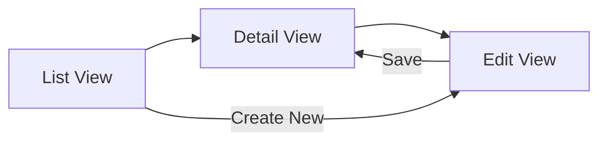

# 000. Feature Specification Template

> [!TIP]
> **Usage**: Copy this file and rename it within the Category 600–800 range (e.g., `600_feature_payment.md`).
> Completing each section **explicitly defines "what constitutes done."**
> Following the Blueprint First principle, **complete this template before writing code.**

> [!IMPORTANT]
> **SDD Core**: This template realizes Axiarch's "Blueprint First" at the feature level.
> Features without defined Acceptance Criteria **must not begin implementation.**

---

## 📑 Table of Contents

1. [Feature Overview](#1-feature-overview)
2. [User Stories](#2-user-stories)
3. [Acceptance Criteria](#3-acceptance-criteria)
4. [Non-Functional Requirements](#4-non-functional-requirements)
5. [Edge Cases & Constraints](#5-edge-cases--constraints)
6. [Data Model](#6-data-model)
7. [API Design](#7-api-design)
8. [UI/UX Wireframe](#8-uiux-wireframe)
9. [Security Considerations](#9-security-considerations)
10. [Test Strategy](#10-test-strategy)
11. [Release Strategy](#11-release-strategy)
12. [Appendix A: Quick Reference Index & Cross-References](#appendix-a-quick-reference-index--cross-references)

---

## 1. Feature Overview

*   **Feature Name**: [Feature Name]
*   **Problem**:
    *   [What problem does this feature solve? What pain does the user experience today?]
*   **Solution**:
    *   [How does this feature solve the problem?]
*   **Success Metrics**:
    *   [What metrics indicate this feature is successful after release?]
    *   Example: "User completion rate for ○○ increases by X%"

---

## 2. User Stories

> Clearly define "who," "what they want to do," and "why."

### US-001: [Story Title]
*   **As a** [role (e.g., end user / admin / system)],
*   **I want** [desired action],
*   **So that** [value / purpose].

### US-002: [Story Title]
*   **As a** [role],
*   **I want** [action],
*   **So that** [purpose].

---

## 3. Acceptance Criteria

> [!CAUTION]
> **Implementation MUST NOT begin with this section empty.**
> Acceptance Criteria are the "Definition of Done" for the feature.

### Acceptance Criteria for US-001

| ID | Given (Precondition) | When (Action) | Then (Expected Result) | Priority |
|:---|:--------------------|:-------------|:----------------------|:---------|
| AC-001 | [precondition] | [user action] | [expected system behavior] | Must |
| AC-002 | [precondition] | [action] | [expected result] | Must |
| AC-003 | [precondition] | [action] | [expected result] | Should |

### Acceptance Criteria for US-002

| ID | Given | When | Then | Priority |
|:---|:------|:-----|:-----|:---------|
| AC-004 | [precondition] | [action] | [expected result] | Must |

---

## 4. Non-Functional Requirements

> Only document requirements **specific to this feature** that exceed Universal Rule baselines.
> If Universal baselines are sufficient, note "Universal compliant" and omit.

| Category | Requirement | Target | Reference Universal |
|:---------|:-----------|:-------|:-------------------|
| **Performance** | [e.g., API response time] | [e.g., ≤ 200ms] | `engineering/000_engineering_standards` §2.2 |
| **Scalability** | [e.g., concurrent connections] | [e.g., 1,000 req/s] | — |
| **Availability** | [e.g., SLA] | [e.g., 99.9%] | `operations/400_site_reliability` |
| **Accessibility** | [e.g., WCAG compliance level] | [e.g., AA] | `design/000_design_ux` |

---

## 5. Edge Cases & Constraints

> Pre-identify not just "happy paths" but "error cases" and "boundary values."

### Edge Cases

| ID | Scenario | Expected Behavior |
|:---|:---------|:-----------------|
| EC-001 | [e.g., User submits same form in 2 tabs simultaneously] | [e.g., Second submission returns duplicate error] |
| EC-002 | [e.g., Input value is empty string] | [e.g., Display validation error] |
| EC-003 | [e.g., Operation during network disconnection] | [e.g., Save to offline queue, resend on recovery] |

### Constraints

*   **Technical**: [e.g., Supabase RLS prevents direct client access]
*   **Business**: [e.g., Free plan users limited to 5 per month]
*   **Regulatory**: [e.g., GDPR requires data deletion within 30 days]

---

## 6. Data Model

> Draft table design. Obtain consensus before creating migration files.

### Table: `[table_name]`

| Column | Type | Nullable | Default | Description |
|:-------|:-----|:---------|:--------|:-----------|
| `id` | `uuid` | No | `gen_random_uuid()` | Primary key |
| `user_id` | `uuid` | No | — | FK → `auth.users` |
| `[column]` | `[type]` | [Yes/No] | [default] | [description] |
| `created_at` | `timestamptz` | No | `now()` | Created timestamp |

### RLS Policies

| Policy Name | Operation | Condition |
|:-----------|:----------|:----------|
| `select_own` | SELECT | `auth.uid() = user_id` |
| `insert_own` | INSERT | `auth.uid() = user_id` |

### Indexes

| Index Name | Columns | Type |
|:----------|:--------|:-----|
| `idx_[table]_user_id` | `user_id` | btree |

---

## 7. API Design

> Design for Server Actions / Route Handlers / Edge Functions.

### Action: `[actionName]`

| Item | Detail |
|:-----|:-------|
| **Type** | Server Action / Route Handler / Edge Function |
| **Auth** | Required / None / Admin only |
| **Input Schema** | `z.object({ ... })` |
| **Output DTO** | `{ success: boolean, data?: T, error?: string }` |
| **Error Cases** | [Expected errors and HTTP status codes] |

---

## 8. UI/UX Wireframe

> Text-based wireframes or screen transition diagrams.

### Screen List

| Screen | Path | Access | Description |
|:-------|:-----|:-------|:-----------|
| [Screen name] | `/path/to/page` | Public / Auth Required / Admin | [What can the user do here?] |

### Screen Transition Diagram

---

## 9. Security Considerations

> Feature-specific risks and mitigations beyond `security/000_security_privacy` baselines.

| Risk | Mitigation | Reference Universal |
|:-----|:----------|:-------------------|
| [e.g., Unauthorized data access] | [e.g., RLS validating `user_id`] | `security/000_security_privacy` |
| [e.g., DoS via mass requests] | [e.g., Rate Limiting applied] | `engineering/100_api_integration` |
| [e.g., PII leakage] | [e.g., DTO excludes sensitive fields] | `engineering/000_engineering_standards` §13.1 |

---

## 10. Test Strategy

> Feature-specific test plan beyond `quality/000_qa_testing` baselines.

### Test Matrix

| Test Type | Target | Expected Result | Priority |
|:----------|:-------|:---------------|:---------|
| **Unit** | [e.g., Validation logic] | [e.g., Error on invalid input] | Must |
| **Integration** | [e.g., DB write → read round-trip] | [e.g., Data matches] | Must |
| **E2E** | [e.g., Form input → save → list display] | [e.g., Success] | Should |
| **Security** | [e.g., Access another user's data] | [e.g., 403/empty array] | Must |

---

## 11. Release Strategy

| Item | Detail |
|:-----|:-------|
| **Feature Flag** | [e.g., `FF_PAYMENT_V2` / Not required] |
| **Staged Rollout** | [e.g., Internal test → β → Full rollout] |
| **Rollback Plan** | [e.g., Feature Flag OFF for immediate disable] |
| **Required Migrations** | [e.g., `20260401_create_payments_table.sql`] |
| **Monitoring** | [e.g., Error rate, latency, conversion rate] |

---

## Appendix A: Quick Reference Index & Cross-References

### Quick Reference Index (Keyword → Section)

| Keyword | Section |
|:--------|:--------|
| User story, persona, role | §2 User Stories |
| Acceptance criteria, definition of done, Given/When/Then | §3 Acceptance Criteria |
| Performance, SLA, scalability | §4 Non-Functional Requirements |
| Boundary values, error cases, offline | §5 Edge Cases |
| Table design, RLS, indexes | §6 Data Model |
| Server Action, DTO, validation | §7 API Design |
| Screen design, screen transitions | §8 UI/UX |
| Security, PII, Rate Limiting | §9 Security |
| Testing, E2E, coverage | §10 Test Strategy |
| Feature Flag, staged rollout, rollback | §11 Release Strategy |

### Cross-References (Section → Universal Rules)

| Section | Related Universal Rules |
|:--------|:----------------------|
| §1 Feature Overview | `product/000_product_strategy` |
| §2 User Stories | `product/000_product_strategy`, `design/000_design_ux` |
| §3 Acceptance Criteria | `quality/000_qa_testing` |
| §4 Non-Functional Requirements | `engineering/000_engineering_standards`, `operations/400_site_reliability` |
| §5 Edge Cases | `quality/000_qa_testing`, `operations/500_incident_response` |
| §6 Data Model | `engineering/200_supabase_architecture`, `security/100_data_governance` |
| §7 API Design | `engineering/100_api_integration`, `engineering/000_engineering_standards` §13.1–§13.3 |
| §8 UI/UX | `design/000_design_ux`, `engineering/300_web_frontend` |
| §9 Security | `security/000_security_privacy`, `engineering/000_engineering_standards` §3.0–§3.5 |
| §10 Test Strategy | `quality/000_qa_testing` |
| §11 Release Strategy | `engineering/000_engineering_standards` §13.13, `operations/400_site_reliability` |
