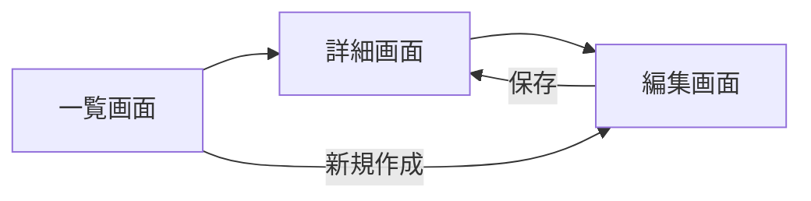

# 000. 機能仕様テンプレート (Feature Specification Template)

> [!TIP]
> **使い方**: このファイルをコピーし、Category 600–800 の番号帯でリネームしてください（例: `600_feature_payment.md`）。
> 各セクションを埋めることで、**「何をもって完了とするか」が明文化**されます。
> Blueprint First の原則に従い、**コードを書く前に**このテンプレートを完成させてください。

> [!IMPORTANT]
> **SDD（仕様駆動開発）の核**: このテンプレートは Axiarch の「Blueprint First」を機能単位で実現するものです。
> 受け入れ条件（Acceptance Criteria）が定義されていない機能は、**実装を開始してはなりません**。

---

## 📑 目次 (Table of Contents)

1. [機能概要](#1-機能概要-feature-overview)
2. [ユーザーストーリー](#2-ユーザーストーリー-user-stories)
3. [受け入れ条件](#3-受け入れ条件-acceptance-criteria)
4. [非機能要件](#4-非機能要件-non-functional-requirements)
5. [エッジケースと制約](#5-エッジケースと制約-edge-cases--constraints)
6. [データモデル](#6-データモデル-data-model)
7. [API設計](#7-api設計-api-design)
8. [UI/UXワイヤーフレーム](#8-uiuxワイヤーフレーム-uiux-wireframe)
9. [セキュリティ考慮事項](#9-セキュリティ考慮事項-security-considerations)
10. [テスト戦略](#10-テスト戦略-test-strategy)
11. [リリース戦略](#11-リリース戦略-release-strategy)
12. [Appendix A: 逆引き索引 & クロスリファレンス](#appendix-a-逆引き索引--クロスリファレンス)

---

## 1. 機能概要 (Feature Overview)

*   **機能名**: [Feature Name]
*   **課題 (Problem)**:
    *   [この機能が解決する問題は何か？ユーザーは今、何に困っているか？]
*   **解決策 (Solution)**:
    *   [この機能はどのように問題を解決するか？]
*   **成功指標 (Success Metrics)**:
    *   [この機能がリリースされた後、何をもって成功と判断するか？]
    *   例: 「ユーザーの○○完了率が X% 向上する」

---

## 2. ユーザーストーリー (User Stories)

> 「誰が」「何をしたくて」「なぜそうするか」を明確にする。

### US-001: [ストーリータイトル]
*   **As a** [ロール（例: 一般ユーザー / 管理者 / システム）],
*   **I want** [達成したいアクション],
*   **So that** [得られる価値・目的].

### US-002: [ストーリータイトル]
*   **As a** [ロール],
*   **I want** [アクション],
*   **So that** [目的].

---

## 3. 受け入れ条件 (Acceptance Criteria)

> [!CAUTION]
> **このセクションが空の状態で実装を開始してはならない。**
> 受け入れ条件は機能の「完了の定義（Definition of Done）」である。

### US-001 の受け入れ条件

| ID | Given（前提条件） | When（操作） | Then（期待結果） | 優先度 |
|:---|:-----------------|:------------|:---------------|:------|
| AC-001 | [前提条件] | [ユーザーが行う操作] | [システムの期待動作] | Must |
| AC-002 | [前提条件] | [操作] | [期待結果] | Must |
| AC-003 | [前提条件] | [操作] | [期待結果] | Should |

### US-002 の受け入れ条件

| ID | Given | When | Then | 優先度 |
|:---|:------|:-----|:-----|:------|
| AC-004 | [前提条件] | [操作] | [期待結果] | Must |

---

## 4. 非機能要件 (Non-Functional Requirements)

> Universal ルールの基準を上回る、**この機能固有の**非機能要件のみ記載する。
> Universal 基準で十分な場合は「Universal 準拠」と記載し、割愛してよい。

| カテゴリ | 要件 | 基準値 | 参照Universal |
|:--------|:-----|:------|:-------------|
| **パフォーマンス** | [例: API応答時間] | [例: ≤ 200ms] | `engineering/000_engineering_standards` §2.2 |
| **スケーラビリティ** | [例: 同時接続数] | [例: 1,000 req/s] | — |
| **可用性** | [例: SLA] | [例: 99.9%] | `operations/400_site_reliability` |
| **アクセシビリティ** | [例: WCAG準拠レベル] | [例: AA] | `design/000_design_ux` |

---

## 5. エッジケースと制約 (Edge Cases & Constraints)

> 「正常系」だけでなく「異常系」「境界値」を事前に洗い出す。

### エッジケース

| ID | シナリオ | 期待動作 |
|:---|:--------|:--------|
| EC-001 | [例: ユーザーが同時に2つのタブで同じフォームを送信した場合] | [例: 2回目は重複エラーを返す] |
| EC-002 | [例: 入力値が空文字の場合] | [例: バリデーションエラーを表示] |
| EC-003 | [例: ネットワーク切断中に操作した場合] | [例: オフラインキューに保存し、復旧時に再送] |

### 制約事項

*   **技術的制約**: [例: Supabaseの行レベルセキュリティにより、クライアントから直接アクセス不可]
*   **ビジネス制約**: [例: Free プランユーザーは月5回まで]
*   **法規制**: [例: GDPRにより30日以内のデータ削除義務]

---

## 6. データモデル (Data Model)

> テーブル設計のドラフト。マイグレーションファイル作成前に合意を得る。

### テーブル: `[table_name]`

| カラム名 | 型 | Nullable | デフォルト | 説明 |
|:--------|:---|:---------|:----------|:-----|
| `id` | `uuid` | No | `gen_random_uuid()` | 主キー |
| `user_id` | `uuid` | No | — | FK → `auth.users` |
| `[column]` | `[type]` | [Yes/No] | [default] | [説明] |
| `created_at` | `timestamptz` | No | `now()` | 作成日時 |

### RLSポリシー

| ポリシー名 | 操作 | 条件 |
|:----------|:-----|:-----|
| `select_own` | SELECT | `auth.uid() = user_id` |
| `insert_own` | INSERT | `auth.uid() = user_id` |

### インデックス

| インデックス名 | カラム | 種類 |
|:-------------|:------|:-----|
| `idx_[table]_user_id` | `user_id` | btree |

---

## 7. API設計 (API Design)

> Server Actions / Route Handlers / Edge Functions の設計。

### Action: `[actionName]`

| 項目 | 詳細 |
|:-----|:-----|
| **種別** | Server Action / Route Handler / Edge Function |
| **認証** | 必須 / 不要 / 管理者のみ |
| **入力スキーマ** | `z.object({ ... })` |
| **出力DTO** | `{ success: boolean, data?: T, error?: string }` |
| **エラーケース** | [想定されるエラーとHTTPステータス] |

---

## 8. UI/UXワイヤーフレーム (UI/UX Wireframe)

> テキストベースのワイヤーフレームまたは画面遷移図。

### 画面一覧

| 画面名 | パス | 種別 | 概要 |
|:-------|:----|:-----|:-----|
| [画面名] | `/path/to/page` | 公開 / 認証必須 / 管理者 | [この画面で何ができるか] |

### 画面遷移図

---

## 9. セキュリティ考慮事項 (Security Considerations)

> `security/000_security_privacy` の基準に加え、この機能固有のリスクと対策。

| リスク | 対策 | 参照Universal |
|:-------|:-----|:-------------|
| [例: 不正なユーザーによるデータ閲覧] | [例: RLSで `user_id` を検証] | `security/000_security_privacy` |
| [例: 大量リクエストによるDoS] | [例: Rate Limiting 適用] | `engineering/100_api_integration` |
| [例: PII漏洩] | [例: DTO で機密フィールドを除外] | `engineering/000_engineering_standards` §13.1 |

---

## 10. テスト戦略 (Test Strategy)

> `quality/000_qa_testing` の基準に加え、この機能固有のテスト計画。

### テストマトリクス

| テスト種別 | 対象 | 期待結果 | 優先度 |
|:----------|:-----|:--------|:------|
| **Unit** | [例: バリデーションロジック] | [例: 不正入力でエラー] | Must |
| **Integration** | [例: DB書き込み→読み取りの Round-Trip] | [例: データ一致] | Must |
| **E2E** | [例: フォーム入力→保存→一覧表示] | [例: 正常完了] | Should |
| **Security** | [例: 他ユーザーのデータにアクセス] | [例: 403/空配列] | Must |

---

## 11. リリース戦略 (Release Strategy)

| 項目 | 内容 |
|:-----|:-----|
| **Feature Flag** | [例: `FF_PAYMENT_V2` / 不要] |
| **段階展開** | [例: 内部テスト → β → 全展開] |
| **ロールバック計画** | [例: Feature Flag OFF で即時無効化] |
| **依存するマイグレーション** | [例: `20260401_create_payments_table.sql`] |
| **監視項目** | [例: エラー率、レイテンシ、コンバージョン率] |

---

## Appendix A: 逆引き索引 & クロスリファレンス

### 逆引き索引（キーワード → セクション）

| キーワード | 対応セクション |
|:----------|:-------------|
| ユーザーストーリー・ペルソナ・ロール | §2 ユーザーストーリー |
| 受け入れ条件・完了定義・Given/When/Then | §3 受け入れ条件 |
| パフォーマンス・SLA・スケーラビリティ | §4 非機能要件 |
| 境界値・異常系・オフライン | §5 エッジケース |
| テーブル設計・RLS・インデックス | §6 データモデル |
| Server Action・DTO・バリデーション | §7 API設計 |
| 画面設計・画面遷移 | §8 UI/UX |
| セキュリティ・PII・Rate Limiting | §9 セキュリティ |
| テスト・E2E・カバレッジ | §10 テスト戦略 |
| Feature Flag・段階展開・ロールバック | §11 リリース戦略 |

### クロスリファレンス（セクション → Universal ルール）

| セクション | 関連 Universal ルール |
|:----------|:--------------------|
| §1 機能概要 | `product/000_product_strategy` |
| §2 ユーザーストーリー | `product/000_product_strategy`, `design/000_design_ux` |
| §3 受け入れ条件 | `quality/000_qa_testing` |
| §4 非機能要件 | `engineering/000_engineering_standards`, `operations/400_site_reliability` |
| §5 エッジケース | `quality/000_qa_testing`, `operations/500_incident_response` |
| §6 データモデル | `engineering/200_supabase_architecture`, `security/100_data_governance` |
| §7 API設計 | `engineering/100_api_integration`, `engineering/000_engineering_standards` §13.1–§13.3 |
| §8 UI/UX | `design/000_design_ux`, `engineering/300_web_frontend` |
| §9 セキュリティ | `security/000_security_privacy`, `engineering/000_engineering_standards` §3.0–§3.5 |
| §10 テスト | `quality/000_qa_testing` |
| §11 リリース | `engineering/000_engineering_standards` §13.13, `operations/400_site_reliability` |
