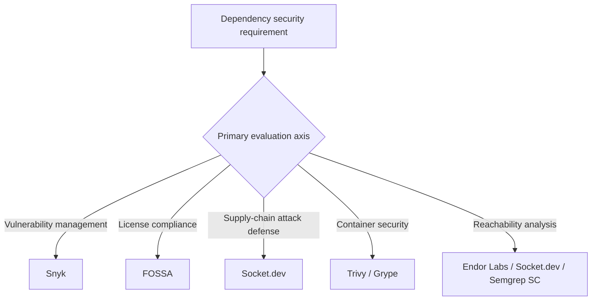
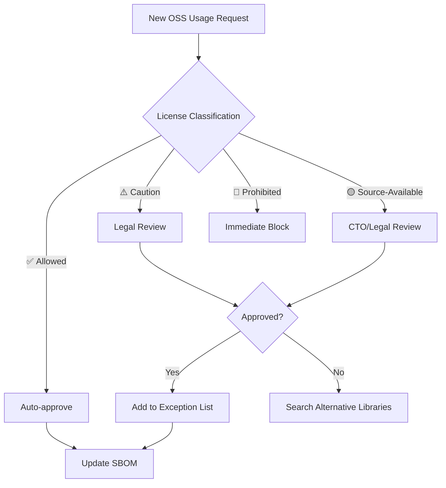
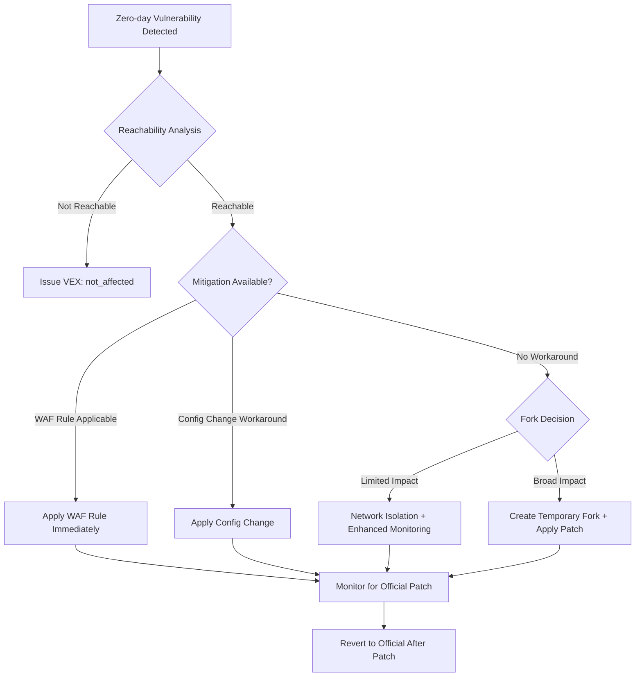
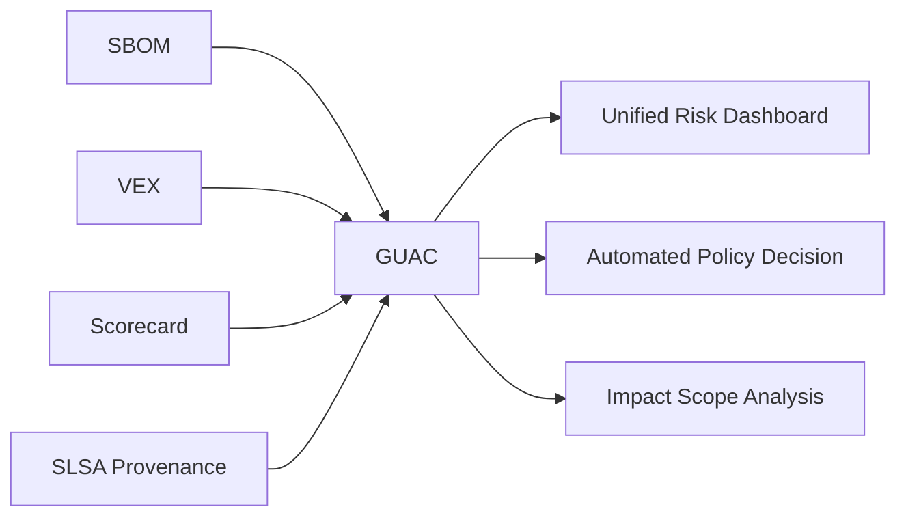
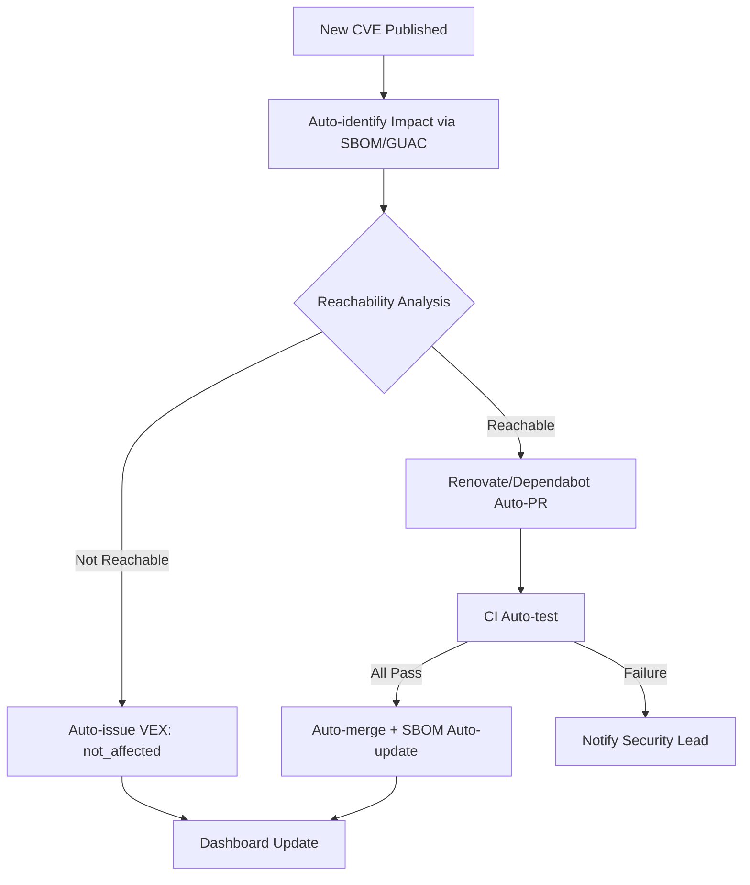
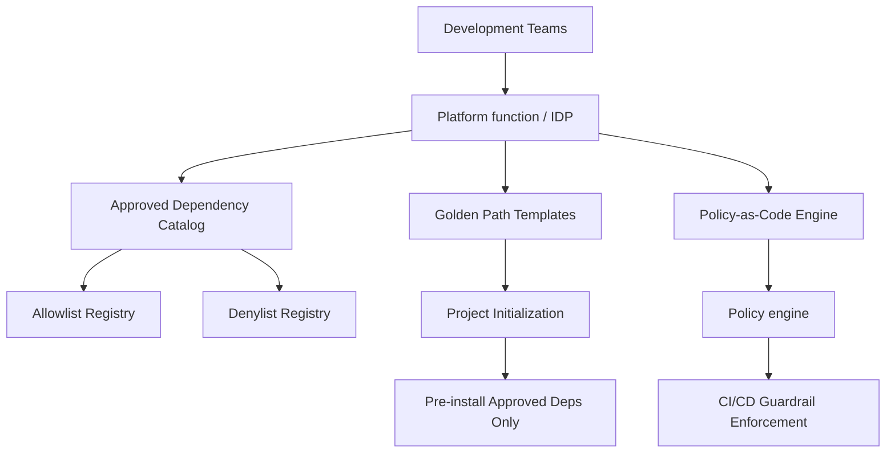
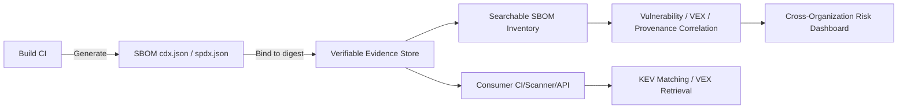

# 62. License & Dependency Management

> [!CAUTION]
> **This file is a Universal Rule (Immutable). Editing is prohibited unless an explicit "Amend Constitution" instruction is given.**
> Last Updated: 2026-07-23 (v5: programming-language ecosystem expansion)

> [!IMPORTANT]
> **Primary Directive**
> "Every dependency is a trust decision — unmanaged licenses are legal time bombs."
> All third-party dependencies must be audited, approved, and continuously monitored.
> Strictly follow: **License Compliance > Security > Stability > Convenience**.
> Universal application contract: License classes, vendor tools, VCS events, job titles, headcount, deadlines, cadences, and score thresholds are reference implementations or Blueprint parameters unless they come from applicable law or contract, an official deadline, or a safety floor for irrecoverable risk. The Project Blueprint derives policy from distribution and network-use models, jurisdiction, exposure, reachability, KEV and EPSS, data sensitivity, and organization scale, and permits equivalent capabilities and accountable functions whose duties may be combined.
> **63 Sections (v4: §59-§63 newly added + §29 structural bug fixed + NIS2, AI IDE SCA, SBOM Federation, ML BOM, Dependency SLO coverage).**

---

## Table of Contents

| § | Section |
|---|---|
| 1 | [License Classification & Policy](#1-license-classification--policy) |
| 2 | [License Compatibility Matrix](#2-license-compatibility-matrix) |
| 3 | [AI/ML Model Licensing](#3-aiml-model-licensing) |
| 4 | [Container Image License Management](#4-container-image-license-management) |
| 5 | [IaC Module & Action Licensing](#5-iac-module--action-licensing) |
| 6 | [Font & Media Asset Licensing](#6-font--media-asset-licensing) |
| 7 | [SBOM (Software Bill of Materials)](#7-sbom-software-bill-of-materials) |
| 8 | [SBOM Regulatory Compliance](#8-sbom-regulatory-compliance) |
| 9 | [Supply Chain Security Foundation](#9-supply-chain-security-foundation) |
| 10 | [SCA Tool Integration](#10-sca-tool-integration) |
| 11 | [CI Pipeline Guardrails](#11-ci-pipeline-guardrails) |
| 12 | [Dependency Selection Criteria](#12-dependency-selection-criteria) |
| 13 | [Bundle Size & Performance Impact](#13-bundle-size--performance-impact) |
| 14 | [Lockfile Integrity](#14-lockfile-integrity) |
| 15 | [Automated Update Strategy (Renovate / Dependabot)](#15-automated-update-strategy-renovate--dependabot) |
| 16 | [Security Patch SLA](#16-security-patch-sla) |
| 17 | [Monorepo Dependency Management](#17-monorepo-dependency-management) |
| 18 | [Private Registry / Artifactory](#18-private-registry--artifactory) |
| 19 | [Transitive Dependency Management](#19-transitive-dependency-management) |
| 20 | [EOL / Deprecated Package Management](#20-eol--deprecated-package-management) |
| 21 | [Attribution & NOTICE Generation](#21-attribution--notice-generation) |
| 22 | [OSPO (Open Source Program Office)](#22-ospo-open-source-program-office) |
| 23 | [Dependency Compromise Incident Response](#23-dependency-compromise-incident-response) |
| 24 | [Audit & Reporting](#24-audit--reporting) |
| 25 | [FinOps: Dependency Cost Optimization](#25-finops-dependency-cost-optimization) |
| 26 | [OpenSSF Scorecard Integration](#26-openssf-scorecard-integration) |
| 27 | [Dependency Confusion Attack Defense](#27-dependency-confusion-attack-defense) |
| 28 | [VEX (Vulnerability Exploitability eXchange)](#28-vex-vulnerability-exploitability-exchange) |
| 29 | [CBOM (Cryptographic Bill of Materials)](#29-cbom-cryptographic-bill-of-materials) |
| 30 | [Multi-Ecosystem Dependency Management](#30-multi-ecosystem-dependency-management) |
| 31 | [Package Publishing Security and Workload Identity](#31-package-publishing-security-and-workload-identity) |
| 32 | [GitHub Dependency Review Integration](#32-github-dependency-review-integration) |
| 33 | [OSS Legal Risk Management](#33-oss-legal-risk-management) |
| 34 | [Zero-Day Dependency Response Playbook](#34-zero-day-dependency-response-playbook) |
| 35 | [AI-Generated Code License Risk](#35-ai-generated-code-license-risk) |
| 36 | [Slopsquatting / AI Package Hallucination Defense](#36-slopsquatting--ai-package-hallucination-defense) |
| 37 | [SBOM Long-Term Retention & CRA Technical Documentation](#37-sbom-long-term-retention--cra-technical-documentation) |
| 38 | [Runtime Dependency Monitoring (Runtime SCA)](#38-runtime-dependency-monitoring-runtime-sca) |
| 39 | [Dependency Minimization Principle](#39-dependency-minimization-principle) |
| 40 | [Supply Chain Incident Case Database](#40-supply-chain-incident-case-database) |
| 41 | [Dependency Governance Maturity Model](#41-dependency-governance-maturity-model) |
| 42 | [License Laundering Defense](#42-license-laundering-defense) |
| 43 | [Remote Dynamic Dependencies (RDD) Defense](#43-remote-dynamic-dependencies-rdd-defense) |
| 44 | [DORA ICT Supply Chain Requirements](#44-dora-ict-supply-chain-requirements) |
| 45 | [Continuous Verification](#45-continuous-verification) |
| 46 | [OpenSSF GUAC Integration](#46-openssf-guac-integration) |
| 47 | [Maintainer Burnout Risk Mitigation](#47-maintainer-burnout-risk-mitigation) |
| 48 | [Automated Dependency Security Response](#48-automated-dependency-security-response) |
| 49 | [Developer Security Education & Awareness](#49-developer-security-education--awareness) |
| 50 | [WebAssembly / Native Binary Dependency Management](#50-webassembly--native-binary-dependency-management) |
| 51 | [Platform Engineering / IDP Dependency Governance](#51-platform-engineering--idp-dependency-governance) |
| 52 | [LLM / AI Toolchain Dependency Management](#52-llm--ai-toolchain-dependency-management) |
| 53 | [Green Engineering: Carbon-Optimized Dependency Management](#53-green-engineering-carbon-optimized-dependency-management) |
| **54** | [**CISA KEV Integration & EPSS-Driven Vulnerability Prioritization**](#54-cisa-kev-integration--epss-driven-vulnerability-prioritization) |
| **55** | [**EU AI Act Technical Documentation (Training Data License Tracking)**](#55-eu-ai-act-technical-documentation-training-data-license-tracking) |
| **56** | [**Reproducible Builds & Hermetic Repository Standard**](#56-reproducible-builds--hermetic-repository-standard) |
| **57** | [**SBOM Quality Maturity Model**](#57-sbom-quality-maturity-model) |
| **58** | [**Next-Generation Package Manager Governance (uv / Bun / cargo-auditable)**](#58-next-generation-package-manager-governance-uv--bun--cargo-auditable) |
| **59** | [**NIS2 Directive: Applicability and Software Supply Chain**](#59-nis2-directive-applicability-and-software-supply-chain) |
| **60** | [**AI IDE-Integrated Real-Time SCA**](#60-ai-ide-integrated-real-time-sca) |
| **61** | [**SBOM Federation (OCI Artifact Reference Pattern)**](#61-sbom-federation-oci-artifact-reference-pattern) |
| **62** | [**ML BOM (Machine Learning Bill of Materials)**](#62-ml-bom-machine-learning-bill-of-materials) |
| **63** | [**Dependency SLO / Error Budget Management**](#63-dependency-slo--error-budget-management) |
| A | [Appendix A: Quick Reference Index](#appendix-a-quick-reference-index) |
| B | [Appendix B: Change Summary (v2/v3/v4 Additions)](#appendix-b-change-summary-v2v3v4-additions) |

---

## §1. License Classification & Policy

### 1.1 Three-Tier Classification

> The following is a reference profile for building organization policy, not a Universal legal determination. An accountable license or legal-risk owner classifies the actual license text and version against distribution, network use, linking and modification, customer contracts, jurisdictions, and intellectual-property policy.

**✅ Lower-Friction Candidates (commonly allowed after obligation review)**:

| License | Baseline Profile Treatment | Notes |
|:--------|:-----|:------|
| MIT | Lower-friction candidate | Permissive terms. Commercial use allowed. Confirm attribution |
| Apache-2.0 | Lower-friction candidate | Includes patent terms. Commercial use allowed. Confirm NOTICE retention |
| BSD-2-Clause | Lower-friction candidate | Commercial use allowed. Confirm copyright and disclaimer notices |
| BSD-3-Clause | Lower-friction candidate | Commercial use allowed. Confirm name-use restriction |
| ISC | Lower-friction candidate | Concise permissive terms. Confirm notice obligations |
| CC0-1.0 | Lower-friction candidate | Confirm public-domain dedication and jurisdictional differences |
| 0BSD | Lower-friction candidate | Confirm the no-attribution terms in the license text |
| Unlicense | Jurisdiction review | Confirm public-domain dedication and jurisdictional differences |
| Zlib | Lower-friction candidate | Commercial use allowed. Confirm notice and alteration marking |
| PSF-2.0 | Lower-friction candidate | Permissive Python-origin terms. Confirm the in-scope component |

**⚠️ Conditional Review (allow, review, or deny depends on use)**:

| License | Risk | Action |
|:--------|:-----|:-------|
| LGPL-2.1 / LGPL-3.0 | ⚠️ Conditional | Review linking, modification, relinking, notices, and source-offer duties |
| MPL-2.0 | ⚠️ Conditional | File-level copyleft. Legal review + exception approval |
| EPL-2.0 | ⚠️ Conditional | Module-level copyleft. Legal review |
| CDDL-1.0 | ⚠️ Conditional | File-level copyleft. Legal review |
| Artistic-2.0 | ⚠️ Conditional | Perl-derived. Name change obligation on modification |
| CC-BY-4.0 | ⚠️ Conditional | For documentation/data, not code |
| CC-BY-SA-4.0 | ⚠️ Conditional | ShareAlike condition. Legal review |
| EUPL-1.2 | ⚠️ Conditional | EU public license. Copyleft compatibility clause. Check compatible license list |

**🔴 Higher Obligations or Restrictions (organization-policy review or deny candidates)**:

| License | Risk | Reason |
|:--------|:-----|:-------|
| GPL-2.0 / GPL-3.0 | 🔴 High | Obtain specialist review of conveyance, linking, derivative-work scope, and corresponding-source duties |
| AGPL-3.0 | 🔴 Highest | Review section 13 network-user source-offer duties for modified versions and the integration boundary |
| SSPL | 🔴 Highest | OSI-unapproved source-available terms with additional service-source requirements |
| CC-BY-NC-* | 🔴 High | Confirm that non-commercial restrictions fit the intended use |
| CC-BY-ND-* | 🔴 High | Confirm that no-derivatives restrictions fit conversion, translation, editing, and distribution |
| CAL-1.0 | 🔴 High | Obtain specialist review of strong reciprocity and user-data-related duties |

### 1.2 Source-Available License Handling

| License | Classification | Notes |
|:--------|:-------------|:------|
| BSL-1.1 (Business Source License) | 🔴 Review or deny candidate | Review pre-Change-Date restrictions and the stated Change License |
| FSL-1.1 (Functional Source License) | 🔴 Review or deny candidate | Review pre-Change-Date competitive-use restrictions and the future license |
| Elastic License 2.0 | 🔴 Review or deny candidate | Compare managed-service and redistribution restrictions with the intended use |
| PolyForm Shield 1.0.0 | 🔴 Review or deny candidate | Compare competitive-use restrictions with the intended use |
| BUSL (MariaDB BSL) | 🔴 Review or deny candidate | Review the adopted component's actual Business Source License text and Change Date |

> [!CAUTION]
> Source-Available licenses mean "source code is visible ≠ OSS." They are NOT OSI-approved and MUST NOT be treated like traditional open source.

### 1.3 Dual Licensing Strategy

- **Rule**: For dual licensing, select a license that is actually available and compatible with the intended use, distribution, and modification. Package metadata describes the component's license and does not replace the organization's selection record
- **Rule**: Even when copyleft and permissive choices exist, evaluate commercial support, patent terms, and redistribution conditions instead of selecting from the label alone
- **Rule**: Record the selected license, component version, rationale, owner, and evidence in a version-controlled decision record, SBOM property, license inventory, or equivalent mechanism. No fixed directory name is required

→ Cross-reference: [`security/100_data_governance.md`](../security/100_data_governance.md) §GenAI Copyright

---

## §2. License Compatibility Matrix

### 2.1 Compatibility Rules

Do not infer compatibility from a license name or linking mode alone. An accountable owner records the decision from the license text for the adopted version, exceptions, modifications, combination, distribution, network use, jurisdiction, and customer contracts.

| Use or output form | Required decision |
|:-------------------|:------------------|
| Source inclusion, static linking, native binary, WebAssembly | Determine combined-work scope, modifications, object or source delivery, relinking, notices, and patent terms |
| Dynamic linking, plug-ins, FFI, IPC, service boundary | Do not infer separation from the linking label; assess processes, interfaces, shared data structures, distribution units, and license exceptions |
| Hosted service, SaaS, API | Assess network-use triggers, modified versions, source offers to users, and service restrictions per license. Do not universally exclude AGPL or source-available terms |
| Container, VM, firmware distribution | Assess licenses and source or notice duties for the base, OS packages, runtime, drivers, models, and every layer of the release artifact |
| Package, SDK, CLI, or library publication | Assess direct and transitive dependencies, bundled and generated code, runtime fetches, dual licenses, and duties passed to consumers |
| Internal-only use | Record the no-distribution assumption and define triggers for remote users, affiliates, contractors, or delivery into a customer environment |

> This section is not legal advice. Route ambiguous license expressions, compound licenses, exceptions, strong copyleft, source-available terms, and trademark or patent conditions to the organization's license specialist or legal function under policy.

### 2.2 Policy-Driven Automated Detection

Automation detects licenses and evaluates them against organizational policy. It does not decide legal compatibility through string matching. A scanner that cannot parse SPDX expression `AND`, `OR`, `WITH`, `LicenseRef`, dual licensing, and package-specific exceptions sends the result to review.

```yaml
# Reference implementation. Replace the VCS, scanner, and command
- name: License Compatibility Check
  run: |
    license-inventory --format json > licenses.json
    policy-engine evaluate \
      --policy .governance/license-policy.json \
      --input licenses.json \
      --require-complete-inventory
```

```json
{
  "schemaVersion": 1,
  "defaultDecision": "review",
  "profiles": {
    "internal-service": {
      "allow": ["ORG_APPROVED_SPDX_EXPRESSIONS"],
      "review": ["ORG_REVIEW_SPDX_EXPRESSIONS"],
      "deny": ["ORG_DENIED_SPDX_EXPRESSIONS"]
    }
  },
  "exceptions": [
    {
      "component": "pkg:ecosystem/name@version",
      "decision": "allow",
      "owner": "license-risk-owner",
      "expiresAt": "YYYY-MM-DD",
      "evidence": "decision-record-id"
    }
  ]
}
```

- **Rule**: Version policy by distribution model, product profile, jurisdiction, license version, and exception expiry, and distribute the same decision data to scanners and IDE controls
- **Rule**: Send missing, unknown, `NOASSERTION`, non-standard text, and unparseable expressions to review instead of silently allowing them
- **Rule**: A blocking result identifies the component, resolved version, license expression, use path, policy rule, owner, and remediation or expiring exception

→ Cross-reference: [`security/000_security_privacy.md`](../security/000_security_privacy.md) §Supply Chain Security

---

## §3. AI/ML Model Licensing

### 3.1 Model Weight License Classification

| License | Commercial | Modify | Redistribute | Notes |
|:--------|:----------|:-------|:------------|:------|
| Apache-2.0 (Llama 3, etc.) | ✅ | ✅ | ✅ | User count limit (Meta: 700M MAU) |
| Gemma Terms of Use | ✅ | ✅ | ⚠️ | Subject to Google Terms |
| OpenRAIL-M | ✅ | ✅ | ⚠️ | Responsible AI use restrictions |
| CC-BY-NC-4.0 | ❌ | ✅ | ⚠️ | Non-commercial. Research only |
| Llama 2 Community License | ✅ | ✅ | ⚠️ | Separate contract required for 700M+ MAU |
| Mistral Research License | ❌ | ⚠️ | ❌ | Research use only |

### 3.2 Rules

- **Rule**: Verify license and Acceptable Use Policy before downloading model weights
- **Rule**: Confirm "derivative work" conditions of the original license before distributing fine-tuned models
- **Rule**: Monitor user counts monthly when model license defines MAU limits
- **Rule**: Monitor model license changes quarterly (e.g., Llama 2→3 license change)

→ Cross-reference: [`security/100_data_governance.md`](../security/100_data_governance.md) §GenAI Copyright, [`ai/000_ai_engineering.md`](../ai/000_ai_engineering.md)

---

## §4. Container Image License Management

### 4.1 Rules

- **Rule**: Always verify base image license (e.g., Alpine=MIT, Ubuntu=GPL mix, Distroless=Apache-2.0 recommended)
- **Rule**: Only packages in the final multi-stage build stage are subject to licensing
- **Rule**: Generate container SBOM with `syft` or `trivy` and auto-verify in CI

```bash
# Container SBOM generation
syft packages myapp:latest -o spdx-json > container-sbom.spdx.json
# License check
trivy image --scanners license --severity HIGH,CRITICAL myapp:latest
```

### 4.2 Base Image Selection Criteria

| Image | License Risk | Recommendation |
|:------|:-----------|:-------------|
| gcr.io/distroless | ✅ Low (Apache-2.0) | ⭐ Most recommended |
| chainguard/static | ✅ Low (Apache-2.0) | ⭐ Recommended (minimal attack surface) |
| alpine | ✅ Low (MIT) | ⭐ Recommended |
| debian-slim | ⚠️ Medium (GPL mix) | Allowed (attribution attention) |
| ubuntu | ⚠️ Medium (GPL mix) | Allowed (attribution attention) |

---

## §5. IaC Module & Action Licensing

### 5.1 Rules

- **Rule**: Verify license when adopting Terraform modules (registry/GitHub)
- **Rule**: Pin third-party GitHub Actions with **SHA pinning**
- **Rule**: Prefer official/Verified Creator actions over forks
- **Rule**: Helm chart licenses are also subject to review
- **Rule**: Understand the license difference between OpenTofu/Terraform (MPL-2.0 vs BSL-1.1) and determine project policy

```yaml
# ✅ Correct: SHA pinning
- uses: actions/checkout@b4ffde65f46336ab88eb53be808477a3936bae11 # v4.1.1

# ❌ Wrong: Tag only
- uses: actions/checkout@v4
```

→ Cross-reference: [`security/000_security_privacy.md`](../security/000_security_privacy.md) §Supply Chain

---

## §6. Font & Media Asset Licensing

### 6.1 Rules

- **Rule**: Google Fonts (OFL/Apache-2.0) are safe. Verify license when self-hosting
- **Rule**: Strictly follow seat and usage limits for commercial fonts (Adobe Fonts, etc.)
- **Rule**: Store stock image/icon license certificates in `licenses/` directory
- **Rule**: Provide attribution for CC-BY images in alt text or caption
- **Rule**: Verify copyright attribution for AI-generated images per service ToS (see §35)

| Asset Type | Safe Licenses | Licenses Requiring Attention |
|:----------|:-------------|:---------------------------|
| Fonts | OFL-1.1, Apache-2.0 | Commercial fonts (seat limits) |
| Icons | MIT, CC0 | CC-BY (attribution required) |
| Images | Unsplash License, CC0 | CC-BY-NC (no commercial use) |

→ Cross-reference: [`design/000_design_ux.md`](../design/000_design_ux.md)

---

## §7. SBOM (Software Bill of Materials)

### 7.1 SBOM Generation Mandate

- **Rule**: Auto-generate SBOM for all release builds (mandatory CI integration)
- **Rule**: Use **CycloneDX 1.6+** (security automation) or **SPDX 3.0+** (license compliance)
- **Rule**: Parallel generation of both formats recommended (complementary coverage)

### 7.2 SBOM Minimum Data Elements (CISA 2025 Standard)

| Field | Description | Required |
|:------|:-----------|:---------|
| Component Name | Package name | ✅ |
| Version | Version | ✅ |
| Supplier | Supplier/Vendor | ✅ |
| Component Hash | SHA-256 or equivalent | ✅ |
| License Information | SPDX identifier | ✅ |
| Dependency Relationship | Direct/transitive distinction | ✅ |
| Tool Name | SBOM generation tool name | ✅ |
| Generation Context | Timestamp, build ID | ✅ |
| Unique Identifier | PURL (Package URL) recommended | ✅ (2026~) |

### 7.3 SBOM Generation Snippet

```yaml
# .github/workflows/sbom.yml
sbom:
  runs-on: ubuntu-latest
  steps:
    - uses: actions/checkout@v4
    - run: npm ci
    - name: Generate CycloneDX SBOM
      run: npx @cyclonedx/cyclonedx-npm --output-file sbom.cdx.json
    - name: Generate SPDX SBOM
      run: |
        syft dir:. -o spdx-json > sbom.spdx.json
    - name: Upload SBOM artifacts
      uses: actions/upload-artifact@v4
      with:
        name: sbom-${{ github.sha }}
        path: |
          sbom.cdx.json
          sbom.spdx.json
        retention-days: 3650  # EU CRA 10-year retention requirement
```

### 7.4 SBOM Lifecycle Management

- **Rule**: Refresh SBOM not only per release, but per build when dependencies change
- **Rule**: Link SBOM to Git commit hash and CI/CD pipeline ID for traceability
- **Rule**: Apply SemVer to SBOM versioning, incrementing minor version on component changes
- **Rule**: Centrally manage SBOMs in a repository or platform (DependencyTrack, etc.)

→ Cross-reference: [`engineering/000_engineering_standards.md`](../engineering/000_engineering_standards.md) §CI/CD

---

## §8. SBOM Regulatory Compliance

### 8.1 Global Regulation Timeline

| Regulation | Effective Date | Requirement | Penalty |
|:-----------|:-------------|:-----------|:--------|
| US EO 14028 | 2021~ (phased) | SBOM mandatory for federal procurement software | Procurement disqualification |
| CISA SBOM Minimum Elements v2 | **2025-08** | Component hash, license, tool name, generation context, PURL added | — |
| India CERT-In SBOM GL 2.0 | **2025-07** | SBOM mandatory for essential services. Recommended for private sector | — |
| DORA (EU Financial) | **2025-01 effective** | ICT third-party risk management. Software supply chain visibility mandate | Up to €10M or 5% revenue |
| EU CRA: Delegated Regulation (EU) 2025/1535 | **2025-07** | Technical descriptions for important/critical product categories | — |
| EU CRA: Implementing Regulation (EU) 2025/2392 | **2025-11** | Detailed conformity assessment requirements | — |
| EU CRA: Conformity Assessment Body Notification | **2026-06** | Conformity assessment body notification obligation begins | — |
| EU CRA: Vulnerability Reporting | **2026-09** | 24-hour reporting obligation for actively exploited vulnerabilities. ENISA notification mandatory | Up to €15M or 2.5% revenue |
| EU CRA: Full Enforcement | **2027-12** | SBOM mandatory in product technical documentation. Machine-readable format. **10-year retention obligation**. 5-year security update obligation | Up to €15M or 2.5% revenue |
| APAC Regulatory Guidelines | 2023~ (phased) | SBOM for software management. Effectively mandatory for government procurement in certain APAC regions | — |
| NIST SSDF Update | 2026 (planned) | SBOM requirement strengthening, SLSA compliance recommendation | — |

> [!IMPORTANT]
> EU CRA is phased: the 2026-09 vulnerability reporting obligation is the first substantive deadline. The intermediate horizontal standard (including SBOM schema) is expected from CEN/CENELEC by mid-2026.

### 8.2 Rules

- **Rule**: If placing products on the EU market, begin preparation for CRA 2026-09 vulnerability reporting requirements **now**
- **Rule**: CRA technical documentation SBOM retention period is **10 years**. Establish long-term storage strategy (see §37)
- **Rule**: For financial sector, conduct ICT third-party risk assessment per DORA requirements (see §44)
- **Rule**: For government procurement, provide SBOM fully compliant with CISA SBOM Minimum Elements v2

→ Cross-reference: [`security/100_data_governance.md`](../security/100_data_governance.md) §EU Data Act

---

## §9. Supply Chain Security Foundation

### 9.1 SLSA (Supply-chain Levels for Software Artifacts) v1.2

| Track / Level | Requirements | Protection Target |
|:------|:-----------|:----------------|
| Build L1 | Build Provenance exists | Mistakes and audit initiation |
| Build L2 | A hosted build platform generates signed provenance | Post-build tampering |
| Build L3 | Use a hardened build platform | In-build tampering |
| Source L2 | Preserve change history and generate Source Provenance | Source-revision traceability and attribution |
| Source L3 | Continuously enforce organizational technical controls | Branch-control drift |
| Source L4 | Require review by two trusted persons for every change | Unilateral source subversion |

- **Rule**: Use **Build L2** as the minimum production-artifact baseline and **Source L2** as the minimum source-management baseline. Do not infer conformance from a CI product name alone; verify attestations, builder identity, and history controls
- **Rule**: Target **Build L3** and **Source L4** for high-assurance areas. Represent the claim in a Source VSA with the corresponding numeric level plus `SLSA_SOURCE_TWO_PARTY_REVIEWED`, and do not emit a nonexistent `SLSA_SOURCE_LEVEL_4`. Record ephemeral, isolated, hermetic, and reproducible builds separately as requirements or compensating controls

### 9.2 Publishing with Workload Identity

- **Rule**: When the registry and build platform support it, use a short-lived workload identity such as OIDC Trusted Publishing and do not store a long-lived publishing credential (see §31)
- **Rule**: In ecosystems without that support, adopt an alternative with least privilege, short lifetime, protected secret storage, automatic rotation, and an auditable binding between publisher and artifact; record migration conditions

### 9.3 Provenance Attestation

- **Rule**: Generate signed Provenance for each release artifact, binding source revision, builder identity, build inputs, and artifact digest. `actions/attest-build-provenance` is an implementation example, not a mandatory product
- **Rule**: A consumer or policy gate verifies Provenance against the expected owner, repository, builder, workflow, and artifact digest. `gh attestation verify` is an implementation example when GitHub is used
- **Rule**: Use in-toto, SLSA Provenance, or an equivalent interoperable attestation contract, and make generation, distribution, and verification work end to end

### 9.4 Sigstore Integration

- **Rule**: Sign distributed container images with `cosign` or an equivalent that binds the signature to identity and Provenance. Prefer a keyless method where supported
- **Rule**: Enforce signature and Provenance verification at the actual distribution boundary, such as a Kubernetes admission controller, registry, deployment orchestrator, or release gate

```bash
# Keyless signing (Sigstore Fulcio + Rekor)
cosign sign myregistry.com/myapp:v1.0.0
# Keyless verification
cosign verify myregistry.com/myapp:v1.0.0 \
  --certificate-identity=workflow@github.com \
  --certificate-oidc-issuer=https://token.actions.githubusercontent.com
```

→ Cross-reference: [`security/000_security_privacy.md`](../security/000_security_privacy.md) §Supply Chain, [`engineering/000_engineering_standards.md`](../engineering/000_engineering_standards.md) §CI/CD

---

## §10. SCA Tool Integration

### 10.1 Replaceable SCA Capabilities and Implementation Examples

| Tool | Primary Strength | Use Case |
|:-----|:----------------|:---------|
| Snyk | Vulnerability detection + AI fix suggestions + Snyk Code SAST integration | Commercial integrated SCA option |
| FOSSA | License compliance + SBOM + NOTICE auto-generation | Commercial license-management option |
| Socket.dev | Malware detection + AI behavior analysis + **Reachability analysis (Coana integration)** | Package-behavior analysis option |
| Semgrep Supply Chain | Transitive reachability analysis | False positive reduction |
| Trivy | Container + IaC + SBOM + License | Container security |
| Endor Labs | DCA (Dependency Caller Analysis) + Binary-to-Source AI | Reachability analysis, context-centric |
| Grype | OSS CLI scanner (SBOM/container image) | Cloud-native workflows |
| `npm audit` | npm built-in | Minimum baseline |

> [!NOTE]
> Socket.dev acquired Coana in April 2025, integrating reachability analysis capabilities. Can reduce CVE false positives by up to 80%. Trusted Publishing support also completed July 2025.

### 10.2 Tool Selection Flowchart



This flowchart is an example for tool discovery, not a vendor-selection norm. Evaluate ecosystem and artifact-format coverage, advisory sources, reachability, VEX, licenses, API and export, cost, data residency, and operational continuity; equivalent tools are replaceable.

### 10.3 Rules

- **Rule**: Integrate SCA capabilities into CI for every detected ecosystem and release artifact. When one tool is insufficient, normalize results from multiple tools and register coverage gaps
- **Rule**: Expose license policy and vulnerability policy as independent decisions, owners, exceptions, and failure reasons. They may run in the same CI job if evidence and failure causes remain separable
- **Rule**: Cover manifests, locks, transitive dependencies, vendored code, containers, native libraries, and generated artifacts, and report coverage for every detected language ecosystem
- **Rule**: Suppress a false positive, non-reachable finding, or compensating control in the adopted tool policy or common waiver ledger with affected version, rationale, owner, expiry, and reassessment trigger
- **Rule**: Inspect package behaviors such as install scripts, network, filesystem, dynamic execution, and credential access according to risk through an equivalent scanner, sandbox, static analysis, or egress policy
- **Rule**: Use reachability as prioritization evidence, combining scanner, call graph, runtime evidence, and manual analysis. Non-reachability does not permanently exclude future impact
- **Rule**: Integrate the third-party-code checks in §35 and §42 for AI-assisted code according to risk; SCA alone does not complete copyright or license analysis

---

## §11. CI Pipeline Guardrails

### 11.1 Auto-Block Rules

| Detection | Universal Change or Release Gate | Exception or Resolution Procedure |
|:---------|:---------------------------------|:----------------------------------|
| License classified as deny by organizational policy | Block change acceptance and distribution | Expiring exception from the accountable license or legal-risk owner, recording obligations, distribution model, and customer contracts |
| Source-available, copyleft, or another review-required class | Block distribution until classified and review change acceptance according to use | Legal or a delegated policy owner records allow, conditional-allow, or deny |
| Actively exploited, reachable, externally exposed critical vulnerability | Contain immediately and block unsafe change acceptance or release | Security-risk owner approves remediation, mitigation, VEX, or expiring risk acceptance |
| Other High or Critical vulnerability | Select block or warning from KEV, EPSS, reachability, exposure, data sensitivity, and the Blueprint SLA | Record the accountable owner, deadline, compensating controls, and recheck date |
| Unknown license | Block change acceptance or distribution until classified | Investigate an authoritative source and add the classification to versioned policy |
| Project-health score degradation | Do not auto-reject on one score; require review of maintenance, provenance, vulnerabilities, and exit feasibility | Record composite risk under §26 |
| High-risk install-script, network, or filesystem behavior | Block installation or change acceptance pending manual review | Security or supply-chain owner approves need, scope, sandboxing, and alternatives |

Pull Requests and merges are example implementations. A Merge Request, pre-submit, release approval, or package-registry policy conforms when it enforces the same decision, block, owner, and exception evidence.

### 11.2 CI Configuration Reference (GitHub Actions)

```yaml
# .github/workflows/dependency-guard.yml
name: Dependency Guard
on: [pull_request]
jobs:
  license-check:
    runs-on: ubuntu-latest
    steps:
      - uses: actions/checkout@v4
      - run: npm ci
      - name: License Check
        run: |
          npx license-checker --production --failOn \
            "GPL-2.0;GPL-3.0;AGPL-3.0;SSPL;UNKNOWN"

  vulnerability-scan:
    runs-on: ubuntu-latest
    steps:
      - uses: actions/checkout@v4
      - run: npm ci
      - name: Snyk Test
        uses: snyk/actions/node@master
        env:
          SNYK_TOKEN: ${{ secrets.SNYK_TOKEN }}
        with:
          args: --severity-threshold=high

  supply-chain-check:
    runs-on: ubuntu-latest
    steps:
      - uses: actions/checkout@v4
      - name: Socket Security
        uses: SocketDev/socket-security-action@v1
        with:
          api_key: ${{ secrets.SOCKET_API_KEY }}
```

→ Cross-reference: [`engineering/000_engineering_standards.md`](../engineering/000_engineering_standards.md) §CI/CD

---

## §12. Dependency Selection Criteria

### 12.1 Health Metrics (Pre-Adoption Checklist)

The numeric values below are an onboarding reference profile. Distributions vary by language ecosystem, project size, and component criticality, so stars, downloads, coverage, and one score are not Universal pass or fail conditions.

| Indicator | Minimum | Ideal |
|:---------|:--------|:------|
| GitHub Stars | ≥ 500 | ≥ 5,000 |
| Last Commit | Within 6 months | Within 1 month |
| Maintainer Count | ≥ 2 | ≥ 5 |
| Open Issue Resolution Rate | ≥ 50% | ≥ 80% |
| Test Coverage | Exists | ≥ 80% |
| TypeScript Definitions | Exists | Built-in |
| Downloads (npm weekly) | ≥ 10,000 | ≥ 100,000 |
| Security Policy | Exists | SECURITY.md + vulnerability report flow |
| License | On allowed list | MIT / Apache-2.0 |
| **OpenSSF Scorecard** | **≥ 4.0** | **≥ 7.0** |
| **Bus Factor** | **≥ 2** | **≥ 5** (see §47) |

### 12.2 Risk Scoring

- **Rule**: Evaluate a new dependency across functional fit, maintenance, provenance, vulnerabilities, license, permissions, artifact, performance, operations, and exit capability, with approval by the accountable owner for its risk tier
- **Rule**: Compare the status quo, standard library, internal implementation, service, and viable candidates without requiring a ceremonial number of alternatives
- **Rule**: Minimize dependencies and overlapping capability while assessing transitive, maintainer, and install risk from excessive micro-packages
- **Rule**: Decompose an OpenSSF Scorecard or equivalent score into individual checks and evidence; do not automatically deny from one aggregate score (see §26)
- **Rule**: Treat Bus Factor 1 as an additional risk signal alongside criticality, release capability, fork rights, alternatives, and internal expertise (see §47)

---

## §13. Bundle Size & Performance Impact

### 13.1 Rules

- **Rule**: For size- or startup-constrained client, edge, mobile, function, or embedded artifacts, measure through the adopted bundler, profiler, or artifact diff. Bundlephobia is a Web-package reference option
- **Rule**: Define size, parse, startup, memory, network, battery, and cost budgets from target and user impact in the Blueprint; do not use a fixed 50KB or job title as the Universal gate
- **Rule**: Prefer tree-shaking compatible (ESM) packages
- **Rule**: Always evaluate lightweight alternatives for equivalent functionality

### 13.2 Recommended Alternatives

| Heavy | Lightweight Alternative | Size Reduction |
|:------|:-----------------------|:--------------|
| moment.js (72KB) | date-fns (tree-shakeable) | -90% |
| lodash (72KB) | lodash-es (tree-shakeable) | -80% |
| axios (14KB) | ky (3KB) / fetch API | -80% |
| uuid (12KB) | crypto.randomUUID() | -100% |
| classnames (1.5KB) | clsx (0.5KB) | -65% |

→ Cross-reference: [`engineering/300_web_frontend.md`](../engineering/300_web_frontend.md) §Performance Budget

---

## §14. Lockfile Integrity

### 14.1 Rules

- **Rule**: Version the adopted ecosystem's reproducible resolution source for deployable applications, services, CLIs, firmware, containers, and infrastructure roots. Public libraries follow consumer-compatibility conventions while pinning CI and release resolution and retaining evidence
- **Rule**: CI uses a `locked`, `frozen`, `immutable`, or equivalent mode that rejects manifest and lock drift, implicit updates, and fallback to unapproved sources
- **Rule**: Review machine-generated changes to locks, checksums, wrappers, version catalogs, provider selections, and similar resolution data, showing additions, removals, source, version, integrity, and lifecycle-script changes
- **Rule**: Pin the package manager, runtime, compiler, SDK, and wrapper under the support policy and detect resolution differences across development, CI, and release
- **Rule**: Treat install and build scripts as executable capabilities and apply default denial or a minimal allowlist, network and filesystem restrictions, or a reviewed exception

| Example ecosystem | Example resolution source | Example CI invariant |
|:------------------|:--------------------------|:---------------------|
| JavaScript or TypeScript | `package-lock.json`, `pnpm-lock.yaml`, `yarn.lock`, `bun.lock` | `npm ci`, frozen or immutable install, `bun ci` |
| Python | `uv.lock`, Poetry or equivalent lock | locked or frozen sync, hash verification |
| JVM | Gradle dependency locking plus dependency verification, or version-constrained Maven manifests or BOMs plus a recorded resolved graph and checksums | pin the Gradle or Maven wrapper separately from dependencies; reject graph or verification drift |
| .NET | `packages.lock.json` or `paket.lock` | pin the SDK separately; use locked-mode restore and reject graph drift |
| Go or Rust | `go.sum`, `Cargo.lock` | read-only module mode, `--locked`; record ecosystem policy for public-library locks |
| Swift or Dart | `Package.resolved`, `Podfile.lock`, `pubspec.lock` | record the application versus public-library boundary and pin release resolution |
| Terraform or OpenTofu | `.terraform.lock.hcl` and module source ref | verify provider checksums and module commit or digest |

### 14.2 Corepack Reference Configuration

```json
// package.json
{
  "packageManager": "pnpm@9.15.0+sha512.abc123..."
}
```

### 14.3 Install Script Security

- **Rule**: The Node.js ecosystem may use `.npmrc` `ignore-scripts=true`, a pnpm allowlist, Bun `trustedDependencies`, or equivalent. Apply the same capability boundary to native builds, Python build backends, Gradle plug-ins, Cargo build scripts, and other ecosystems
- **Rule**: A dependency that adds or changes a lifecycle script, plug-in, compiler extension, macro, or code generator requires additional review

```ini
# .npmrc — Install Script defense
ignore-scripts=true
```

---

## §15. Automated Update Strategy (Renovate / Dependabot)

### 15.1 Recommended Configuration

- **Rule**: Select a replaceable update capability such as Renovate, Dependabot, an ecosystem bot, or an internal service based on language coverage, private sources, grouping, signature and provenance checks, exception ledger integration, and audit APIs
- **Rule**: Permit automatic merge only for a risk tier with bounded scope, verified artifact provenance, passing compatibility, security, license, and performance gates, and tested rollback. A security label alone does not justify automatic merge
- **Rule**: Breaking changes, runtimes and compilers, native dependencies, database drivers, authentication and cryptography, build plug-ins, and unverified major updates require accountable-owner review
- **Rule**: Calibrate release age from ecosystem takeover risk, signatures, maintainers, exploitation, and rollout capability. Do not delay a fix for an actively exploited vulnerability merely to satisfy an age window
- **Rule**: Derive cadence and grouping from team capacity and shared failure domains; do not combine unrelated mass updates into one rollback unit

### 15.2 Renovate Reference Configuration

The following 21-day window, weekend schedule, and patch or minor automerge are not Universal defaults. Replace them with the Blueprint risk tier, required checks, emergency bypass, and rollback contract.

```json
{
  "$schema": "https://docs.renovatebot.com/renovate-schema.json",
  "extends": ["config:recommended", "schedule:weekends"],
  "minimumReleaseAge": "21 days",
  "vulnerabilityAlerts": { "enabled": true, "minimumReleaseAge": "0 days" },
  "packageRules": [
    {
      "matchUpdateTypes": ["patch", "minor"],
      "matchCurrentVersion": "!/^0/",
      "automerge": true,
      "automergeType": "pr",
      "requiredStatusChecks": ["ci/build", "ci/test", "license-check"]
    },
    {
      "matchUpdateTypes": ["major"],
      "dependencyDashboardApproval": true
    }
  ]
}
```

---

## §16. Security Patch SLA

### 16.1 SLA Definition

Do not derive deadlines from CVSS alone. Define them in the Blueprint from exploitation evidence, KEV, EPSS, reachability, exposure, data sensitivity, deployed version, compensating controls, and applicable legal, contractual, or vendor deadlines. The following is an onboarding reference profile, not a Universal deadline.

| Scanner Severity | Reference CVSS Band | Reference Initial Objective | Automation Example |
|:---------|:-----|:-----------------|:-----------|
| Critical | ≥ 9.0 | Triage immediately; decide remediation within 24 hours | Update candidate + immediate notification |
| High | ≥ 7.0 | Decide remediation within 7 days | Update candidate + owner notification |
| Medium | ≥ 4.0 | Resolve the risk decision within 30 days | Risk report |
| Low | < 4.0 | Reassess within 90 days | Portfolio review |

### 16.2 CISA KEV Integration & EPSS-Driven Prioritization

> [!IMPORTANT]
> CVSS-only prioritization is insufficient. Treat CISA KEV as evidence of active exploitation that raises priority, then supplement it with EPSS, reachability, exposure, and asset criticality. CISA catalog due dates and BOD obligations are official deadlines for their applicable subjects; do not turn them into a universal three-day deadline for every organization.

| Priority | Condition | Response Contract | Automation Example |
|:---------|:---------|:----|:-----------|
| 🔴 P0 | Active exploitation plus exposed or reachable impact, or an applicable official deadline | Contain immediately; remediate by the official deadline or a stricter Blueprint SLA | Incident alert + mitigation candidate |
| 🔴 P1 | KEV, credible exploitation, critical asset, or equivalent high-risk signal | Immediately assign owner, compensating control, and remediation deadline | Urgent update + alert |
| 🟠 P2 | Critical finding with evidence of non-reachability or equivalent constraint | Risk-based SLA with VEX and reassessment triggers | Update candidate |
| 🟡 P3 | High finding | Blueprint SLA based on exposure and deployed use | Scheduled update |
| 🟢 P4 | Medium or Low finding | Portfolio cadence or event-driven review | Risk report |

```bash
# Auto-matching CISA KEV list against your SBOM
# 1. Fetch CISA KEV JSON
curl -s https://www.cisa.gov/sites/default/files/feeds/known_exploited_vulnerabilities.json \
  | jq '[.vulnerabilities[].cveID]' > kev-list.json

# 2. Match via Dependency-Track API
curl -s "$DTRACK_URL/api/v1/finding/project/$PROJECT_UUID" \
  -H "X-Api-Key: $DTRACK_KEY" \
  | jq --slurpfile kev kev-list.json \
    '[.[] | select(.vulnerability.vulnId as $v | $kev[0] | index($v) != null)]'
```

### 16.3 Rules

- **Rule**: Immediately analyze reachability and exposure for Critical or actively exploited vulnerabilities. When affected, apply compensating controls such as WAF policy, feature suspension, version pinning, or credential rotation against a risk-based containment objective. Four hours is a reference objective for high-risk services
- **Rule**: Prioritize every CISA KEV entry and complete remediation, mitigation, isolation, or risk acceptance by the strictest applicable catalog due date, law, contract, vendor deadline, or Blueprint SLA
- **Rule**: Calibrate EPSS thresholds from portfolio distribution and false-positive cost in the Blueprint; do not derive severity from one fixed threshold alone
- **Rule**: If patching is not feasible, issue VEX status with documented rationale (see §28)
- **Rule**: Analyze SLA breaches in an immediate review or a risk-based retrospective cadence according to severity and recurrence risk

→ Cross-reference: §28 VEX, §54 CISA KEV Integration Details

---

## §17. Monorepo Dependency Management

### 17.1 Rules

- **Rule**: A monorepo uses the adopted language's native workspace, build graph, or module system and declares package boundaries, owners, public APIs, release units, and dependency directions. pnpm and npm workspaces are JavaScript reference implementations
- **Rule**: Do not rely on hoisting or root placement to imply dependencies; declare each component's direct dependencies and detect ghost and cyclic dependencies
- **Rule**: Whether using one lock, multiple locks, a version catalog, or a workspace graph, define a resolution source of truth that produces the same result from the same inputs and can be traced to a component and release artifact
- **Rule**: Compute affected work from the build graph, while validating every affected consumer for shared contracts, compilers, base images, and policy changes
- **Rule**: Apply a merge queue or equivalent latest-base retest and serialization to branches that need it based on conflict rates and required-check semantics. Universal does not require it for every repository

### 17.2 JavaScript Monorepo Reference Structure

```text
monorepo-root/
├── package.json           <- shared devDependencies
├── pnpm-lock.yaml         <- single lockfile
├── pnpm-workspace.yaml
├── packages/
│   ├── shared/            <- shared library
│   ├── app-web/           <- web app with own dependencies
│   └── app-mobile/        <- mobile app with own dependencies
```

---

## §18. Private Registry / Artifactory

### 18.1 Rules

- **Rule**: Manage private components in a registry or artifact repository that meets access control, immutability, retention, availability, data residency, audit, and ecosystem compatibility. A VCS package or object store meets the same outcomes when selected
- **Rule**: Adopt a public-source proxy, cache, or mirror when dependency-confusion defense, malware blocking, emergency denial, availability, or cost requires it, and define stale-artifact and upstream-signature verification policy
- **Rule**: Prevent collisions between internal and public namespaces. Scope reservation, explicit registry mapping, private-only sources, and naming policy are replaceable mitigations
- **Rule**: Separate publish, yank, delete, and promote privileges; require MFA for humans and prefer short-lived federated identity where the registry supports it. Record an owner, expiry, and rotation for credential exceptions
- **Rule**: Bind a release artifact to its source revision, builder identity, digest, provenance, SBOM, and approval so consumers can verify it

---

## §19. Transitive Dependency Management

### 19.1 Rules

- **Rule**: Enumerate direct, transitive, and runtime-fetched dependencies that reach a release artifact through an ecosystem-native graph, SBOM, artifact scan, or equivalent, and support reverse tracing from a component to its introduction root
- **Rule**: For a vulnerable transitive dependency, evaluate direct-dependency updates, upstream fixes, alternatives, feature disablement, and an expiring override or patch in risk and compatibility order, then verify reachability and the actually deployed version
- **Rule**: Evaluate dependency depth, duplication, fan-out, native binaries, install scripts, and maintainer concentration as compound risk; do not decide adoption from one fixed depth
- **Rule**: Record the introduction path, owner, and used capability through replaceable mechanisms such as `npm explain`, `go mod why`, Gradle dependency insight, or `cargo tree`

### 19.2 Override-Based Forced Resolution

```json
// package.json
{
  "overrides": {
    "vulnerable-transitive-pkg": ">=2.0.1"
  }
}
```

> [!CAUTION]
> An `overrides`-style forced resolution is temporary risk treatment. Record its owner, rationale, compatibility tests, upstream link, expiry, and removal criteria, and resolve the root cause within the Blueprint SLA.

---

## §20. EOL / Deprecated Package Management

### 20.1 Rules

- **Rule**: Continuously ingest official support, EOL, and deprecation events for adopted runtimes, compilers, SDKs, frameworks, packages, base images, operating systems, and providers, and correlate them with inventory and owners
- **Rule**: Deprecated does not always mean immediate removal. Record an expiring retain, replace, or remove decision from security, support end date, alternative maturity, and migration impact
- **Rule**: Prohibit production use of EOL components by default. An exception requires reduced exposure, monitoring, compensating controls, a funded migration owner and deadline, and management risk acceptance
- **Rule**: Make the upgrade plan executable with sufficient margin before official support ends; do not derive it from one number of months after a major release

### 20.2 EOL Monitoring Reference Implementations

- **endoflife.date**: Retrieve EOL dates for Node.js/frameworks via API
- **libyear**: Measure dependency "age" to quantify technical debt

---

## §21. Attribution & NOTICE Generation

### 21.1 Rules

- **Rule**: Generate required license text, copyright, NOTICE, source offers, and similar obligations for the in-scope release artifact from the inventory and make them accessible to recipients in the manner required by the license and distribution medium
- **Rule**: An in-application screen, web page, CLI option, bundled file, package metadata, or physical document is a replaceable delivery channel; Universal does not require a Settings or About screen for every product
- **Rule**: A release gate reconciles attribution output with the SBOM's in-scope components and versions and detects diffs and omissions when dependencies change
- **Rule**: FOSSA, license-checker, license-plist, and oss-licenses-plugin are reference implementations; do not bind the control to one vendor

### 21.2 Platform-Specific Reference Tools

| Platform | Tool | Notes |
|:---------|:-----|:------|
| Web (npm) | `license-checker --csv` | CSV/JSON output |
| iOS (Swift) | `license-plist` | Settings.bundle auto-generation |
| Android | `oss-licenses-plugin` | Google official |
| Flutter | `flutter_oss_licenses` | Cross-platform |
| General | FOSSA NOTICE auto-generation | Enterprise. Auto-regeneration |

### 21.3 Apache-2.0 NOTICE File Specifics

- **Rule**: When the adopted license and component require NOTICE handling, such as Apache-2.0 §4(d), retain the applicable attribution notices in a location and form permitted by the license text. Do not invent a missing NOTICE or add unrelated notices as legal obligations

---

## §22. OSPO (Open Source Program Office)

### 22.1 Rules

- **Rule**: Establish a scale-appropriate accountable function, such as a combined owner, virtual team, or OSPO, based on repository count, distribution model, regulation, OSS use and contribution volume, M&A, and license exceptions. Do not use a fixed employee count as a Universal trigger
- **Rule**: Before contributing to OSS, follow the project's contribution policy, CLA, DCO, sign-off, copyright and employment terms, and export controls as applicable; do not require a CLA where the project has none
- **Rule**: Conduct IP, license, and security review before open-sourcing internal projects

### 22.2 OSS Governance Process



→ Cross-reference: [`security/300_ip_due_diligence.md`](../security/300_ip_due_diligence.md) §IP Asset Management

---

## §23. Dependency Compromise Incident Response

### 23.1 Incident Runbook

| Step | Action | Owner | SLA |
|:-----|:-------|:------|:----|
| 1. Detection | SCA alert / CVE publication / security advisory | Automated | — |
| 2. Impact Assessment | Identify affected services/releases (reverse lookup from SBOM) | Security Lead | 2 hours |
| 3. Containment | Pin/rollback compromised package / network isolation | SRE | 4 hours |
| 4. Remediation | Apply patch / migrate to alternative / overrides | Dev team | 24 hours |
| 5. Verification | CI full pass + SBOM refresh + production verification | QA | 48 hours |
| 6. Post-mortem | Post-mortem + lessons crystallization | All teams | 1 week |

### 23.2 Major Recent Supply Chain Incidents & Lessons

| Incident | Date | Impact | Lesson |
|:---------|:-----|:-------|:-------|
| npm Chalk/Debug Supply Chain Attack | 2025-09 | Popular packages (billions DL/week) maintainer account compromised. Crypto-stealer injected | Maintainer 2FA mandatory, phishing defense, OIDC TP migration |
| Shai-Hulud Self-Replicating Worm | 2025-09 | 500+ packages infected. Cloud tokens (AWS/GCP/Azure), GitHub PAT stolen. Self-replicates on `npm install` | `ignore-scripts=true` default, minimumReleaseAge |
| S1ngularity Attack (Nx) | 2025-08 | Nx project publishing token stolen | Full OIDC Trusted Publishing migration, token leak monitoring |
| PhantomRaven Campaign | 2025-10~2026-02 | RDD technique evades detection. Slopsquatting combined. Developer .npmrc/env vars/CI tokens stolen | RDD defense (§43), install script disable, env protection |
| OpenClaw/GhostClaw | 2026-03 | Fake AI utility. Crypto wallets, SSH keys, browser data stolen | Package legitimacy verification, official repo confirmation habit |

### 23.3 Rules

- **Rule**: Immediately remove compromised package versions from lockfile
- **Rule**: Use SBOM to identify impact scope across released builds
- **Rule**: Immediately revoke potentially leaked credentials via `npm token revoke`
- **Rule**: Record post-mortem results in lessons log (`core/010_project_lessons_log.md`)
- **Rule**: Migrate publishing tokens from long-lived to OIDC Trusted Publishing to reduce token theft risk
- **Rule**: Enforce 2FA/WebAuthn for maintainer accounts to prevent phishing-based account takeover
- **Rule**: Consider network-isolated CI builds to counter self-replicating malware (Shai-Hulud type)

→ Cross-reference: [`operations/500_incident_response.md`](../operations/500_incident_response.md), [`security/000_security_privacy.md`](../security/000_security_privacy.md)

---

## §24. Audit & Reporting

### 24.1 Dashboard KPIs

| KPI | Frequency | Target |
|:----|:---------|:-------|
| Critical/High vulnerability count | Daily | 0 |
| Prohibited license violations | Daily | 0 |
| Average dependency age (libyear) | Monthly | < 1.0 year |
| SBOM generation coverage | Per release | 100% |
| Security patch SLA compliance rate | Monthly | ≥ 95% |
| Deprecated package count | Monthly | 0 |
| VEX coverage rate | Monthly | ≥ 90% (Critical/High) |
| OpenSSF Scorecard average | Quarterly | ≥ 6.0 |

### 24.2 Rules

- **Rule**: Build security dashboard with real-time KPI visualization
- **Rule**: Submit monthly report to leadership for risk status sharing
- **Rule**: Conduct comprehensive license audit quarterly

→ Cross-reference: [`ai/100_data_analytics.md`](../ai/100_data_analytics.md)

---

## §25. FinOps: Dependency Cost Optimization

### 25.1 Rules

- **Rule**: Review SCA tool license costs annually and evaluate ROI
- **Rule**: Avoid paid tool migration when free tiers are sufficient
- **Rule**: Eliminate overlapping features across multiple tools to optimize costs
- **Rule**: Monitor Private Registry bandwidth costs monthly

### 25.2 Cost Reduction Checklist

| Item | Reduction Method | Estimated Impact |
|:----|:----------------|:----------------|
| SCA Tools | Use OSS alternatives (Trivy/Grype) | -$15K~-$50K/yr vs. commercial Snyk Team |
| Private Registry Bandwidth | Proxy cache to reduce redundant downloads | Download reduction -30~60% |
| CI Execution Time | Differential dependency scanning (changed files only) + caching | CPU time -40~70% → GHA billing reduction |
| License Compliance | Use FOSSA free tier (OSS projects) | Up to $12K/yr savings |
| Unused Dependency Removal | Quarterly `depcheck` runs (see §39) | Bundle size reduction → CDN transfer cost -5~20% |
| Tool Consolidation | Snyk + Trivy SBOM dual-use (Snyk Container integration) | Contract reduction -$5~20K/yr |

> [!TIP]
> ROI formula: `(SLA violation penalty avoidance + developer time savings) ÷ Annual SCA tool cost ≥ 3.0` as target ROI benchmark.

→ Cross-reference: [`product/300_revenue_monetization.md`](../product/300_revenue_monetization.md) §FinOps

---

## §26. OpenSSF Scorecard Integration

### 26.1 Overview

OpenSSF Scorecard is a tool that automatically evaluates OSS project security maturity. Use it for dependency selection and monitoring.

### 26.2 Key Check Items

| Check | Content | Importance |
|:------|:--------|:----------|
| Branch-Protection | Default branch protection status | High |
| Code-Review | PR review rate | High |
| Dependency-Update-Tool | Renovate/Dependabot adoption | Medium |
| Maintained | Active maintenance status | High |
| Signed-Releases | Release signing presence | Medium |
| Token-Permissions | GitHub Actions token permission minimization | High |
| Vulnerabilities | Unresolved vulnerability presence | High |
| SAST | Static analysis tool adoption | Medium |

### 26.3 Rules

- **Rule**: Check OpenSSF Scorecard score when adding new dependencies
- **Rule**: Decompose the score into checks such as branch protection, review, tokens, releases, and vulnerabilities and assess use and compensating controls. Do not automatically deny from a low score alone
- **Rule**: Run Scorecard or an equivalent control assessment on the organization's OSS projects on a risk-based cadence and at release, tracking improvement targets, accepted rationale, and expiry
- **Rule**: Monitor Scorecard version, check semantics, and data-source changes; do not treat a prior-year aggregate score or fixed threshold as immutable

---

## §27. Dependency Confusion Attack Defense

### 27.1 Attack Vectors

| Attack Method | Description | Primary Defense |
|:-------------|:-----------|:---------------|
| Dependency Confusion | Publish same-name higher version on public registry | Scope reservation + registry priority |
| Typosquatting | Publish similar-name package (e.g., `lodsah`) | Package name similarity check |
| Star-jacking | GitHub repository URL spoofing (npm `repository` field) | Provenance verification + URL cross-validation |
| Install Script Attack | Malicious code in `postinstall` etc. | `ignore-scripts=true` + whitelist |
| RDD (Remote Dynamic Dependencies) | Dynamic remote dependency injection at install time | See §43 |

### 27.2 Defense Rules

- **Rule**: Prevent public and private namespace collision through a combination of scope reservation, explicit source mapping, private-only registry, naming policy, and version pinning
- **Rule**: Configure the authoritative source and prohibit fallback per ecosystem, detecting resolution differences across manifests, locks, CI, and developer environments
- **Rule**: Check a new component name for typo and namespace similarity, source URL, and owner
- **Rule**: Manage lifecycle scripts and plug-ins through default denial or a minimal allowlist, sandbox, and additional review
- **Rule**: Inspect malware behavior according to risk through a scanner, static analysis, sandbox, egress monitoring, or equivalent
- **Rule**: Verify registry-provided signatures and provenance or equivalent source-to-artifact evidence, including publisher identity and build

### 27.3 Registry Priority Configuration

```ini
# .npmrc — dependency confusion attack defense
@mycompany:registry=https://npm.pkg.github.com
registry=https://registry.npmjs.org/
strict-ssl=true
```

→ Cross-reference: [`security/000_security_privacy.md`](../security/000_security_privacy.md) §Supply Chain

---

## §28. VEX (Vulnerability Exploitability eXchange)

### 28.1 Overview

VEX is a machine-readable mechanism for communicating whether a vulnerability actually affects your product. It prevents blanket responses to every vulnerability in an SBOM and focuses remediation on genuinely risky vulnerabilities.

### 28.2 VEX Statuses

| Status | Meaning | Action |
|:-------|:--------|:-------|
| not_affected | Vulnerability exists but does not affect product | No action (document rationale) |
| affected | Vulnerability affects product | Remediate per §16 SLA |
| fixed | Remediated | Update SBOM/VEX |
| under_investigation | Under review | Decide within a risk-based SLA and record deadline and owner |

### 28.3 VEX Format Comparison

| Format | Standards Body | Primary Use |
|:-------|:-------------|:-----------|
| CycloneDX VEX | OWASP | CycloneDX SBOM integration |
| CSAF VEX | OASIS | Government/regulatory (EU CRA recommended) |
| OpenVEX | OpenSSF | Cloud-native, CI/CD integration |

### 28.4 Rules

- **Rule**: Determine VEX status for material vulnerabilities within the Blueprint SLA derived from exposure, reachability, exploitation, and asset criticality, recording deadline and owner
- **Rule**: Record reachability analysis evidence for `not_affected` determinations
- **Rule**: Version-control VEX documents linked to SBOM
- **Rule**: Use the interoperable VEX format required by the consumer, authority, or contract. Select CSAF, CycloneDX VEX, or OpenVEX for the target channel and toolchain

```json
// OpenVEX example
{
  "@context": "https://openvex.dev/ns/v0.2.0",
  "author": "security-team@company.com",
  "timestamp": "2026-03-15T00:00:00Z",
  "statements": [
    {
      "vulnerability": { "@id": "CVE-2026-XXXX" },
      "products": [{ "@id": "pkg:npm/@mycompany/app@1.0.0" }],
      "status": "not_affected",
      "justification": "vulnerable_code_not_in_execute_path"
    }
  ]
}
```

→ Cross-reference: [`security/000_security_privacy.md`](../security/000_security_privacy.md) §Vulnerability Management

---

## §29. CBOM (Cryptographic Bill of Materials)

### 29.1 Overview

CBOM is a cryptographic asset inventory introduced in CycloneDX 1.6. It records cryptographic algorithms, protocols, and keys in use, supporting migration toward quantum-safe cryptography.

### 29.2 Rules

- **Rule**: For in-scope systems that need to manage cryptographic change impact, regulation, high assurance, or PQC migration, generate a CBOM or equivalent inventory using CycloneDX or another schema supported by the toolchain
- **Rule**: Detect and eliminate deprecated cryptography (SHA-1, MD5, DES, 3DES, RSA-1024)
- **Rule**: Establish Post-Quantum Cryptography Migration Plan
- **Rule**: Document migration roadmap to NIST PQC standardized algorithms (ML-KEM, ML-DSA, SLH-DSA)
- **Rule**: In high-assurance areas, test protocol interoperability, performance, algorithm agility, and downgrade risk and record whether to adopt a hybrid transition combining classical and PQC mechanisms

### 29.3 Crypto Agility Checklist

| Item | Verification |
|:----|:------------|
| TLS Version | TLS 1.3 mandatory. TLS 1.2 only during transition |
| Hash Algorithm | SHA-256+ mandatory. SHA-1 fully prohibited |
| Key Exchange | ECDH (P-256+) or X25519. RSA-2048+ |
| Quantum Readiness | Begin hybrid mode (classical + PQC) evaluation |
| CBOM Generation | Track cryptographic assets for in-scope systems in a supported CBOM schema or equivalent inventory |

→ Cross-reference: [`security/000_security_privacy.md`](../security/000_security_privacy.md) §Cryptographic Policy, [`security/100_data_governance.md`](../security/100_data_governance.md) §Quantum Crypto Agility

---

## §30. Multi-Ecosystem Dependency Management

### 30.1 Ecosystem Lockfile & Tool Matrix

| Ecosystem | Resolution Source / Lockfile | SCA Tool | SBOM Generation |
|:----------|:--------|:---------|:----------------|
| Node.js (npm/pnpm/yarn/Bun) | `package-lock.json` / `pnpm-lock.yaml` / `yarn.lock` / `bun.lock` | `npm audit`, Snyk, Socket.dev | `@cyclonedx/cyclonedx-npm`, `syft` |
| Go | `go.mod` / `go.sum` | `govulncheck`, OSV-Scanner, Trivy | `syft`, `cyclonedx-gomod` |
| Python (uv / poetry) | `uv.lock` / `poetry.lock` | `uv audit`, `pip-audit`, OSV-Scanner, Snyk | `uv export --format cyclonedx1.5`, `syft`, `cyclonedx-python` |
| Rust | `Cargo.lock` | `cargo-audit`, `cargo-deny` | `syft`, `cyclonedx-rust-cargo` |
| Java/Kotlin | Gradle dependency locking plus dependency verification; or version-constrained Maven manifests or BOMs plus a recorded resolved graph and checksums | OWASP Dependency-Check, OSV-Scanner, Snyk | CycloneDX Gradle or Maven plugin, `syft` |
| Ruby | `Gemfile.lock` | `bundler-audit` | `cyclonedx-ruby` |
| Swift/iOS | Application or executable-root `Package.resolved` / `Podfile.lock`; pin publishable-package CI resolution separately | Snyk | `syft` |
| Dart / Flutter | `pubspec.yaml` plus application `pubspec.lock`; a publishable package does not treat the lockfile as a consumer contract and pins CI resolution separately | Dart Pub security advisories, OSV-Scanner, Dependabot | Organization-approved CycloneDX or SPDX generator plus release-artifact inventory |
| .NET | `packages.lock.json` / `paket.lock` + SDK pin | .NET 10+: `dotnet package list --vulnerable --include-transitive`; .NET 9 or earlier: `dotnet list package --vulnerable --include-transitive`; OSV-Scanner | CycloneDX .NET, `syft` |
| PHP | `composer.lock` | `composer audit`, OSV-Scanner | CycloneDX PHP Composer, `syft` |
| R | `renv.lock` | OSV-Scanner, organization-designated SCA | `syft` |
| Lua | Version-pinned rockspec + organization-defined resolved manifest | OSV or repository-advisory correlation, organization-designated SCA | `syft` |
| Perl | `cpanfile` / `cpanfile.snapshot` + `.perl-version` | `cpan-audit` | `syft` |
| PowerShell | Exact versions in module manifests + organization-defined resolved manifest | OSV or repository-advisory correlation, organization-designated SCA | `syft` |
| VBA / Office | Exported text source + Office and reference manifest + signed artifact digest | Organization-designated SAST and macro or malware scanning | Organization-defined component inventory |
| C / C++ | `conan.lock` / vcpkg manifest + version baseline | OSV-Scanner, Trivy, Snyk | `syft`, `cdxgen` |
| Terraform / OpenTofu | `.terraform.lock.hcl` for providers; exact versions and approved sources for remote modules because modules are outside the lockfile | Provider or module advisory, registry, and organization-designated policy or SCA correlation | Provider and module inventory plus SBOMs for corresponding release binaries or containers |

> [!NOTE]
> **`cargo-auditable`**: Embeds dependency information (equivalent to `Cargo.lock`) as an ELF/Mach-O section in compiled Rust binaries. Enables SBOM reverse-lookup from deployed binaries (see also §50).
> **`uv`**: Commit `uv.lock`, and use `uv sync --locked` and `uv export --locked` to reject manifest drift and implicit re-resolution. The current official documentation marks CycloneDX 1.5 export as preview; pin the uv version and validate schema, transitive dependencies, platform markers, and failure behavior before normalizing it to the organization's SBOM target.
> **Bun**: Bun 1.2 and later default to the text-based `bun.lock`. Migrate legacy `bun.lockb` through the official procedure and use `bun ci` or `bun install --frozen-lockfile` in CI.
> **Gradle / Maven**: A Gradle version catalog declares requested versions but does not lock the resolved transitive graph. The Gradle or Maven wrapper pins the build tool, not dependencies. Keep toolchain pins separate from dependency locks, verification metadata, a recorded resolved graph, and checksums.
> **SwiftPM**: An application or executable root commits `Package.resolved`. A publishable package's `Package.resolved` does not constrain consumer resolution, so verify declared constraints and supported ranges through fixed CI test and release resolution and, where useful, a locked example application.
> **Dart**: Applications commit `pubspec.lock`. A publishable package does not make the lockfile a consumer contract; instead, retain evidence of CI test and release resolution, advisory scans, and the artifact inventory.
> **Terraform / OpenTofu**: Pre-populate provider locks with signed checksums for every target platform, but do not infer provider trust from checksums alone. Verify source, publisher, version, and the organizational allowlist. Because modules are not recorded in the lockfile, separately pin exact remote-module versions and approved sources.

### 30.2 Unified Rules

- **Rule**: Deployable applications and executable roots commit the lockfile supplied by the ecosystem. If no standard lockfile exists or it is not a complete resolution snapshot, version a resolved manifest or equivalent evidence recording version, source, checksum, and digest. Publishable libraries follow consumer-compatibility conventions while pinning CI test and release resolution and retaining dependency evidence
- **Rule**: Inspect direct, transitive, and runtime dependencies from every ecosystem that reaches an in-scope release artifact using corresponding SCA or advisory matching
- **Rule**: Bind an SBOM or dependency inventory for each ecosystem composing an in-scope release artifact to its digest, and combine it at the granularity required by consumers and incident response
- **Rule**: License checks cover every ecosystem whose components are distributed or used by the in-scope artifact
- **Rule**: Scan transitive dependencies and release artifacts in addition to source manifests, and manage false positives through expiring VEX statements or waivers
- **Rule**: Bind exported VBA or Office text source, the Office and reference manifest, and the signed artifact digest in the release record
- **Rule**: Verify Terraform or OpenTofu provider locks separately from remote-module inventories and bind both to the release record and unified SBOM

```bash
# Unified SBOM merge
cyclonedx merge \
  --input-files sbom-npm.cdx.json sbom-go.cdx.json sbom-python.cdx.json \
  --output-file sbom-unified.cdx.json
```

### 30.3 Diamond Dependency Problem Defense

The "Diamond Dependency Problem" — where packages A and B require different versions of the same package C — is prevalent in polyglot and monorepo environments.

| Problem Pattern | Ecosystem | Resolution |
|:--------------|:----------|:-----------|
| Version conflict (Diamond) | npm (hoisting) / Go / Python | Force resolved version via `overrides` / `resolutions` (see §19) |
| Multiple license application | All ecosystems | Only resolved version's license applies. Rescan with SCA tool |
| Unintentional vulnerability retention | npm transitive | Verify resolution tree with `npm ls <pkg>` + pin with `overrides` |
| Ghost Dependency (implicit dep access) | JavaScript (pre-pnpm era) | Prohibit implicit access with pnpm strict mode |

- **Rule**: Use strict resolution in the adopted workspace or module system and detect implicit dependencies. pnpm hoist settings are a JavaScript reference implementation
- **Rule**: For a diamond dependency, compare compatible ranges, direct-dependency updates, isolation, vendor fixes, and an expiring override, leading to root-cause resolution with an owner and Blueprint deadline
- **Rule**: For a Go `replace`, npm `overrides`, Cargo patch, or similar resolution override, record source, digest, rationale, compatibility tests, owner, expiry, and removal criteria

→ Cross-reference: [`engineering/000_engineering_standards.md`](../engineering/000_engineering_standards.md) §CI/CD, §19 Transitive Dependency Management


---

## §31. Package Publishing Security and Workload Identity

### 31.1 Publishing Identity and Registry Capability

| Measure | Required/Recommended | Details |
|:--------|:--------------------|:--------|
| 2FA (WebAuthn/TOTP) | **Required** | Enable on all maintainer accounts. Prefer WebAuthn for phishing resistance |
| OIDC Trusted Publishing | **Required when supported** | Replace long-lived tokens with OIDC when both registry and build platform support it |
| Least publishing privilege | **Required** | Restrict package, namespace, workflow, environment, and operation to the minimum required |
| Granular Access Token | Conditional interim | Only when OIDC is unavailable; apply least privilege, an organization-defined short lifetime, automatic rotation, and audit |

Representative publishing paths as of 2026-07-23 follow. Provider support, private-repository and self-hosted-runner constraints, and account rollout can change; recheck official registry documentation at publication time.

| Ecosystem | Official short-lived identity path | Universal treatment |
|:--|:--|:--|
| JavaScript and TypeScript | npm Trusted Publishing | Verify supported CI and runner constraints and claim scope, then remove token publishing where possible; use staged publishing, 2FA approval, and provenance according to risk |
| Python | PyPI Trusted Publishing | Minimize repository, workflow, environment, and related claims; use the minted short-lived token only immediately before upload |
| Ruby | RubyGems Trusted Publishing | Register publishers per gem and verify the execution identity and claims, including reusable workflows |
| .NET | nuget.org Trusted Publishing | Verify account availability and policy ownership, then use short-lived API-key exchange when available |
| Other or private registries | Verify official capability per registry | If OIDC or another federated workload identity is absent, use a package-scoped short-lived credential, rotation, audit, and time-bound reassessment |

> [!IMPORTANT]
> Prefer OIDC when combining npm with a supported CI/CD platform. For other registries or build platforms, choose an equivalent short-lived workload identity and record a time-bound credential exception only when unsupported. OIDC shortens the publishing credential but does not by itself prove code safety, prevent post-build modification, or establish the legitimacy of the publishing workflow.

### 31.2 Reference Package Publishing Workflow

```yaml
# .github/workflows/publish.yml
name: Publish Package
on:
  release:
    types: [published]
permissions:
  id-token: write  # OIDC Trusted Publishing
  contents: read
  attestations: write
jobs:
  publish:
    runs-on: ubuntu-latest
    steps:
      - uses: actions/checkout@v6
      - uses: actions/setup-node@v6
        with:
          node-version: '24'
          registry-url: 'https://registry.npmjs.org'
          package-manager-cache: false
      - run: npm ci
      - run: npm test
      - run: npm pack
      - run: npm publish ./*.tgz --provenance --access public
        env:
          NODE_AUTH_TOKEN: ''  # Not needed with OIDC TP
      - name: Generate Attestation
        uses: actions/attest@v4
        with:
          subject-path: '*.tgz'
```

This GitHub Actions and npm workflow is replaceable. Conformance requires equivalent protected release triggers, least privilege, reproducible dependency resolution, short-lived identity, Provenance bound to the artifact digest, and publication to an approved registry.

### 31.3 Provenance Verification

```bash
# Consumer side: Verify package provenance
npm audit signatures
# Detailed verification for specific package
gh attestation verify $(npm pack --dry-run 2>&1 | tail -1) \
  --owner myorg
```

Replace the verification command and owner expression for the registry, VCS, and attestation store in use. Execute verification as a consumer or policy-gate failure condition, not an optional manual step.

### 31.4 Workflow, Policy, and Team Controls

- **Rule**: Treat a workflow or pipeline registered as a Trusted Publisher as a publish-credential trust boundary. Constrain repository, workflow, ref, environment, and audience or subject claims to the narrowest supported scope. Do not run untrusted PR code, fork code, or dynamically selected scripts in a job that can obtain the publishing identity
- **Rule**: Review the release workflow, reusable workflows, third-party actions or plug-ins, and build dependencies and pin them to immutable digests or managed versions. A high-assurance package requires independent approval, re-review after approved changes, and a protected release environment or equivalent control for publishing-policy and workflow changes
- **Rule**: Assign an accountable owner and continuity route to package ownership, registry organization, Trusted Publisher policy, and CI identity. Maintain an offboarding procedure that revalidates or revokes policies, tokens, owners, and environments after role changes, departure, repository transfer, or workflow rename
- **Rule**: Bind OIDC token exchange, package upload, registry response, artifact digest, source revision, provenance, and approval into one release record. Do not treat Trusted Publishing alone as proof of source safety or artifact integrity

Official primary sources: [npm Trusted Publishing](https://docs.npmjs.com/trusted-publishers/), [PyPI Trusted Publishing](https://docs.pypi.org/trusted-publishers/), [PyPI security model](https://docs.pypi.org/trusted-publishers/security-model/), [RubyGems Trusted Publishing](https://guides.rubygems.org/trusted-publishing/), [nuget.org Trusted Publishing](https://learn.microsoft.com/en-us/nuget/nuget-org/trusted-publishing)

→ Cross-reference: [`security/000_security_privacy.md`](../security/000_security_privacy.md) §Supply Chain

---

## §32. Dependency Change Review Integration

### 32.1 Overview

Every repository inspects the version, source, license, known vulnerabilities, and maintenance risk of direct and transitive dependencies added or updated by a change proposal. GitHub Dependency Review Action is a reference implementation when GitHub is used.

### 32.2 Configuration Example

```yaml
# .github/workflows/dependency-review.yml
name: Dependency Review
on: [pull_request]
permissions:
  contents: read
  pull-requests: write
jobs:
  dependency-review:
    runs-on: ubuntu-latest
    steps:
      - uses: actions/checkout@v4
      - uses: actions/dependency-review-action@v4
        with:
          fail-on-severity: high
          deny-licenses: GPL-2.0, GPL-3.0, AGPL-3.0, SSPL
          comment-summary-in-pr: always
```

### 32.3 Rules

- **Rule**: Enable a dependency-diff gate appropriate to the VCS or CI in every repository. GitHub repositories may use Dependency Review Action
- **Rule**: Synchronize license policy, vulnerability severity, source allowlists, and the exception register with the organization's risk classification
- **Rule**: Retain a machine-readable result that lets reviewers inspect the change rationale, direct and transitive impact, block reason, and expiring exception. A pull-request comment is one presentation option

---

## §33. OSS Legal Risk Management

### 33.1 Key Precedents & Trends

Cases, regulations, and license changes vary rapidly by time and jurisdiction, so Universal does not freeze them into a static conclusions table. The organization maintains a version-controlled legal horizon register with these fields.

| Field | Content |
|:------|:--------|
| Authority | Primary source such as a court, regulator, standards body, or license steward |
| Scope | Jurisdiction, covered entity, product or service, license version, and use model |
| Status | Draft, effective, disputed, appealed, settled, or transposition state, separating fact from interpretation |
| Dates | Publication, effective, transition, and last-verified dates |
| Decision | Applicability, required controls, owner, deadline, and external-expert confirmation |
| Evidence | Primary-source URL, preserved snapshot, legal memo, and affected components or releases |

### 33.2 License Change Risk Monitoring

- **Rule**: Detect component updates, releases, license metadata or text changes, M&A, and legal, case, or contractual changes event-first, then reconcile gaps on a portfolio-risk cadence
- **Rule**: On a license change, pause new acquisition and assess the deployed version, distribution and network model, old and new terms, customer obligations, and alternatives within the Blueprint SLA
- **Rule**: For concentration risk from source-available migration or maintenance cessation, compare pinning, commercial terms, alternatives, a fork, internal ownership, and data or API migration with their cost and rights. Do not always require a fork

### 33.3 Legal Risk Assessment Framework

| Risk Level | Condition | Action |
|:-----------|:---------|:-------|
| 🔴 High | Non-compliance with an applicable duty, missing rights, or credible injunction, source-disclosure, or customer-breach risk | Stop distribution or contain, obtain legal and accountable-executive decision, set remediation deadline |
| 🟡 Medium | Ambiguous interpretation, source-available term, exception, dual license, or patent clause | Gather evidence, specialist review, expiring use decision, alternative assessment |
| 🟢 Low | Rights and use align, with a remediable attribution or artifact gap | Correct generated material before release and reverify |

→ Cross-reference: [`security/100_data_governance.md`](../security/100_data_governance.md), [`security/300_ip_due_diligence.md`](../security/300_ip_due_diligence.md)

---

## §34. Zero-Day Dependency Response Playbook

### 34.1 Decision Flowchart



### 34.2 Rules

- **Rule**: After zero-day detection, complete triage and owner assignment under an incident SLA derived from exposure, reachability, deployed version, exploitation evidence, and asset criticality. Four hours is a reference objective for a high-risk service
- **Rule**: When affected, apply service suspension, isolation, configuration changes, credential rotation, WAF policy, version changes, or other compensating controls within a risk-based containment objective
- **Rule**: A temporary fork manages rights, signatures, review, CI, release, and upstream diffs and converges on a verified official fix under an expiry. Prefer reinfection risk and compatibility evidence over a fixed 48-hour rule
- **Rule**: Record all zero-day response steps chronologically

→ Cross-reference: [`operations/500_incident_response.md`](../operations/500_incident_response.md), [`security/000_security_privacy.md`](../security/000_security_privacy.md)

---

## §35. AI-Generated Code License Risk

### 35.1 Risk Matrix

| Risk | Description | Mitigation |
|:-----|:-----------|:-----------|
| License Laundering | Copyleft code fragments mixed into AI output without original license info | See §42 |
| Attribution Gap | Original author credits missing from AI-generated code | OSS code similarity check |
| Training Data Legal Issues | Legality of scraping training data | Review AI service ToS/IP clauses |
| Copyright Ambiguity | Legal status of AI-generated work copyright unresolved | Establish guidelines with legal team |

### 35.2 Rules

- **Rule**: Regardless of origin, apply review and, when warranted, similarity or provenance checks that can detect long or distinctive third-party-code matches, license headers, attribution duties, and generated dependencies
- **Rule**: When an adopted AI tool provides public-code matching, citation, or source references, enable them under organizational policy and treat the output as review evidence rather than a legal conclusion
- **Rule**: Derive review strength from change length, novelty, criticality, distribution model, match signals, input source, developer understanding, and test evidence, not an estimated generation percentage
- **Rule**: Review AI-tool terms for data use, retention, IP, indemnity, and model or feature changes at contract and feature changes and on a risk-based cadence
- **Rule**: Define allowed tools, prohibited inputs, source confirmation, human accountability, records, exceptions, and incident response in an AI-assisted development policy
- **Rule**: Record AI use at the granularity required for audit, reproducibility, and legal obligations; Universal does not mandate a fixed label on every commit

### 35.3 AI Code Policy Template

| Item | Policy |
|:----|:-------|
| Allowed Tools | Tools and features reviewed by the organization for contract, data, IP, and security |
| Public Code Matching | Enable available filtering or citation and review high-signal matches |
| Generated Code Review | Integrated into standard PR review process |
| Third-Party Code Check | Run source lookup, similarity, and license or attribution scans according to risk |
| Recording Obligation | Record rationale on organizational triggers such as sensitive, high-impact, long-match, or externally distributed changes |

→ Cross-reference: [`ai/000_ai_engineering.md`](../ai/000_ai_engineering.md), [`security/100_data_governance.md`](../security/100_data_governance.md) §GenAI Copyright

---

## §36. Slopsquatting / AI Package Hallucination Defense

### 36.1 Overview

AI assistants (ChatGPT, Copilot, etc.) generate non-existent package names as "hallucinations," and attackers pre-register those names to distribute malware. Widely exploited in the PhantomRaven campaign (2025-10~2026-02).

### 36.2 Rules

- **Rule**: Before acquisition, verify every previously unadopted component proposed by AI, a human, or a template against the ecosystem's authoritative registry or source, exact namespace, owner, version, digest or signature, and provenance
- **Rule**: Treat publication date, maintainer change, and downloads as signals only, combining them with typosquatting, install behavior, source-to-artifact mapping, permissions, network access, and known incidents
- **Rule**: Apply a behavior scanner such as Socket.dev or equivalent sandboxing, static analysis, install-script review, and egress control according to risk
- **Rule**: In CI and release, evaluate the actually retrieved artifact's source, digest, signature, provenance, and registry against policy and fail unverified fallback

---

## §37. SBOM Long-Term Retention & CRA Technical Documentation

### 37.1 Rules

- **Rule**: Retain SBOMs for EU CRA-regulated products for **10 years** (CRA Article 23(2))
- **Rule**: Use immutable storage (S3 Object Lock / GCS Retention Policy) for retention
- **Rule**: Sign SBOMs to prevent tampering during retention period
- **Rule**: Archive SBOM + VEX + Declaration of Conformity as CRA technical documentation set

### 37.2 Long-Term Retention Architecture

```yaml
# S3 lifecycle policy example
sbom-archive:
  bucket: company-sbom-archive
  object_lock:
    mode: COMPLIANCE
    retention_days: 3650  # 10 years
  lifecycle:
    - transition:
        storage_class: GLACIER_DEEP_ARCHIVE
        days: 365
  versioning: enabled
  encryption: AES-256 (SSE-S3)
```

→ Cross-reference: §8 SBOM Regulatory Compliance

---

## §38. Runtime Dependency Monitoring (Runtime SCA)

### 38.1 Overview

In addition to CI-time SCA (build-time scanning), Runtime SCA continuously monitors dependencies actually loaded in production. A core element of the 2026 "Continuous Verification" paradigm shift (see §45).

### 38.2 Rules

- **Rule**: Deploy Runtime SCA tools (Oligo Security, etc.) to visualize OSS components running in production
- **Rule**: Detect **diffs** between build-time SBOM and production runtime SBOM
- **Rule**: Feed back runtime reachability data to CI SCA false positive filtering

### 38.3 CI-time SCA vs Runtime SCA

| Comparison | CI-time SCA | Runtime SCA |
|:----------|:-----------|:-----------|
| Scan Timing | Build/PR time | Production runtime (continuous) |
| Detection Target | Declared dependencies | Actually loaded modules |
| False Positive Rate | High (installed but unused) | Low (execution-path based) |
| Tools | Snyk, Socket.dev, Trivy | Oligo Security, Contrast Security |

→ Cross-reference: [`operations/400_site_reliability.md`](../operations/400_site_reliability.md) §Observability

---

## §39. Dependency Minimization Principle

### 39.1 Rules

- **Rule**: Do not add external dependencies for functionality achievable with native APIs (e.g., `fetch` API, `crypto.randomUUID()`, `structuredClone()`)
- **Rule**: Actively use `node:` scheme built-in modules
- **Rule**: Prohibit devDependencies leaking into production builds
- **Rule**: Run `depcheck` quarterly to remove unused dependencies

```bash
# Detect unused dependencies
npx depcheck --ignores="@types/*,eslint-*"
```

---

## §40. Supply Chain Incident Case Database

### 40.1 Historical Cases

| Incident | Date | Category | Lesson |
|:---------|:-----|:---------|:-------|
| event-stream | 2018 | Maintainer takeover | Bus Factor 1 risk. OSS handover vetting |
| ua-parser-js | 2021 | Account compromise | Catalyst for npm 2FA mandate |
| colors / faker | 2022 | Maintainer protest (sabotage) | Enterprise OSS dependency risk management |
| Log4Shell (CVE-2021-44228) | 2021 | Zero-day | Accelerated SBOM/SCA enterprise deployment. Transitive dep danger |
| 3CX Supply Chain Attack | 2023 | Build process compromise | Accelerated SLSA adoption |
| xz-utils (CVE-2024-3094) | 2024 | Long-term social engineering | Burnout exploitation. Code review hardening |
| npm Chalk/Debug | 2025 | Maintainer phishing | 2FA/WebAuthn mandate. OIDC TP migration |
| Shai-Hulud | 2025 | Self-replicating worm | ignore-scripts. minimumReleaseAge |
| PhantomRaven | 2025-2026 | RDD + Slopsquatting | Dynamic dep injection defense. AI-recommended package verification |
| OpenClaw/GhostClaw | 2026 | Fake AI utility | Package legitimacy verification. Official repo confirmation |

### 40.2 Rules

- **Rule**: Evaluate impact on own systems within 24 hours when new supply chain cases are published
- **Rule**: Update case database biannually and reflect lessons in defenses

---

## §41. Dependency Governance Maturity Model

### 41.1 Maturity Levels

| Level | Name | Key Achievement Criteria | Adoption Decision |
|:------|:-----|:------------------------|:------------------|
| L1 | Reactive | Ecosystem-specific dependency and license checks are manual, with weak binding to releases | Starting point that prioritizes visibility and owner assignment |
| L2 | Managed | CI SCA, resolution source and lockfiles, prohibited-item policy, expiring exceptions | Minimum operational baseline for production applications |
| L3 | Defined | Artifact-level SBOM, update automation, risk-based patch SLA, external project-health assessment | Standard candidate for multiple repositories or continuous releases |
| L4 | Quantified | Reachability and VEX, queryable portfolio metrics, governance capability, runtime feedback | Prioritize for regulated systems, large portfolios, or high supply-chain risk |
| L5 | Optimized | SLSA Build L3 and Source L4 evidence for high-assurance artifacts, continuous verification, short-lived publishing identity, artifact knowledge integration | Adopt where justified by threat, regulation, or consumer requirements |

Do not fix achievement timelines in Universal rules. Define Blueprint milestones, owners, and completion evidence from current risk, repository count, release frequency, regulatory deadlines, staffing, and external consumer contracts. Renovate, OpenSSF Scorecard, an OSPO, and GUAC are implementation examples; equivalent capabilities are valid.

### 41.2 Maturity Indicator Decision Contract

| Indicator | Universal Outcome | Blueprint Parameter Examples |
|:----------|:------------------|:-----------------------------|
| Vulnerability response | SLA and exception evidence based on KEV and EPSS, reachability, exposure, data sensitivity, and compensating controls | severity deadlines, emergency-change path, risk-acceptance expiry |
| SBOM | Track dependencies for in-scope release artifacts with completeness validation | artifact scope, required fields, retention. A project may target 100% within the declared scope |
| VEX | Bind material vulnerability decisions to status, rationale, timestamp, and authoritative source | severity scope, reachability-analysis scope, re-evaluation cadence |
| Project health | Combine maintainer, release, provenance, vulnerability, license, and exit-capability evidence | reference threshold from Scorecard or equivalent; never auto-reject from one score alone |
| SLSA Build | Use Build L2 as the production-artifact baseline and target Build L3 for high-assurance artifacts | artifact scope, builder, verification policy |
| SLSA Source | Use Source L2 as the source-management baseline and target Source L3 or L4 for high-assurance areas | protected references, technical controls, two-party-review scope |

---

## §42. License Laundering Defense

### 42.1 Overview

AI-assisted code may enter a change with a third-party-code match or missing license and attribution information. Similarity alone also cannot establish training source, copyright infringement, or a license duty. This section defines an evidence workflow to detect, investigate, remove, or properly license code of unknown provenance.

### 42.2 Rules

- **Rule**: According to change risk, combine one or more independent signals such as code search, source citation, license headers, attribution, and similarity scanners. FOSSA, Snyk Code, and Black Duck are reference implementations
- **Rule**: Hold a high-signal match for human review of source, license version, expressive content, modification, independent implementation, and distribution impact. Do not derive a legal conclusion from a vendor-specific score alone
- **Rule**: Include license laundering risk description in AI-generated code policy
- **Rule**: Cover all third-party code rather than selected licenses and derive allow, review, deny, attribution, rewrite, or commercial-license treatment from organizational policy

### 42.3 Detection Pipeline

```yaml
# Reference implementation. Replace with the organization's scanner and policy
- name: AI Code License Check
  run: |
    fossa analyze --policy license-compliance
    fossa test --policy license-compliance
```

→ Cross-reference: §35 AI-Generated Code License Risk


---

## §43. Remote Dynamic Dependencies (RDD) Defense

### 43.1 Overview

RDD (Remote Dynamic Dependencies) is a risk pattern in which an install or build script, plug-in, runtime code, or similar capability retrieves and executes code or binaries outside the resolved inventory. Manifest-centered SCA may not observe the source, content, or execution time.

### 43.2 Attack Mechanism

```
1. Attacker: Publishes seemingly benign package on npm
2. Package postinstall: Fetches malicious module from remote URL
3. SCA tools: Cannot detect via static analysis of package.json
4. Result: .npmrc / environment variables / CI tokens exfiltrated
```

### 43.3 Defense Rules

- **Rule**: Manage ecosystem install, build, and plug-in execution through default denial, a minimal allowlist, or a reviewed sandbox. `.npmrc` is a Node.js reference implementation
- **Rule**: Inspect network, filesystem, process, dynamic-code, and credential access through a behavior scanner, static analysis, runtime policy, or equivalent
- **Rule**: A reproducible build closes network access by default, allowing only approved sources, digests, protocols, and phases and adding retrieved material to the SBOM and provenance
- **Rule**: Cover Gradle and Maven plug-ins, Python build backends, Cargo build scripts, compiler plug-ins, container builds, and runtime fetches in addition to post-install `node_modules`

→ Cross-reference: §27 Dependency Confusion Attack Defense, §23 Incident Response

---

## §44. DORA ICT Supply Chain Requirements

### 44.1 Overview

DORA (Digital Operational Resilience Act, Regulation (EU) 2022/2554) became effective January 2025. Mandates ICT third-party risk management for the financial sector, directly impacting software supply chain visibility.

### 44.2 DORA Requirements & Dependency Management Impact

| DORA Requirement | Dependency Management Impact |
|:----------------|:---------------------------|
| ICT Third-Party Risk Assessment | Document risk profiles for major OSS libraries |
| Concentration Risk Monitoring | Detect and avoid excessive dependency on single OSS projects |
| Exit Strategy | Establish alternative plans (fork/in-house implementation) for major dependencies |
| Incident Reporting | Report OSS supply chain incidents within 2 hours |

### 44.3 Rules

- **Rule**: For financial sector, conduct DORA-compliant risk assessment for major OSS components
- **Rule**: Document exit strategies for critical dependencies (frameworks, DBs, etc.)
- **Rule**: Integrate OSS supply chain incidents into DORA incident reporting flow

→ Cross-reference: §8 SBOM Regulatory Compliance, [`operations/500_incident_response.md`](../operations/500_incident_response.md)

---

## §45. Continuous Verification

### 45.1 Overview

2026 paradigm shift: Transition from traditional "periodic security scans" to "Continuous Verification." Continuously verify dependency security and compliance across development, deployment, and runtime phases.

### 45.2 Three-Layer Verification Model

| Phase | Verification Content | Tools |
|:------|:--------------------|:------|
| Development (Dev) | License/vulnerability check in PR, SBOM generation | Snyk, FOSSA, Dependency Review |
| Build/Deploy (Build) | Provenance generation, signing, attestation verification | SLSA, Sigstore, GitHub Attestation |
| Runtime | Running component monitoring, real-time new vulnerability detection | Runtime SCA, GUAC |

### 45.3 Rules

- **Rule**: Incrementally implement all layers of the three-layer verification model
- **Rule**: Auto-match new CVE publications against production SBOM for immediate impact assessment
- **Rule**: Integrate continuous verification results into §24 KPI dashboard

→ Cross-reference: §38 Runtime SCA, §46 GUAC

---

## §46. OpenSSF GUAC Integration

### 46.1 Overview

GUAC (Graph for Understanding Artifact Composition) is a knowledge graph integrating supply chain information from SBOM, VEX, Scorecard, and SLSA Provenance. Enables comprehensive, cross-cutting dependency risk analysis.

### 46.2 GUAC Integration Flow



### 46.3 Rules

- **Rule**: Evaluate adoption of GUAC or equivalent supply chain information integration platform (maturity L5 target)
- **Rule**: Unify SBOM/VEX/Scorecard output in common format (CycloneDX recommended) for automated GUAC ingestion
- **Rule**: Feed GUAC query results into §48 automated response infrastructure

---

## §47. Maintainer Burnout Risk Mitigation

### 47.1 Overview

The xz-utils incident (2024) highlighted vulnerabilities from OSS maintainer burnout. Organizationally manage risk of depending on critical packages with Bus Factor=1 (single maintainer).

### 47.2 Bus Factor Risk Assessment

| Bus Factor | Risk Level | Action |
|:-----------|:----------|:-------|
| 1 | 🔴 High | Evaluate alternatives / prepare fork / consider financial sponsorship |
| 2-3 | 🟡 Medium | Quarterly monitoring / maintenance status tracking |
| ≥ 4 | 🟢 Low | Manage with standard selection criteria |

### 47.3 Rules

- **Rule**: Inventory Bus Factor=1 critical dependencies quarterly
- **Rule**: Establish **fork plan** or **migration plan** for high-risk packages
- **Rule**: Consider organizational policy for financial OSS maintainer support (GitHub Sponsors / Open Collective / Tidelift)
- **Rule**: Monitor new maintainer permission grants with xz-utils-type long-term social engineering in mind

→ Cross-reference: §12 Dependency Selection Criteria, §22 OSPO

---

## §48. Automated Dependency Security Response

### 48.1 Overview

Pipeline design automating the full flow from zero-day detection → VEX issuance → patch application → SBOM update. Minimizes human intervention and shortens response time.

### 48.2 Automated Response Flow



### 48.3 Rules

- **Rule**: Fully automate proposed PR generation for security patches (CVSS ≥ 7.0)
- **Rule**: Implement automated VEX issuance based on reachability analysis results
- **Rule**: Require CI full pass + regression test pass + SBOM update as auto-merge conditions
- **Rule**: Record all automated response steps in audit log

→ Cross-reference: §34 Zero-Day Response, §28 VEX, §15 Automated Update Strategy

---

## §49. Developer Security Education & Awareness

### 49.1 Rules

- **Rule**: Include dependency security and license compliance training in new hire onboarding
- **Rule**: Conduct supply chain attack case-based security exercises (tabletop exercise) at least annually
- **Rule**: Establish and communicate developer guidelines on license risks when using AI-generated code
- **Rule**: Periodically distribute latest attack technique alerts (Slopsquatting, RDD, etc.) internally

### 49.2 Education Content

| Topic | Audience | Frequency |
|:------|:---------|:----------|
| OSS License Fundamentals | All developers | Onboarding + annually |
| Supply Chain Attack Cases | All developers | Quarterly |
| SBOM/VEX/SLSA Overview | Senior + Lead | Annually |
| AI-Generated Code Risk | All developers | Biannually |
| Incident Response Exercises | Security team | Annually |

---

## §50. WebAssembly / Native Binary Dependency Management

### 50.1 Overview

Managing dependencies for WebAssembly (Wasm) components and native binaries (Rust/Go/C/C++ compiled artifacts) carries unique risks distinct from traditional ecosystems. Stable WASI 0.2 and 0.3 component targets, legacy 0.1 modules, and uneven runtime support make Wasm-specific SBOM and compatibility management a distinct release concern.

### 50.2 Wasm Component SBOM Challenges

| Challenge | Description | Mitigation |
|:---------|:-----------|:-----------|
| Equivalent to static linking | Wasm components bundle all dependencies inside | Scan all deps with `syft`/`trivy` |
| Lack of source mapping | Hard to reverse-lookup source deps from compiled Wasm | Generate source SBOM pre-compile and link to binary |
| WASI and component compatibility | Compatibility across 0.1 modules, 0.2 or 0.3 components, WIT, bindings, runtime, and host capabilities | Pin the complete matrix, validate and compose the graph, and run host conformance or compatibility tests; `wasm-tools` is one implementation |
| Unsupported Custom Sections | Existing SCA tools may ignore Wasm Custom Sections | Validate SBOM embedding via `wasm-metadata` |

### 50.3 Native Binary Supply Chain Risks

| Risk | Example | Defense |
|:-----|:--------|:--------|
| C/C++ dependency caveats | Outdated OpenSSL, zlib, libpng bundled | `syft` binary dependency scan + SBOM generation |
| Build toolchain compromise | Malware on GCC/Clang build servers | SLSA Build L3 + Hermetic Build enforcement |
| Stripped symbols | Debug info removal makes version detection impossible | Embed `buildinfo` at compile time (Go: `debug.ReadBuildInfo()`) |

### 50.4 Rules

- **Rule**: A project containing a Wasm module binds the source dependency inventory to the final Wasm digest through provenance or a release record
- **Rule**: When consumers require it, embed component metadata with `wasm-metadata` or equivalent, or enable reverse lookup from an external attestation to the same digest
- **Rule**: For Wasm packages distributed via npm (e.g., `@ffmpeg/ffmpeg`), include bundled C library dependencies in the SBOM
- **Rule**: Manage Wasm runtimes (`wasmtime`/`wasmer` etc.) as dependencies and monitor their CVEs
- **Rule**: Sign or attest the Wasm component while binding source revision, builder identity, digest, and SBOM, and distribute it through a verifiable channel available to consumers. cosign and OCI Artifact are reference implementations

```bash
# Scan Wasm binary dependencies
syft packages ./app.wasm -o cyclonedx-json > sbom-wasm.cdx.json

# Embed Wasm metadata (using wasm-metadata CLI)
wasm-metadata add --name "myapp" --version "1.0.0" \
  --producers 'language=Rust@1.85.0' \
  ./app.wasm -o ./app-with-metadata.wasm

# Go: Verify build info
go version -m ./app.wasm
```

→ Cross-reference: §7 SBOM, §9 Supply Chain Security Foundation, §30 Multi-Ecosystem Dependency Management

---

## §51. Platform Engineering / IDP Dependency Governance

### 51.1 Overview

When multiple repositories or teams handle the same dependency risks, a scale-appropriate Platform Engineering function provides reusable policies, catalogs, Golden Paths, and evidence aggregation. It may be implemented by an owner maintaining shared configuration, a virtual team, a dedicated platform team, or an IDP. Each service owner retains responsibility for adoption rationale, exceptions, updates, and exit; centralization is not an end in itself.

### 51.2 Architecture



### 51.3 Approved Dependency Catalog (IDP Dependency Catalog)

| Catalog Element | Content | Replaceable Implementation Example |
|:--------------|:--------|:-----|
| Approved Package List | Packages cleared for license, security, and health metrics | FOSSA / Endor Labs |
| Version Constraints | Permitted version ranges (SemVer range) | Renovate Preset distribution |
| Shared update policy | Distribute common update principles to in-scope repositories | Renovate Global Config or equivalent |
| Prohibited Package List | List of packages subject to immediate block | OPA Policy |

### 51.4 Policy-as-Code Implementation Example

```rego
# opa/dependency_policy.rego
package dependency

default allow = false

# Check for prohibited licenses
allow {
    input.license != null
    not prohibited_license(input.license)
    not unknown_license(input.license)
    input.scorecard_score >= 4.0
}

prohibited_license(license) {
    prohibited := {"GPL-2.0", "GPL-3.0", "AGPL-3.0", "SSPL",
                   "BSL-1.1", "FSL-1.1", "Elastic-2.0"}
    prohibited[license]
}

unknown_license(license) {
    license == "UNKNOWN"
}

# Validate Scorecard score
deny[msg] {
    input.scorecard_score < 4.0
    msg := sprintf("OpenSSF Scorecard score %v < 4.0 for %v", [input.scorecard_score, input.name])
}
```

The score and license set above are illustrative. Define actual thresholds, deny/review/allow treatment, and exception expiry by risk tier and Blueprint; do not decide adoption from a single score alone.

### 51.5 Rules

- **Rule**: An organization sharing controls across repositories distributes a versioned common policy, such as a Renovate Global Config, to the in-scope repositories. Allow ecosystem-specific compatibility and exceptions to override it; applying one policy to every team is not a Universal requirement
- **Rule**: Make dependency owners, SBOM generation status, vulnerability and license exceptions, and update SLAs discoverable in the portal, catalog, dashboard, or audit system in use. Backstage is an implementation example
- **Rule**: A Golden Path or project template provides approved manifests, lock policy, source policy, and scan configuration for the target ecosystem; it does not assume `package.json` alone
- **Rule**: Use Policy-as-Code or an equivalent CI gate to block prohibited dependencies. Treat a low score as a review input alongside risk, reachability, maintenance, and Provenance, not as a sole automatic rejection reason
- **Rule**: Apply the OSSO governance process (§22) to internal library (shared UI, SDK, etc.) publication and explicitly state the license
- **Rule**: The owner of the platform function reassesses the catalog on a risk-based Blueprint cadence and critical event triggers, moving packages with EOL, compromise, license change, or maintenance cessation into a time-bound migration plan

→ Cross-reference: §22 OSPO, §24 Audit & Reporting, §26 OpenSSF Scorecard Integration, §41 Dependency Governance Maturity Model

---

## §52. LLM / AI Toolchain Dependency Management

### 52.1 Overview

LLM frameworks such as LangChain, LlamaIndex, and Haystack, as well as MCP (Model Context Protocol) Servers and agentic frameworks, carry unique dependency risks due to their rapid development cycles. As of 2026, **AI toolchain-specific supply chain attacks have been established as a new threat vector**.

### 52.2 AI Toolchain-Specific Risks

| Risk | Description | Mitigation |
|:-----|:-----------|:-----------|
| Hallucination-inducing packages | AI recommends Slopsquatting attack packages in code examples | See §36 — mandatory package existence verification |
| Rapid version churn | LangChain etc. have frequent breaking changes, pinning is difficult | Set minimumReleaseAge, strengthen automated testing |
| Dynamic tool execution | MCP tools execute external code at runtime | MCP tool approved allowlist + sandboxed execution |
| Model provider API breaking changes | Dependency collapse from OpenAI/Anthropic API breaking changes | SDK abstraction layer + Contract Testing |
| PromptInjection via Dependency | Dependency package system prompt contamination | Mandatory behavior analysis for AI dependency packages |

### 52.3 MCP Server Dependency Management

```yaml
# MCP server approved allowlist example
# .mcp/allowed-servers.yml
allowed_mcp_servers:
  - name: filesystem
    source: "@modelcontextprotocol/server-filesystem"
    version: ">=0.6.0"
    verified: true
    sha256_of_package: "abc123..."
  - name: postgres
    source: "@modelcontextprotocol/server-postgres"
    version: ">=0.6.0"
    verified: true
    sandbox: true  # Network isolation required

deny_patterns:
  - "*mcp*stealer*"
  - "*mcp*crypto*"
  - "@unknown/*"
```

### 52.4 LLM Framework Dependency Budget

| Framework | Bundle Size | Primary Transitive Deps | Management Policy |
|:---------|:-----------|:-----------------------|:-----------------|
| LangChain.js | ⚠️ Large | 80+ | Import only needed modules (`@langchain/core`) |
| LlamaIndex.TS | ⚠️ Medium | 50+ | Use core package only |
| Vercel AI SDK | ✅ Small | 20+ | Official recommendation. Import providers separately |
| Anthropic SDK | ✅ Small | 10- | Official SDK. Low change frequency |
| OpenAI SDK | ✅ Small | 10- | Official SDK. Medium change frequency |

### 52.5 A2A (Agent-to-Agent) Protocol Dependency Management

With Google A2A, Anthropic MCP, and Microsoft AutoGen standardizing agent-to-agent (A2A) communication in 2025-2026, A2A protocol stacks themselves create new dependency risks.

| A2A Risk | Description | Mitigation |
|:---------|:-----------|:-----------|
| A2A SDK supply chain compromise | Google A2A SDK / LangGraph Hub dependencies compromised | Include all A2A SDKs in SBOM scope; behavior analysis via Socket.dev |
| Agent Marketplace trust | Insufficient verification of third-party agent definitions (.agent.json etc.) | Mandatory signature verification (Sigstore) for agent definition files |
| Tool execution privilege escalation | Unvetted tools access cloud resources via agents | Apply OPA/Kyverno policy gates for tool execution |
| Async dependency version drift | Orchestrator and sub-agent SDK version divergence | Manage all agents in same version group via Renovate |

### 52.6 Rules

- **Rule**: LLM framework major version upgrades MUST include regression tests for AI agent behavior
- **Rule**: MCP servers MUST be managed via an **approved allowlist**; execution of unapproved servers MUST be prohibited at the environment level
- **Rule**: A component proposed by an AI tool passes the same source, license, provenance, behavior, and lock gates as one proposed by a human (see §36)
- **Rule**: According to risk and regulation, an AI-system inventory cross-references prompts, RAG configuration, models, datasets, tools and MCP servers, native runtimes, and other non-software components through an SBOM, ML-BOM, model card, or equivalent
- **Rule**: An MCP or agent-tool execution environment applies deny-by-default capabilities, minimal egress, filesystem and secret isolation, and human approval according to tool risk. Universal does not require complete network isolation for every tool
- **Rule**: CVEs in AI toolchain dependencies MUST be addressed under the same SLA as regular dependencies (§16), with an added PromptInjection impact assessment for AI agents
- **Rule**: When upgrading agentic AI frameworks (LangGraph, CrewAI, etc.), verify the impact on agent autonomous decision logic in a staging environment
- **Rule**: Include A2A SDKs, agent definitions, and tool manifests in the release inventory and verify signatures or attestations through trust policy when the distribution channel provides them. For unsigned formats, compensate with source, digest, review, and allowlist evidence

→ Cross-reference: [`ai/000_ai_engineering.md`](../ai/000_ai_engineering.md) §Supply Chain, §36 Slopsquatting Defense, §43 RDD Defense, [`000_security_privacy.md`](../security/000_security_privacy.md) §AI/LLM Security

---

## §53. Green Engineering: Carbon-Optimized Dependency Management

### 53.1 Overview

Software dependencies directly impact energy consumption and CO₂ emissions. With tightening regulations such as EU CSRD (Corporate Sustainability Reporting Directive), SEC climate disclosure rules, and ISO 14001, **measuring the carbon footprint of software is becoming an organizational obligation**. SCI (Software Carbon Intensity) metric-based energy cost management per dependency is emerging as a best practice for 2026-2027.

### 53.2 Carbon Impact Assessment of Dependencies

| Assessment Axis | Measurement Method | Tool |
|:--------------|:------------------|:-----|
| Bundle size → Transfer energy | gzip size × CDN transfer energy coefficient | `bundlephobia.com` + `eco-ci` |
| CI build time → Compute energy | CI execution time × cloud region carbon coefficient | `eco-ci-energy-estimation` |
| Runtime CPU utilization | CPU time profiling per dependency library | `clinic.js` / `0x` |
| npm registry → Datacenter power | Download count × registry PUE | Indirect emissions across the ecosystem |

### 53.3 SCI (Software Carbon Intensity) Formula

```
SCI = (E × I + M) / R

E: Energy consumed (kWh)
I: Carbon intensity (gCO₂eq/kWh) — region-specific coefficient
M: Embodied carbon (manufacturing-stage CO₂ = hardware pro-rata)
R: Functional unit (user request count, transaction count, etc.)
```

### 53.4 Per-Dependency Carbon Optimization Checklist

| Item | Action | Expected Impact |
|:----|:-------|:---------------|
| Lighten heavy dependencies | Migrate to §13.2 recommended alternatives | Bundle size reduction → Transfer energy reduction |
| Enforce Tree-shaking | Migrate to ESM packages | Eliminate dead code → Runtime energy reduction |
| Minimize server-side deps | Detect & remove unused deps with `depcheck` (see §39) | Reduce Lambda cold start time |
| npm CI cache strategy | Cache `node_modules` via `actions/cache` | Reduce CI download energy |
| Region selection | Run dependency scan CI in regions with high renewable energy rates | Reduce carbon coefficient |

### 53.5 CI Green Budget (Energy Budget for Dependency Scanning)

```yaml
# .github/workflows/green-dependency-check.yml
- name: Eco CI Energy Estimation
  uses: green-coding-solutions/eco-ci-energy-estimation@v4
  with:
    task: dependency-scan
    continue-on-error: true  # Energy measurement is advisory

- name: Carbon Budget Gate
  run: |
    # Warn if CI dependency scan energy exceeds baseline
    ENERGY_J=${{ steps.eco-ci.outputs.total-energy-joule }}
    BUDGET_J=50000  # 50kJ = ~14Wh set as budget
    if [ "$ENERGY_J" -gt "$BUDGET_J" ]; then
      echo "⚠️ Dependency scan energy exceeded budget: ${ENERGY_J}J > ${BUDGET_J}J"
      echo "Consider rationalizing dependencies or narrowing the scan scope"
    fi
```

### 53.6 Rules

- **Rule**: When adding new dependencies, in addition to the bundle size assessment in §13, estimate the impact on weekly CDN transfer volume
- **Rule**: Integrate `eco-ci-energy-estimation` into the CI pipeline to periodically measure energy consumption of dependency scan jobs
- **Rule**: Organizations requiring EU CSRD compliance MUST establish energy measurement infrastructure for SCI calculation by end of 2026
- **Rule**: Use `depcheck` to quarterly remove unused dependencies and improve runtime energy efficiency (see §39)
- **Rule**: Renovate's weekly grouping PRs (see §15) MUST be operated with a design that also contributes to batching CI energy consumption from dependency updates
- **Rule**: Add "Maintainer sustainability (Green Flag)" as a reference metric to health metrics during OSS package selection (see §12)

→ Cross-reference: §13 Bundle Size & Performance Impact, §39 Dependency Minimization Principle, [`600_cloud_finops.md`](../operations/600_cloud_finops.md) §GreenOps

---

## Appendix A: Quick Reference Index

> **Usage**: Search for keywords related to your task to identify relevant sections.

| Keyword | Section |
|:--------|:--------|
| Apache-2.0, MIT, BSD, ISC | §1, §21 |
| AGPL, GPL, SSPL, Copyleft | §1, §2, §11 |
| AI, ML, Model, Weights, OpenRAIL | §3 |
| AI-Generated Code, Copilot, License Contamination, Laundering | §35, §42 |
| BSL, FSL, PolyForm, Source-Available | §1.2 |
| Bundlephobia, Bundle Size, Tree-shaking | §13 |
| Bus Factor, Maintainer, Burnout | §12, §47 |
| Cargo, Go, Python, Rust, polyglot | §30 |
| CBOM, Cryptography, Quantum-Safe, PQC | §29 |
| CI, Guardrails, Auto-block | §11 |
| CLA, OSPO, OSS Contribution | §22 |
| Continuous Verification | §45 |
| Corepack, packageManager | §14.2 |
| CycloneDX, SPDX, SBOM | §7, §8, §37 |
| Dependabot, Renovate, Auto-update | §15 |
| Dependency Confusion, Typosquatting, Namespace | §27 |
| Docker, Container, Distroless, syft | §4, §9.4 |
| DORA, Financial, ICT Risk | §44 |
| EOL, Deprecated | §20 |
| EU CRA, CISA, EO 14028, CERT-In, Regulation | §8, §37 |
| FinOps, Cost, ROI | §25 |
| FOSSA, Snyk, Semgrep, Trivy, Socket.dev, Grype, Endor Labs | §10 |
| GitHub Actions, SHA Pinning, IaC | §5 |
| GitHub Artifact Attestation, in-toto | §9.3 |
| GitHub Dependency Review Action | §32 |
| GUAC, Knowledge Graph | §46 |
| ignore-scripts, Install Script | §14.3, §27, §43 |
| Incident, Runbook, Compromise | §23, §40 |
| Chalk, Shai-Hulud, PhantomRaven, OpenClaw | §23, §40 |
| KPI, Audit, Report, Dashboard | §24 |
| LGPL, MPL, Dual License | §1, §1.3, §2 |
| Lockfile, npm ci, lockfile-lint | §14 |
| Monorepo, Workspace | §17 |
| NOTICE, Attribution, license-plist | §21 |
| npm, pnpm, yarn, overrides | §14, §19 |
| npm publish, OIDC, Trusted Publishing, 2FA | §9, §18, §31 |
| OpenSSF Scorecard | §12, §26 |
| OSS Precedents, SFC v. Vizio, Compliance | §33 |
| Private Registry, Artifactory | §18 |
| Provenance, SLSA, Signing | §9 |
| RDD, Remote Dynamic Dependencies | §43 |
| Runtime SCA, Runtime Monitoring | §38, §45 |
| Automated Response, Auto VEX, Patch Automation | §48 |
| Zero-day, WAF, Temporary Fork | §34 |
| Security Patch, SLA, CVSS | §16 |
| Slopsquatting, AI Hallucination | §36 |
| Education, Training, Exercises | §49 |
| Maturity Model, Levels | §41 |
| VEX, not_affected, CSAF, OpenVEX | §28 |
| Font, Image, Icon, Media | §6 |
| Transitive Dependency | §19 |
| Compatibility, Static Linking, Dynamic Linking | §2 |
| Dependency Minimization, depcheck | §39, §53 |
| WebAssembly, Wasm, WASI, wasm-metadata | §50 |
| Platform Engineering, IDP, Backstage, Golden Path | §51 |
| Policy-as-Code, OPA, Kyverno, Denylist | §51 |
| LLM Framework, LangChain, LlamaIndex, Vercel AI SDK | §52 |
| MCP Server, MCP Tools, Agentic Framework | §52 |
| AI-Recommended Packages, Slopsquatting AI Deps | §36, §52 |
| Green Engineering, SCI, Carbon, Energy | §53 |
| eco-ci, CSRD, Carbon Footprint | §53 |
| Bundle Size × Energy, Transfer Energy | §13, §53 |
| Diamond Dependency, Ghost Dependency, pnpm strict | §30.3, §19 |
| A2A, Agent-to-Agent, A2A SDK, AutoGen | §52.5 |
| CISA KEV, EPSS, Active Exploitation, P0 | §16.2, §54 |
| EU AI Act Art.53, Training Data Tracking, GPAI | §55 |
| Reproducible Builds, Hermetic, Rekor, Determinism | §56 |
| SBOM Quality, Quality Maturity, ntia-conformance | §57 |
| uv, Bun, cargo-auditable, Next-Gen PM | §30, §58 |
| cargo-auditable, Rust Binary SBOM | §50, §58 |
| EU CRA Art.16, OSS Contributor Liability | §8, §33 |

---

> **Cross-references (Related Rule Files)**:
> - [`security/000_security_privacy.md`](../security/000_security_privacy.md) — Supply chain security, secrets management, cryptographic policy
> - [`security/100_data_governance.md`](../security/100_data_governance.md) — GenAI copyright, EU Data Act, quantum crypto agility
> - [`security/300_ip_due_diligence.md`](../security/300_ip_due_diligence.md) — IP management, due diligence
> - [`engineering/000_engineering_standards.md`](../engineering/000_engineering_standards.md) — CI/CD, coding standards
> - [`engineering/300_web_frontend.md`](../engineering/300_web_frontend.md) — Performance budget, bundle size
> - [`ai/000_ai_engineering.md`](../ai/000_ai_engineering.md) — AI implementation, model management
> - [`operations/400_site_reliability.md`](../operations/400_site_reliability.md) — Observability, runtime monitoring
> - [`operations/500_incident_response.md`](../operations/500_incident_response.md) — Incident response flow
> - [`product/300_revenue_monetization.md`](../product/300_revenue_monetization.md) — FinOps
> - [`design/000_design_ux.md`](../design/000_design_ux.md) — Font & asset management
> - [`ai/100_data_analytics.md`](../ai/100_data_analytics.md) — KPI dashboard

### Cross-References

| Section | Related Rules |
|---------|---------------|
| §1–§10 (License Classification) | `engineering/000_engineering_standards`, `security/000_security_privacy` |
| §11–§20 (Compliance Automation) | `quality/000_qa_testing` |
| §21–§30 (IP & Attribution) | `security/300_ip_due_diligence` |
| §31–§40 (Security & Supply Chain) | `security/000_security_privacy` |
| §41–§49 (Governance & Policy) | `core/100_governance`, `security/100_data_governance` |
| §50–§53 (Emerging Domains) | `ai/000_ai_engineering`, `600_cloud_finops`, `000_security_privacy` |
| **§54–§58 (v2/v3: KEV+EPSS, EU AI Act, Reproducible, SBOM Quality, Next-Gen PM)** | `security/000_security_privacy`, `ai/000_ai_engineering`, `engineering/000_engineering_standards` |

---

## §54. CISA KEV Integration & EPSS-Driven Vulnerability Prioritization

### 54.1 Overview

2026 vulnerability management paradigm: **Abandon CVSS-only prioritization** and transition to risk-driven prioritization combining CISA KEV (Known Exploited Vulnerabilities Catalog) and EPSS (Exploit Prediction Scoring System).

| Metric | Description | Source |
|:-------|:-----------|:-------|
| **CISA KEV** | Catalog of CVEs confirmed actively exploited (CISA-published, weekly updates) | `https://www.cisa.gov/known-exploited-vulnerabilities-catalog` |
| **EPSS** | Probability of exploitation in the wild within 30 days (0–1 score) | `https://api.first.org/data/v1/epss` |
| **CVSS** | Technical severity of the vulnerability (base score) | NVD / CVE DB |

> [!IMPORTANT]
> Empirical data: Top 10% EPSS CVEs account for ~78% of all exploitations (FIRST study, 2025). CVSS-only misses high-EPSS Medium-severity vulnerabilities.

### 54.2 Automated KEV-Matching Pipeline

```yaml
# .github/workflows/kev-matcher.yml
name: CISA KEV Matcher
on:
  schedule:
    - cron: '0 8 * * 1,4'  # Mon & Thu 08:00 UTC (aligned with KEV weekly update cadence)
  workflow_dispatch:

jobs:
  kev-match:
    runs-on: ubuntu-latest
    steps:
      - name: Download CISA KEV
        run: |
          curl -sSf https://www.cisa.gov/sites/default/files/feeds/known_exploited_vulnerabilities.json \
            | jq '[.vulnerabilities[].cveID]' > kev-cves.json

      - name: Download EPSS scores (Top 10%)
        run: |
          curl -sSf "https://api.first.org/data/v1/epss?order=!epss&limit=500" \
            | jq '[.data[] | select(.epss | tonumber >= 0.8) | .cve]' > high-epss-cves.json

      - name: Match against SBOM
        run: |
          python3 scripts/kev-epss-matcher.py \
            --sbom sbom.cdx.json \
            --kev kev-cves.json \
            --high-epss high-epss-cves.json \
            --output kev-matches.json

      - name: Alert on KEV matches
        if: always()
        run: |
          MATCH_COUNT=$(jq 'length' kev-matches.json)
          if [ "$MATCH_COUNT" -gt 0 ]; then
            echo "🚨 CISA KEV match detected: $MATCH_COUNT findings"
            cat kev-matches.json
            exit 1  # Block PR or trigger alert
          fi
```

```python
# scripts/kev-epss-matcher.py (simplified)
import json, sys, argparse

parser = argparse.ArgumentParser()
parser.add_argument('--sbom'); parser.add_argument('--kev')
parser.add_argument('--high-epss'); parser.add_argument('--output')
args = parser.parse_args()

sbom = json.load(open(args.sbom))
kev_set = set(json.load(open(args.kev)))
epss_set = set(json.load(open(args.high_epss)))

# Match against CycloneDX vulnerabilities section
matches = []
for vuln in sbom.get('vulnerabilities', []):
    cve_id = vuln.get('id', '')
    if cve_id in kev_set:
        matches.append({'cve': cve_id, 'priority': 'P0_KEV', **vuln})
    elif cve_id in epss_set:
        matches.append({'cve': cve_id, 'priority': 'P1_HIGH_EPSS', **vuln})

json.dump(matches, open(args.output, 'w'), indent=2)
```

### 54.3 EPSS API Integration

```bash
# Retrieve EPSS score for a specific CVE
CVE_ID="CVE-2024-3094"  # xz-utils
curl -sSf "https://api.first.org/data/v1/epss?cve=$CVE_ID" \
  | jq '.data[] | {cve: .cve, epss: .epss, percentile: .percentile}'

# Example output:
# { "cve": "CVE-2024-3094", "epss": "0.97", "percentile": "0.99975" }
```

### 54.4 Rules

- **Rule**: Automatically match SBOMs against the CISA KEV catalog on dependency changes, new KEV publications, releases, and a risk-based cadence. Weekly is a reference starting point for a stable portfolio
- **Rule**: Prioritize KEV entries and respond by the applicable catalog due date, law, contract, vendor deadline, or Blueprint SLA (see §16)
- **Rule**: Calibrate EPSS thresholds and severity escalation from portfolio distribution, exposure, reachability, and false-positive cost in the Blueprint
- **Rule**: Combine KEV, EPSS, and reachability through the adopted SCA or equivalent pipeline and retain machine-readable decision evidence
- **Rule**: Immediately notify an accountable security route when a KEV match is found. A security lead and Slack are implementation examples

→ Cross-reference: §16 Security Patch SLA, §28 VEX, §45 Continuous Verification

---

## §55. EU AI Act Technical Documentation (Training Data License Tracking)

### 55.1 Overview

The EU AI Act (Regulation (EU) 2024/1689, effective 2025) mandates **training data license tracking and technical documentation** for GPAI (General-Purpose AI) model providers and high-risk AI systems. This exceeds §3 (AI/ML Model Licensing) and represents a requirement for a comprehensive "Data License SBOM."

### 55.2 AI Act Scope & Obligations

| Category | AI Act Article | License Tracking Obligation |
|:---------|:-------------|:---------------------------|
| **GPAI (General-Purpose AI) Models** | Art. 53 | Record training data overview, licenses, and copyright exception summaries (**Mandatory**) |
| High-Risk AI Systems | Art. 11 / Annex IV | Document data characteristics and licenses in technical documentation (Mandatory) |
| Limited-Risk AI Systems | Art. 52 | Transparency obligation only (license recording recommended) |
| GPAI (High-Impact Models: compute ≥ 10²⁵ FLOP) | Art. 55 | Additional obligations (model evaluation, serious incident reporting) |

> [!IMPORTANT]
> AI Act Art. 53(1)(d): GPAI providers must supply the EU AI Office with "information about the data used for training, including a general description of the data used and, where applicable, a description of the measures taken to comply with copyright law." GPAI provisions apply from 2 August 2025.

### 55.3 Training Data License Tracking Framework

```yaml
# training-data-manifest.yml (Training data license manifest example)
model:
  name: "company-llm-v1"
  type: "GPAI"
  flops_estimate: "1e23"  # 10²³ FLOP (below high-impact threshold)

training_datasets:
  - name: "Public Web Crawl Data"
    source: "CommonCrawl CC-MAIN-2024"
    license: "Undetermined (Copyright TDM exception applied)"
    eu_tdm_exception: true  # EU DSA Art. 4 TDM exception
    japan_text_data_mining: true  # Japan Copyright Act Art. 30-4
    opt_out_honored: true  # robots.txt / TDMREP compliant
    record_url: "s3://datasets/cc-2024/license-manifest.json"

  - name: "GitHub Public Code Dataset"
    source: "GitHub Archive (2024 snapshot)"
    license_distribution:
      MIT: "42%"
      Apache-2.0: "28%"
      GPL-2.0+: "8%"  # ⚠️ Record GPL content ratio
      No-License: "22%"  # ⚠️ Record unlicensed code ratio
    copyleft_contamination_risk: "medium"
    legal_review_completed: "2025-03-15"
    legal_review_doc: "legal/github-dataset-review-2025.pdf"

  - name: "Internal Knowledge Base"
    source: "internal"
    license: "proprietary"
    pii_review_completed: true
    gdpr_lawful_basis: "legitimate_interest"
```

### 55.4 GPAI Technical Documentation Checklist

| Item | Status | Reference |
|:----|:-------|:---------|
| Training data overview and source list | Required | `training-data-manifest.yml` |
| Legal basis for copyright exception (TDM) | Required | Legal review document |
| robots.txt / TDMREP opt-out compliance | Required | Crawler policy records |
| GPL/Copyleft code content ratio | Required | Code license analysis report |
| Private data / PII processing basis | Required (GDPR linked) | Privacy Impact Assessment |
| Third-party dataset license certificates | Required | `licenses/datasets/` directory |
| Technical document prepared for EU AI Office submission | Mandatory (GPAI) | EU AI Office submission format |

### 55.5 Rules

- **Rule**: When developing or providing GPAI models, create and maintain a training data license manifest (`training-data-manifest.yml` equivalent) per EU AI Act Art. 53
- **Rule**: For web-crawled training data, document robots.txt / TDMREP compliance and opt-out handling
- **Rule**: Measure GPL/Copyleft license content ratio in training datasets; escalate to legal if exceeds 10%
- **Rule**: For high-risk AI systems (EU AI Act Annex III), document data characteristics in EU AI Act Art. 11 technical documentation format
- **Rule**: Quarterly scan for training data license changes (e.g., license changes in new dataset versions)
- **Rule**: Manage training data SBOM ("Data SBOM") in `training-data-manifest.yml` format, updating with each model release

→ Cross-reference: §3 AI/ML Model Licensing, §35 AI-Generated Code License Risk, [`ai/000_ai_engineering.md`](../ai/000_ai_engineering.md) §AI Regulation

---

## §56. Reproducible Builds & Hermetic Repository Standard

### 56.1 Overview

**Reproducible Builds**: Identical source code in an identical build environment always produces identical binary output. The fundamental detection mechanism for supply chain tampering. **Hermetic Build**: The build process is completely isolated from external environments including network, filesystem, and timestamps.

### 56.2 Reproducibility Inhibitors & Mitigations

| Inhibitor | Symptom | Mitigation |
|:---------|:--------|:-----------|
| Embedded timestamps | `__DATE__`, build IDs cause binary diffs | Fix with `SOURCE_DATE_EPOCH` env var |
| Filesystem ordering | Directory traversal order is environment-dependent | Use `--sort` option |
| Randomness | UUIDs, random seeds differ per build | Pin seeds or eliminate build-time randomness |
| Locale/timezone | String processing, date formats are environment-dependent | Fix with `LANG=C LC_ALL=C TZ=UTC` |
| Non-deterministic toolchain | Compiler non-deterministic optimization | Strictly pin toolchain versions |
| Network dependencies | Downloads during build | Prohibit external communication via Hermetic build |

### 56.3 Hermetic Build Implementation

```yaml
# .github/workflows/hermetic-build.yml
name: Hermetic Build
on: [push, pull_request]

jobs:
  hermetic-build:
    runs-on: ubuntu-latest
    # Hermetic: Network isolation
    # Full network isolation is difficult with GitHub Actions;
    # Bazel hermetic sandbox or Firecracker VMs are recommended for L5 maturity

    steps:
      - uses: actions/checkout@v4

      # Environment variables for reproducible builds
      - name: Set Reproducible Build Environment
        run: |
          echo "SOURCE_DATE_EPOCH=$(git log -1 --format=%ct)" >> $GITHUB_ENV
          echo "GOFLAGS=-trimpath" >> $GITHUB_ENV
          echo "RUSTFLAGS=--remap-path-prefix=$(pwd)=." >> $GITHUB_ENV

      - name: Build
        run: |
          # Node.js: integrity field in package-lock.json guarantees consistency
          npm ci --ignore-scripts
          npm run build

          # Rust: reproducible build
          cargo build --locked --release

      # Generate Provenance (SLSA-compliant)
      - name: Generate Build Provenance
        uses: actions/attest-build-provenance@v2
        with:
          subject-path: |
            dist/**/*.js
            target/release/myapp

      # Calculate and record build artifact hashes
      - name: Record Build Hash
        run: |
          sha256sum dist/**/*.js > build-hashes.txt
          cat build-hashes.txt
```

```bash
# Verify reproducible build (confirm identical hash from two builds)
SOURCE_DATE_EPOCH=$(git log -1 --format=%ct) npm run build
sha256sum dist/main.js > hash1.txt

# Clean rebuild
rm -rf dist
SOURCE_DATE_EPOCH=$(git log -1 --format=%ct) npm run build
sha256sum dist/main.js > hash2.txt

diff hash1.txt hash2.txt && echo "✅ Reproducible build confirmed" || echo "❌ Build non-reproducible — investigate"
```

### 56.4 Sigstore Rekor Transparency Log Verification

```bash
# Verify that the signed entry in the Rekor log was generated from the legitimate CI
rekor-cli search --email ci-bot@company.com --format json \
  | jq '.[] | select(.spec.data.hash.value == "'$(sha256sum dist/main.js | cut -d' ' -f1)'")'

# Get Rekor log ID for a cosign-signed artifact
cosign verify myregistry.com/myapp:v1.0.0 \
  --certificate-identity-regexp="github.com/myorg/myapp" \
  --certificate-oidc-issuer=https://token.actions.githubusercontent.com \
  | jq '.[0].optional.Bundle.SignedEntryTimestamp'
```

### 56.5 Rules

- **Rule**: Where the target ecosystem supports it, control non-deterministic inputs through `SOURCE_DATE_EPOCH`, compiler flags, normalized archives, deterministic ordering, or equivalent and record residuals through reproducibility tests
- **Rule**: Resolve build inputs in advance and restrict network, clock, locale, filesystem, credentials, and install scripts through explicit policy. `npm ci --ignore-scripts` is a Node.js reference mechanism
- **Rule**: Target SLSA Build L3, generate Build Provenance with tools such as `actions/attest-build-provenance`, and verify it in a policy gate
- **Rule**: Record a release artifact's cryptographic digest and bind the SBOM, provenance, signature, and distribution metadata to the same subject. Select the hash algorithm and tool by policy
- **Rule**: For high-assurance artifacts, evaluate hermetic capabilities such as Bazel, Buck2, Nix, or a containerized builder with the existing build system and migration cost
- **Rule**: When a transparency log or equivalent append-only evidence is available, enable consumers to verify the authorized builder and artifact digest. Universal does not require Rekor in every environment

→ Cross-reference: §9 Supply Chain Security Foundation (SLSA), §41 Dependency Governance Maturity Model

---

## §57. SBOM Quality Maturity Model

### 57.1 Overview

Merely "generating" an SBOM is insufficient. **SBOM quality (accuracy, completeness, freshness, machine-readability)** must be quantitatively assessed and continuously improved. Achieving "high-quality SBOMs" beyond the CISA/NTIA minimum elements standard (see §7) is the 2026-2027 goal.

### 57.2 Five-Dimension SBOM Quality Assessment Model

The following values are a reference profile, not a rule for inferring standards conformance from a score. Define required fields, component scope, allowed omissions, freshness, and format from the artifact, consumer contract, and applicable profile such as CISA's.

| Dimension | Assessment Criteria | Minimum Quality | High Quality |
|:---------|:-------------------|:---------------|:-------------|
| **Completeness** | Coverage of all dependencies | ≥ 80% | 100% (including transitive) |
| **Accuracy** | Correctness of versions & hashes | Hash present | SHA-256 + PURL required |
| **Freshness** | SBOM sync with code | Per release | Per PR (on dependency change) |
| **Machine-readability** | Tool interoperability | CycloneDX / SPDX compliant | PURL + VEX + GUAC integration |
| **Regulatory Compliance** | Adherence to regulatory requirements | CISA minimum elements | Full CRA + DORA + CISA compliance |

### 57.3 SBOM Quality Score Calculation

```python
# scripts/sbom-quality-scorer.py
import json, sys
from pathlib import Path

def score_sbom(sbom_path: str) -> dict:
    sbom = json.loads(Path(sbom_path).read_text())
    components = sbom.get('components', [])
    total = len(components)
    if total == 0:
        return {'score': 0, 'details': 'No components found'}

    scores = {
        'has_version': sum(1 for c in components if c.get('version')),
        'has_hash': sum(1 for c in components if c.get('hashes')),
        'has_purl': sum(1 for c in components if c.get('purl')),
        'has_license': sum(1 for c in components if c.get('licenses')),
        'has_supplier': sum(1 for c in components if c.get('supplier')),
    }

    # Fulfillment rate per dimension
    dimension_scores = {k: v / total * 100 for k, v in scores.items()}

    # Organization-specific reference weights; not a standards-conformance decision
    weights = {'has_version': 0.2, 'has_hash': 0.25, 'has_purl': 0.25,
               'has_license': 0.2, 'has_supplier': 0.1}
    total_score = sum(dimension_scores[k] * w for k, w in weights.items())

    return {
        'total_score': round(total_score, 1),
        'grade': 'A' if total_score >= 90 else 'B' if total_score >= 70 else 'C' if total_score >= 50 else 'F',
        'component_count': total,
        'dimensions': dimension_scores,
        'profile_score_only': True,
    }

if __name__ == '__main__':
    result = score_sbom(sys.argv[1])
    print(json.dumps(result, indent=2))
    if result['grade'] == 'F':
        sys.exit(1)
```

### 57.4 ntia-conformance-checker Integration

```yaml
# .github/workflows/sbom-quality.yml
- name: SBOM Quality Check (ntia-conformance-checker)
  run: |
    pip install ntia-conformance-checker
    ntia-checker -f sbom.cdx.json --output-format json > ntia-result.json
    python3 scripts/sbom-quality-scorer.py sbom.cdx.json

- name: Upload SBOM Quality Report
  uses: actions/upload-artifact@v4
  with:
    name: sbom-quality-${{ github.sha }}
    path: ntia-result.json
```

### 57.5 Rules

- **Rule**: Directly validate an in-scope SBOM against the selected CycloneDX or SPDX schema, consumer profile, and applicable CISA minimum elements. `ntia-conformance-checker` is a reference implementation for a supported profile
- **Rule**: A release gate blocks missing required fields, component coverage, subject digest, dependency relationships, schema, and consumer requirements. Universal does not block from one organization-specific aggregate score of 70
- **Rule**: Use PURL, CPE, SWID, supplier identifiers, or equivalent when accurate for the component and ecosystem; do not force a missing or incorrect PURL
- **Rule**: Track quality dimensions and omission rationale by release, generator, and artifact type, deriving trend cadence from portfolio risk
- **Rule**: Set improvement objectives from measured baseline, consumer need, regulatory deadline, and generator capability rather than a fixed score of 90 within one year

→ Cross-reference: §7 SBOM Generation, §8 SBOM Regulatory Compliance, §24 Audit & Reporting

---

## §58. Next-Generation Package Manager Governance (uv / Bun / cargo-auditable)

### 58.1 Overview

Next-generation package managers that accelerated adoption in 2025-2026 introduce new governance requirements for lockfiles, security scanning, and SBOM generation beyond traditional guidelines.

### 58.2 uv (Python)

**Characteristics**: Astral's high-performance Python package and project manager, implemented in Rust, with locking, syncing, auditing, and exporting in one toolchain.

```bash
# uv basic setup
uv init myproject
uv add requests numpy  # Add deps (uv.lock auto-generated)

# Security scanning
uv audit --frozen  # Audits known vulnerabilities without re-locking

# SBOM generation: reject lockfile drift and export CycloneDX 1.5 directly
uv export --locked --format cyclonedx1.5 > sbom-uv.cdx.json

# CI: install with frozen lockfile
uv sync --locked  # Errors when pyproject.toml and uv.lock are inconsistent
```

**Governance Rules**:
- **Rule**: **Always commit** `uv.lock` (generation via `pip install` etc. is prohibited)
- **Rule**: Use `uv sync --locked` in CI to prevent stale-lockfile acceptance and implicit updates
- **Rule**: Run vulnerability scanning with `uv audit --frozen` or `pip-audit`
- **Rule**: Because `uv export --locked --format cyclonedx1.5` is preview, pin the uv version, validate its schema and dependency coverage, and normalize it to the organization's required CycloneDX or SPDX version before aggregation. Fall back to an approved generator if it cannot meet the contract
- **Rule**: Do not force a project to migrate from another toolchain based on its Python version alone. Follow the adoption contract in `engineering/320_programming_language_governance.md`; after adopting uv, make `uv.lock` the resolution source of truth and avoid dual maintenance with a redundant `requirements.txt`

### 58.3 Bun (JavaScript/TypeScript)

**Characteristics**: Integrated JavaScript runtime, bundler, and package manager. Bun 1.2 and later default to the human-readable `bun.lock`.

```bash
# Generate the text lockfile. Migrate legacy bun.lockb through the official procedure
bun install  # Generates bun.lock

# CI: reject package.json / bun.lock drift and re-resolution
bun ci

# Audit known vulnerabilities in the default registry
bun audit --audit-level=high

# SBOM generation
# Generate from both the source tree and release artifact
syft dir:. -o cyclonedx-json=sbom-source.cdx.json
syft ./dist -o cyclonedx-json=sbom-artifact.cdx.json
```

**Governance Rules**:
- **Rule**: **Always commit** `bun.lock` and enforce `bun ci` or `--frozen-lockfile` in CI
- **Rule**: Review `trustedDependencies` and dependency lifecycle scripts as a minimal allowlist
- **Rule**: Cover non-default registries and other `bun audit` exclusions with OSV-Scanner, Snyk, Socket.dev, or an equivalent
- **Rule**: Inspect both source manifests and release-artifact SBOMs and licenses

### 58.4 cargo-auditable (Rust)

**Characteristics**: Embeds dependency information equivalent to `Cargo.lock` in a dedicated linker section of a compiled Rust executable. Supported formats include Linux, Windows, macOS, and WebAssembly, enabling dependency inventory recovery from deployed binaries.

```bash
# Install cargo-auditable
cargo install cargo-auditable cargo-audit

# Locked release build through cargo-auditable (embeds dependency data)
cargo auditable build --locked --release

# Extract dependency info from deployed binary
cargo audit bin ./target/release/myapp

# SBOM generation with Syft 1.15+ reading cargo-auditable data
syft packages ./target/release/myapp \
  -o cyclonedx-json=sbom-binary.cdx.json
```

```yaml
# .github/workflows/rust-sbom.yml
- name: Build with cargo-auditable
  run: cargo auditable build --locked --release

- name: Extract SBOM from binary
  run: |
    cargo audit bin target/release/myapp --json > binary-audit.json
    syft packages target/release/myapp -o cyclonedx-json > sbom.cdx.json
```

**Governance Rules**:
- **Rule**: A project that must reverse-map Rust dependencies from a deployed native binary or container adopts `cargo auditable build` or an equivalent artifact-linked dependency inventory. For embedded artifacts that cannot carry metadata, bind the artifact digest, `Cargo.lock`, compiler and LLVM versions, SBOM, and provenance in a signed release record
- **Rule**: Run source-level `cargo audit` in CI. For distributed binaries carrying cargo-auditable data, run `cargo audit bin` or a compatible scanner in release and post-deployment verification
- **Rule**: Deployable applications and executable roots commit `Cargo.lock` and enforce `cargo build --locked`. Publishable libraries follow Cargo consumer-compatibility conventions while pinning CI and release resolution and retaining dependency evidence
- **Rule**: Use the embedded inventory to determine incident impact, but never assume an SBOM prevents a supply-chain attack. Combine source review, provenance, signatures, and trust assessment such as `cargo-vet` when required (see §23)

### 58.5 Package Manager Comparison & Migration Decision Matrix

| Criteria | npm | pnpm | Bun | uv (Python) | cargo + cargo-auditable |
|:---------|:----|:-----|:----|:------------|:-----------------------|
| Lockfile | ✅ Mature | ✅ Mature | Text `bun.lock` | `uv.lock` | ✅ `Cargo.lock` |
| SCA Tool Support | ✅ Broad | ✅ Broad | `bun audit` + external coverage | `uv audit` / `pip-audit` | ✅ `cargo-audit` |
| SBOM Generation | ✅ DX official | ✅ DX official | ⚠️ Through artifact scanners | ⚠️ Preview direct CycloneDX 1.5 export | ✅ Recoverable from binary |
| Maturity | ✅ Stable | ✅ Stable | Project assessment | Project assessment | ✅ Stable |
| Recommended CI Command | `npm ci` | `pnpm install --frozen-lockfile` | `bun ci` | `uv sync --locked` | `cargo build --locked` |

→ Cross-reference: §14 Lockfile Integrity, §30 Multi-Ecosystem Dependency Management, §50 WebAssembly / Native Binary

---

## §59. NIS2 Directive: Applicability and Software Supply Chain

### 59.1 Overview

The transposition deadline for the NIS2 Directive, Directive (EU) 2022/2555, was 2024-10-17, but Member State transposition and application continue to change, with European Commission proceedings still active in July 2026. Do not apply every direct duty to every software supplier or OSS project. Determine the entity, sector, size, service, and applicable Member State law, distinguishing a covered essential or important entity, its direct suppliers, and contractual flow-down.

### 59.2 NIS2 Impact on OSS Dependency Management

| NIS2 Requirement | Impact on Dependency Management | Reference |
|:----------------|:-------------------------------|:---------|
| Art. 20 governance | A covered entity's management body approves and oversees Art. 21 measures and receives required training | §22, §24 |
| Art. 21 risk management | Appropriate and proportionate technical, operational, and organizational measures include supply-chain security | §12, §41, §44 |
| Art. 23 incident reporting | A covered entity's significant incident has a 24-hour early warning, 72-hour notification, and generally a final report within one month | §23 |
| Member State law and contracts | Scope, authority, extra deadlines, evidence, and supplier flow-down are verified by country and contract | §8, §24 |

> [!IMPORTANT]
> When an organization is an NIS2 essential or important entity, the management body under Art. 20 approves and oversees Art. 21 measures. Do not replace that body with a fixed CTO or CISO title in Universal; identify the accountable body under national law and organizational governance.

### 59.3 NIS2 Compliance Checklist (OSS Dependencies)

| Item | Action | Evidence |
|:----|:-------|:---------|
| Applicability | Record entity, sector, size, service, Member State, national law, and authority | Dated applicability memo |
| Component and supplier inventory | Trace OSS, commercial suppliers, build, registry, and CI providers reaching critical services | SBOM, service map, supplier ledger |
| Proportionate risk assessment | Combine exposure, alternatives, maintenance, EOL, vulnerabilities, provenance, and concentration | Risk decision record |
| Incident reporting | Align significance, 24-hour, 72-hour, and one-month clocks, authority, and customer communications with national law | Tested runbook |
| Exit and continuity | Prepare alternatives, forks, data export, and credential rotation for critical dependencies and service providers | Exit plan and exercise evidence |
| Governance | Evidence management-body approval, implementation oversight, training, and exceptions | Minutes, training, risk register |

### 59.4 Rules

- **Rule**: Determine NIS2 applicability from primary sources and current national law, recording the last-verified date, legal owner, covered services, and reassessment triggers
- **Rule**: A covered entity defines significant-incident assessment in its runbook and follows applicable national law for the 24-hour early warning, 72-hour notification, final report, and related duties. Do not automatically treat every dependency finding as a statutory notification
- **Rule**: Assess concentration risk from alternatives, market share, switching cost, data portability, privileged access, and service criticality in addition to bus factor
- **Rule**: Define retention of SBOM, patch, incident, supplier, and governance evidence in the records schedule from national law, authority requests, contracts, litigation holds, and product support life. Universal does not impose a fixed three years
- **Rule**: When providing services in the EU, verify the European Commission transposition status and current law of each covered Member State; the Directive text alone does not complete implementation

Official primary sources: [Directive (EU) 2022/2555](https://eur-lex.europa.eu/eli/dir/2022/2555/oj), [European Commission NIS2 transposition status](https://digital-strategy.ec.europa.eu/en/policies/nis-transposition)

→ Cross-reference: §8 SBOM Regulatory Compliance, §23 Dependency Compromise Incident Response, §44 DORA ICT Supply Chain Requirements, §47 Maintainer Burnout Risk Mitigation

---

## §60. AI IDE-Integrated Real-Time SCA

### 60.1 Overview

AI IDEs, agents, and code generators can propose a new dependency or import before the user has fully assessed it. The defense contract combines early feedback at suggestion time, source verification before acquisition, policy evaluation of the change, an authoritative CI and release gate, and exception evidence. IDE inspection is supplemental and must also work for editors without a plug-in and for non-interactive agents.

### 60.2 AI IDE-Specific Risk Vectors

| Risk | Description | Impact |
|:-----|:-----------|:-------|
| Hallucinated non-existent packages | AI generates package names that don't exist → exploited via Slopsquatting | §36 |
| Outdated version recommendations | AI suggests old versions (with vulnerabilities) from training data | CVE injection |
| License-unaware suggestions | AI proposes a license incompatible with the product's use and distribution policy | Unevaluated license duties |
| MCP-mediated package injection | Malicious MCP server injects tampered code examples (PromptInjection) | §52 |
| Copyrighted code citation | AI reproduces copyright-protected code verbatim (see §35) | IP infringement |

### 60.3 Replaceable IDE-Integrated SCA Reference Patterns

The Snyk, Socket.dev, Husky, ESLint, and npm examples below target one stack and are not Universal requirements. An environment without editor plug-ins can meet the same outcomes through a language server, package-manager plug-in, wrapper command, sandbox, or CI diff gate.

```yaml
# .vscode/settings.json (realized via VS Code extensions)
{
  "snyk.advancedMode": true,
  "snyk.severity": "high",
  "snyk.enableOssRealtime": true,  # Snyk OSS real-time scan
  "socket.enableRealtime": true     # Socket.dev IDE extension (2025 support)
}
```

```bash
# Early-feedback example when using a pre-commit hook; it does not replace the CI gate
# .husky/pre-commit
#!/bin/sh
. "$(dirname "$0")/_/husky.sh"

# Only scan modified package.json (faster)
if git diff --cached --name-only | grep -q 'package\.json'; then
  echo "📦 Change detected: package.json — running SCA scan"
  npx snyk test --severity-threshold=high || exit 1
  # Socket.dev real-time scan
  socket check --strict || exit 1
fi
```

```typescript
// ESLint custom rule to validate AI-suggested imports
// eslint-custom-rules/validate-ai-suggested-import.js
module.exports = {
  meta: { type: 'problem', schema: [] },
  create(context) {
    return {
      ImportDeclaration(node) {
        const source = node.source.value;
        // Verify package exists on npm registry (CI only)
        if (process.env.CI && !isKnownPackage(source)) {
          context.report({
            node,
            message: `Unknown package '${source}' — verify AI suggestion is a real npm package.`,
          });
        }
      },
    };
  },
};
```

### 60.4 AI Coding Tool Dependency Policy Template

```yaml
# Reference project instruction loaded by an AI tool
# Adapt the path and syntax to the adopted tool

## Dependency Policy
- Do not add a dependency until the need, existing alternatives, and owner are recorded.
- Resolve components only from the approved source policy for the target ecosystem.
- Evaluate the exact version and SPDX expression against the versioned license policy.
- Verify digest, signature, provenance, maintenance, vulnerabilities, and install behavior.
- Use the project's pinned package manager and locked or frozen workflow.
- Never bypass a policy gate; propose an expiring exception with evidence.
```

### 60.5 Rules

- **Rule**: Provide early feedback through the adopted editor, IDE, agent, or CLI when available, without making one vendor extension mandatory for every developer
- **Rule**: Detect dependency manifest, lock, source-configuration, lifecycle-script, and generated-code changes locally or at pre-commit and reevaluate them against the same versioned policy in the authoritative CI gate
- **Rule**: When an AI tool loads project instructions, document dependency-addition procedure, approved sources, license policy, lock workflow, and the no-bypass rule, and review and version the instruction itself
- **Rule**: For an AI-proposed component, verify existence, namespace, version, owner, digest or signature, and provenance at the ecosystem's authoritative source and perform risk-based behavior analysis (see §36)
- **Rule**: Apply the same gate to MCP- and agent-mediated proposals, treating tool output as untrusted input and separating acquisition, install, and execution privileges through sandboxing and policy

→ Cross-reference: §36 Slopsquatting Defense, §52 LLM/AI Toolchain Dependency Management, §35 AI-Generated Code License Risk, §11 CI Pipeline Guardrails

---

## §61. SBOM Federation (OCI Artifact Reference Pattern)

### 61.1 Overview

Moving beyond the "generate an SBOM" phase to the "distribute, search, and cross-reference SBOMs across the organization" phase. **SBOM Federation** is an architecture pattern for consistently distributing, consuming, and cross-referencing SBOMs across multiple teams, organizations, and ecosystems. Universal fixes the outcomes: a machine-readable SBOM, an integrity-protected association with the subject artifact, verifiable distribution, a searchable inventory, and vulnerability and VEX correlation. OCI Artifacts, container registries, Dependency-Track, and GUAC are reference implementations. The organization selects the implementation in its Blueprint based on interoperability, retention, availability, data residency, cost, and existing platforms.

### 61.2 SBOM Lifecycle & Federation



### 61.3 SBOM Storage as OCI Artifact

```bash
# Reference implementation. Replace registry, namespace, and authentication in the Blueprint
# Push SBOM to GHCR as an OCI Artifact
oras push ghcr.io/myorg/myapp:sbom-$(git rev-parse HEAD) \
  --artifact-type application/vnd.cyclonedx+json \
  sbom.cdx.json:application/vnd.cyclonedx+json

# Official predicate type recognized by CycloneDX
CDX_PREDICATE_TYPE="https://cyclonedx.org/bom"

# Attach the SBOM as a cosign attestation
cosign attest --predicate sbom.cdx.json \
  --type "${CDX_PREDICATE_TYPE}" \
  ghcr.io/myorg/myapp:v1.0.0

# Consumer: Retrieve SBOM attached to container image
oras pull ghcr.io/myorg/myapp:sbom-${COMMIT_SHA}

# Verify SBOM signature with cosign
cosign verify-attestation \
  --type "${CDX_PREDICATE_TYPE}" \
  --certificate-identity=github.com/myorg/myapp \
  --certificate-oidc-issuer=https://token.actions.githubusercontent.com \
  ghcr.io/myorg/myapp:v1.0.0 | jq '.payload | @base64d | fromjson'
```

### 61.4 Dependency-Track Reference Configuration

```yaml
# .github/workflows/sbom-upload.yml — Auto-upload SBOM to Dependency-Track
name: SBOM to Dependency-Track
on:
  push:
    branches: [main]
jobs:
  upload:
    runs-on: ubuntu-latest
    steps:
      - uses: actions/checkout@v4
      - name: Generate SBOM
        run: npx @cyclonedx/cyclonedx-npm --output-file sbom.cdx.json
      - name: Upload to Dependency-Track
        uses: DependencyTrack/gh-upload-sbom@v3
        with:
          serverHostname: ${{ vars.DTRACK_HOST }}
          apiKey: ${{ secrets.DTRACK_API_KEY }}
          project: ${{ github.repository }}
          projectVersion: ${{ github.sha }}
          bomFilename: sbom.cdx.json
          autoCreate: true
```

### 61.5 Rules

- **Rule**: Bind a release SBOM to the subject artifact's immutable identifier or digest, generator, timestamp, source revision, and build provenance and retain it in a policy-approved tamper-evident evidence channel. OCI Artifact is one option; Universal does not require a container registry or the same repository
- **Rule**: Enable a consumer to verify issuer, subject digest, predicate type, signature or attestation, and trust policy. cosign, in-toto, a Sigstore bundle, and registry-native signing are replaceable implementations
- **Rule**: Maintain an inventory that searches and cross-references SBOMs across projects and teams by component, version, service owner, vulnerability, VEX, and release. Dependency-Track, GUAC, a data warehouse, and a graph database are reference implementations
- **Rule**: Select a client, API, event, or batch-upload mechanism such as ORAS for the adopted storage and consumers; do not make one CLI the Universal standard
- **Rule**: Provide external partners and customers the SBOM and verification procedure through a file, API, attestation, URL, procurement portal, or equivalent that fits contracts, regulation, and confidentiality. Define access control for internal paths, vulnerabilities, and supplier information
- **Rule**: Freshness means the SBOM matches the subject artifact digest, is generated on release or dependency and build change, and meets required fields and direct and transitive coverage. Use artifact changes, consumer contracts, incidents, and policy SLA as regeneration triggers instead of a fixed 14 days

→ Cross-reference: §7 SBOM Generation & Lifecycle, §57 SBOM Quality Maturity Model, §9.4 Sigstore Integration, §46 OpenSSF GUAC Integration

---

## §62. ML BOM (Machine Learning Bill of Materials)

### 62.1 Overview

Traditional SBOMs (recording software library dependencies) cannot fully capture the "ingredients" of an AI system. An **ML BOM (Machine Learning Bill of Materials)** is a complete **materials inventory for the entire AI system**, including model weights, training datasets, preprocessing pipelines, evaluation datasets, and prompt templates. It integrates the CycloneDX MLBOM schema (2025 draft) with EU AI Act technical documentation requirements (see §55).

### 62.2 ML BOM Component Types

| Component Type | Traditional SBOM | ML BOM Addition | CycloneDX type |
|:-------------|:---------------|:---------------|:--------------|
| Software Libraries | ✅ | — | `library` |
| Model Weights | — | ✅ | `machine-learning-model` |
| Training Datasets | — | ✅ | `data` |
| Evaluation Datasets | — | ✅ | `data` |
| Prompt Templates | — | ✅ | `data` |
| Preprocessing Scripts | ✅ (code) | ✅ (includes data deps) | `library` + `data` |
| Runtime Environment (CUDA, etc.) | ✅ | ✅ (includes GPU drivers) | `framework` |

### 62.3 ML BOM Generation Example (CycloneDX Extension)

```json
// ml-bom.cdx.json (CycloneDX 1.6 ML/AI Extension format)
{
  "bomFormat": "CycloneDX",
  "specVersion": "1.6",
  "version": 1,
  "metadata": {
    "component": {
      "type": "machine-learning-model",
      "name": "company-llm-v2",
      "version": "2.1.0",
      "purl": "pkg:huggingface/myorg/company-llm@2.1.0"
    }
  },
  "components": [
    {
      "type": "machine-learning-model",
      "name": "Llama-3-8B",
      "version": "3.0",
      "purl": "pkg:huggingface/meta-llama/Meta-Llama-3-8B@main",
      "licenses": [{ "license": { "id": "Llama-3" } }],
      "externalReferences": [
        { "type": "model-card", "url": "https://huggingface.co/meta-llama/Meta-Llama-3-8B" }
      ]
    },
    {
      "type": "data",
      "name": "training-dataset-v3",
      "version": "3.0",
      "description": "Fine-tuning dataset for company domain Q&A",
      "licenses": [{ "license": { "id": "proprietary" } }],
      "properties": [
        { "name": "gdpr:lawfulBasis", "value": "legitimate_interest" },
        { "name": "pii:reviewed", "value": "true" },
        { "name": "copyleft:contentRatio", "value": "0.02" }
      ]
    }
  ]
}
```

### 62.4 Relationship Between ML BOM and Data SBOM

- **Data inventory or Data BOM** (see §55): Tracks source, rights, version, and governance for training and evaluation data when applicable
- **ML BOM**: Broader "complete materials inventory for the entire AI system." Integrates models, data, code, and infrastructure
- **CBOM** (see §29): Cryptographic asset inventory. Complements ML BOM's cryptographic components

### 62.5 Rules

- **Rule**: An AI system in a risk profile such as external distribution, regulated or high impact, or third-party model and dataset use creates an ML inventory cross-referenced to the code SBOM and tracks models, datasets, pipelines, runtimes, and tools
- **Rule**: Select a machine-readable format such as CycloneDX ML-BOM, an SPDX profile, model card, or data manifest for the consumer and regulation, and pin its schema version
- **Rule**: Use an authoritative immutable model identifier such as a registry PURL, URI, digest, or vendor ID; do not force every model into a Hugging Face PURL
- **Rule**: Reference the §55 rights, source, and governance evidence for each data component through a stable identifier rather than a fixed filename or storage URL
- **Rule**: Use release, model, dataset, pipeline change, and incident as refresh triggers and record subject digest and version differences
- **Rule**: Ingest the inventory into the searchable capability in §61 and correlate model, data, software, vulnerabilities, and owners. Dependency-Track is a reference implementation

→ Cross-reference: §3 AI/ML Model Licensing, §55 EU AI Act Technical Documentation, §29 CBOM, §61 SBOM Federation, [`ai/000_ai_engineering.md`](../ai/000_ai_engineering.md)

---

## §63. Dependency SLO / Error Budget Management

### 63.1 Overview

**Dependency SLO (Service Level Objective)** applies SRE principles to dependency management. "Dependency health" is defined as quantitative SLOs, with Error Budgets managing acceptable limits. Violations trigger a **feature freeze** (prohibition on adding new dependencies), structurally preventing the accumulation of technical debt.

### 63.2 Dependency SLO Definitions

The targets, monthly window, and freeze conditions below are a reference profile. The organization defines SLI, window, target, burn rate, and action in the Blueprint from service criticality, release frequency, portfolio size, law and contracts, team capacity, and false-positive cost.

| SLO Name | Metric | SLO Target | Error Budget (Monthly) |
|:---------|:-------|:-----------|:-----------------------|
| **Vuln-Free SLO** | Days with zero Critical/High vulns / Total days in month | ≥ 95% | 1.5 days/month (≈36 hours) |
| **License-Clean SLO** | Days with zero prohibited license violations / Total days | ≥ 99% | 0.3 days/month (≈7 hours) |
| **Patch-SLA SLO** | SLA compliance rate (patched on time / detected count) | ≥ 95% | 5% violations tolerated |
| **SBOM-Quality SLO** | Days with SBOM score ≥ 70 / Total days in month | ≥ 99% | 0.3 days/month |
| **Freshness SLO** | Days maintaining libyear average < 1.0 / Total days | ≥ 80% | 6 days/month |

### 63.3 Error Budget Policy (Feature Freeze Trigger Conditions)

```yaml
# dependency-slo-policy.yml
dependency_slo_policy:
  freeze_trigger_conditions:
    # Feature freeze activated by any of the following conditions
    - name: "Critical Vuln Burn Rate"
      condition: "Critical vulnerability Error Budget consumed >50% within 7 days"
      action: "Freeze new dependency additions (only security patch PRs permitted)"
    - name: "License Violation"
      condition: "Prohibited license violation exceeds monthly Error Budget (0.3 days)"
      action: "Deploy freeze until violating dependency is fully removed"
    - name: "SBOM Quality Degradation"
      condition: "SBOM score drops to grade C (< 70 points)"
      action: "Prohibit new dependency additions; prioritize SBOM quality recovery"
  
  auto_recovery_conditions:
    - name: "Vuln Resolution"
      condition: "Critical/High vulnerabilities remain at zero for 48 continuous hours"
      action: "Lift freeze"
```

### 63.4 SLO Dashboard Integration

```python
# scripts/dependency-slo-report.py
import json
from datetime import datetime, timedelta

def compute_slo_report(metrics: dict) -> dict:
    """
    Generate monthly dependency SLO report.
    metrics: {"vuln_free_days": 28, "license_clean_days": 30,
              "patch_sla_compliance": 0.96, "sbom_quality_days": 30, "libyear_avg": 0.8}
    """
    total_days = metrics.get("total_days", 30)
    slos = {
        "vuln_free": {
            "achieved": metrics["vuln_free_days"] / total_days,
            "target": 0.95,
        },
        "license_clean": {
            "achieved": metrics["license_clean_days"] / total_days,
            "target": 0.99,
        },
        "patch_sla": {
            "achieved": metrics["patch_sla_compliance"],
            "target": 0.95,
        },
        "sbom_quality": {
            "achieved": metrics["sbom_quality_days"] / total_days,
            "target": 0.99,
        },
    }
    for name, slo in slos.items():
        slo["error_budget_remaining"] = (
            (slo["achieved"] - slo["target"]) / (1 - slo["target"])
            if slo["target"] < 1.0 else 0
        )
        slo["status"] = "🟢" if slo["achieved"] >= slo["target"] else "🔴"
    return slos
```

### 63.5 Quantifying Dependency Technical Debt

| Metric | Measurement Method | Target | Tool |
|:----|:-----------------|:-------|:------|
| libyear | Sum of "age" of all dependencies | < 1.0 year | `libyear` |
| Average Patch Lag | Mean days from vuln disclosure to fix | Critical: < 1 day, High: < 5 days | Dependency-Track |
| Cumulative Prohibited Licenses | Violations detected in past 12 months | 0 | FOSSA / §24 KPI |
| SBOM Quality Score Trend | Monthly average score | ≥ 80 (grade B+) | §57 script |
| Unused Dependency Count | `depcheck` detection count | 0 (quarterly) | `depcheck` |

**EOL (End of Life) Tracking**:

- Beyond dependency "age" (libyear), track the **EOL dates** themselves for runtimes, frameworks, and major dependencies (SHOULD). Example: periodically ingest endoflife.date data/API into a dashboard
- File a migration-plan ticket with lead time **N months before the EOL date (e.g., 6 months)** and complete the upgrade in a planned manner
- **Continued use past EOL** is permitted only with an exception approval (explicit risk acceptance) **and a deadline**. Prohibit indefinite "freezing in place"

### 63.6 Rules

- **Rule**: When dependency risk repeatedly affects multiple teams or services, use §63.2 as a reference to define measurable SLIs, owner, target, window, and data quality and integrate them into the existing governance dashboard or review
- **Rule**: Derive the error-budget window and burn-rate alert from service or portfolio characteristics and have accountable leadership pre-approve actions such as feature freeze, dependency-addition limits, staffing, or exception review
- **Rule**: Measure EOL, exploitation, release lag, unsupported versions, maintenance, and provenance in addition to age; do not automatically schedule a sprint from one `libyear` threshold
- **Rule**: Adapt reporting destination, cadence, and role to organization scale; Universal does not require fixed CTO or VPoE titles
- **Rule**: Prioritize recovery work from burn rate, active risk, capacity, and legal or contractual deadlines rather than a fixed 50 percent and following week
- **Rule**: Measure the relationship between dependency SLOs and delivery outcomes instead of assuming a positive correlation, reporting trade-offs across security, reliability, developer time, and cost

→ Cross-reference: §16 Security Patch SLA, §24 Audit & Reporting, §39 Dependency Minimization Principle, §41 Dependency Governance Maturity Model, §57 SBOM Quality Maturity Model

---

## Appendix B: Change Summary (v2/v3/v4 Additions)

> Reference for tracking changes in this file across versions.

### §59-§63 Section Overview

| § | Title | Gap Addressed |
|---|-------|:--------------|
| §59 | NIS2 Directive: Applicability and Software Supply Chain | Missing applicability boundaries for covered entities, management accountability, incident reporting, and supply-chain risk |
| §60 | AI IDE-Integrated Real-Time SCA | Missing real-time validation of AI-suggested packages in Copilot/Cursor |
| §61 | SBOM Federation (OCI Artifact Reference Pattern) | Missing implementation-neutral outcome contract for SBOM generation, distribution, and cross-system correlation |
| §62 | ML BOM (Machine Learning Bill of Materials) | Missing full AI system materials inventory (models, data, prompts) |
| §63 | Dependency SLO / Error Budget Management | Missing quantified SLO for dependency health with feature-freeze linkage |

### §54-§58 Section Overview

| § | Title | Gap Addressed |
|---|-------|:--------------|
| §54 | CISA KEV Integration & EPSS-Driven Vulnerability Prioritization | Transition from CVSS-only SLA to risk-driven prioritization |
| §55 | EU AI Act Technical Documentation (Training Data License Tracking) | Unaddressed EU AI Act Art.53 GPAI obligations |
| §56 | Reproducible Builds & Hermetic Repository Standard | Insufficient guidance for SLSA Build L3 and additional hardening |
| §57 | SBOM Quality Maturity Model | Elevate SBOM from "generation" to "quality management" |
| §58 | Next-Generation Package Manager Governance | Missing uv/Bun/cargo-auditable governance |

### v4 Structural Improvements

| Area | Improvement |
|------|------------|
| §29 | Structural bug fix: removed duplicate `§29.3 Crypto Agility Checklist` in ja version |
| Table of Contents | §59-§63 entries added |
| Appendix A | §59-§63 reverse-index keywords to be appended |
