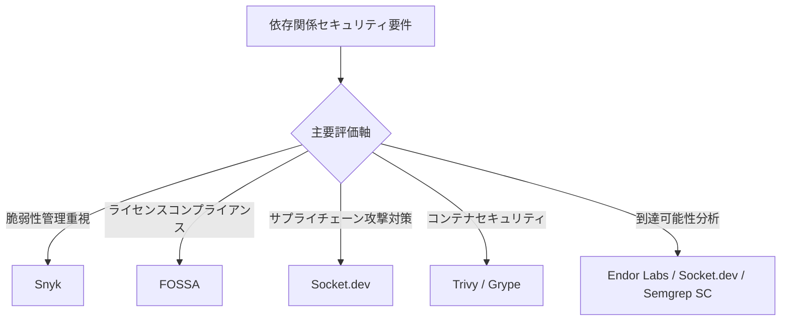
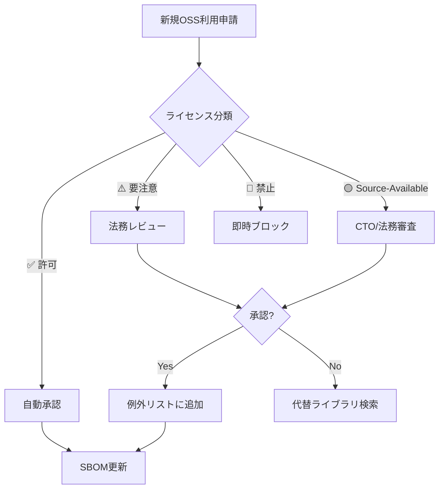
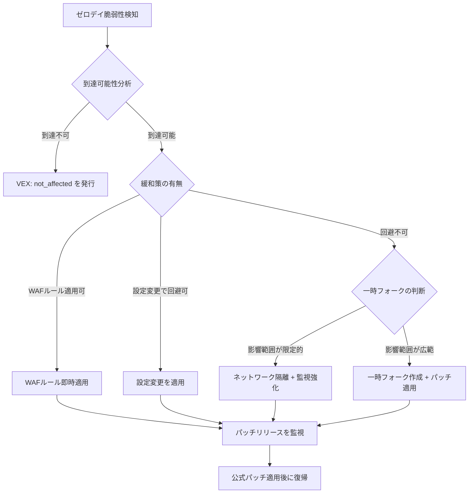
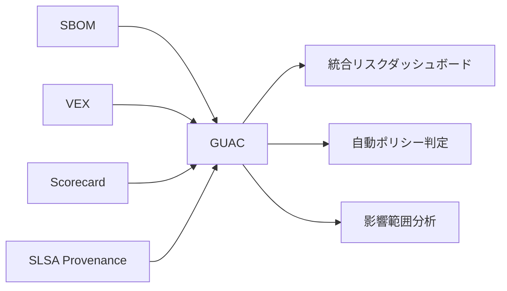
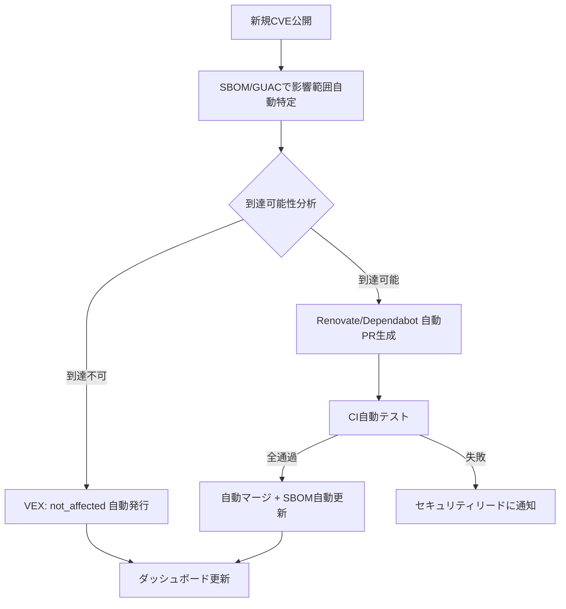
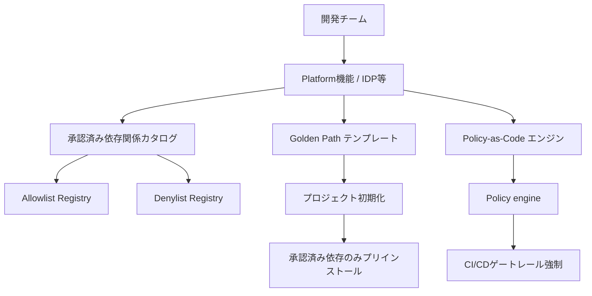
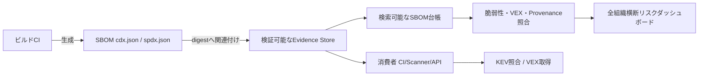

# 62. ライセンスと依存関係管理 (License & Dependency Management)

> [!CAUTION]
> **このファイルは Universal Rule（不変ルール）です。「憲法改正」の明示的指示がない限り編集禁止。**
> 改定日: 2026-07-23（v5: プログラミング言語ecosystem拡張）

> [!IMPORTANT]
> **Primary Directive（主要方針）**
> 「すべての依存関係は信頼の決定 — 管理されていないライセンスは法的時限爆弾である。」
> すべてのサードパーティ依存関係は監査・承認・継続的監視されなければならない。
> **ライセンス準拠 > セキュリティ > 安定性 > 利便性** の優先順位を厳守せよ。
> Universal適用契約: license分類、vendor tool、VCS event、役職、人数、期限、頻度、score閾値は、適用法令・契約、official deadline、または回復不能なriskへの安全下限でない限りreference implementationまたはBlueprint parameterである。Project Blueprintは配布・network利用形態、法域、exposure、reachability、KEV／EPSS、data感度、組織規模からpolicyを定め、同等能力と兼務可能なaccountable functionを認める。
> **63セクション構成（v4: §59-§63 新規追加 + §29構造バグ修正 + NIS2・AI IDE SCA・SBOM Federation・ML BOM・依存関係SLO対応）。**

---

## 目次

| § | セクション |
|---|---|
| 1 | [ライセンス分類とポリシー](#1-ライセンス分類とポリシー) |
| 2 | [ライセンス互換性マトリクス](#2-ライセンス互換性マトリクス) |
| 3 | [AI/MLモデルライセンス](#3-aimlモデルライセンス) |
| 4 | [コンテナイメージライセンス管理](#4-コンテナイメージライセンス管理) |
| 5 | [IaCモジュール・アクションのライセンス](#5-iacモジュールアクションのライセンス) |
| 6 | [フォント・メディアアセットライセンス](#6-フォントメディアアセットライセンス) |
| 7 | [SBOM（Software Bill of Materials）](#7-sbomsoftware-bill-of-materials) |
| 8 | [SBOM規制コンプライアンス](#8-sbom規制コンプライアンス) |
| 9 | [サプライチェーンセキュリティ基盤](#9-サプライチェーンセキュリティ基盤) |
| 10 | [SCAツール統合](#10-scaツール統合) |
| 11 | [CIパイプラインガードレール](#11-ciパイプラインガードレール) |
| 12 | [依存関係選定基準](#12-依存関係選定基準) |
| 13 | [バンドルサイズ・パフォーマンス影響](#13-バンドルサイズパフォーマンス影響) |
| 14 | [ロックファイル整合性](#14-ロックファイル整合性) |
| 15 | [自動更新戦略（Renovate / Dependabot）](#15-自動更新戦略renovate--dependabot) |
| 16 | [セキュリティパッチ適用SLA](#16-セキュリティパッチ適用sla) |
| 17 | [Monorepo依存関係管理](#17-monorepo依存関係管理) |
| 18 | [Private Registry / Artifactory](#18-private-registry--artifactory) |
| 19 | [推移的依存関係管理](#19-推移的依存関係管理) |
| 20 | [EOL / 非推奨パッケージ管理](#20-eol--非推奨パッケージ管理) |
| 21 | [帰属表示・NOTICE生成](#21-帰属表示notice生成) |
| 22 | [OSPO（Open Source Program Office）](#22-ospoopen-source-program-office) |
| 23 | [依存関係侵害インシデント対応](#23-依存関係侵害インシデント対応) |
| 24 | [監査・レポーティング](#24-監査レポーティング) |
| 25 | [FinOps: 依存関係コスト最適化](#25-finops-依存関係コスト最適化) |
| 26 | [OpenSSF Scorecard統合](#26-openssf-scorecard統合) |
| 27 | [依存関係混同攻撃対策](#27-依存関係混同攻撃対策) |
| 28 | [VEX（Vulnerability Exploitability eXchange）](#28-vexvulnerability-exploitability-exchange) |
| 29 | [CBOM（Cryptographic Bill of Materials）](#29-cbomcryptographic-bill-of-materials) |
| 30 | [マルチエコシステム依存関係管理](#30-マルチエコシステム依存関係管理) |
| 31 | [パッケージ公開セキュリティとWorkload Identity](#31-パッケージ公開セキュリティとworkload-identity) |
| 32 | [GitHub Dependency Review統合](#32-github-dependency-review統合) |
| 33 | [OSS法的リスクマネジメント](#33-oss法的リスクマネジメント) |
| 34 | [ゼロデイ依存関係対応プレイブック](#34-ゼロデイ依存関係対応プレイブック) |
| 35 | [AI生成コードのライセンスリスク](#35-ai生成コードのライセンスリスク) |
| 36 | [Slopsquatting / AIパッケージ幻覚攻撃対策](#36-slopsquatting--aiパッケージ幻覚攻撃対策) |
| 37 | [SBOM長期保持とCRA技術文書化要件](#37-sbom長期保持とcra技術文書化要件) |
| 38 | [ランタイム依存関係監視（Runtime SCA）](#38-ランタイム依存関係監視runtime-sca) |
| 39 | [依存関係最小化原則](#39-依存関係最小化原則) |
| 40 | [サプライチェーンインシデント事例データベース](#40-サプライチェーンインシデント事例データベース) |
| 41 | [依存関係ガバナンス成熟度モデル](#41-依存関係ガバナンス成熟度モデル) |
| 42 | [ライセンスロンダリング対策](#42-ライセンスロンダリング対策) |
| 43 | [Remote Dynamic Dependencies（RDD）対策](#43-remote-dynamic-dependenciesrdd対策) |
| 44 | [DORA ICTサプライチェーン要件](#44-dora-ictサプライチェーン要件) |
| 45 | [連続的検証（Continuous Verification）](#45-連続的検証continuous-verification) |
| 46 | [OpenSSF GUAC統合](#46-openssf-guac統合) |
| 47 | [メンテナバーノウトリスク対策](#47-メンテナバーノウトリスク対策) |
| 48 | [依存関係セキュリティ自動対応基盤](#48-依存関係セキュリティ自動対応基盤) |
| 49 | [開発者セキュリティ教育・啓発](#49-開発者セキュリティ教育啓発) |
| 50 | [WebAssembly / ネイティブバイナリ依存関係管理](#50-webassembly--ネイティブバイナリ依存関係管理) |
| 51 | [Platform Engineering / IDP依存関係ガバナンス](#51-platform-engineering--idp依存関係ガバナンス) |
| 52 | [LLM / AIツールチェーン依存関係管理](#52-llm--aiツールチェーン依存関係管理) |
| 53 | [Green Engineering：依存関係のカーボン最適化](#53-green-engineering依存関係のカーボン最適化) |
| **54** | [**CISA KEV連携とEPSS統合型脆弱性優先順位付け**](#54-cisa-kev連携とepss統合型脆弱性優先順位付け) |
| **55** | [**EU AI Act技術文書化義務（学習データライセンス追跡）**](#55-eu-ai-act技術文書化義務学習データライセンス追跡) |
| **56** | [**Reproducible Builds & Hermetic Repository標準**](#56-reproducible-builds--hermetic-repository標準) |
| **57** | [**SBOM品質成熟度モデル（SBOM Quality Maturity Model）**](#57-sbom品質成熟度モデルsbom-quality-maturity-model) |
| **58** | [**新世代パッケージマネージャ対応（uv / Bun / cargo-auditable）**](#58-新世代パッケージマネージャ対応uv--bun--cargo-auditable) |
| **59** | [**NIS2指令：適用性とソフトウェア供給網**](#59-nis2指令適用性とソフトウェア供給網) |
| **60** | [**AI IDE統合型リアルタイムSCA**](#60-ai-ide統合型リアルタイムsca) |
| **61** | [**SBOM Federation（OCI Artifact参考パターン）**](#61-sbom-federationoci-artifact参考パターン) |
| **62** | [**ML BOM（Machine Learning Bill of Materials）**](#62-ml-bombmachine-learning-bill-of-materials) |
| **63** | [**依存関係SLO / Error Budget管理**](#63-依存関係slo--error-budget管理) |
| A | [Appendix A: 逆引き索引](#appendix-a-逆引き索引) |
| B | [Appendix B: 差分サマリー](#appendix-b-差分サマリー) |

---

## §1. ライセンス分類とポリシー

### 1.1 三層分類

> 以下は組織policyを作るためのreference profileであり、Universalな法的判断ではない。実際の分類はlicense本文、利用version、配布・network利用形態、link／改変関係、顧客契約、法域、知財方針をaccountableなlicense／legal risk ownerが判定する。

**✅ 低摩擦候補（義務確認後にallowしやすい）**:

| ライセンス | 基準profileでの扱い | 備考 |
|:----------|:------|:-----|
| MIT | 低摩擦候補 | 緩やかな条件。商用利用可。帰属表示を確認 |
| Apache-2.0 | 低摩擦候補 | 特許条項含む。商用利用可。NOTICE保持を確認 |
| BSD-2-Clause | 低摩擦候補 | 商用利用可。著作権・免責表示を確認 |
| BSD-3-Clause | 低摩擦候補 | 商用利用可。名称利用制限を確認 |
| ISC | 低摩擦候補 | 簡潔なpermissive条件。表示義務を確認 |
| CC0-1.0 | 低摩擦候補 | public-domain dedicationと法域差を確認 |
| 0BSD | 低摩擦候補 | attribution不要の条件をlicense本文で確認 |
| Unlicense | 要法域確認 | public-domain dedicationと法域差を確認 |
| Zlib | 低摩擦候補 | 商用利用可。表示・改変表記を確認 |
| PSF-2.0 | 低摩擦候補 | Python由来のpermissive条件。対象componentを確認 |

**⚠️ 条件確認必須（利用形態によりallow／review／deny）**:

| ライセンス | リスク | 対応 |
|:----------|:------|:-----|
| LGPL-2.1 / LGPL-3.0 | ⚠️ 条件付き | link、改変、再link可能性、notice、source提供義務を確認 |
| MPL-2.0 | ⚠️ 条件付き | ファイル単位Copyleft。法務確認後に例外許可 |
| EPL-2.0 | ⚠️ 条件付き | モジュール単位Copyleft。法務確認 |
| CDDL-1.0 | ⚠️ 条件付き | ファイル単位Copyleft。法務確認 |
| Artistic-2.0 | ⚠️ 条件付き | Perl由来。改変時名称変更義務 |
| CC-BY-4.0 | ⚠️ 条件付き | コードでなくドキュメント/データ向け |
| CC-BY-SA-4.0 | ⚠️ 条件付き | ShareAlike条件あり。法務確認 |
| EUPL-1.2 | ⚠️ 条件付き | EU公共ライセンス。Copyleft互換性条項あり。互換ライセンスリスト確認 |

**🔴 高い義務または制約（組織policyのreview／deny候補）**:

| ライセンス | リスク | 理由 |
|:----------|:------|:-----|
| GPL-2.0 / GPL-3.0 | 🔴 高 | convey、link、derivative workの範囲と対応source提供義務を専門確認 |
| AGPL-3.0 | 🔴 最高 | 改変版のnetwork利用者への対応source提供を含む§13義務と結合範囲を専門確認 |
| SSPL | 🔴 最高 | OSI非承認のsource-available terms。service提供時の追加source要件を確認 |
| CC-BY-NC-* | 🔴 高 | commercial use制限が目的と両立するか確認 |
| CC-BY-ND-* | 🔴 高 | 改変禁止が変換、翻訳、編集、配布と両立するか確認 |
| CAL-1.0 | 🔴 高 | 強いreciprocityと利用者データ関連義務を専門確認 |

### 1.2 Source-Availableライセンスの扱い

| ライセンス | 分類 | 注意点 |
|:----------|:-----|:------|
| BSL-1.1 (Business Source License) | 🔴 review／deny候補 | Change Date前の追加利用制限とChange Licenseを個別確認 |
| FSL-1.1 (Functional Source License) | 🔴 review／deny候補 | Change Date前の競合利用制限と将来licenseを個別確認 |
| Elastic License 2.0 | 🔴 review／deny候補 | managed service、再配布等の制限を目的と照合 |
| PolyForm Shield 1.0.0 | 🔴 review／deny候補 | competitive use制限を目的と照合 |
| BUSL (MariaDB BSL) | 🔴 review／deny候補 | 採用物の実際のBusiness Source License本文とChange Dateを確認 |

> [!CAUTION]
> Source-Availableライセンスは「ソースコードが見える ≠ OSS」である。OSI非承認であり、従来のOSSと同じ扱いは厳禁。

### 1.3 デュアルライセンス戦略への対応

- **ルール**: デュアルライセンスでは、実際に選択可能で、予定する利用・配布・改変と互換なlicenseを選ぶ。package metadataはcomponent自身のlicenseを表すため、組織の選択根拠の代替にしない
- **ルール**: Copyleft／Permissiveの選択肢があっても、商用契約、support、特許条項、再配布条件を含めて評価し、単語だけで自動選択しない
- **ルール**: 選択したlicense、対象version、根拠、owner、証跡をversion管理されたdecision record、SBOM property、license inventoryまたは同等手段へ記録する。固定directory名は要求しない

→ クロスリファレンス: [`security/100_data_governance.md`](../security/100_data_governance.md) §GenAI著作権

---

## §2. ライセンス互換性マトリクス

### 2.1 互換性ルール

license名やlink方式だけで互換性を断定しない。対象versionのlicense本文、例外、改変、結合、配布、network利用、法域、顧客契約を入力に、accountableなownerが次の判断を記録する。

| 利用・出力形態 | 必須判断 |
|:--------------|:---------|
| source取込、静的link、native binary、WebAssembly | combined work、改変範囲、object／source提供、relink可能性、notice、特許条項を確認 |
| 動的link、plugin、FFI、IPC、service境界 | link名だけで分離を推定せず、process、interface、共有data構造、配布単位、license例外を確認 |
| hosted／SaaS／API | network利用をtriggerとする条項、改変版、利用者へのsource offer、service提供制限をlicenseごとに確認。AGPLやsource-availableを一律除外しない |
| container／VM／firmware配布 | base、OS package、runtime、driver、model、全layerのlicenseとsource／notice義務をrelease artifact単位で確認 |
| package／SDK／CLI／library公開 | 直接・推移依存、bundled code、generated code、runtime fetch、dual license、consumerへの義務伝播を確認 |
| internal-only利用 | 「未配布」を記録し、remote user、group company、contractor、customer環境への提供で前提が変わるtriggerを設定 |

> 本節は法的助言ではない。曖昧なlicense表現、複合license、例外、強いcopyleft、source-available、商標・特許条件は、組織policyに従いlicense専門家または法務へ送る。

### 2.2 policy駆動の自動検出

自動化はlicenseを検出して組織policyへ照合する。法的な「互換性」そのものを文字列一致で決めない。SPDX expressionの`AND`、`OR`、`WITH`、`LicenseRef`、dual license、package単位例外をparseできないscannerは、判定不能としてreviewへ送る。

```yaml
# 参考実装。VCS、scanner、commandは置換可能
- name: License Compatibility Check
  run: |
    license-inventory --format json > licenses.json
    policy-engine evaluate \
      --policy .governance/license-policy.json \
      --input licenses.json \
      --require-complete-inventory
```

```json
{
  "schemaVersion": 1,
  "defaultDecision": "review",
  "profiles": {
    "internal-service": {
      "allow": ["ORG_APPROVED_SPDX_EXPRESSIONS"],
      "review": ["ORG_REVIEW_SPDX_EXPRESSIONS"],
      "deny": ["ORG_DENIED_SPDX_EXPRESSIONS"]
    }
  },
  "exceptions": [
    {
      "component": "pkg:ecosystem/name@version",
      "decision": "allow",
      "owner": "license-risk-owner",
      "expiresAt": "YYYY-MM-DD",
      "evidence": "decision-record-id"
    }
  ]
}
```

- **ルール**: policyは配布model、製品profile、法域、license version、例外期限をversion管理し、scannerやIDEへ同じdecision dataを配布する
- **ルール**: missing、unknown、`NOASSERTION`、非標準text、parse不能expressionはsilent allowせずreviewへ送る
- **ルール**: block結果にはcomponent、解決version、license expression、利用経路、policy rule、owner、remediationまたは期限付き例外を含める

→ クロスリファレンス: [`security/000_security_privacy.md`](../security/000_security_privacy.md) §サプライチェーンセキュリティ

---

## §3. AI/MLモデルライセンス

### 3.1 モデルウェイトのライセンス分類

| ライセンス | 商用利用 | 改変 | 再配布 | 備考 |
|:----------|:--------|:-----|:------|:-----|
| Apache-2.0（Llama 3等） | ✅ | ✅ | ✅ | 利用者数制限あり（Meta: 月間7億) |
| Gemma Terms of Use | ✅ | ✅ | ⚠️ | Google利用規約に従う |
| OpenRAIL-M | ✅ | ✅ | ⚠️ | 利用制限条項（Responsible AI）あり |
| CC-BY-NC-4.0 | ❌ | ✅ | ⚠️ | 商用不可。研究用途のみ |
| Llama 2 Community License | ✅ | ✅ | ⚠️ | 月間アクティブユーザー7億超で別途契約必要 |
| Mistral Research License | ❌ | ⚠️ | ❌ | 研究用途限定 |

### 3.2 ルール

- **ルール**: モデルウェイトのダウンロード前にライセンスとAcceptable Use Policyを確認する
- **ルール**: Fine-tuning後のモデル配布時は、元ライセンスの「派生物」条件を確認する
- **ルール**: モデルのライセンスが利用者数上限を定めている場合、月次で利用者数を監視する
- **ルール**: モデルライセンスの変更（例: Llama 2→3のライセンス変更）を四半期で監視する

→ クロスリファレンス: [`security/100_data_governance.md`](../security/100_data_governance.md) §GenAI著作権、[`ai/000_ai_engineering.md`](../ai/000_ai_engineering.md)

---

## §4. コンテナイメージライセンス管理

### 4.1 ルール

- **ルール**: ベースイメージのライセンスを必ず確認する（例: Alpine=MIT、Ubuntu=GPL系混在、Distroless=Apache-2.0推奨）
- **ルール**: マルチステージビルドの最終ステージに含まれるパッケージのみがライセンス対象
- **ルール**: コンテナSBOMを `syft` または `trivy` で生成し、CIで自動検証する

```bash
# コンテナSBOM生成
syft packages myapp:latest -o spdx-json > container-sbom.spdx.json
# ライセンスチェック
trivy image --scanners license --severity HIGH,CRITICAL myapp:latest
```

### 4.2 ベースイメージ選定基準

| イメージ | ライセンスリスク | 推奨度 |
|:--------|:---------------|:------|
| gcr.io/distroless | ✅ 低（Apache-2.0） | ⭐ 最推奨 |
| chainguard/static | ✅ 低（Apache-2.0） | ⭐ 推奨（最小攻撃面） |
| alpine | ✅ 低（MIT） | ⭐ 推奨 |
| debian-slim | ⚠️ 中（GPL混在） | 許可（帰属表示注意） |
| ubuntu | ⚠️ 中（GPL混在） | 許可（帰属表示注意） |

---

## §5. IaCモジュール・アクションのライセンス

### 5.1 ルール

- **ルール**: Terraformモジュール（registry/GitHub）導入時にライセンスを確認する
- **ルール**: GitHub Actionsのサードパーティアクションは、**SHA pinning** でバージョン固定する
- **ルール**: GitHub Actionsはフォーク版ではなく公式/Verified Creator版を優先する
- **ルール**: Helmチャートのライセンスもレビュー対象とする
- **ルール**: OpenTofu/Terraform間のライセンス差異（MPL-2.0 vs BSL-1.1）を把握し、プロジェクト方針を決定する

```yaml
# ✅ 正: SHA pinning
- uses: actions/checkout@b4ffde65f46336ab88eb53be808477a3936bae11 # v4.1.1

# ❌ 誤: タグのみ
- uses: actions/checkout@v4
```

→ クロスリファレンス: [`security/000_security_privacy.md`](../security/000_security_privacy.md) §サプライチェーン

---

## §6. フォント・メディアアセットライセンス

### 6.1 ルール

- **ルール**: Google Fonts（OFL/Apache-2.0）は安全。セルフホスティング時もライセンス確認
- **ルール**: 商用フォント（Adobe Fonts等）はシート数・用途制限を厳守する
- **ルール**: ストック画像/アイコンはライセンス証書を `licenses/` ディレクトリに保存する
- **ルール**: CC-BY画像はalt属性またはキャプションで帰属表示する
- **ルール**: AI生成画像の著作権帰属はサービス利用規約を確認する（§35参照）

| アセット種別 | 安全なライセンス | 注意が必要なライセンス |
|:------------|:---------------|:-------------------|
| フォント | OFL-1.1, Apache-2.0 | 商用フォント（シート制限） |
| アイコン | MIT, CC0 | CC-BY（帰属表示必須） |
| 画像 | Unsplash License, CC0 | CC-BY-NC（商用不可） |

→ クロスリファレンス: [`design/000_design_ux.md`](../design/000_design_ux.md)

---

## §7. SBOM（Software Bill of Materials）

### 7.1 SBOM生成義務

- **ルール**: 全リリースビルドに対してSBOMを自動生成する（CIに必須統合）
- **ルール**: フォーマットは **CycloneDX 1.6+**（セキュリティ自動化向け）または **SPDX 3.0+**（ライセンスコンプライアンス向け）を使用する
- **ルール**: 両フォーマットの並行生成を推奨（相互補完性のため）

### 7.2 SBOMの最小データ要素（CISA 2025基準）

| フィールド | 説明 | 必須 |
|:----------|:-----|:-----|
| Component Name | パッケージ名 | ✅ |
| Version | バージョン | ✅ |
| Supplier | 供給者/ベンダー | ✅ |
| Component Hash | SHA-256等のハッシュ値 | ✅ |
| License Information | SPDX識別子 | ✅ |
| Dependency Relationship | 直接/推移的の区分 | ✅ |
| Tool Name | SBOM生成ツール名 | ✅ |
| Generation Context | 生成日時・ビルドID | ✅ |
| Unique Identifier | PURL（Package URL）推奨 | ✅（2026〜） |

### 7.3 SBOM生成スニペット

```yaml
# .github/workflows/sbom.yml
sbom:
  runs-on: ubuntu-latest
  steps:
    - uses: actions/checkout@v4
    - run: npm ci
    - name: Generate CycloneDX SBOM
      run: npx @cyclonedx/cyclonedx-npm --output-file sbom.cdx.json
    - name: Generate SPDX SBOM
      run: |
        syft dir:. -o spdx-json > sbom.spdx.json
    - name: Upload SBOM artifacts
      uses: actions/upload-artifact@v4
      with:
        name: sbom-${{ github.sha }}
        path: |
          sbom.cdx.json
          sbom.spdx.json
        retention-days: 3650  # EU CRA 10年保持要件
```

### 7.4 SBOMライフサイクル管理

- **ルール**: SBOMはリリース毎だけでなく、依存関係が変更されたビルド毎にリフレッシュする
- **ルール**: SBOMにGitコミットハッシュとCI/CDパイプラインIDを紐づけ、トレーサビリティを確保する
- **ルール**: SBOMのバージョン管理にSemVerを適用し、コンポーネント変更時にマイナーバージョンを更新する
- **ルール**: SBOMリポジトリまたはSBOM管理プラットフォーム（DependencyTrack等）で一元管理する

→ クロスリファレンス: [`engineering/000_engineering_standards.md`](../engineering/000_engineering_standards.md) §CI/CD

---

## §8. SBOM規制コンプライアンス

### 8.1 グローバル規制タイムライン

| 規制 | 施行日 | 要件 | 罰則 |
|:-----|:------|:-----|:-----|
| US EO 14028 | 2021〜（段階的） | 連邦政府調達ソフトウェアにSBOM必須 | 調達資格喪失 |
| CISA SBOM最小要素v2 | **2025-08** | コンポーネントハッシュ・ライセンス・ツール名・生成コンテキスト・PURL追加 | — |
| India CERT-In SBOM GL 2.0 | **2025-07** | 重要サービス組織にSBOM必須。民間も推奨 | — |
| DORA（EU金融） | **2025-01施行** | ICT第三者リスク管理。ソフトウェアサプライチェーン可視化義務 | 最大€10M or 売上5% |
| EU CRA: 委任規則(EU)2025/1535 | **2025-07** | 重要/クリティカル製品カテゴリの技術的記述 | — |
| EU CRA: 実施規則(EU)2025/2392 | **2025-11** | 適合性評価の詳細要件 | — |
| EU CRA: 適合性評価機関届出 | **2026-06** | 適合性評価機関への届出義務開始 | — |
| EU CRA: 脆弱性報告 | **2026-09** | アクティブ悪用脆弱性の24時間以内報告義務。ENISAへの通報必須 | 最大€15M or 売上2.5% |
| EU CRA: 完全施行 | **2027-12** | 製品技術文書にSBOM必須。機械可読形式。**10年間の保持義務**。5年間のセキュリティアップデート義務 | 最大€15M or 売上2.5% |
| Japan 経産省 SBOMガイドライン | 2023〜（推奨） | ソフトウェア管理にSBOM活用。政府調達では事実上必須 | — |
| NIST SSDF更新 | 2026（予定） | SBOM要件の強化、SLSA準拠の推奨 | — |

> [!IMPORTANT]
> EU CRAは段階的施行であり、2026-09の脆弱性報告義務が最初の実質的対応期限。中間標準化（SBOMスキーマ含むhorizontal standard）は2026年中盤にCEN/CENELECから公開予定。

### 8.2 ルール

- **ルール**: EU市場に製品を投入する場合、CRA 2026-09の脆弱性報告要件に**今から**準備を開始する
- **ルール**: CRA技術文書のSBOM保持期間は**10年間**。長期ストレージ戦略を策定する（§37参照）
- **ルール**: 金融セクターの場合、DORA要件に基づくICTサードパーティリスク評価を実施する（§44参照）
- **ルール**: 政府調達案件では、CISA SBOM最小要素v2に完全準拠するSBOMを提供する

→ クロスリファレンス: [`security/100_data_governance.md`](../security/100_data_governance.md) §EU Data Act

---

## §9. サプライチェーンセキュリティ基盤

### 9.1 SLSA（Supply-chain Levels for Software Artifacts）v1.2

| Track / Level | 要件 | 保護対象 |
|:------|:-----|:--------|
| Build L1 | Build Provenanceが存在する | 誤操作と監査開始 |
| Build L2 | ホスト型build platformが署名付きProvenanceを生成する | build後の改ざん |
| Build L3 | hardened build platformを使用する | build中の改ざん |
| Source L2 | 変更履歴を保持し、Source Provenanceを生成する | source revisionの追跡と帰属 |
| Source L3 | 組織の技術統制を継続的に強制する | branch統制の形骸化 |
| Source L4 | すべての変更に信頼された二者reviewを要求する | 単独行為者による改変 |

- **ルール**: 本番成果物は最低 **Build L2**、source管理は最低 **Source L2** を基線とする。CI製品名だけで適合を断定せず、attestation、builder identity、履歴統制を検証する
- **ルール**: 高保証領域は **Build L3** と **Source L4** を目標とする。Source VSAの`verifiedLevels`は対応する数値levelと`SLSA_SOURCE_TWO_PARTY_REVIEWED`属性で表現し、存在しない`SLSA_SOURCE_LEVEL_4`を生成しない。ephemeral、isolated、hermetic、reproducible buildは要件と補償統制を区別して記録する

### 9.2 Workload Identityによる公開

- **ルール**: registryとbuild platformが対応する場合は、OIDC Trusted Publishing等の短命なworkload identityを使用し、長期の公開credentialを保存しない（§31参照）
- **ルール**: 対応しないecosystemでは、最小権限、短い有効期限、保護されたsecret store、自動rotation、公開元と成果物への監査可能なbindingを備える代替方式を採用し、移行条件を記録する

### 9.3 Provenance Attestation

- **ルール**: release artifactごとに、source revision、builder identity、build inputs、artifact digestを結び付ける署名付きProvenanceを生成する。`actions/attest-build-provenance`は実装例であり必須製品ではない
- **ルール**: 消費者またはpolicy gateは、期待するowner、repository、builder、workflow、artifact digestに対してProvenanceを検証する。`gh attestation verify`はGitHubを使用する場合の実装例とする
- **ルール**: in-toto、SLSA Provenance、または同等の相互運用可能なattestation contractを使用し、生成だけでなく配布・検証までend-to-endで成立させる

### 9.4 Sigstore統合

- **ルール**: 配布するコンテナイメージは、`cosign`等でidentityとProvenanceに結び付く署名を付与する。対応環境ではkeyless方式を優先する
- **ルール**: 署名とProvenanceの検証は、Kubernetes Admission Controller、registry、deployment orchestrator、release gate等の実際の配布境界で強制する

```bash
# Keyless署名（Sigstore Fulcio + Rekor）
cosign sign myregistry.com/myapp:v1.0.0
# Keyless検証
cosign verify myregistry.com/myapp:v1.0.0 \
  --certificate-identity=workflow@github.com \
  --certificate-oidc-issuer=https://token.actions.githubusercontent.com
```

→ クロスリファレンス: [`security/000_security_privacy.md`](../security/000_security_privacy.md) §サプライチェーン、[`engineering/000_engineering_standards.md`](../engineering/000_engineering_standards.md) §CI/CD

---

## §10. SCAツール統合

### 10.1 交換可能なSCA能力と実装例

| ツール | 主な強み | 用途 |
|:------|:--------|:-----|
| Snyk | 脆弱性検知 + AI修正提案 + Snyk Code SAST統合 | 商用統合SCAの選択肢 |
| FOSSA | ライセンスコンプライアンス + SBOM + NOTICE自動生成 | 商用license管理の選択肢 |
| Socket.dev | マルウェア検知 + AI行動分析 + **到達可能性分析（Coana統合）** | package挙動分析の選択肢 |
| Semgrep Supply Chain | 推移的到達可能性分析（Reachability Analysis） | 偽陽性削減 |
| Trivy | コンテナ + IaC + SBOM + ライセンス | コンテナセキュリティ |
| Endor Labs | DCA（Dependency Caller Analysis） + Binary-to-Source AI | 到達可能性分析・コンテキスト重視 |
| Grype | OSS CLIスキャナ（SBOM/コンテナイメージ対応） | クラウドネイティブワークフロー |
| `npm audit` | npm内蔵 | 最低限のベースライン |

> [!NOTE]
> Socket.devは2025年4月にCoanaを買収し、到達可能性分析機能を統合。CVEの偽陽性を最大80%削減可能。2025年7月にTrusted Publishing対応も完了。

### 10.2 ツール選定フローチャート



このflowchartはtool探索の例であり、vendor選定の規範ではない。対応ecosystem、artifact形式、advisory source、reachability、VEX、license、API／export、費用、data residency、運用継続性を評価し、同等能力のtoolへ置換できる。

### 10.3 ルール

- **ルール**: すべての検出済みecosystemとrelease artifactを扱えるSCA能力をCIへ統合する。単一toolで不足する場合は複数toolの結果を正規化し、coverage gapを台帳化する
- **ルール**: license policyと脆弱性policyは独立した判定、owner、例外、failure reasonとして可視化する。同じCI jobで実行しても、証跡と失敗原因を分離できればよい
- **ルール**: manifestだけでなくlock、推移依存、vendored code、container、native library、生成物を対象にし、検出した全言語ecosystemのcoverageを報告する
- **ルール**: 偽陽性・未到達・補償統制は採用toolのpolicyまたは共通waiver台帳で抑制し、対象version、根拠、owner、期限、再評価triggerを記録する
- **ルール**: install script、network、filesystem、dynamic execution、credential access等のpackage behaviorを、scanner、sandbox、static analysis、egress policy等の同等能力でriskに応じて検査する
- **ルール**: reachabilityは優先度を高めるevidenceとして使用し、scanner、call graph、runtime evidence、manual analysisを組み合わせる。未到達だけで将来の影響を永久除外しない
- **ルール**: AI-assisted codeには§35／§42の第三者code照合をriskに応じて統合し、SCAだけで著作権・license判断を完結させない

---

## §11. CIパイプラインガードレール

### 11.1 自動ブロックルール

| 検知事象 | Universalなchange／release gate | 例外・解決手続き |
|:--------|:-------------------------------|:------------------|
| 組織policyがdenyとしたlicense | 変更受入と配布をblock | accountableなlicense／legal risk ownerによる期限付き例外。義務、配布形態、顧客契約を記録 |
| review必須のsource-available／copyleft等 | 分類完了まで配布をblockし、利用形態に応じて変更受入をreview | 法務またはdelegated policy ownerがallow／条件付きallow／denyを証跡化 |
| 悪用中、到達可能、外部公開の重大脆弱性 | 即時封じ込め。安全な変更受入またはreleaseをblock | security risk ownerが修正、緩和、VEX、期限付きrisk acceptanceを承認 |
| その他のHigh／Critical | KEV、EPSS、reachability、exposure、data感度とBlueprint SLAでblock／警告を決定 | accountable owner、期限、補償統制、再確認日を記録 |
| UNKNOWN license | 分類完了まで変更受入または配布をblock | authoritative sourceを調査し、versioned policyへ分類を追加 |
| project health score低下 | 単一scoreで自動拒否せず、保守、provenance、脆弱性、退出可能性のreviewを要求 | §26に従い複合riskを記録 |
| install script、network、filesystem等のhigh-risk behavior | installまたは変更受入をblockしてmanual review | security／supply-chain ownerが必要性、scope、sandbox、代替を承認 |

Pull Requestとmergeは実装例である。Merge Request、pre-submit、release approval、package registry policy等でも、同じ判定、block、owner、例外証跡を強制できれば適合する。

### 11.2 CI設定参考例（GitHub Actions）

```yaml
# .github/workflows/dependency-guard.yml
name: Dependency Guard
on: [pull_request]
jobs:
  license-check:
    runs-on: ubuntu-latest
    steps:
      - uses: actions/checkout@v4
      - run: npm ci
      - name: License Check
        run: |
          npx license-checker --production --failOn \
            "GPL-2.0;GPL-3.0;AGPL-3.0;SSPL;UNKNOWN"
      - name: License Report
        run: npx license-checker --production --csv > license-report.csv

  vulnerability-scan:
    runs-on: ubuntu-latest
    steps:
      - uses: actions/checkout@v4
      - run: npm ci
      - name: Snyk Test
        uses: snyk/actions/node@master
        env:
          SNYK_TOKEN: ${{ secrets.SNYK_TOKEN }}
        with:
          args: --severity-threshold=high

  supply-chain-check:
    runs-on: ubuntu-latest
    steps:
      - uses: actions/checkout@v4
      - name: Socket Security
        uses: SocketDev/socket-security-action@v1
        with:
          api_key: ${{ secrets.SOCKET_API_KEY }}
```

→ クロスリファレンス: [`engineering/000_engineering_standards.md`](../engineering/000_engineering_standards.md) §CI/CD

---

## §12. 依存関係選定基準

### 12.1 ヘルスメトリクス（導入前チェックリスト）

次の数値は新規導入時のreference profileである。言語ecosystem、project規模、component criticalityにより分布が異なるため、stars、download、coverage、単一scoreをUniversalな合否条件にしない。

| 指標 | 最低基準 | 理想 |
|:----|:--------|:-----|
| GitHub Stars | ≥ 500 | ≥ 5,000 |
| 最終コミット | 6ヶ月以内 | 1ヶ月以内 |
| メンテナー数 | ≥ 2 | ≥ 5 |
| オープンIssue解決率 | ≥ 50% | ≥ 80% |
| テストカバレッジ | 存在すること | ≥ 80% |
| TypeScript型定義 | 存在すること | ビルトイン |
| ダウンロード数（npm weekly） | ≥ 10,000 | ≥ 100,000 |
| セキュリティポリシー | 存在すること | SECURITY.md + 脆弱性報告フロー |
| ライセンス | 許可リスト内 | MIT / Apache-2.0 |
| **OpenSSF Scorecard** | **≥ 4.0** | **≥ 7.0** |
| **Bus Factor** | **≥ 2** | **≥ 5**（§47参照） |

### 12.2 リスクスコアリング

- **ルール**: 新規dependencyは機能fit、maintenance、Provenance、脆弱性、license、権限、artifact、performance、運用、退出可能性を複合評価し、risk tierに応じたownerが承認する
- **ルール**: 現状維持、標準library、内部実装、service、viable candidateを比較し、candidate数を満たすためだけの形式的比較を要求しない
- **ルール**: dependency数と機能重複を最小化するが、micro-package化による推移依存・maintainer・install riskも評価する
- **ルール**: OpenSSF Scorecard等のscoreは個別checkのevidenceへ分解し、単一総合scoreだけで自動denyしない（§26参照）
- **ルール**: Bus Factor 1は追加risk signalとし、criticality、release capability、fork権利、代替、内部expertiseと合わせて評価する（§47参照）

---

## §13. バンドルサイズ・パフォーマンス影響

### 13.1 ルール

- **ルール**: client、edge、mobile、function、embedded等のsize／startup制約があるartifactは、採用bundler、profiler、artifact diff等で実測する。BundlephobiaはWeb packageの参考手段である
- **ルール**: size、parse、startup、memory、network、battery、cost budgetはtargetとuser impactからBlueprintで定め、固定50KBや固定役職をUniversal gateにしない
- **ルール**: Tree-shaking対応（ESM）のパッケージを優先する
- **ルール**: 同機能の軽量代替を常に検討する

### 13.2 推奨代替ライブラリ

| 重量級 | 軽量代替 | サイズ削減 |
|:------|:--------|:---------|
| moment.js (72KB) | date-fns (tree-shakeable) | -90% |
| lodash (72KB) | lodash-es (tree-shakeable) | -80% |
| axios (14KB) | ky (3KB) / fetch API | -80% |
| uuid (12KB) | crypto.randomUUID() | -100% |
| classnames (1.5KB) | clsx (0.5KB) | -65% |

→ クロスリファレンス: [`engineering/300_web_frontend.md`](../engineering/300_web_frontend.md) §パフォーマンス予算

---

## §14. ロックファイル整合性

### 14.1 ルール

- **ルール**: deployable application、service、CLI、firmware、container、infrastructure rootは、採用ecosystemの再現可能な解決sourceをversion管理する。公開libraryはconsumer互換性の慣行を守りつつ、CIとreleaseで解決結果を固定し証跡を保持する
- **ルール**: CIはlockまたはresolution sourceとmanifestの不一致、暗黙update、未承認sourceへのfallbackを失敗させる`locked`、`frozen`、`immutable`相当modeを使用する
- **ルール**: lock、checksum、wrapper、version catalog、provider selection等のmachine-generated差分をreviewし、追加・削除・source・version・integrity・lifecycle scriptの変化を表示する
- **ルール**: package manager、runtime、compiler、SDK、wrapperはsupport policyに従いpinし、開発、CI、releaseの解決差を検出する
- **ルール**: install／build scriptは実行能力として扱い、既定拒否または最小allowlist、network／filesystem制限、review済み例外のいずれかを適用する

| ecosystem例 | resolution source例 | CIの不変条件例 |
|:------------|:--------------------|:---------------|
| JavaScript／TypeScript | `package-lock.json`、`pnpm-lock.yaml`、`yarn.lock`、`bun.lock` | `npm ci`、frozen／immutable install、`bun ci` |
| Python | `uv.lock`、Poetry等のlock | locked／frozen sync、hash検証 |
| JVM | Gradle dependency locking + dependency verification、またはversion制約済みMaven manifest／BOM + 記録済みresolved graph／checksum | Gradle／Maven wrapperを依存とは別にpinし、graphまたはverification driftを拒否 |
| .NET | `packages.lock.json`または`paket.lock` | SDKを依存とは別にpinし、locked-mode restoreとgraph drift拒否を行う |
| Go／Rust | `go.sum`、`Cargo.lock` | read-only module、`--locked`。公開libraryのlock扱いはecosystem慣行を記録 |
| Swift／Dart | `Package.resolved`、`Podfile.lock`、`pubspec.lock` | applicationと公開libraryの境界を記録し、release解決を固定 |
| Terraform／OpenTofu | `.terraform.lock.hcl`とmodule source ref | provider checksumとmodule commit／digestを検証 |

### 14.2 Corepack設定の参考例

```json
// package.json
{
  "packageManager": "pnpm@9.15.0+sha512.abc123..."
}
```

```bash
# Corepack有効化
corepack enable
# CIでの自動バージョン固定
corepack prepare pnpm@9.15.0 --activate
```

### 14.3 Install Script セキュリティ

- **ルール**: Node.js ecosystemでは`.npmrc`の`ignore-scripts=true`、pnpmのallowlist、Bunの`trustedDependencies`等を選べる。native build、Python build backend、Gradle plugin、Cargo build script等にも同じ能力境界を適用する
- **ルール**: lifecycle script、plugin、compiler extension、macro、code generatorを追加・変更するdependencyは追加review対象とする

```ini
# .npmrc — Install Script防御
ignore-scripts=true
# 信頼されたパッケージのみ許可
# package.jsonのtrustedDependenciesで管理
```

---

## §15. 自動更新戦略（Renovate / Dependabot）

### 15.1 推奨設定

- **ルール**: Renovate、Dependabot、ecosystem bot、内部service等から、対象言語、private source、grouping、署名・Provenance、例外台帳、監査APIに適合する交換可能な更新能力を選ぶ
- **ルール**: 自動mergeは、変更scopeが限定され、artifact provenanceを検証でき、互換性・security・license・performance gateが通り、rollback可能なrisk tierに限る。security updateであることだけを理由に自動mergeしない
- **ルール**: breaking change、runtime／compiler、native dependency、database driver、認証・暗号、build plugin、未検証major updateはaccountable ownerのreviewを要求する
- **ルール**: release ageはecosystemのtakeover risk、署名、maintainer、悪用状況、rollout能力からBlueprintで校正する。actively exploited vulnerabilityの修正を待機期間で遅らせない
- **ルール**: cadenceとgroupingはteam capacityと共通failure domainから決め、無関係な大量更新をひとつのrollback単位へまとめない

### 15.2 Renovate設定の参考例

次の21日、週末、patch／minor自動mergeはUniversal既定値ではない。採用時はBlueprintのrisk tier、required checks、emergency bypass、rollback契約へ置換する。

```json
{
  "$schema": "https://docs.renovatebot.com/renovate-schema.json",
  "extends": ["config:recommended", "schedule:weekends"],
  "minimumReleaseAge": "21 days",
  "vulnerabilityAlerts": { "enabled": true, "minimumReleaseAge": "0 days" },
  "packageRules": [
    {
      "matchUpdateTypes": ["patch", "minor"],
      "matchCurrentVersion": "!/^0/",
      "automerge": true,
      "automergeType": "pr",
      "requiredStatusChecks": ["ci/build", "ci/test", "license-check"]
    },
    {
      "matchUpdateTypes": ["major"],
      "dependencyDashboardApproval": true
    }
  ]
}
```

---

## §16. セキュリティパッチ適用SLA

### 16.1 SLA定義

対応期限はCVSSだけで固定せず、悪用状況、KEV、EPSS、reachability、exposure、data感度、利用中version、補償統制、法令・契約・vendor deadlineからBlueprintで定める。次は新規導入時のreference profileであり、Universal deadlineではない。

| scanner深刻度 | CVSS参考帯 | reference初期目標 | 自動化例 |
|:------|:-----|:--------|:------|
| Critical | ≥ 9.0 | 直ちにtriage。24時間以内のremediation判断 | 更新候補 + 即時通知 |
| High | ≥ 7.0 | 7日以内のremediation判断 | 更新候補 + owner通知 |
| Medium | ≥ 4.0 | 30日以内のrisk処理 | risk report |
| Low | < 4.0 | 90日以内の再評価 | portfolio review |

### 16.2 CISA KEV連携とEPSS統合型優先順位付け

> [!IMPORTANT]
> CVSSだけの優先順位付けは不十分である。CISA KEVは実悪用のevidenceとして優先度を上げ、EPSS、reachability、exposure、asset criticalityで補完する。CISA catalogのdue dateやBODは適用対象へ従うofficial deadlineであり、全組織共通の「3日以内」へ置換しない。

| 優先度 | 条件 | 対応契約 | 自動化例 |
|:--------|:-----|:----|:------|
| 🔴 P0 | 実悪用 + exposed／reachable、または適用official deadline | 即時封じ込め。修正期限はofficial deadlineまたはより厳しいBlueprint SLA | incident alert + mitigation候補 |
| 🔴 P1 | KEV、credible exploitation、critical asset等の高risk signal | owner、補償統制、remediation期限を即時確定 | urgent update + alert |
| 🟠 P2 | Criticalだが到達不能等の根拠がある | VEXと再評価triggerを含むrisk-based SLA | update candidate |
| 🟡 P3 | High | exposureと利用状況に基づくBlueprint SLA | scheduled update |
| 🟢 P4 | Medium／Low | portfolio cadenceまたはevent-driven review | risk report |


### 16.3 ルール

- **ルール**: Criticalまたは実悪用された脆弱性は到達可能性とexposureを直ちに分析し、影響がある場合はrisk-basedな封じ込め目標でWAF、機能停止、version固定、credential rotation等の補償統制を適用する。4時間は高risk serviceのreference objectiveである
- **ルール**: CISA KEV登録CVEは優先triageし、適用されるcatalog due date、法令、契約、vendor deadlineまたはBlueprint SLAのうち最も厳しい期限で修正、緩和、隔離またはrisk acceptanceを完了する
- **ルール**: EPSS thresholdはportfolio分布と誤検知costからBlueprintで校正し、単一の固定値だけでseverityを決めない
- **ルール**: パッチ適用不可の場合、VEXステータスを発行し根拠を文書化する（§28参照）
- **ルール**: SLA逸脱はseverityと再発riskに応じて即時reviewまたはrisk-based cadenceのretrospectiveで根本原因を分析する

→ クロスリファレンス: §28 VEX、§54 CISA KEV連携詳細

---

## §17. Monorepo依存関係管理

### 17.1 ルール

- **ルール**: Monorepoは採用言語のnative workspace、build graph、module systemを使用し、package境界、owner、公開API、release単位、dependency directionを明示する。pnpm／npm workspacesはJavaScriptの参考実装である
- **ルール**: hoistやroot配置を前提にせず、各componentの直接依存をmanifestへ宣言し、ghost dependencyと循環依存を検出する
- **ルール**: 単一lock、複数lock、version catalog、workspace graphのいずれを選んでも、同じinputから同じ解決結果を得て、componentとrelease artifactへ逆引きできるSSOTを定める
- **ルール**: 変更影響範囲をbuild graphから計算しつつ、shared contract、compiler、base image、policy変更は全影響consumerを検証する
- **ルール**: merge queueまたは同等の最新base再検証と直列化を、競合率とrequired checkの性質から必要なbranchへ適用する。全repositoryへの一律導入は要求しない

### 17.2 JavaScript Monorepoの参考構成

```
monorepo-root/
├── package.json           ← 共通devDependencies
├── pnpm-lock.yaml         ← 単一ロックファイル
├── pnpm-workspace.yaml
├── packages/
│   ├── shared/            ← 共通ライブラリ
│   ├── app-web/           ← Webアプリ（固有dependencies）
│   └── app-mobile/        ← モバイルアプリ（固有dependencies）
```

---

## §18. Private Registry / Artifactory

### 18.1 ルール

- **ルール**: private componentは、access control、immutability、retention、availability、data residency、監査、ecosystem互換性を満たすregistryまたはartifact repositoryで管理する。VCS package、object storage等を選ぶ場合も同じ成果を満たす
- **ルール**: public sourceのproxy／cache／mirrorは、dependency confusion防止、malware block、緊急deny、可用性、費用の必要性から採用し、stale artifactとupstream署名の検証方針を定める
- **ルール**: 内部namespaceはpublic namespaceとの衝突を防ぐ。scope予約、明示registry mapping、private-only source、名前policyは交換可能な対策である
- **ルール**: publish、yank、delete、promote権限を分離し、humanにはMFA、workloadにはregistryが対応する短命federated identityを優先する。未対応時はowner、期限、rotationを持つcredential例外を記録する
- **ルール**: release artifactをsource revision、builder identity、digest、Provenance、SBOM、承認へ結び付け、consumerが検証できるようにする

```ini
# npmを使う場合の参考例。組織scopeとregistryはBlueprintで置換する
@mycompany:registry=https://npm.pkg.github.com
//npm.pkg.github.com/:_authToken=${NODE_AUTH_TOKEN}
```

---

## §19. 推移的依存関係管理

### 19.1 ルール

- **ルール**: release artifactに到達する直接・推移・runtime取得依存をecosystem native graph、SBOM、artifact scan等で列挙し、componentから導入rootへ逆引きできるようにする
- **ルール**: 推移依存の脆弱性は、直接依存update、upstream修正、代替、機能無効化、期限付きoverride／patchの順にriskと互換性を評価し、到達可能性と実配布versionを検証する
- **ルール**: dependency depth、重複、fan-out、native binary、install script、maintainer集中を複合riskとして評価し、固定階層数だけで採否を決めない
- **ルール**: `npm explain`、`go mod why`、Gradle dependency insight、`cargo tree`等の交換可能な手段で、導入経路、owner、利用機能を記録する

### 19.2 `overrides` による強制解決

```json
// package.json
{
  "overrides": {
    "vulnerable-transitive-pkg": ">=2.0.1"
  }
}
```

> [!CAUTION]
> `overrides`等の強制解決は一時的なrisk処理である。owner、導入理由、互換性test、upstream link、期限、削除条件を記録し、Blueprint SLA内にroot causeを解消する。

---

## §20. EOL / 非推奨パッケージ管理

### 20.1 ルール

- **ルール**: 採用runtime、compiler、SDK、framework、package、base image、OS、providerの公式support／EOL／deprecated eventを継続取得し、inventoryとownerへ照合する
- **ルール**: deprecatedは即時削除と同義ではない。security、support終了日、代替成熟度、移行影響から期限付きのretain、replace、remove判断を記録する
- **ルール**: EOL componentの本番利用は原則禁止し、例外にはexposure低減、監視、補償統制、移行owner、資金、期限、経営risk acceptanceを要求する
- **ルール**: upgrade planは公式support終了前に実行可能な余裕を確保し、major release日からの一律月数では決めない

### 20.2 EOL監視の参考実装

- **endoflife.date**: API経由でNode.js/フレームワークのEOL日付を取得可能
- **libyear**: 依存関係の「年齢」を計測し、技術的負債を定量化する

---

## §21. 帰属表示・NOTICE生成

### 21.1 ルール

- **ルール**: 対象release artifactのlicense text、copyright、NOTICE、source offer等の義務をinventoryから生成し、licenseと配布媒体が要求する方法でrecipientへ到達可能にする
- **ルール**: application内画面、Web page、CLI option、同梱file、package metadata、physical documentは交換可能なdelivery channelであり、「設定 > ライセンス」を全製品へ要求しない
- **ルール**: release gateで帰属物とSBOMの対象component・versionを照合し、dependency変更時に差分と欠落を検出する
- **ルール**: FOSSA、license-checker、license-plist、oss-licenses-plugin等は参考実装であり、選定toolを単一vendorへ固定しない

### 21.2 プラットフォーム別の参考ツール

| プラットフォーム | ツール | 備考 |
|:--------------|:------|:-----|
| Web（npm） | `license-checker --csv` | CSV/JSON出力 |
| iOS（Swift） | `license-plist` | Settings.bundle自動生成 |
| Android | `oss-licenses-plugin` | Google公式 |
| Flutter | `flutter_oss_licenses` | マルチプラットフォーム |
| 全般 | FOSSA NOTICE自動生成 | エンタープライズ向け。自動再生成対応 |

### 21.3 Apache-2.0 NOTICEファイルの特記

- **ルール**: Apache-2.0 §4(d)等、対象licenseとcomponentがNOTICE処理を要求する場合、該当するattribution noticeをlicense本文が認める場所と形式で保持する。存在しないNOTICEを生成したり、無関係なnoticeを法的義務として追加しない

---

## §22. OSPO（Open Source Program Office）

### 22.1 ルール

- **ルール**: repository数、配布model、規制、OSS利用・貢献量、M&A、license例外量に応じ、兼務owner、virtual team、OSPO等のscale-appropriateなaccountable functionを設置する。固定従業員数をUniversal triggerにしない
- **ルール**: OSS貢献時は対象projectのcontribution policy、CLA、DCO、sign-off、著作権・雇用契約、export controlを確認し、CLAを存在しないprojectへ一律要求しない
- **ルール**: 社内プロジェクトのOSS公開前に、知的財産・ライセンス・セキュリティのレビューを実施する

### 22.2 OSSガバナンスプロセス



→ クロスリファレンス: [`security/300_ip_due_diligence.md`](../security/300_ip_due_diligence.md) §IP資産管理

---

## §23. 依存関係侵害インシデント対応

### 23.1 インシデントランブック

| ステップ | アクション | 担当 | SLA |
|:--------|:---------|:-----|:----|
| 1. 検知 | SCAアラート / CVE公開 / セキュリティ通知 | 自動 | — |
| 2. 影響評価 | 影響を受けるサービス/リリースの特定（SBOMから逆引き） | セキュリティリード | 2時間 |
| 3. 封じ込め | 侵害パッケージのpinning / rollback / ネットワーク隔離 | SRE | 4時間 |
| 4. 修正 | パッチ適用 / 代替ライブラリ移行 / overrides | 開発チーム | 24時間 |
| 5. 検証 | CIテスト全通過 + SBOMリフレッシュ + 本番検証 | QA | 48時間 |
| 6. 事後分析 | ポストモーテム + 教訓の結晶化 | 全チーム | 1週間 |

### 23.2 近年の重大サプライチェーン事件と教訓

| 事件 | 時期 | 影響 | 教訓 |
|:-----|:-----|:------|:-----|
| npm Chalk/Debug供給チェーン攻撃 | 2025-09 | 人気パッケージ（数十億DL/週）のメンテナアカウント侵害。crypto-stealer混入 | メンテナ2FA必須化・phishing対策・OIDC TP移行 |
| Shai-Hulud自己複製ワーム | 2025-09 | 500+パッケージ感染。クラウドトークン(AWS/GCP/Azure)・GitHub PAT窃取。`npm install`時に自己複製 | `ignore-scripts=true`デフォルト・minimumReleaseAge設定 |
| S1ngularity攻撃 (Nx) | 2025-08 | Nxプロジェクトのpublishing token窃取 | OIDC Trusted Publishing完全移行・token漏洩監視 |
| PhantomRavenキャンペーン | 2025-10〜2026-02 | RDD手法で検出回避。Slopsquatting併用。開発者の.npmrc/環境変数/CIトークン窃取 | RDD対策（§43）・install script無効化・env保護 |
| OpenClaw/GhostClaw | 2026-03 | 偽AIユーティリティ。暗号ウォレット・SSH鍵・ブラウザデータ窃取 | パッケージ名の正当性検証・公式リポジトリ確認習慣 |

### 23.3 ルール

- **ルール**: 侵害パッケージのバージョンをロックファイルから即座に排除する
- **ルール**: SBOMを使用してリリース済みビルドへの影響範囲を特定する
- **ルール**: `npm token revoke` 等で漏洩した可能性のある認証情報を即座に無効化する
- **ルール**: ポストモーテムの結果を教訓ログ（`core/010_project_lessons_log.md`）に記録する
- **ルール**: publishing tokenを長期トークンからOIDC Trusted Publishingへ移行し、窃取リスクを低減する
- **ルール**: メンテナアカウントの2FA/WebAuthnを必須化し、phishing攻撃によるアカウント乗っ取りを防止する
- **ルール**: 自己複製型マルウェア（Shai-Hulud型）への対策として、CIでネットワーク隔離ビルドを検討する

→ クロスリファレンス: [`operations/500_incident_response.md`](../operations/500_incident_response.md)、[`security/000_security_privacy.md`](../security/000_security_privacy.md)

---

## §24. 監査・レポーティング

### 24.1 ダッシュボードKPI

| KPI | 頻度 | 目標値 |
|:----|:-----|:------|
| Critical/High脆弱性数 | 日次 | 0 |
| 禁止ライセンス違反数 | 日次 | 0 |
| 依存関係の平均年齢（libyear） | 月次 | < 1.0年 |
| SBOM生成カバレッジ | リリース毎 | 100% |
| セキュリティパッチSLA遵守率 | 月次 | ≥ 95% |
| 非推奨パッケージ数 | 月次 | 0 |
| VEXカバレッジ率 | 月次 | ≥ 90%（Critical/High） |
| OpenSSF Scorecard平均 | 四半期 | ≥ 6.0 |

### 24.2 ルール

- **ルール**: セキュリティダッシュボードを構築し、上記KPIをリアルタイムで可視化する
- **ルール**: 月次レポートを経営層に提出し、リスク状況を共有する
- **ルール**: 四半期ごとに包括的なライセンス監査を実施する

→ クロスリファレンス: [`ai/100_data_analytics.md`](../ai/100_data_analytics.md)

---

## §25. FinOps: 依存関係コスト最適化

### 25.1 ルール

- **ルール**: SCAツールのライセンスコストを年次で見直し、ROIを評価する
- **ルール**: 無料ティアで十分な場合は有料ツールへの移行を避ける
- **ルール**: 複数ツールの重複機能を排除し、コストを最適化する
- **ルール**: Private Registryの帯域幅コストを月次で監視する

### 25.2 コスト削減チェックリスト

| 項目 | 削減手段 | 試算インパクト |
|:----|:--------|:-------------|
| SCAツール | OSS代替（Trivy/Grype）の活用 | 商用Snyk Team比 -$15K〜-$50K/年 |
| Private Registry帯域 | プロキシキャッシュによる帯域節約 | 重複ダウンロード削減 -30〜60% |
| CI実行時間 | 依存スキャンの差分実行（変更ファイルのみ）+ キャッシュ戦略 | CPU時間 -40〜70% → GHA課金削減 |
| ライセンスコンプライアンス | FOSSAの無料ティア活用（OSSプロジェクト） | 最大$12K/年 節約 |
| 未使用依存の削除 | `depcheck` 四半期実行（§39参照） | バンドルサイズ削減 → CDN転送コスト -5〜20% |
| 重複ツール統廃合 | Snyk + TrivyのSBOM兼用（Snyk Container統合） | 契約数削減 -$5〜20K/年 |

> [!TIP]
> ROI算式: `(SLA違反ペナルティ回避額 + 開発工数節約額) ÷ SCAツール年間コスト ≥ 3.0` を目標ROI基準とする。

→ クロスリファレンス: [`product/300_revenue_monetization.md`](../product/300_revenue_monetization.md) §FinOps

---

## §26. OpenSSF Scorecard統合

### 26.1 概要

OpenSSF ScorecardはOSSプロジェクトのセキュリティ成熟度を自動評価するツール。依存関係の選定・監視に活用する。

### 26.2 主要チェック項目

| チェック | 内容 | 重要度 |
|:--------|:-----|:------|
| Branch-Protection | デフォルトブランチの保護状態 | 高 |
| Code-Review | PRレビュー実施率 | 高 |
| Dependency-Update-Tool | Renovate/Dependabot等の導入 | 中 |
| Maintained | アクティブなメンテナンス状態 | 高 |
| Signed-Releases | リリース署名の有無 | 中 |
| Token-Permissions | GitHub Actionsのトークン権限最小化 | 高 |
| Vulnerabilities | 未修正脆弱性の有無 | 高 |
| SAST | 静的解析ツールの導入 | 中 |

### 26.3 ルール

- **ルール**: 新規依存関係の追加時にOpenSSF Scorecardスコアを確認する
- **ルール**: scoreをBranch Protection、review、token、release、vulnerability等の個別checkへ分解し、利用形態と代替controlを評価する。低scoreだけで自動denyしない
- **ルール**: 自社OSS projectもScorecardまたは同等のcontrol assessmentをrisk-based cadenceとrelease時に実行し、改善対象、受容理由、期限を追跡する
- **ルール**: Scorecardのversion、check semantics、data source変更を監視し、前年の総合scoreや固定閾値を不変の比較基準にしない

```yaml
# OpenSSF Scorecard CIチェック
- name: OpenSSF Scorecard
  uses: ossf/scorecard-action@v2
  with:
    results_file: scorecard-results.json
    results_format: json
```

---

## §27. 依存関係混同攻撃対策

### 27.1 攻撃ベクトル

| 攻撃手法 | 説明 | 主な防御策 |
|:--------|:-----|:---------|
| Dependency Confusion | パブリックレジストリに同名の上位バージョンを公開 | スコープ予約 + レジストリ優先度設定 |
| Typosquatting | 類似名パッケージ（例: `lodsah`）の公開 | パッケージ名類似度チェック |
| Star-jacking | GitHubリポジトリURLの偽装（npm `repository` フィールド偽装） | Provenance検証 + リポジトリURL相互検証 |
| Install Script攻撃 | `postinstall` 等でのmalicious code実行 | `ignore-scripts=true` + ホワイトリスト |
| RDD（Remote Dynamic Dependencies） | Install時にリモートから動的に依存を注入 | §43参照 |

### 27.2 防御ルール

- **ルール**: public／private namespaceの衝突を、scope予約、明示source mapping、private-only registry、名前policy、version pinの組合せで防ぐ
- **ルール**: ecosystemごとにauthoritative sourceとfallback禁止を設定し、manifest、lock、CI、developer環境の解決差を検出する
- **ルール**: 新規component名はtypo／namespace類似、source URL、ownerを検査する
- **ルール**: lifecycle scriptとpluginは既定拒否または最小allowlist、sandbox、追加reviewで管理する
- **ルール**: malware behaviorをscanner、static analysis、sandbox、egress監視等でriskに応じて検査する
- **ルール**: registryが提供する署名・Provenanceまたは同等のsource-to-artifact evidenceを検証し、発行identityとbuildを確認する

### 27.3 レジストリ優先順位設定

```ini
# .npmrc — 依存関係混同攻撃対策
@mycompany:registry=https://npm.pkg.github.com
registry=https://registry.npmjs.org/
strict-ssl=true
```

→ クロスリファレンス: [`security/000_security_privacy.md`](../security/000_security_privacy.md) §サプライチェーン

---

## §28. VEX（Vulnerability Exploitability eXchange）

### 28.1 概要

VEXは、脆弱性が自社製品に実際に影響するかを機械可読形式で伝達する仕組み。SBOM内の全脆弱性への一律対応を排除し、真にリスクのある脆弱性に集中する。

### 28.2 VEXステータス

| ステータス | 意味 | アクション |
|:---------|:-----|:---------|
| not_affected | 脆弱性は存在するが影響しない | 対応不要（理由を文書化） |
| affected | 脆弱性が影響する | §16のSLAに従い修正 |
| fixed | 修正済み | SBOM/VEX更新 |
| under_investigation | 調査中 | risk-based SLA内に判定し、期限とownerを記録 |

### 28.3 VEXフォーマット比較

| フォーマット | 標準化団体 | 主な用途 |
|:-----------|:---------|:--------|
| CycloneDX VEX | OWASP | CycloneDX SBOMとの統合 |
| CSAF VEX | OASIS | 政府・規制対応（EU CRA準拠推奨） |
| OpenVEX | OpenSSF | クラウドネイティブ・CI/CD統合 |

### 28.4 ルール

- **ルール**: 重要な脆弱性はexposure、reachability、悪用、asset criticalityからBlueprint SLA内にVEX statusを決定し、期限とownerを記録する
- **ルール**: `not_affected` の判定には、到達可能性分析の根拠を必ず記録する
- **ルール**: VEXドキュメントはSBOMと紐づけてバージョン管理する
- **ルール**: consumer、authority、contractが要求するinteroperable VEX形式を使用する。CSAF、CycloneDX VEX、OpenVEXは対象channelとtoolchainに応じて選ぶ

```json
// OpenVEX例
{
  "@context": "https://openvex.dev/ns/v0.2.0",
  "author": "security-team@company.com",
  "timestamp": "2026-03-15T00:00:00Z",
  "statements": [
    {
      "vulnerability": { "@id": "CVE-2026-XXXX" },
      "products": [{ "@id": "pkg:npm/@mycompany/app@1.0.0" }],
      "status": "not_affected",
      "justification": "vulnerable_code_not_in_execute_path"
    }
  ]
}
```

→ クロスリファレンス: [`security/000_security_privacy.md`](../security/000_security_privacy.md) §脆弱性管理

---

## §29. CBOM（Cryptographic Bill of Materials）

### 29.1 概要

CycloneDX 1.6で新設された暗号資産インベントリ。使用中の暗号アルゴリズム・プロトコル・鍵を網羅的に記録し、量子安全移行を支援する。

### 29.2 ルール

- **ルール**: 暗号assetの変更影響、規制、高保証、PQC移行を管理する必要がある対象では、toolchainが対応するCycloneDX等でCBOMまたは同等inventoryを生成する
- **ルール**: 非推奨暗号（SHA-1, MD5, DES, 3DES, RSA-1024）の使用を検出し排除する
- **ルール**: 量子安全移行計画（PQC Migration Plan）を策定する
- **ルール**: **NIST FIPS 203（ML-KEM / 旧Kyber）・ FIPS 204（ML-DSA / 旧Dilithium）・ FIPS 205（SLH-DSA / 旧SPHINCS+）**への移行ロードマップを文書化する（2024年8月正式標準化済み）
- **ルール**: 高保証領域では、protocol interoperability、performance、algorithm agility、downgrade riskをtestし、従来方式とPQCのhybrid移行を採用するか記録する

### 29.3 暗号アジリティチェックリスト

| 項目 | 確認内容 |
|:----|:--------|
| TLS バージョン | TLS 1.3必須。TLS 1.2は移行期間中のみ許可 |
| ハッシュアルゴリズム | SHA-256以上必須。SHA-1完全禁止 |
| 鍵交換 | ECDH (P-256以上) または X25519。RSA-2048以上 |
| 量子安全準備 | ML-KEM（鍵カプセル化）・ ML-DSA（署名）のハイブリッド導入評価開始 |
| CBOM生成 | 対象systemの暗号資産を、対応schemaのCBOMまたは同等inventoryで追跡 |

```yaml
# PQC移行ロードマップ例
# pqc-migration-roadmap.yml
phases:
  - phase: 1  # 2026 Q2-Q4
    actions:
      - 暗号資産インベントリ（CBOM生成）完了
      - TLS 1.3への全面移行完了
      - SHA-1 / MD5の廃止状況確認
  - phase: 2  # 2027 Q1-Q2
    actions:
      - ハイブリッドモード導入（X25519MLKEM768等）
      - 最優先システム（PKI・コード署名）への ML-DSA導入
  - phase: 3  # 2028~
    actions:
      - 全サービスにML-KEM / ML-DSA完全移行
      - レガシー暗号完全废止
```

→ クロスリファレンス: [`security/000_security_privacy.md`](../security/000_security_privacy.md) §暗号化ポリシー、[`security/100_data_governance.md`](../security/100_data_governance.md) §量子暗号アジリティ

---

## §30. マルチエコシステム依存関係管理

### 30.1 エコシステム別ロックファイル・ツール

| エコシステム | 解決正本 / ロックファイル | SCAツール | SBOM生成 |
|:-----------|:------------|:---------|:---------|
| Node.js (npm/pnpm/yarn/Bun) | `package-lock.json` / `pnpm-lock.yaml` / `yarn.lock` / `bun.lock` | `npm audit`, Snyk, Socket.dev | `@cyclonedx/cyclonedx-npm`, `syft` |
| Go | `go.mod` / `go.sum` | `govulncheck`, OSV-Scanner, Trivy | `syft`, `cyclonedx-gomod` |
| Python (uv / poetry) | `uv.lock` / `poetry.lock` | `uv audit`, `pip-audit`, OSV-Scanner, Snyk | `uv export --format cyclonedx1.5`、`syft`、`cyclonedx-python` |
| Rust | `Cargo.lock` | `cargo-audit`, `cargo-deny` | `syft`, `cyclonedx-rust-cargo` |
| Java/Kotlin | Gradle dependency locking + dependency verification、またはversion制約済みMaven manifest／BOM + 記録済みresolved graph／checksum | OWASP Dependency-Check, OSV-Scanner, Snyk | CycloneDX Gradle / Maven plugin、`syft` |
| Ruby | `Gemfile.lock` | `bundler-audit` | `cyclonedx-ruby` |
| Swift/iOS | application／実行rootの`Package.resolved` / `Podfile.lock`。公開packageのCI解決は別途固定 | Snyk | `syft` |
| Dart / Flutter | `pubspec.yaml` + applicationの`pubspec.lock`。公開packageはconsumer contractとしてlockfileを扱わず、CI解決を別途固定 | Dart Pub security advisory、OSV-Scanner、Dependabot | 組織承認済みCycloneDX / SPDX generator + release artifact inventory |
| .NET | `packages.lock.json` / `paket.lock` + SDK pin | .NET 10+: `dotnet package list --vulnerable --include-transitive`、.NET 9以前: `dotnet list package --vulnerable --include-transitive`、OSV-Scanner | CycloneDX .NET、`syft` |
| PHP | `composer.lock` | `composer audit`, OSV-Scanner | CycloneDX PHP Composer、`syft` |
| R | `renv.lock` | OSV-Scanner、組織指定SCA | `syft` |
| Lua | version固定rockspec + 組織定義resolved manifest | OSV / repository advisory照合、組織指定SCA | `syft` |
| Perl | `cpanfile` / `cpanfile.snapshot` + `.perl-version` | `cpan-audit` | `syft` |
| PowerShell | module manifestのexact version + 組織定義resolved manifest | OSV / repository advisory照合、組織指定SCA | `syft` |
| VBA / Office | export済みtext source + Office / reference manifest + 署名artifact digest | 組織指定SAST、macro / malware scan | 組織定義component inventory |
| C / C++ | `conan.lock` / vcpkg manifest + version baseline | OSV-Scanner, Trivy, Snyk | `syft`, `cdxgen` |
| Terraform / OpenTofu | providerは`.terraform.lock.hcl`。remote moduleはlockfile対象外のためexact versionと承認sourceを固定 | provider / module advisory・registry・組織指定policy / SCA照合 | provider / module inventory + 対応するrelease binary / containerのSBOM |

> [!NOTE]
> uvは`uv.lock`をcommitし、`uv sync --locked`と`uv export --locked`でmanifest driftと暗黙の再解決を拒否する。CycloneDX 1.5出力は現行公式文書でpreviewのため、uv版をpinし、schema、推移依存、platform marker、生成失敗を検証してから組織のSBOM targetへnormalizeする。
> Bun 1.2以降の既定はtext形式の`bun.lock`。旧`bun.lockb`は公式手順で移行し、CIでは`bun ci`または`bun install --frozen-lockfile`を使用する。
> Gradle／Mavenでは、version catalogは要求versionを宣言するがresolved transitive graphをlockしない。Gradle／Maven wrapperはbuild toolをpinするが依存をpinしない。toolchain pinとdependency lock、verification metadata、記録済みresolved graph、checksumを分離する。
> SwiftPMではapplication／実行rootが`Package.resolved`をcommitする。公開packageの`Package.resolved`はconsumer解決を拘束しないため、宣言constraintとsupport範囲を、固定したCI test／release解決と必要に応じたlocked example applicationで検証する。
> Dart applicationは`pubspec.lock`をcommitする。公開packageは利用者の依存解決を狭めないためlockfileをconsumer contractにせず、CIのtest / release解決、advisory scan、成果物inventoryを証跡化する。
> Terraform / OpenTofuはprovider lockの署名済みchecksumを全対象platform向けに事前取得する。ただしchecksumだけでproviderを信頼せず、source、publisher、version、組織allowlistを検証する。moduleはlockfileに含まれないため、remote moduleのexact versionと承認sourceを別途固定する。

### 30.2 統一ルール

- **ルール**: deploy可能なapplicationと実行rootは、ecosystemが提供するlockfileをcommitする。標準lockfileがない、またはlockfileが完全な解決snapshotでない場合は、version、source、checksum、digestを記録したresolved manifestまたは同等証跡をversion管理する。公開libraryはconsumer互換性慣行に従い、CIのtest／release解決と依存証跡を固定する
- **ルール**: 対象release artifactへ到達する全ecosystemの直接・推移・runtime依存を、対応するSCAまたはadvisory照合で検査する
- **ルール**: 対象release artifactを構成するecosystemのSBOMまたはdependency inventoryをartifact digestへ結び付け、consumerとincident responseが必要とする粒度で統合する
- **ルール**: 配布または利用するcomponentのlicenseチェックは、対象artifactへ到達する全ecosystemを覆う
- **ルール**: source manifestだけでなく推移依存とrelease artifactを走査し、false positiveは期限付きVEXまたはwaiverで管理する
- **ルール**: VBA / Office成果物はexport済みtext source、Office / reference manifest、署名済みartifact digestをrelease recordで結び付ける
- **ルール**: Terraform / OpenTofuはprovider lockとremote module inventoryを分離して検証し、両方をrelease recordと統合SBOMへ結び付ける

```bash
# 統合SBOMマージ
cyclonedx merge \
  --input-files sbom-npm.cdx.json sbom-go.cdx.json sbom-python.cdx.json \
  --output-file sbom-unified.cdx.json
```

### 30.3 Diamond Dependency Problem（依存関係地獄）対策

ポリグロット・Monorepo環境で頻発する「ダイヤモンド依存問題」（パッケージAとBが同じパッケージCの異なるバージョンを要求する競合）。

| 問題パターン | 発生エコシステム | 対処策 |
|:-----------|:--------------|:------|
| バージョン競合（Diamond） | npm（hoisting）/ Go / Python | `overrides` / `resolutions` で解決バージョンを強制（§19参照） |
| ライセンス多重適用 | 全エコシステム | 解決後バージョンのライセンスのみ有効。SCAツールで再スキャン |
| セキュリティ脆弱性の意図せぬ保持 | npm推移的 | `npm ls <pkg>` で解決ツリー確認 + `overrides` でピン固定 |
| Ghost Dependency（暗黙依存） | JavaScript（特にpnpm以前） | pnpmのstrict modeで暗黙的アクセスを禁止 |

- **ルール**: 採用workspace／module systemのstrict resolutionを使用し、暗黙依存を検出する。pnpmのhoist設定はJavaScriptの参考実装である
- **ルール**: Diamond Dependencyは、compatible range、直接依存update、分離、vendor修正、期限付きoverrideを比較し、ownerとBlueprint期限を持つ根本解消へつなげる
- **ルール**: Go `replace`、npm `overrides`、Cargo patch等の解決上書きは、source、digest、理由、互換性test、owner、期限、削除条件を記録する

→ クロスリファレンス: [`engineering/000_engineering_standards.md`](../engineering/000_engineering_standards.md) §CI/CD、§19 推移的依存関係管理

---

## §31. パッケージ公開セキュリティとWorkload Identity

### 31.1 公開identityとregistry capability

| 対策 | 必須/推奨 | 詳細 |
|:----|:---------|:-----|
| 2FA（WebAuthn/TOTP） | **必須** | 全メンテナアカウントで有効化。WebAuthn優先（phishing耐性） |
| OIDC Trusted Publishing | **対応時必須** | registryとbuild platformが対応する場合は長期トークンをOIDCへ置換 |
| 公開権限の最小化 | **必須** | package、namespace、workflow、environment、操作を必要最小限へ制限 |
| Granular Access Token | 条件付き暫定 | OIDC非対応時だけ、最小権限、組織が定める短い有効期限、自動rotation、監査を適用 |

2026-07-23時点の代表的な公開経路。対応provider、private repository、self-hosted runner、account rollout等の条件は変更されるため、公開時にregistry公式文書で再確認する。

| Ecosystem | 短命identityの公式経路 | Universalでの扱い |
|:--|:--|:--|
| JavaScript／TypeScript | npm Trusted Publishing | 対応CI／runnerとclaim制約を確認し、可能ならtoken公開を廃止。staged publishing、2FA承認、provenanceもriskに応じて利用 |
| Python | PyPI Trusted Publishing | repository、workflow、environment等のclaimを最小化し、発行される短命tokenを公開直前だけ利用 |
| Ruby | RubyGems Trusted Publishing | gemごとのpublisherを登録し、reusable workflowを含む実行主体とclaimを確認 |
| .NET | nuget.org Trusted Publishing | accountへの提供状況とpolicy ownershipを確認し、利用可能なら短命API key exchangeを使用 |
| その他registry／private registry | 公式capabilityを個別確認 | OIDC、federated workload identity等がなければ、package限定・短寿命credential、rotation、監査、期限付き再評価を使用 |

> [!IMPORTANT]
> npmと対応CI/CDを組み合わせる場合はOIDCを優先する。他のregistryやbuild platformでは同等の短命workload identityを選び、未対応時だけ期限付きcredential例外を記録する。OIDCは公開credentialを短命化するが、公開されるcodeの安全性、build後の改変防止、workflow自体の正当性までは単独で保証しない。

### 31.2 パッケージ公開ワークフローの参照実装

```yaml
# .github/workflows/publish.yml
name: Publish Package
on:
  release:
    types: [published]
permissions:
  id-token: write  # OIDC Trusted Publishing
  contents: read
  attestations: write
jobs:
  publish:
    runs-on: ubuntu-latest
    steps:
      - uses: actions/checkout@v6
      - uses: actions/setup-node@v6
        with:
          node-version: '24'
          registry-url: 'https://registry.npmjs.org'
          package-manager-cache: false
      - run: npm ci
      - run: npm test
      - run: npm pack
      - run: npm publish ./*.tgz --provenance --access public
        env:
          NODE_AUTH_TOKEN: ''  # OIDC TPでは不要
      - name: Generate Attestation
        uses: actions/attest@v4
        with:
          subject-path: '*.tgz'
```

このGitHub Actionsとnpmの例は交換可能である。適合条件は、保護されたrelease trigger、最小権限、再現可能な依存解決、短命identity、artifact digestに結び付くProvenance、承認済みregistryへの公開を同等に実現することである。

### 31.3 Provenance検証

```bash
# 消費者側: パッケージのProvenanceを検証
npm audit signatures
# 特定パッケージの詳細検証
gh attestation verify $(npm pack --dry-run 2>&1 | tail -1) \
  --owner myorg
```

検証commandとowner表現はregistry、VCS、attestation storeに応じて置換する。検証を人手の任意手順にせず、consumerまたはpolicy gateの失敗条件として実行する。

### 31.4 Workflow、policy、チーム統制

- **ルール**: Trusted Publisherへ登録するworkflow／pipelineをpublish credentialと同じtrust boundaryとして扱い、対象repository、workflow、ref、environment、audience／subject claimを可能な最小範囲へ固定する。公開identityを取得できるjobで未信頼PR code、fork code、動的に選ばれたscriptを実行しない
- **ルール**: release workflow、再利用workflow、third-party action／plugin、build dependencyをreview対象へ含め、immutable digestまたは管理されたversionへpinする。高保証packageは公開policyとworkflowの変更に独立承認、承認後変更時の再review、保護されたrelease environmentまたは同等統制を要求する
- **ルール**: package owner、registry organization、Trusted Publisher policy、CI identityにaccountable ownerと継続経路を設定し、異動・退職・repository移管・workflow rename時にpolicy、token、owner、environmentを再検証または失効させるoffboarding手順を持つ
- **ルール**: OIDC token exchange、package upload、registry response、artifact digest、source revision、provenance、承認を一つのrelease recordへ結び付ける。Trusted Publishingだけをsource安全性またはartifact integrityの証明にしない

公式一次資料: [npm Trusted Publishing](https://docs.npmjs.com/trusted-publishers/)、[PyPI Trusted Publishing](https://docs.pypi.org/trusted-publishers/)、[PyPI security model](https://docs.pypi.org/trusted-publishers/security-model/)、[RubyGems Trusted Publishing](https://guides.rubygems.org/trusted-publishing/)、[nuget.org Trusted Publishing](https://learn.microsoft.com/en-us/nuget/nuget-org/trusted-publishing)

→ クロスリファレンス: [`security/000_security_privacy.md`](../security/000_security_privacy.md) §サプライチェーン

---

## §32. 依存関係変更レビュー統合

### 32.1 概要

すべてのrepositoryは、変更提案で追加・更新される直接／推移依存のversion、source、license、既知脆弱性、maintenance riskを差分として検査する。GitHub Dependency Review ActionはGitHubを使用する場合の参照実装である。

### 32.2 設定例

```yaml
# .github/workflows/dependency-review.yml
name: Dependency Review
on: [pull_request]
permissions:
  contents: read
  pull-requests: write
jobs:
  dependency-review:
    runs-on: ubuntu-latest
    steps:
      - uses: actions/checkout@v4
      - uses: actions/dependency-review-action@v4
        with:
          fail-on-severity: high
          deny-licenses: GPL-2.0, GPL-3.0, AGPL-3.0, SSPL
          comment-summary-in-pr: always
```

### 32.3 ルール

- **ルール**: すべてのrepositoryで、VCSまたはCIに適合するdependency diff gateを有効化する。GitHubではDependency Review Actionを使用できる
- **ルール**: license policy、脆弱性severity、source allowlist、例外台帳を組織のrisk分類と同期する
- **ルール**: reviewerが変更理由、直接／推移影響、block理由、期限付き例外を確認できるmachine-readable resultを残す。PR commentは表示方法の一例である

---

## §33. OSS法的リスクマネジメント

### 33.1 主要判例・動向

判例、規制、license変更は更新頻度と法域差が大きいため、Universalへ静的な結論表として固定しない。組織は次のfieldを持つversion管理されたlegal horizon registerを維持する。

| field | 内容 |
|:------|:-----|
| authority | 裁判所、規制当局、標準団体、license steward等の一次source |
| scope | 法域、対象entity、製品・service、license version、利用形態 |
| status | draft、施行済み、係争中、上訴、和解、移管状況等。事実と解釈を分離 |
| dates | 公開日、発効日、移行期限、最終確認日時 |
| decision | 適用可否、必要control、owner、期限、外部専門家の確認 |
| evidence | 一次資料URL、保存snapshot、法務memo、影響component／release |

### 33.2 ライセンス変更リスク監視

- **ルール**: component update、release、license metadata／text変更、M&A、法令・判例・契約変更をevent-drivenに検出し、portfolio riskに応じたcadenceで取りこぼしを照合する
- **ルール**: license変更時は新規取得を保留し、利用中version、配布・network model、変更前後のterms、customer obligation、代替可能性をBlueprint SLA内に評価する
- **ルール**: source-available移行やmaintenance停止の集中riskには、version固定、commercial terms、代替、fork、internal ownership、data／API移行を費用と権利を含めて比較する。常にforkを要求しない

### 33.3 法的リスク評価フレームワーク

| リスクレベル | 条件 | 対応 |
|:-----------|:-----|:-----|
| 🔴 高 | 適用義務への不適合、権利欠如、差止め・source開示・顧客違反のcredible risk | 配布停止または封じ込め、法務／accountable executive判断、remediation期限 |
| 🟡 中 | 解釈不明、source-available条件、例外・dual license・特許条項 | 追加証拠、専門review、期限付き利用判断、代替評価 |
| 🟢 低 | 権利と利用形態は整合し、帰属物等の修正可能な欠落 | release前に生成物を修正し再検証 |

→ クロスリファレンス: [`security/100_data_governance.md`](../security/100_data_governance.md)、[`security/300_ip_due_diligence.md`](../security/300_ip_due_diligence.md)

---

## §34. ゼロデイ依存関係対応プレイブック

### 34.1 判断フローチャート



### 34.2 ルール

- **ルール**: ゼロデイ検知後、exposure、reachability、実配布version、悪用evidence、asset criticalityに応じたincident SLAでtriageとowner割当を完了する。4時間は高risk serviceの参考目標である
- **ルール**: 影響がある場合、service停止、隔離、設定変更、credential rotation、WAF、version変更等の補償統制をrisk-based containment objective内に適用する
- **ルール**: 一時forkは権利、署名、review、CI、release、upstream差分を管理し、公式修正の安全性確認後に期限付きで収束させる。固定48時間より再侵入riskと互換性を優先する
- **ルール**: ゼロデイ対応の全ステップを時系列で記録する

→ クロスリファレンス: [`operations/500_incident_response.md`](../operations/500_incident_response.md)、[`security/000_security_privacy.md`](../security/000_security_privacy.md)

---

## §35. AI生成コードのライセンスリスク

### 35.1 リスクマトリクス

| リスク | 説明 | 対策 |
|:------|:-----|:-----|
| ライセンスロンダリング | AI生成コードにCopyleftコード片が混入し、元のライセンス情報が欠落する | §42参照 |
| 帰属表示の欠落 | AI生成コードの原作者クレジットが欠落 | OSSコード類似度チェック |
| トレーニングデータの法的問題 | 学習データのスクレイピング合法性 | AIサービスのToS・IP条項確認 |
| 著作権の帰属不明 | AI生成物の著作権の法的位置づけが未確定 | 法務チームとのガイドライン策定 |

### 35.2 ルール

- **ルール**: codeの由来にかかわらず、第三者codeの長い・特徴的な一致、license header、attribution要求、生成されたdependencyを検出できるreviewと必要時の類似度／provenance照合を適用する
- **ルール**: 採用AI toolがpublic code match、citation、source reference等を提供する場合は組織policyに沿って有効化し、出力を法的結論ではなくreview evidenceとして扱う
- **ルール**: review強度は生成率の推定値ではなく、変更の長さ・新規性・重要度、配布model、出力の一致signal、入力source、developerの理解とtest evidenceから決める
- **ルール**: AI toolのToS、data use、retention、IP、indemnity、model／feature変更を契約更新・機能変更時とrisk-based cadenceでreviewする
- **ルール**: 許可tool、入力禁止情報、source確認、human accountability、記録、例外、incident対応をAI-assisted development policyへ定義する
- **ルール**: AI利用の記録は監査・再現・法的義務に必要な粒度で行い、全commitへの固定labelをUniversal要件にしない

### 35.3 AIコードポリシーテンプレート

| 項目 | ポリシー |
|:----|:--------|
| 使用許可ツール | 組織が契約・data・IP・securityを審査したtoolとfeature |
| 公開コード照合 | 提供されるfilter／citationを有効化し、高signal matchをreview |
| 生成コードのレビュー | 通常のPRレビュープロセスに統合 |
| 第三者code照合 | riskに応じてsource lookup、類似度、license／attribution scanを実行 |
| 記録義務 | sensitive、高影響、長い一致、外部配布等の組織triggerで根拠を記録 |

→ クロスリファレンス: [`ai/000_ai_engineering.md`](../ai/000_ai_engineering.md)、[`security/100_data_governance.md`](../security/100_data_governance.md) §GenAI著作権

---

## §36. Slopsquatting / AIパッケージ幻覚攻撃対策

### 36.1 概要

AI（ChatGPT, Copilot等）が存在しないパッケージ名を「幻覚」として生成し、攻撃者がそのパッケージ名を先取り登録してマルウェアを配布する攻撃。PhantomRavenキャンペーン（2025-10〜2026-02）で大規模に悪用された。

### 36.2 ルール

- **ルール**: AI、人、templateが提案した未採用componentは、対象ecosystemのauthoritative registryまたはsource、正確なnamespace、owner、version、digest／署名、Provenanceを取得前に確認する
- **ルール**: 公開時期、maintainer変更、downloadはsignalの一部に留め、typosquatting、install behavior、sourceとartifactの対応、権限、network access、既知incidentを複合評価する
- **ルール**: Socket.dev等のbehavior scannerまたはsandbox、static analysis、install-script review、egress control等の同等能力をriskに応じて適用する
- **ルール**: CI／releaseで実際に取得したartifactのsource、digest、署名、Provenance、registryをpolicyに照合し、未検証fallbackを失敗させる

---

## §37. SBOM長期保持とCRA技術文書化要件

### 37.1 ルール

- **ルール**: EU CRA対応製品のSBOMは **10年間** 保持する（CRA Article 23(2)）
- **ルール**: 保持先はイミュータブルストレージ（S3 Object Lock / GCS Retention Policy）を使用する
- **ルール**: SBOMに署名を付与し、保持期間中の改ざんを防止する
- **ルール**: CRA技術文書のセットとしてSBOM + VEX + 適合宣言書をアーカイブする

### 37.2 長期保持アーキテクチャ

```yaml
# S3ライフサイクルポリシー例
sbom-archive:
  bucket: company-sbom-archive
  object_lock:
    mode: COMPLIANCE
    retention_days: 3650  # 10年
  lifecycle:
    - transition:
        storage_class: GLACIER_DEEP_ARCHIVE
        days: 365
  versioning: enabled
  encryption: AES-256 (SSE-S3)
```

→ クロスリファレンス: §8 SBOM規制コンプライアンス

---

## §38. ランタイム依存関係監視（Runtime SCA）

### 38.1 概要

CI-time SCA（ビルド時スキャン）に加え、本番環境で実際にロードされている依存関係を継続的に監視するRuntime SCA。2026年のパラダイムシフトとして「連続的検証」の中核要素（§45参照）。

### 38.2 ルール

- **ルール**: Runtime SCAツール（Oligo Security等）を導入し、本番環境で実行中のOSSコンポーネントを可視化する
- **ルール**: ビルド時SBOMと本番環境のランタイムSBOMの**差分**を検出する
- **ルール**: ランタイムの到達可能性データをCI SCAの偽陽性フィルタリングにフィードバックする

### 38.3 CI-time SCA vs Runtime SCA

| 比較軸 | CI-time SCA | Runtime SCA |
|:------|:-----------|:-----------|
| スキャンタイミング | ビルド/PR時 | 本番稼働中（常時） |
| 検出対象 | 宣言された依存関係 | 実際にロードされたモジュール |
| 偽陽性率 | 高（インストールされているが未使用） | 低（実行パスに基づく） |
| 対応ツール | Snyk, Socket.dev, Trivy | Oligo Security, Contrast Security |

→ クロスリファレンス: [`operations/400_site_reliability.md`](../operations/400_site_reliability.md) §オブザーバビリティ

---

## §39. 依存関係最小化原則

### 39.1 ルール

- **ルール**: ネイティブAPIで代替可能な機能は外部依存を追加しない（例: `fetch` API, `crypto.randomUUID()`, `structuredClone()`）
- **ルール**: 「node: スキーム」のビルトインモジュールを積極活用する
- **ルール**: devDependenciesのプロダクションビルドへの混入を禁止する
- **ルール**: 四半期ごとに `depcheck` を実行し、未使用の依存関係を除去する

```bash
# 未使用依存の検出
npx depcheck --ignores="@types/*,eslint-*"
```

---

## §40. サプライチェーンインシデント事例データベース

### 40.1 歴史的事例

| 事件 | 時期 | カテゴリ | 教訓 |
|:-----|:-----|:--------|:-----|
| event-stream | 2018 | メンテナ引き継ぎ攻撃 | Bus Factor 1のリスク。OSS引き継ぎの審査 |
| ua-parser-js | 2021 | アカウント侵害 | npm 2FA必須化のきっかけ |
| colors / faker | 2022 | メンテナ抗議（sabotage） | 企業のOSS依存リスク管理 |
| Log4Shell (CVE-2021-44228) | 2021 | ゼロデイ | SBOM/SCAの全社展開加速。推移的依存の危険性 |
| 3CX供給チェーン攻撃 | 2023 | ビルドプロセス侵害 | SLSA導入の加速 |
| xz-utils (CVE-2024-3094) | 2024 | 長期潜伏ソーシャルエンジニアリング | メンテナのバーノウト悪用。コードレビュー強化 |
| npm Chalk/Debug | 2025 | メンテナphishing | 2FA/WebAuthn必須化。OIDC TP移行 |
| Shai-Hulud | 2025 | 自己複製ワーム | ignore-scripts。minimumReleaseAge |
| PhantomRaven | 2025-2026 | RDD + Slopsquatting | 動的依存注入対策。AI推奨パッケージの検証 |
| OpenClaw/GhostClaw | 2026 | 偽AIユーティリティ | パッケージ正当性検証。公式リポジトリ確認 |

### 40.2 ルール

- **ルール**: 新規サプライチェーン事例が公開された場合、24時間以内に自社への影響を評価する
- **ルール**: 事例データベースを年2回更新し、教訓を防御策に反映する

---

## §41. 依存関係ガバナンス成熟度モデル

### 41.1 成熟度レベル

| レベル | 名称 | 主な達成条件 | 適用判断 |
|:------|:-----|:-----------|:---------|
| L1 | Reactive | ecosystem別の依存・license確認が手動で、releaseとのbindingが弱い | 可視化とowner割当を最優先する移行開始点 |
| L2 | Managed | CIのSCA、解決正本／lockfile、禁止policy、期限付き例外 | production applicationの最低運用基線 |
| L3 | Defined | artifact単位SBOM、更新自動化、risk-based patch SLA、外部健全性評価 | 複数repositoryまたは継続releaseの標準候補 |
| L4 | Quantified | reachability／VEX、query可能なportfolio指標、governance機能、runtime feedback | 規制対象、大規模portfolio、高い供給網riskで優先 |
| L5 | Optimized | 高保証artifactのSLSA Build L3とSource L4証跡、継続検証、短命publishing identity、artifact知識統合 | 脅威、規制、consumer要求に見合う範囲で採用 |

達成年限はUniversalに固定しない。現在risk、repository数、release頻度、規制期限、人員、外部consumerとの契約からBlueprintにmilestone、owner、完了証跡を定める。Renovate、OpenSSF Scorecard、OSPO、GUACは実装例であり、同等能力を認める。

### 41.2 成熟度指標の決定契約

| 指標 | Universalな成果 | Blueprint parameterの例 |
|:----|:---------------|:------------------------|
| 脆弱性対応 | KEV／EPSS、reachability、exposure、data感度、補償統制に基づくSLAと例外証跡 | severity別期限、緊急変更経路、risk acceptance期限 |
| SBOM | 対象release artifactの依存を完全性検証付きで追跡 | 対象artifact、必要field、保持期間。対象scopeでは100%を目標にできる |
| VEX | 重要な脆弱性判断をstatus、根拠、timestamp、authoritative sourceへ結び付ける | 対象severity、到達可能性分析範囲、再評価cadence |
| project health | maintainer、release、provenance、脆弱性、license、退出可能性を複合評価 | Scorecard等の参考閾値。単一scoreだけで自動拒否しない |
| SLSA Build | 本番artifactはBuild L2を基線、高保証artifactはBuild L3を目標 | 対象artifact、builder、verification policy |
| SLSA Source | source管理はSource L2を基線、高保証領域はSource L3／L4を目標 | protected reference、technical control、二者review範囲 |

---

## §42. ライセンスロンダリング対策

### 42.1 概要

AI-assisted codeでは、第三者codeとの一致やlicense・attribution情報が欠落したまま変更へ入る可能性がある。一方、類似度だけで学習元、著作権侵害、license義務を確定することもできない。本節は由来不明codeを検出・調査・除去または適法化するevidence workflowを定める。

### 42.2 ルール

- **ルール**: 変更riskに応じ、code search、source citation、license header、attribution、類似度scanner等から一つ以上の独立signalを組み合わせる。FOSSA、Snyk Code、Black Duck等は参考実装である
- **ルール**: 高signal matchはmergeを保留し、source、license version、表現の創作性、変更量、独立実装、配布影響をhumanが確認する。vendor固有scoreだけで法的結論を出さない
- **ルール**: AI生成コードポリシーにライセンスロンダリングリスクの記述を含める
- **ルール**: 特定licenseだけでなく全第三者codeを対象に、allow、review、deny、attribution、rewrite、commercial license等の処理を組織policyから決定する

### 42.3 検出パイプライン

```yaml
# 参考実装。組織が採用したscannerとpolicyに置換する
- name: AI Code License Check
  run: |
    # FOSSA CLIまたは同等ツールでコード片の類似度チェック
    fossa analyze --policy license-compliance
    fossa test --policy license-compliance
```

→ クロスリファレンス: §35 AI生成コードのライセンスリスク

---

## §43. Remote Dynamic Dependencies（RDD）対策

### 43.1 概要

RDD（Remote Dynamic Dependencies）は、packageのinstall／build script、plugin、runtime code等が、解決済みinventory外のcodeやbinaryをremote sourceから取得・実行するrisk patternである。manifest中心のSCAだけでは取得先・内容・実行時点を把握できない場合がある。

### 43.2 攻撃メカニズム

```
1. 攻撃者: npmに無害に見えるパッケージを公開
2. パッケージのpostinstall: リモートURLからmalicious moduleをfetch
3. SCAツール: package.jsonの静的解析では検出不可
4. 結果: .npmrc / 環境変数 / CI トークンが窃取される
```

### 43.3 防御ルール

- **ルール**: ecosystemのinstall／build／plugin executionを既定拒否、最小allowlist、review済みsandboxのいずれかで管理する。`.npmrc`はNode.jsの参考実装である
- **ルール**: network、filesystem、process、dynamic code、credential accessをbehavior scanner、static analysis、runtime policy等で検査する
- **ルール**: 再現可能なbuildはnetworkを原則閉じ、承認済みsource、digest、protocol、phaseだけを許可し、取得物をSBOMとProvenanceへ追加する
- **ルール**: package install後だけでなく、Gradle／Maven plugin、Python build backend、Cargo build script、compiler plugin、container build、runtime fetchを対象にする

→ クロスリファレンス: §27 依存関係混同攻撃対策、§23 インシデント対応

---

## §44. DORA ICTサプライチェーン要件

### 44.1 概要

DORA（Digital Operational Resilience Act、Regulation (EU) 2022/2554）は2025年1月に施行されたEU規制。金融セクターにおけるICTサードパーティリスク管理を義務化し、ソフトウェアサプライチェーンの可視化に直接影響する。

### 44.2 DORA要件と依存関係管理への影響

| DORA要件 | 依存関係管理への影響 |
|:--------|:-------------------|
| ICT第三者リスク評価 | 主要OSSライブラリのリスクプロファイルを文書化 |
| 集中リスク監視 | 単一OSSプロジェクトへの過度な依存を検出・回避 |
| 退出戦略 | 主要依存関係の代替計画（フォーク/自前実装）を策定 |
| インシデント報告 | OSSサプライチェーンインシデントの2時間以内報告 |

### 44.3 ルール

- **ルール**: 金融セクターの場合、主要OSSコンポーネントに対してDORA準拠のリスク評価を実施する
- **ルール**: Critical依存関係（フレームワーク、DB等）に対して退出戦略を文書化する
- **ルール**: OSSサプライチェーンインシデントをDORAインシデント報告フローに統合する

→ クロスリファレンス: §8 SBOM規制コンプライアンス、[`operations/500_incident_response.md`](../operations/500_incident_response.md)

---

## §45. 連続的検証（Continuous Verification）

### 45.1 概要

2026年のパラダイムシフト: 従来の「定期的セキュリティスキャン」から「連続的検証（Continuous Verification）」への移行。依存関係のセキュリティとコンプライアンスを、開発・デプロイ・ランタイムの全フェーズで継続的に検証する。

### 45.2 三層検証モデル

| フェーズ | 検証内容 | ツール |
|:--------|:--------|:------|
| 開発時（Dev） | PRでのライセンス/脆弱性チェック、SBOM生成 | Snyk, FOSSA, Dependency Review |
| ビルド/デプロイ時（Build） | Provenance生成、署名、Attestation検証 | SLSA, Sigstore, GitHub Attestation |
| ランタイム（Runtime） | 実行中のコンポーネント監視、新規脆弱性のリアルタイム検知 | Runtime SCA, GUAC |

### 45.3 ルール

- **ルール**: 三層検証モデルの全レイヤーを段階的に実装する
- **ルール**: 新規CVE公開時に、本番環境のSBOMと自動マッチングし、影響を即時評価する
- **ルール**: 連続的検証の結果を§24のKPIダッシュボードに統合する

→ クロスリファレンス: §38 Runtime SCA、§46 GUAC

---

## §46. OpenSSF GUAC統合

### 46.1 概要

GUAC（Graph for Understanding Artifact Composition）は、SBOM、VEX、Scorecard、SLSA Provenance等のサプライチェーン情報を統合するナレッジグラフ。依存関係のリスクを包括的かつ横断的に分析する。

### 46.2 GUAC統合フロー



### 46.3 ルール

- **ルール**: GUACまたは同等のサプライチェーン情報統合基盤の導入を検討する（成熟度L5目標）
- **ルール**: SBOM/VEX/Scorecardの出力を共通フォーマット（CycloneDX推奨）で統一し、GUAC取り込みを自動化する
- **ルール**: GUACのクエリ結果を§48の自動対応基盤にフィードする

---

## §47. メンテナバーノウトリスク対策

### 47.1 概要

xz-utils事件（2024年）で顕在化した、OSSメンテナのバーノウト（燃え尽き）による脆弱性。Bus Factor=1（メンテナ1人）のCriticalパッケージに依存するリスクを組織的に管理する。

### 47.2 Bus Factorリスク評価

| Bus Factor | リスクレベル | アクション |
|:-----------|:-----------|:---------|
| 1 | 🔴 高 | 代替パッケージ検討 / フォーク準備 / 資金的支援検討 |
| 2-3 | 🟡 中 | 四半期監視 / メンテナンス状況追跡 |
| ≥ 4 | 🟢 低 | 通常の依存選定基準で管理 |

### 47.3 ルール

- **ルール**: Bus Factor=1のCritical依存関係を四半期で棚卸しする
- **ルール**: 高リスク判定のパッケージには、**フォーク計画**または**代替移行計画**を策定する
- **ルール**: OSSメンテナへの資金的支援（GitHub Sponsors / Open Collective / Tidelift）を組織方針として検討する
- **ルール**: xz-utils型の長期潜伏ソーシャルエンジニアリング攻撃を念頭に、新規メンテナの権限付与を監視する

→ クロスリファレンス: §12 依存関係選定基準、§22 OSPO

---

## §48. 依存関係セキュリティ自動対応基盤

### 48.1 概要

ゼロデイ検知→VEX発行→パッチ適用→SBOM更新の全フローを自動化するパイプライン設計。人的介入を最小化し、対応時間を短縮する。

### 48.2 自動対応フロー



### 48.3 ルール

- **ルール**: セキュリティパッチ（CVSS ≥ 7.0）の提案PR生成を完全自動化する
- **ルール**: 到達可能性分析結果に基づくVEX自動発行を実装する
- **ルール**: 自動マージの条件として、CI全通過 + リグレッションテスト通過 + SBOM更新を必須とする
- **ルール**: 自動対応の全ステップを監査ログに記録する

→ クロスリファレンス: §34 ゼロデイ対応、§28 VEX、§15 自動更新戦略

---

## §49. 開発者セキュリティ教育・啓発

### 49.1 ルール

- **ルール**: 新規入社者のオンボーディングに、依存関係セキュリティとライセンスコンプライアンスのトレーニングを含める
- **ルール**: 年1回以上、サプライチェーン攻撃事例に基づくセキュリティ演習（tabletop exercise）を実施する
- **ルール**: AI生成コード利用時のライセンスリスクについて、開発者ガイドラインを策定・周知する
- **ルール**: 最新の攻撃手法（Slopsquatting, RDD等）のアラートを社内に定期配信する

### 49.2 教育コンテンツ

| トピック | 対象 | 頻度 |
|:--------|:-----|:-----|
| OSSライセンス基礎 | 全開発者 | 入社時 + 年1回 |
| サプライチェーン攻撃事例 | 全開発者 | 四半期 |
| SBOM/VEX/SLSA概要 | シニア + リード | 年1回 |
| AI生成コードリスク | 全開発者 | 年2回 |
| インシデント対応演習 | セキュリティチーム | 年1回 |

---

## §50. WebAssembly / ネイティブバイナリ依存関係管理

### 50.1 概要

WebAssembly（Wasm）componentおよびnative binary（Rust／Go／C／C++のcompile済み成果物）は、従来ecosystemと異なる依存riskを持つ。stableなWASI 0.2／0.3 component、legacyな0.1 module、runtime対応差が併存するため、Wasm固有のSBOMと互換性管理をrelease concernとして扱う。

### 50.2 WasmコンポーネントのSBOM課題

| 課題 | 説明 | 対応策 |
|:----|:-----|:------|
| 静的リンクの同等性 | Wasmコンポーネントは全依存をバンドル内に含む | 全依存を `syft`/`trivy` でスキャン |
| ソースマップ欠如 | コンパイル済みWasmからソース依存を逆引きしにくい | コンパイル前のソースSBOMを生成し紐づける |
| WASI／component互換性 | 0.1 module、0.2／0.3 component、WIT、binding、runtime、host capabilityの互換性 | 完全なmatrixをpinし、graphのvalidate／composeとhost conformanceまたは互換testを行う。`wasm-tools`は実装例 |
| Custom Section未対応 | 既存SCAツールがWasm Custom Sectionを無視する場合あり | `wasm-metadata`でカスタムセクションのSBOM埋め込みを確認 |

### 50.3 ネイティブバイナリのサプライチェーンリスク

| リスク | 例 | 防御策 |
|:------|:---|:------|
| Caveats in C/C++ 依存 | OpenSSL, zlib, libpng の旧バージョン混入 | `syft` でバイナリ依存スキャン + SBOM生成 |
| ビルドツールチェーン汚染 | GCC/Clangのビルドサーバー上のマルウェア | SLSA Build L3 + Hermetic Build強制 |
| ストリップ済みシンボル | デバッグ情報削除でバージョン検出不可 | コンパイル時に `buildinfo` を埋め込む（Goの場合: `debug.ReadBuildInfo()`）|

### 50.4 ルール

- **ルール**: Wasm moduleを含むprojectは、source dependency inventoryと最終Wasm digestをProvenanceまたはrelease recordで結び付ける
- **ルール**: consumerが必要とする場合、`wasm-metadata`等でcomponent metadataを埋め込むか、外部attestationから同じdigestへ逆引きできるようにする
- **ルール**: npm経由で配布されるWasmパッケージ（`@ffmpeg/ffmpeg`等）は、内包するCライブラリの依存も含めてSBOMに記載する
- **ルール**: `wasmtime`/`wasmer` 等のWasmランタイム自体も依存関係として管理し、CVEを監視する
- **ルール**: Wasm componentをsource revision、builder identity、digest、SBOMへ結び付けて署名またはattestし、consumerが利用できる検証可能なchannelで配布する。cosignとOCI Artifactは参考実装である

```bash
# Wasmバイナリの依存スキャン
syft packages ./app.wasm -o cyclonedx-json > sbom-wasm.cdx.json

# Wasmメタデータ埋め込み（wasm-metadata CLI使用）
wasm-metadata add --name "myapp" --version "1.0.0" \
  --producers 'language=Rust@1.85.0' \
  ./app.wasm -o ./app-with-metadata.wasm

# Go: ビルド情報の確認
go version -m ./app.wasm
```

→ クロスリファレンス: §7 SBOM、§9 サプライチェーンセキュリティ基盤、§30 マルチエコシステム依存関係管理

---

## §51. Platform Engineering / IDP依存関係ガバナンス

### 51.1 概要

複数repositoryまたは複数teamで同じ依存関係riskを扱う場合、規模に応じたPlatform Engineering機能が、再利用可能なpolicy、catalog、Golden Path、evidence集約を提供する。実装は担当者の共有設定、virtual team、専任platform team、IDPのいずれでもよい。各service ownerは採用理由、例外、更新、退出の責任を保持し、中央化そのものを目的にしない。

### 51.2 アーキテクチャ



### 51.3 承認済み依存関係カタログ（IDP Dependency Catalog）

| カタログ要素 | 内容 | 交換可能な実装例 |
|:-----------|:-----|:------|
| 承認済みパッケージリスト | ライセンス・セキュリティ・ヘルスメトリクスをクリアしたパッケージ | FOSSA / Endor Labs |
| バージョン制約 | 許可バージョン範囲（SemVerレンジ） | Renovate Preset配布 |
| 更新policy共有 | 対象repositoryへ共通の更新原則を配布 | Renovate Global Config等 |
| 禁止パッケージリスト | 即時ブロック対象パッケージ一覧 | OPA Policy |

### 51.4 Policy-as-Code実装例

```rego
# opa/dependency_policy.rego
package dependency

default allow = false

# 禁止ライセンスのチェック
allow {
    input.license != null
    not prohibited_license(input.license)
    not unknown_license(input.license)
    input.scorecard_score >= 4.0
}

prohibited_license(license) {
    prohibited := {"GPL-2.0", "GPL-3.0", "AGPL-3.0", "SSPL",
                   "BSL-1.1", "FSL-1.1", "Elastic-2.0"}
    prohibited[license]
}

unknown_license(license) {
    license == "UNKNOWN"
}

# Scorecard スコア検証
deny[msg] {
    input.scorecard_score < 4.0
    msg := sprintf("OpenSSF Scorecard score %v < 4.0 for %v", [input.scorecard_score, input.name])
}
```

上記のscoreやlicense集合は説明用である。実際の閾値、deny／review／allowの扱い、例外期限はrisk tierとBlueprintで定義し、単一scoreだけで採否を決めない。

### 51.5 ルール

- **ルール**: 複数repositoryで統制を共有する組織は、Renovate Global Config等のversion管理された共通policyを対象範囲へ配布する。各ecosystem固有のcompatibilityと例外を上書き可能にし、全teamへの一律適用をUniversal要件にしない
- **ルール**: 使用中のportal、catalog、dashboardまたは監査基盤で、dependency owner、SBOM生成状況、脆弱性／license exception、更新SLAを発見可能にする。Backstageは実装例である
- **ルール**: Golden Pathまたはproject templateは、対象ecosystemの承認済みmanifest、lock方針、source policy、scan設定を提供し、`package.json`だけを前提にしない
- **ルール**: Policy-as-Codeまたは同等のCI gateで禁止依存をblockし、低scoreは単独の自動拒否理由ではなく、risk、reachability、maintenance、Provenanceを含むreview入力として扱う
- **ルール**: 内部ライブラリ（共通UI・SDK等）の公開にはOSSOガバナンスプロセス（§22参照）を適用し、ライセンスを明示する
- **ルール**: platform機能のownerは、riskに応じたBlueprint cadenceと重大event triggerでcatalogを再評価し、EOL、侵害、license変更、保守停止となったpackageを期限付き移行計画へ移す

→ クロスリファレンス: §22 OSPO、§24 監査・レポーティング、§26 OpenSSF Scorecard統合、§41 依存関係ガバナンス成熟度モデル

---

## §52. LLM / AIツールチェーン依存関係管理

### 52.1 概要

LangChain・LlamaIndex・Haystack等のLLMフレームワークおよびMCP（Model Context Protocol）Serverやエージェントフレームワークは、急速な開発サイクルにより特有の依存関係リスクを持つ。2026年時点で**AIツールチェーン固有のサプライチェーン攻撃が新たな脅威ベクターとして確立**されている。

### 52.2 AIツールチェーン固有リスク

| リスク | 説明 | 対応策 |
|:------|:-----|:------|
| ハルシネーション誘発パッケージ | AIがSlopsquatting攻撃パッケージをコード例で推奨 | §36参照・パッケージ必須実在確認 |
| 急速バージョン変更 | LangChain等は破壊的変更が多く固定バージョンが困難 | minimumReleaseAge設定・自動テスト強化 |
| 動的ツール実行 | MCPツールがランタイムに外部コードを実行 | MCPツール承認ホワイトリスト・SandBox実行 |
| モデルプロバイダーAPI変更 | OpenAI/Anthropic APIの破壊的変更による依存崩壊 | SDK抽象化レイヤー・Contract Testing |
| PromptInjection via Dependency | 依存パッケージのシステムプロンプト汚染 | AI依存パッケージの行動分析必須化 |

### 52.3 MCPサーバー依存管理

```yaml
# MCPサーバーの承認ホワイトリスト例
# .mcp/allowed-servers.yml
allowed_mcp_servers:
  - name: filesystem
    source: "@modelcontextprotocol/server-filesystem"
    version: ">=0.6.0"
    verified: true
    sha256_of_package: "abc123..."
  - name: postgres
    source: "@modelcontextprotocol/server-postgres"
    version: ">=0.6.0"
    verified: true
    sandbox: true  # ネットワーク隔離必須

deny_patterns:
  - "*mcp*stealer*"
  - "*mcp*crypto*"
  - "@unknown/*"
```

### 52.4 LLMフレームワーク依存バジェット

| フレームワーク | バンドルサイズ | 主な推移的依存数 | 管理方針 |
|:-------------|:------------|:-------------|:--------|
| LangChain.js | ⚠️ 大 | 80+ | 必要モジュールのみインポート（`@langchain/core`） |
| LlamaIndex.TS | ⚠️ 中 | 50+ | コアパッケージのみ使用 |
| Vercel AI SDK | ✅ 小 | 20+ | 公式推奨。プロバイダーを分離インポート |
| Anthropic SDK | ✅ 小 | 10- | 公式SDK。変更頻度低 |
| OpenAI SDK | ✅ 小 | 10- | 公式SDK。変更頻度中 |

### 52.5 A2A（Agent-to-Agent）プロトコル依存管理

2025〜2026年にGoogle A2A、Anthropic MCP、Microsoft AutoGen等でエージェント間通信（A2A）が標準化されつつある。A2Aプロトコルスタック自体が新たな依存関係リスクを生む。

| A2Aリスク | 説明 | 対策 |
|:---------|:-----|:-----|
| A2A SDKのサプライチェーン汚染 | Google A2A SDK / LangGraph Hub等の依存が侵害される | 全A2A SDKをSBOM対象に含め、Socket.devで行動分析 |
| Agent Marketplace信頼性 | サードパーティAgent定義（.agent.json等）の検証不足 | エージェント定義の署名検証（Sigstore）必須化 |
| ツール実行権限のエスカレーション | 未審査ツールがエージェントを通じてクラウドリソースにアクセス | ツール実行にOPA/Kyvernoでポリシーゲート適用 |
| 依存バージョンの非同期更新 | オーケストレーターとサブエージェントのSDKバージョン乖離 | Renovate で全エージェントを同一バージョングループで管理 |

### 52.6 ルール

- **ルール**: LLMフレームワークのメジャーバージョンアップデートは、AIエージェント動作の回帰テストを必須とする
- **ルール**: MCPサーバーは**承認ホワイトリスト**で管理し、未承認サーバーの実行を環境レベルで禁止する
- **ルール**: AI toolが提案したcomponentは、人が提案したcomponentと同じsource、license、Provenance、behavior、lock gateを通す（§36参照）
- **ルール**: AI system inventoryは、riskと規制に応じてprompt、RAG configuration、model、dataset、tool／MCP server、native runtime等のsoftware外componentをSBOM、ML-BOM、model card等で相互参照する
- **ルール**: MCP／agent toolの実行環境はdeny-by-default capability、最小egress、filesystem／secret isolation、human approval等をtool riskに応じて適用する。完全network isolationを一律要求しない
- **ルール**: AIツールチェーン依存関係のCVEは通常の依存関係と同じSLA（§16）で対応するが、AIエージェントのPromptInjection影響評価を追加する
- **ルール**: Agentic AIフレームワーク（LangGraph・CrewAI等）のアップグレード時は、エージェントの自律判断ロジックへの影響をステージング環境で検証する
- **ルール**: A2A SDK、agent definition、tool manifestをrelease inventoryへ含め、配布channelが署名・attestationを提供する場合はtrust policyで検証する。未署名formatはsource、digest、review、allowlistで補完する

→ クロスリファレンス: [`ai/000_ai_engineering.md`](../ai/000_ai_engineering.md) §サプライチェーン、§36 Slopsquatting対策、§43 RDD対策、[`000_security_privacy.md`](../security/000_security_privacy.md) §AI/LLMセキュリティ

---

## §53. Green Engineering：依存関係のカーボン最適化

### 53.1 概要

ソフトウェアの依存関係はエネルギー消費・CO₂排出量に直接影響する。EU CSRD（Corporate Sustainability Reporting Directive）・SEC気候開示規則・ISO 14001等の規制強化に伴い、**ソフトウェアのカーボンフットプリント可視化が組織的義務**となりつつある。SCI（Software Carbon Intensity）指標による依存関係別エネルギーコスト管理が2026-2027년の新たなベストプラクティスとして確立している。

### 53.2 依存関係のカーボン影響評価

| 評価軸 | 測定方法 | ツール |
|:------|:--------|:------|
| バンドルサイズ → 転送エネルギー | gzip後サイズ × CDN転送エネルギー係数 | `bundlephobia.com` + `eco-ci` |
| CIビルド時間 → 計算エネルギー | CI実行時間 × クラウドリージョンのカーボン係数 | `eco-ci-energy-estimation` |
| ランタイムCPU使用率 | 依存ライブラリ別CPU時間プロファイリング | `clinic.js` / `0x` |
| npm registry → データセンター電力 | ダウンロード回数 × レジストリPUE | エコシステム全体での間接排出 |

### 53.3 SCI（Software Carbon Intensity）計算式

```
SCI = (E × I + M) / R

E: エネルギー消費量（kWh）
I: カーボン強度（gCO₂eq/kWh） — リージョン別係数
M: 体化炭素（製造段階のCO₂ = ハードウェア按分）
R: 機能単位（ユーザーリクエスト数、トランザクション数等）
```

### 53.4 依存関係別カーボン最適化チェックリスト

| 項目 | アクション | 期待効果 |
|:----|:---------|:--------|
| 重量級依存の軽量化 | §13.2の推奨代替に移行 | バンドルサイズ削減 → 転送エネルギー削減 |
| Tree-shaking徹底 | ESMパッケージへの移行 | 未使用コード排除 → 実行エネルギー削減 |
| Server-side依存の最小化 | `depcheck`で未使用依存検出・削除（§39参照） | Lambdaコールドスタート時間短縮 |
| npm CIキャッシュ戦略 | `actions/cache`でnode_modulesキャッシュ | CIダウンロードエネルギー削減 |
| リージョン選択 | 再生可能エネルギー率が高いリージョンで依存スキャンCIを実行 | カーボン係数の低減 |

### 53.5 CI Green Budget（依存スキャンのエネルギー予算）

```yaml
# .github/workflows/green-dependency-check.yml
- name: Eco CI Energy Estimation
  uses: green-coding-solutions/eco-ci-energy-estimation@v4
  with:
    task: dependency-scan
    continue-on-error: true  # エネルギー測定は参考値

- name: Carbon Budget Gate
  run: |
    # CI依存スキャンのエネルギー消費が基準値を超える場合に警告
    ENERGY_J=${{ steps.eco-ci.outputs.total-energy-joule }}
    BUDGET_J=50000  # 50kJ = 約14Wh を予算として設定
    if [ "$ENERGY_J" -gt "$BUDGET_J" ]; then
      echo "⚠️ 依存スキャンエネルギー消費が予算超過: ${ENERGY_J}J > ${BUDGET_J}J"
      echo "依存関係の整理・スキャン対象範囲の見直しを検討してください"
    fi
```

### 53.6 ルール

- **ルール**: 新規依存追加時に、§13のバンドルサイズ評価に加え「一週間あたりのCDN転送量への影響」を試算する
- **ルール**: CIパイプラインに `eco-ci-energy-estimation` を統合し、依存スキャンジョブのエネルギー消費量を定期的に計測する
- **ルール**: EU CSRD対応が必要な組織では、SCIを算出するためのエネルギー計測インフラを2026年末までに整備する
- **ルール**: `depcheck` で未使用依存を四半期削除し、ランタイムエネルギー効率を改善する（§39参照）
- **ルール**: Renovateの週次グルーピングPR（§15参照）は、依存更新によるCI消費エネルギーのバッチ効率化にも貢献する設計で運用する
- **ルール**: OSSパッケージ選定時（§12参照）のヘルスメトリクスに「メンテナの持続可能性（Green Flag）」を参考指標として加える

→ クロスリファレンス: §13 バンドルサイズ・パフォーマンス影響、§39 依存関係最小化原則、[`600_cloud_finops.md`](../operations/600_cloud_finops.md) §GreenOps

---

## Appendix A: 逆引き索引

> **使い方**: タスクに関連するキーワードで検索し、該当セクションを特定してください。

| キーワード | 該当セクション |
|:----------|:-------------|
| Apache-2.0, MIT, BSD, ISC | §1, §21 |
| AGPL, GPL, SSPL, Copyleft | §1, §2, §11 |
| AI, ML, モデル, ウェイト, OpenRAIL | §3 |
| AI生成コード, Copilot, ライセンス汚染, ロンダリング | §35, §42 |
| BSL, FSL, PolyForm, Source-Available | §1.2 |
| Bundlephobia, バンドルサイズ, Tree-shaking | §13 |
| Bus Factor, メンテナ, バーノウト | §12, §47 |
| Cargo, Go, Python, Rust, polyglot | §30 |
| CBOM, 暗号, 量子安全, PQC | §29 |
| CI, ガードレール, 自動ブロック | §11 |
| CLA, OSPO, OSS貢献 | §22 |
| 連続的検証, Continuous Verification | §45 |
| Corepack, packageManager | §14.2 |
| CycloneDX, SPDX, SBOM | §7, §8, §37 |
| Dependabot, Renovate, 自動更新 | §15 |
| Dependency Confusion, typosquatting, namespace | §27 |
| Docker, コンテナ, Distroless, syft | §4, §9.4 |
| DORA, 金融, ICTリスク | §44 |
| EOL, deprecated, 非推奨 | §20 |
| EU CRA, CISA, EO 14028, CERT-In, 規制 | §8, §37 |
| FinOps, コスト, ROI | §25 |
| FOSSA, Snyk, Semgrep, Trivy, Socket.dev, Grype, Endor Labs | §10 |
| GitHub Actions, SHA pinning, IaC | §5 |
| GitHub Artifact Attestation, in-toto | §9.3 |
| GitHub Dependency Review Action | §32 |
| GUAC, ナレッジグラフ | §46 |
| ignore-scripts, install script | §14.3, §27, §43 |
| インシデント, ランブック, 侵害 | §23, §40 |
| Chalk, Shai-Hulud, PhantomRaven, OpenClaw | §23, §40 |
| KPI, 監査, レポート, ダッシュボード | §24 |
| LGPL, MPL, デュアルライセンス | §1, §1.3, §2 |
| lockfile, npm ci, lockfile-lint | §14 |
| Monorepo, Workspace | §17 |
| NOTICE, 帰属表示, license-plist | §21 |
| npm, pnpm, yarn, overrides | §14, §19 |
| npm publish, OIDC, Trusted Publishing, 2FA | §9, §18, §31 |
| OpenSSF Scorecard | §12, §26 |
| OSS判例, SFC v. Vizio, コンプライアンス | §33 |
| Private Registry, Artifactory | §18 |
| Provenance, SLSA, 署名 | §9 |
| RDD, Remote Dynamic Dependencies | §43 |
| Runtime SCA, ランタイム監視 | §38, §45 |
| 自動対応, 自動VEX, パッチ自動化 | §48 |
| ゼロデイ, WAF, 一時フォーク | §34 |
| セキュリティパッチ, SLA, CVSS | §16 |
| Slopsquatting, AI幻覚 | §36 |
| 教育, トレーニング, 演習 | §49 |
| 成熟度モデル, レベル | §41 |
| VEX, not_affected, CSAF, OpenVEX | §28 |
| フォント, 画像, アイコン, メディア | §6 |
| 推移的依存, transitive | §19 |
| 互換性, 静的リンク, 動的リンク | §2 |
| 依存関係最小化, depcheck | §39, §53 |
| WebAssembly, Wasm, WASI, wasm-metadata | §50 |
| Platform Engineering, IDP, Backstage, Golden Path | §51 |
| Policy-as-Code, OPA, Kyverno, Denylist | §51 |
| LLMフレームワーク, LangChain, LlamaIndex, Vercel AI SDK | §52 |
| MCPサーバー, MCPツール, エージェントフレームワーク | §52 |
| AI推奨パッケージ, Slopsquatting AI依存 | §36, §52 |
| Green Engineering, SCI, カーボン, エネルギー | §53 |
| eco-ci, CSRD, カーボンフットプリント | §53 |
| Diamond Dependency, Ghost Dependency, pnpm strict | §30.3, §19 |
| A2A, Agent-to-Agent, LangGraph, AutoGen, A2A SDK | §52.5 |
| EU CRA Art.16, OSSコントリビューター責任 | §8, §33 |
| バンドルサイズ × エネルギー, 転送エネルギー | §13, §53 |

---

| CISA KEV, EPSS, 実悪用実績, P0 | §16.2, §54 |
| EU AI Act Art.53, 学習データ追跡, GPAI | §55 |
| Reproducible Builds, Hermetic, Rekor, 再現性 | §56 |
| SBOM品質, Quality Maturity, ntia-conformance | §57 |
| uv, Bun, cargo-auditable, 新世代PM | §30, §58 |
| cargo-auditable, Rustバイナリ SBOM | §50, §58 |

---

> **クロスリファレンス（関連ルールファイル）**:
> - [`security/000_security_privacy.md`](../security/000_security_privacy.md) — サプライチェーンセキュリティ、シークレット管理、暗号化ポリシー
> - [`security/100_data_governance.md`](../security/100_data_governance.md) — GenAI著作権、EU Data Act、量子暗号アジリティ
> - [`security/300_ip_due_diligence.md`](../security/300_ip_due_diligence.md) — 知的財産管理、デューデリジェンス
> - [`engineering/000_engineering_standards.md`](../engineering/000_engineering_standards.md) — CI/CD、コーディング規約
> - [`engineering/300_web_frontend.md`](../engineering/300_web_frontend.md) — パフォーマンス予算、バンドルサイズ
> - [`ai/000_ai_engineering.md`](../ai/000_ai_engineering.md) — AI実装、モデル管理
> - [`operations/400_site_reliability.md`](../operations/400_site_reliability.md) — オブザーバビリティ、ランタイム監視
> - [`operations/500_incident_response.md`](../operations/500_incident_response.md) — インシデント対応フロー
> - [`product/300_revenue_monetization.md`](../product/300_revenue_monetization.md) — FinOps
> - [`design/000_design_ux.md`](../design/000_design_ux.md) — フォント・アセット管理
> - [`ai/100_data_analytics.md`](../ai/100_data_analytics.md) — KPIダッシュボード

### クロスリファレンス

| セクション | 関連ルール |
|-----------|------------|
| §1–§10（ライセンス分類） | `engineering/000_engineering_standards`, `security/000_security_privacy` |
| §11–§20（コンプライアンス自動化） | `quality/000_qa_testing` |
| §21–§30（知財・帰属表示） | `security/300_ip_due_diligence` |
| §31–§40（セキュリティ・サプライチェーン） | `security/000_security_privacy` |
| §41–§49（ガバナンス・ポリシー） | `core/100_governance`, `security/100_data_governance` |
| §50–§53（新興ドメイン） | `ai/000_ai_engineering`, `600_cloud_finops`, `000_security_privacy` |
| **§54–§58（実悪用優先･AI法規制･再現性･SBOM品質･新世代PM）** | `security/000_security_privacy`, `ai/000_ai_engineering`, `engineering/000_engineering_standards` |

---

## §54. CISA KEV連携とEPSS統合型脆弱性優先順位付け

### 54.1 概要

2026年の脆弱性管理のパラダイム: **CVSSスコアだけでの優先順位付けは廃止**し、CISA KEV（Known Exploited Vulnerabilities Catalog）とEPSS（Exploit Prediction Scoring System）を組み合わせたリスク駆動型優先順位付けに移行する。

| 指標 | 説明 | 入手先 |
|:----|:-----|:------|
| **CISA KEV** | 実際に悪用が確認されたCVEのカタログ（CISA公開、週次更新） | `https://www.cisa.gov/known-exploited-vulnerabilities-catalog` |
| **EPSS** | 30日以内に野生での悪用が発生する確率（0〜1スコア） | `https://api.first.org/data/v1/epss` |
| **CVSS** | 脆弱性の技術的深刻度（基準スコア） | NVD / CVE DB |

> [!IMPORTANT]
> 実証データ: EPSS上位10%のCVEが全CVEの悪用の約78%を占める（FIRST調査, 2025）。CVSSのみではMediumスコアの高EPSS脆弱性が見落とされる。

### 54.2 自動KEVマッチングパイプライン

```yaml
# .github/workflows/kev-matcher.yml
name: CISA KEV Matcher
on:
  schedule:
    - cron: '0 8 * * 1,4'  # 月・木 08:00 UTC（KEV週次更新頻度に合わせる）
  workflow_dispatch:

jobs:
  kev-match:
    runs-on: ubuntu-latest
    steps:
      - name: Download CISA KEV
        run: |
          curl -sSf https://www.cisa.gov/sites/default/files/feeds/known_exploited_vulnerabilities.json \
            | jq '[.vulnerabilities[].cveID]' > kev-cves.json

      - name: Download EPSS scores (Top 10%)
        run: |
          curl -sSf "https://api.first.org/data/v1/epss?order=!epss&limit=500" \
            | jq '[.data[] | select(.epss | tonumber >= 0.8) | .cve]' > high-epss-cves.json

      - name: Match against SBOM
        run: |
          # Dependency-Track / CycloneDX照合スクリプト
          python3 scripts/kev-epss-matcher.py \
            --sbom sbom.cdx.json \
            --kev kev-cves.json \
            --high-epss high-epss-cves.json \
            --output kev-matches.json

      - name: Alert on KEV matches
        if: always()
        run: |
          MATCH_COUNT=$(jq 'length' kev-matches.json)
          if [ "$MATCH_COUNT" -gt 0 ]; then
            echo "🚨 CISA KEV マッチ検出: $MATCH_COUNT 件"
            cat kev-matches.json
            exit 1  # PRブロックまたはアラート発報
          fi
```

```python
# scripts/kev-epss-matcher.py（簡易版）
import json, sys, argparse

parser = argparse.ArgumentParser()
parser.add_argument('--sbom'); parser.add_argument('--kev')
parser.add_argument('--high-epss'); parser.add_argument('--output')
args = parser.parse_args()

sbom = json.load(open(args.sbom))
kev_set = set(json.load(open(args.kev)))
epss_set = set(json.load(open(args.high_epss)))

# CycloneDX vulnerabilities セクションから照合
matches = []
for vuln in sbom.get('vulnerabilities', []):
    cve_id = vuln.get('id', '')
    if cve_id in kev_set:
        matches.append({'cve': cve_id, 'priority': 'P0_KEV', **vuln})
    elif cve_id in epss_set:
        matches.append({'cve': cve_id, 'priority': 'P1_HIGH_EPSS', **vuln})

json.dump(matches, open(args.output, 'w'), indent=2)
```

### 54.3 EPSS APIとの統合

```bash
# 特定CVEのEPSSスコアを取得
CVE_ID="CVE-2024-3094"  # xz-utils
curl -sSf "https://api.first.org/data/v1/epss?cve=$CVE_ID" \
  | jq '.data[] | {cve: .cve, epss: .epss, percentile: .percentile}'

# 出力例:
# { "cve": "CVE-2024-3094", "epss": "0.97", "percentile": "0.99975" }
```

### 54.4 ルール

- **ルール**: SBOMとCISA KEVカタログの自動マッチングを、依存変更、新規KEV公開、releaseとrisk-based cadenceで実行する。週次は安定portfolioのreference初期値である
- **ルール**: KEV登録CVEは優先triageし、適用されるcatalog due date、法令、契約、vendor deadlineまたはBlueprint SLAで対応する（§16参照）
- **ルール**: EPSS thresholdとseverity escalationはportfolio分布、exposure、reachability、誤検知costからBlueprintで校正する
- **ルール**: 採用SCAまたは同等pipelineでKEV／EPSS／reachabilityを結合し、判定根拠を機械可読に保持する
- **ルール**: KEV matchはaccountable security routeへ即時通知する。security leadとSlackは実装例である

→ クロスリファレンス: §16 セキュリティパッチ適用SLA、§28 VEX、§45 連続的検証

---

## §55. EU AI Act技術文書化義務（学習データライセンス追跡）

### 55.1 概要

EU AI Act（Regulation (EU) 2024/1689、2025年施行）は、GPAI（General-Purpose AI）モデルおよび高リスクAIシステムの提供者に対し、**学習データのライセンス追跡と技術文書化**を義務付けている。これは§3（AI/MLモデルライセンス）を超えた、包括的な「データライセンスSBOM」の要求である。

### 55.2 AI Act適用範囲と義務

| カテゴリ | AI Act条項 | ライセンス追跡義務 |
|:--------|:---------|:----------------|
| **GPAI（汎用AI）モデル** | Art. 53 | 学習データの概要・ライセンス・著作権例外の記録（**義務**） |
| 高リスクAIシステム | Art. 11 / Annex IV | 技術文書にデータ特性・ライセンス記録（義務） |
| 限定リスクAIシステム | Art. 52 | 透明性義務のみ（ライセンス記録は推奨） |
| GPAI（影響大モデル：算力 ≥ 10²⁵ FLOP） | Art. 55 | 追加的な義務（モデル評価・重大インシデント報告） |

> [!IMPORTANT]
> AI Act Art. 53(1)(d): GPAI提供者は「訓練に使用されたデータに関する情報（著作権法上の例外に基づく行為の概要を含む）」をEU AI Officeに提供しなければならない。2025年8月1日からGPAI規定が適用開始。

### 55.3 学習データライセンス追跡フレームワーク

```yaml
# training-data-manifest.yml（学習データライセンスマニフェスト例）
model:
  name: "company-llm-v1"
  type: "GPAI"
  flops_estimate: "1e23"  # 10²³ FLOP（影響大モデル閾値未満）

training_datasets:
  - name: "공개웹クローリングデータ"
    source: "CommonCrawl CC-MAIN-2024"
    license: "未定（著作権法TDM例外適用）"
    eu_tdm_exception: true  # EU DSA Art. 4 TDM例外
    japan_text_data_mining: true  # 日本著作権法30条の4
    opt_out_honored: true  # robots.txt / TDMREP準拠
    record_url: "s3://datasets/cc-2024/license-manifest.json"

  - name: "GitHub公開コードデータセット"
    source: "GitHub Archive（2024年スナップショット）"
    license_distribution:
      MIT: "42%"
      Apache-2.0: "28%"
      GPL-2.0+: "8%"  # ⚠️ GPL含有率を記録
      No-License: "22%"  # ⚠️ 無ライセンスコードの含有率
    copyleft_contamination_risk: "medium"
    legal_review_completed: "2025-03-15"
    legal_review_doc: "legal/github-dataset-review-2025.pdf"

  - name: "社内ナレッジベース"
    source: "internal"
    license: "proprietary"
    pii_review_completed: true
    gdpr_lawful_basis: "legitimate_interest"
```

### 55.4 GPAI技術文書化チェックリスト

| 項目 | 対応状況 | 参照 |
|:----|:--------|:----|
| 学習データの概要と出典一覧 | 必須 | `training-data-manifest.yml` |
| 著作権例外（TDM）の適用根拠 | 必須 | 法務レビュー文書 |
| robots.txt / TDMREP オプトアウト対応 | 必須 | クローラーポリシー記録 |
| GPL/Copyleftコード含有率の記録 | 必須 | コードライセンス分析レポート |
| Private情報・PII処理根拠 | 必須（GDPR連携） | プライバシー影響評価 |
| 第三者データセットのライセンス証書 | 必須 | `licenses/datasets/` ディレクトリ |
| 技術文書のEU AI Office提出準備 | 義務（GPAI） | EU AI Office提出様式 |

### 55.5 ルール

- **ルール**: GPAIモデルを開発・提供する場合、EU AI Act Art. 53に基づく学習データライセンスマニフェスト（`training-data-manifest.yml`相当）を作成・維持する
- **ルール**: Webクローリングデータの使用時は、robots.txt / TDMREP準拠とopt-out対応を記録する
- **ルール**: 学習データセットのGPL/Copyleftライセンス含有率を測定し、10%超の場合は法務エスカレーションを実施する
- **ルール**: 高リスクAIシステム（EU AI Act Annex III該当）のデータ特性は、EU AI Act Art. 11の技術文書フォーマットで記録する
- **ルール**: 学習データライセンスの変更（データセット新版リリース時のライセンス変更等）を四半期でスキャンする
- **ルール**: 学習データのSBOM（「Data SBOM」）を`training-data-manifest.yml`形式で管理し、モデルリリース毎に更新する

→ クロスリファレンス: §3 AI/MLモデルライセンス、§35 AI生成コードのライセンスリスク、[`ai/000_ai_engineering.md`](../ai/000_ai_engineering.md) §AI規制

---

## §56. Reproducible Builds & Hermetic Repository標準

### 56.1 概要

**再現可能ビルド（Reproducible Builds）**: 同一ソースから同一ビルド環境で必ず同一バイナリが生成されること。サプライチェーン改ざんの根本的な検出手段。**Hermetic Build**: ビルドプロセスがネットワーク・ファイルシステム・時刻等の外部環境から完全に隔離されること。

### 56.2 再現可能ビルドの阻害要因と対策

| 阻害要因 | 症状 | 対策 |
|:--------|:----|:----|
| タイムスタンプ埋め込み | `__DATE__`、ビルドID等がバイナリ差異を生む | `SOURCE_DATE_EPOCH` 環境変数で固定 |
| ファイルシステム順序 | ディレクトリ走査順が実行環境依存 | `--sort` オプションを使用 |
| ランダム性 | UUID、乱数シードが各ビルドで異なる | シードを固定またはビルド時の乱数を排除 |
| ロケール・タイムゾーン | 文字列処理・日付形式が環境依存 | `LANG=C LC_ALL=C TZ=UTC` で固定 |
| 非決定的なツールチェーン | コンパイラの非決定的最適化 | ツールチェーンバージョンを厳密に固定 |
| ネットワーク依存 | ビルド時のダウンロード | Hermetic buildで外部通信を禁止 |

### 56.3 Hermetic Build実装例

```yaml
# .github/workflows/hermetic-build.yml
name: Hermetic Build
on: [push, pull_request]

jobs:
  hermetic-build:
    runs-on: ubuntu-latest
    # Hermetic: ネットワーク隔離
    # GitHub Actionsでは現状、完全なネットワーク隔離は難しいため
    # Bazelのhermetic sandboxまたはFirecracker VMs等を推奨

    steps:
      - uses: actions/checkout@v4

      # 再現可能ビルドのための環境変数
      - name: Set Reproducible Build Environment
        run: |
          echo "SOURCE_DATE_EPOCH=$(git log -1 --format=%ct)" >> $GITHUB_ENV
          echo "GOFLAGS=-trimpath" >> $GITHUB_ENV
          echo "RUSTFLAGS=--remap-path-prefix=$(pwd)=." >> $GITHUB_ENV

      - name: Build
        run: |
          # Node.js: package-lock.jsonのintegrityフィールドで整合性保証
          npm ci --ignore-scripts
          npm run build

          # Rust: 再現可能ビルド
          cargo build --locked --release

      # Provenanceの生成（SLSA準拠）
      - name: Generate Build Provenance
        uses: actions/attest-build-provenance@v2
        with:
          subject-path: |
            dist/**/*.js
            target/release/myapp

      # ビルド成果物のハッシュ算出と記録
      - name: Record Build Hash
        run: |
          sha256sum dist/**/*.js > build-hashes.txt
          cat build-hashes.txt
```

```bash
# 再現可能ビルドの検証（2回のビルドで同一ハッシュを確認）
SOURCE_DATE_EPOCH=$(git log -1 --format=%ct) npm run build
sha256sum dist/main.js > hash1.txt

# クリーンビルド後に再度
rm -rf dist
SOURCE_DATE_EPOCH=$(git log -1 --format=%ct) npm run build
sha256sum dist/main.js > hash2.txt

diff hash1.txt hash2.txt && echo "✅ 再現可能ビルド確認" || echo "❌ ビルド非再現 — 要調査"
```

### 56.4 Sigstore Rekorによる透明性ログ検証

```bash
# Rekorログへの署名エントリが正規CIから生成されたことを検証
rekor-cli search --email ci-bot@company.com --format json \
  | jq '.[] | select(.spec.data.hash.value == "'$(sha256sum dist/main.js | cut -d' ' -f1)'")'

# Cosignで署名済みアーティファクトのRekorログID取得
cosign verify myregistry.com/myapp:v1.0.0 \
  --certificate-identity-regexp="github.com/myorg/myapp" \
  --certificate-oidc-issuer=https://token.actions.githubusercontent.com \
  | jq '.[0].optional.Bundle.SignedEntryTimestamp'
```

### 56.5 ルール

- **ルール**: target ecosystemが対応する場合、`SOURCE_DATE_EPOCH`、compiler flag、normalized archive、deterministic ordering等で非決定inputを制御し、再現性testで残差を記録する
- **ルール**: build inputを事前解決し、network、clock、locale、filesystem、credential、install script等を明示policyで制限する。`npm ci --ignore-scripts`はNode.jsの参考手段である
- **ルール**: SLSA Build L3を目標とし、`actions/attest-build-provenance` 等でビルド来歴（Provenance）を生成し、policy gateで検証する
- **ルール**: release artifactのcryptographic digestを記録し、SBOM、Provenance、signature、distribution metadataと同じsubjectへ結び付ける。hash algorithmとtoolはpolicyで選ぶ
- **ルール**: 高保証artifactでは、Bazel、Buck2、Nix、containerized builder等のhermetic capabilityを、既存build systemと移行costを含めて評価する
- **ルール**: transparency logまたは同等のappend-only evidenceを利用できる場合、consumerが正規builderとartifact digestを検証できるようにする。Rekorを全環境へ要求しない

→ クロスリファレンス: §9 サプライチェーンセキュリティ基盤（SLSA）、§41 依存関係ガバナンス成熟度モデル

---

## §57. SBOM品質成熟度モデル（SBOM Quality Maturity Model）

### 57.1 概要

SBOMを「生成する」だけでは不十分。**SBOMの品質（正確性・完全性・鮮度・機械可読性）**を定量的に評価し、継続的に改善する。CISA / NTIAのSBOM最小要素基準（§7参照）を超えた「高品質SBOM」の実現が2026-2027年の目標。

### 57.2 SBOM品質の5次元評価モデル

次の値はreference profileであり、標準適合をscoreから推定する規則ではない。必要field、component範囲、許容欠落、freshness、formatは対象artifact、consumer contract、CISA等の適用profileから定義する。

| 次元 | 評価観点 | 最低品質 | 高品質 |
|:----|:--------|:---------|:------|
| **完全性 (Completeness)** | 全依存関係カバレッジ | ≥ 80% | 100%（推移的含む） |
| **正確性 (Accuracy)** | バージョン・ハッシュの正しさ | ハッシュ存在 | SHA-256 + PURL必須 |
| **鮮度 (Freshness)** | SBOMとコードの同期 | リリース毎 | PR毎（依存変更時） |
| **機械可読性 (Machine-readability)** | ツール連携可能性 | CycloneDX / SPDX準拠 | PURL + VEX + GUAC連携 |
| **規制適合性 (Compliance)** | 規制要件への準拠 | CISA最小要素 | CRA + DORA + CISA完全準拠 |

### 57.3 SBOM品質スコア算出

```python
# scripts/sbom-quality-scorer.py
import json, sys
from pathlib import Path

def score_sbom(sbom_path: str) -> dict:
    sbom = json.loads(Path(sbom_path).read_text())
    components = sbom.get('components', [])
    total = len(components)
    if total == 0:
        return {'score': 0, 'details': 'No components found'}

    scores = {
        'has_version': sum(1 for c in components if c.get('version')),
        'has_hash': sum(1 for c in components if c.get('hashes')),
        'has_purl': sum(1 for c in components if c.get('purl')),
        'has_license': sum(1 for c in components if c.get('licenses')),
        'has_supplier': sum(1 for c in components if c.get('supplier')),
    }

    # 各次元の充足率
    dimension_scores = {k: v / total * 100 for k, v in scores.items()}

    # 組織固有reference profileの重み。標準適合判定には使用しない
    weights = {'has_version': 0.2, 'has_hash': 0.25, 'has_purl': 0.25,
               'has_license': 0.2, 'has_supplier': 0.1}
    total_score = sum(dimension_scores[k] * w for k, w in weights.items())

    return {
        'total_score': round(total_score, 1),
        'grade': 'A' if total_score >= 90 else 'B' if total_score >= 70 else 'C' if total_score >= 50 else 'F',
        'component_count': total,
        'dimensions': dimension_scores,
        'profile_score_only': True,
    }

if __name__ == '__main__':
    result = score_sbom(sys.argv[1])
    print(json.dumps(result, indent=2))
    if result['grade'] == 'F':
        sys.exit(1)
```

### 57.4 ntia-conformance-checkerとの統合

```yaml
# .github/workflows/sbom-quality.yml
- name: SBOM Quality Check (ntia-conformance-checker)
  run: |
    pip install ntia-conformance-checker
    ntia-checker -f sbom.cdx.json --output-format json > ntia-result.json
    python3 scripts/sbom-quality-scorer.py sbom.cdx.json

- name: Upload SBOM Quality Report
  uses: actions/upload-artifact@v4
  with:
    name: sbom-quality-${{ github.sha }}
    path: ntia-result.json
```

### 57.5 ルール

- **ルール**: 対象SBOMを選択したCycloneDX／SPDX schema、consumer profile、適用されるCISA最小要素等へ直接validateする。`ntia-conformance-checker`は対応profile向けの参考実装である
- **ルール**: release gateは必須field、対象component coverage、subject digest、dependency relationship、schema、consumer requirementの欠落をblockする。組織固有の総合70点だけをUniversal block条件にしない
- **ルール**: PURL、CPE、SWID、supplier identifier等はcomponentとecosystemに適合するidentifierを使用し、存在しない・不正確なPURLを強制しない
- **ルール**: 品質dimensionと欠落理由をrelease、generator、artifact type別に追跡し、trend cadenceをportfolio riskから定める
- **ルール**: 改善目標は測定baseline、consumer need、規制deadline、generator capabilityから設定し、固定90点・1年をUniversal目標にしない

→ クロスリファレンス: §7 SBOM生成、§8 SBOM規制コンプライアンス、§24 監査・レポーティング

---

## §58. 新世代パッケージマネージャ対応（uv / Bun / cargo-auditable）

### 58.1 概要

2025-2026年に普及が加速した新世代パッケージマネージャは、従来のロックファイル・セキュリティ・SBOM生成のガイドラインに新たな対応要件を生んでいる。

### 58.2 uv（Python）

**特性**: AstralがRustで実装した高性能なPython package / project manager。lock、sync、audit、exportを一つのtoolchainで扱える。

```bash
# uv基本セットアップ
uv init myproject
uv add requests numpy  # 依存追加（uv.lockが自動生成）

# セキュリティスキャン
uv audit --frozen  # lockfileを再解決せず既知脆弱性を監査

# SBOM生成。lockfile driftを拒否してuvから直接CycloneDX 1.5を出力
uv export --locked --format cyclonedx1.5 > sbom-uv.cdx.json

# CI: ロックファイルを凍結してインストール
uv sync --locked  # pyproject.tomlとuv.lockが不整合ならエラー
```

**ガバナンスルール**:
- **ルール**: `uv.lock` を **必ずコミット**する（`pip install` 等による生成は禁止）
- **ルール**: CIでは `uv sync --locked` を使用し、古いlockfileの見逃しと暗黙更新を防止する
- **ルール**: `uv audit --frozen` または `pip-audit` で脆弱性スキャンを実施する
- **ルール**: previewである`uv export --locked --format cyclonedx1.5`の出力はuv版をpinしてschemaと依存coverageをvalidateし、組織標準のCycloneDX / SPDX版へnormalizeして統合する。要件を満たせない場合は承認済みgeneratorへfallbackする
- **ルール**: uv採用projectではPython版数だけを根拠に他toolchainから強制移行せず、`engineering/320_programming_language_governance.md`の採用契約に従う。採用後は`uv.lock`を依存解決の正本とし、重複する`requirements.txt`との二重管理を避ける

### 58.3 Bun（JavaScript/TypeScript）

**特性**: JavaScriptランタイム・bundler・package managerの統合ツール。Bun 1.2以降はhuman-readableな`bun.lock`を既定とする。

```bash
# Bunのtext lockfileを生成。既存bun.lockbは公式migration手順で移行
bun install  # bun.lockを生成

# CI: package.jsonとbun.lockの不整合および再解決を禁止
bun ci

# 既定registryの既知脆弱性を監査
bun audit --audit-level=high

# SBOM生成
# source treeとrelease artifactの双方から生成
syft dir:. -o cyclonedx-json=sbom-source.cdx.json
syft ./dist -o cyclonedx-json=sbom-artifact.cdx.json
```

**ガバナンスルール**:
- **ルール**: `bun.lock` を **必ずコミット**し、CIは`bun ci`または`--frozen-lockfile`を強制する
- **ルール**: `trustedDependencies`とdependency lifecycle scriptを最小allowlistとしてreviewする
- **ルール**: `bun audit`が対象外とする非既定registry等は、OSV-Scanner、Snyk、Socket.dev等で補完する
- **ルール**: source manifestだけでなくrelease artifactのSBOMとlicenseを検査する

### 58.4 cargo-auditable（Rust）

**特性**: コンパイル済みRust実行形式の専用linker sectionへ依存関係情報（`Cargo.lock`相当）を埋め込むツール。Linux、Windows、macOS、WebAssemblyを含む対応形式で、デプロイ後のバイナリから依存inventoryを復元可能にする。

```bash
# cargo-auditableのインストールと設定
cargo install cargo-auditable cargo-audit

# cargo-auditable経由でlocked release build（依存情報をバイナリに埋め込む）
cargo auditable build --locked --release

# デプロイ済みバイナリから依存情報を抽出
cargo audit bin ./target/release/myapp

# SBOM生成（cargo-auditable情報を読めるSyft 1.15+の例）
syft packages ./target/release/myapp \
  -o cyclonedx-json=sbom-binary.cdx.json
```

```yaml
# .github/workflows/rust-sbom.yml
- name: Build with cargo-auditable
  run: cargo auditable build --locked --release

- name: Extract SBOM from binary
  run: |
    cargo audit bin target/release/myapp --json > binary-audit.json
    syft packages target/release/myapp -o cyclonedx-json > sbom.cdx.json
```

**ガバナンスルール**:
- **ルール**: デプロイ済みnative binaryまたはcontainerからRust依存を逆引きする要件があるprojectは、`cargo auditable build`または同等のartifact-linked dependency inventoryを採用する。metadataを載せられないembedded artifactは、artifact digest、`Cargo.lock`、compiler / LLVM版、SBOM、provenanceを署名済みrelease recordで結び付ける
- **ルール**: sourceの`cargo audit`をCIで実行し、cargo-auditable情報を埋め込んだ配布binaryは`cargo audit bin`または対応scannerでrelease後も検証する
- **ルール**: deploy可能なapplicationと実行rootは`Cargo.lock`をcommitし、`cargo build --locked`を強制する。公開libraryはCargoのconsumer互換性慣行に従い、CI / release解決と依存証跡を固定する
- **ルール**: 埋め込んだinventoryはインシデント時の影響範囲特定に利用するが、SBOMだけでsupply-chain attackを防げると仮定せず、source review、provenance、署名、必要時`cargo-vet`等の信頼評価を併用する（§23参照）

### 58.5 パッケージマネージャ比較・移行判断マトリクス

| 観点 | npm | pnpm | Bun | uv（Python） | cargo + cargo-auditable |
|:----|:----|:-----|:----|:------------|:-----------------------|
| ロックファイル | ✅ 成熟 | ✅ 成熟 | text `bun.lock` | `uv.lock` | ✅ `Cargo.lock` |
| SCAツール対応 | ✅ 広い | ✅ 広い | `bun audit` + 外部補完 | `uv audit` / `pip-audit` | ✅ `cargo-audit` |
| SBOM生成 | ✅ DX公式 | ✅ DX公式 | ⚠️ artifact scanner経由 | ⚠️ CycloneDX 1.5 preview直接出力 | ✅ バイナリから復元可能 |
| 成熟度 | ✅ 安定 | ✅ 安定 | project評価 | project評価 | ✅ 安定 |
| CI推奨コマンド | `npm ci` | `pnpm install --frozen-lockfile` | `bun ci` | `uv sync --locked` | `cargo build --locked` |

→ クロスリファレンス: §14 ロックファイル整合性、§30 マルチエコシステム依存関係管理、§50 WebAssembly / ネイティブバイナリ

---

## §59. NIS2指令：適用性とソフトウェア供給網

### 59.1 概要

NIS2指令（Directive (EU) 2022/2555）の移管期限は2024-10-17だが、加盟国ごとの移管・適用状況は変化し、2026年7月時点でも欧州委員会の手続きが継続している。指令の直接義務をすべてのsoftware supplierやOSS projectへ一律適用しない。組織はentity、sector、規模、service、加盟国の国内法を確認し、covered essential／important entity、その直接supplier、契約上のflow-downを区別する。

### 59.2 NIS2がOSS依存関係管理に与える影響

| NIS2要件 | 依存関係管理への影響 | 参照セクション |
|:---------|:------------------|:-------------|
| Art. 20 governance | covered entityのmanagement bodyがArt. 21措置を承認・監督し、必要なtrainingを受ける | §22, §24 |
| Art. 21 risk-management | 適切かつ比例的なtechnical、operational、organizational措置に供給網securityを含める | §12, §41, §44 |
| Art. 23 incident reporting | covered entityのsignificant incidentに24時間early warning、72時間notification、原則1か月以内final report | §23 |
| 加盟国国内法・契約 | scope、authority、追加deadline、証跡、supplier flow-downは国と契約で確認 | §8, §24 |

> [!IMPORTANT]
> NIS2のessential／important entityに該当する場合、Art. 20に従うmanagement bodyがArt. 21措置を承認・監督する。CTO、CISO等の固定役職へUniversalに置換せず、国内法と組織のgovernanceでaccountable bodyを特定する。

### 59.3 NIS2対応チェックリスト（OSS依存関係)

| 項目 | 対応内容 | 証跡 |
|:----|:--------|:-----|
| 適用性 | entity、sector、規模、service、加盟国、国内法、authorityを記録 | dated applicability memo |
| component／supplier inventory | critical serviceへ到達するOSS、商用supplier、build・registry・CI providerを追跡 | SBOM、service map、supplier ledger |
| 比例的risk評価 | exposure、代替可能性、maintenance、EOL、脆弱性、Provenance、concentrationを複合評価 | risk decision record |
| incident reporting | significant判定、24h／72h／1か月のclock、authority、customer連絡を国内法へ合わせる | tested runbook |
| exit／continuity | critical dependencyとservice providerの代替、fork、data export、credential rotationを準備 | exit planとexercise evidence |
| governance | management bodyの承認、実装監督、training、exceptionを証拠化 | minutes、training、risk register |

### 59.4 ルール

- **ルール**: NIS2 applicabilityを一次資料と現行国内法で判定し、last verified日時、legal owner、対象service、再評価triggerを記録する
- **ルール**: covered entityはsignificant incident判定をrunbook化し、適用される国内法に従い24時間early warning、72時間notification、final report等を実行する。すべてのdependency findingを自動的な法定通知対象にしない
- **ルール**: concentration riskはbus factorだけでなく、代替、market share、switching cost、data portability、privileged access、service criticalityを複合評価する
- **ルール**: SBOM、patch、incident、supplier、governance証跡の保持期間は、国内法、authority要求、契約、訴訟hold、製品support期間からrecords scheduleに定める。固定3年をUniversal要件にしない
- **ルール**: EUでserviceを提供する場合、欧州委員会の移管statusと対象加盟国の最新lawを確認し、指令本文だけで実装完了としない

公式一次資料: [Directive (EU) 2022/2555](https://eur-lex.europa.eu/eli/dir/2022/2555/oj)、[European Commission NIS2 transposition status](https://digital-strategy.ec.europa.eu/en/policies/nis-transposition)

→ クロスリファレンス: §8 SBOM規制コンプライアンス、§23 依存関係侵害インシデント対応、§44 DORA ICTサプライチェーン要件、§47 メンテナバーノウトリスク対策

---

## §60. AI IDE統合型リアルタイムSCA

### 60.1 概要

AI IDE、agent、code generatorは、利用者が内容を十分確認する前に新しいdependencyやimportを提案できる。防御契約は、提案時の早いfeedback、取得前のsource確認、変更差分のpolicy評価、CI／releaseでのauthoritative gate、例外証跡を組み合わせる。IDE内検査は補助であり、導入していないIDEやnon-interactive agentにも適用できる設計にする。

### 60.2 AI IDE固有のリスクベクター

| リスク | 説明 | 影響 |
|:------|:-----|:----|
| ハルシネーション由来の不存在パッケージ | AIが存在しないパッケージ名を生成 → Slopsquatting攻撃に悪用される | §36 |
| 古いバージョンの推奨 | AIが学習データの古いバージョン（脆弱性あり）を提案 | CVE混入 |
| ライセンス未考慮の提案 | AIが製品の利用・配布policyと整合しないlicenseを提案 | 未評価のlicense義務 |
| MCP経由のパッケージ注入 | 悪意あるMCPサーバーが改ざんされたコード例を注入（PromptInjection） | §52 |
| 学習データの著作権コード引用 | AIが著作権コードをそのまま出力（§35参照） | IP侵害 |

### 60.3 IDE統合型SCAの交換可能な参考パターン

以下のSnyk、Socket.dev、Husky、ESLint、npmは特定stack向けの参考例であり、Universal要件ではない。editor pluginが使えない環境では、language server、package-manager plugin、wrapper command、sandbox、CI diff gate等で同じ成果を実現する。

```yaml
# .vscode/settings.json（VS Code + 拡張で実現）
{
  "snyk.advancedMode": true,
  "snyk.severity": "high",
  "snyk.enableOssRealtime": true,  # Snyk OSS リアルタイムスキャン
  "socket.enableRealtime": true     # Socket.dev IDE拡張（2025年対応）
}
```

```bash
# pre-commitフックを使う場合の早期feedback例。CI gateの代替にはしない
# .husky/pre-commit
#!/bin/sh
. "$(dirname "$0")/_/husky.sh"

# 変更されたpackage.jsonのみをスキャン（高速化）
if git diff --cached --name-only | grep -q 'package\.json'; then
  echo "📦 変更検出: package.json — SCAスキャン実行"
  npx snyk test --severity-threshold=high || exit 1
  # Socket.devリアルタイムスキャン
  socket check --strict || exit 1
fi
```

```typescript
// AIが提案したimport文を検証するESLintカスタムルール
// eslint-custom-rules/validate-ai-suggested-import.js
module.exports = {
  meta: { type: 'problem', schema: [] },
  create(context) {
    return {
      ImportDeclaration(node) {
        const source = node.source.value;
        // 実在パッケージかをnpm registryで確認（CI時のみ）
        if (process.env.CI && !isKnownPackage(source)) {
          context.report({
            node,
            message: `Unknown package '${source}' — verify AI suggestion is a real npm package.`,
          });
        }
      },
    };
  },
};
```

### 60.4 AI coding tool向け依存関係policy template

```yaml
# AI toolが読み込めるproject instructionの参考例
# 実際のpathとsyntaxは採用toolへ合わせる

## Dependency Policy
- Do not add a dependency until the need, existing alternatives, and owner are recorded.
- Resolve components only from the approved source policy for the target ecosystem.
- Evaluate the exact version and SPDX expression against the versioned license policy.
- Verify digest, signature, provenance, maintenance, vulnerabilities, and install behavior.
- Use the project's pinned package manager and locked or frozen workflow.
- Never bypass a policy gate; propose an expiring exception with evidence.
```

### 60.5 ルール

- **ルール**: 採用editor、IDE、agent、CLIで利用可能な早期feedbackを提供するが、特定vendor extensionを全開発者の必須条件にしない
- **ルール**: dependency manifest、lock、source設定、lifecycle script、generated codeの変更をlocalまたはpre-commitで早期検出し、同じversioned policyをauthoritative CI gateで再評価する
- **ルール**: AI toolがproject instructionを読み込める場合、依存追加手順、approved source、license policy、lock workflow、例外禁止を記述し、instruction自体をreview・version管理する
- **ルール**: AI提案componentは対象ecosystemのauthoritative sourceで実在、namespace、version、owner、digest／署名、Provenanceを確認し、riskに応じたbehavior analysisを実行する（§36参照）
- **ルール**: MCPやagent経由の提案にも同じgateを適用し、tool出力をtrusted inputとせず、取得・install・実行権限をsandboxとpolicyで分離する

→ クロスリファレンス: §36 Slopsquatting対策、§52 LLM/AIツールチェーン依存関係管理、§35 AI生成コードのライセンスリスク、§11 CIパイプラインガードレール

---

## §61. SBOM Federation（OCI Artifact参考パターン）

### 61.1 概要

「SBOMを生成する」フェーズから「SBOMを組織横断で流通・検索・照合する」フェーズへ。**SBOM Federation**は、複数チーム・組織・エコシステムにまたがるSBOMを一貫して配布・消費・照合するアーキテクチャパターンである。Universalで固定するのは、機械可読なSBOM、対象成果物との完全性保護された関連付け、検証可能な配布、検索可能な台帳、脆弱性・VEX照合という成果である。OCI Artifact、コンテナレジストリ、Dependency-Track、GUACは参考実装であり、組織は相互運用性、保持、可用性、データ所在、費用、既存基盤に応じてBlueprintで選定する。

### 61.2 SBOMライフサイクルとFederation



### 61.3 OCI Artifact形式でのSBOM格納

```bash
# 参考実装。レジストリ、名前空間、認証方式はBlueprintで置換する
# SBOM を OCI Artifact として GHCR に push
oras push ghcr.io/myorg/myapp:sbom-$(git rev-parse HEAD) \
  --artifact-type application/vnd.cyclonedx+json \
  sbom.cdx.json:application/vnd.cyclonedx+json

# CycloneDXが認識する公式predicate type
CDX_PREDICATE_TYPE="https://cyclonedx.org/bom"

# cosign でSBOMをアテステーションとして関連付ける
cosign attest --predicate sbom.cdx.json \
  --type "${CDX_PREDICATE_TYPE}" \
  ghcr.io/myorg/myapp:v1.0.0

# 消費者側: コンテナイメージに付属するSBOMを取得
oras pull ghcr.io/myorg/myapp:sbom-${COMMIT_SHA}

# cosign でSBOMの署名検証
cosign verify-attestation \
  --type "${CDX_PREDICATE_TYPE}" \
  --certificate-identity=github.com/myorg/myapp \
  --certificate-oidc-issuer=https://token.actions.githubusercontent.com \
  ghcr.io/myorg/myapp:v1.0.0 | jq '.payload | @base64d | fromjson'
```

### 61.4 Dependency-Trackを使う場合の参考設定

```yaml
# .github/workflows/sbom-upload.yml — SBOMのDependency-Trackへの自動アップロード
name: SBOM to Dependency-Track
on:
  push:
    branches: [main]
jobs:
  upload:
    runs-on: ubuntu-latest
    steps:
      - uses: actions/checkout@v4
      - name: Generate SBOM
        run: npx @cyclonedx/cyclonedx-npm --output-file sbom.cdx.json
      - name: Upload to Dependency-Track
        uses: DependencyTrack/gh-upload-sbom@v3
        with:
          serverHostname: ${{ vars.DTRACK_HOST }}
          apiKey: ${{ secrets.DTRACK_API_KEY }}
          project: ${{ github.repository }}
          projectVersion: ${{ github.sha }}
          bomFilename: sbom.cdx.json
          autoCreate: true
```

### 61.5 ルール

- **ルール**: release SBOMを対象artifactのimmutable identifier／digest、生成器、timestamp、source revision、build provenanceへ結び付け、policy-approvedな改ざん検知可能evidence channelへ保持する。OCI Artifactは選択肢の一つであり、container registryや同一repositoryを一律要求しない
- **ルール**: consumerがissuer、subject digest、predicate type、signature／attestation、trust policyを検証できるようにする。cosign、in-toto、Sigstore bundle、registry-native signing等は交換可能な実装である
- **ルール**: 複数project／teamのSBOMを検索し、component、version、service owner、脆弱性、VEX、releaseへ相互参照できるinventoryを持つ。Dependency-Track、GUAC、data warehouse、graph DB等は参考実装である
- **ルール**: ORAS等のclient、API、event、batch uploadは採用storageとconsumerへ合わせて選び、単一CLIをUniversal標準にしない
- **ルール**: 外部partner／customerには、契約、調達portal、規制、機密性に合うfile、API、attestation、URL等でSBOMと検証手順を提供する。内部path、脆弱性、supplier情報のaccess controlも定義する
- **ルール**: SBOMは対象artifact digestと一致し、releaseまたはdependency／build変更時に生成され、必要fieldと直接・推移dependencyを満たすことをfreshness条件とする。固定14日ではなく、artifact変更、consumer契約、incident、policy SLAを再生成triggerにする

→ クロスリファレンス: §7 SBOM生成・ライフサイクル管理、§57 SBOM品質成熟度モデル、§9.4 Sigstore統合、§46 OpenSSF GUAC統合

---

## §62. ML BOM（Machine Learning Bill of Materials）

### 62.1 概要

従来のSBOM（ソフトウェアライブラリの依存関係記録）では、AIシステムの「材料」を完全に捕捉できない。**ML BOM（Machine Learning Bill of Materials）**は、モデルウェイト・学習データセット・前処理パイプライン・評価データセット・プロンプトテンプレートを含む、**AIシステム全体の材料目録**。CycloneDX MLBOMスキーマ（2025年草案）とEU AI Actの技術文書化要件（§55参照）を統合する概念。

### 62.2 ML BOMの構成要素

| コンポーネント種別 | SBOM従来対象 | ML BOM追加対象 | CycloneDX type |
|:----------------|:-----------|:-------------|:--------------|
| ソフトウェアライブラリ | ✅ | — | `library` |
| モデルウェイト | — | ✅ | `machine-learning-model` |
| 学習データセット | — | ✅ | `data` |
| 評価データセット | — | ✅ | `data` |
| プロンプトテンプレート | — | ✅ | `data` |
| 前処理スクリプト | ✅（コード） | ✅（データ依存含む） | `library` + `data` |
| ランタイム環境（CUDA等） | ✅ | ✅（GPUドライバ含む） | `framework` |

### 62.3 ML BOM生成例（CycloneDX拡張）

```json
// ml-bom.cdx.json（CycloneDX 1.6 ML/AI Extension形式）
{
  "bomFormat": "CycloneDX",
  "specVersion": "1.6",
  "version": 1,
  "metadata": {
    "component": {
      "type": "machine-learning-model",
      "name": "company-llm-v2",
      "version": "2.1.0",
      "purl": "pkg:huggingface/myorg/company-llm@2.1.0"
    }
  },
  "components": [
    {
      "type": "machine-learning-model",
      "name": "Llama-3-8B",
      "version": "3.0",
      "purl": "pkg:huggingface/meta-llama/Meta-Llama-3-8B@main",
      "licenses": [{ "license": { "id": "Llama-3" } }],
      "externalReferences": [
        { "type": "model-card", "url": "https://huggingface.co/meta-llama/Meta-Llama-3-8B" }
      ]
    },
    {
      "type": "data",
      "name": "training-dataset-v3",
      "version": "3.0",
      "description": "Fine-tuning dataset for company domain Q&A",
      "licenses": [{ "license": { "id": "proprietary" } }],
      "properties": [
        { "name": "gdpr:lawfulBasis", "value": "legitimate_interest" },
        { "name": "pii:reviewed", "value": "true" },
        { "name": "copyleft:contentRatio", "value": "0.02" }
      ]
    }
  ]
}
```

### 62.4 ML BOMとData SBOMの関係

- **Data inventory／Data BOM**（§55参照）: 適用性に応じ、学習・評価dataのsource、権利、version、governanceを追跡
- **ML BOM**: より広範な「AIシステム全体の材料目録」。モデル・データ・コード・インフラを統合
- **CBOM**（§29参照）: 暗号資産インベントリ。ML BOM内の暗号コンポーネントをCBOMで補完

### 62.5 ルール

- **ルール**: 外部配布、規制対象、高影響、第三者model／dataset利用等のrisk profileに該当するAI systemは、code SBOMと相互参照できるML inventoryを作成し、model、dataset、pipeline、runtime、toolを追跡する
- **ルール**: CycloneDX ML-BOM、SPDX profile、model card、data manifest等からconsumerとregulationに適合するmachine-readable形式を選び、schema versionをpinする
- **ルール**: model identifierはregistry PURL、URI、digest、vendor ID等からauthoritativeでimmutableなものを使用し、全modelをHugging Face PURLへ強制しない
- **ルール**: data componentは§55の権利・source・governance evidenceへstable identifierで参照し、特定filenameやstorage URLをUniversalに固定しない
- **ルール**: release、model／dataset／pipeline変更、incidentをrefresh triggerにし、subject digestとversion差分を記録する
- **ルール**: §61の検索可能なinventoryへ取り込み、model、data、software、vulnerability、ownerを照合する。Dependency-Trackは参考実装である

→ クロスリファレンス: §3 AI/MLモデルライセンス、§55 EU AI Act技術文書化義務、§29 CBOM、§61 SBOM Federation、[`ai/000_ai_engineering.md`](../ai/000_ai_engineering.md)

---

## §63. 依存関係SLO / Error Budget管理

### 63.1 概要

**依存関係SLO（Service Level Objective）**は、SRE原則を依存関係管理に適用した概念。「依存関係の健全性」を定量的なSLOとして定義し、Error Budgetで許容限界を管理する。違反時にはフィーチャーフリーズ（新規依存追加禁止）を発動し、技術的負債の蓄積を構造的に防止する。

### 63.2 依存関係SLO定義

以下のtarget、月次window、freeze条件はreference profileである。組織はservice criticality、release頻度、portfolio規模、法令・契約、team capacity、false-positive costからSLI、window、target、burn-rate、actionをBlueprintに定める。

| SLO名 | 計測指標 | SLO目標 | Error Budget（月次） |
|:------|:--------|:--------|:-------------------|
| **Vuln-Free SLO** | Critical/High脆弱性ゼロ日数 / 月間日数 | ≥ 95% | 1.5日/月（≈36時間） |
| **License-Clean SLO** | 禁止ライセンス違反ゼロ日数 / 月間日数 | ≥ 99% | 0.3日/月（≈7時間） |
| **Patch-SLA SLO** | SLA遵守率（期限内修正数 / 検出数） | ≥ 95% | 5%の違反を許容 |
| **SBOM-Quality SLO** | SBOMスコア ≥ 70点の日数 / 月間日数 | ≥ 99% | 0.3日/月 |
| **Freshness SLO** | libyear平均 < 1.0年を維持した日数 / 月間日数 | ≥ 80% | 6日/月 |

### 63.3 Error Budget Policy（フィーチャーフリーズ発動条件）

```yaml
# dependency-slo-policy.yml
dependency_slo_policy:
  freeze_trigger_conditions:
    # 以下いずれかの条件でフィーチャーフリーズ発動
    - name: "Critical Vuln Burn Rate"
      condition: "Critical脆弱性のError Budgetを7日以内に50%以上消費"
      action: "新規依存関係の追加をフリーズ（セキュリティパッチPRのみ許可）"
    - name: "License Violation"
      condition: "禁止ライセンス違反が月次Error Budget（0.3日）を超過"
      action: "違反依存関係の即時削除が完了するまでデプロイフリーズ"
    - name: "SBOM Quality Degradation"
      condition: "SBOMスコアがCグレード（< 70点）に低下"
      action: "新規依存追加を禁止し、SBOM品質回復を優先"
  
  auto_recovery_conditions:
    - name: "Vuln Resolution"
      condition: "Critical/High脆弱性がゼロ状態を48時間継続" 
      action: "フリーズ解除"
```

### 63.4 SLOダッシュボード統合

```python
# scripts/dependency-slo-report.py
import json
from datetime import datetime, timedelta

def compute_slo_report(metrics: dict) -> dict:
    """
    月次依存関係SLOレポートを生成する
    metrics: {"vuln_free_days": 28, "license_clean_days": 30,
              "patch_sla_compliance": 0.96, "sbom_quality_days": 30, "libyear_avg": 0.8}
    """
    total_days = metrics.get("total_days", 30)
    slos = {
        "vuln_free": {
            "achieved": metrics["vuln_free_days"] / total_days,
            "target": 0.95,
        },
        "license_clean": {
            "achieved": metrics["license_clean_days"] / total_days,
            "target": 0.99,
        },
        "patch_sla": {
            "achieved": metrics["patch_sla_compliance"],
            "target": 0.95,
        },
        "sbom_quality": {
            "achieved": metrics["sbom_quality_days"] / total_days,
            "target": 0.99,
        },
    }
    for name, slo in slos.items():
        slo["error_budget_remaining"] = (
            (slo["achieved"] - slo["target"]) / (1 - slo["target"])
            if slo["target"] < 1.0 else 0
        )
        slo["status"] = "🟢" if slo["achieved"] >= slo["target"] else "🔴"
    return slos
```

### 63.5 依存関係技術的負債の定量化

| 指標 | 計測法 | 目標値 | ツール |
|:----|:------|:------|:------|
| libyear | 全依存の「年齢」の合計 | < 1.0年 | `libyear` |
| 平均パッチラグ | 脆弱性公開〜修正完了の平均日数 | Critical: < 1日、High: < 5日 | Dependency-Track |
| 禁止ライセンス累積数 | 過去12ヶ月に検出した違反数 | 0 | FOSSA / §24 KPI |
| SBOM品質スコア推移 | 月次平均スコア | ≥ 80点（B以上） | §57スクリプト |
| 未使用依存数 | `depcheck` 検出数 | 0（四半期） | `depcheck` |

**EOL（End of Life）追跡**:

- 依存の「年齢」（libyear）だけでなく、ランタイム・フレームワーク・主要依存の**EOL日**そのものを追跡する（SHOULD）。例: endoflife.date のデータ/APIを定期取込してダッシュボード化
- EOL日の**Nヶ月前（例: 6ヶ月前）**にリードタイム付きの移行計画チケットを起票し、計画的にアップグレードを完了させる
- **EOL後の継続使用**は例外承認（リスク受容の明示的承認）＋**期限付き**でのみ許可する。無期限の「塩漬け」を禁止する

### 63.6 ルール

- **ルール**: 依存riskが複数team／serviceへ継続影響する場合、§63.2をreferenceに測定可能なSLI、owner、target、window、data qualityを定義し、既存governance dashboardまたはreviewへ統合する
- **ルール**: Error Budgetのwindowとburn-rate alertをservice／portfolio特性から定め、feature freeze、dependency追加制限、staffing、exception review等のactionをaccountable leadershipが事前承認する
- **ルール**: ageだけでなくEOL、悪用、release lag、unsupported version、maintenance、Provenanceを測定し、単一`libyear`閾値でsprintを自動決定しない
- **ルール**: report先、cadence、roleは組織規模に合わせ、CTO／VPoEという固定役職をUniversal要件にしない
- **ルール**: recovery workはburn-rate、active risk、capacity、法令・契約deadlineから優先し、固定50％・翌週だけで決めない
- **ルール**: dependency SLOとdelivery outcomeの関係は実測し、正の相関を前提にせず、security、reliability、developer time、costのtrade-offを報告する

→ クロスリファレンス: §16 セキュリティパッチ適用SLA、§24 監査・レポーティング、§39 依存関係最小化原則、§41 依存関係ガバナンス成熟度モデル、§57 SBOM品質成熟度モデル

---

## Appendix B: 差分サマリー

> このファイルの各バージョンでの変更点を追跡するためのリファレンス。

### §59-§63 セクション概要

| § | タイトル | 解決した考慮漏れ |
|---|---------|:--------------|
| §59 | NIS2指令：適用性とソフトウェア供給網 | NIS2の対象entity・経営責任・incident報告・供給網riskの適用境界不足 |
| §60 | AI IDE統合型リアルタイムSCA | Copilot/Cursor等でのAI提案パッケージのリアルタイム検証欠如 |
| §61 | SBOM Federation（OCI Artifact参考パターン） | 実装を固定しないSBOM生成→流通→横断照合の成果契約不足 |
| §62 | ML BOM（Machine Learning Bill of Materials） | AIシステム全体材料目録（モデル・データ含む）の欠如 |
| §63 | 依存関係SLO / Error Budget管理 | 依存関係健全性の定量SLO化・フィーチャーフリーズ連動の欠如 |

### §54-§58 セクション概要

| § | タイトル | 解決した考慮漏れ |
|---|---------|:--------------|
| §54 | CISA KEV連携とEPSS統合型脆弱性優先順位付け | CVSS一辺倒のSLAからリスク駆動型への移行 |
| §55 | EU AI Act技術文書化義務（学習データライセンス追跡） | AI Act Art.53 GPAI義務への未対応 |
| §56 | Reproducible Builds & Hermetic Repository標準 | SLSA Build L3と追加hardeningの実装ガイドが不足していた |
| §57 | SBOM品質成熟度モデル | SBOMの「生成 → 品質管理」への昇格 |
| §58 | 新世代パッケージマネージャ対応 | uv/Bun/cargo-auditableへの未対応 |

### v4改善・修正

| 対象 | 内容 |
|-----|------|
| §29 | 構造バグ修正: `29.3 暗号アジリティチェックリスト` の二重定義を解消 |
| 目次 | §59-§63エントリを追加 |
| Appendix A | §59-§63の逆引きキーワードを追記要 |
