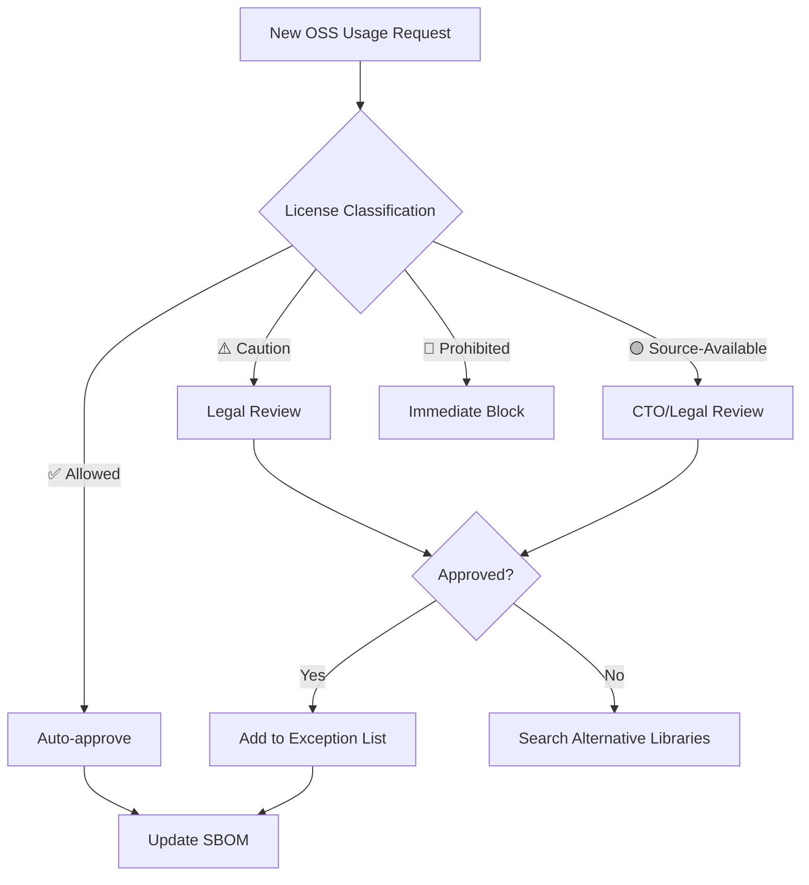
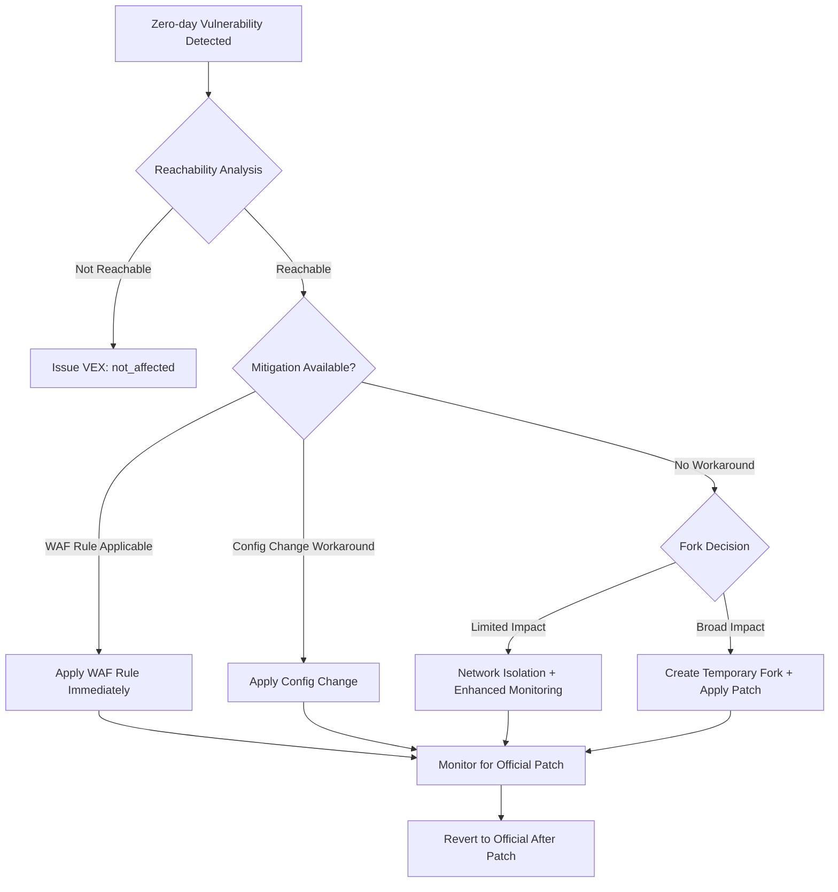
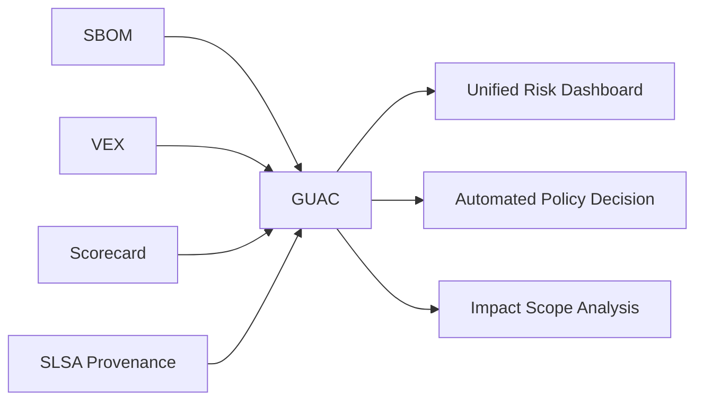
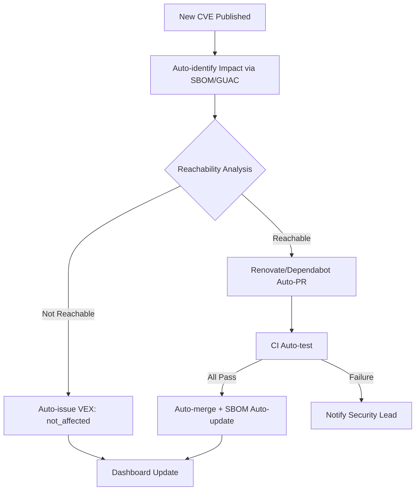
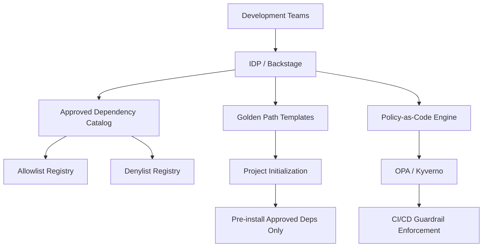
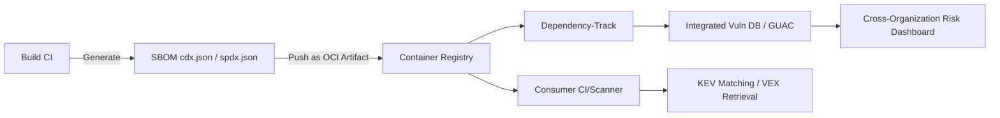

# 62. License & Dependency Management

> [!CAUTION]
> **This file is a Universal Rule (Immutable). Editing is prohibited unless an explicit "Amend Constitution" instruction is given.**
> Last Updated: 2026-04-19 → **2026-04-19 (v4: §59-§63 added + §29 structural bug fix + zero coverage gaps)**

> [!IMPORTANT]
> **Supreme Directive**
> "Every dependency is a trust decision — unmanaged licenses are legal time bombs."
> All third-party dependencies must be audited, approved, and continuously monitored.
> Strictly follow: **License Compliance > Security > Stability > Convenience**.
> **63 Sections (v4: §59-§63 newly added + §29 structural bug fixed + NIS2, AI IDE SCA, SBOM Federation, ML BOM, Dependency SLO coverage).**

---

## Table of Contents

| § | Section |
|---|---|
| 1 | [License Classification & Policy](#1-license-classification--policy) |
| 2 | [License Compatibility Matrix](#2-license-compatibility-matrix) |
| 3 | [AI/ML Model Licensing](#3-aiml-model-licensing) |
| 4 | [Container Image License Management](#4-container-image-license-management) |
| 5 | [IaC Module & Action Licensing](#5-iac-module--action-licensing) |
| 6 | [Font & Media Asset Licensing](#6-font--media-asset-licensing) |
| 7 | [SBOM (Software Bill of Materials)](#7-sbom-software-bill-of-materials) |
| 8 | [SBOM Regulatory Compliance](#8-sbom-regulatory-compliance) |
| 9 | [Supply Chain Security Foundation](#9-supply-chain-security-foundation) |
| 10 | [SCA Tool Integration](#10-sca-tool-integration) |
| 11 | [CI Pipeline Guardrails](#11-ci-pipeline-guardrails) |
| 12 | [Dependency Selection Criteria](#12-dependency-selection-criteria) |
| 13 | [Bundle Size & Performance Impact](#13-bundle-size--performance-impact) |
| 14 | [Lockfile Integrity](#14-lockfile-integrity) |
| 15 | [Automated Update Strategy (Renovate / Dependabot)](#15-automated-update-strategy-renovate--dependabot) |
| 16 | [Security Patch SLA](#16-security-patch-sla) |
| 17 | [Monorepo Dependency Management](#17-monorepo-dependency-management) |
| 18 | [Private Registry / Artifactory](#18-private-registry--artifactory) |
| 19 | [Transitive Dependency Management](#19-transitive-dependency-management) |
| 20 | [EOL / Deprecated Package Management](#20-eol--deprecated-package-management) |
| 21 | [Attribution & NOTICE Generation](#21-attribution--notice-generation) |
| 22 | [OSPO (Open Source Program Office)](#22-ospo-open-source-program-office) |
| 23 | [Dependency Compromise Incident Response](#23-dependency-compromise-incident-response) |
| 24 | [Audit & Reporting](#24-audit--reporting) |
| 25 | [FinOps: Dependency Cost Optimization](#25-finops-dependency-cost-optimization) |
| 26 | [OpenSSF Scorecard Integration](#26-openssf-scorecard-integration) |
| 27 | [Dependency Confusion Attack Defense](#27-dependency-confusion-attack-defense) |
| 28 | [VEX (Vulnerability Exploitability eXchange)](#28-vex-vulnerability-exploitability-exchange) |
| 29 | [CBOM (Cryptographic Bill of Materials)](#29-cbom-cryptographic-bill-of-materials) |
| 30 | [Multi-Ecosystem Dependency Management](#30-multi-ecosystem-dependency-management) |
| 31 | [Package Publishing Security & OIDC Migration](#31-package-publishing-security--oidc-migration) |
| 32 | [GitHub Dependency Review Integration](#32-github-dependency-review-integration) |
| 33 | [OSS Legal Risk Management](#33-oss-legal-risk-management) |
| 34 | [Zero-Day Dependency Response Playbook](#34-zero-day-dependency-response-playbook) |
| 35 | [AI-Generated Code License Risk](#35-ai-generated-code-license-risk) |
| 36 | [Slopsquatting / AI Package Hallucination Defense](#36-slopsquatting--ai-package-hallucination-defense) |
| 37 | [SBOM Long-Term Retention & CRA Technical Documentation](#37-sbom-long-term-retention--cra-technical-documentation) |
| 38 | [Runtime Dependency Monitoring (Runtime SCA)](#38-runtime-dependency-monitoring-runtime-sca) |
| 39 | [Dependency Minimization Principle](#39-dependency-minimization-principle) |
| 40 | [Supply Chain Incident Case Database](#40-supply-chain-incident-case-database) |
| 41 | [Dependency Governance Maturity Model](#41-dependency-governance-maturity-model) |
| 42 | [License Laundering Defense](#42-license-laundering-defense) |
| 43 | [Remote Dynamic Dependencies (RDD) Defense](#43-remote-dynamic-dependencies-rdd-defense) |
| 44 | [DORA ICT Supply Chain Requirements](#44-dora-ict-supply-chain-requirements) |
| 45 | [Continuous Verification](#45-continuous-verification) |
| 46 | [OpenSSF GUAC Integration](#46-openssf-guac-integration) |
| 47 | [Maintainer Burnout Risk Mitigation](#47-maintainer-burnout-risk-mitigation) |
| 48 | [Automated Dependency Security Response](#48-automated-dependency-security-response) |
| 49 | [Developer Security Education & Awareness](#49-developer-security-education--awareness) |
| 50 | [WebAssembly / Native Binary Dependency Management](#50-webassembly--native-binary-dependency-management) |
| 51 | [Platform Engineering / IDP Dependency Governance](#51-platform-engineering--idp-dependency-governance) |
| 52 | [LLM / AI Toolchain Dependency Management](#52-llm--ai-toolchain-dependency-management) |
| 53 | [Green Engineering: Carbon-Optimized Dependency Management](#53-green-engineering-carbon-optimized-dependency-management) |
| **54** | [**CISA KEV Integration & EPSS-Driven Vulnerability Prioritization**](#54-cisa-kev-integration--epss-driven-vulnerability-prioritization) |
| **55** | [**EU AI Act Technical Documentation (Training Data License Tracking)**](#55-eu-ai-act-technical-documentation-training-data-license-tracking) |
| **56** | [**Reproducible Builds & Hermetic Repository Standard**](#56-reproducible-builds--hermetic-repository-standard) |
| **57** | [**SBOM Quality Maturity Model**](#57-sbom-quality-maturity-model) |
| **58** | [**Next-Generation Package Manager Governance (uv / Bun / cargo-auditable)**](#58-next-generation-package-manager-governance-uv--bun--cargo-auditable) |
| **59** | [**NIS2 Directive: Software Supplier Security Obligations**](#59-nis2-directive-software-supplier-security-obligations) |
| **60** | [**AI IDE-Integrated Real-Time SCA**](#60-ai-ide-integrated-real-time-sca) |
| **61** | [**SBOM Federation (OCI Artifact Distribution Standard)**](#61-sbom-federation-oci-artifact-distribution-standard) |
| **62** | [**ML BOM (Machine Learning Bill of Materials)**](#62-ml-bom-machine-learning-bill-of-materials) |
| **63** | [**Dependency SLO / Error Budget Management**](#63-dependency-slo--error-budget-management) |
| A | [Appendix A: Quick Reference Index](#appendix-a-quick-reference-index) |
| B | [Appendix B: Change Summary (v2/v3/v4 Additions)](#appendix-b-change-summary-v2v3v4-additions) |

---

## §1. License Classification & Policy

### 1.1 Three-Tier Classification

**✅ Allowed (Safe — Immediate Use)**:

| License | Risk | Notes |
|:--------|:-----|:------|
| MIT | ✅ Safe | Most permissive. Commercial use OK. Attribution required |
| Apache-2.0 | ✅ Safe | Includes patent clause. Commercial use OK. NOTICE retention required |
| BSD-2-Clause | ✅ Safe | Commercial use OK |
| BSD-3-Clause | ✅ Safe | Commercial use OK. Name use restriction |
| ISC | ✅ Safe | Equivalent to MIT |
| CC0-1.0 | ✅ Safe | Public domain equivalent |
| 0BSD | ✅ Safe | No attribution required |
| Unlicense | ✅ Safe | Public domain equivalent |
| Zlib | ✅ Safe | Commercial use OK |
| PSF-2.0 | ✅ Safe | Python standard library |

**⚠️ Caution (Legal Review Required)**:

| License | Risk | Action |
|:--------|:-----|:-------|
| LGPL-2.1 / LGPL-3.0 | ⚠️ Conditional | Dynamic linking OK. Legal review + exception approval |
| MPL-2.0 | ⚠️ Conditional | File-level copyleft. Legal review + exception approval |
| EPL-2.0 | ⚠️ Conditional | Module-level copyleft. Legal review |
| CDDL-1.0 | ⚠️ Conditional | File-level copyleft. Legal review |
| Artistic-2.0 | ⚠️ Conditional | Perl-derived. Name change obligation on modification |
| CC-BY-4.0 | ⚠️ Conditional | For documentation/data, not code |
| CC-BY-SA-4.0 | ⚠️ Conditional | ShareAlike condition. Legal review |
| EUPL-1.2 | ⚠️ Conditional | EU public license. Copyleft compatibility clause. Check compatible license list |

**🔴 Prohibited (Immediate Block)**:

| License | Risk | Reason |
|:--------|:-----|:-------|
| GPL-2.0 / GPL-3.0 | 🔴 High | Source disclosure obligation for entire project |
| AGPL-3.0 | 🔴 Highest | Disclosure obligation even for SaaS/network use |
| SSPL | 🔴 Highest | MongoDB-origin. Similar viral effect |
| CC-BY-NC-* | 🔴 High | No commercial use |
| CC-BY-ND-* | 🔴 High | No modifications allowed |
| CAL-1.0 | 🔴 High | Strong copyleft. User data encryption obligation |

### 1.2 Source-Available License Handling

| License | Classification | Notes |
|:--------|:-------------|:------|
| BSL-1.1 (Business Source License) | 🔴 Prohibited | Converts to Apache-2.0 after time limit, but commercial restrictions before conversion. HashiCorp Terraform, etc. |
| FSL-1.1 (Functional Source License) | 🔴 Prohibited | Converts to Apache-2.0/MIT after 2 years. Competitive use prohibited before conversion |
| Elastic License 2.0 | 🔴 Prohibited | SaaS provision prohibited. Redistribution restricted |
| PolyForm Shield 1.0.0 | 🔴 Prohibited | Competitive use prohibited |
| BUSL (MariaDB BSL) | 🔴 Prohibited | BSL-1.1 derivative. Equivalent restrictions |

> [!CAUTION]
> Source-Available licenses mean "source code is visible ≠ OSS." They are NOT OSI-approved and MUST NOT be treated like traditional open source.

### 1.3 Dual Licensing Strategy

- **Rule**: For dual-licensed packages, select the **most commercially favorable license** and specify it in `package.json`'s `license` field
- **Rule**: For Copyleft/Permissive dual licenses, always choose the Permissive side
- **Rule**: Document license selection rationale in the `licenses/decisions/` directory

→ Cross-reference: [`601_data_governance.md`](../security/100_data_governance.md) §GenAI Copyright

---

## §2. License Compatibility Matrix

### 2.1 Compatibility Rules

| Output Form | Compatible License Requirements |
|:-----------|:-------------------------------|
| Static linking | All library licenses must be compatible |
| Dynamic linking | LGPL allowed. GPL not allowed |
| SaaS delivery | AGPL exclusion mandatory. SSPL exclusion mandatory |
| Container distribution | Full layer compatibility including base image |
| WebAssembly distribution | Treated same as static linking |
| npm / PyPI publishing | Verify transitivity dependency compatibility |

### 2.2 Automated Compatibility Check

```yaml
# .github/workflows/license-compat.yml
- name: License Compatibility Check
  run: |
    npx license-checker --production --json > licenses.json
    node scripts/check-license-compat.js licenses.json
```

```javascript
// scripts/check-license-compat.js
const fs = require('fs');
const PROHIBITED = ['GPL-2.0', 'GPL-3.0', 'AGPL-3.0', 'SSPL'];
const REVIEW_REQUIRED = ['LGPL-2.1', 'LGPL-3.0', 'MPL-2.0', 'EPL-2.0'];
const SOURCE_AVAILABLE = ['BSL-1.1', 'FSL-1.1', 'Elastic-2.0'];

const licenses = JSON.parse(fs.readFileSync(process.argv[2]));
const violations = [];
for (const [pkg, info] of Object.entries(licenses)) {
  const lic = info.licenses || '';
  if (PROHIBITED.some(l => lic.includes(l))) {
    violations.push({ pkg, license: lic, severity: 'BLOCK' });
  } else if (SOURCE_AVAILABLE.some(l => lic.includes(l))) {
    violations.push({ pkg, license: lic, severity: 'BLOCK' });
  } else if (REVIEW_REQUIRED.some(l => lic.includes(l))) {
    violations.push({ pkg, license: lic, severity: 'REVIEW' });
  }
}
if (violations.some(v => v.severity === 'BLOCK')) {
  console.error('❌ Prohibited license detected:', JSON.stringify(violations, null, 2));
  process.exit(1);
}
if (violations.some(v => v.severity === 'REVIEW')) {
  console.warn('⚠️ Review-required license:', JSON.stringify(violations, null, 2));
}
```

→ Cross-reference: [`600_security_privacy.md`](../security/000_security_privacy.md) §Supply Chain Security

---

## §3. AI/ML Model Licensing

### 3.1 Model Weight License Classification

| License | Commercial | Modify | Redistribute | Notes |
|:--------|:----------|:-------|:------------|:------|
| Apache-2.0 (Llama 3, etc.) | ✅ | ✅ | ✅ | User count limit (Meta: 700M MAU) |
| Gemma Terms of Use | ✅ | ✅ | ⚠️ | Subject to Google Terms |
| OpenRAIL-M | ✅ | ✅ | ⚠️ | Responsible AI use restrictions |
| CC-BY-NC-4.0 | ❌ | ✅ | ⚠️ | Non-commercial. Research only |
| Llama 2 Community License | ✅ | ✅ | ⚠️ | Separate contract required for 700M+ MAU |
| Mistral Research License | ❌ | ⚠️ | ❌ | Research use only |

### 3.2 Rules

- **Rule**: Verify license and Acceptable Use Policy before downloading model weights
- **Rule**: Confirm "derivative work" conditions of the original license before distributing fine-tuned models
- **Rule**: Monitor user counts monthly when model license defines MAU limits
- **Rule**: Monitor model license changes quarterly (e.g., Llama 2→3 license change)

→ Cross-reference: [`601_data_governance.md`](../security/100_data_governance.md) §GenAI Copyright, [`400_ai_engineering.md`](../ai/000_ai_engineering.md)

---

## §4. Container Image License Management

### 4.1 Rules

- **Rule**: Always verify base image license (e.g., Alpine=MIT, Ubuntu=GPL mix, Distroless=Apache-2.0 recommended)
- **Rule**: Only packages in the final multi-stage build stage are subject to licensing
- **Rule**: Generate container SBOM with `syft` or `trivy` and auto-verify in CI

```bash
# Container SBOM generation
syft packages myapp:latest -o spdx-json > container-sbom.spdx.json
# License check
trivy image --scanners license --severity HIGH,CRITICAL myapp:latest
```

### 4.2 Base Image Selection Criteria

| Image | License Risk | Recommendation |
|:------|:-----------|:-------------|
| gcr.io/distroless | ✅ Low (Apache-2.0) | ⭐ Most recommended |
| chainguard/static | ✅ Low (Apache-2.0) | ⭐ Recommended (minimal attack surface) |
| alpine | ✅ Low (MIT) | ⭐ Recommended |
| debian-slim | ⚠️ Medium (GPL mix) | Allowed (attribution attention) |
| ubuntu | ⚠️ Medium (GPL mix) | Allowed (attribution attention) |

---

## §5. IaC Module & Action Licensing

### 5.1 Rules

- **Rule**: Verify license when adopting Terraform modules (registry/GitHub)
- **Rule**: Pin third-party GitHub Actions with **SHA pinning**
- **Rule**: Prefer official/Verified Creator actions over forks
- **Rule**: Helm chart licenses are also subject to review
- **Rule**: Understand the license difference between OpenTofu/Terraform (MPL-2.0 vs BSL-1.1) and determine project policy

```yaml
# ✅ Correct: SHA pinning
- uses: actions/checkout@b4ffde65f46336ab88eb53be808477a3936bae11 # v4.1.1

# ❌ Wrong: Tag only
- uses: actions/checkout@v4
```

→ Cross-reference: [`600_security_privacy.md`](../security/000_security_privacy.md) §Supply Chain

---

## §6. Font & Media Asset Licensing

### 6.1 Rules

- **Rule**: Google Fonts (OFL/Apache-2.0) are safe. Verify license when self-hosting
- **Rule**: Strictly follow seat and usage limits for commercial fonts (Adobe Fonts, etc.)
- **Rule**: Store stock image/icon license certificates in `licenses/` directory
- **Rule**: Provide attribution for CC-BY images in alt text or caption
- **Rule**: Verify copyright attribution for AI-generated images per service ToS (see §35)

| Asset Type | Safe Licenses | Licenses Requiring Attention |
|:----------|:-------------|:---------------------------|
| Fonts | OFL-1.1, Apache-2.0 | Commercial fonts (seat limits) |
| Icons | MIT, CC0 | CC-BY (attribution required) |
| Images | Unsplash License, CC0 | CC-BY-NC (no commercial use) |

→ Cross-reference: [`200_design_ux.md`](../design/000_design_ux.md)

---

## §7. SBOM (Software Bill of Materials)

### 7.1 SBOM Generation Mandate

- **Rule**: Auto-generate SBOM for all release builds (mandatory CI integration)
- **Rule**: Use **CycloneDX 1.6+** (security automation) or **SPDX 3.0+** (license compliance)
- **Rule**: Parallel generation of both formats recommended (complementary coverage)

### 7.2 SBOM Minimum Data Elements (CISA 2025 Standard)

| Field | Description | Required |
|:------|:-----------|:---------|
| Component Name | Package name | ✅ |
| Version | Version | ✅ |
| Supplier | Supplier/Vendor | ✅ |
| Component Hash | SHA-256 or equivalent | ✅ |
| License Information | SPDX identifier | ✅ |
| Dependency Relationship | Direct/transitive distinction | ✅ |
| Tool Name | SBOM generation tool name | ✅ |
| Generation Context | Timestamp, build ID | ✅ |
| Unique Identifier | PURL (Package URL) recommended | ✅ (2026~) |

### 7.3 SBOM Generation Snippet

```yaml
# .github/workflows/sbom.yml
sbom:
  runs-on: ubuntu-latest
  steps:
    - uses: actions/checkout@v4
    - run: npm ci
    - name: Generate CycloneDX SBOM
      run: npx @cyclonedx/cyclonedx-npm --output-file sbom.cdx.json
    - name: Generate SPDX SBOM
      run: |
        syft dir:. -o spdx-json > sbom.spdx.json
    - name: Upload SBOM artifacts
      uses: actions/upload-artifact@v4
      with:
        name: sbom-${{ github.sha }}
        path: |
          sbom.cdx.json
          sbom.spdx.json
        retention-days: 3650  # EU CRA 10-year retention requirement
```

### 7.4 SBOM Lifecycle Management

- **Rule**: Refresh SBOM not only per release, but per build when dependencies change
- **Rule**: Link SBOM to Git commit hash and CI/CD pipeline ID for traceability
- **Rule**: Apply SemVer to SBOM versioning, incrementing minor version on component changes
- **Rule**: Centrally manage SBOMs in a repository or platform (DependencyTrack, etc.)

→ Cross-reference: [`300_engineering_standards.md`](../engineering/000_engineering_standards.md) §CI/CD

---

## §8. SBOM Regulatory Compliance

### 8.1 Global Regulation Timeline

| Regulation | Effective Date | Requirement | Penalty |
|:-----------|:-------------|:-----------|:--------|
| US EO 14028 | 2021~ (phased) | SBOM mandatory for federal procurement software | Procurement disqualification |
| CISA SBOM Minimum Elements v2 | **2025-08** | Component hash, license, tool name, generation context, PURL added | — |
| India CERT-In SBOM GL 2.0 | **2025-07** | SBOM mandatory for essential services. Recommended for private sector | — |
| DORA (EU Financial) | **2025-01 effective** | ICT third-party risk management. Software supply chain visibility mandate | Up to €10M or 5% revenue |
| EU CRA: Delegated Regulation (EU) 2025/1535 | **2025-07** | Technical descriptions for important/critical product categories | — |
| EU CRA: Implementing Regulation (EU) 2025/2392 | **2025-11** | Detailed conformity assessment requirements | — |
| EU CRA: Conformity Assessment Body Notification | **2026-06** | Conformity assessment body notification obligation begins | — |
| EU CRA: Vulnerability Reporting | **2026-09** | 24-hour reporting obligation for actively exploited vulnerabilities. ENISA notification mandatory | Up to €15M or 2.5% revenue |
| EU CRA: Full Enforcement | **2027-12** | SBOM mandatory in product technical documentation. Machine-readable format. **10-year retention obligation**. 5-year security update obligation | Up to €15M or 2.5% revenue |
| APAC Regulatory Guidelines | 2023~ (phased) | SBOM for software management. Effectively mandatory for government procurement in certain APAC regions | — |
| NIST SSDF Update | 2026 (planned) | SBOM requirement strengthening, SLSA compliance recommendation | — |

> [!IMPORTANT]
> EU CRA is phased: the 2026-09 vulnerability reporting obligation is the first substantive deadline. The intermediate horizontal standard (including SBOM schema) is expected from CEN/CENELEC by mid-2026.

### 8.2 Rules

- **Rule**: If placing products on the EU market, begin preparation for CRA 2026-09 vulnerability reporting requirements **now**
- **Rule**: CRA technical documentation SBOM retention period is **10 years**. Establish long-term storage strategy (see §37)
- **Rule**: For financial sector, conduct ICT third-party risk assessment per DORA requirements (see §44)
- **Rule**: For government procurement, provide SBOM fully compliant with CISA SBOM Minimum Elements v2

→ Cross-reference: [`601_data_governance.md`](../security/100_data_governance.md) §EU Data Act

---

## §9. Supply Chain Security Foundation

### 9.1 SLSA (Supply-chain Levels for Software Artifacts) v1.1

| Level | Requirements | Protection Target |
|:------|:-----------|:----------------|
| SLSA 1 | Build process documentation. Provenance existence | Tampering audit initiation |
| SLSA 2 | Hosted build service. Signed provenance | Build environment tampering |
| SLSA 3 | Isolated build environment. Reproducible builds. Ephemeral workers | Insider threats, build injection |

- **Rule**: Achieve minimum **SLSA 2** (achievable with GitHub Actions + Artifact Attestation)
- **Rule**: Target SLSA 3 with ephemeral runners + hermetic builds

### 9.2 OIDC Trusted Publishing

- **Rule**: OIDC Trusted Publishing is the **sole method** for package publishing (see §31)
- **Rule**: **Completely prohibit** long-lived access tokens (npm/PyPI/GitHub Packages universal)

### 9.3 GitHub Artifact Attestation

- **Rule**: Generate Provenance Attestation using `actions/attest-build-provenance` in CI/CD builds
- **Rule**: Verify provenance on consumer side with `gh attestation verify`
- **Rule**: Comply with in-toto attestation framework for end-to-end supply chain verification

### 9.4 Sigstore Integration

- **Rule**: Sign container images with `cosign` (Keyless mode recommended)
- **Rule**: Enforce signature verification via Kubernetes Admission Controller

```bash
# Keyless signing (Sigstore Fulcio + Rekor)
cosign sign myregistry.com/myapp:v1.0.0
# Keyless verification
cosign verify myregistry.com/myapp:v1.0.0 \
  --certificate-identity=workflow@github.com \
  --certificate-oidc-issuer=https://token.actions.githubusercontent.com
```

→ Cross-reference: [`600_security_privacy.md`](../security/000_security_privacy.md) §Supply Chain, [`300_engineering_standards.md`](../engineering/000_engineering_standards.md) §CI/CD

---

## §10. SCA Tool Integration

### 10.1 Recommended Tool Stack (2026 Edition)

| Tool | Primary Strength | Use Case |
|:-----|:----------------|:---------|
| Snyk | Vulnerability detection + AI fix suggestions + Snyk Code SAST integration | Primary choice for vulnerability management |
| FOSSA | License compliance + SBOM + NOTICE auto-generation | Primary choice for license management |
| Socket.dev | Malware detection + AI behavior analysis + **Reachability analysis (Coana integration)** | Primary choice for supply chain attack defense |
| Semgrep Supply Chain | Transitive reachability analysis | False positive reduction |
| Trivy | Container + IaC + SBOM + License | Container security |
| Endor Labs | DCA (Dependency Caller Analysis) + Binary-to-Source AI | Reachability analysis, context-centric |
| Grype | OSS CLI scanner (SBOM/container image) | Cloud-native workflows |
| `npm audit` | npm built-in | Minimum baseline |

> [!NOTE]
> Socket.dev acquired Coana in April 2025, integrating reachability analysis capabilities. Can reduce CVE false positives by up to 80%. Trusted Publishing support also completed July 2025.

### 10.2 Rules

- **Rule**: Integrate at least one SCA tool into CI (Snyk recommended)
- **Rule**: Execute license checks and security scans as **separate jobs**
- **Rule**: Include Go modules, Python pyproject.toml, Rust Cargo.toml in SCA scope beyond npm/yarn/pnpm
- **Rule**: Suppress false positives explicitly via `.snyk` policy files with documented reason and expiry
- **Rule**: Enable Socket.dev behavior analysis alerts (install scripts/network access/filesystem access)
- **Rule**: Deploy reachability analysis tools (Socket.dev / Endor Labs / Semgrep SC) to focus on genuinely actionable vulnerabilities
- **Rule**: Integrate AI-generated code license contamination scanning into SCA pipeline (see §42)

---

## §11. CI Pipeline Guardrails

### 11.1 Auto-Block Rules

| Detection | Action | Exception Procedure |
|:---------|:-------|:-------------------|
| 🔴 Prohibited license (GPL/AGPL/SSPL) | PR merge auto-block | CTO written approval |
| 🟡 Source-Available license (BSL/FSL/Elastic) | PR merge auto-block | CTO/Legal approval |
| Critical vulnerability (CVSS ≥ 9.0) | PR merge auto-block | Security lead approval (within 24h) |
| High vulnerability (CVSS ≥ 7.0) | Warning + 7-day fix obligation | Team lead approval |
| Unknown license (UNKNOWN) | PR merge auto-block | Manual review then add to allowlist |
| OpenSSF Scorecard < 4.0 | Warning | See §26 |
| Socket.dev behavior analysis: High-risk | PR merge auto-block | Security lead approval |

### 11.2 CI Configuration Example

```yaml
# .github/workflows/dependency-guard.yml
name: Dependency Guard
on: [pull_request]
jobs:
  license-check:
    runs-on: ubuntu-latest
    steps:
      - uses: actions/checkout@v4
      - run: npm ci
      - name: License Check
        run: |
          npx license-checker --production --failOn \
            "GPL-2.0;GPL-3.0;AGPL-3.0;SSPL;UNKNOWN"

  vulnerability-scan:
    runs-on: ubuntu-latest
    steps:
      - uses: actions/checkout@v4
      - run: npm ci
      - name: Snyk Test
        uses: snyk/actions/node@master
        env:
          SNYK_TOKEN: ${{ secrets.SNYK_TOKEN }}
        with:
          args: --severity-threshold=high

  supply-chain-check:
    runs-on: ubuntu-latest
    steps:
      - uses: actions/checkout@v4
      - name: Socket Security
        uses: SocketDev/socket-security-action@v1
        with:
          api_key: ${{ secrets.SOCKET_API_KEY }}
```

→ Cross-reference: [`300_engineering_standards.md`](../engineering/000_engineering_standards.md) §CI/CD

---

## §12. Dependency Selection Criteria

### 12.1 Health Metrics (Pre-Adoption Checklist)

| Indicator | Minimum | Ideal |
|:---------|:--------|:------|
| GitHub Stars | ≥ 500 | ≥ 5,000 |
| Last Commit | Within 6 months | Within 1 month |
| Maintainer Count | ≥ 2 | ≥ 5 |
| Open Issue Resolution Rate | ≥ 50% | ≥ 80% |
| Test Coverage | Exists | ≥ 80% |
| TypeScript Definitions | Exists | Built-in |
| Downloads (npm weekly) | ≥ 10,000 | ≥ 100,000 |
| Security Policy | Exists | SECURITY.md + vulnerability report flow |
| License | On allowed list | MIT / Apache-2.0 |
| **OpenSSF Scorecard** | **≥ 4.0** | **≥ 7.0** |
| **Bus Factor** | **≥ 2** | **≥ 5** (see §47) |

### 12.2 Risk Scoring

- **Rule**: Require team lead approval when checklist pass rate is **below 70%** for new dependencies
- **Rule**: Compare at least 2 alternative candidates for each new dependency
- **Rule**: Enforce "1 package = 1 function" principle; prefer lightweight alternatives over mega-libraries
- **Rule**: Packages with OpenSSF Scorecard **below 4.0** are prohibited by default (see §26)
- **Rule**: Perform additional risk assessment for Bus Factor 1 packages (see §47)

---

## §13. Bundle Size & Performance Impact

### 13.1 Rules

- **Rule**: Check size impact on [`bundlephobia.com`](https://bundlephobia.com) before adding web app dependencies
- **Rule**: Dependencies **over 50KB gzipped** require team lead approval
- **Rule**: Prefer tree-shaking compatible (ESM) packages
- **Rule**: Always evaluate lightweight alternatives for equivalent functionality

### 13.2 Recommended Alternatives

| Heavy | Lightweight Alternative | Size Reduction |
|:------|:-----------------------|:--------------|
| moment.js (72KB) | date-fns (tree-shakeable) | -90% |
| lodash (72KB) | lodash-es (tree-shakeable) | -80% |
| axios (14KB) | ky (3KB) / fetch API | -80% |
| uuid (12KB) | crypto.randomUUID() | -100% |
| classnames (1.5KB) | clsx (0.5KB) | -65% |

→ Cross-reference: [`340_web_frontend.md`](../engineering/300_web_frontend.md) §Performance Budget

---

## §14. Lockfile Integrity

### 14.1 Rules

- **Rule**: **Always commit** `package-lock.json`, `yarn.lock`, `pnpm-lock.yaml`, `Podfile.lock`, `pubspec.lock`
- **Rule**: Use **`npm ci`** (or `pnpm install --frozen-lockfile`) in CI; prohibit `npm install`
- **Rule**: **Always review** lockfile diffs in PRs
- **Rule**: Integrate `lockfile-lint` in CI to guarantee retrieval from trusted registries
- **Rule**: Ensure all team members use identical Node.js/npm versions (`.nvmrc` / `.node-version`)
- **Rule**: Enable Corepack and pin package manager version via `packageManager` field

### 14.2 Corepack Configuration

```json
// package.json
{
  "packageManager": "pnpm@9.15.0+sha512.abc123..."
}
```

### 14.3 Install Script Security

- **Rule**: Set `ignore-scripts=true` as default in `.npmrc`; whitelist trusted packages only via `allow-scripts`
- **Rule**: Packages with `postinstall` / `preinstall` scripts require additional review

```ini
# .npmrc — Install Script defense
ignore-scripts=true
```

---

## §15. Automated Update Strategy (Renovate / Dependabot)

### 15.1 Recommended Configuration

- **Rule**: Prefer Renovate as primary tool (more flexible configuration than Dependabot)
- **Rule**: Enable **auto-merge** for security updates (patch/minor level + all CI pass)
- **Rule**: Require manual review for major updates
- **Rule**: Set **minimumReleaseAge: 21 days** to verify stability before adoption
- **Rule**: Use weekly grouped PRs for batch dependency updates (noise reduction)

### 15.2 Renovate Configuration Example

```json
{
  "$schema": "https://docs.renovatebot.com/renovate-schema.json",
  "extends": ["config:recommended", "schedule:weekends"],
  "minimumReleaseAge": "21 days",
  "vulnerabilityAlerts": { "enabled": true, "minimumReleaseAge": "0 days" },
  "packageRules": [
    {
      "matchUpdateTypes": ["patch", "minor"],
      "matchCurrentVersion": "!/^0/",
      "automerge": true,
      "automergeType": "pr",
      "requiredStatusChecks": ["ci/build", "ci/test", "license-check"]
    },
    {
      "matchUpdateTypes": ["major"],
      "dependencyDashboardApproval": true
    }
  ]
}
```

---

## §16. Security Patch SLA

### 16.1 SLA Definition

| Severity | CVSS | Response Deadline | Automation |
|:---------|:-----|:-----------------|:-----------|
| Critical | ≥ 9.0 | **Within 24 hours** | Auto PR + Slack notification |
| High | ≥ 7.0 | **Within 7 days** | Auto PR |
| Medium | ≥ 4.0 | **Within 30 days** | Weekly report |
| Low | < 4.0 | **Within 90 days** | Quarterly review |

### 16.2 CISA KEV Integration & EPSS-Driven Prioritization

> [!IMPORTANT]
> CVSS-only SLA prioritization is insufficient for 2026 practice. **CISA KEV registration (confirmed active exploitation) becomes the SLA trigger point**, supplemented by EPSS score (≥0.8 = top ~20% exploitation probability) for real-world risk assessment.

| Priority | Condition | SLA | Automation |
|:---------|:---------|:----|:-----------|
| 🔴 P0 | **CISA KEV registered** | **Within 3 days** | Immediate alert + WAF update |
| 🔴 P1 | Critical + EPSS ≥ 0.8 | **Within 6 hours** | Containment + alert |
| 🟠 P2 | Critical (CVSS ≥ 9.0) | 24 hours | Auto PR |
| 🟡 P3 | High (CVSS ≥ 7.0) | 7 days | Auto PR |
| 🟢 P4 | Medium/Low | 30 days / 90 days | Weekly report |

```bash
# Auto-matching CISA KEV list against your SBOM
# 1. Fetch CISA KEV JSON
curl -s https://www.cisa.gov/sites/default/files/feeds/known_exploited_vulnerabilities.json \
  | jq '[.vulnerabilities[].cveID]' > kev-list.json

# 2. Match via Dependency-Track API
curl -s "$DTRACK_URL/api/v1/finding/project/$PROJECT_UUID" \
  -H "X-Api-Key: $DTRACK_KEY" \
  | jq --slurpfile kev kev-list.json \
    '[.[] | select(.vulnerability.vulnId as $v | $kev[0] | index($v) != null)]'
```

### 16.3 Rules

- **Rule**: For Critical vulnerabilities, perform reachability analysis; if reachable, apply mitigations (WAF rules, etc.) **within 4 hours**
- **Rule**: **CISA KEV-registered CVEs** require remediation or VEX-based mitigation within 3 days, regardless of reachability analysis result
- **Rule**: Medium CVEs with EPSS score ≥ 0.8 (top ~20%) are escalated to P1 treatment, overriding CVSS-only classification
- **Rule**: If patching is not feasible, issue VEX status with documented rationale (see §28)
- **Rule**: Analyze root cause in monthly retrospective when SLA is breached

→ Cross-reference: §28 VEX, §54 CISA KEV Integration Details

---

## §17. Monorepo Dependency Management

### 17.1 Rules

- **Rule**: Use pnpm workspaces (recommended) or npm workspaces for monorepos
- **Rule**: Place common dependencies at root; manage package-specific dependencies individually
- **Rule**: Manage all workspaces with a **single lockfile** (`pnpm-lock.yaml`)
- **Rule**: Enable Merge Queue for safe post-CI merge guarantee

---

## §18. Private Registry / Artifactory

### 18.1 Rules

- **Rule**: Manage private packages via private registry (GitHub Packages / Artifactory / Verdaccio)
- **Rule**: Set up proxy/cache layer for public registries for availability
- **Rule**: **Reserve** internal package scopes (`@company/`) on npm public registry to prevent **typosquatting** (see §27)
- **Rule**: Manage registry publish permissions with **least privilege principle**
- **Rule**: Migrate npm tokens to **OIDC Trusted Publishing**; deprecate long-lived tokens (see §31)
- **Rule**: Enforce MFA for registry access

---

## §19. Transitive Dependency Management

### 19.1 Rules

- **Rule**: Periodically verify entire dependency tree with `npm ls --all`
- **Rule**: Address Critical vulnerabilities in transitive deps via direct dep upgrade or `overrides`
- **Rule**: Consider alternative libraries when transitive depth exceeds **7 levels**
- **Rule**: Track why specific packages are included with `npm explain <package>`

### 19.2 Override-Based Forced Resolution

```json
// package.json
{
  "overrides": {
    "vulnerable-transitive-pkg": ">=2.0.1"
  }
}
```

> [!CAUTION]
> `overrides` is a temporary emergency measure. Complete root-cause resolution (direct dependency upgrade) within 30 days.

---

## §20. EOL / Deprecated Package Management

### 20.1 Rules

- **Rule**: Run `npm outdated` weekly to detect major version gaps
- **Rule**: Migrate packages with `deprecated` flag to alternatives **within 30 days**
- **Rule**: Prohibit running on EOL Node.js versions per LTS schedule
- **Rule**: Establish upgrade plan **within 6 months** of major framework releases (Next.js, React, etc.)

### 20.2 EOL Monitoring Tools

- **endoflife.date**: Retrieve EOL dates for Node.js/frameworks via API
- **libyear**: Measure dependency "age" to quantify technical debt

---

## §21. Attribution & NOTICE Generation

### 21.1 Rules

- **Rule**: Implement OSS license attribution display mechanism in the application
- **Rule**: Display location: "Settings > Licenses" or "About" screen
- **Rule**: Auto-generate `NOTICE` file in CI/CD and include with each release
- **Rule**: Leverage FOSSA's auto-NOTICE regeneration on dependency updates

### 21.2 Platform-Specific Tools

| Platform | Tool | Notes |
|:---------|:-----|:------|
| Web (npm) | `license-checker --csv` | CSV/JSON output |
| iOS (Swift) | `license-plist` | Settings.bundle auto-generation |
| Android | `oss-licenses-plugin` | Google official |
| Flutter | `flutter_oss_licenses` | Cross-platform |
| General | FOSSA NOTICE auto-generation | Enterprise. Auto-regeneration |

### 21.3 Apache-2.0 NOTICE File Specifics

- **Rule**: When using Apache-2.0 licensed libraries, retain and include original `NOTICE` file content (license requirement)

---

## §22. OSPO (Open Source Program Office)

### 22.1 Rules

- **Rule**: Organizations with 50+ employees should establish an OSPO or OSS governance lead
- **Rule**: Verify CLA (Contributor License Agreement) signature when contributing to OSS
- **Rule**: Conduct IP, license, and security review before open-sourcing internal projects

### 22.2 OSS Governance Process



→ Cross-reference: [`603_ip_due_diligence.md`](../security/300_ip_due_diligence.md) §IP Asset Management

---

## §23. Dependency Compromise Incident Response

### 23.1 Incident Runbook

| Step | Action | Owner | SLA |
|:-----|:-------|:------|:----|
| 1. Detection | SCA alert / CVE publication / security advisory | Automated | — |
| 2. Impact Assessment | Identify affected services/releases (reverse lookup from SBOM) | Security Lead | 2 hours |
| 3. Containment | Pin/rollback compromised package / network isolation | SRE | 4 hours |
| 4. Remediation | Apply patch / migrate to alternative / overrides | Dev team | 24 hours |
| 5. Verification | CI full pass + SBOM refresh + production verification | QA | 48 hours |
| 6. Post-mortem | Post-mortem + lessons crystallization | All teams | 1 week |

### 23.2 Major Recent Supply Chain Incidents & Lessons

| Incident | Date | Impact | Lesson |
|:---------|:-----|:-------|:-------|
| npm Chalk/Debug Supply Chain Attack | 2025-09 | Popular packages (billions DL/week) maintainer account compromised. Crypto-stealer injected | Maintainer 2FA mandatory, phishing defense, OIDC TP migration |
| Shai-Hulud Self-Replicating Worm | 2025-09 | 500+ packages infected. Cloud tokens (AWS/GCP/Azure), GitHub PAT stolen. Self-replicates on `npm install` | `ignore-scripts=true` default, minimumReleaseAge |
| S1ngularity Attack (Nx) | 2025-08 | Nx project publishing token stolen | Full OIDC Trusted Publishing migration, token leak monitoring |
| PhantomRaven Campaign | 2025-10~2026-02 | RDD technique evades detection. Slopsquatting combined. Developer .npmrc/env vars/CI tokens stolen | RDD defense (§43), install script disable, env protection |
| OpenClaw/GhostClaw | 2026-03 | Fake AI utility. Crypto wallets, SSH keys, browser data stolen | Package legitimacy verification, official repo confirmation habit |

### 23.3 Rules

- **Rule**: Immediately remove compromised package versions from lockfile
- **Rule**: Use SBOM to identify impact scope across released builds
- **Rule**: Immediately revoke potentially leaked credentials via `npm token revoke`
- **Rule**: Record post-mortem results in lessons log (`core/010_project_lessons_log.md`)
- **Rule**: Migrate publishing tokens from long-lived to OIDC Trusted Publishing to eliminate theft risk
- **Rule**: Enforce 2FA/WebAuthn for maintainer accounts to prevent phishing-based account takeover
- **Rule**: Consider network-isolated CI builds to counter self-replicating malware (Shai-Hulud type)

→ Cross-reference: [`503_incident_response.md`](../operations/500_incident_response.md), [`600_security_privacy.md`](../security/000_security_privacy.md)

---

## §24. Audit & Reporting

### 24.1 Dashboard KPIs

| KPI | Frequency | Target |
|:----|:---------|:-------|
| Critical/High vulnerability count | Daily | 0 |
| Prohibited license violations | Daily | 0 |
| Average dependency age (libyear) | Monthly | < 1.0 year |
| SBOM generation coverage | Per release | 100% |
| Security patch SLA compliance rate | Monthly | ≥ 95% |
| Deprecated package count | Monthly | 0 |
| VEX coverage rate | Monthly | ≥ 90% (Critical/High) |
| OpenSSF Scorecard average | Quarterly | ≥ 6.0 |

### 24.2 Rules

- **Rule**: Build security dashboard with real-time KPI visualization
- **Rule**: Submit monthly report to leadership for risk status sharing
- **Rule**: Conduct comprehensive license audit quarterly

→ Cross-reference: [`401_data_analytics.md`](../ai/100_data_analytics.md)

---

## §25. FinOps: Dependency Cost Optimization

### 25.1 Rules

- **Rule**: Review SCA tool license costs annually and evaluate ROI
- **Rule**: Avoid paid tool migration when free tiers are sufficient
- **Rule**: Eliminate overlapping features across multiple tools to optimize costs
- **Rule**: Monitor Private Registry bandwidth costs monthly

### 25.2 Cost Reduction Checklist

| Item | Reduction Method | Estimated Impact |
|:----|:----------------|:----------------|
| SCA Tools | Use OSS alternatives (Trivy/Grype) | -$15K~-$50K/yr vs. commercial Snyk Team |
| Private Registry Bandwidth | Proxy cache to reduce redundant downloads | Download reduction -30~60% |
| CI Execution Time | Differential dependency scanning (changed files only) + caching | CPU time -40~70% → GHA billing reduction |
| License Compliance | Use FOSSA free tier (OSS projects) | Up to $12K/yr savings |
| Unused Dependency Removal | Quarterly `depcheck` runs (see §39) | Bundle size reduction → CDN transfer cost -5~20% |
| Tool Consolidation | Snyk + Trivy SBOM dual-use (Snyk Container integration) | Contract reduction -$5~20K/yr |

> [!TIP]
> ROI formula: `(SLA violation penalty avoidance + developer time savings) ÷ Annual SCA tool cost ≥ 3.0` as target ROI benchmark.

→ Cross-reference: [`101_revenue_monetization.md`](../product/300_revenue_monetization.md) §FinOps

---

## §26. OpenSSF Scorecard Integration

### 26.1 Key Check Items

| Check | Content | Importance |
|:------|:--------|:----------|
| Branch-Protection | Default branch protection status | High |
| Code-Review | PR review rate | High |
| Dependency-Update-Tool | Renovate/Dependabot adoption | Medium |
| Maintained | Active maintenance status | High |
| Signed-Releases | Release signing presence | Medium |
| Token-Permissions | GitHub Actions token permission minimization | High |
| Vulnerabilities | Unresolved vulnerability presence | High |
| SAST | Static analysis tool adoption | Medium |

### 26.2 Rules

- **Rule**: Check OpenSSF Scorecard score when adding new dependencies
- **Rule**: Packages with score **below 4.0** are prohibited by default. Exceptions must be documented
- **Rule**: Run Scorecard regularly on own OSS projects; maintain score **7.0+**
- **Rule**: Monitor 2026 OpenSSF themes (AI/ML Security, CRA Alignment) related checks

---

## §27. Dependency Confusion Attack Defense

### 27.1 Attack Vectors

| Attack Method | Description | Primary Defense |
|:-------------|:-----------|:---------------|
| Dependency Confusion | Publish same-name higher version on public registry | Scope reservation + registry priority |
| Typosquatting | Publish similar-name package (e.g., `lodsah`) | Package name similarity check |
| Star-jacking | GitHub repository URL spoofing (npm `repository` field) | Provenance verification + URL cross-validation |
| Install Script Attack | Malicious code in `postinstall` etc. | `ignore-scripts=true` + whitelist |
| RDD (Remote Dynamic Dependencies) | Dynamic remote dependency injection at install time | See §43 |

### 27.2 Defense Rules

- **Rule**: **Reserve** internal package scopes (`@company/`) on npm public registry
- **Rule**: Explicitly set registry priority in `.npmrc`
- **Rule**: Execute package name similarity checks in CI
- **Rule**: Default `ignore-scripts=true`; allow only trusted packages
- **Rule**: Enable malware behavior analysis via Socket.dev or equivalent
- **Rule**: Verify npm Provenance to confirm package publisher CI

→ Cross-reference: [`600_security_privacy.md`](../security/000_security_privacy.md) §Supply Chain

---

## §28. VEX (Vulnerability Exploitability eXchange)

### 28.1 VEX Statuses

| Status | Meaning | Action |
|:-------|:--------|:-------|
| not_affected | Vulnerability exists but does not affect product | No action (document rationale) |
| affected | Vulnerability affects product | Remediate per §16 SLA |
| fixed | Remediated | Update SBOM/VEX |
| under_investigation | Under review | Complete determination within 72 hours |

### 28.2 VEX Format Comparison

| Format | Standards Body | Primary Use |
|:-------|:-------------|:-----------|
| CycloneDX VEX | OWASP | CycloneDX SBOM integration |
| CSAF VEX | OASIS | Government/regulatory (EU CRA recommended) |
| OpenVEX | OpenSSF | Cloud-native, CI/CD integration |

### 28.3 Rules

- **Rule**: Determine VEX status for Critical/High vulnerabilities within 72 hours
- **Rule**: Record reachability analysis evidence for `not_affected` determinations
- **Rule**: Version-control VEX documents linked to SBOM
- **Rule**: Use CSAF VEX format for EU CRA-regulated products

```json
// OpenVEX example
{
  "@context": "https://openvex.dev/ns/v0.2.0",
  "author": "security-team@company.com",
  "timestamp": "2026-03-15T00:00:00Z",
  "statements": [
    {
      "vulnerability": { "@id": "CVE-2026-XXXX" },
      "products": [{ "@id": "pkg:npm/@mycompany/app@1.0.0" }],
      "status": "not_affected",
      "justification": "vulnerable_code_not_in_execute_path"
    }
  ]
}
```

→ Cross-reference: [`600_security_privacy.md`](../security/000_security_privacy.md) §Vulnerability Management

---

## §29. CBOM (Cryptographic Bill of Materials)

### 29.1 Rules

- **Rule**: Generate CBOM using CycloneDX 1.6+
- **Rule**: Detect and eliminate deprecated cryptography (SHA-1, MD5, DES, 3DES, RSA-1024)
- **Rule**: Establish Post-Quantum Cryptography Migration Plan
- **Rule**: Document migration roadmap to NIST PQC standardized algorithms (ML-KEM, ML-DSA, SLH-DSA)

### 29.2 Crypto Agility Checklist

| Item | Verification |
|:----|:------------|
| TLS Version | TLS 1.3 mandatory. TLS 1.2 only during transition |
| Hash Algorithm | SHA-256+ mandatory. SHA-1 fully prohibited |
| Key Exchange | ECDH (P-256+) or X25519. RSA-2048+ |
| Quantum Readiness | Begin hybrid mode (classical + PQC) evaluation |

→ Cross-reference: [`600_security_privacy.md`](../security/000_security_privacy.md) §Cryptographic Policy, [`601_data_governance.md`](../security/100_data_governance.md) §Quantum Crypto Agility

---

## §30. Multi-Ecosystem Dependency Management

### 30.1 Ecosystem Lockfile & Tool Matrix

| Ecosystem | Lockfile | SCA Tool | SBOM Generation |
|:----------|:--------|:---------|:----------------|
| Node.js (npm/pnpm/yarn/Bun) | `package-lock.json` / `pnpm-lock.yaml` / `yarn.lock` / `bun.lockb` | Snyk, Socket.dev | `@cyclonedx/cyclonedx-npm` |
| Go | `go.sum` | Snyk, Trivy | `syft`, `cyclonedx-gomod` |
| Python (uv / poetry) | `uv.lock` / `poetry.lock` / `requirements.txt` | Snyk, Safety, `pip-audit` | `syft`, `cyclonedx-python` |
| Rust | `Cargo.lock` | `cargo-audit`, `cargo-auditable` | `syft`, `cyclonedx-rust-cargo` |
| Java/Kotlin | `pom.xml` / `build.gradle.kts` | Snyk, OWASP Dep-Check | `cyclonedx-maven-plugin` |
| Ruby | `Gemfile.lock` | `bundler-audit` | `cyclonedx-ruby` |
| Swift/iOS | `Package.resolved` / `Podfile.lock` | Snyk | `syft` |
| .NET | `packages.lock.json` / `*.csproj` | Snyk, OWASP Dep-Check | `CycloneDX.NET` |

> [!NOTE]
> **`cargo-auditable`**: Embeds dependency information (equivalent to `Cargo.lock`) as an ELF/Mach-O section in compiled Rust binaries. Enables SBOM reverse-lookup from deployed binaries (see also §50).
> **`uv`**: Astral's Rust-based Python package manager. `uv.lock` must be committed as the lockfile. Use `pip-audit` for CVE scanning.
> **Bun**: `bun.lockb` is binary format. Use `bun install --print-lockfile` for human-readable diff in CI reviews.

### 30.2 Unified Rules

- **Rule**: **Always commit** lockfiles for all ecosystems
- **Rule**: Execute vulnerability scans for all ecosystems in CI/CD
- **Rule**: Generate SBOMs for all ecosystems and merge into unified SBOM
- **Rule**: License checks must cover all ecosystems
- **Rule**: Rust projects must embed SBOM information in binaries using `cargo-auditable` (see §58)
- **Rule**: For Python projects adopting `uv`, commit `uv.lock` and use `pip-audit` for vulnerability scanning

```bash
# Unified SBOM merge
cyclonedx merge \
  --input-files sbom-npm.cdx.json sbom-go.cdx.json sbom-python.cdx.json \
  --output-file sbom-unified.cdx.json
```

### 30.3 Diamond Dependency Problem Defense

The "Diamond Dependency Problem" — where packages A and B require different versions of the same package C — is prevalent in polyglot and monorepo environments.

| Problem Pattern | Ecosystem | Resolution |
|:--------------|:----------|:-----------|
| Version conflict (Diamond) | npm (hoisting) / Go / Python | Force resolved version via `overrides` / `resolutions` (see §19) |
| Multiple license application | All ecosystems | Only resolved version's license applies. Rescan with SCA tool |
| Unintentional vulnerability retention | npm transitive | Verify resolution tree with `npm ls <pkg>` + pin with `overrides` |
| Ghost Dependency (implicit dep access) | JavaScript (pre-pnpm era) | Prohibit implicit access with pnpm strict mode |

- **Rule**: Maintain `pnpm`'s `shamefully-hoist=false` (default) to structurally eliminate Ghost Dependencies
- **Rule**: When Diamond Dependencies occur, temporarily pin via `overrides` while achieving root-cause resolution (direct dep upgrade) within 30 days
- **Rule**: Go modules' `replace` directive must be limited to temporary fork application; document expiry date in `go.mod` comment

→ Cross-reference: [`300_engineering_standards.md`](../engineering/000_engineering_standards.md) §CI/CD, §19 Transitive Dependency Management


---

## §31. Package Publishing Security & OIDC Migration

### 31.1 npm Account Security

| Measure | Required/Recommended | Details |
|:--------|:--------------------|:--------|
| 2FA (WebAuthn/TOTP) | **Required** | Enable on all maintainer accounts. Prefer WebAuthn (phishing-resistant) |
| OIDC Trusted Publishing | **Required** | npm GA (2025-07). Completely eliminate long-lived tokens |
| `npm access` least privilege | **Required** | Limit publish permissions to minimum maintainers |
| Granular Access Token | Deprecation in progress | Interim measure until full OIDC TP migration. 90-day rotation |

> [!IMPORTANT]
> npm Trusted Publishing reached GA in July 2025. Only OIDC-capable CI/CD (GitHub Actions, GitLab CI, etc.) can publish packages. New long-lived token issuance expected to be restricted in the future.

### 31.2 Package Publishing Workflow

```yaml
# .github/workflows/publish.yml
name: Publish Package
on:
  release:
    types: [published]
permissions:
  id-token: write  # OIDC Trusted Publishing
  contents: read
  attestations: write
jobs:
  publish:
    runs-on: ubuntu-latest
    steps:
      - uses: actions/checkout@v4
      - uses: actions/setup-node@v4
        with:
          node-version: '22'
          registry-url: 'https://registry.npmjs.org'
      - run: npm ci
      - run: npm publish --provenance --access public
        env:
          NODE_AUTH_TOKEN: ''  # Not needed with OIDC TP
      - name: Generate Attestation
        uses: actions/attest-build-provenance@v2
        with:
          subject-path: '*.tgz'
```

### 31.3 Provenance Verification

```bash
# Consumer side: Verify package provenance
npm audit signatures
# Detailed verification for specific package
gh attestation verify $(npm pack --dry-run 2>&1 | tail -1) \
  --owner myorg
```

→ Cross-reference: [`600_security_privacy.md`](../security/000_security_privacy.md) §Supply Chain

---

## §32. GitHub Dependency Review Integration

### 32.1 Configuration Example

```yaml
# .github/workflows/dependency-review.yml
name: Dependency Review
on: [pull_request]
permissions:
  contents: read
  pull-requests: write
jobs:
  dependency-review:
    runs-on: ubuntu-latest
    steps:
      - uses: actions/checkout@v4
      - uses: actions/dependency-review-action@v4
        with:
          fail-on-severity: high
          deny-licenses: GPL-2.0, GPL-3.0, AGPL-3.0, SSPL
          comment-summary-in-pr: always
```

### 32.2 Rules

- **Rule**: Enable Dependency Review Action on all repositories
- **Rule**: Synchronize license deny list with §1 prohibited list
- **Rule**: Enable PR comment summary for immediate reviewer impact awareness

---

## §33. OSS Legal Risk Management

### 33.1 Key Precedents & Trends

| Case/Trend | Year | Impact |
|:----------|:-----|:-------|
| SFC v. Vizio | 2024 | Consumer standing recognized for GPL compliance suits. Increased OSS license litigation risk |
| Artificial Intelligence Act (EU) | 2025-2027 | License tracking obligation for AI model training data. Technical documentation mandate for high-risk AI systems |
| OSSRA 2025 Report | 2025 | 33% of commercial codebases have license conflicts. AI-generated code "license laundering" as primary cause |
| Google LLC v. Oracle America (Final ruling) | 2021 (ongoing impact) | Java API use ruled fair use. Partial clarification of API license risk |
| Elastic NV v. AWS | 2025 settlement | SSPL enforcement dispute clarifies Source-Available risk for SaaS providers |
| EU CRA Enforcement (phased) | 2025-2027 | Manufacturer liability partially extended to OSS contributors. CRA Art.16 "significantly contributing OSS developer" definition emerges as legal risk source |
| Cisco / Apache License Reaffirmation | 2026-Q1 | Major vendor reaffirms Apache-2.0 on own products. Publishes practical patent clause interpretation guidelines |

### 33.2 License Change Risk Monitoring

- **Rule**: Monitor dependency package license changes quarterly (HashiCorp BSL migration, Redis SSPL→AGPL examples)
- **Rule**: Complete impact assessment within 72 hours upon license change detection
- **Rule**: Establish fork plans for packages with high Source-Available migration risk (single-company maintained)

### 33.3 Legal Risk Assessment Framework

| Risk Level | Condition | Action |
|:-----------|:---------|:-------|
| 🔴 High | Copyleft license contamination / commercial use violation | Immediate removal + legal escalation |
| 🟡 Medium | Potential Source-Available condition breach | Legal review + alternative evaluation |
| 🟢 Low | Permissive license, attribution gap | Fix with NOTICE update |

→ Cross-reference: [`601_data_governance.md`](../security/100_data_governance.md), [`603_ip_due_diligence.md`](../security/300_ip_due_diligence.md)

---

## §34. Zero-Day Dependency Response Playbook

### 34.1 Decision Flowchart



### 34.2 Rules

- **Rule**: Complete reachability analysis **within 4 hours** of zero-day detection
- **Rule**: If reachable, implement mitigations **within 8 hours**
- **Rule**: Revert to official version **within 48 hours** of official patch release when using temporary fork
- **Rule**: Record all zero-day response steps chronologically

→ Cross-reference: [`503_incident_response.md`](../operations/500_incident_response.md), [`600_security_privacy.md`](../security/000_security_privacy.md)

---

## §35. AI-Generated Code License Risk

### 35.1 Risk Matrix

| Risk | Description | Mitigation |
|:-----|:-----------|:-----------|
| License Laundering | Copyleft code fragments mixed into AI output without original license info | See §42 |
| Attribution Gap | Original author credits missing from AI-generated code | OSS code similarity check |
| Training Data Legal Issues | Legality of scraping training data | Review AI service ToS/IP clauses |
| Copyright Ambiguity | Legal status of AI-generated work copyright unresolved | Establish guidelines with legal team |

### 35.2 Rules

- **Rule**: Perform OSS code similarity scanning (FOSSA / Snyk Code, etc.) on AI-generated code
- **Rule**: Enable GitHub Copilot's "Public code filter"
- **Rule**: Files with 50%+ AI-generated code require manual license contamination review
- **Rule**: Legal reviews AI coding tool ToS IP clauses annually
- **Rule**: Establish internal "AI-Generated Code Policy" specifying allowed tools and conditions
- **Rule**: Recommend `ai-assisted` label for commits containing AI-generated code

### 35.3 AI Code Policy Template

| Item | Policy |
|:----|:-------|
| Allowed Tools | GitHub Copilot (Business+), Cursor (Team+) |
| Public Code Filter | **Mandatory enabled** |
| Generated Code Review | Integrated into standard PR review process |
| Copyleft Contamination Check | Run OSS code similarity scan in CI |
| Recording Obligation | Document in PR description for large AI generation (50%+ of file) |

→ Cross-reference: [`400_ai_engineering.md`](../ai/000_ai_engineering.md), [`601_data_governance.md`](../security/100_data_governance.md) §GenAI Copyright

---

## §36. Slopsquatting / AI Package Hallucination Defense

### 36.1 Overview

AI assistants (ChatGPT, Copilot, etc.) generate non-existent package names as "hallucinations," and attackers pre-register those names to distribute malware. Widely exploited in the PhantomRaven campaign (2025-10~2026-02).

### 36.2 Rules

- **Rule**: Always verify AI-recommended package names exist on npm/PyPI before `npm install`
- **Rule**: Check package publish date, download count, and maintainer info; be wary of "newly published + low downloads"
- **Rule**: Enable automated slopsquatting detection via Socket.dev behavior analysis
- **Rule**: Perform package provenance verification before `npm install` in CI

---

## §37. SBOM Long-Term Retention & CRA Technical Documentation

### 37.1 Rules

- **Rule**: Retain SBOMs for EU CRA-regulated products for **10 years** (CRA Article 23(2))
- **Rule**: Use immutable storage (S3 Object Lock / GCS Retention Policy) for retention
- **Rule**: Sign SBOMs to prevent tampering during retention period
- **Rule**: Archive SBOM + VEX + Declaration of Conformity as CRA technical documentation set

### 37.2 Long-Term Retention Architecture

```yaml
# S3 lifecycle policy example
sbom-archive:
  bucket: company-sbom-archive
  object_lock:
    mode: COMPLIANCE
    retention_days: 3650  # 10 years
  lifecycle:
    - transition:
        storage_class: GLACIER_DEEP_ARCHIVE
        days: 365
  versioning: enabled
  encryption: AES-256 (SSE-S3)
```

→ Cross-reference: §8 SBOM Regulatory Compliance

---

## §38. Runtime Dependency Monitoring (Runtime SCA)

### 38.1 Overview

In addition to CI-time SCA (build-time scanning), Runtime SCA continuously monitors dependencies actually loaded in production. A core element of the 2026 "Continuous Verification" paradigm shift (see §45).

### 38.2 Rules

- **Rule**: Deploy Runtime SCA tools (Oligo Security, etc.) to visualize OSS components running in production
- **Rule**: Detect **diffs** between build-time SBOM and production runtime SBOM
- **Rule**: Feed back runtime reachability data to CI SCA false positive filtering

### 38.3 CI-time SCA vs Runtime SCA

| Comparison | CI-time SCA | Runtime SCA |
|:----------|:-----------|:-----------|
| Scan Timing | Build/PR time | Production runtime (continuous) |
| Detection Target | Declared dependencies | Actually loaded modules |
| False Positive Rate | High (installed but unused) | Low (execution-path based) |
| Tools | Snyk, Socket.dev, Trivy | Oligo Security, Contrast Security |

→ Cross-reference: [`502_site_reliability.md`](../operations/400_site_reliability.md) §Observability

---

## §39. Dependency Minimization Principle

### 39.1 Rules

- **Rule**: Do not add external dependencies for functionality achievable with native APIs (e.g., `fetch` API, `crypto.randomUUID()`, `structuredClone()`)
- **Rule**: Actively use `node:` scheme built-in modules
- **Rule**: Prohibit devDependencies leaking into production builds
- **Rule**: Run `depcheck` quarterly to remove unused dependencies

```bash
# Detect unused dependencies
npx depcheck --ignores="@types/*,eslint-*"
```

---

## §40. Supply Chain Incident Case Database

### 40.1 Historical Cases

| Incident | Date | Category | Lesson |
|:---------|:-----|:---------|:-------|
| event-stream | 2018 | Maintainer takeover | Bus Factor 1 risk. OSS handover vetting |
| ua-parser-js | 2021 | Account compromise | Catalyst for npm 2FA mandate |
| colors / faker | 2022 | Maintainer protest (sabotage) | Enterprise OSS dependency risk management |
| Log4Shell (CVE-2021-44228) | 2021 | Zero-day | Accelerated SBOM/SCA enterprise deployment. Transitive dep danger |
| 3CX Supply Chain Attack | 2023 | Build process compromise | Accelerated SLSA adoption |
| xz-utils (CVE-2024-3094) | 2024 | Long-term social engineering | Burnout exploitation. Code review hardening |
| npm Chalk/Debug | 2025 | Maintainer phishing | 2FA/WebAuthn mandate. OIDC TP migration |
| Shai-Hulud | 2025 | Self-replicating worm | ignore-scripts. minimumReleaseAge |
| PhantomRaven | 2025-2026 | RDD + Slopsquatting | Dynamic dep injection defense. AI-recommended package verification |
| OpenClaw/GhostClaw | 2026 | Fake AI utility | Package legitimacy verification. Official repo confirmation |

### 40.2 Rules

- **Rule**: Evaluate impact on own systems within 24 hours when new supply chain cases are published
- **Rule**: Update case database biannually and reflect lessons in defenses

---

## §41. Dependency Governance Maturity Model

### 41.1 Maturity Levels

| Level | Name | Key Achievement Criteria | Target Year |
|:------|:-----|:------------------------|:-----------|
| L1 | Reactive | Manual npm audit / manual license verification | — |
| L2 | Managed | CI SCA integration / lockfile commit mandate / prohibited license auto-block | Year 1 |
| L3 | Defined | SBOM auto-generation / automated updates (Renovate) / security patch SLA / OpenSSF Scorecard | Within 1 year |
| L4 | Quantified | VEX-based prioritization / reachability analysis / OSPO operational / KPI dashboard | Within 2 years |
| L5 | Optimized | SLSA 3 / Runtime SCA / CBOM / Continuous Verification / full OIDC TP / GUAC integration | Within 3 years |

### 41.2 KPI Targets by Level

| KPI | L2 | L3 | L4 | L5 |
|:----|:---|:---|:---|:---|
| Critical vuln response SLA | 7 days | 24 hours | 24 hours | 4 hours |
| SBOM generation rate | 0% | 100% | 100% | 100% |
| VEX coverage | 0% | 0% | ≥90% | ≥95% |
| OpenSSF Scorecard average | N/A | ≥4.0 | ≥6.0 | ≥7.0 |
| SLSA Level | 0 | 1 | 2 | 3 |

---

## §42. License Laundering Defense

### 42.1 Overview

"License laundering" in AI-generated code occurs when AI (Copilot/ChatGPT, etc.) learns copyleft-licensed OSS code fragments and outputs them without original license information, creating unintentional license violations. The 2025 OSSRA report detected **license conflicts in 33% of commercial codebases**.

### 42.2 Rules

- **Rule**: Integrate code similarity scanning (FOSSA / Snyk Code / Black Duck) for AI-generated code as mandatory CI step
- **Rule**: Block PRs and require manual review when similarity score exceeds threshold (e.g., 80%+ line match)
- **Rule**: Include license laundering risk description in AI-generated code policy
- **Rule**: Use OSS code similarity databases to detect GPL/AGPL-derived code fragments

### 42.3 Detection Pipeline

```yaml
# .github/workflows/license-laundering-check.yml
- name: AI Code License Check
  run: |
    fossa analyze --policy license-compliance
    fossa test --policy license-compliance
```

→ Cross-reference: §35 AI-Generated Code License Risk


---

## §43. Remote Dynamic Dependencies (RDD) Defense

### 43.1 Overview

RDD (Remote Dynamic Dependencies) is a technique where a package's install script or runtime code dynamically downloads and executes dependencies from a remote server at install time. Used in the PhantomRaven campaign (2025-10~2026-02), completely evading conventional SCA scanning.

### 43.2 Attack Mechanism

```
1. Attacker: Publishes seemingly benign package on npm
2. Package postinstall: Fetches malicious module from remote URL
3. SCA tools: Cannot detect via static analysis of package.json
4. Result: .npmrc / environment variables / CI tokens exfiltrated
```

### 43.3 Defense Rules

- **Rule**: Set `ignore-scripts=true` as default in `.npmrc`
- **Rule**: Detect "network access," "filesystem access," and "dynamic code execution (eval)" via Socket.dev behavior analysis
- **Rule**: Consider network isolation (`--network=none`) for CI builds
- **Rule**: Static-analyze network communication code within `node_modules` post-install

→ Cross-reference: §27 Dependency Confusion Attack Defense, §23 Incident Response

---

## §44. DORA ICT Supply Chain Requirements

### 44.1 Overview

DORA (Digital Operational Resilience Act, Regulation (EU) 2022/2554) became effective January 2025. Mandates ICT third-party risk management for the financial sector, directly impacting software supply chain visibility.

### 44.2 DORA Requirements & Dependency Management Impact

| DORA Requirement | Dependency Management Impact |
|:----------------|:---------------------------|
| ICT Third-Party Risk Assessment | Document risk profiles for major OSS libraries |
| Concentration Risk Monitoring | Detect and avoid excessive dependency on single OSS projects |
| Exit Strategy | Establish alternative plans (fork/in-house implementation) for major dependencies |
| Incident Reporting | Report OSS supply chain incidents within 2 hours |

### 44.3 Rules

- **Rule**: For financial sector, conduct DORA-compliant risk assessment for major OSS components
- **Rule**: Document exit strategies for critical dependencies (frameworks, DBs, etc.)
- **Rule**: Integrate OSS supply chain incidents into DORA incident reporting flow

→ Cross-reference: §8 SBOM Regulatory Compliance, [`503_incident_response.md`](../operations/500_incident_response.md)

---

## §45. Continuous Verification

### 45.1 Overview

2026 paradigm shift: Transition from traditional "periodic security scans" to "Continuous Verification." Continuously verify dependency security and compliance across development, deployment, and runtime phases.

### 45.2 Three-Layer Verification Model

| Phase | Verification Content | Tools |
|:------|:--------------------|:------|
| Development (Dev) | License/vulnerability check in PR, SBOM generation | Snyk, FOSSA, Dependency Review |
| Build/Deploy (Build) | Provenance generation, signing, attestation verification | SLSA, Sigstore, GitHub Attestation |
| Runtime | Running component monitoring, real-time new vulnerability detection | Runtime SCA, GUAC |

### 45.3 Rules

- **Rule**: Incrementally implement all layers of the three-layer verification model
- **Rule**: Auto-match new CVE publications against production SBOM for immediate impact assessment
- **Rule**: Integrate continuous verification results into §24 KPI dashboard

→ Cross-reference: §38 Runtime SCA, §46 GUAC

---

## §46. OpenSSF GUAC Integration

### 46.1 Overview

GUAC (Graph for Understanding Artifact Composition) is a knowledge graph integrating supply chain information from SBOM, VEX, Scorecard, and SLSA Provenance. Enables comprehensive, cross-cutting dependency risk analysis.

### 46.2 GUAC Integration Flow



### 46.3 Rules

- **Rule**: Evaluate adoption of GUAC or equivalent supply chain information integration platform (maturity L5 target)
- **Rule**: Unify SBOM/VEX/Scorecard output in common format (CycloneDX recommended) for automated GUAC ingestion
- **Rule**: Feed GUAC query results into §48 automated response infrastructure

---

## §47. Maintainer Burnout Risk Mitigation

### 47.1 Overview

The xz-utils incident (2024) highlighted vulnerabilities from OSS maintainer burnout. Organizationally manage risk of depending on critical packages with Bus Factor=1 (single maintainer).

### 47.2 Bus Factor Risk Assessment

| Bus Factor | Risk Level | Action |
|:-----------|:----------|:-------|
| 1 | 🔴 High | Evaluate alternatives / prepare fork / consider financial sponsorship |
| 2-3 | 🟡 Medium | Quarterly monitoring / maintenance status tracking |
| ≥ 4 | 🟢 Low | Manage with standard selection criteria |

### 47.3 Rules

- **Rule**: Inventory Bus Factor=1 critical dependencies quarterly
- **Rule**: Establish **fork plan** or **migration plan** for high-risk packages
- **Rule**: Consider organizational policy for financial OSS maintainer support (GitHub Sponsors / Open Collective / Tidelift)
- **Rule**: Monitor new maintainer permission grants with xz-utils-type long-term social engineering in mind

→ Cross-reference: §12 Dependency Selection Criteria, §22 OSPO

---

## §48. Automated Dependency Security Response

### 48.1 Overview

Pipeline design automating the full flow from zero-day detection → VEX issuance → patch application → SBOM update. Minimizes human intervention and shortens response time.

### 48.2 Automated Response Flow



### 48.3 Rules

- **Rule**: Fully automate proposed PR generation for security patches (CVSS ≥ 7.0)
- **Rule**: Implement automated VEX issuance based on reachability analysis results
- **Rule**: Require CI full pass + regression test pass + SBOM update as auto-merge conditions
- **Rule**: Record all automated response steps in audit log

→ Cross-reference: §34 Zero-Day Response, §28 VEX, §15 Automated Update Strategy

---

## §49. Developer Security Education & Awareness

### 49.1 Rules

- **Rule**: Include dependency security and license compliance training in new hire onboarding
- **Rule**: Conduct supply chain attack case-based security exercises (tabletop exercise) at least annually
- **Rule**: Establish and communicate developer guidelines on license risks when using AI-generated code
- **Rule**: Periodically distribute latest attack technique alerts (Slopsquatting, RDD, etc.) internally

### 49.2 Education Content

| Topic | Audience | Frequency |
|:------|:---------|:----------|
| OSS License Fundamentals | All developers | Onboarding + annually |
| Supply Chain Attack Cases | All developers | Quarterly |
| SBOM/VEX/SLSA Overview | Senior + Lead | Annually |
| AI-Generated Code Risk | All developers | Biannually |
| Incident Response Exercises | Security team | Annually |

---

## §50. WebAssembly / Native Binary Dependency Management

### 50.1 Overview

Managing dependencies for WebAssembly (Wasm) components and native binaries (Rust/Go/C/C++ compiled artifacts) carries unique risks distinct from traditional ecosystems. With the proliferation of the WASI 0.2 Component Model, Wasm-specific SBOM management has emerged as a key challenge in 2026.

### 50.2 Wasm Component SBOM Challenges

| Challenge | Description | Mitigation |
|:---------|:-----------|:-----------|
| Equivalent to static linking | Wasm components bundle all dependencies inside | Scan all deps with `syft`/`trivy` |
| Lack of source mapping | Hard to reverse-lookup source deps from compiled Wasm | Generate source SBOM pre-compile and link to binary |
| WASI ABI compatibility | Compatibility across WASI versions (Preview1/Preview2/0.2) | Visualize component graph with `wasm-tools compose` |
| Unsupported Custom Sections | Existing SCA tools may ignore Wasm Custom Sections | Validate SBOM embedding via `wasm-metadata` |

### 50.3 Native Binary Supply Chain Risks

| Risk | Example | Defense |
|:-----|:--------|:--------|
| C/C++ dependency caveats | Outdated OpenSSL, zlib, libpng bundled | `syft` binary dependency scan + SBOM generation |
| Build toolchain compromise | Malware on GCC/Clang build servers | SLSA 3 + Hermetic Build enforcement |
| Stripped symbols | Debug info removal makes version detection impossible | Embed `buildinfo` at compile time (Go: `debug.ReadBuildInfo()`) |

### 50.4 Rules

- **Rule**: Projects containing Wasm modules MUST retain source SBOMs (`Cargo.lock`/`go.sum` etc.) pre-compile and link them to the final Wasm artifact
- **Rule**: Use `wasm-metadata` to embed SBOM information as a Custom Section in Wasm files
- **Rule**: For Wasm packages distributed via npm (e.g., `@ffmpeg/ffmpeg`), include bundled C library dependencies in the SBOM
- **Rule**: Manage Wasm runtimes (`wasmtime`/`wasmer` etc.) as dependencies and monitor their CVEs
- **Rule**: Sign Wasm components with `cosign` and store in a Container Registry in OCI Artifact format

```bash
# Scan Wasm binary dependencies
syft packages ./app.wasm -o cyclonedx-json > sbom-wasm.cdx.json

# Embed Wasm metadata (using wasm-metadata CLI)
wasm-metadata add --name "myapp" --version "1.0.0" \
  --producers 'language=Rust@1.85.0' \
  ./app.wasm -o ./app-with-metadata.wasm

# Go: Verify build info
go version -m ./app.wasm
```

→ Cross-reference: §7 SBOM, §9 Supply Chain Security Foundation, §30 Multi-Ecosystem Dependency Management

---

## §51. Platform Engineering / IDP Dependency Governance

### 51.1 Overview

In organizations with mature Platform Engineering (Internal Developer Platforms: IDPs), dependency governance transitions from individual team responsibility to **platform-level centralized control**. By providing a pre-approved dependency catalog via the Golden Path, low-scorecard or high-license-risk dependencies are excluded at the organizational level.

### 51.2 Architecture



### 51.3 Approved Dependency Catalog (IDP Dependency Catalog)

| Catalog Element | Content | Tool |
|:--------------|:--------|:-----|
| Approved Package List | Packages cleared for license, security, and health metrics | FOSSA / Endor Labs |
| Version Constraints | Permitted version ranges (SemVer range) | Renovate Preset distribution |
| Shared Renovate Preset | Distribute unified config to all teams | Renovate Global Config |
| Prohibited Package List | List of packages subject to immediate block | OPA Policy |

### 51.4 Policy-as-Code Implementation Example

```rego
# opa/dependency_policy.rego
package dependency

default allow = false

# Check for prohibited licenses
allow {
    input.license != null
    not prohibited_license(input.license)
    not unknown_license(input.license)
    input.scorecard_score >= 4.0
}

prohibited_license(license) {
    prohibited := {"GPL-2.0", "GPL-3.0", "AGPL-3.0", "SSPL",
                   "BSL-1.1", "FSL-1.1", "Elastic-2.0"}
    prohibited[license]
}

unknown_license(license) {
    license == "UNKNOWN"
}

# Validate Scorecard score
deny[msg] {
    input.scorecard_score < 4.0
    msg := sprintf("OpenSSF Scorecard score %v < 4.0 for %v", [input.scorecard_score, input.name])
}
```

### 51.5 Rules

- **Rule**: Organizations running an IDP MUST centrally distribute a shared Renovate Global Config (Preset) to all teams to standardize dependency update strategy
- **Rule**: Integrate a dependency governance dashboard into the Backstage Software Catalog, visualizing OpenSSF Scorecard, SBOM generation status, and SLA compliance rates
- **Rule**: Golden Path templates MUST include a `package.json` containing only approved dependencies, preventing prohibited dependencies from the initial scaffold
- **Rule**: Integrate Policy-as-Code engines (OPA/Kyverno etc.) into CI to automatically block prohibited and low-score dependencies at the code level
- **Rule**: Apply the OSSO governance process (§22) to internal library (shared UI, SDK, etc.) publication and explicitly state the license
- **Rule**: The platform team MUST update the approved catalog quarterly, removing EOL and down-scored packages

→ Cross-reference: §22 OSPO, §24 Audit & Reporting, §26 OpenSSF Scorecard Integration, §41 Dependency Governance Maturity Model

---

## §52. LLM / AI Toolchain Dependency Management

### 52.1 Overview

LLM frameworks such as LangChain, LlamaIndex, and Haystack, as well as MCP (Model Context Protocol) Servers and agentic frameworks, carry unique dependency risks due to their rapid development cycles. As of 2026, **AI toolchain-specific supply chain attacks have been established as a new threat vector**.

### 52.2 AI Toolchain-Specific Risks

| Risk | Description | Mitigation |
|:-----|:-----------|:-----------|
| Hallucination-inducing packages | AI recommends Slopsquatting attack packages in code examples | See §36 — mandatory package existence verification |
| Rapid version churn | LangChain etc. have frequent breaking changes, pinning is difficult | Set minimumReleaseAge, strengthen automated testing |
| Dynamic tool execution | MCP tools execute external code at runtime | MCP tool approved allowlist + sandboxed execution |
| Model provider API breaking changes | Dependency collapse from OpenAI/Anthropic API breaking changes | SDK abstraction layer + Contract Testing |
| PromptInjection via Dependency | Dependency package system prompt contamination | Mandatory behavior analysis for AI dependency packages |

### 52.3 MCP Server Dependency Management

```yaml
# MCP server approved allowlist example
# .mcp/allowed-servers.yml
allowed_mcp_servers:
  - name: filesystem
    source: "@modelcontextprotocol/server-filesystem"
    version: ">=0.6.0"
    verified: true
    sha256_of_package: "abc123..."
  - name: postgres
    source: "@modelcontextprotocol/server-postgres"
    version: ">=0.6.0"
    verified: true
    sandbox: true  # Network isolation required

deny_patterns:
  - "*mcp*stealer*"
  - "*mcp*crypto*"
  - "@unknown/*"
```

### 52.4 LLM Framework Dependency Budget

| Framework | Bundle Size | Primary Transitive Deps | Management Policy |
|:---------|:-----------|:-----------------------|:-----------------|
| LangChain.js | ⚠️ Large | 80+ | Import only needed modules (`@langchain/core`) |
| LlamaIndex.TS | ⚠️ Medium | 50+ | Use core package only |
| Vercel AI SDK | ✅ Small | 20+ | Official recommendation. Import providers separately |
| Anthropic SDK | ✅ Small | 10- | Official SDK. Low change frequency |
| OpenAI SDK | ✅ Small | 10- | Official SDK. Medium change frequency |

### 52.5 A2A (Agent-to-Agent) Protocol Dependency Management

With Google A2A, Anthropic MCP, and Microsoft AutoGen standardizing agent-to-agent (A2A) communication in 2025-2026, A2A protocol stacks themselves create new dependency risks.

| A2A Risk | Description | Mitigation |
|:---------|:-----------|:-----------|
| A2A SDK supply chain compromise | Google A2A SDK / LangGraph Hub dependencies compromised | Include all A2A SDKs in SBOM scope; behavior analysis via Socket.dev |
| Agent Marketplace trust | Insufficient verification of third-party agent definitions (.agent.json etc.) | Mandatory signature verification (Sigstore) for agent definition files |
| Tool execution privilege escalation | Unvetted tools access cloud resources via agents | Apply OPA/Kyverno policy gates for tool execution |
| Async dependency version drift | Orchestrator and sub-agent SDK version divergence | Manage all agents in same version group via Renovate |

### 52.6 Rules

- **Rule**: LLM framework major version upgrades MUST include regression tests for AI agent behavior
- **Rule**: MCP servers MUST be managed via an **approved allowlist**; execution of unapproved servers MUST be prohibited at the environment level
- **Rule**: Packages suggested as code by AI tools MUST undergo behavior analysis via Socket.dev or equivalent before installation (see §36)
- **Rule**: The SBOM for LLM frameworks MUST record "non-software components" such as prompt templates and RAG configs
- **Rule**: MCP tool execution environments MUST apply network isolation (Internet Egress restrictions) to prevent data exfiltration by malicious tools
- **Rule**: CVEs in AI toolchain dependencies MUST be addressed under the same SLA as regular dependencies (§16), with an added PromptInjection impact assessment for AI agents
- **Rule**: When upgrading agentic AI frameworks (LangGraph, CrewAI, etc.), verify the impact on agent autonomous decision logic in a staging environment
- **Rule**: All A2A agent SDKs (Google A2A SDK, etc.) MUST be included in SBOM management scope, and agent definition file signature verification MUST be enforced

→ Cross-reference: [`400_ai_engineering.md`](../ai/000_ai_engineering.md) §Supply Chain, §36 Slopsquatting Defense, §43 RDD Defense, [`000_security_privacy.md`](../security/000_security_privacy.md) §AI/LLM Security

---

## §53. Green Engineering: Carbon-Optimized Dependency Management

### 53.1 Overview

Software dependencies directly impact energy consumption and CO₂ emissions. With tightening regulations such as EU CSRD (Corporate Sustainability Reporting Directive), SEC climate disclosure rules, and ISO 14001, **measuring the carbon footprint of software is becoming an organizational obligation**. SCI (Software Carbon Intensity) metric-based energy cost management per dependency is emerging as a best practice for 2026-2027.

### 53.2 Carbon Impact Assessment of Dependencies

| Assessment Axis | Measurement Method | Tool |
|:--------------|:------------------|:-----|
| Bundle size → Transfer energy | gzip size × CDN transfer energy coefficient | `bundlephobia.com` + `eco-ci` |
| CI build time → Compute energy | CI execution time × cloud region carbon coefficient | `eco-ci-energy-estimation` |
| Runtime CPU utilization | CPU time profiling per dependency library | `clinic.js` / `0x` |
| npm registry → Datacenter power | Download count × registry PUE | Indirect emissions across the ecosystem |

### 53.3 SCI (Software Carbon Intensity) Formula

```
SCI = (E × I + M) / R

E: Energy consumed (kWh)
I: Carbon intensity (gCO₂eq/kWh) — region-specific coefficient
M: Embodied carbon (manufacturing-stage CO₂ = hardware pro-rata)
R: Functional unit (user request count, transaction count, etc.)
```

### 53.4 Per-Dependency Carbon Optimization Checklist

| Item | Action | Expected Impact |
|:----|:-------|:---------------|
| Lighten heavy dependencies | Migrate to §13.2 recommended alternatives | Bundle size reduction → Transfer energy reduction |
| Enforce Tree-shaking | Migrate to ESM packages | Eliminate dead code → Runtime energy reduction |
| Minimize server-side deps | Detect & remove unused deps with `depcheck` (see §39) | Reduce Lambda cold start time |
| npm CI cache strategy | Cache `node_modules` via `actions/cache` | Reduce CI download energy |
| Region selection | Run dependency scan CI in regions with high renewable energy rates | Reduce carbon coefficient |

### 53.5 CI Green Budget (Energy Budget for Dependency Scanning)

```yaml
# .github/workflows/green-dependency-check.yml
- name: Eco CI Energy Estimation
  uses: green-coding-solutions/eco-ci-energy-estimation@v4
  with:
    task: dependency-scan
    continue-on-error: true  # Energy measurement is advisory

- name: Carbon Budget Gate
  run: |
    # Warn if CI dependency scan energy exceeds baseline
    ENERGY_J=${{ steps.eco-ci.outputs.total-energy-joule }}
    BUDGET_J=50000  # 50kJ = ~14Wh set as budget
    if [ "$ENERGY_J" -gt "$BUDGET_J" ]; then
      echo "⚠️ Dependency scan energy exceeded budget: ${ENERGY_J}J > ${BUDGET_J}J"
      echo "Consider rationalizing dependencies or narrowing the scan scope"
    fi
```

### 53.6 Rules

- **Rule**: When adding new dependencies, in addition to the bundle size assessment in §13, estimate the impact on weekly CDN transfer volume
- **Rule**: Integrate `eco-ci-energy-estimation` into the CI pipeline to periodically measure energy consumption of dependency scan jobs
- **Rule**: Organizations requiring EU CSRD compliance MUST establish energy measurement infrastructure for SCI calculation by end of 2026
- **Rule**: Use `depcheck` to quarterly remove unused dependencies and improve runtime energy efficiency (see §39)
- **Rule**: Renovate's weekly grouping PRs (see §15) MUST be operated with a design that also contributes to batching CI energy consumption from dependency updates
- **Rule**: Add "Maintainer sustainability (Green Flag)" as a reference metric to health metrics during OSS package selection (see §12)

→ Cross-reference: §13 Bundle Size & Performance Impact, §39 Dependency Minimization Principle, [`600_cloud_finops.md`](../operations/600_cloud_finops.md) §GreenOps

---

## Appendix A: Quick Reference Index

> **Usage**: Search for keywords related to your task to identify relevant sections.

| Keyword | Section |
|:--------|:--------|
| Apache-2.0, MIT, BSD, ISC | §1, §21 |
| AGPL, GPL, SSPL, Copyleft | §1, §2, §11 |
| AI, ML, Model, Weights, OpenRAIL | §3 |
| AI-Generated Code, Copilot, License Contamination, Laundering | §35, §42 |
| BSL, FSL, PolyForm, Source-Available | §1.2 |
| Bundlephobia, Bundle Size, Tree-shaking | §13 |
| Bus Factor, Maintainer, Burnout | §12, §47 |
| Cargo, Go, Python, Rust, polyglot | §30 |
| CBOM, Cryptography, Quantum-Safe, PQC | §29 |
| CI, Guardrails, Auto-block | §11 |
| CLA, OSPO, OSS Contribution | §22 |
| Continuous Verification | §45 |
| Corepack, packageManager | §14.2 |
| CycloneDX, SPDX, SBOM | §7, §8, §37 |
| Dependabot, Renovate, Auto-update | §15 |
| Dependency Confusion, Typosquatting, Namespace | §27 |
| Docker, Container, Distroless, syft | §4, §9.4 |
| DORA, Financial, ICT Risk | §44 |
| EOL, Deprecated | §20 |
| EU CRA, CISA, EO 14028, CERT-In, Regulation | §8, §37 |
| FinOps, Cost, ROI | §25 |
| FOSSA, Snyk, Semgrep, Trivy, Socket.dev, Grype, Endor Labs | §10 |
| GitHub Actions, SHA Pinning, IaC | §5 |
| GitHub Artifact Attestation, in-toto | §9.3 |
| GitHub Dependency Review Action | §32 |
| GUAC, Knowledge Graph | §46 |
| ignore-scripts, Install Script | §14.3, §27, §43 |
| Incident, Runbook, Compromise | §23, §40 |
| Chalk, Shai-Hulud, PhantomRaven, OpenClaw | §23, §40 |
| KPI, Audit, Report, Dashboard | §24 |
| LGPL, MPL, Dual License | §1, §1.3, §2 |
| Lockfile, npm ci, lockfile-lint | §14 |
| Monorepo, Workspace | §17 |
| NOTICE, Attribution, license-plist | §21 |
| npm, pnpm, yarn, overrides | §14, §19 |
| npm publish, OIDC, Trusted Publishing, 2FA | §9, §18, §31 |
| OpenSSF Scorecard | §12, §26 |
| OSS Precedents, SFC v. Vizio, Compliance | §33 |
| Private Registry, Artifactory | §18 |
| Provenance, SLSA, Signing | §9 |
| RDD, Remote Dynamic Dependencies | §43 |
| Runtime SCA, Runtime Monitoring | §38, §45 |
| Automated Response, Auto VEX, Patch Automation | §48 |
| Zero-day, WAF, Temporary Fork | §34 |
| Security Patch, SLA, CVSS | §16 |
| Slopsquatting, AI Hallucination | §36 |
| Education, Training, Exercises | §49 |
| Maturity Model, Levels | §41 |
| VEX, not_affected, CSAF, OpenVEX | §28 |
| Font, Image, Icon, Media | §6 |
| Transitive Dependency | §19 |
| Compatibility, Static Linking, Dynamic Linking | §2 |
| Dependency Minimization, depcheck | §39, §53 |
| WebAssembly, Wasm, WASI, wasm-metadata | §50 |
| Platform Engineering, IDP, Backstage, Golden Path | §51 |
| Policy-as-Code, OPA, Kyverno, Denylist | §51 |
| LLM Framework, LangChain, LlamaIndex, Vercel AI SDK | §52 |
| MCP Server, MCP Tools, Agentic Framework | §52 |
| AI-Recommended Packages, Slopsquatting AI Deps | §36, §52 |
| Green Engineering, SCI, Carbon, Energy | §53 |
| eco-ci, CSRD, Carbon Footprint | §53 |
| Bundle Size × Energy, Transfer Energy | §13, §53 |
| Diamond Dependency, Ghost Dependency, pnpm strict | §30.3, §19 |
| A2A, Agent-to-Agent, A2A SDK, AutoGen | §52.5 |
| CISA KEV, EPSS, Active Exploitation, P0 | §16.2, §54 |
| EU AI Act Art.53, Training Data Tracking, GPAI | §55 |
| Reproducible Builds, Hermetic, Rekor, Determinism | §56 |
| SBOM Quality, Quality Maturity, ntia-conformance | §57 |
| uv, Bun, cargo-auditable, Next-Gen PM | §30, §58 |
| cargo-auditable, Rust Binary SBOM | §50, §58 |
| EU CRA Art.16, OSS Contributor Liability | §8, §33 |

---

> **Cross-references (Related Rule Files)**:
> - [`600_security_privacy.md`](../security/000_security_privacy.md) — Supply chain security, secrets management, cryptographic policy
> - [`601_data_governance.md`](../security/100_data_governance.md) — GenAI copyright, EU Data Act, quantum crypto agility
> - [`603_ip_due_diligence.md`](../security/300_ip_due_diligence.md) — IP management, due diligence
> - [`300_engineering_standards.md`](../engineering/000_engineering_standards.md) — CI/CD, coding standards
> - [`340_web_frontend.md`](../engineering/300_web_frontend.md) — Performance budget, bundle size
> - [`400_ai_engineering.md`](../ai/000_ai_engineering.md) — AI implementation, model management
> - [`502_site_reliability.md`](../operations/400_site_reliability.md) — Observability, runtime monitoring
> - [`503_incident_response.md`](../operations/500_incident_response.md) — Incident response flow
> - [`101_revenue_monetization.md`](../product/300_revenue_monetization.md) — FinOps
> - [`200_design_ux.md`](../design/000_design_ux.md) — Font & asset management
> - [`401_data_analytics.md`](../ai/100_data_analytics.md) — KPI dashboard

### Cross-References

| Section | Related Rules |
|---------|---------------|
| §1–§10 (License Classification) | `300_engineering_standards`, `600_security_privacy` |
| §11–§20 (Compliance Automation) | `700_qa_testing` |
| §21–§30 (IP & Attribution) | `603_ip_due_diligence` |
| §31–§40 (Security & Supply Chain) | `600_security_privacy` |
| §41–§49 (Governance & Policy) | `801_governance`, `601_data_governance` |
| §50–§53 (Emerging Domains) | `400_ai_engineering`, `600_cloud_finops`, `000_security_privacy` |
| **§54–§58 (v2/v3: KEV+EPSS, EU AI Act, Reproducible, SBOM Quality, Next-Gen PM)** | `600_security_privacy`, `400_ai_engineering`, `300_engineering_standards` |

---

## §54. CISA KEV Integration & EPSS-Driven Vulnerability Prioritization

### 54.1 Overview

2026 vulnerability management paradigm: **Abandon CVSS-only prioritization** and transition to risk-driven prioritization combining CISA KEV (Known Exploited Vulnerabilities Catalog) and EPSS (Exploit Prediction Scoring System).

| Metric | Description | Source |
|:-------|:-----------|:-------|
| **CISA KEV** | Catalog of CVEs confirmed actively exploited (CISA-published, weekly updates) | `https://www.cisa.gov/known-exploited-vulnerabilities-catalog` |
| **EPSS** | Probability of exploitation in the wild within 30 days (0–1 score) | `https://api.first.org/data/v1/epss` |
| **CVSS** | Technical severity of the vulnerability (base score) | NVD / CVE DB |

> [!IMPORTANT]
> Empirical data: Top 10% EPSS CVEs account for ~78% of all exploitations (FIRST study, 2025). CVSS-only misses high-EPSS Medium-severity vulnerabilities.

### 54.2 Automated KEV-Matching Pipeline

```yaml
# .github/workflows/kev-matcher.yml
name: CISA KEV Matcher
on:
  schedule:
    - cron: '0 8 * * 1,4'  # Mon & Thu 08:00 UTC (aligned with KEV weekly update cadence)
  workflow_dispatch:

jobs:
  kev-match:
    runs-on: ubuntu-latest
    steps:
      - name: Download CISA KEV
        run: |
          curl -sSf https://www.cisa.gov/sites/default/files/feeds/known_exploited_vulnerabilities.json \
            | jq '[.vulnerabilities[].cveID]' > kev-cves.json

      - name: Download EPSS scores (Top 10%)
        run: |
          curl -sSf "https://api.first.org/data/v1/epss?order=!epss&limit=500" \
            | jq '[.data[] | select(.epss | tonumber >= 0.8) | .cve]' > high-epss-cves.json

      - name: Match against SBOM
        run: |
          python3 scripts/kev-epss-matcher.py \
            --sbom sbom.cdx.json \
            --kev kev-cves.json \
            --high-epss high-epss-cves.json \
            --output kev-matches.json

      - name: Alert on KEV matches
        if: always()
        run: |
          MATCH_COUNT=$(jq 'length' kev-matches.json)
          if [ "$MATCH_COUNT" -gt 0 ]; then
            echo "🚨 CISA KEV match detected: $MATCH_COUNT findings"
            cat kev-matches.json
            exit 1  # Block PR or trigger alert
          fi
```

```python
# scripts/kev-epss-matcher.py (simplified)
import json, sys, argparse

parser = argparse.ArgumentParser()
parser.add_argument('--sbom'); parser.add_argument('--kev')
parser.add_argument('--high-epss'); parser.add_argument('--output')
args = parser.parse_args()

sbom = json.load(open(args.sbom))
kev_set = set(json.load(open(args.kev)))
epss_set = set(json.load(open(args.high_epss)))

# Match against CycloneDX vulnerabilities section
matches = []
for vuln in sbom.get('vulnerabilities', []):
    cve_id = vuln.get('id', '')
    if cve_id in kev_set:
        matches.append({'cve': cve_id, 'priority': 'P0_KEV', **vuln})
    elif cve_id in epss_set:
        matches.append({'cve': cve_id, 'priority': 'P1_HIGH_EPSS', **vuln})

json.dump(matches, open(args.output, 'w'), indent=2)
```

### 54.3 EPSS API Integration

```bash
# Retrieve EPSS score for a specific CVE
CVE_ID="CVE-2024-3094"  # xz-utils
curl -sSf "https://api.first.org/data/v1/epss?cve=$CVE_ID" \
  | jq '.data[] | {cve: .cve, epss: .epss, percentile: .percentile}'

# Example output:
# { "cve": "CVE-2024-3094", "epss": "0.97", "percentile": "0.99975" }
```

### 54.4 Rules

- **Rule**: Execute automatic SBOM vs. CISA KEV catalog matching **at least weekly**
- **Rule**: KEV-registered CVEs require remediation **within 3 days**, regardless of reachability analysis (see §16)
- **Rule**: Medium CVEs with EPSS ≥ 0.8 are escalated to High treatment with 7-day SLA
- **Rule**: Enable KEV/EPSS integration features in SCA tools (Snyk, Dependency-Track, etc.)
- **Rule**: Immediately send Slack notification to security lead upon KEV match detection

→ Cross-reference: §16 Security Patch SLA, §28 VEX, §45 Continuous Verification

---

## §55. EU AI Act Technical Documentation (Training Data License Tracking)

### 55.1 Overview

The EU AI Act (Regulation (EU) 2024/1689, effective 2025) mandates **training data license tracking and technical documentation** for GPAI (General-Purpose AI) model providers and high-risk AI systems. This exceeds §3 (AI/ML Model Licensing) and represents a requirement for a comprehensive "Data License SBOM."

### 55.2 AI Act Scope & Obligations

| Category | AI Act Article | License Tracking Obligation |
|:---------|:-------------|:---------------------------|
| **GPAI (General-Purpose AI) Models** | Art. 53 | Record training data overview, licenses, and copyright exception summaries (**Mandatory**) |
| High-Risk AI Systems | Art. 11 / Annex IV | Document data characteristics and licenses in technical documentation (Mandatory) |
| Limited-Risk AI Systems | Art. 52 | Transparency obligation only (license recording recommended) |
| GPAI (High-Impact Models: compute ≥ 10²⁵ FLOP) | Art. 55 | Additional obligations (model evaluation, serious incident reporting) |

> [!IMPORTANT]
> AI Act Art. 53(1)(d): GPAI providers must supply the EU AI Office with "information about the data used for training, including a general description of the data used and, where applicable, a description of the measures taken to comply with copyright law." GPAI provisions apply from 2 August 2025.

### 55.3 Training Data License Tracking Framework

```yaml
# training-data-manifest.yml (Training data license manifest example)
model:
  name: "company-llm-v1"
  type: "GPAI"
  flops_estimate: "1e23"  # 10²³ FLOP (below high-impact threshold)

training_datasets:
  - name: "Public Web Crawl Data"
    source: "CommonCrawl CC-MAIN-2024"
    license: "Undetermined (Copyright TDM exception applied)"
    eu_tdm_exception: true  # EU DSA Art. 4 TDM exception
    japan_text_data_mining: true  # Japan Copyright Act Art. 30-4
    opt_out_honored: true  # robots.txt / TDMREP compliant
    record_url: "s3://datasets/cc-2024/license-manifest.json"

  - name: "GitHub Public Code Dataset"
    source: "GitHub Archive (2024 snapshot)"
    license_distribution:
      MIT: "42%"
      Apache-2.0: "28%"
      GPL-2.0+: "8%"  # ⚠️ Record GPL content ratio
      No-License: "22%"  # ⚠️ Record unlicensed code ratio
    copyleft_contamination_risk: "medium"
    legal_review_completed: "2025-03-15"
    legal_review_doc: "legal/github-dataset-review-2025.pdf"

  - name: "Internal Knowledge Base"
    source: "internal"
    license: "proprietary"
    pii_review_completed: true
    gdpr_lawful_basis: "legitimate_interest"
```

### 55.4 GPAI Technical Documentation Checklist

| Item | Status | Reference |
|:----|:-------|:---------|
| Training data overview and source list | Required | `training-data-manifest.yml` |
| Legal basis for copyright exception (TDM) | Required | Legal review document |
| robots.txt / TDMREP opt-out compliance | Required | Crawler policy records |
| GPL/Copyleft code content ratio | Required | Code license analysis report |
| Private data / PII processing basis | Required (GDPR linked) | Privacy Impact Assessment |
| Third-party dataset license certificates | Required | `licenses/datasets/` directory |
| Technical document prepared for EU AI Office submission | Mandatory (GPAI) | EU AI Office submission format |

### 55.5 Rules

- **Rule**: When developing or providing GPAI models, create and maintain a training data license manifest (`training-data-manifest.yml` equivalent) per EU AI Act Art. 53
- **Rule**: For web-crawled training data, document robots.txt / TDMREP compliance and opt-out handling
- **Rule**: Measure GPL/Copyleft license content ratio in training datasets; escalate to legal if exceeds 10%
- **Rule**: For high-risk AI systems (EU AI Act Annex III), document data characteristics in EU AI Act Art. 11 technical documentation format
- **Rule**: Quarterly scan for training data license changes (e.g., license changes in new dataset versions)
- **Rule**: Manage training data SBOM ("Data SBOM") in `training-data-manifest.yml` format, updating with each model release

→ Cross-reference: §3 AI/ML Model Licensing, §35 AI-Generated Code License Risk, [`400_ai_engineering.md`](../ai/000_ai_engineering.md) §AI Regulation

---

## §56. Reproducible Builds & Hermetic Repository Standard

### 56.1 Overview

**Reproducible Builds**: Identical source code in an identical build environment always produces identical binary output. The fundamental detection mechanism for supply chain tampering. **Hermetic Build**: The build process is completely isolated from external environments including network, filesystem, and timestamps.

### 56.2 Reproducibility Inhibitors & Mitigations

| Inhibitor | Symptom | Mitigation |
|:---------|:--------|:-----------|
| Embedded timestamps | `__DATE__`, build IDs cause binary diffs | Fix with `SOURCE_DATE_EPOCH` env var |
| Filesystem ordering | Directory traversal order is environment-dependent | Use `--sort` option |
| Randomness | UUIDs, random seeds differ per build | Pin seeds or eliminate build-time randomness |
| Locale/timezone | String processing, date formats are environment-dependent | Fix with `LANG=C LC_ALL=C TZ=UTC` |
| Non-deterministic toolchain | Compiler non-deterministic optimization | Strictly pin toolchain versions |
| Network dependencies | Downloads during build | Prohibit external communication via Hermetic build |

### 56.3 Hermetic Build Implementation

```yaml
# .github/workflows/hermetic-build.yml
name: Hermetic Build
on: [push, pull_request]

jobs:
  hermetic-build:
    runs-on: ubuntu-latest
    # Hermetic: Network isolation
    # Full network isolation is difficult with GitHub Actions;
    # Bazel hermetic sandbox or Firecracker VMs are recommended for L5 maturity

    steps:
      - uses: actions/checkout@v4

      # Environment variables for reproducible builds
      - name: Set Reproducible Build Environment
        run: |
          echo "SOURCE_DATE_EPOCH=$(git log -1 --format=%ct)" >> $GITHUB_ENV
          echo "GOFLAGS=-trimpath" >> $GITHUB_ENV
          echo "RUSTFLAGS=--remap-path-prefix=$(pwd)=." >> $GITHUB_ENV

      - name: Build
        run: |
          # Node.js: integrity field in package-lock.json guarantees consistency
          npm ci --ignore-scripts
          npm run build

          # Rust: reproducible build
          cargo build --locked --release

      # Generate Provenance (SLSA-compliant)
      - name: Generate Build Provenance
        uses: actions/attest-build-provenance@v2
        with:
          subject-path: |
            dist/**/*.js
            target/release/myapp

      # Calculate and record build artifact hashes
      - name: Record Build Hash
        run: |
          sha256sum dist/**/*.js > build-hashes.txt
          cat build-hashes.txt
```

```bash
# Verify reproducible build (confirm identical hash from two builds)
SOURCE_DATE_EPOCH=$(git log -1 --format=%ct) npm run build
sha256sum dist/main.js > hash1.txt

# Clean rebuild
rm -rf dist
SOURCE_DATE_EPOCH=$(git log -1 --format=%ct) npm run build
sha256sum dist/main.js > hash2.txt

diff hash1.txt hash2.txt && echo "✅ Reproducible build confirmed" || echo "❌ Build non-reproducible — investigate"
```

### 56.4 Sigstore Rekor Transparency Log Verification

```bash
# Verify that the signed entry in the Rekor log was generated from the legitimate CI
rekor-cli search --email ci-bot@company.com --format json \
  | jq '.[] | select(.spec.data.hash.value == "'$(sha256sum dist/main.js | cut -d' ' -f1)'")'

# Get Rekor log ID for a cosign-signed artifact
cosign verify myregistry.com/myapp:v1.0.0 \
  --certificate-identity-regexp="github.com/myorg/myapp" \
  --certificate-oidc-issuer=https://token.actions.githubusercontent.com \
  | jq '.[0].optional.Bundle.SignedEntryTimestamp'
```

### 56.5 Rules

- **Rule**: Set `SOURCE_DATE_EPOCH` in all release builds to eliminate timestamp dependencies
- **Rule**: Use `npm ci --ignore-scripts` (or equivalent) for Hermetic builds with install scripts disabled
- **Rule**: Target SLSA 3 and generate/verify Build Provenance with `actions/attest-build-provenance`
- **Rule**: Record build artifact hashes with `sha256sum` per release and verify they match Component Hash in SBOM
- **Rule**: Organizations at maturity L4+ (see §41) should evaluate adoption of Hermetic Build tools such as Bazel/Buck2
- **Rule**: Leverage Rekor transparency log to enable consumer-side verification that release artifacts were generated from legitimate CI pipelines

→ Cross-reference: §9 Supply Chain Security Foundation (SLSA), §41 Dependency Governance Maturity Model

---

## §57. SBOM Quality Maturity Model

### 57.1 Overview

Merely "generating" an SBOM is insufficient. **SBOM quality (accuracy, completeness, freshness, machine-readability)** must be quantitatively assessed and continuously improved. Achieving "high-quality SBOMs" beyond the CISA/NTIA minimum elements standard (see §7) is the 2026-2027 goal.

### 57.2 Five-Dimension SBOM Quality Assessment Model

| Dimension | Assessment Criteria | Minimum Quality | High Quality |
|:---------|:-------------------|:---------------|:-------------|
| **Completeness** | Coverage of all dependencies | ≥ 80% | 100% (including transitive) |
| **Accuracy** | Correctness of versions & hashes | Hash present | SHA-256 + PURL required |
| **Freshness** | SBOM sync with code | Per release | Per PR (on dependency change) |
| **Machine-readability** | Tool interoperability | CycloneDX / SPDX compliant | PURL + VEX + GUAC integration |
| **Regulatory Compliance** | Adherence to regulatory requirements | CISA minimum elements | Full CRA + DORA + CISA compliance |

### 57.3 SBOM Quality Score Calculation

```python
# scripts/sbom-quality-scorer.py
import json, sys
from pathlib import Path

def score_sbom(sbom_path: str) -> dict:
    sbom = json.loads(Path(sbom_path).read_text())
    components = sbom.get('components', [])
    total = len(components)
    if total == 0:
        return {'score': 0, 'details': 'No components found'}

    scores = {
        'has_version': sum(1 for c in components if c.get('version')),
        'has_hash': sum(1 for c in components if c.get('hashes')),
        'has_purl': sum(1 for c in components if c.get('purl')),
        'has_license': sum(1 for c in components if c.get('licenses')),
        'has_supplier': sum(1 for c in components if c.get('supplier')),
    }

    # Fulfillment rate per dimension
    dimension_scores = {k: v / total * 100 for k, v in scores.items()}

    # Overall score (NIST SSDF-aligned weighting)
    weights = {'has_version': 0.2, 'has_hash': 0.25, 'has_purl': 0.25,
               'has_license': 0.2, 'has_supplier': 0.1}
    total_score = sum(dimension_scores[k] * w for k, w in weights.items())

    return {
        'total_score': round(total_score, 1),
        'grade': 'A' if total_score >= 90 else 'B' if total_score >= 70 else 'C' if total_score >= 50 else 'F',
        'component_count': total,
        'dimensions': dimension_scores,
        'ntia_conformance': total_score >= 80,  # NTIA minimum elements achieved
    }

if __name__ == '__main__':
    result = score_sbom(sys.argv[1])
    print(json.dumps(result, indent=2))
    if result['grade'] == 'F':
        sys.exit(1)
```

### 57.4 ntia-conformance-checker Integration

```yaml
# .github/workflows/sbom-quality.yml
- name: SBOM Quality Check (ntia-conformance-checker)
  run: |
    pip install ntia-conformance-checker
    ntia-checker -f sbom.cdx.json --output-format json > ntia-result.json
    python3 scripts/sbom-quality-scorer.py sbom.cdx.json

- name: Upload SBOM Quality Report
  uses: actions/upload-artifact@v4
  with:
    name: sbom-quality-${{ github.sha }}
    path: ntia-result.json
```

### 57.5 Rules

- **Rule**: Run `ntia-conformance-checker` on all SBOMs and verify 100% fulfillment of NTIA minimum elements
- **Rule**: SBOMs with scores **below 70 (grade C)** in the §57.2 five-dimension assessment MUST block the release
- **Rule**: Assign PURL to all components to enable cross-SBOM referencing
- **Rule**: Integrate SBOM quality score into the §24 KPI dashboard and track monthly trends
- **Rule**: Set achieving SBOM quality score 90 (grade A) as a target **within 1 year**

→ Cross-reference: §7 SBOM Generation, §8 SBOM Regulatory Compliance, §24 Audit & Reporting

---

## §58. Next-Generation Package Manager Governance (uv / Bun / cargo-auditable)

### 58.1 Overview

Next-generation package managers that accelerated adoption in 2025-2026 introduce new governance requirements for lockfiles, security scanning, and SBOM generation beyond traditional guidelines.

### 58.2 uv (Python)

**Characteristics**: Rust-implemented ultra-fast Python package manager by Astral. Rapidly displacing `pip`/`poetry`/`pipenv` (47K+ GitHub Stars by end of 2025).

```bash
# uv basic setup
uv init myproject
uv add requests numpy  # Add deps (uv.lock auto-generated)

# Security scanning
uv pip audit  # Integrates with pip-audit (since 2025 Q3)

# SBOM generation (uv-compatible)
uv export --format requirements-txt | \
  python3 -m cyclonedx sbom --from-pip-requirements /dev/stdin > sbom.cdx.json

# CI: install with frozen lockfile
uv sync --frozen  # Errors if uv.lock has been modified
```

**Governance Rules**:
- **Rule**: **Always commit** `uv.lock` (generation via `pip install` etc. is prohibited)
- **Rule**: Use `uv sync --frozen` in CI to enforce lockfile freezing
- **Rule**: Run vulnerability scanning with `pip-audit` or `uv pip audit`
- **Rule**: For projects on Python 3.12+, adopt `uv` and prioritize `uv.lock` management over `requirements.txt` generation

### 58.3 Bun (JavaScript/TypeScript)

**Characteristics**: Integrated JavaScript runtime, bundler, and package manager. Claimed up to 25x faster than npm.

```bash
# Bun lockfile management
bun install  # Generates bun.lockb (binary format)

# View lockfile diff (cannot diff binary directly)
bun install --print-lockfile  # Text output for diff review

# Security audit (Bun audit capability is currently limited)
# → Use Snyk/Socket.dev integrated with npm dependency files
npx snyk test --file=bun.lockb  # Snyk support (since 2025 Q4)
socket scan --lockfile bun.lockb  # Socket.dev support

# SBOM generation
# Bun lacks CycloneDX plugin; generate from package.json base
npx @cyclonedx/cyclonedx-npm --output-file sbom.cdx.json
```

**Governance Rules**:
- **Rule**: **Always commit** `bun.lockb`
- **Rule**: Review `bun install --print-lockfile` output in human-readable format during PR review
- **Rule**: Until Bun's `audit` functionality matures, always use Snyk/Socket.dev in parallel as SCA
- **Rule**: Run license checks for Bun projects via `license-checker` through npm

### 58.4 cargo-auditable (Rust)

**Characteristics**: Embeds dependency information (equivalent to `Cargo.lock`) as an ELF section in compiled Rust binaries, enabling SBOM generation directly from deployed binaries.

```bash
# Install cargo-auditable
cargo install cargo-auditable cargo-audit

# Build with auditable flag enabled (embeds dep info in binary)
RUSTFLAGS="-C codegen-units=1" cargo auditable build --release

# Extract dependency info from deployed binary
cargo audit bin ./target/release/myapp

# SBOM generation (directly from binary)
cargo auditable list --binary ./target/release/myapp --json | \
  python3 scripts/auditable-to-cyclonedx.py > sbom-binary.cdx.json
```

```yaml
# .github/workflows/rust-sbom.yml
- name: Build with cargo-auditable
  env:
    CARGO_AUDITABLE: "1"
  run: cargo build --locked --release

- name: Extract SBOM from binary
  run: |
    cargo audit bin target/release/myapp --json > binary-audit.json
    syft packages target/release/myapp -o cyclonedx-json > sbom.cdx.json
```

**Governance Rules**:
- **Rule**: Set `CARGO_AUDITABLE=1` for all Rust release builds to embed SBOM information in binaries
- **Rule**: Run both `cargo audit` and `cargo audit bin` in CI and post-deployment verification
- **Rule**: **Always commit** `Cargo.lock` (even for binary crates) and enforce `cargo build --locked`
- **Rule**: Leverage SBOM information embedded by `cargo-auditable` for impact scope determination during incident response (see §23)

### 58.5 Package Manager Comparison & Migration Decision Matrix

| Criteria | npm | pnpm | Bun | uv (Python) | cargo + cargo-auditable |
|:---------|:----|:-----|:----|:------------|:-----------------------|
| Lockfile | ✅ Mature | ✅ Mature | ⚠️ Binary format | ✅ Mature (GA 2025) | ✅ `Cargo.lock` |
| SCA Tool Support | ✅ All tools | ✅ All tools | ⚠️ Partial | ⚠️ `pip-audit` required | ✅ `cargo-audit` |
| SBOM Generation | ✅ DX official | ✅ DX official | ⚠️ Indirect | ⚠️ Indirect | ✅ Directly from binary |
| Maturity | ✅ Stable | ✅ Stable | 🟡 Growing | 🟡 Growing | ✅ Stable |
| Recommended CI Command | `npm ci` | `pnpm install --frozen-lockfile` | `bun install --frozen-lockfile` | `uv sync --frozen` | `cargo build --locked` |

→ Cross-reference: §14 Lockfile Integrity, §30 Multi-Ecosystem Dependency Management, §50 WebAssembly / Native Binary

---

## Appendix B: Change Summary (v2/v3/v4 Additions)

> Reference for tracking changes in this file across versions.

### §59-§63 Section Overview

| § | Title | Gap Addressed |
|---|-------|:--------------|
| §59 | NIS2 Directive: Software Supplier Security Obligations | Unaddressed NIS2 (service/infrastructure) complementing CRA (product) |
| §60 | AI IDE-Integrated Real-Time SCA | Missing real-time validation of AI-suggested packages in Copilot/Cursor |
| §61 | SBOM Federation (OCI Artifact Distribution Standard) | Missing SBOM generation→distribution→cross-system query architecture |
| §62 | ML BOM (Machine Learning Bill of Materials) | Missing full AI system materials inventory (models, data, prompts) |
| §63 | Dependency SLO / Error Budget Management | Missing quantified SLO for dependency health with feature-freeze linkage |

### §54-§58 Section Overview

| § | Title | Gap Addressed |
|---|-------|:--------------|
| §54 | CISA KEV Integration & EPSS-Driven Vulnerability Prioritization | Transition from CVSS-only SLA to risk-driven prioritization |
| §55 | EU AI Act Technical Documentation (Training Data License Tracking) | Unaddressed EU AI Act Art.53 GPAI obligations |
| §56 | Reproducible Builds & Hermetic Repository Standard | Insufficient SLSA 3 implementation guidance |
| §57 | SBOM Quality Maturity Model | Elevate SBOM from "generation" to "quality management" |
| §58 | Next-Generation Package Manager Governance | Missing uv/Bun/cargo-auditable governance |

### v4 Structural Improvements

| Area | Improvement |
|------|------------|
| §29 | Structural bug fix: removed duplicate `§29.3 Crypto Agility Checklist` in ja version |
| Table of Contents | §59-§63 entries added |
| Appendix A | §59-§63 reverse-index keywords to be appended |

---

## §59. NIS2 Directive: Software Supplier Security Obligations

### 59.1 Overview

NIS2 Directive (Directive (EU) 2022/2555, fully transposed by all member states October 2024) imposes **indirect cybersecurity obligations on suppliers whose software supports critical infrastructure**. CRA (product-focused) and NIS2 (service/infrastructure-focused) are complementary frameworks—OSS dependency management falls within the scope of both.

### 59.2 NIS2 Impact on OSS Dependency Management

| NIS2 Requirement | Impact on Dependency Management | Reference |
|:----------------|:-------------------------------|:---------|
| Art. 21 Cybersecurity Risk Management Measures | Mandate for documented OSS supply chain risk assessment | §12, §41 |
| Art. 21(d) Supply Chain Security | Document risk profiles of critical OSS components | §24, §44 |
| Art. 23 Incident Reporting (within 24h) | OSS supply chain incidents fall within scope | §23 |
| Art. 32-35 Entity Supervision | Technical document submission to supervisory authority (may include SBOM) | §7, §8 |
| Recital 86 Supplier Responsibility | Evaluate critical OSS components as Critical ICT Suppliers | §47 |

> [!IMPORTANT]
> If an organization qualifies as an NIS2 "Essential Entity" or "Important Entity," OSS supply chain risk assessment becomes a **board-level responsibility**. CTO/CISO-level sign-off is required.

### 59.3 NIS2 Compliance Checklist (OSS Dependencies)

| Item | Action | Evidence |
|:----|:-------|:---------|
| ICT Supplier Register | Register critical OSS libraries as ICT Suppliers | Supplier ledger |
| Risk Assessment | Evaluate Bus Factor, EOL status, vulnerability history | Risk assessment doc |
| Security Requirements | Critical OSS deps must have OpenSSF Scorecard ≥ 6.0 | §26 |
| Incident Reporting Flow | 24h initial notification for OSS supply chain incidents | §23 runbook |
| Exit Strategy | Document alternative plans for critical dependencies | Exit strategy doc |
| Annual Review | Annual conformity check against NIS2 requirements | Audit report |

### 59.4 Rules

- **Rule**: If the organization qualifies as an NIS2 Essential/Important Entity, register critical OSS components in the ICT Supplier Register and conduct annual risk assessments
- **Rule**: Classify OSS supply chain incidents as subject to **NIS2 Art. 23 24-hour initial notification** and document this explicitly in the incident response playbook
- **Rule**: Bus Factor=1 Critical dependencies (see §47) are treated as NIS2 "concentration risk" and managed under special controls
- **Rule**: Retain SBOM and vulnerability patching records (SLA compliance logs) for **3 years** as NIS2 compliance evidence
- **Rule**: When operating in EU member states, verify additional requirements under national NIS2 transposition laws (Germany BSIG 2.0, France LPM, etc.)

→ Cross-reference: §8 SBOM Regulatory Compliance, §23 Dependency Compromise Incident Response, §44 DORA ICT Supply Chain Requirements, §47 Maintainer Burnout Risk Mitigation

---

## §60. AI IDE-Integrated Real-Time SCA

### 60.1 Overview

With AI IDEs such as GitHub Copilot, Cursor, and Windsurf becoming standard tools in 2025-2026, **real-time SCA (Software Composition Analysis) at the moment AI writes code** has become a new defensive frontier. The goal is to perform license, vulnerability, and behavioral analysis **before a PR is created—at the instant AI suggests a dependency**.

### 60.2 AI IDE-Specific Risk Vectors

| Risk | Description | Impact |
|:-----|:-----------|:-------|
| Hallucinated non-existent packages | AI generates package names that don't exist → exploited via Slopsquatting | §36 |
| Outdated version recommendations | AI suggests old versions (with vulnerabilities) from training data | CVE injection |
| License-unaware suggestions | AI naturally suggests GPL/AGPL-licensed packages | License contamination |
| MCP-mediated package injection | Malicious MCP server injects tampered code examples (PromptInjection) | §52 |
| Copyrighted code citation | AI reproduces copyright-protected code verbatim (see §35) | IP infringement |

### 60.3 IDE-Integrated SCA Implementation Patterns

```yaml
# .vscode/settings.json (realized via VS Code extensions)
{
  "snyk.advancedMode": true,
  "snyk.severity": "high",
  "snyk.enableOssRealtime": true,  # Snyk OSS real-time scan
  "socket.enableRealtime": true     # Socket.dev IDE extension (2025 support)
}
```

```bash
# pre-commit hook-based SCA (minimum guarantee line)
# .husky/pre-commit
#!/bin/sh
. "$(dirname "$0")/_/husky.sh"

# Only scan modified package.json (faster)
if git diff --cached --name-only | grep -q 'package\.json'; then
  echo "📦 Change detected: package.json — running SCA scan"
  npx snyk test --severity-threshold=high || exit 1
  # Socket.dev real-time scan
  socket check --strict || exit 1
fi
```

```typescript
// ESLint custom rule to validate AI-suggested imports
// eslint-custom-rules/validate-ai-suggested-import.js
module.exports = {
  meta: { type: 'problem', schema: [] },
  create(context) {
    return {
      ImportDeclaration(node) {
        const source = node.source.value;
        // Verify package exists on npm registry (CI only)
        if (process.env.CI && !isKnownPackage(source)) {
          context.report({
            node,
            message: `Unknown package '${source}' — verify AI suggestion is a real npm package.`,
          });
        }
      },
    };
  },
};
```

### 60.4 GitHub Copilot Dependency Policy Integration

```yaml
# .github/copilot/instructions.md (Copilot custom instructions)
# Document dependency policy in AI IDE to guide AI suggestions

## Dependency Policy
- Always prefer packages with MIT or Apache-2.0 license.
- NEVER suggest GPL, AGPL, SSPL, BSL, or Elastic-licensed packages.
- Before suggesting any npm package, confirm it exists on https://www.npmjs.com/
- Prefer packages with OpenSSF Scorecard ≥ 5.0
- For Python: Use `uv add` instead of `pip install`
- For date/time manipulation, prefer `date-fns` over `moment.js`
```

### 60.5 Rules

- **Rule**: Install Snyk or Socket.dev IDE extensions in development environments using AI IDEs; enable real-time SCA
- **Rule**: Integrate automatic SCA scanning on `package.json` changes into `pre-commit` hooks to detect AI-suggested dependencies before they reach CI
- **Rule**: Embed dependency policy in AI IDE custom instructions (`.github/copilot/instructions.md` / `.cursorrules`) to guide AI toward permissive-licensed, high-score packages
- **Rule**: Before installing any AI-suggested package, always confirm its existence on the npm registry and run a Socket.dev scan (Slopsquatting defense, see §36)
- **Rule**: For MCP-mediated code suggestions (Agentic Coding), integrate automated behavioral analysis (Socket.dev API, etc.) of suggested packages into the CDE pipeline

→ Cross-reference: §36 Slopsquatting Defense, §52 LLM/AI Toolchain Dependency Management, §35 AI-Generated Code License Risk, §11 CI Pipeline Guardrails

---

## §61. SBOM Federation (OCI Artifact Distribution Standard)

### 61.1 Overview

Moving beyond the "generate an SBOM" phase to the "distribute, search, and cross-reference SBOMs across the organization" phase. **SBOM Federation** is an architecture pattern for distributing, consuming, and cross-referencing SBOMs across multiple teams, organizations, and ecosystems. Distributing via OCI Artifact format, storing in GitHub Container Registry (GHCR), and centralized management via Dependency-Track represents the 2026 best practice.

### 61.2 SBOM Lifecycle & Federation



### 61.3 SBOM Storage as OCI Artifact

```bash
# Push SBOM to GHCR as an OCI Artifact
oras push ghcr.io/myorg/myapp:sbom-$(git rev-parse HEAD) \
  --artifact-type application/vnd.cyclonedx+json \
  sbom.cdx.json:application/vnd.cyclonedx+json

# Sign SBOM with cosign (tamper prevention)
cosign attest --predicate sbom.cdx.json \
  --type https://cyclonedx.org/bom \
  ghcr.io/myorg/myapp:v1.0.0

# Consumer: Retrieve SBOM attached to container image
oras pull ghcr.io/myorg/myapp:sbom-${COMMIT_SHA}

# Verify SBOM signature with cosign
cosign verify-attestation \
  --type https://cyclonedx.org/bom \
  --certificate-identity=github.com/myorg/myapp \
  --certificate-oidc-issuer=https://token.actions.githubusercontent.com \
  ghcr.io/myorg/myapp:v1.0.0 | jq '.payload | @base64d | fromjson'
```

### 61.4 Dependency-Track Central Management

```yaml
# .github/workflows/sbom-upload.yml — Auto-upload SBOM to Dependency-Track
name: SBOM to Dependency-Track
on:
  push:
    branches: [main]
jobs:
  upload:
    runs-on: ubuntu-latest
    steps:
      - uses: actions/checkout@v4
      - name: Generate SBOM
        run: npx @cyclonedx/cyclonedx-npm --output-file sbom.cdx.json
      - name: Upload to Dependency-Track
        uses: DependencyTrack/gh-upload-sbom@v3
        with:
          serverHostname: ${{ vars.DTRACK_HOST }}
          apiKey: ${{ secrets.DTRACK_API_KEY }}
          project: ${{ github.repository }}
          projectVersion: ${{ github.sha }}
          bomFilename: sbom.cdx.json
          autoCreate: true
```

### 61.5 Rules

- **Rule**: Store all release SBOMs in **OCI Artifact format** in a Container Registry (GHCR/ECR/GCR, etc.), managed in the same repository as container images
- **Rule**: Sign SBOMs with `cosign attest` and guarantee that consumers can verify authenticity via `cosign verify-attestation`
- **Rule**: Auto-upload all project SBOMs to **Dependency-Track** or equivalent SBOM management platform for cross-project vulnerability correlation
- **Rule**: Adopt ORAS (OCI Registry as Storage) CLI as the standard tool for SBOM Federation reference architecture
- **Rule**: When providing SBOMs to external partners or customers, include the OCI Artifact URL (+ signature verification procedure) in the deliverables
- **Rule**: Verify the freshness (generation timestamp) of retrieved SBOMs; SBOMs older than **14 days** must trigger re-generation

→ Cross-reference: §7 SBOM Generation & Lifecycle, §57 SBOM Quality Maturity Model, §9.4 Sigstore Integration, §46 OpenSSF GUAC Integration

---

## §62. ML BOM (Machine Learning Bill of Materials)

### 62.1 Overview

Traditional SBOMs (recording software library dependencies) cannot fully capture the "ingredients" of an AI system. An **ML BOM (Machine Learning Bill of Materials)** is a complete **materials inventory for the entire AI system**, including model weights, training datasets, preprocessing pipelines, evaluation datasets, and prompt templates. It integrates the CycloneDX MLBOM schema (2025 draft) with EU AI Act technical documentation requirements (see §55).

### 62.2 ML BOM Component Types

| Component Type | Traditional SBOM | ML BOM Addition | CycloneDX type |
|:-------------|:---------------|:---------------|:--------------|
| Software Libraries | ✅ | — | `library` |
| Model Weights | — | ✅ | `machine-learning-model` |
| Training Datasets | — | ✅ | `data` |
| Evaluation Datasets | — | ✅ | `data` |
| Prompt Templates | — | ✅ | `data` |
| Preprocessing Scripts | ✅ (code) | ✅ (includes data deps) | `library` + `data` |
| Runtime Environment (CUDA, etc.) | ✅ | ✅ (includes GPU drivers) | `framework` |

### 62.3 ML BOM Generation Example (CycloneDX Extension)

```json
// ml-bom.cdx.json (CycloneDX 1.6 ML/AI Extension format)
{
  "bomFormat": "CycloneDX",
  "specVersion": "1.6",
  "version": 1,
  "metadata": {
    "component": {
      "type": "machine-learning-model",
      "name": "company-llm-v2",
      "version": "2.1.0",
      "purl": "pkg:huggingface/myorg/company-llm@2.1.0"
    }
  },
  "components": [
    {
      "type": "machine-learning-model",
      "name": "Llama-3-8B",
      "version": "3.0",
      "purl": "pkg:huggingface/meta-llama/Meta-Llama-3-8B@main",
      "licenses": [{ "license": { "id": "Llama-3" } }],
      "externalReferences": [
        { "type": "model-card", "url": "https://huggingface.co/meta-llama/Meta-Llama-3-8B" }
      ]
    },
    {
      "type": "data",
      "name": "training-dataset-v3",
      "version": "3.0",
      "description": "Fine-tuning dataset for company domain Q&A",
      "licenses": [{ "license": { "id": "proprietary" } }],
      "properties": [
        { "name": "gdpr:lawfulBasis", "value": "legitimate_interest" },
        { "name": "pii:reviewed", "value": "true" },
        { "name": "copyleft:contentRatio", "value": "0.02" }
      ]
    }
  ]
}
```

### 62.4 Relationship Between ML BOM and Data SBOM

- **Data SBOM** (see §55): EU AI Act Art. 53 obligation. Specialized for training data license tracking
- **ML BOM**: Broader "complete materials inventory for the entire AI system." Integrates models, data, code, and infrastructure
- **CBOM** (see §29): Cryptographic asset inventory. Complements ML BOM's cryptographic components

### 62.5 Rules

- **Rule**: AI systems developed and deployed internally must create an ML BOM in addition to the code SBOM (§7), recording model weights and major datasets
- **Rule**: Use CycloneDX 1.6+ `machine-learning-model` / `data` component types for ML BOM format, managing it alongside existing SBOMs
- **Rule**: Adopt **PURL (`pkg:huggingface/...`)** for model weights to enable version tracking and cross-SBOM referencing
- **Rule**: In ML BOM data components, record the reference URL to the §55 training data license manifest (`training-data-manifest.yml`)
- **Rule**: Refresh ML BOM with each AI system release, tracking model version and dataset version changes
- **Rule**: Ingest ML BOM into Dependency-Track (see §61) to establish cross-inventory monitoring of AI model weight vulnerabilities (e.g., future model permission abuse CVEs)

→ Cross-reference: §3 AI/ML Model Licensing, §55 EU AI Act Technical Documentation, §29 CBOM, §61 SBOM Federation, [`400_ai_engineering.md`](../ai/000_ai_engineering.md)

---

## §63. Dependency SLO / Error Budget Management

### 63.1 Overview

**Dependency SLO (Service Level Objective)** applies SRE principles to dependency management. "Dependency health" is defined as quantitative SLOs, with Error Budgets managing acceptable limits. Violations trigger a **feature freeze** (prohibition on adding new dependencies), structurally preventing the accumulation of technical debt.

### 63.2 Dependency SLO Definitions

| SLO Name | Metric | SLO Target | Error Budget (Monthly) |
|:---------|:-------|:-----------|:-----------------------|
| **Vuln-Free SLO** | Days with zero Critical/High vulns / Total days in month | ≥ 95% | 1.5 days/month (≈36 hours) |
| **License-Clean SLO** | Days with zero prohibited license violations / Total days | ≥ 99% | 0.3 days/month (≈7 hours) |
| **Patch-SLA SLO** | SLA compliance rate (patched on time / detected count) | ≥ 95% | 5% violations tolerated |
| **SBOM-Quality SLO** | Days with SBOM score ≥ 70 / Total days in month | ≥ 99% | 0.3 days/month |
| **Freshness SLO** | Days maintaining libyear average < 1.0 / Total days | ≥ 80% | 6 days/month |

### 63.3 Error Budget Policy (Feature Freeze Trigger Conditions)

```yaml
# dependency-slo-policy.yml
dependency_slo_policy:
  freeze_trigger_conditions:
    # Feature freeze activated by any of the following conditions
    - name: "Critical Vuln Burn Rate"
      condition: "Critical vulnerability Error Budget consumed >50% within 7 days"
      action: "Freeze new dependency additions (only security patch PRs permitted)"
    - name: "License Violation"
      condition: "Prohibited license violation exceeds monthly Error Budget (0.3 days)"
      action: "Deploy freeze until violating dependency is fully removed"
    - name: "SBOM Quality Degradation"
      condition: "SBOM score drops to grade C (< 70 points)"
      action: "Prohibit new dependency additions; prioritize SBOM quality recovery"
  
  auto_recovery_conditions:
    - name: "Vuln Resolution"
      condition: "Critical/High vulnerabilities remain at zero for 48 continuous hours"
      action: "Lift freeze"
```

### 63.4 SLO Dashboard Integration

```python
# scripts/dependency-slo-report.py
import json
from datetime import datetime, timedelta

def compute_slo_report(metrics: dict) -> dict:
    """
    Generate monthly dependency SLO report.
    metrics: {"vuln_free_days": 28, "license_clean_days": 30,
              "patch_sla_compliance": 0.96, "sbom_quality_days": 30, "libyear_avg": 0.8}
    """
    total_days = metrics.get("total_days", 30)
    slos = {
        "vuln_free": {
            "achieved": metrics["vuln_free_days"] / total_days,
            "target": 0.95,
        },
        "license_clean": {
            "achieved": metrics["license_clean_days"] / total_days,
            "target": 0.99,
        },
        "patch_sla": {
            "achieved": metrics["patch_sla_compliance"],
            "target": 0.95,
        },
        "sbom_quality": {
            "achieved": metrics["sbom_quality_days"] / total_days,
            "target": 0.99,
        },
    }
    for name, slo in slos.items():
        slo["error_budget_remaining"] = (
            (slo["achieved"] - slo["target"]) / (1 - slo["target"])
            if slo["target"] < 1.0 else 0
        )
        slo["status"] = "🟢" if slo["achieved"] >= slo["target"] else "🔴"
    return slos
```

### 63.5 Quantifying Dependency Technical Debt

| Metric | Measurement Method | Target | Tool |
|:----|:-----------------|:-------|:------|
| libyear | Sum of "age" of all dependencies | < 1.0 year | `libyear` |
| Average Patch Lag | Mean days from vuln disclosure to fix | Critical: < 1 day, High: < 5 days | Dependency-Track |
| Cumulative Prohibited Licenses | Violations detected in past 12 months | 0 | FOSSA / §24 KPI |
| SBOM Quality Score Trend | Monthly average score | ≥ 80 (grade B+) | §57 script |
| Unused Dependency Count | `depcheck` detection count | 0 (quarterly) | `depcheck` |

### 63.6 Rules

- **Rule**: Formally adopt the Dependency SLOs defined in §63.2 and integrate them into the §24 KPI dashboard
- **Rule**: Aggregate Error Budget monthly; operate the "feature freeze trigger conditions" (§63.3) by mutual agreement with leadership
- **Rule**: Measure `libyear` quarterly; plan a dependency refresh sprint when it exceeds 1.0 year
- **Rule**: Include Dependency SLO reports in monthly Engineering Reviews and report to CTO/VPoE
- **Rule**: When Error Budget is consumed >50% in a given month, the following sprint must include dependency recovery tasks
- **Rule**: Treat Dependency SLOs as "development velocity indicators" and regularly measure and communicate the positive correlation between SLO improvement and deploy frequency/feature release cadence

→ Cross-reference: §16 Security Patch SLA, §24 Audit & Reporting, §39 Dependency Minimization Principle, §41 Dependency Governance Maturity Model, §57 SBOM Quality Maturity Model
