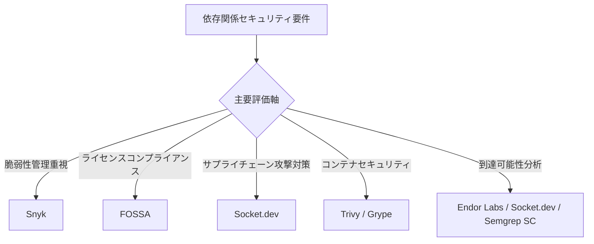
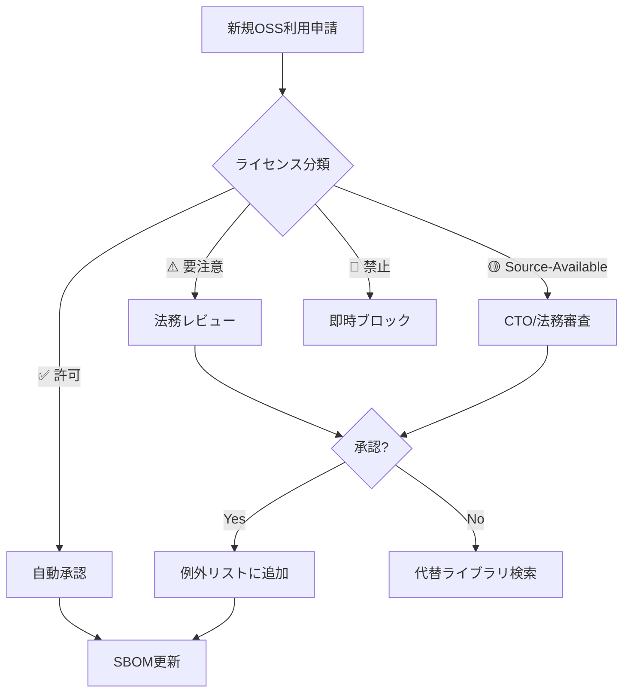
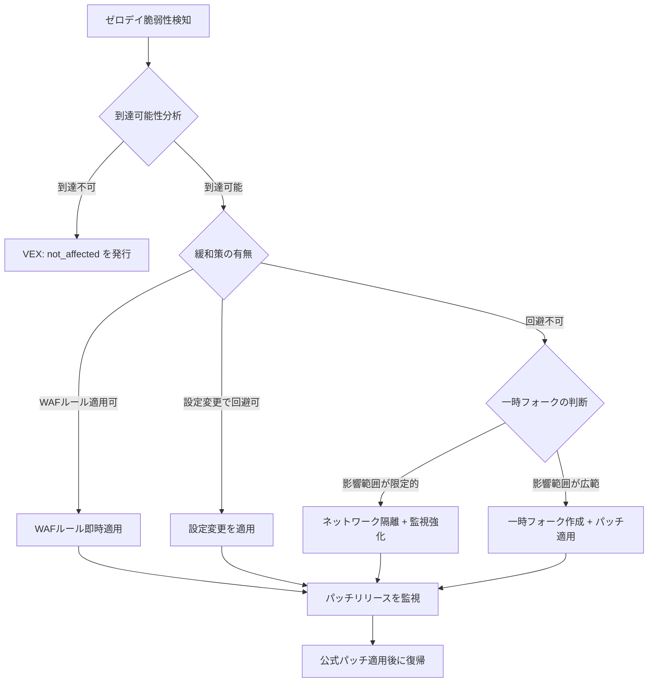
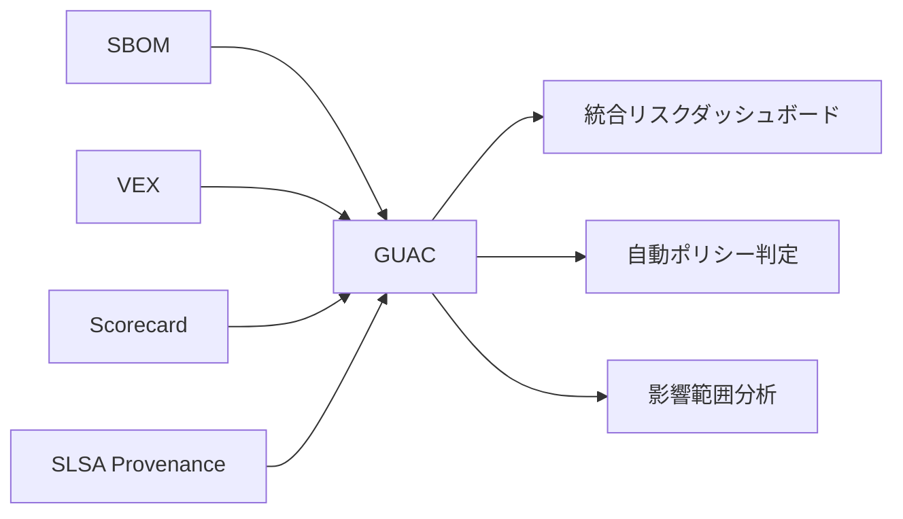
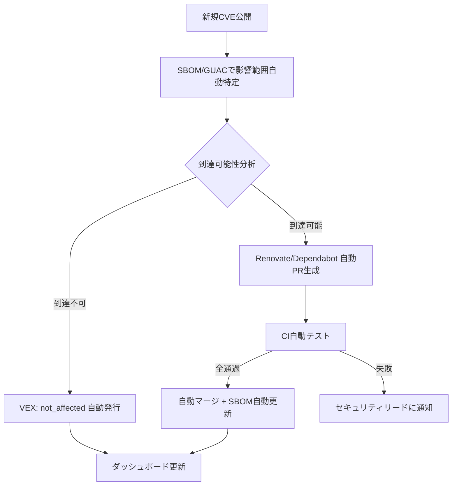
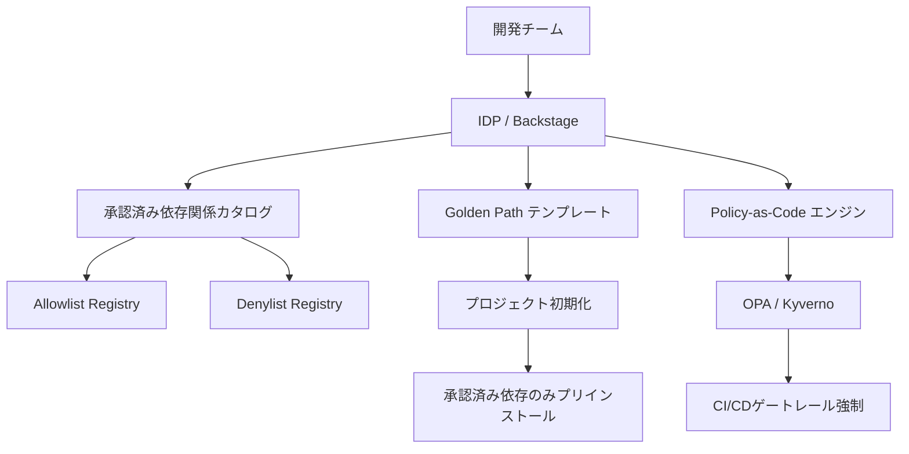
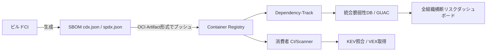

# 62. ライセンスと依存関係管理 (License & Dependency Management)

> [!CAUTION]
> **このファイルは Universal Rule（不変ルール）です。「憲法改正」の明示的指示がない限り編集禁止。**
> 改定日: 2026-04-19 → **2026-04-19（v4: §59-§63追加・§29構造バグ修正・考慮漏れゼロ化）**

> [!IMPORTANT]
> **Supreme Directive（最高指令）**
> 「すべての依存関係は信頼の決定 — 管理されていないライセンスは法的時限爆弾である。」
> すべてのサードパーティ依存関係は監査・承認・継続的監視されなければならない。
> **ライセンス準拠 > セキュリティ > 安定性 > 利便性** の優先順位を厳守せよ。
> **63セクション構成（v4: §59-§63 新規追加 + §29構造バグ修正 + NIS2・AI IDE SCA・SBOM Federation・ML BOM・依存関係SLO対応）。**

---

## 目次

| § | セクション |
|---|---|
| 1 | [ライセンス分類とポリシー](#1-ライセンス分類とポリシー) |
| 2 | [ライセンス互換性マトリクス](#2-ライセンス互換性マトリクス) |
| 3 | [AI/MLモデルライセンス](#3-aimlモデルライセンス) |
| 4 | [コンテナイメージライセンス管理](#4-コンテナイメージライセンス管理) |
| 5 | [IaCモジュール・アクションのライセンス](#5-iacモジュールアクションのライセンス) |
| 6 | [フォント・メディアアセットライセンス](#6-フォントメディアアセットライセンス) |
| 7 | [SBOM（Software Bill of Materials）](#7-sbomsoftware-bill-of-materials) |
| 8 | [SBOM規制コンプライアンス](#8-sbom規制コンプライアンス) |
| 9 | [サプライチェーンセキュリティ基盤](#9-サプライチェーンセキュリティ基盤) |
| 10 | [SCAツール統合](#10-scaツール統合) |
| 11 | [CIパイプラインガードレール](#11-ciパイプラインガードレール) |
| 12 | [依存関係選定基準](#12-依存関係選定基準) |
| 13 | [バンドルサイズ・パフォーマンス影響](#13-バンドルサイズパフォーマンス影響) |
| 14 | [ロックファイル整合性](#14-ロックファイル整合性) |
| 15 | [自動更新戦略（Renovate / Dependabot）](#15-自動更新戦略renovate--dependabot) |
| 16 | [セキュリティパッチ適用SLA](#16-セキュリティパッチ適用sla) |
| 17 | [Monorepo依存関係管理](#17-monorepo依存関係管理) |
| 18 | [Private Registry / Artifactory](#18-private-registry--artifactory) |
| 19 | [推移的依存関係管理](#19-推移的依存関係管理) |
| 20 | [EOL / 非推奨パッケージ管理](#20-eol--非推奨パッケージ管理) |
| 21 | [帰属表示・NOTICE生成](#21-帰属表示notice生成) |
| 22 | [OSPO（Open Source Program Office）](#22-ospoopen-source-program-office) |
| 23 | [依存関係侵害インシデント対応](#23-依存関係侵害インシデント対応) |
| 24 | [監査・レポーティング](#24-監査レポーティング) |
| 25 | [FinOps: 依存関係コスト最適化](#25-finops-依存関係コスト最適化) |
| 26 | [OpenSSF Scorecard統合](#26-openssf-scorecard統合) |
| 27 | [依存関係混同攻撃対策](#27-依存関係混同攻撃対策) |
| 28 | [VEX（Vulnerability Exploitability eXchange）](#28-vexvulnerability-exploitability-exchange) |
| 29 | [CBOM（Cryptographic Bill of Materials）](#29-cbomcryptographic-bill-of-materials) |
| 30 | [マルチエコシステム依存関係管理](#30-マルチエコシステム依存関係管理) |
| 31 | [パッケージ公開セキュリティとOIDC完全移行](#31-パッケージ公開セキュリティとoidc完全移行) |
| 32 | [GitHub Dependency Review統合](#32-github-dependency-review統合) |
| 33 | [OSS法的リスクマネジメント](#33-oss法的リスクマネジメント) |
| 34 | [ゼロデイ依存関係対応プレイブック](#34-ゼロデイ依存関係対応プレイブック) |
| 35 | [AI生成コードのライセンスリスク](#35-ai生成コードのライセンスリスク) |
| 36 | [Slopsquatting / AIパッケージ幻覚攻撃対策](#36-slopsquatting--aiパッケージ幻覚攻撃対策) |
| 37 | [SBOM長期保持とCRA技術文書化要件](#37-sbom長期保持とcra技術文書化要件) |
| 38 | [ランタイム依存関係監視（Runtime SCA）](#38-ランタイム依存関係監視runtime-sca) |
| 39 | [依存関係最小化原則](#39-依存関係最小化原則) |
| 40 | [サプライチェーンインシデント事例データベース](#40-サプライチェーンインシデント事例データベース) |
| 41 | [依存関係ガバナンス成熟度モデル](#41-依存関係ガバナンス成熟度モデル) |
| 42 | [ライセンスロンダリング対策](#42-ライセンスロンダリング対策) |
| 43 | [Remote Dynamic Dependencies（RDD）対策](#43-remote-dynamic-dependenciesrdd対策) |
| 44 | [DORA ICTサプライチェーン要件](#44-dora-ictサプライチェーン要件) |
| 45 | [連続的検証（Continuous Verification）](#45-連続的検証continuous-verification) |
| 46 | [OpenSSF GUAC統合](#46-openssf-guac統合) |
| 47 | [メンテナバーノウトリスク対策](#47-メンテナバーノウトリスク対策) |
| 48 | [依存関係セキュリティ自動対応基盤](#48-依存関係セキュリティ自動対応基盤) |
| 49 | [開発者セキュリティ教育・啓発](#49-開発者セキュリティ教育啓発) |
| 50 | [WebAssembly / ネイティブバイナリ依存関係管理](#50-webassembly--ネイティブバイナリ依存関係管理) |
| 51 | [Platform Engineering / IDP依存関係ガバナンス](#51-platform-engineering--idp依存関係ガバナンス) |
| 52 | [LLM / AIツールチェーン依存関係管理](#52-llm--aiツールチェーン依存関係管理) |
| 53 | [Green Engineering：依存関係のカーボン最適化](#53-green-engineering依存関係のカーボン最適化) |
| **54** | [**CISA KEV連携とEPSS統合型脆弱性優先順位付け**](#54-cisa-kev連携とepss統合型脆弱性優先順位付け) |
| **55** | [**EU AI Act技術文書化義務（学習データライセンス追跡）**](#55-eu-ai-act技術文書化義務学習データライセンス追跡) |
| **56** | [**Reproducible Builds & Hermetic Repository標準**](#56-reproducible-builds--hermetic-repository標準) |
| **57** | [**SBOM品質成熟度モデル（SBOM Quality Maturity Model）**](#57-sbom品質成熟度モデルsbom-quality-maturity-model) |
| **58** | [**新世代パッケージマネージャ対応（uv / Bun / cargo-auditable）**](#58-新世代パッケージマネージャ対応uv--bun--cargo-auditable) |
| **59** | [**NIS2指令：ソフトウェア供給者セキュリティ義務**](#59-nis2指令ソフトウェア供給者セキュリティ義務) |
| **60** | [**AI IDE統合型リアルタイムSCA**](#60-ai-ide統合型リアルタイムsca) |
| **61** | [**SBOM Federation（OCI Artifact配布標準）**](#61-sbom-federationoci-artifact配布標準) |
| **62** | [**ML BOM（Machine Learning Bill of Materials）**](#62-ml-bombmachine-learning-bill-of-materials) |
| **63** | [**依存関係SLO / Error Budget管理**](#63-依存関係slo--error-budget管理) |
| A | [Appendix A: 逆引き索引](#appendix-a-逆引き索引) |
| B | [Appendix B: 差分サマリー](#appendix-b-差分サマリー) |

---

## §1. ライセンス分類とポリシー

### 1.1 三層分類

**✅ 許可（Safe — 即時利用可）**:

| ライセンス | リスク | 備考 |
|:----------|:------|:-----|
| MIT | ✅ 安全 | 最も緩やか。商用利用可。帰属表示必須 |
| Apache-2.0 | ✅ 安全 | 特許条項含む。商用利用可。NOTICE保持必須 |
| BSD-2-Clause | ✅ 安全 | 商用利用可 |
| BSD-3-Clause | ✅ 安全 | 商用利用可。名称利用制限あり |
| ISC | ✅ 安全 | MIT同等 |
| CC0-1.0 | ✅ 安全 | パブリックドメイン相当 |
| 0BSD | ✅ 安全 | 帰属表示不要 |
| Unlicense | ✅ 安全 | パブリックドメイン相当 |
| Zlib | ✅ 安全 | 商用利用可 |
| PSF-2.0 | ✅ 安全 | Python標準ライブラリ |

**⚠️ 要注意（Caution — 法務確認必須）**:

| ライセンス | リスク | 対応 |
|:----------|:------|:-----|
| LGPL-2.1 / LGPL-3.0 | ⚠️ 条件付き | 動的リンクならOK。法務確認後に例外許可 |
| MPL-2.0 | ⚠️ 条件付き | ファイル単位Copyleft。法務確認後に例外許可 |
| EPL-2.0 | ⚠️ 条件付き | モジュール単位Copyleft。法務確認 |
| CDDL-1.0 | ⚠️ 条件付き | ファイル単位Copyleft。法務確認 |
| Artistic-2.0 | ⚠️ 条件付き | Perl由来。改変時名称変更義務 |
| CC-BY-4.0 | ⚠️ 条件付き | コードでなくドキュメント/データ向け |
| CC-BY-SA-4.0 | ⚠️ 条件付き | ShareAlike条件あり。法務確認 |
| EUPL-1.2 | ⚠️ 条件付き | EU公共ライセンス。Copyleft互換性条項あり。互換ライセンスリスト確認 |

**🔴 禁止（Prohibited — 即時ブロック）**:

| ライセンス | リスク | 理由 |
|:----------|:------|:-----|
| GPL-2.0 / GPL-3.0 | 🔴 高 | プロジェクト全体のソース公開義務 |
| AGPL-3.0 | 🔴 最高 | SaaS/ネットワーク利用でも公開義務 |
| SSPL | 🔴 最高 | MongoDB系。類似の感染力 |
| CC-BY-NC-* | 🔴 高 | 商用利用不可 |
| CC-BY-ND-* | 🔴 高 | 改変不可 |
| CAL-1.0 | 🔴 高 | 強力Copyleft。ユーザーデータの暗号化義務あり |

### 1.2 Source-Availableライセンスの扱い

| ライセンス | 分類 | 注意点 |
|:----------|:-----|:------|
| BSL-1.1 (Business Source License) | 🔴 禁止 | 期限付きでApache-2.0に転換するが、転換前は商用制限。HashiCorp Terraform等 |
| FSL-1.1 (Functional Source License) | 🔴 禁止 | 2年後にApache-2.0/MITに転換。転換前は競合利用禁止 |
| Elastic License 2.0 | 🔴 禁止 | SaaS提供禁止。再配布制限 |
| PolyForm Shield 1.0.0 | 🔴 禁止 | 競合利用禁止 |
| BUSL (MariaDB BSL) | 🔴 禁止 | BSL-1.1の派生。同等の制限 |

> [!CAUTION]
> Source-Availableライセンスは「ソースコードが見える ≠ OSS」である。OSI非承認であり、従来のOSSと同じ扱いは厳禁。

### 1.3 デュアルライセンス戦略への対応

- **ルール**: デュアルライセンスパッケージでは、**商用利用に最も有利なライセンス**を選択し、`package.json` の `license` フィールドに明記する
- **ルール**: CopyleftとPermissiveのデュアルライセンスでは、Permissive側を選択する
- **ルール**: ライセンス選択の根拠を `licenses/decisions/` ディレクトリに記録する

→ クロスリファレンス: [`601_data_governance.md`](../security/100_data_governance.md) §GenAI著作権

---

## §2. ライセンス互換性マトリクス

### 2.1 互換性ルール

| 出力物の形態 | 許容されるライセンスの組み合わせ |
|:------------|:-------------------------------|
| 静的リンク | 全ライブラリのライセンスが互換であること |
| 動的リンク | LGPLは許可。GPLは不可 |
| SaaS配信 | AGPL除外必須。SSPL除外必須 |
| コンテナ配布 | ベースイメージ含む全レイヤーの互換性確認 |
| WebAssembly配布 | 静的リンクと同等の扱い |
| npm / PyPI公開 | 推移的依存の互換性も含めて検証 |

### 2.2 自動互換性チェック

```yaml
# .github/workflows/license-compat.yml
- name: License Compatibility Check
  run: |
    npx license-checker --production --json > licenses.json
    node scripts/check-license-compat.js licenses.json
```

```javascript
// scripts/check-license-compat.js
const fs = require('fs');
const PROHIBITED = ['GPL-2.0', 'GPL-3.0', 'AGPL-3.0', 'SSPL'];
const REVIEW_REQUIRED = ['LGPL-2.1', 'LGPL-3.0', 'MPL-2.0', 'EPL-2.0'];
const SOURCE_AVAILABLE = ['BSL-1.1', 'FSL-1.1', 'Elastic-2.0'];

const licenses = JSON.parse(fs.readFileSync(process.argv[2]));
const violations = [];
for (const [pkg, info] of Object.entries(licenses)) {
  const lic = info.licenses || '';
  if (PROHIBITED.some(l => lic.includes(l))) {
    violations.push({ pkg, license: lic, severity: 'BLOCK' });
  } else if (SOURCE_AVAILABLE.some(l => lic.includes(l))) {
    violations.push({ pkg, license: lic, severity: 'BLOCK' });
  } else if (REVIEW_REQUIRED.some(l => lic.includes(l))) {
    violations.push({ pkg, license: lic, severity: 'REVIEW' });
  }
}
if (violations.some(v => v.severity === 'BLOCK')) {
  console.error('❌ 禁止ライセンス検出:', JSON.stringify(violations, null, 2));
  process.exit(1);
}
if (violations.some(v => v.severity === 'REVIEW')) {
  console.warn('⚠️ 要確認ライセンス:', JSON.stringify(violations, null, 2));
}
```

→ クロスリファレンス: [`600_security_privacy.md`](../security/000_security_privacy.md) §サプライチェーンセキュリティ

---

## §3. AI/MLモデルライセンス

### 3.1 モデルウェイトのライセンス分類

| ライセンス | 商用利用 | 改変 | 再配布 | 備考 |
|:----------|:--------|:-----|:------|:-----|
| Apache-2.0（Llama 3等） | ✅ | ✅ | ✅ | 利用者数制限あり（Meta: 月間7億) |
| Gemma Terms of Use | ✅ | ✅ | ⚠️ | Google利用規約に従う |
| OpenRAIL-M | ✅ | ✅ | ⚠️ | 利用制限条項（Responsible AI）あり |
| CC-BY-NC-4.0 | ❌ | ✅ | ⚠️ | 商用不可。研究用途のみ |
| Llama 2 Community License | ✅ | ✅ | ⚠️ | 月間アクティブユーザー7億超で別途契約必要 |
| Mistral Research License | ❌ | ⚠️ | ❌ | 研究用途限定 |

### 3.2 ルール

- **ルール**: モデルウェイトのダウンロード前にライセンスとAcceptable Use Policyを確認する
- **ルール**: Fine-tuning後のモデル配布時は、元ライセンスの「派生物」条件を確認する
- **ルール**: モデルのライセンスが利用者数上限を定めている場合、月次で利用者数を監視する
- **ルール**: モデルライセンスの変更（例: Llama 2→3のライセンス変更）を四半期で監視する

→ クロスリファレンス: [`601_data_governance.md`](../security/100_data_governance.md) §GenAI著作権、[`400_ai_engineering.md`](../ai/000_ai_engineering.md)

---

## §4. コンテナイメージライセンス管理

### 4.1 ルール

- **ルール**: ベースイメージのライセンスを必ず確認する（例: Alpine=MIT、Ubuntu=GPL系混在、Distroless=Apache-2.0推奨）
- **ルール**: マルチステージビルドの最終ステージに含まれるパッケージのみがライセンス対象
- **ルール**: コンテナSBOMを `syft` または `trivy` で生成し、CIで自動検証する

```bash
# コンテナSBOM生成
syft packages myapp:latest -o spdx-json > container-sbom.spdx.json
# ライセンスチェック
trivy image --scanners license --severity HIGH,CRITICAL myapp:latest
```

### 4.2 ベースイメージ選定基準

| イメージ | ライセンスリスク | 推奨度 |
|:--------|:---------------|:------|
| gcr.io/distroless | ✅ 低（Apache-2.0） | ⭐ 最推奨 |
| chainguard/static | ✅ 低（Apache-2.0） | ⭐ 推奨（最小攻撃面） |
| alpine | ✅ 低（MIT） | ⭐ 推奨 |
| debian-slim | ⚠️ 中（GPL混在） | 許可（帰属表示注意） |
| ubuntu | ⚠️ 中（GPL混在） | 許可（帰属表示注意） |

---

## §5. IaCモジュール・アクションのライセンス

### 5.1 ルール

- **ルール**: Terraformモジュール（registry/GitHub）導入時にライセンスを確認する
- **ルール**: GitHub Actionsのサードパーティアクションは、**SHA pinning** でバージョン固定する
- **ルール**: GitHub Actionsはフォーク版ではなく公式/Verified Creator版を優先する
- **ルール**: Helmチャートのライセンスもレビュー対象とする
- **ルール**: OpenTofu/Terraform間のライセンス差異（MPL-2.0 vs BSL-1.1）を把握し、プロジェクト方針を決定する

```yaml
# ✅ 正: SHA pinning
- uses: actions/checkout@b4ffde65f46336ab88eb53be808477a3936bae11 # v4.1.1

# ❌ 誤: タグのみ
- uses: actions/checkout@v4
```

→ クロスリファレンス: [`600_security_privacy.md`](../security/000_security_privacy.md) §サプライチェーン

---

## §6. フォント・メディアアセットライセンス

### 6.1 ルール

- **ルール**: Google Fonts（OFL/Apache-2.0）は安全。セルフホスティング時もライセンス確認
- **ルール**: 商用フォント（Adobe Fonts等）はシート数・用途制限を厳守する
- **ルール**: ストック画像/アイコンはライセンス証書を `licenses/` ディレクトリに保存する
- **ルール**: CC-BY画像はalt属性またはキャプションで帰属表示する
- **ルール**: AI生成画像の著作権帰属はサービス利用規約を確認する（§35参照）

| アセット種別 | 安全なライセンス | 注意が必要なライセンス |
|:------------|:---------------|:-------------------|
| フォント | OFL-1.1, Apache-2.0 | 商用フォント（シート制限） |
| アイコン | MIT, CC0 | CC-BY（帰属表示必須） |
| 画像 | Unsplash License, CC0 | CC-BY-NC（商用不可） |

→ クロスリファレンス: [`200_design_ux.md`](../design/000_design_ux.md)

---

## §7. SBOM（Software Bill of Materials）

### 7.1 SBOM生成義務

- **ルール**: 全リリースビルドに対してSBOMを自動生成する（CIに必須統合）
- **ルール**: フォーマットは **CycloneDX 1.6+**（セキュリティ自動化向け）または **SPDX 3.0+**（ライセンスコンプライアンス向け）を使用する
- **ルール**: 両フォーマットの並行生成を推奨（相互補完性のため）

### 7.2 SBOMの最小データ要素（CISA 2025基準）

| フィールド | 説明 | 必須 |
|:----------|:-----|:-----|
| Component Name | パッケージ名 | ✅ |
| Version | バージョン | ✅ |
| Supplier | 供給者/ベンダー | ✅ |
| Component Hash | SHA-256等のハッシュ値 | ✅ |
| License Information | SPDX識別子 | ✅ |
| Dependency Relationship | 直接/推移的の区分 | ✅ |
| Tool Name | SBOM生成ツール名 | ✅ |
| Generation Context | 生成日時・ビルドID | ✅ |
| Unique Identifier | PURL（Package URL）推奨 | ✅（2026〜） |

### 7.3 SBOM生成スニペット

```yaml
# .github/workflows/sbom.yml
sbom:
  runs-on: ubuntu-latest
  steps:
    - uses: actions/checkout@v4
    - run: npm ci
    - name: Generate CycloneDX SBOM
      run: npx @cyclonedx/cyclonedx-npm --output-file sbom.cdx.json
    - name: Generate SPDX SBOM
      run: |
        syft dir:. -o spdx-json > sbom.spdx.json
    - name: Upload SBOM artifacts
      uses: actions/upload-artifact@v4
      with:
        name: sbom-${{ github.sha }}
        path: |
          sbom.cdx.json
          sbom.spdx.json
        retention-days: 3650  # EU CRA 10年保持要件
```

### 7.4 SBOMライフサイクル管理

- **ルール**: SBOMはリリース毎だけでなく、依存関係が変更されたビルド毎にリフレッシュする
- **ルール**: SBOMにGitコミットハッシュとCI/CDパイプラインIDを紐づけ、トレーサビリティを確保する
- **ルール**: SBOMのバージョン管理にSemVerを適用し、コンポーネント変更時にマイナーバージョンを更新する
- **ルール**: SBOMリポジトリまたはSBOM管理プラットフォーム（DependencyTrack等）で一元管理する

→ クロスリファレンス: [`300_engineering_standards.md`](../engineering/000_engineering_standards.md) §CI/CD

---

## §8. SBOM規制コンプライアンス

### 8.1 グローバル規制タイムライン

| 規制 | 施行日 | 要件 | 罰則 |
|:-----|:------|:-----|:-----|
| US EO 14028 | 2021〜（段階的） | 連邦政府調達ソフトウェアにSBOM必須 | 調達資格喪失 |
| CISA SBOM最小要素v2 | **2025-08** | コンポーネントハッシュ・ライセンス・ツール名・生成コンテキスト・PURL追加 | — |
| India CERT-In SBOM GL 2.0 | **2025-07** | 重要サービス組織にSBOM必須。民間も推奨 | — |
| DORA（EU金融） | **2025-01施行** | ICT第三者リスク管理。ソフトウェアサプライチェーン可視化義務 | 最大€10M or 売上5% |
| EU CRA: 委任規則(EU)2025/1535 | **2025-07** | 重要/クリティカル製品カテゴリの技術的記述 | — |
| EU CRA: 実施規則(EU)2025/2392 | **2025-11** | 適合性評価の詳細要件 | — |
| EU CRA: 適合性評価機関届出 | **2026-06** | 適合性評価機関への届出義務開始 | — |
| EU CRA: 脆弱性報告 | **2026-09** | アクティブ悪用脆弱性の24時間以内報告義務。ENISAへの通報必須 | 最大€15M or 売上2.5% |
| EU CRA: 完全施行 | **2027-12** | 製品技術文書にSBOM必須。機械可読形式。**10年間の保持義務**。5年間のセキュリティアップデート義務 | 最大€15M or 売上2.5% |
| Japan 経産省 SBOMガイドライン | 2023〜（推奨） | ソフトウェア管理にSBOM活用。政府調達では事実上必須 | — |
| NIST SSDF更新 | 2026（予定） | SBOM要件の強化、SLSA準拠の推奨 | — |

> [!IMPORTANT]
> EU CRAは段階的施行であり、2026-09の脆弱性報告義務が最初の実質的対応期限。中間標準化（SBOMスキーマ含むhorizontal standard）は2026年中盤にCEN/CENELECから公開予定。

### 8.2 ルール

- **ルール**: EU市場に製品を投入する場合、CRA 2026-09の脆弱性報告要件に**今から**準備を開始する
- **ルール**: CRA技術文書のSBOM保持期間は**10年間**。長期ストレージ戦略を策定する（§37参照）
- **ルール**: 金融セクターの場合、DORA要件に基づくICTサードパーティリスク評価を実施する（§44参照）
- **ルール**: 政府調達案件では、CISA SBOM最小要素v2に完全準拠するSBOMを提供する

→ クロスリファレンス: [`601_data_governance.md`](../security/100_data_governance.md) §EU Data Act

---

## §9. サプライチェーンセキュリティ基盤

### 9.1 SLSA（Supply-chain Levels for Software Artifacts）v1.1

| レベル | 要件 | 保護対象 |
|:------|:-----|:--------|
| SLSA 1 | ビルドプロセスの文書化。Provenanceの存在 | 改ざん監査の開始 |
| SLSA 2 | ホスト型ビルドサービス使用。署名付きProvenance | ビルド環境の改ざん |
| SLSA 3 | 隔離されたビルド環境。再現可能なビルド。エフェメラルワーカー | 内部脅威・ビルドインジェクション |

- **ルール**: 最低 **SLSA 2** を達成する（GitHub Actions + Artifact Attestation で到達可能）
- **ルール**: SLSA 3を目標とし、ephemeral runners + hermetic builds を導入する

### 9.2 OIDC Trusted Publishing

- **ルール**: パッケージ公開は **OIDC Trusted Publishing** を唯一の方法とする（§31参照）
- **ルール**: 長期アクセストークンの使用を**完全禁止**する（npm/PyPI/GitHub Packages共通）

### 9.3 GitHub Artifact Attestation

- **ルール**: CI/CDビルドで `actions/attest-build-provenance` を使用してProvenance Attestationを生成する
- **ルール**: 消費者側で `gh attestation verify` を実行し、Provenanceの検証を行う
- **ルール**: in-totoアテステーションフレームワークに準拠し、エンドツーエンドのサプライチェーン検証を実現する

### 9.4 Sigstore統合

- **ルール**: コンテナイメージは `cosign` で署名する（Keylessモード推奨）
- **ルール**: 署名検証をKubernetes Admission Controllerで強制する

```bash
# Keyless署名（Sigstore Fulcio + Rekor）
cosign sign myregistry.com/myapp:v1.0.0
# Keyless検証
cosign verify myregistry.com/myapp:v1.0.0 \
  --certificate-identity=workflow@github.com \
  --certificate-oidc-issuer=https://token.actions.githubusercontent.com
```

→ クロスリファレンス: [`600_security_privacy.md`](../security/000_security_privacy.md) §サプライチェーン、[`300_engineering_standards.md`](../engineering/000_engineering_standards.md) §CI/CD

---

## §10. SCAツール統合

### 10.1 推奨ツールスタック（2026年版）

| ツール | 主な強み | 用途 |
|:------|:--------|:-----|
| Snyk | 脆弱性検知 + AI修正提案 + Snyk Code SAST統合 | 脆弱性管理の第一選択 |
| FOSSA | ライセンスコンプライアンス + SBOM + NOTICE自動生成 | ライセンス管理の第一選択 |
| Socket.dev | マルウェア検知 + AI行動分析 + **到達可能性分析（Coana統合）** | サプライチェーン攻撃対策の第一選択 |
| Semgrep Supply Chain | 推移的到達可能性分析（Reachability Analysis） | 偽陽性削減 |
| Trivy | コンテナ + IaC + SBOM + ライセンス | コンテナセキュリティ |
| Endor Labs | DCA（Dependency Caller Analysis） + Binary-to-Source AI | 到達可能性分析・コンテキスト重視 |
| Grype | OSS CLIスキャナ（SBOM/コンテナイメージ対応） | クラウドネイティブワークフロー |
| `npm audit` | npm内蔵 | 最低限のベースライン |

> [!NOTE]
> Socket.devは2025年4月にCoanaを買収し、到達可能性分析機能を統合。CVEの偽陽性を最大80%削減可能。2025年7月にTrusted Publishing対応も完了。

### 10.2 ツール選定フローチャート



### 10.3 ルール

- **ルール**: 最低1つのSCAツールをCIに統合する（Snyk推奨）
- **ルール**: ライセンスチェックとセキュリティスキャンは **別々のジョブ** として実行する
- **ルール**: SCAツールのスキャン対象に、npm/yarn/pnpmだけでなくGoモジュール、Pythonのpyproject.toml、RustのCargo.toml等も含める
- **ルール**: 偽陽性は `.snyk` ポリシーファイル等で明示的に抑制し、理由と期限をコメントする
- **ルール**: Socket.devの行動分析アラート（install scripts/network access/filesystem access）を有効化する
- **ルール**: 到達可能性分析ツール（Socket.dev / Endor Labs / Semgrep SC）を導入し、真に対応が必要な脆弱性に集中する
- **ルール**: AI生成コードのライセンス汚染スキャンをSCAパイプラインに統合する（§42参照）

---

## §11. CIパイプラインガードレール

### 11.1 自動ブロックルール

| 検知事象 | アクション | 例外手続き |
|:--------|:---------|:----------|
| 🔴禁止ライセンス（GPL/AGPL/SSPL） | PRマージ自動ブロック | CTO書面承認 |
| 🟡Source-Availableライセンス（BSL/FSL/Elastic） | PRマージ自動ブロック | CTO/法務承認 |
| Critical脆弱性（CVSS ≥ 9.0） | PRマージ自動ブロック | セキュリティリード承認（24h以内） |
| High脆弱性（CVSS ≥ 7.0） | 警告 + 7日以内修正義務 | チームリード承認 |
| ライセンス不明（UNKNOWN） | PRマージ自動ブロック | 手動調査後にallowlistへ追加 |
| OpenSSF Scorecard < 4.0 | 警告 | §26参照 |
| Socket.dev行動分析: High-risk | PRマージ自動ブロック | セキュリティリード承認 |

### 11.2 CI設定例

```yaml
# .github/workflows/dependency-guard.yml
name: Dependency Guard
on: [pull_request]
jobs:
  license-check:
    runs-on: ubuntu-latest
    steps:
      - uses: actions/checkout@v4
      - run: npm ci
      - name: License Check
        run: |
          npx license-checker --production --failOn \
            "GPL-2.0;GPL-3.0;AGPL-3.0;SSPL;UNKNOWN"
      - name: License Report
        run: npx license-checker --production --csv > license-report.csv

  vulnerability-scan:
    runs-on: ubuntu-latest
    steps:
      - uses: actions/checkout@v4
      - run: npm ci
      - name: Snyk Test
        uses: snyk/actions/node@master
        env:
          SNYK_TOKEN: ${{ secrets.SNYK_TOKEN }}
        with:
          args: --severity-threshold=high

  supply-chain-check:
    runs-on: ubuntu-latest
    steps:
      - uses: actions/checkout@v4
      - name: Socket Security
        uses: SocketDev/socket-security-action@v1
        with:
          api_key: ${{ secrets.SOCKET_API_KEY }}
```

→ クロスリファレンス: [`300_engineering_standards.md`](../engineering/000_engineering_standards.md) §CI/CD

---

## §12. 依存関係選定基準

### 12.1 ヘルスメトリクス（導入前チェックリスト）

| 指標 | 最低基準 | 理想 |
|:----|:--------|:-----|
| GitHub Stars | ≥ 500 | ≥ 5,000 |
| 最終コミット | 6ヶ月以内 | 1ヶ月以内 |
| メンテナー数 | ≥ 2 | ≥ 5 |
| オープンIssue解決率 | ≥ 50% | ≥ 80% |
| テストカバレッジ | 存在すること | ≥ 80% |
| TypeScript型定義 | 存在すること | ビルトイン |
| ダウンロード数（npm weekly） | ≥ 10,000 | ≥ 100,000 |
| セキュリティポリシー | 存在すること | SECURITY.md + 脆弱性報告フロー |
| ライセンス | 許可リスト内 | MIT / Apache-2.0 |
| **OpenSSF Scorecard** | **≥ 4.0** | **≥ 7.0** |
| **Bus Factor** | **≥ 2** | **≥ 5**（§47参照） |

### 12.2 リスクスコアリング

- **ルール**: 新規依存関係の追加時、上記チェックリストの合格率が **70%未満** の場合はチームリードの承認を必須とする
- **ルール**: 依存関係の代替候補を最低2つ比較検討する
- **ルール**: 「1パッケージ = 1機能」の原則を徹底し、メガライブラリよりも軽量な代替を優先する
- **ルール**: OpenSSF Scorecardスコア **4.0未満** のパッケージは原則採用禁止（§26参照）
- **ルール**: Bus Factor 1のパッケージは追加リスク評価を実施する（§47参照）

---

## §13. バンドルサイズ・パフォーマンス影響

### 13.1 ルール

- **ルール**: Webアプリの新規依存追加時は [`bundlephobia.com`](https://bundlephobia.com) でサイズ影響を確認する
- **ルール**: gzip後 **50KB以上** の依存関係追加はチームリード承認を必須とする
- **ルール**: Tree-shaking対応（ESM）のパッケージを優先する
- **ルール**: 同機能の軽量代替を常に検討する

### 13.2 推奨代替ライブラリ

| 重量級 | 軽量代替 | サイズ削減 |
|:------|:--------|:---------|
| moment.js (72KB) | date-fns (tree-shakeable) | -90% |
| lodash (72KB) | lodash-es (tree-shakeable) | -80% |
| axios (14KB) | ky (3KB) / fetch API | -80% |
| uuid (12KB) | crypto.randomUUID() | -100% |
| classnames (1.5KB) | clsx (0.5KB) | -65% |

→ クロスリファレンス: [`340_web_frontend.md`](../engineering/300_web_frontend.md) §パフォーマンス予算

---

## §14. ロックファイル整合性

### 14.1 ルール

- **ルール**: `package-lock.json`, `yarn.lock`, `pnpm-lock.yaml`, `Podfile.lock`, `pubspec.lock` は**必ずコミット**する
- **ルール**: CI環境では **`npm ci`**（または `pnpm install --frozen-lockfile`）を使用し、`npm install` を禁止する
- **ルール**: ロックファイルの差分はPRレビューで**必ず確認**する
- **ルール**: `lockfile-lint` をCIに統合し、信頼されたレジストリからの取得を保証する
- **ルール**: チーム全員が同一のNode.js/npmバージョンを使用する（`.nvmrc` / `.node-version` で統一）
- **ルール**: Corepackを有効化し、`packageManager` フィールドでパッケージマネージャのバージョンを固定する

### 14.2 Corepack設定

```json
// package.json
{
  "packageManager": "pnpm@9.15.0+sha512.abc123..."
}
```

```bash
# Corepack有効化
corepack enable
# CIでの自動バージョン固定
corepack prepare pnpm@9.15.0 --activate
```

### 14.3 Install Script セキュリティ

- **ルール**: `.npmrc` で `ignore-scripts=true` をデフォルト設定し、信頼されたパッケージのみ `allow-scripts` でホワイトリスト化する
- **ルール**: `postinstall` / `preinstall` スクリプトを持つパッケージは追加レビュー対象とする

```ini
# .npmrc — Install Script防御
ignore-scripts=true
# 信頼されたパッケージのみ許可
# package.jsonのtrustedDependenciesで管理
```

---

## §15. 自動更新戦略（Renovate / Dependabot）

### 15.1 推奨設定

- **ルール**: Renovateを第一選択とする（Dependabotより柔軟な設定が可能）
- **ルール**: セキュリティアップデートは **自動マージ** を有効化する（patch/minorレベル + CI全通過条件）
- **ルール**: メジャーアップデートは手動レビュー必須とする
- **ルール**: **minimumReleaseAge: 21日** を設定し、新規リリースの安定性を確認してから取り込む
- **ルール**: 週次のグルーピングPRで依存関係を一括更新する（ノイズ削減）

### 15.2 Renovate設定例

```json
{
  "$schema": "https://docs.renovatebot.com/renovate-schema.json",
  "extends": ["config:recommended", "schedule:weekends"],
  "minimumReleaseAge": "21 days",
  "vulnerabilityAlerts": { "enabled": true, "minimumReleaseAge": "0 days" },
  "packageRules": [
    {
      "matchUpdateTypes": ["patch", "minor"],
      "matchCurrentVersion": "!/^0/",
      "automerge": true,
      "automergeType": "pr",
      "requiredStatusChecks": ["ci/build", "ci/test", "license-check"]
    },
    {
      "matchUpdateTypes": ["major"],
      "dependencyDashboardApproval": true
    }
  ]
}
```

---

## §16. セキュリティパッチ適用SLA

### 16.1 SLA定義

| 深刻度 | CVSS | 対応期限 | 自動化 |
|:------|:-----|:--------|:------|
| Critical | ≥ 9.0 | **24時間以内** | 自動PR作成 + Slack通知 |
| High | ≥ 7.0 | **7日以内** | 自動PR作成 |
| Medium | ≥ 4.0 | **30日以内** | 週次レポート |
| Low | < 4.0 | **90日以内** | 四半期レビュー |

### 16.2 CISA KEV連携とEPSS統合型優先順位付け

> [!IMPORTANT]
> CVSSスコアだけのパッチ優先順位付けは2026年の実務では不十分。**CISA KEV登録（限定3日以内広用実績あり）がSLAの起点**となり、EPSSスコア（最大リスク・上位5%）による現実的な悪用可能性で補完する。

| 優先度 | 条件 | SLA | 自動化 |
|:--------|:-----|:----|:------|
| 🔴 P0（経緯） | **CISA KEV登録** | **3日以内** | 即時アラート + WAFアップデート |
| 🔴 P1 | Critical + EPSS ≥ 0.8 | **6時間以内** | 封じ込め + アラート |
| 🟠 P2 | Critical (CVSS≥ 9.0) | 24時間 | 自動PR |
| 🟡 P3 | High (CVSS ≥ 7.0) | 7日 | 自動PR |
| 🟢 P4 | Medium/Low | 30日 / 90日 | 週次レポート |


### 16.3 ルール

- **ルール**: Critical脆弱性は到達可能性分析を実施し、到達可能な場合は**4時間以内**にWAFルール等の緩和策を適用する
- **ルール**: **CISA KEV登録CVE**は到達可能性分析に関わらず、期限（3日）以内に修正またはVEXによる緩和策を必須とする
- **ルール**: EPSS スコア ≥ 0.8（上位20%）のMedium CVEは、CVSSのみの評価と異なりP1扱いとして処理する
- **ルール**: パッチ適用不可の場合、VEXステータスを発行し根拠を文書化する（§28参照）
- **ルール**: SLA逸脱が発生した場合、月次レトロスペクティブで根本原因を分析する

→ クロスリファレンス: §28 VEX、§54 CISA KEV連携詳細

---

## §17. Monorepo依存関係管理

### 17.1 ルール

- **ルール**: Monorepoではpnpm workspaces（推奨）またはnpm workspacesを使用する
- **ルール**: 共通依存関係はルートに配置し、パッケージ固有の依存関係のみ個別に管理する
- **ルール**: `pnpm-lock.yaml` の**単一ロックファイル**で全ワークスペースを管理する
- **ルール**: Merge Queue を必ず有効化し、CI通過後の安全なマージを保証する

### 17.2 Monorepo推奨構成

```
monorepo-root/
├── package.json           ← 共通devDependencies
├── pnpm-lock.yaml         ← 単一ロックファイル
├── pnpm-workspace.yaml
├── packages/
│   ├── shared/            ← 共通ライブラリ
│   ├── app-web/           ← Webアプリ（固有dependencies）
│   └── app-mobile/        ← モバイルアプリ（固有dependencies）
```

---

## §18. Private Registry / Artifactory

### 18.1 ルール

- **ルール**: プライベートパッケージはプライベートレジストリ（GitHub Packages / Artifactory / Verdaccio）で管理する
- **ルール**: パブリックレジストリのプロキシ/キャッシュ層を設置し、可用性を向上させる
- **ルール**: 内部パッケージのスコープ（`@company/`）をnpmパブリックレジストリで**必ず予約**し、**typosquatting**を防止する（§27参照）
- **ルール**: レジストリへのパッケージ公開権限は**最小権限の原則**で管理する
- **ルール**: npm tokenは **OIDC Trusted Publishing** に移行し、長期トークンの使用を廃止する（§31参照）
- **ルール**: レジストリへのアクセスにMFA（多要素認証）を必須化する

```ini
# .npmrc（プライベートレジストリ設定）
@mycompany:registry=https://npm.pkg.github.com
//npm.pkg.github.com/:_authToken=${NODE_AUTH_TOKEN}
```

---

## §19. 推移的依存関係管理

### 19.1 ルール

- **ルール**: `npm ls --all` で依存ツリー全体を定期的に確認する
- **ルール**: 推移的依存にCritical脆弱性がある場合、直接依存のアップグレードまたは`overrides`で対処する
- **ルール**: 推移的依存の深さが **7階層** を超える場合は代替ライブラリを検討する
- **ルール**: `npm explain <package>` で特定パッケージがなぜ含まれているかを追跡する

### 19.2 `overrides` による強制解決

```json
// package.json
{
  "overrides": {
    "vulnerable-transitive-pkg": ">=2.0.1"
  }
}
```

> [!CAUTION]
> `overrides` は一時的な緊急対応手段。根本解決（直接依存のアップグレード）を30日以内に完了すること。

---

## §20. EOL / 非推奨パッケージ管理

### 20.1 ルール

- **ルール**: `npm outdated` を週次で実行し、メジャーバージョン遅れのパッケージを検出する
- **ルール**: `deprecated` フラグのあるパッケージは **30日以内** に代替へ移行する
- **ルール**: Node.js自体のLTSスケジュールに従い、EOLバージョンでの運用を禁止する
- **ルール**: フレームワーク（Next.js, React等）のメジャーバージョンは、リリースから **6ヶ月以内** にアップグレード計画を策定する

### 20.2 EOL監視ツール

- **endoflife.date**: API経由でNode.js/フレームワークのEOL日付を取得可能
- **libyear**: 依存関係の「年齢」を計測し、技術的負債を定量化する

---

## §21. 帰属表示・NOTICE生成

### 21.1 ルール

- **ルール**: OSSライセンス帰属表示をアプリ内に表示する仕組みを必ず実装する
- **ルール**: 表示場所は「設定 > ライセンス」または「About」画面とする
- **ルール**: CI/CDで `NOTICE` ファイルを自動生成し、各リリースに同梱する
- **ルール**: FOSSAのNOTICE自動再生成機能を活用し、依存関係更新時にNOTICEを自動更新する

### 21.2 プラットフォーム別ツール

| プラットフォーム | ツール | 備考 |
|:--------------|:------|:-----|
| Web（npm） | `license-checker --csv` | CSV/JSON出力 |
| iOS（Swift） | `license-plist` | Settings.bundle自動生成 |
| Android | `oss-licenses-plugin` | Google公式 |
| Flutter | `flutter_oss_licenses` | マルチプラットフォーム |
| 全般 | FOSSA NOTICE自動生成 | エンタープライズ向け。自動再生成対応 |

### 21.3 Apache-2.0 NOTICEファイルの特記

- **ルール**: Apache-2.0ライセンスのライブラリを使用する場合、元の `NOTICE` ファイルの内容を保持・同梱する（ライセンス要件）

---

## §22. OSPO（Open Source Program Office）

### 22.1 ルール

- **ルール**: 従業員50名以上の組織ではOSPOまたはOSSガバナンス担当者を設置する
- **ルール**: OSSへの貢献（contribution）時は、CLA（Contributor License Agreement）の署名を確認する
- **ルール**: 社内プロジェクトのOSS公開前に、知的財産・ライセンス・セキュリティのレビューを実施する

### 22.2 OSSガバナンスプロセス



→ クロスリファレンス: [`603_ip_due_diligence.md`](../security/300_ip_due_diligence.md) §IP資産管理

---

## §23. 依存関係侵害インシデント対応

### 23.1 インシデントランブック

| ステップ | アクション | 担当 | SLA |
|:--------|:---------|:-----|:----|
| 1. 検知 | SCAアラート / CVE公開 / セキュリティ通知 | 自動 | — |
| 2. 影響評価 | 影響を受けるサービス/リリースの特定（SBOMから逆引き） | セキュリティリード | 2時間 |
| 3. 封じ込め | 侵害パッケージのpinning / rollback / ネットワーク隔離 | SRE | 4時間 |
| 4. 修正 | パッチ適用 / 代替ライブラリ移行 / overrides | 開発チーム | 24時間 |
| 5. 検証 | CIテスト全通過 + SBOMリフレッシュ + 本番検証 | QA | 48時間 |
| 6. 事後分析 | ポストモーテム + 教訓の結晶化 | 全チーム | 1週間 |

### 23.2 近年の重大サプライチェーン事件と教訓

| 事件 | 時期 | 影響 | 教訓 |
|:-----|:-----|:------|:-----|
| npm Chalk/Debug供給チェーン攻撃 | 2025-09 | 人気パッケージ（数十億DL/週）のメンテナアカウント侵害。crypto-stealer混入 | メンテナ2FA必須化・phishing対策・OIDC TP移行 |
| Shai-Hulud自己複製ワーム | 2025-09 | 500+パッケージ感染。クラウドトークン(AWS/GCP/Azure)・GitHub PAT窃取。`npm install`時に自己複製 | `ignore-scripts=true`デフォルト・minimumReleaseAge設定 |
| S1ngularity攻撃 (Nx) | 2025-08 | Nxプロジェクトのpublishing token窃取 | OIDC Trusted Publishing完全移行・token漏洩監視 |
| PhantomRavenキャンペーン | 2025-10〜2026-02 | RDD手法で検出回避。Slopsquatting併用。開発者の.npmrc/環境変数/CIトークン窃取 | RDD対策（§43）・install script無効化・env保護 |
| OpenClaw/GhostClaw | 2026-03 | 偽AIユーティリティ。暗号ウォレット・SSH鍵・ブラウザデータ窃取 | パッケージ名の正当性検証・公式リポジトリ確認習慣 |

### 23.3 ルール

- **ルール**: 侵害パッケージのバージョンをロックファイルから即座に排除する
- **ルール**: SBOMを使用してリリース済みビルドへの影響範囲を特定する
- **ルール**: `npm token revoke` 等で漏洩した可能性のある認証情報を即座に無効化する
- **ルール**: ポストモーテムの結果を教訓ログ（`core/010_project_lessons_log.md`）に記録する
- **ルール**: publishing tokenを長期トークンからOIDC Trusted Publishingへ移行し、窃取リスクを排除する
- **ルール**: メンテナアカウントの2FA/WebAuthnを必須化し、phishing攻撃によるアカウント乗っ取りを防止する
- **ルール**: 自己複製型マルウェア（Shai-Hulud型）への対策として、CIでネットワーク隔離ビルドを検討する

→ クロスリファレンス: [`503_incident_response.md`](../operations/500_incident_response.md)、[`600_security_privacy.md`](../security/000_security_privacy.md)

---

## §24. 監査・レポーティング

### 24.1 ダッシュボードKPI

| KPI | 頻度 | 目標値 |
|:----|:-----|:------|
| Critical/High脆弱性数 | 日次 | 0 |
| 禁止ライセンス違反数 | 日次 | 0 |
| 依存関係の平均年齢（libyear） | 月次 | < 1.0年 |
| SBOM生成カバレッジ | リリース毎 | 100% |
| セキュリティパッチSLA遵守率 | 月次 | ≥ 95% |
| 非推奨パッケージ数 | 月次 | 0 |
| VEXカバレッジ率 | 月次 | ≥ 90%（Critical/High） |
| OpenSSF Scorecard平均 | 四半期 | ≥ 6.0 |

### 24.2 ルール

- **ルール**: セキュリティダッシュボードを構築し、上記KPIをリアルタイムで可視化する
- **ルール**: 月次レポートを経営層に提出し、リスク状況を共有する
- **ルール**: 四半期ごとに包括的なライセンス監査を実施する

→ クロスリファレンス: [`401_data_analytics.md`](../ai/100_data_analytics.md)

---

## §25. FinOps: 依存関係コスト最適化

### 25.1 ルール

- **ルール**: SCAツールのライセンスコストを年次で見直し、ROIを評価する
- **ルール**: 無料ティアで十分な場合は有料ツールへの移行を避ける
- **ルール**: 複数ツールの重複機能を排除し、コストを最適化する
- **ルール**: Private Registryの帯域幅コストを月次で監視する

### 25.2 コスト削減チェックリスト

| 項目 | 削減手段 | 試算インパクト |
|:----|:--------|:-------------|
| SCAツール | OSS代替（Trivy/Grype）の活用 | 商用Snyk Team比 -$15K〜-$50K/年 |
| Private Registry帯域 | プロキシキャッシュによる帯域節約 | 重複ダウンロード削減 -30〜60% |
| CI実行時間 | 依存スキャンの差分実行（変更ファイルのみ）+ キャッシュ戦略 | CPU時間 -40〜70% → GHA課金削減 |
| ライセンスコンプライアンス | FOSSAの無料ティア活用（OSSプロジェクト） | 最大$12K/年 節約 |
| 未使用依存の削除 | `depcheck` 四半期実行（§39参照） | バンドルサイズ削減 → CDN転送コスト -5〜20% |
| 重複ツール統廃合 | Snyk + TrivyのSBOM兼用（Snyk Container統合） | 契約数削減 -$5〜20K/年 |

> [!TIP]
> ROI算式: `(SLA違反ペナルティ回避額 + 開発工数節約額) ÷ SCAツール年間コスト ≥ 3.0` を目標ROI基準とする。

→ クロスリファレンス: [`101_revenue_monetization.md`](../product/300_revenue_monetization.md) §FinOps

---

## §26. OpenSSF Scorecard統合

### 26.1 概要

OpenSSF ScorecardはOSSプロジェクトのセキュリティ成熟度を自動評価するツール。依存関係の選定・監視に活用する。

### 26.2 主要チェック項目

| チェック | 内容 | 重要度 |
|:--------|:-----|:------|
| Branch-Protection | デフォルトブランチの保護状態 | 高 |
| Code-Review | PRレビュー実施率 | 高 |
| Dependency-Update-Tool | Renovate/Dependabot等の導入 | 中 |
| Maintained | アクティブなメンテナンス状態 | 高 |
| Signed-Releases | リリース署名の有無 | 中 |
| Token-Permissions | GitHub Actionsのトークン権限最小化 | 高 |
| Vulnerabilities | 未修正脆弱性の有無 | 高 |
| SAST | 静的解析ツールの導入 | 中 |

### 26.3 ルール

- **ルール**: 新規依存関係の追加時にOpenSSF Scorecardスコアを確認する
- **ルール**: スコア **4.0未満** のパッケージは原則採用禁止。例外は文書化する
- **ルール**: 自社のOSSプロジェクトもScorecardを定期実行し、スコア **7.0以上** を維持する
- **ルール**: 2026年のOpenSSFテーマ（AI/MLセキュリティ、CRAアライメント）に対応するチェック項目を注視する

```yaml
# OpenSSF Scorecard CIチェック
- name: OpenSSF Scorecard
  uses: ossf/scorecard-action@v2
  with:
    results_file: scorecard-results.json
    results_format: json
```

---

## §27. 依存関係混同攻撃対策

### 27.1 攻撃ベクトル

| 攻撃手法 | 説明 | 主な防御策 |
|:--------|:-----|:---------|
| Dependency Confusion | パブリックレジストリに同名の上位バージョンを公開 | スコープ予約 + レジストリ優先度設定 |
| Typosquatting | 類似名パッケージ（例: `lodsah`）の公開 | パッケージ名類似度チェック |
| Star-jacking | GitHubリポジトリURLの偽装（npm `repository` フィールド偽装） | Provenance検証 + リポジトリURL相互検証 |
| Install Script攻撃 | `postinstall` 等でのmalicious code実行 | `ignore-scripts=true` + ホワイトリスト |
| RDD（Remote Dynamic Dependencies） | Install時にリモートから動的に依存を注入 | §43参照 |

### 27.2 防御ルール

- **ルール**: 内部パッケージのスコープ（`@company/`）をnpmパブリックレジストリで**必ず予約**する
- **ルール**: `.npmrc` でレジストリの優先順位を明示的に設定する
- **ルール**: CIパイプラインでパッケージ名の類似度チェックを実行する
- **ルール**: `ignore-scripts=true` をデフォルトとし、信頼されたパッケージのみ許可する
- **ルール**: Socket.devまたは同等のツールでマルウェア行動分析を有効化する
- **ルール**: npm Provenanceを検証し、パッケージの発行元CIを確認する

### 27.3 レジストリ優先順位設定

```ini
# .npmrc — 依存関係混同攻撃対策
@mycompany:registry=https://npm.pkg.github.com
registry=https://registry.npmjs.org/
strict-ssl=true
```

→ クロスリファレンス: [`600_security_privacy.md`](../security/000_security_privacy.md) §サプライチェーン

---

## §28. VEX（Vulnerability Exploitability eXchange）

### 28.1 概要

VEXは、脆弱性が自社製品に実際に影響するかを機械可読形式で伝達する仕組み。SBOM内の全脆弱性への一律対応を排除し、真にリスクのある脆弱性に集中する。

### 28.2 VEXステータス

| ステータス | 意味 | アクション |
|:---------|:-----|:---------|
| not_affected | 脆弱性は存在するが影響しない | 対応不要（理由を文書化） |
| affected | 脆弱性が影響する | §16のSLAに従い修正 |
| fixed | 修正済み | SBOM/VEX更新 |
| under_investigation | 調査中 | 72時間以内に判定完了 |

### 28.3 VEXフォーマット比較

| フォーマット | 標準化団体 | 主な用途 |
|:-----------|:---------|:--------|
| CycloneDX VEX | OWASP | CycloneDX SBOMとの統合 |
| CSAF VEX | OASIS | 政府・規制対応（EU CRA準拠推奨） |
| OpenVEX | OpenSSF | クラウドネイティブ・CI/CD統合 |

### 28.4 ルール

- **ルール**: Critical/High脆弱性に対して、72時間以内にVEXステータスを決定する
- **ルール**: `not_affected` の判定には、到達可能性分析の根拠を必ず記録する
- **ルール**: VEXドキュメントはSBOMと紐づけてバージョン管理する
- **ルール**: EU CRA対応が必要な製品では、CSAF VEXフォーマットを使用する

```json
// OpenVEX例
{
  "@context": "https://openvex.dev/ns/v0.2.0",
  "author": "security-team@company.com",
  "timestamp": "2026-03-15T00:00:00Z",
  "statements": [
    {
      "vulnerability": { "@id": "CVE-2026-XXXX" },
      "products": [{ "@id": "pkg:npm/@mycompany/app@1.0.0" }],
      "status": "not_affected",
      "justification": "vulnerable_code_not_in_execute_path"
    }
  ]
}
```

→ クロスリファレンス: [`600_security_privacy.md`](../security/000_security_privacy.md) §脆弱性管理

---

## §29. CBOM（Cryptographic Bill of Materials）

### 29.1 概要

CycloneDX 1.6で新設された暗号資産インベントリ。使用中の暗号アルゴリズム・プロトコル・鍵を網羅的に記録し、量子安全移行を支援する。

### 29.2 ルール

- **ルール**: CycloneDX 1.6+ を使用してCBOMを生成する
- **ルール**: 非推奨暗号（SHA-1, MD5, DES, 3DES, RSA-1024）の使用を検出し排除する
- **ルール**: 量子安全移行計画（PQC Migration Plan）を策定する
- **ルール**: **NIST FIPS 203（ML-KEM / 旧Kyber）・ FIPS 204（ML-DSA / 旧Dilithium）・ FIPS 205（SLH-DSA / 旧SPHINCS+）**への移行ロードマップを文書化する（2024年8月正式標準化済み）
- **ルール**: ハイブリッドモード（従来アルゴリズム + PQCの並列適用）による移行期間中の趣漸的リスク低減を評価・導入する

### 29.3 暗号アジリティチェックリスト

| 項目 | 確認内容 |
|:----|:--------|
| TLS バージョン | TLS 1.3必須。TLS 1.2は移行期間中のみ許可 |
| ハッシュアルゴリズム | SHA-256以上必須。SHA-1完全禁止 |
| 鍵交換 | ECDH (P-256以上) または X25519。RSA-2048以上 |
| 量子安全準備 | ML-KEM（鍵カプセル化）・ ML-DSA（署名）のハイブリッド導入評価開始 |
| CBOM生成 | 全プロジェクトの暗号資産をCycloneDX 1.6+でインベントリ |

```yaml
# PQC移行ロードマップ例
# pqc-migration-roadmap.yml
phases:
  - phase: 1  # 2026 Q2-Q4
    actions:
      - 暗号資産インベントリ（CBOM生成）完了
      - TLS 1.3への全面移行完了
      - SHA-1 / MD5の完全排除確認
  - phase: 2  # 2027 Q1-Q2
    actions:
      - ハイブリッドモード導入（X25519MLKEM768等）
      - 最優先システム（PKI・コード署名）への ML-DSA導入
  - phase: 3  # 2028~
    actions:
      - 全サービスにML-KEM / ML-DSA完全移行
      - レガシー暗号完全废止
```

→ クロスリファレンス: [`600_security_privacy.md`](../security/000_security_privacy.md) §暗号化ポリシー、[`601_data_governance.md`](../security/100_data_governance.md) §量子暗号アジリティ

---

## §30. マルチエコシステム依存関係管理

### 30.1 エコシステム別ロックファイル・ツール

| エコシステム | ロックファイル | SCAツール | SBOM生成 |
|:-----------|:------------|:---------|:---------|
| Node.js (npm/pnpm/yarn) | `package-lock.json` / `pnpm-lock.yaml` / `yarn.lock` | Snyk, Socket.dev | `@cyclonedx/cyclonedx-npm` |
| Go | `go.sum` | Snyk, Trivy | `syft`, `cyclonedx-gomod` |
| Python | `poetry.lock` / `uv.lock` | Snyk, Safety | `syft`, `cyclonedx-python` |
| Rust | `Cargo.lock` | `cargo-audit` | `syft`, `cyclonedx-rust-cargo` |
| Java/Kotlin | `pom.xml` / `build.gradle.kts` | Snyk, OWASP Dep-Check | `cyclonedx-maven-plugin` |
| Ruby | `Gemfile.lock` | `bundler-audit` | `cyclonedx-ruby` |
| Swift/iOS | `Package.resolved` / `Podfile.lock` | Snyk | `syft` |

### 30.2 統一ルール

- **ルール**: 全エコシステムのロックファイルを**必ずコミット**する
- **ルール**: CI/CDで全エコシステムの脆弱性スキャンを実行する
- **ルール**: 全エコシステムのSBOMを生成し、統合SBOMとしてマージする
- **ルール**: ライセンスチェックは全エコシステムを対象とする

```bash
# 統合SBOMマージ
cyclonedx merge \
  --input-files sbom-npm.cdx.json sbom-go.cdx.json sbom-python.cdx.json \
  --output-file sbom-unified.cdx.json
```

### 30.3 Diamond Dependency Problem（依存関係地獄）対策

ポリグロット・Monorepo環境で頻発する「ダイヤモンド依存問題」（パッケージAとBが同じパッケージCの異なるバージョンを要求する競合）。

| 問題パターン | 発生エコシステム | 対処策 |
|:-----------|:--------------|:------|
| バージョン競合（Diamond） | npm（hoisting）/ Go / Python | `overrides` / `resolutions` で解決バージョンを強制（§19参照） |
| ライセンス多重適用 | 全エコシステム | 解決後バージョンのライセンスのみ有効。SCAツールで再スキャン |
| セキュリティ脆弱性の意図せぬ保持 | npm推移的 | `npm ls <pkg>` で解決ツリー確認 + `overrides` でピン固定 |
| Ghost Dependency（暗黙依存） | JavaScript（特にpnpm以前） | pnpmのstrict modeで暗黙的アクセスを禁止 |

- **ルール**: `pnpm` の `shamefully-hoist=false`（デフォルト）を维持し、Ghost Dependencyを構造的に排除する
- **ルール**: Diamond Dependencyが発生した場合、`overrides` で一時固定しつつ、直接依存のアップグレードで30日以内に根本解消する
- **ルール**: Go modules の `replace` ディレクティブは一時的なフォーク適用に限定し、`go.mod` にコメントで期限を明記する

→ クロスリファレンス: [`300_engineering_standards.md`](../engineering/000_engineering_standards.md) §CI/CD、§19 推移的依存関係管理

---

## §31. パッケージ公開セキュリティとOIDC完全移行

### 31.1 npmアカウントセキュリティ

| 対策 | 必須/推奨 | 詳細 |
|:----|:---------|:-----|
| 2FA（WebAuthn/TOTP） | **必須** | 全メンテナアカウントで有効化。WebAuthn優先（phishing耐性） |
| OIDC Trusted Publishing | **必須** | npm GA (2025-07)。長期トークンを完全排除 |
| `npm access` 最小権限 | **必須** | 公開権限を最小限のメンテナに限定 |
| Granular Access Token | 廃止移行中 | OIDC TP完全移行までの暫定措置。90日ローテーション |

> [!IMPORTANT]
> npm Trusted Publishingは2025年7月にGA。OIDC対応のCI/CD（GitHub Actions、GitLab CI等）からのみパッケージ公開が可能。長期トークンの新規発行は将来的に制限される見通し。

### 31.2 パッケージ公開ワークフロー

```yaml
# .github/workflows/publish.yml
name: Publish Package
on:
  release:
    types: [published]
permissions:
  id-token: write  # OIDC Trusted Publishing
  contents: read
  attestations: write
jobs:
  publish:
    runs-on: ubuntu-latest
    steps:
      - uses: actions/checkout@v4
      - uses: actions/setup-node@v4
        with:
          node-version: '22'
          registry-url: 'https://registry.npmjs.org'
      - run: npm ci
      - run: npm publish --provenance --access public
        env:
          NODE_AUTH_TOKEN: ''  # OIDC TPでは不要
      - name: Generate Attestation
        uses: actions/attest-build-provenance@v2
        with:
          subject-path: '*.tgz'
```

### 31.3 Provenance検証

```bash
# 消費者側: パッケージのProvenanceを検証
npm audit signatures
# 特定パッケージの詳細検証
gh attestation verify $(npm pack --dry-run 2>&1 | tail -1) \
  --owner myorg
```

→ クロスリファレンス: [`600_security_privacy.md`](../security/000_security_privacy.md) §サプライチェーン

---

## §32. GitHub Dependency Review統合

### 32.1 概要

GitHub Dependency Review Actionは、PRで追加/更新される依存関係のライセンスと脆弱性を自動チェックする。

### 32.2 設定例

```yaml
# .github/workflows/dependency-review.yml
name: Dependency Review
on: [pull_request]
permissions:
  contents: read
  pull-requests: write
jobs:
  dependency-review:
    runs-on: ubuntu-latest
    steps:
      - uses: actions/checkout@v4
      - uses: actions/dependency-review-action@v4
        with:
          fail-on-severity: high
          deny-licenses: GPL-2.0, GPL-3.0, AGPL-3.0, SSPL
          comment-summary-in-pr: always
```

### 32.3 ルール

- **ルール**: 全リポジトリでDependency Review Actionを有効化する
- **ルール**: ライセンスdenyリストを§1の禁止リストと同期させる
- **ルール**: PRコメントサマリーを有効化し、レビュアーが変更の影響を即座に把握できるようにする

---

## §33. OSS法的リスクマネジメント

### 33.1 主要判例・動向

| 判例/動向 | 年 | 影響 |
|:---------|:---|:-----|
| SFC v. Vizio | 2024 | GPL準拠の消費者訴訟権を認定。OSSライセンス違反の訴訟リスク増大 |
| Artificial Intelligence Act (EU) | 2025-2027 | AIモデルの学習データに対するライセンス追跡義務。高リスクAIシステムに対する技術文書化義務 |
| OSSRA 2025報告 | 2025 | 商用コードベースの33%にライセンス衝突。AI生成コードの「ライセンスロンダリング」が主因 |
| Google LLC v. Oracle America (最終判決確定) | 2021 (影響継続) | Java API利用はフェアユース認定。APIライセンスリスクの一定整理 |
| Elastic NV v. AWS | 2025和解 | ElasticのAWSへのSSPL適用係争。SaaS事業者のSource-Availableリスクを再確認 |
| EU CRA施行 (段階的) | 2025-2027 | デジタル製品の製造者責任をOSS貢献者に部分適用。CRA Art.16の「著しく寄与するOSS開発者」定義が法的リスク源に浮上 |
| Cisco / Apache License Reaffirmation | 2026-Q1 | 大手ベンダが自社製品のApache-2.0を再確認。特許条項の実務解釈ガイドラインを公表 |

### 33.2 ライセンス変更リスク監視

- **ルール**: 依存パッケージのライセンス変更を四半期で監視する（HashiCorp BSL移行、Redis SSPL→AGPL等の事例）
- **ルール**: ライセンス変更検知時は、影響評価を72時間以内に完了する
- **ルール**: Source-Availableへの移行リスクが高いパッケージ（単一企業メンテナンス）のフォーク計画を策定する

### 33.3 法的リスク評価フレームワーク

| リスクレベル | 条件 | 対応 |
|:-----------|:-----|:-----|
| 🔴 高 | Copyleftライセンス混入 / 商用利用制限違反 | 即時除去 + 法務エスカレーション |
| 🟡 中 | Source-Available条件抵触の可能性 | 法務レビュー + 代替検討 |
| 🟢 低 | Permissiveライセンス・帰属表示漏れ | NOTICE更新で対処 |

→ クロスリファレンス: [`601_data_governance.md`](../security/100_data_governance.md)、[`603_ip_due_diligence.md`](../security/300_ip_due_diligence.md)

---

## §34. ゼロデイ依存関係対応プレイブック

### 34.1 判断フローチャート



### 34.2 ルール

- **ルール**: ゼロデイ検知後 **4時間以内** に到達可能性分析を完了する
- **ルール**: 到達可能な場合、**8時間以内** に緩和策を実施する
- **ルール**: 一時フォーク作成時は、公式パッチリリースから **48時間以内** に公式版へ復帰する
- **ルール**: ゼロデイ対応の全ステップを時系列で記録する

→ クロスリファレンス: [`503_incident_response.md`](../operations/500_incident_response.md)、[`600_security_privacy.md`](../security/000_security_privacy.md)

---

## §35. AI生成コードのライセンスリスク

### 35.1 リスクマトリクス

| リスク | 説明 | 対策 |
|:------|:-----|:-----|
| ライセンスロンダリング | AI生成コードにCopyleftコード片が混入し、元のライセンス情報が欠落する | §42参照 |
| 帰属表示の欠落 | AI生成コードの原作者クレジットが欠落 | OSSコード類似度チェック |
| トレーニングデータの法的問題 | 学習データのスクレイピング合法性 | AIサービスのToS・IP条項確認 |
| 著作権の帰属不明 | AI生成物の著作権の法的位置づけが未確定 | 法務チームとのガイドライン策定 |

### 35.2 ルール

- **ルール**: AI生成コードに対して、OSSコード類似度スキャン（FOSSA / Snyk Code等）を実施する
- **ルール**: GitHub Copilotの「Public code filter」を有効化する
- **ルール**: AI生成コードの割合が50%を超えるファイルは、ライセンス汚染リスクの手動レビューを実施する
- **ルール**: AIコーディングツールの利用規約における知的財産条項を法務が年1回レビューする
- **ルール**: 社内の「AI生成コードポリシー」を策定し、許可ツールと利用条件を明文化する
- **ルール**: AI生成コードを含むコミットには `ai-assisted` ラベルを付与することを推奨する

### 35.3 AIコードポリシーテンプレート

| 項目 | ポリシー |
|:----|:--------|
| 使用許可ツール | GitHub Copilot（Business以上）、Cursor（Team以上） |
| 公開コードフィルタ | **必須有効化** |
| 生成コードのレビュー | 通常のPRレビュープロセスに統合 |
| Copyleft汚染チェック | CIでOSSコード類似度スキャンを実行 |
| 記録義務 | 大規模AI生成（ファイルの50%超）時はPR説明に明記 |

→ クロスリファレンス: [`400_ai_engineering.md`](../ai/000_ai_engineering.md)、[`601_data_governance.md`](../security/100_data_governance.md) §GenAI著作権

---

## §36. Slopsquatting / AIパッケージ幻覚攻撃対策

### 36.1 概要

AI（ChatGPT, Copilot等）が存在しないパッケージ名を「幻覚」として生成し、攻撃者がそのパッケージ名を先取り登録してマルウェアを配布する攻撃。PhantomRavenキャンペーン（2025-10〜2026-02）で大規模に悪用された。

### 36.2 ルール

- **ルール**: AIが推奨したパッケージ名は必ずnpm/PyPIで実在確認してから `npm install` する
- **ルール**: パッケージの公開日・ダウンロード数・メンテナ情報を確認し、「新規公開+低DL数」のパッケージを警戒する
- **ルール**: Socket.devの行動分析でSlopsquattingパッケージの自動検知を有効化する
- **ルール**: CIで `npm install` 前にパッケージのProvenance検証を実施する

---

## §37. SBOM長期保持とCRA技術文書化要件

### 37.1 ルール

- **ルール**: EU CRA対応製品のSBOMは **10年間** 保持する（CRA Article 23(2)）
- **ルール**: 保持先はイミュータブルストレージ（S3 Object Lock / GCS Retention Policy）を使用する
- **ルール**: SBOMに署名を付与し、保持期間中の改ざんを防止する
- **ルール**: CRA技術文書のセットとしてSBOM + VEX + 適合宣言書をアーカイブする

### 37.2 長期保持アーキテクチャ

```yaml
# S3ライフサイクルポリシー例
sbom-archive:
  bucket: company-sbom-archive
  object_lock:
    mode: COMPLIANCE
    retention_days: 3650  # 10年
  lifecycle:
    - transition:
        storage_class: GLACIER_DEEP_ARCHIVE
        days: 365
  versioning: enabled
  encryption: AES-256 (SSE-S3)
```

→ クロスリファレンス: §8 SBOM規制コンプライアンス

---

## §38. ランタイム依存関係監視（Runtime SCA）

### 38.1 概要

CI-time SCA（ビルド時スキャン）に加え、本番環境で実際にロードされている依存関係を継続的に監視するRuntime SCA。2026年のパラダイムシフトとして「連続的検証」の中核要素（§45参照）。

### 38.2 ルール

- **ルール**: Runtime SCAツール（Oligo Security等）を導入し、本番環境で実行中のOSSコンポーネントを可視化する
- **ルール**: ビルド時SBOMと本番環境のランタイムSBOMの**差分**を検出する
- **ルール**: ランタイムの到達可能性データをCI SCAの偽陽性フィルタリングにフィードバックする

### 38.3 CI-time SCA vs Runtime SCA

| 比較軸 | CI-time SCA | Runtime SCA |
|:------|:-----------|:-----------|
| スキャンタイミング | ビルド/PR時 | 本番稼働中（常時） |
| 検出対象 | 宣言された依存関係 | 実際にロードされたモジュール |
| 偽陽性率 | 高（インストールされているが未使用） | 低（実行パスに基づく） |
| 対応ツール | Snyk, Socket.dev, Trivy | Oligo Security, Contrast Security |

→ クロスリファレンス: [`502_site_reliability.md`](../operations/400_site_reliability.md) §オブザーバビリティ

---

## §39. 依存関係最小化原則

### 39.1 ルール

- **ルール**: ネイティブAPIで代替可能な機能は外部依存を追加しない（例: `fetch` API, `crypto.randomUUID()`, `structuredClone()`）
- **ルール**: 「node: スキーム」のビルトインモジュールを積極活用する
- **ルール**: devDependenciesのプロダクションビルドへの混入を禁止する
- **ルール**: 四半期ごとに `depcheck` を実行し、未使用の依存関係を除去する

```bash
# 未使用依存の検出
npx depcheck --ignores="@types/*,eslint-*"
```

---

## §40. サプライチェーンインシデント事例データベース

### 40.1 歴史的事例

| 事件 | 時期 | カテゴリ | 教訓 |
|:-----|:-----|:--------|:-----|
| event-stream | 2018 | メンテナ引き継ぎ攻撃 | Bus Factor 1のリスク。OSS引き継ぎの審査 |
| ua-parser-js | 2021 | アカウント侵害 | npm 2FA必須化のきっかけ |
| colors / faker | 2022 | メンテナ抗議（sabotage） | 企業のOSS依存リスク管理 |
| Log4Shell (CVE-2021-44228) | 2021 | ゼロデイ | SBOM/SCAの全社展開加速。推移的依存の危険性 |
| 3CX供給チェーン攻撃 | 2023 | ビルドプロセス侵害 | SLSA導入の加速 |
| xz-utils (CVE-2024-3094) | 2024 | 長期潜伏ソーシャルエンジニアリング | メンテナのバーノウト悪用。コードレビュー強化 |
| npm Chalk/Debug | 2025 | メンテナphishing | 2FA/WebAuthn必須化。OIDC TP移行 |
| Shai-Hulud | 2025 | 自己複製ワーム | ignore-scripts。minimumReleaseAge |
| PhantomRaven | 2025-2026 | RDD + Slopsquatting | 動的依存注入対策。AI推奨パッケージの検証 |
| OpenClaw/GhostClaw | 2026 | 偽AIユーティリティ | パッケージ正当性検証。公式リポジトリ確認 |

### 40.2 ルール

- **ルール**: 新規サプライチェーン事例が公開された場合、24時間以内に自社への影響を評価する
- **ルール**: 事例データベースを年2回更新し、教訓を防御策に反映する

---

## §41. 依存関係ガバナンス成熟度モデル

### 41.1 成熟度レベル

| レベル | 名称 | 主な達成条件 | 目標達成年限 |
|:------|:-----|:-----------|:-----------|
| L1 | Reactive | npm auditの手動実行 / ライセンスの手動確認 | — |
| L2 | Managed | CIにSCAツール統合 / ロックファイルコミット義務化 / 禁止ライセンス自動ブロック | 初年度 |
| L3 | Defined | SBOM自動生成 / 自動更新（Renovate） / セキュリティパッチSLA定義 / OpenSSF Scorecard導入 | 1年以内 |
| L4 | Quantified | VEXによる優先順位付け / 到達可能性分析導入 / OSPO機能稼働 / KPIダッシュボード運用 | 2年以内 |
| L5 | Optimized | SLSA 3達成 / Runtime SCA / CBOM生成 / 連続的検証 / 完全OIDC TP移行 / GUAC統合 | 3年以内 |

### 41.2 KPI目標値（レベル別）

| KPI | L2 | L3 | L4 | L5 |
|:----|:---|:---|:---|:---|
| Critical脆弱性対応SLA | 7日 | 24時間 | 24時間 | 4時間 |
| SBOM生成率 | 0% | 100% | 100% | 100% |
| VEXカバレッジ | 0% | 0% | ≥90% | ≥95% |
| OpenSSF Scorecard平均 | N/A | ≥4.0 | ≥6.0 | ≥7.0 |
| SLSA Level | 0 | 1 | 2 | 3 |

---

## §42. ライセンスロンダリング対策

### 42.1 概要

AI生成コードにおける「ライセンスロンダリング」とは、AI（Copilot/ChatGPT等）がCopyleftライセンスのOSSコード断片を学習し、元のライセンス情報を付与せずに出力することで、意図せずライセンス違反が発生する現象。2025年のOSSRA報告では、商用コードベースの**33%にライセンス衝突**が検出された。

### 42.2 ルール

- **ルール**: AI生成コードに対して、FOSSA / Snyk Code / Black Duck等のコード類似度スキャンをCIに必須統合する
- **ルール**: 類似度スコアが一定閾値（例: 80%以上の行一致）を超えた場合、PRをブロックし手動レビューを実施する
- **ルール**: AI生成コードポリシーにライセンスロンダリングリスクの記述を含める
- **ルール**: OSSコード類似度データベースを使用し、GPL/AGPL由来のコード片を検出する

### 42.3 検出パイプライン

```yaml
# .github/workflows/license-laundering-check.yml
- name: AI Code License Check
  run: |
    # FOSSA CLIまたは同等ツールでコード片の類似度チェック
    fossa analyze --policy license-compliance
    fossa test --policy license-compliance
```

→ クロスリファレンス: §35 AI生成コードのライセンスリスク

---

## §43. Remote Dynamic Dependencies（RDD）対策

### 43.1 概要

RDD（Remote Dynamic Dependencies）は、パッケージのinstallスクリプトまたはランタイムコードが、インストール時にリモートサーバーから動的に依存関係をダウンロード・実行する手法。PhantomRavenキャンペーン（2025-10〜2026-02）で使用され、従来のSCAスキャンを完全に回避した。

### 43.2 攻撃メカニズム

```
1. 攻撃者: npmに無害に見えるパッケージを公開
2. パッケージのpostinstall: リモートURLからmalicious moduleをfetch
3. SCAツール: package.jsonの静的解析では検出不可
4. 結果: .npmrc / 環境変数 / CI トークンが窃取される
```

### 43.3 防御ルール

- **ルール**: `.npmrc` で `ignore-scripts=true` をデフォルトに設定する
- **ルール**: Socket.devの行動分析で「ネットワークアクセス」「ファイルシステムアクセス」「動的コード実行（eval）」を検知する
- **ルール**: CIビルドでネットワーク隔離（`--network=none`）を検討する
- **ルール**: インストール後に `node_modules` 内のネットワーク通信コードを静的解析する

→ クロスリファレンス: §27 依存関係混同攻撃対策、§23 インシデント対応

---

## §44. DORA ICTサプライチェーン要件

### 44.1 概要

DORA（Digital Operational Resilience Act、Regulation (EU) 2022/2554）は2025年1月に施行されたEU規制。金融セクターにおけるICTサードパーティリスク管理を義務化し、ソフトウェアサプライチェーンの可視化に直接影響する。

### 44.2 DORA要件と依存関係管理への影響

| DORA要件 | 依存関係管理への影響 |
|:--------|:-------------------|
| ICT第三者リスク評価 | 主要OSSライブラリのリスクプロファイルを文書化 |
| 集中リスク監視 | 単一OSSプロジェクトへの過度な依存を検出・回避 |
| 退出戦略 | 主要依存関係の代替計画（フォーク/自前実装）を策定 |
| インシデント報告 | OSSサプライチェーンインシデントの2時間以内報告 |

### 44.3 ルール

- **ルール**: 金融セクターの場合、主要OSSコンポーネントに対してDORA準拠のリスク評価を実施する
- **ルール**: Critical依存関係（フレームワーク、DB等）に対して退出戦略を文書化する
- **ルール**: OSSサプライチェーンインシデントをDORAインシデント報告フローに統合する

→ クロスリファレンス: §8 SBOM規制コンプライアンス、[`503_incident_response.md`](../operations/500_incident_response.md)

---

## §45. 連続的検証（Continuous Verification）

### 45.1 概要

2026年のパラダイムシフト: 従来の「定期的セキュリティスキャン」から「連続的検証（Continuous Verification）」への移行。依存関係のセキュリティとコンプライアンスを、開発・デプロイ・ランタイムの全フェーズで継続的に検証する。

### 45.2 三層検証モデル

| フェーズ | 検証内容 | ツール |
|:--------|:--------|:------|
| 開発時（Dev） | PRでのライセンス/脆弱性チェック、SBOM生成 | Snyk, FOSSA, Dependency Review |
| ビルド/デプロイ時（Build） | Provenance生成、署名、Attestation検証 | SLSA, Sigstore, GitHub Attestation |
| ランタイム（Runtime） | 実行中のコンポーネント監視、新規脆弱性のリアルタイム検知 | Runtime SCA, GUAC |

### 45.3 ルール

- **ルール**: 三層検証モデルの全レイヤーを段階的に実装する
- **ルール**: 新規CVE公開時に、本番環境のSBOMと自動マッチングし、影響を即時評価する
- **ルール**: 連続的検証の結果を§24のKPIダッシュボードに統合する

→ クロスリファレンス: §38 Runtime SCA、§46 GUAC

---

## §46. OpenSSF GUAC統合

### 46.1 概要

GUAC（Graph for Understanding Artifact Composition）は、SBOM、VEX、Scorecard、SLSA Provenance等のサプライチェーン情報を統合するナレッジグラフ。依存関係のリスクを包括的かつ横断的に分析する。

### 46.2 GUAC統合フロー



### 46.3 ルール

- **ルール**: GUACまたは同等のサプライチェーン情報統合基盤の導入を検討する（成熟度L5目標）
- **ルール**: SBOM/VEX/Scorecardの出力を共通フォーマット（CycloneDX推奨）で統一し、GUAC取り込みを自動化する
- **ルール**: GUACのクエリ結果を§48の自動対応基盤にフィードする

---

## §47. メンテナバーノウトリスク対策

### 47.1 概要

xz-utils事件（2024年）で顕在化した、OSSメンテナのバーノウト（燃え尽き）による脆弱性。Bus Factor=1（メンテナ1人）のCriticalパッケージに依存するリスクを組織的に管理する。

### 47.2 Bus Factorリスク評価

| Bus Factor | リスクレベル | アクション |
|:-----------|:-----------|:---------|
| 1 | 🔴 高 | 代替パッケージ検討 / フォーク準備 / 資金的支援検討 |
| 2-3 | 🟡 中 | 四半期監視 / メンテナンス状況追跡 |
| ≥ 4 | 🟢 低 | 通常の依存選定基準で管理 |

### 47.3 ルール

- **ルール**: Bus Factor=1のCritical依存関係を四半期で棚卸しする
- **ルール**: 高リスク判定のパッケージには、**フォーク計画**または**代替移行計画**を策定する
- **ルール**: OSSメンテナへの資金的支援（GitHub Sponsors / Open Collective / Tidelift）を組織方針として検討する
- **ルール**: xz-utils型の長期潜伏ソーシャルエンジニアリング攻撃を念頭に、新規メンテナの権限付与を監視する

→ クロスリファレンス: §12 依存関係選定基準、§22 OSPO

---

## §48. 依存関係セキュリティ自動対応基盤

### 48.1 概要

ゼロデイ検知→VEX発行→パッチ適用→SBOM更新の全フローを自動化するパイプライン設計。人的介入を最小化し、対応時間を短縮する。

### 48.2 自動対応フロー



### 48.3 ルール

- **ルール**: セキュリティパッチ（CVSS ≥ 7.0）の提案PR生成を完全自動化する
- **ルール**: 到達可能性分析結果に基づくVEX自動発行を実装する
- **ルール**: 自動マージの条件として、CI全通過 + リグレッションテスト通過 + SBOM更新を必須とする
- **ルール**: 自動対応の全ステップを監査ログに記録する

→ クロスリファレンス: §34 ゼロデイ対応、§28 VEX、§15 自動更新戦略

---

## §49. 開発者セキュリティ教育・啓発

### 49.1 ルール

- **ルール**: 新規入社者のオンボーディングに、依存関係セキュリティとライセンスコンプライアンスのトレーニングを含める
- **ルール**: 年1回以上、サプライチェーン攻撃事例に基づくセキュリティ演習（tabletop exercise）を実施する
- **ルール**: AI生成コード利用時のライセンスリスクについて、開発者ガイドラインを策定・周知する
- **ルール**: 最新の攻撃手法（Slopsquatting, RDD等）のアラートを社内に定期配信する

### 49.2 教育コンテンツ

| トピック | 対象 | 頻度 |
|:--------|:-----|:-----|
| OSSライセンス基礎 | 全開発者 | 入社時 + 年1回 |
| サプライチェーン攻撃事例 | 全開発者 | 四半期 |
| SBOM/VEX/SLSA概要 | シニア + リード | 年1回 |
| AI生成コードリスク | 全開発者 | 年2回 |
| インシデント対応演習 | セキュリティチーム | 年1回 |

---

## §50. WebAssembly / ネイティブバイナリ依存関係管理

### 50.1 概要

WebAssembly（Wasm）コンポーネントおよびナティブバイナリ（Rust/Go/C/C++コンパイル済み成果物）の依存関係管理は、従来のエコシステムとは異なる特有のリスクを持つ。WASI 0.2コンポーネントモデルの普及に伴い、Wasm固有のSBOM管理が2026年の新興課題として浮上している。

### 50.2 WasmコンポーネントのSBOM課題

| 課題 | 説明 | 対応策 |
|:----|:-----|:------|
| 静的リンクの同等性 | Wasmコンポーネントは全依存をバンドル内に含む | 全依存を `syft`/`trivy` でスキャン |
| ソースマップ欠如 | コンパイル済みWasmからソース依存を逆引きしにくい | コンパイル前のソースSBOMを生成し紐づける |
| WASI ABI互換性 | WASIバージョン（Preview1/Preview2/0.2）の依存互換性 | `wasm-tools compose` でコンポーネントグラフを可視化 |
| Custom Section未対応 | 既存SCAツールがWasm Custom Sectionを無視する場合あり | `wasm-metadata`でカスタムセクションのSBOM埋め込みを確認 |

### 50.3 ネイティブバイナリのサプライチェーンリスク

| リスク | 例 | 防御策 |
|:------|:---|:------|
| Caveats in C/C++ 依存 | OpenSSL, zlib, libpng の旧バージョン混入 | `syft` でバイナリ依存スキャン + SBOM生成 |
| ビルドツールチェーン汚染 | GCC/Clangのビルドサーバー上のマルウェア | SLSA 3 + Hermetic Build強制 |
| ストリップ済みシンボル | デバッグ情報削除でバージョン検出不可 | コンパイル時に `buildinfo` を埋め込む（Goの場合: `debug.ReadBuildInfo()`）|

### 50.4 ルール

- **ルール**: Wasmモジュールを含むプロジェクトは、コンパイル前のソースSBOM（`Cargo.lock`/`go.sum`等）を必ず保持し、最終Wasmと紐づける
- **ルール**: `wasm-metadata` を使用してWasmファイルにSBOM情報をCustom Sectionとして埋め込む
- **ルール**: npm経由で配布されるWasmパッケージ（`@ffmpeg/ffmpeg`等）は、内包するCライブラリの依存も含めてSBOMに記載する
- **ルール**: `wasmtime`/`wasmer` 等のWasmランタイム自体も依存関係として管理し、CVEを監視する
- **ルール**: Wasmコンポーネントの署名には `cosign` を使用し、OCI Artifact形式でContainer Registryに格納する

```bash
# Wasmバイナリの依存スキャン
syft packages ./app.wasm -o cyclonedx-json > sbom-wasm.cdx.json

# Wasmメタデータ埋め込み（wasm-metadata CLI使用）
wasm-metadata add --name "myapp" --version "1.0.0" \
  --producers 'language=Rust@1.85.0' \
  ./app.wasm -o ./app-with-metadata.wasm

# Go: ビルド情報の確認
go version -m ./app.wasm
```

→ クロスリファレンス: §7 SBOM、§9 サプライチェーンセキュリティ基盤、§30 マルチエコシステム依存関係管理

---

## §51. Platform Engineering / IDP依存関係ガバナンス

### 51.1 概要

Platform Engineering（内部開発者プラットフォーム: IDP）が成熟した組織では、依存関係ガバナンスは個別チームから**プラットフォームレベルの集中制御**へ移行する。Golden Pathを通じて事前承認済み依存関係カタログを提供し、スコアカードが低い・ライセンスリスクが高い依存関係を組織レベルで排除する。

### 51.2 アーキテクチャ



### 51.3 承認済み依存関係カタログ（IDP Dependency Catalog）

| カタログ要素 | 内容 | ツール |
|:-----------|:-----|:------|
| 承認済みパッケージリスト | ライセンス・セキュリティ・ヘルスメトリクスをクリアしたパッケージ | FOSSA / Endor Labs |
| バージョン制約 | 許可バージョン範囲（SemVerレンジ） | Renovate Preset配布 |
| Renovate Preset共有 | 全チームに統一設定を配布 | Renovate Global Config |
| 禁止パッケージリスト | 即時ブロック対象パッケージ一覧 | OPA Policy |

### 51.4 Policy-as-Code実装例

```rego
# opa/dependency_policy.rego
package dependency

default allow = false

# 禁止ライセンスのチェック
allow {
    input.license != null
    not prohibited_license(input.license)
    not unknown_license(input.license)
    input.scorecard_score >= 4.0
}

prohibited_license(license) {
    prohibited := {"GPL-2.0", "GPL-3.0", "AGPL-3.0", "SSPL",
                   "BSL-1.1", "FSL-1.1", "Elastic-2.0"}
    prohibited[license]
}

unknown_license(license) {
    license == "UNKNOWN"
}

# Scorecard スコア検証
deny[msg] {
    input.scorecard_score < 4.0
    msg := sprintf("OpenSSF Scorecard score %v < 4.0 for %v", [input.scorecard_score, input.name])
}
```

### 51.5 ルール

- **ルール**: IDPを運用する組織では、全チーム共通のRenovate Global Config（Preset）を中央配布し、依存更新戦略を統一する
- **ルール**: Backstage Software Catalog に依存関係ガバナンスダッシュボードを統合し、OpenSSF Scorecard・SBOM生成状況・SLA遵守率を可視化する
- **ルール**: Golden Path テンプレートには、承認済みの依存関係のみを含む `package.json` を提供し、初期構成から禁止依存の混入を防ぐ
- **ルール**: OPA/Kyverno等のPolicy-as-CodeエンジンをCIに統合し、禁止依存・低スコア依存をコードレベルで自動ブロックする
- **ルール**: 内部ライブラリ（共通UI・SDK等）の公開にはOSSOガバナンスプロセス（§22参照）を適用し、ライセンスを明示する
- **ルール**: プラットフォームチームは四半期ごとに承認済みカタログを更新し、EOL・低スコア化したパッケージを除去する

→ クロスリファレンス: §22 OSPO、§24 監査・レポーティング、§26 OpenSSF Scorecard統合、§41 依存関係ガバナンス成熟度モデル

---

## §52. LLM / AIツールチェーン依存関係管理

### 52.1 概要

LangChain・LlamaIndex・Haystack等のLLMフレームワークおよびMCP（Model Context Protocol）Serverやエージェントフレームワークは、急速な開発サイクルにより特有の依存関係リスクを持つ。2026年時点で**AIツールチェーン固有のサプライチェーン攻撃が新たな脅威ベクターとして確立**されている。

### 52.2 AIツールチェーン固有リスク

| リスク | 説明 | 対応策 |
|:------|:-----|:------|
| ハルシネーション誘発パッケージ | AIがSlopsquatting攻撃パッケージをコード例で推奨 | §36参照・パッケージ必須実在確認 |
| 急速バージョン変更 | LangChain等は破壊的変更が多く固定バージョンが困難 | minimumReleaseAge設定・自動テスト強化 |
| 動的ツール実行 | MCPツールがランタイムに外部コードを実行 | MCPツール承認ホワイトリスト・SandBox実行 |
| モデルプロバイダーAPI変更 | OpenAI/Anthropic APIの破壊的変更による依存崩壊 | SDK抽象化レイヤー・Contract Testing |
| PromptInjection via Dependency | 依存パッケージのシステムプロンプト汚染 | AI依存パッケージの行動分析必須化 |

### 52.3 MCPサーバー依存管理

```yaml
# MCPサーバーの承認ホワイトリスト例
# .mcp/allowed-servers.yml
allowed_mcp_servers:
  - name: filesystem
    source: "@modelcontextprotocol/server-filesystem"
    version: ">=0.6.0"
    verified: true
    sha256_of_package: "abc123..."
  - name: postgres
    source: "@modelcontextprotocol/server-postgres"
    version: ">=0.6.0"
    verified: true
    sandbox: true  # ネットワーク隔離必須

deny_patterns:
  - "*mcp*stealer*"
  - "*mcp*crypto*"
  - "@unknown/*"
```

### 52.4 LLMフレームワーク依存バジェット

| フレームワーク | バンドルサイズ | 主な推移的依存数 | 管理方針 |
|:-------------|:------------|:-------------|:--------|
| LangChain.js | ⚠️ 大 | 80+ | 必要モジュールのみインポート（`@langchain/core`） |
| LlamaIndex.TS | ⚠️ 中 | 50+ | コアパッケージのみ使用 |
| Vercel AI SDK | ✅ 小 | 20+ | 公式推奨。プロバイダーを分離インポート |
| Anthropic SDK | ✅ 小 | 10- | 公式SDK。変更頻度低 |
| OpenAI SDK | ✅ 小 | 10- | 公式SDK。変更頻度中 |

### 52.5 A2A（Agent-to-Agent）プロトコル依存管理

2025〜2026年にGoogle A2A、Anthropic MCP、Microsoft AutoGen等でエージェント間通信（A2A）が標準化されつつある。A2Aプロトコルスタック自体が新たな依存関係リスクを生む。

| A2Aリスク | 説明 | 対策 |
|:---------|:-----|:-----|
| A2A SDKのサプライチェーン汚染 | Google A2A SDK / LangGraph Hub等の依存が侵害される | 全A2A SDKをSBOM対象に含め、Socket.devで行動分析 |
| Agent Marketplace信頼性 | サードパーティAgent定義（.agent.json等）の検証不足 | エージェント定義の署名検証（Sigstore）必須化 |
| ツール実行権限のエスカレーション | 未審査ツールがエージェントを通じてクラウドリソースにアクセス | ツール実行にOPA/Kyvernoでポリシーゲート適用 |
| 依存バージョンの非同期更新 | オーケストレーターとサブエージェントのSDKバージョン乖離 | Renovate で全エージェントを同一バージョングループで管理 |

### 52.6 ルール

- **ルール**: LLMフレームワークのメジャーバージョンアップデートは、AIエージェント動作の回帰テストを必須とする
- **ルール**: MCPサーバーは**承認ホワイトリスト**で管理し、未承認サーバーの実行を環境レベルで禁止する
- **ルール**: AIツールがコードとして提案したパッケージは、インストール前にSocket.dev等で必ず行動分析を実施する（§36参照）
- **ルール**: LLMフレームワークのSBOMには、プロンプトテンプレート・RAGコンフィグ等の「ソフトウェア外コンポーネント」も記録する
- **ルール**: MCPツールの実行環境には、ネットワーク隔離（Internet Egress制限）を適用し、悪意あるツールによるデータ流出を防止する
- **ルール**: AIツールチェーン依存関係のCVEは通常の依存関係と同じSLA（§16）で対応するが、AIエージェントのPromptInjection影響評価を追加する
- **ルール**: Agentic AIフレームワーク（LangGraph・CrewAI等）のアップグレード時は、エージェントの自律判断ロジックへの影響をステージング環境で検証する
- **ルール**: A2AエージェントSDK（Google A2A SDK等）はすべてSBOM管理対象とし、Agent定義ファイルの署名検証を必須化する

→ クロスリファレンス: [`400_ai_engineering.md`](../ai/000_ai_engineering.md) §サプライチェーン、§36 Slopsquatting対策、§43 RDD対策、[`000_security_privacy.md`](../security/000_security_privacy.md) §AI/LLMセキュリティ

---

## §53. Green Engineering：依存関係のカーボン最適化

### 53.1 概要

ソフトウェアの依存関係はエネルギー消費・CO₂排出量に直接影響する。EU CSRD（Corporate Sustainability Reporting Directive）・SEC気候開示規則・ISO 14001等の規制強化に伴い、**ソフトウェアのカーボンフットプリント可視化が組織的義務**となりつつある。SCI（Software Carbon Intensity）指標による依存関係別エネルギーコスト管理が2026-2027년の新たなベストプラクティスとして確立している。

### 53.2 依存関係のカーボン影響評価

| 評価軸 | 測定方法 | ツール |
|:------|:--------|:------|
| バンドルサイズ → 転送エネルギー | gzip後サイズ × CDN転送エネルギー係数 | `bundlephobia.com` + `eco-ci` |
| CIビルド時間 → 計算エネルギー | CI実行時間 × クラウドリージョンのカーボン係数 | `eco-ci-energy-estimation` |
| ランタイムCPU使用率 | 依存ライブラリ別CPU時間プロファイリング | `clinic.js` / `0x` |
| npm registry → データセンター電力 | ダウンロード回数 × レジストリPUE | エコシステム全体での間接排出 |

### 53.3 SCI（Software Carbon Intensity）計算式

```
SCI = (E × I + M) / R

E: エネルギー消費量（kWh）
I: カーボン強度（gCO₂eq/kWh） — リージョン別係数
M: 体化炭素（製造段階のCO₂ = ハードウェア按分）
R: 機能単位（ユーザーリクエスト数、トランザクション数等）
```

### 53.4 依存関係別カーボン最適化チェックリスト

| 項目 | アクション | 期待効果 |
|:----|:---------|:--------|
| 重量級依存の軽量化 | §13.2の推奨代替に移行 | バンドルサイズ削減 → 転送エネルギー削減 |
| Tree-shaking徹底 | ESMパッケージへの移行 | 未使用コード排除 → 実行エネルギー削減 |
| Server-side依存の最小化 | `depcheck`で未使用依存検出・削除（§39参照） | Lambdaコールドスタート時間短縮 |
| npm CIキャッシュ戦略 | `actions/cache`でnode_modulesキャッシュ | CIダウンロードエネルギー削減 |
| リージョン選択 | 再生可能エネルギー率が高いリージョンで依存スキャンCIを実行 | カーボン係数の低減 |

### 53.5 CI Green Budget（依存スキャンのエネルギー予算）

```yaml
# .github/workflows/green-dependency-check.yml
- name: Eco CI Energy Estimation
  uses: green-coding-solutions/eco-ci-energy-estimation@v4
  with:
    task: dependency-scan
    continue-on-error: true  # エネルギー測定は参考値

- name: Carbon Budget Gate
  run: |
    # CI依存スキャンのエネルギー消費が基準値を超える場合に警告
    ENERGY_J=${{ steps.eco-ci.outputs.total-energy-joule }}
    BUDGET_J=50000  # 50kJ = 約14Wh を予算として設定
    if [ "$ENERGY_J" -gt "$BUDGET_J" ]; then
      echo "⚠️ 依存スキャンエネルギー消費が予算超過: ${ENERGY_J}J > ${BUDGET_J}J"
      echo "依存関係の整理・スキャン対象範囲の見直しを検討してください"
    fi
```

### 53.6 ルール

- **ルール**: 新規依存追加時に、§13のバンドルサイズ評価に加え「一週間あたりのCDN転送量への影響」を試算する
- **ルール**: CIパイプラインに `eco-ci-energy-estimation` を統合し、依存スキャンジョブのエネルギー消費量を定期的に計測する
- **ルール**: EU CSRD対応が必要な組織では、SCIを算出するためのエネルギー計測インフラを2026年末までに整備する
- **ルール**: `depcheck` で未使用依存を四半期削除し、ランタイムエネルギー効率を改善する（§39参照）
- **ルール**: Renovateの週次グルーピングPR（§15参照）は、依存更新によるCI消費エネルギーのバッチ効率化にも貢献する設計で運用する
- **ルール**: OSSパッケージ選定時（§12参照）のヘルスメトリクスに「メンテナの持続可能性（Green Flag）」を参考指標として加える

→ クロスリファレンス: §13 バンドルサイズ・パフォーマンス影響、§39 依存関係最小化原則、[`600_cloud_finops.md`](../operations/600_cloud_finops.md) §GreenOps

---

## Appendix A: 逆引き索引

> **使い方**: タスクに関連するキーワードで検索し、該当セクションを特定してください。

| キーワード | 該当セクション |
|:----------|:-------------|
| Apache-2.0, MIT, BSD, ISC | §1, §21 |
| AGPL, GPL, SSPL, Copyleft | §1, §2, §11 |
| AI, ML, モデル, ウェイト, OpenRAIL | §3 |
| AI生成コード, Copilot, ライセンス汚染, ロンダリング | §35, §42 |
| BSL, FSL, PolyForm, Source-Available | §1.2 |
| Bundlephobia, バンドルサイズ, Tree-shaking | §13 |
| Bus Factor, メンテナ, バーノウト | §12, §47 |
| Cargo, Go, Python, Rust, polyglot | §30 |
| CBOM, 暗号, 量子安全, PQC | §29 |
| CI, ガードレール, 自動ブロック | §11 |
| CLA, OSPO, OSS貢献 | §22 |
| 連続的検証, Continuous Verification | §45 |
| Corepack, packageManager | §14.2 |
| CycloneDX, SPDX, SBOM | §7, §8, §37 |
| Dependabot, Renovate, 自動更新 | §15 |
| Dependency Confusion, typosquatting, namespace | §27 |
| Docker, コンテナ, Distroless, syft | §4, §9.4 |
| DORA, 金融, ICTリスク | §44 |
| EOL, deprecated, 非推奨 | §20 |
| EU CRA, CISA, EO 14028, CERT-In, 規制 | §8, §37 |
| FinOps, コスト, ROI | §25 |
| FOSSA, Snyk, Semgrep, Trivy, Socket.dev, Grype, Endor Labs | §10 |
| GitHub Actions, SHA pinning, IaC | §5 |
| GitHub Artifact Attestation, in-toto | §9.3 |
| GitHub Dependency Review Action | §32 |
| GUAC, ナレッジグラフ | §46 |
| ignore-scripts, install script | §14.3, §27, §43 |
| インシデント, ランブック, 侵害 | §23, §40 |
| Chalk, Shai-Hulud, PhantomRaven, OpenClaw | §23, §40 |
| KPI, 監査, レポート, ダッシュボード | §24 |
| LGPL, MPL, デュアルライセンス | §1, §1.3, §2 |
| lockfile, npm ci, lockfile-lint | §14 |
| Monorepo, Workspace | §17 |
| NOTICE, 帰属表示, license-plist | §21 |
| npm, pnpm, yarn, overrides | §14, §19 |
| npm publish, OIDC, Trusted Publishing, 2FA | §9, §18, §31 |
| OpenSSF Scorecard | §12, §26 |
| OSS判例, SFC v. Vizio, コンプライアンス | §33 |
| Private Registry, Artifactory | §18 |
| Provenance, SLSA, 署名 | §9 |
| RDD, Remote Dynamic Dependencies | §43 |
| Runtime SCA, ランタイム監視 | §38, §45 |
| 自動対応, 自動VEX, パッチ自動化 | §48 |
| ゼロデイ, WAF, 一時フォーク | §34 |
| セキュリティパッチ, SLA, CVSS | §16 |
| Slopsquatting, AI幻覚 | §36 |
| 教育, トレーニング, 演習 | §49 |
| 成熟度モデル, レベル | §41 |
| VEX, not_affected, CSAF, OpenVEX | §28 |
| フォント, 画像, アイコン, メディア | §6 |
| 推移的依存, transitive | §19 |
| 互換性, 静的リンク, 動的リンク | §2 |
| 依存関係最小化, depcheck | §39, §53 |
| WebAssembly, Wasm, WASI, wasm-metadata | §50 |
| Platform Engineering, IDP, Backstage, Golden Path | §51 |
| Policy-as-Code, OPA, Kyverno, Denylist | §51 |
| LLMフレームワーク, LangChain, LlamaIndex, Vercel AI SDK | §52 |
| MCPサーバー, MCPツール, エージェントフレームワーク | §52 |
| AI推奨パッケージ, Slopsquatting AI依存 | §36, §52 |
| Green Engineering, SCI, カーボン, エネルギー | §53 |
| eco-ci, CSRD, カーボンフットプリント | §53 |
| Diamond Dependency, Ghost Dependency, pnpm strict | §30.3, §19 |
| A2A, Agent-to-Agent, LangGraph, AutoGen, A2A SDK | §52.5 |
| EU CRA Art.16, OSSコントリビューター責任 | §8, §33 |
| バンドルサイズ × エネルギー, 転送エネルギー | §13, §53 |

---

| CISA KEV, EPSS, 実悪用実績, P0 | §16.2, §54 |
| EU AI Act Art.53, 学習データ追跡, GPAI | §55 |
| Reproducible Builds, Hermetic, Rekor, 再現性 | §56 |
| SBOM品質, Quality Maturity, ntia-conformance | §57 |
| uv, Bun, cargo-auditable, 新世代PM | §30, §58 |
| cargo-auditable, Rustバイナリ SBOM | §50, §58 |

---

> **クロスリファレンス（関連ルールファイル）**:
> - [`600_security_privacy.md`](../security/000_security_privacy.md) — サプライチェーンセキュリティ、シークレット管理、暗号化ポリシー
> - [`601_data_governance.md`](../security/100_data_governance.md) — GenAI著作権、EU Data Act、量子暗号アジリティ
> - [`603_ip_due_diligence.md`](../security/300_ip_due_diligence.md) — 知的財産管理、デューデリジェンス
> - [`300_engineering_standards.md`](../engineering/000_engineering_standards.md) — CI/CD、コーディング規約
> - [`340_web_frontend.md`](../engineering/300_web_frontend.md) — パフォーマンス予算、バンドルサイズ
> - [`400_ai_engineering.md`](../ai/000_ai_engineering.md) — AI実装、モデル管理
> - [`502_site_reliability.md`](../operations/400_site_reliability.md) — オブザーバビリティ、ランタイム監視
> - [`503_incident_response.md`](../operations/500_incident_response.md) — インシデント対応フロー
> - [`101_revenue_monetization.md`](../product/300_revenue_monetization.md) — FinOps
> - [`200_design_ux.md`](../design/000_design_ux.md) — フォント・アセット管理
> - [`401_data_analytics.md`](../ai/100_data_analytics.md) — KPIダッシュボード

### クロスリファレンス

| セクション | 関連ルール |
|-----------|------------|
| §1–§10（ライセンス分類） | `300_engineering_standards`, `600_security_privacy` |
| §11–§20（コンプライアンス自動化） | `700_qa_testing` |
| §21–§30（知財・帰属表示） | `603_ip_due_diligence` |
| §31–§40（セキュリティ・サプライチェーン） | `600_security_privacy` |
| §41–§49（ガバナンス・ポリシー） | `801_governance`, `601_data_governance` |
| §50–§53（新興ドメイン） | `400_ai_engineering`, `600_cloud_finops`, `000_security_privacy` |
| **§54–§58（実悪用優先･AI法規制･再現性･SBOM品質･新世代PM）** | `600_security_privacy`, `400_ai_engineering`, `300_engineering_standards` |

---

## §54. CISA KEV連携とEPSS統合型脆弱性優先順位付け

### 54.1 概要

2026年の脆弱性管理のパラダイム: **CVSSスコアだけでの優先順位付けは廃止**し、CISA KEV（Known Exploited Vulnerabilities Catalog）とEPSS（Exploit Prediction Scoring System）を組み合わせたリスク駆動型優先順位付けに移行する。

| 指標 | 説明 | 入手先 |
|:----|:-----|:------|
| **CISA KEV** | 実際に悪用が確認されたCVEのカタログ（CISA公開、週次更新） | `https://www.cisa.gov/known-exploited-vulnerabilities-catalog` |
| **EPSS** | 30日以内に野生での悪用が発生する確率（0〜1スコア） | `https://api.first.org/data/v1/epss` |
| **CVSS** | 脆弱性の技術的深刻度（基準スコア） | NVD / CVE DB |

> [!IMPORTANT]
> 実証データ: EPSS上位10%のCVEが全CVEの悪用の約78%を占める（FIRST調査, 2025）。CVSSのみではMediumスコアの高EPSS脆弱性が見落とされる。

### 54.2 自動KEVマッチングパイプライン

```yaml
# .github/workflows/kev-matcher.yml
name: CISA KEV Matcher
on:
  schedule:
    - cron: '0 8 * * 1,4'  # 月・木 08:00 UTC（KEV週次更新頻度に合わせる）
  workflow_dispatch:

jobs:
  kev-match:
    runs-on: ubuntu-latest
    steps:
      - name: Download CISA KEV
        run: |
          curl -sSf https://www.cisa.gov/sites/default/files/feeds/known_exploited_vulnerabilities.json \
            | jq '[.vulnerabilities[].cveID]' > kev-cves.json

      - name: Download EPSS scores (Top 10%)
        run: |
          curl -sSf "https://api.first.org/data/v1/epss?order=!epss&limit=500" \
            | jq '[.data[] | select(.epss | tonumber >= 0.8) | .cve]' > high-epss-cves.json

      - name: Match against SBOM
        run: |
          # Dependency-Track / CycloneDX照合スクリプト
          python3 scripts/kev-epss-matcher.py \
            --sbom sbom.cdx.json \
            --kev kev-cves.json \
            --high-epss high-epss-cves.json \
            --output kev-matches.json

      - name: Alert on KEV matches
        if: always()
        run: |
          MATCH_COUNT=$(jq 'length' kev-matches.json)
          if [ "$MATCH_COUNT" -gt 0 ]; then
            echo "🚨 CISA KEV マッチ検出: $MATCH_COUNT 件"
            cat kev-matches.json
            exit 1  # PRブロックまたはアラート発報
          fi
```

```python
# scripts/kev-epss-matcher.py（簡易版）
import json, sys, argparse

parser = argparse.ArgumentParser()
parser.add_argument('--sbom'); parser.add_argument('--kev')
parser.add_argument('--high-epss'); parser.add_argument('--output')
args = parser.parse_args()

sbom = json.load(open(args.sbom))
kev_set = set(json.load(open(args.kev)))
epss_set = set(json.load(open(args.high_epss)))

# CycloneDX vulnerabilities セクションから照合
matches = []
for vuln in sbom.get('vulnerabilities', []):
    cve_id = vuln.get('id', '')
    if cve_id in kev_set:
        matches.append({'cve': cve_id, 'priority': 'P0_KEV', **vuln})
    elif cve_id in epss_set:
        matches.append({'cve': cve_id, 'priority': 'P1_HIGH_EPSS', **vuln})

json.dump(matches, open(args.output, 'w'), indent=2)
```

### 54.3 EPSS APIとの統合

```bash
# 特定CVEのEPSSスコアを取得
CVE_ID="CVE-2024-3094"  # xz-utils
curl -sSf "https://api.first.org/data/v1/epss?cve=$CVE_ID" \
  | jq '.data[] | {cve: .cve, epss: .epss, percentile: .percentile}'

# 出力例:
# { "cve": "CVE-2024-3094", "epss": "0.97", "percentile": "0.99975" }
```

### 54.4 ルール

- **ルール**: SBOMとCISA KEVカタログの自動マッチングを**週次以上**で実行する
- **ルール**: KEV登録CVEは到達可能性分析に関わらず**3日以内**の対応を義務化する（§16参照）
- **ルール**: EPSS ≥ 0.8のMedium CVEはHigh扱いに引き上げ、7日SLAを適用する
- **ルール**: SCAツール（Snyk, Dependency-Track等）のKEV/EPSS連携機能を有効化する
- **ルール**: KEVマッチ検出時は、即時にセキュリティリードへSlack通知を送信する

→ クロスリファレンス: §16 セキュリティパッチ適用SLA、§28 VEX、§45 連続的検証

---

## §55. EU AI Act技術文書化義務（学習データライセンス追跡）

### 55.1 概要

EU AI Act（Regulation (EU) 2024/1689、2025年施行）は、GPAI（General-Purpose AI）モデルおよび高リスクAIシステムの提供者に対し、**学習データのライセンス追跡と技術文書化**を義務付けている。これは§3（AI/MLモデルライセンス）を超えた、包括的な「データライセンスSBOM」の要求である。

### 55.2 AI Act適用範囲と義務

| カテゴリ | AI Act条項 | ライセンス追跡義務 |
|:--------|:---------|:----------------|
| **GPAI（汎用AI）モデル** | Art. 53 | 学習データの概要・ライセンス・著作権例外の記録（**義務**） |
| 高リスクAIシステム | Art. 11 / Annex IV | 技術文書にデータ特性・ライセンス記録（義務） |
| 限定リスクAIシステム | Art. 52 | 透明性義務のみ（ライセンス記録は推奨） |
| GPAI（影響大モデル：算力 ≥ 10²⁵ FLOP） | Art. 55 | 追加的な義務（モデル評価・重大インシデント報告） |

> [!IMPORTANT]
> AI Act Art. 53(1)(d): GPAI提供者は「訓練に使用されたデータに関する情報（著作権法上の例外に基づく行為の概要を含む）」をEU AI Officeに提供しなければならない。2025年8月1日からGPAI規定が適用開始。

### 55.3 学習データライセンス追跡フレームワーク

```yaml
# training-data-manifest.yml（学習データライセンスマニフェスト例）
model:
  name: "company-llm-v1"
  type: "GPAI"
  flops_estimate: "1e23"  # 10²³ FLOP（影響大モデル閾値未満）

training_datasets:
  - name: "공개웹クローリングデータ"
    source: "CommonCrawl CC-MAIN-2024"
    license: "未定（著作権法TDM例外適用）"
    eu_tdm_exception: true  # EU DSA Art. 4 TDM例外
    japan_text_data_mining: true  # 日本著作権法30条の4
    opt_out_honored: true  # robots.txt / TDMREP準拠
    record_url: "s3://datasets/cc-2024/license-manifest.json"

  - name: "GitHub公開コードデータセット"
    source: "GitHub Archive（2024年スナップショット）"
    license_distribution:
      MIT: "42%"
      Apache-2.0: "28%"
      GPL-2.0+: "8%"  # ⚠️ GPL含有率を記録
      No-License: "22%"  # ⚠️ 無ライセンスコードの含有率
    copyleft_contamination_risk: "medium"
    legal_review_completed: "2025-03-15"
    legal_review_doc: "legal/github-dataset-review-2025.pdf"

  - name: "社内ナレッジベース"
    source: "internal"
    license: "proprietary"
    pii_review_completed: true
    gdpr_lawful_basis: "legitimate_interest"
```

### 55.4 GPAI技術文書化チェックリスト

| 項目 | 対応状況 | 参照 |
|:----|:--------|:----|
| 学習データの概要と出典一覧 | 必須 | `training-data-manifest.yml` |
| 著作権例外（TDM）の適用根拠 | 必須 | 法務レビュー文書 |
| robots.txt / TDMREP オプトアウト対応 | 必須 | クローラーポリシー記録 |
| GPL/Copyleftコード含有率の記録 | 必須 | コードライセンス分析レポート |
| Private情報・PII処理根拠 | 必須（GDPR連携） | プライバシー影響評価 |
| 第三者データセットのライセンス証書 | 必須 | `licenses/datasets/` ディレクトリ |
| 技術文書のEU AI Office提出準備 | 義務（GPAI） | EU AI Office提出様式 |

### 55.5 ルール

- **ルール**: GPAIモデルを開発・提供する場合、EU AI Act Art. 53に基づく学習データライセンスマニフェスト（`training-data-manifest.yml`相当）を作成・維持する
- **ルール**: Webクローリングデータの使用時は、robots.txt / TDMREP準拠とopt-out対応を記録する
- **ルール**: 学習データセットのGPL/Copyleftライセンス含有率を測定し、10%超の場合は法務エスカレーションを実施する
- **ルール**: 高リスクAIシステム（EU AI Act Annex III該当）のデータ特性は、EU AI Act Art. 11の技術文書フォーマットで記録する
- **ルール**: 学習データライセンスの変更（データセット新版リリース時のライセンス変更等）を四半期でスキャンする
- **ルール**: 学習データのSBOM（「Data SBOM」）を`training-data-manifest.yml`形式で管理し、モデルリリース毎に更新する

→ クロスリファレンス: §3 AI/MLモデルライセンス、§35 AI生成コードのライセンスリスク、[`400_ai_engineering.md`](../ai/000_ai_engineering.md) §AI規制

---

## §56. Reproducible Builds & Hermetic Repository標準

### 56.1 概要

**再現可能ビルド（Reproducible Builds）**: 同一ソースから同一ビルド環境で必ず同一バイナリが生成されること。サプライチェーン改ざんの根本的な検出手段。**Hermetic Build**: ビルドプロセスがネットワーク・ファイルシステム・時刻等の外部環境から完全に隔離されること。

### 56.2 再現可能ビルドの阻害要因と対策

| 阻害要因 | 症状 | 対策 |
|:--------|:----|:----|
| タイムスタンプ埋め込み | `__DATE__`、ビルドID等がバイナリ差異を生む | `SOURCE_DATE_EPOCH` 環境変数で固定 |
| ファイルシステム順序 | ディレクトリ走査順が実行環境依存 | `--sort` オプションを使用 |
| ランダム性 | UUID、乱数シードが各ビルドで異なる | シードを固定またはビルド時の乱数を排除 |
| ロケール・タイムゾーン | 文字列処理・日付形式が環境依存 | `LANG=C LC_ALL=C TZ=UTC` で固定 |
| 非決定的なツールチェーン | コンパイラの非決定的最適化 | ツールチェーンバージョンを厳密に固定 |
| ネットワーク依存 | ビルド時のダウンロード | Hermetic buildで外部通信を禁止 |

### 56.3 Hermetic Build実装例

```yaml
# .github/workflows/hermetic-build.yml
name: Hermetic Build
on: [push, pull_request]

jobs:
  hermetic-build:
    runs-on: ubuntu-latest
    # Hermetic: ネットワーク隔離
    # GitHub Actionsでは現状、完全なネットワーク隔離は難しいため
    # Bazelのhermetic sandboxまたはFirecracker VMs等を推奨

    steps:
      - uses: actions/checkout@v4

      # 再現可能ビルドのための環境変数
      - name: Set Reproducible Build Environment
        run: |
          echo "SOURCE_DATE_EPOCH=$(git log -1 --format=%ct)" >> $GITHUB_ENV
          echo "GOFLAGS=-trimpath" >> $GITHUB_ENV
          echo "RUSTFLAGS=--remap-path-prefix=$(pwd)=." >> $GITHUB_ENV

      - name: Build
        run: |
          # Node.js: package-lock.jsonのintegrityフィールドで整合性保証
          npm ci --ignore-scripts
          npm run build

          # Rust: 再現可能ビルド
          cargo build --locked --release

      # Provenanceの生成（SLSA準拠）
      - name: Generate Build Provenance
        uses: actions/attest-build-provenance@v2
        with:
          subject-path: |
            dist/**/*.js
            target/release/myapp

      # ビルド成果物のハッシュ算出と記録
      - name: Record Build Hash
        run: |
          sha256sum dist/**/*.js > build-hashes.txt
          cat build-hashes.txt
```

```bash
# 再現可能ビルドの検証（2回のビルドで同一ハッシュを確認）
SOURCE_DATE_EPOCH=$(git log -1 --format=%ct) npm run build
sha256sum dist/main.js > hash1.txt

# クリーンビルド後に再度
rm -rf dist
SOURCE_DATE_EPOCH=$(git log -1 --format=%ct) npm run build
sha256sum dist/main.js > hash2.txt

diff hash1.txt hash2.txt && echo "✅ 再現可能ビルド確認" || echo "❌ ビルド非再現 — 要調査"
```

### 56.4 Sigstore Rekorによる透明性ログ検証

```bash
# Rekorログへの署名エントリが正規CIから生成されたことを検証
rekor-cli search --email ci-bot@company.com --format json \
  | jq '.[] | select(.spec.data.hash.value == "'$(sha256sum dist/main.js | cut -d' ' -f1)'")'

# Cosignで署名済みアーティファクトのRekorログID取得
cosign verify myregistry.com/myapp:v1.0.0 \
  --certificate-identity-regexp="github.com/myorg/myapp" \
  --certificate-oidc-issuer=https://token.actions.githubusercontent.com \
  | jq '.[0].optional.Bundle.SignedEntryTimestamp'
```

### 56.5 ルール

- **ルール**: 全てのリリースビルドで `SOURCE_DATE_EPOCH` を設定し、タイムスタンプ依存を排除する
- **ルール**: `npm ci --ignore-scripts` （またはタスクに応じた同等コマンド）を使用し、インストールスクリプトを無効化したHermeticビルドを実施する
- **ルール**: SLSA 3を目標とし、`actions/attest-build-provenance` でビルド来歴（Provenance）を生成・検証する
- **ルール**: リリース毎に `sha256sum` でビルド成果物のハッシュを記録し、SBOM内のComponent Hashと一致することを確認する
- **ルール**: 成熟度L4以上（§41参照）の組織では、Bazel/Buck2等のHermetic Buildツールの採用を評価する
- **ルール**: Rekorの透明性ログを活用し、リリース成果物が正規のCIパイプラインから生成されたことを消費者側で検証可能にする

→ クロスリファレンス: §9 サプライチェーンセキュリティ基盤（SLSA）、§41 依存関係ガバナンス成熟度モデル

---

## §57. SBOM品質成熟度モデル（SBOM Quality Maturity Model）

### 57.1 概要

SBOMを「生成する」だけでは不十分。**SBOMの品質（正確性・完全性・鮮度・機械可読性）**を定量的に評価し、継続的に改善する。CISA / NTIAのSBOM最小要素基準（§7参照）を超えた「高品質SBOM」の実現が2026-2027年の目標。

### 57.2 SBOM品質の5次元評価モデル

| 次元 | 評価観点 | 最低品質 | 高品質 |
|:----|:--------|:---------|:------|
| **完全性 (Completeness)** | 全依存関係カバレッジ | ≥ 80% | 100%（推移的含む） |
| **正確性 (Accuracy)** | バージョン・ハッシュの正しさ | ハッシュ存在 | SHA-256 + PURL必須 |
| **鮮度 (Freshness)** | SBOMとコードの同期 | リリース毎 | PR毎（依存変更時） |
| **機械可読性 (Machine-readability)** | ツール連携可能性 | CycloneDX / SPDX準拠 | PURL + VEX + GUAC連携 |
| **規制適合性 (Compliance)** | 規制要件への準拠 | CISA最小要素 | CRA + DORA + CISA完全準拠 |

### 57.3 SBOM品質スコア算出

```python
# scripts/sbom-quality-scorer.py
import json, sys
from pathlib import Path

def score_sbom(sbom_path: str) -> dict:
    sbom = json.loads(Path(sbom_path).read_text())
    components = sbom.get('components', [])
    total = len(components)
    if total == 0:
        return {'score': 0, 'details': 'No components found'}

    scores = {
        'has_version': sum(1 for c in components if c.get('version')),
        'has_hash': sum(1 for c in components if c.get('hashes')),
        'has_purl': sum(1 for c in components if c.get('purl')),
        'has_license': sum(1 for c in components if c.get('licenses')),
        'has_supplier': sum(1 for c in components if c.get('supplier')),
    }

    # 各次元の充足率
    dimension_scores = {k: v / total * 100 for k, v in scores.items()}

    # 総合スコア（NIST SSDF準拠の重み付け）
    weights = {'has_version': 0.2, 'has_hash': 0.25, 'has_purl': 0.25,
               'has_license': 0.2, 'has_supplier': 0.1}
    total_score = sum(dimension_scores[k] * w for k, w in weights.items())

    return {
        'total_score': round(total_score, 1),
        'grade': 'A' if total_score >= 90 else 'B' if total_score >= 70 else 'C' if total_score >= 50 else 'F',
        'component_count': total,
        'dimensions': dimension_scores,
        'ntia_conformance': total_score >= 80,  # NTIA最小要素達成
    }

if __name__ == '__main__':
    result = score_sbom(sys.argv[1])
    print(json.dumps(result, indent=2))
    if result['grade'] == 'F':
        sys.exit(1)
```

### 57.4 ntia-conformance-checkerとの統合

```yaml
# .github/workflows/sbom-quality.yml
- name: SBOM Quality Check (ntia-conformance-checker)
  run: |
    pip install ntia-conformance-checker
    ntia-checker -f sbom.cdx.json --output-format json > ntia-result.json
    python3 scripts/sbom-quality-scorer.py sbom.cdx.json

- name: Upload SBOM Quality Report
  uses: actions/upload-artifact@v4
  with:
    name: sbom-quality-${{ github.sha }}
    path: ntia-result.json
```

### 57.5 ルール

- **ルール**: 全SBOMに対して `ntia-conformance-checker` を実行し、NTIA最小要素の100%充足を確認する
- **ルール**: §57.2の5次元評価でスコア**70点未満（Cグレード）**のSBOMはリリースをブロックする
- **ルール**: PURLを全コンポーネントに付与し、SBOM間の相互参照を可能にする
- **ルール**: SBOMの品質スコアを§24のKPIダッシュボードに組み込み、月次でトレンドを追跡する
- **ルール**: SBOM品質スコア90点（Aグレード）の達成を**1年以内**の目標として設定する

→ クロスリファレンス: §7 SBOM生成、§8 SBOM規制コンプライアンス、§24 監査・レポーティング

---

## §58. 新世代パッケージマネージャ対応（uv / Bun / cargo-auditable）

### 58.1 概要

2025-2026年に普及が加速した新世代パッケージマネージャは、従来のロックファイル・セキュリティ・SBOM生成のガイドラインに新たな対応要件を生んでいる。

### 58.2 uv（Python）

**特性**: AstralがRustで実装した超高速Pythonパッケージマネージャ。`pip`/`poetry`/`pipenv`の後継として急速に普及（2025年末：GitHub Stars 47K+）。

```bash
# uv基本セットアップ
uv init myproject
uv add requests numpy  # 依存追加（uv.lockが自動生成）

# セキュリティスキャン
uv pip audit  # pip-auditと統合（2025年Q3より）

# SBOM生成（uv環境対応）
uv export --format requirements-txt | \
  python3 -m cyclonedx sbom --from-pip-requirements /dev/stdin > sbom.cdx.json

# CI: ロックファイルを凍結してインストール
uv sync --frozen  # uv.lockが変更されている場合はエラー
```

**ガバナンスルール**:
- **ルール**: `uv.lock` を **必ずコミット**する（`pip install` 等による生成は禁止）
- **ルール**: CIでは `uv sync --frozen` を使用し、ロックファイル凍結を強制する
- **ルール**: `pip-audit` または `uv pip audit` で脆弱性スキャンを実施する
- **ルール**: Python 3.12以降のプロジェクトでは `uv` の採用を推奨し、`requirements.txt` の生成より `uv.lock` の管理を優先する

### 58.3 Bun（JavaScript/TypeScript）

**特性**: JavaScriptランタイム・バンドラ・パッケージマネージャの統合ツール。npmより最大25倍高速とされる。

```bash
# Bunのロックファイル管理
bun install  # bun.lockb（バイナリ形式）を生成

# ロックファイルの差分確認（バイナリのため直接diffは不可）
bun install --print-lockfile  # テキスト出力で差分確認

# セキュリティ監査（bunは現状audit機能が限定的）
# → npmの依存関係ファイルと統合してSnyk/Socket.devを使用
npx snyk test --file=bun.lockb  # Snyk対応（2025年Q4〜）
socket scan --lockfile bun.lockb  # Socket.dev対応

# SBOM生成
# bunはCycloneDXプラグイン未対応のため、package.jsonベースで生成
npx @cyclonedx/cyclonedx-npm --output-file sbom.cdx.json
```

**ガバナンスルール**:
- **ルール**: `bun.lockb` を **必ずコミット**する
- **ルール**: PRレビューで `bun install --print-lockfile` の出力を人間可読形式で確認する
- **ルール**: bunの`audit`機能が成熟するまで、Snyk/Socket.devをSCAとして必ず併用する
- **ルール**: Bunプロジェクトのライセンスチェックは `license-checker` を npm経由で実行する

### 58.4 cargo-auditable（Rust）

**特性**: コンパイル済みRustバイナリに依存関係情報（`Cargo.lock`相当）をELFセクションとして埋め込むツール。デプロイ後のバイナリから直接SBOMを生成可能にする。

```bash
# cargo-auditableのインストールと設定
cargo install cargo-auditable cargo-audit

# auditableフラグを有効化してビルド（依存情報をバイナリに埋め込む）
RUSTFLAGS="-C codegen-units=1" cargo auditable build --release

# デプロイ済みバイナリから依存情報を抽出
cargo audit bin ./target/release/myapp

# SBOM生成（バイナリから直接）
cargo auditable list --binary ./target/release/myapp --json | \
  python3 scripts/auditable-to-cyclonedx.py > sbom-binary.cdx.json

# CI/CD設定例
# .cargo/config.toml
[build]
rustflags = ["-C", "codegen-units=1"]
# CARGO_AUDITABLE=1 環境変数設定でビルド時に自動埋め込み
```

```yaml
# .github/workflows/rust-sbom.yml
- name: Build with cargo-auditable
  env:
    CARGO_AUDITABLE: "1"
  run: cargo build --locked --release

- name: Extract SBOM from binary
  run: |
    cargo audit bin target/release/myapp --json > binary-audit.json
    syft packages target/release/myapp -o cyclonedx-json > sbom.cdx.json
```

**ガバナンスルール**:
- **ルール**: Rustプロジェクトは全てのリリースビルドで `CARGO_AUDITABLE=1` を設定し、バイナリにSBOM情報を埋め込む
- **ルール**: `cargo audit` に加え `cargo audit bin` をCI・デプロイ後検証の両方で実行する
- **ルール**: `Cargo.lock` を **必ずコミット**し（バイナリクレートでも）、`cargo build --locked` を強制する
- **ルール**: `cargo-auditable` で埋め込んだSBOM情報をインシデント対応時の影響範囲特定に活用する（§23参照）

### 58.5 パッケージマネージャ比較・移行判断マトリクス

| 観点 | npm | pnpm | Bun | uv（Python） | cargo + cargo-auditable |
|:----|:----|:-----|:----|:------------|:-----------------------|
| ロックファイル | ✅ 成熟 | ✅ 成熟 | ⚠️ バイナリ形式 | ✅ 成熟（GA 2025） | ✅ `Cargo.lock` |
| SCAツール対応 | ✅ 全ツール | ✅ 全ツール | ⚠️ 一部未対応 | ⚠️ `pip-audit`要 | ✅ `cargo-audit` |
| SBOM生成 | ✅ DX公式 | ✅ DX公式 | ⚠️ 間接 | ⚠️ 間接 | ✅ バイナリから直接 |
| 成熟度 | ✅ 安定 | ✅ 安定 | 🟡 成長中 | 🟡 成長中 | ✅ 安定 |
| CI推奨コマンド | `npm ci` | `pnpm install --frozen-lockfile` | `bun install --frozen-lockfile` | `uv sync --frozen` | `cargo build --locked` |

→ クロスリファレンス: §14 ロックファイル整合性、§30 マルチエコシステム依存関係管理、§50 WebAssembly / ネイティブバイナリ

---

## §59. NIS2指令：ソフトウェア供給者セキュリティ義務

### 59.1 概要

NIS2指令（Directive (EU) 2022/2555、2024年10月各国完全移管）は、**重要インフラをソフトウェアで支援するサプライヤー**にも間接的なサイバーセキュリティ義務を課す。CRA（製品）とNIS2（サービス・インフラ）は相互補完関係にあり、OSS依存関係管理はその両方の対象となる。

### 59.2 NIS2がOSS依存関係管理に与える影響

| NIS2要件 | 依存関係管理への影響 | 参照セクション |
|:---------|:------------------|:-------------|
| Art. 21 サイバーセキュリティリスク管理措置 | OSSサプライチェーンリスク評価の書面化義務 | §12, §41 |
| Art. 21(d) サプライチェーンセキュリティ | 主要OSSコンポーネントのリスクプロファイル文書化 | §24, §44 |
| Art. 23 インシデント報告（24h以内） | OSSサプライチェーンインシデントも対象範囲 | §23 |
| Art. 32-35 エンティティ監督 | 監督機関への技術文書提出（SBOM含む可能性） | §7, §8 |
| Recital 86 サプライヤー責任 | 重大なOSSコンポーネントをCritical ICT Supplierとして評価 | §47 |

> [!IMPORTANT]
> NIS2の「本質的エンティティ（Essential Entity）」または「重要エンティティ（Important Entity）」に該当する場合、OSSサプライチェーンリスク評価が経営責任として帰属する。CTO/CISOレベルでの承認が必要。

### 59.3 NIS2対応チェックリスト（OSS依存関係)

| 項目 | 対応内容 | 証跡 |
|:----|:--------|:-----|
| ICTサプライヤーリスト | 主要OSSライブラリをICT Supplierとして登録 | サプライヤー台帳 |
| リスク評価 | Bus Factor・EOL・脆弱性履歴の評価 | リスク評価書 |
| セキュリティ要件 | 重要OSS依存のOpenSSF Scorecard ≥ 6.0 | §26 |
| インシデント報告フロー | OSSサプライチェーンインシデントの24h報告体制 | §23 ランブック |
| 退出戦略 | Critical依存の代替計画文書 | 退出戦略書 |
| 年次レビュー | NIS2要件への適合性の年次確認 | 監査レポート |

### 59.4 ルール

- **ルール**: NIS2の「本質的/重要エンティティ」に該当する場合、主要OSSコンポーネントをICTサプライヤーリストに登録し、年次リスク評価を実施する
- **ルール**: OSSサプライチェーンインシデントをNIS2のArt. 23に準拠した**24時間以内の初期通知**対象として、インシデント対応プレイブックに明記する
- **ルール**: Bus Factor=1のCritical依存関係（§47参照）は、NIS2「集中リスク」として特別管理する
- **ルール**: NIS2コンプライアンス証跡として、SBOMと脆弱性パッチ実績（SLA遵守記録）を3年間保持する
- **ルール**: EU加盟国での事業展開時、各国のNIS2国内実装法（Germany BSIG 2.0、France LPM等）の追加要件を確認する

→ クロスリファレンス: §8 SBOM規制コンプライアンス、§23 依存関係侵害インシデント対応、§44 DORA ICTサプライチェーン要件、§47 メンテナバーノウトリスク対策

---

## §60. AI IDE統合型リアルタイムSCA

### 60.1 概要

GitHub Copilot、Cursor、Windsurf等のAI IDEが標準ツールとなった2025-2026年において、**AIがコードを書く時点でのリアルタイムSCA（Software Composition Analysis）**が新たな防衛線となる。コードがPRになる前、**AIが依存関係を提案した瞬間**にライセンス・脆弱性・行動分析を実施する。

### 60.2 AI IDE固有のリスクベクター

| リスク | 説明 | 影響 |
|:------|:-----|:----|
| ハルシネーション由来の不存在パッケージ | AIが存在しないパッケージ名を生成 → Slopsquatting攻撃に悪用される | §36 |
| 古いバージョンの推奨 | AIが学習データの古いバージョン（脆弱性あり）を提案 | CVE混入 |
| ライセンス未考慮の提案 | AIがGPL/AGPLライセンスパッケージを自然に提案 | ライセンス汚染 |
| MCP経由のパッケージ注入 | 悪意あるMCPサーバーが改ざんされたコード例を注入（PromptInjection） | §52 |
| 学習データの著作権コード引用 | AIが著作権コードをそのまま出力（§35参照） | IP侵害 |

### 60.3 IDE統合型SCA実装パターン

```yaml
# .vscode/settings.json（VS Code + 拡張で実現）
{
  "snyk.advancedMode": true,
  "snyk.severity": "high",
  "snyk.enableOssRealtime": true,  # Snyk OSS リアルタイムスキャン
  "socket.enableRealtime": true     # Socket.dev IDE拡張（2025年対応）
}
```

```bash
# pre-commit フックベースのSCA（最低保証ライン）
# .husky/pre-commit
#!/bin/sh
. "$(dirname "$0")/_/husky.sh"

# 変更されたpackage.jsonのみをスキャン（高速化）
if git diff --cached --name-only | grep -q 'package\.json'; then
  echo "📦 変更検出: package.json — SCAスキャン実行"
  npx snyk test --severity-threshold=high || exit 1
  # Socket.devリアルタイムスキャン
  socket check --strict || exit 1
fi
```

```typescript
// AIが提案したimport文を検証するESLintカスタムルール
// eslint-custom-rules/validate-ai-suggested-import.js
module.exports = {
  meta: { type: 'problem', schema: [] },
  create(context) {
    return {
      ImportDeclaration(node) {
        const source = node.source.value;
        // 実在パッケージかをnpm registryで確認（CI時のみ）
        if (process.env.CI && !isKnownPackage(source)) {
          context.report({
            node,
            message: `Unknown package '${source}' — verify AI suggestion is a real npm package.`,
          });
        }
      },
    };
  },
};
```

### 60.4 GitHub Copilot向け依存関係ポリシー連携

```yaml
# .github/copilot/instructions.md（Copilot用インストラクション）
# AI IDEに依存関係ポリシーを記述し、AI提案を誘導する

## Dependency Policy
- Always prefer packages with MIT or Apache-2.0 license.
- NEVER suggest GPL, AGPL, SSPL, BSL, or Elastic-licensed packages.
- Before suggesting any npm package, confirm it exists on https://www.npmjs.com/
- Prefer packages with OpenSSF Scorecard ≥ 5.0
- For Python: Use `uv add` instead of `pip install`
- For date/time manipulation, prefer `date-fns` over `moment.js`
```

### 60.5 ルール

- **ルール**: AI IDEを使用する開発環境に、SnykまたはSocket.devのIDE拡張をインストールし、リアルタイムSCAを有効化する
- **ルール**: `pre-commit` フックに `package.json` 変更時のSCA自動スキャンを統合し、AI提案依存のCIリーチ前検出を実現する
- **ルール**: GitHub Copilot / Cursor等のカスタムインストラクション（`.github/copilot/instructions.md` / `.cursorrules`）に依存関係ポリシーを明記し、AI提案を許可ライセンス・高スコアパッケージに誘導する
- **ルール**: AIが提案したパッケージは、インストール前に必ずnpmレジストリでの実在確認とSocket.devスキャンを実施する（Slopsquatting対策 §36参照）
- **ルール**: MCP経由のコード提案（Agentic Coding）については、提案されたパッケージの自動行動分析（Socket.dev API連携等）をCDEパイプラインに組み込む

→ クロスリファレンス: §36 Slopsquatting対策、§52 LLM/AIツールチェーン依存関係管理、§35 AI生成コードのライセンスリスク、§11 CIパイプラインガードレール

---

## §61. SBOM Federation（OCI Artifact配布標準）

### 61.1 概要

「SBOMを生成する」フェーズから「SBOMを組織横断で流通・検索・照合する」フェーズへ。**SBOM Federation**は、複数チーム・組織・エコシステムにまたがるSBOMを統一的に配布・消費・照合するアーキテクチャパターン。OCI Artifact形式による配布、GitHub Container Registry（GHCR）への格納、Dependency-Trackによる中央一元管理が2026年のベストプラクティス。

### 61.2 SBOMライフサイクルとFederation



### 61.3 OCI Artifact形式でのSBOM格納

```bash
# SBOM を OCI Artifact として GHCR に push
oras push ghcr.io/myorg/myapp:sbom-$(git rev-parse HEAD) \
  --artifact-type application/vnd.cyclonedx+json \
  sbom.cdx.json:application/vnd.cyclonedx+json

# cosign でSBOMに署名（改ざん防止）
cosign attest --predicate sbom.cdx.json \
  --type https://cyclonedx.org/bom \
  ghcr.io/myorg/myapp:v1.0.0

# 消費者側: コンテナイメージに付属するSBOMを取得
oras pull ghcr.io/myorg/myapp:sbom-${COMMIT_SHA}

# cosign でSBOMの署名検証
cosign verify-attestation \
  --type https://cyclonedx.org/bom \
  --certificate-identity=github.com/myorg/myapp \
  --certificate-oidc-issuer=https://token.actions.githubusercontent.com \
  ghcr.io/myorg/myapp:v1.0.0 | jq '.payload | @base64d | fromjson'
```

### 61.4 Dependency-Track中央管理設定

```yaml
# .github/workflows/sbom-upload.yml — SBOMのDependency-Trackへの自動アップロード
name: SBOM to Dependency-Track
on:
  push:
    branches: [main]
jobs:
  upload:
    runs-on: ubuntu-latest
    steps:
      - uses: actions/checkout@v4
      - name: Generate SBOM
        run: npx @cyclonedx/cyclonedx-npm --output-file sbom.cdx.json
      - name: Upload to Dependency-Track
        uses: DependencyTrack/gh-upload-sbom@v3
        with:
          serverHostname: ${{ vars.DTRACK_HOST }}
          apiKey: ${{ secrets.DTRACK_API_KEY }}
          project: ${{ github.repository }}
          projectVersion: ${{ github.sha }}
          bomFilename: sbom.cdx.json
          autoCreate: true
```

### 61.5 ルール

- **ルール**: 全リリースSBOMを **OCI Artifact形式** でContainer Registry（GHCR/ECR/GCR等）に格納し、コンテナイメージと同一リポジトリで管理する
- **ルール**: SBOMに `cosign attest` で署名し、消費者が `cosign verify-attestation` で真正性を検証できる状態を保証する
- **ルール**: **Dependency-Track**または同等のSBOM管理プラットフォームに全プロジェクトのSBOMを自動アップロードし、横断的な脆弱性照合を実現する
- **ルール**: SBOM Federationの参照アーキテクチャとして、ORAS（OCI Registry as Storage）CLI を標準ツールとして採用する
- **ルール**: 外部パートナー・顧客向けにSBOMを提供する場合、OCI Artifact URL（+ 署名検証手順）を納品物に含める
- **ルール**: 取得したSBOMの鮮度（生成日時）を確認し、**14日超過**のSBOMは再生成を要求する

→ クロスリファレンス: §7 SBOM生成・ライフサイクル管理、§57 SBOM品質成熟度モデル、§9.4 Sigstore統合、§46 OpenSSF GUAC統合

---

## §62. ML BOM（Machine Learning Bill of Materials）

### 62.1 概要

従来のSBOM（ソフトウェアライブラリの依存関係記録）では、AIシステムの「材料」を完全に捕捉できない。**ML BOM（Machine Learning Bill of Materials）**は、モデルウェイト・学習データセット・前処理パイプライン・評価データセット・プロンプトテンプレートを含む、**AIシステム全体の材料目録**。CycloneDX MLBOMスキーマ（2025年草案）とEU AI Actの技術文書化要件（§55参照）を統合する概念。

### 62.2 ML BOMの構成要素

| コンポーネント種別 | SBOM従来対象 | ML BOM追加対象 | CycloneDX type |
|:----------------|:-----------|:-------------|:--------------|
| ソフトウェアライブラリ | ✅ | — | `library` |
| モデルウェイト | — | ✅ | `machine-learning-model` |
| 学習データセット | — | ✅ | `data` |
| 評価データセット | — | ✅ | `data` |
| プロンプトテンプレート | — | ✅ | `data` |
| 前処理スクリプト | ✅（コード） | ✅（データ依存含む） | `library` + `data` |
| ランタイム環境（CUDA等） | ✅ | ✅（GPUドライバ含む） | `framework` |

### 62.3 ML BOM生成例（CycloneDX拡張）

```json
// ml-bom.cdx.json（CycloneDX 1.6 ML/AI Extension形式）
{
  "bomFormat": "CycloneDX",
  "specVersion": "1.6",
  "version": 1,
  "metadata": {
    "component": {
      "type": "machine-learning-model",
      "name": "company-llm-v2",
      "version": "2.1.0",
      "purl": "pkg:huggingface/myorg/company-llm@2.1.0"
    }
  },
  "components": [
    {
      "type": "machine-learning-model",
      "name": "Llama-3-8B",
      "version": "3.0",
      "purl": "pkg:huggingface/meta-llama/Meta-Llama-3-8B@main",
      "licenses": [{ "license": { "id": "Llama-3" } }],
      "externalReferences": [
        { "type": "model-card", "url": "https://huggingface.co/meta-llama/Meta-Llama-3-8B" }
      ]
    },
    {
      "type": "data",
      "name": "training-dataset-v3",
      "version": "3.0",
      "description": "Fine-tuning dataset for company domain Q&A",
      "licenses": [{ "license": { "id": "proprietary" } }],
      "properties": [
        { "name": "gdpr:lawfulBasis", "value": "legitimate_interest" },
        { "name": "pii:reviewed", "value": "true" },
        { "name": "copyleft:contentRatio", "value": "0.02" }
      ]
    }
  ]
}
```

### 62.4 ML BOMとData SBOMの関係

- **Data SBOM**（§55参照）: EU AI Act Art.53義務。学習データのライセンス追跡に特化
- **ML BOM**: より広範な「AIシステム全体の材料目録」。モデル・データ・コード・インフラを統合
- **CBOM**（§29参照）: 暗号資産インベントリ。ML BOM内の暗号コンポーネントをCBOMで補完

### 62.5 ルール

- **ルール**: 社内開発・デプロイするAIシステムは、コードSBOM（§7）に加えてML BOMを作成し、モデルウェイト・主要データセットを記録する
- **ルール**: ML BOMフォーマットはCycloneDX 1.6+の `machine-learning-model` / `data` コンポーネント型を使用し、既存SBOMと統合管理する
- **ルール**: モデルウェイトの **PURL（pkg:huggingface/...）**を採用し、バージョン追跡とSBOM相互参照を可能にする
- **ルール**: ML BOMのデータコンポーネントには、§55の学習データライセンスマニフェスト（`training-data-manifest.yml`）の参照URLを記録する
- **ルール**: AIシステムのリリース毎にML BOMをリフレッシュし、モデルバージョン・データセットバージョンの変更を追跡する
- **ルール**: ML BOMをDependency-Track（§61参照）に取り込み、AIモデルウェイトの脆弱性（例: 将来のモデル権限悪用CVE）を横断監視できる体制を整備する

→ クロスリファレンス: §3 AI/MLモデルライセンス、§55 EU AI Act技術文書化義務、§29 CBOM、§61 SBOM Federation、[`400_ai_engineering.md`](../ai/000_ai_engineering.md)

---

## §63. 依存関係SLO / Error Budget管理

### 63.1 概要

**依存関係SLO（Service Level Objective）**は、SRE原則を依存関係管理に適用した概念。「依存関係の健全性」を定量的なSLOとして定義し、Error Budgetで許容限界を管理する。違反時にはフィーチャーフリーズ（新規依存追加禁止）を発動し、技術的負債の蓄積を構造的に防止する。

### 63.2 依存関係SLO定義

| SLO名 | 計測指標 | SLO目標 | Error Budget（月次） |
|:------|:--------|:--------|:-------------------|
| **Vuln-Free SLO** | Critical/High脆弱性ゼロ日数 / 月間日数 | ≥ 95% | 1.5日/月（≈36時間） |
| **License-Clean SLO** | 禁止ライセンス違反ゼロ日数 / 月間日数 | ≥ 99% | 0.3日/月（≈7時間） |
| **Patch-SLA SLO** | SLA遵守率（期限内修正数 / 検出数） | ≥ 95% | 5%の違反を許容 |
| **SBOM-Quality SLO** | SBOMスコア ≥ 70点の日数 / 月間日数 | ≥ 99% | 0.3日/月 |
| **Freshness SLO** | libyear平均 < 1.0年を維持した日数 / 月間日数 | ≥ 80% | 6日/月 |

### 63.3 Error Budget Policy（フィーチャーフリーズ発動条件）

```yaml
# dependency-slo-policy.yml
dependency_slo_policy:
  freeze_trigger_conditions:
    # 以下いずれかの条件でフィーチャーフリーズ発動
    - name: "Critical Vuln Burn Rate"
      condition: "Critical脆弱性のError Budgetを7日以内に50%以上消費"
      action: "新規依存関係の追加をフリーズ（セキュリティパッチPRのみ許可）"
    - name: "License Violation"
      condition: "禁止ライセンス違反が月次Error Budget（0.3日）を超過"
      action: "違反依存関係の即時削除が完了するまでデプロイフリーズ"
    - name: "SBOM Quality Degradation"
      condition: "SBOMスコアがCグレード（< 70点）に低下"
      action: "新規依存追加を禁止し、SBOM品質回復を優先"
  
  auto_recovery_conditions:
    - name: "Vuln Resolution"
      condition: "Critical/High脆弱性がゼロ状態を48時間継続" 
      action: "フリーズ解除"
```

### 63.4 SLOダッシュボード統合

```python
# scripts/dependency-slo-report.py
import json
from datetime import datetime, timedelta

def compute_slo_report(metrics: dict) -> dict:
    """
    月次依存関係SLOレポートを生成する
    metrics: {"vuln_free_days": 28, "license_clean_days": 30,
              "patch_sla_compliance": 0.96, "sbom_quality_days": 30, "libyear_avg": 0.8}
    """
    total_days = metrics.get("total_days", 30)
    slos = {
        "vuln_free": {
            "achieved": metrics["vuln_free_days"] / total_days,
            "target": 0.95,
        },
        "license_clean": {
            "achieved": metrics["license_clean_days"] / total_days,
            "target": 0.99,
        },
        "patch_sla": {
            "achieved": metrics["patch_sla_compliance"],
            "target": 0.95,
        },
        "sbom_quality": {
            "achieved": metrics["sbom_quality_days"] / total_days,
            "target": 0.99,
        },
    }
    for name, slo in slos.items():
        slo["error_budget_remaining"] = (
            (slo["achieved"] - slo["target"]) / (1 - slo["target"])
            if slo["target"] < 1.0 else 0
        )
        slo["status"] = "🟢" if slo["achieved"] >= slo["target"] else "🔴"
    return slos
```

### 63.5 依存関係技術的負債の定量化

| 指標 | 計測法 | 目標値 | ツール |
|:----|:------|:------|:------|
| libyear | 全依存の「年齢」の合計 | < 1.0年 | `libyear` |
| 平均パッチラグ | 脆弱性公開〜修正完了の平均日数 | Critical: < 1日、High: < 5日 | Dependency-Track |
| 禁止ライセンス累積数 | 過去12ヶ月に検出した違反数 | 0 | FOSSA / §24 KPI |
| SBOM品質スコア推移 | 月次平均スコア | ≥ 80点（B以上） | §57スクリプト |
| 未使用依存数 | `depcheck` 検出数 | 0（四半期） | `depcheck` |

### 63.6 ルール

- **ルール**: §63.2の依存関係SLOを組織として正式に採用し、§24のKPIダッシュボードに組み込む
- **ルール**: Error Budgetを月次で集計し、「フィーチャーフリーズ発動条件」（§63.3）を経営チームに合意の上で運用する
- **ルール**: `libyear` を四半期で計測し、1.0年を超えた場合は依存関係リフレッシュスプリントを計画する
- **ルール**: 依存関係SLOのレポートを毎月のエンジニアリングレビューに組み込み、CTO/VPoEへ報告する
- **ルール**: Error Budgetが月次で50%以上消費された場合、翌週のスプリントに依存関係回復タスクを必ず含める
- **ルール**: 依存関係SLOを「開発速度の指標」として扱い、SLO改善がデプロイ頻度・機能リリース速度に与える正の相関を定期的に計測・発信する

→ クロスリファレンス: §16 セキュリティパッチ適用SLA、§24 監査・レポーティング、§39 依存関係最小化原則、§41 依存関係ガバナンス成熟度モデル、§57 SBOM品質成熟度モデル

---

## Appendix B: 差分サマリー

> このファイルの各バージョンでの変更点を追跡するためのリファレンス。

### §59-§63 セクション概要

| § | タイトル | 解決した考慮漏れ |
|---|---------|:--------------|
| §59 | NIS2指令：ソフトウェア供給者セキュリティ義務 | CRA（製品）と補完するNIS2（サービス拠点）の未対応 |
| §60 | AI IDE統合型リアルタイムSCA | Copilot/Cursor等でのAI提案パッケージのリアルタイム検証欠如 |
| §61 | SBOM Federation（OCI Artifact配布標準） | SBOM生成→流通・横断照合アーキテクチャの欠如 |
| §62 | ML BOM（Machine Learning Bill of Materials） | AIシステム全体材料目録（モデル・データ含む）の欠如 |
| §63 | 依存関係SLO / Error Budget管理 | 依存関係健全性の定量SLO化・フィーチャーフリーズ連動の欠如 |

### §54-§58 セクション概要

| § | タイトル | 解決した考慮漏れ |
|---|---------|:--------------|
| §54 | CISA KEV連携とEPSS統合型脆弱性優先順位付け | CVSS一辺倒のSLAからリスク駆動型への移行 |
| §55 | EU AI Act技術文書化義務（学習データライセンス追跡） | AI Act Art.53 GPAI義務への未対応 |
| §56 | Reproducible Builds & Hermetic Repository標準 | SLSA 3の実装ガイドが不足していた |
| §57 | SBOM品質成熟度モデル | SBOMの「生成 → 品質管理」への昇格 |
| §58 | 新世代パッケージマネージャ対応 | uv/Bun/cargo-auditableへの未対応 |

### v4改善・修正

| 対象 | 内容 |
|-----|------|
| §29 | 構造バグ修正: `29.3 暗号アジリティチェックリスト` の二重定義を解消 |
| 目次 | §59-§63エントリを追加 |
| Appendix A | §59-§63の逆引きキーワードを追記要 |

