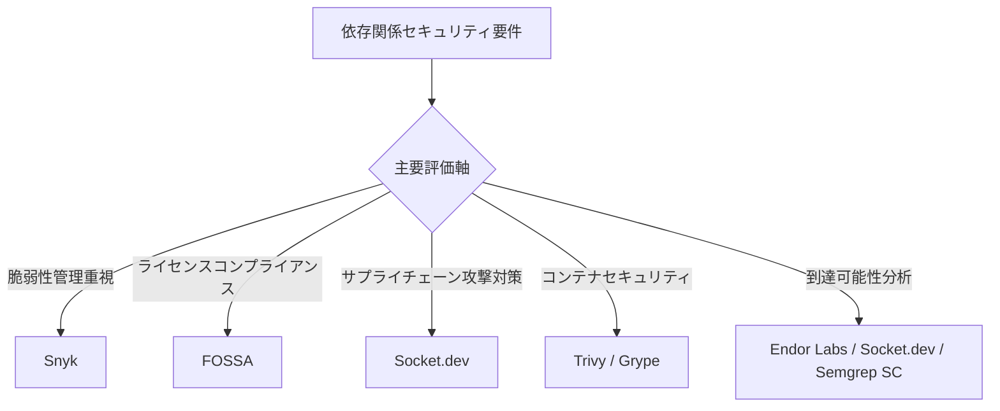
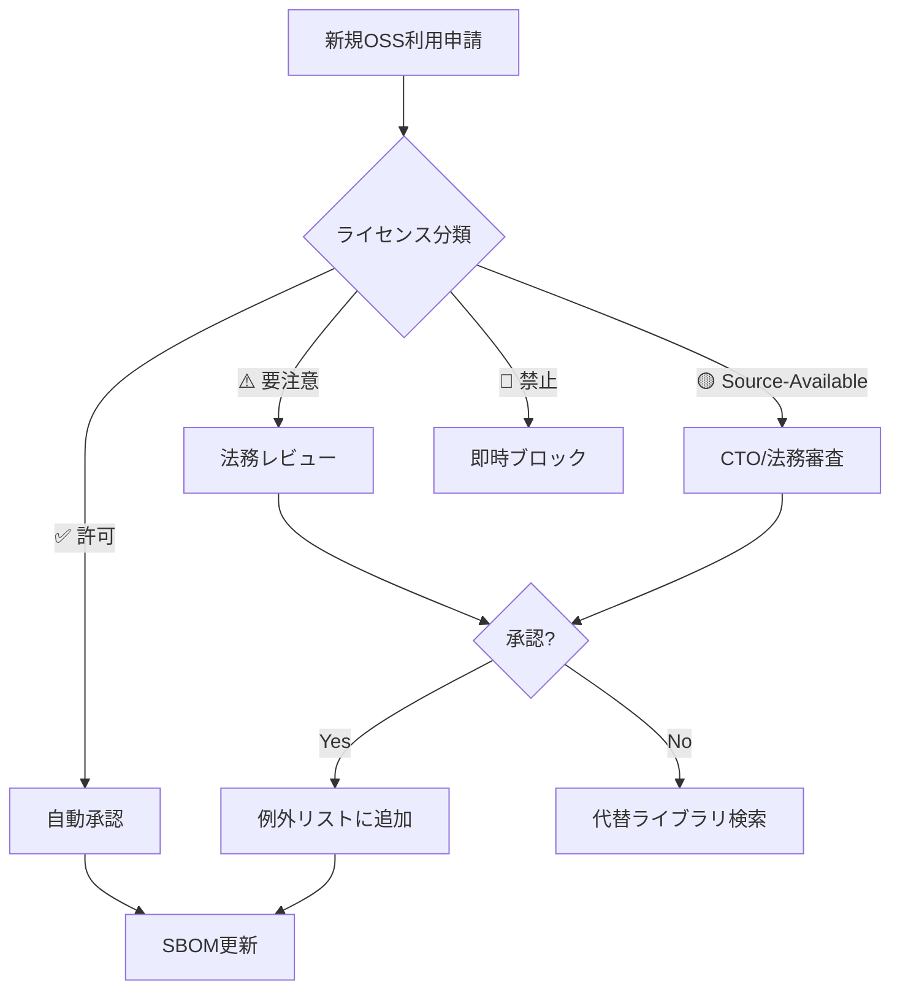
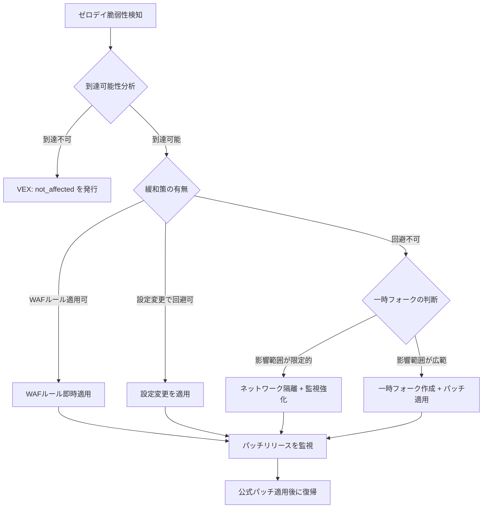
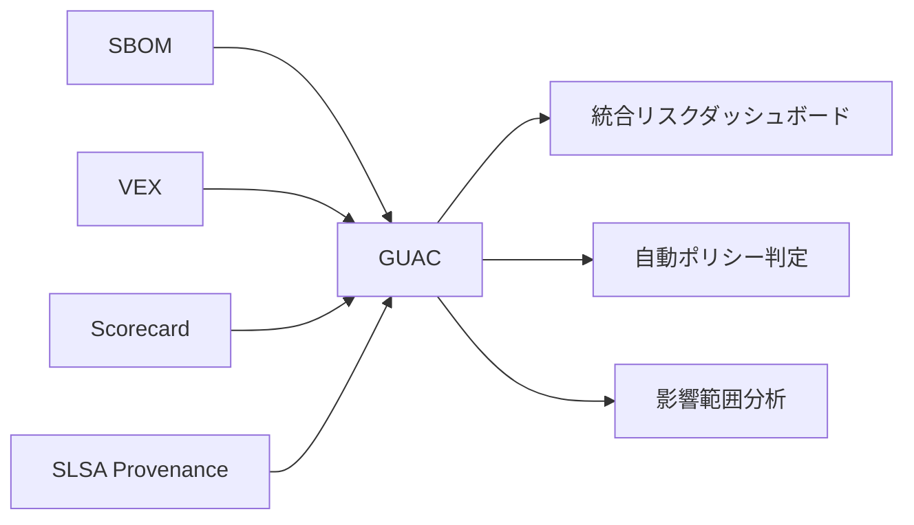
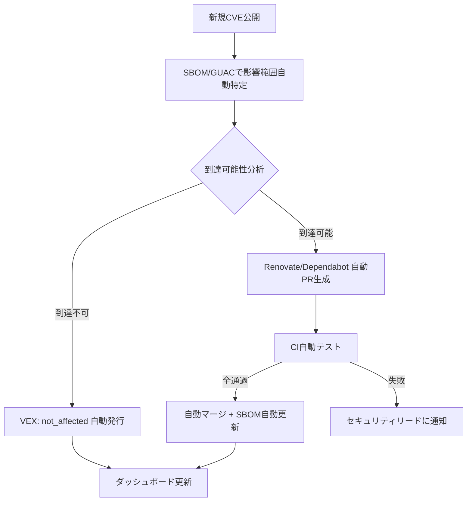

# 62. ライセンスと依存関係管理 (License & Dependency Management)

> [!CAUTION]
> **このファイルは Universal Rule（不変ルール）です。「憲法改正」の明示的指示がない限り編集禁止。**
> 改定日: 2026-03-24

> [!IMPORTANT]
> **Supreme Directive（最高指令）**
> 「すべての依存関係は信頼の決定 — 管理されていないライセンスは法的時限爆弾である。」
> すべてのサードパーティ依存関係は監査・承認・継続的監視されなければならない。
> **ライセンス準拠 > セキュリティ > 安定性 > 利便性** の優先順位を厳守せよ。
> **49セクション構成。**

---

## 目次

| § | セクション |
|---|---|
| 1 | [ライセンス分類とポリシー](#1-ライセンス分類とポリシー) |
| 2 | [ライセンス互換性マトリクス](#2-ライセンス互換性マトリクス) |
| 3 | [AI/MLモデルライセンス](#3-aimlモデルライセンス) |
| 4 | [コンテナイメージライセンス管理](#4-コンテナイメージライセンス管理) |
| 5 | [IaCモジュール・アクションのライセンス](#5-iacモジュールアクションのライセンス) |
| 6 | [フォント・メディアアセットライセンス](#6-フォントメディアアセットライセンス) |
| 7 | [SBOM（Software Bill of Materials）](#7-sbomsoftware-bill-of-materials) |
| 8 | [SBOM規制コンプライアンス](#8-sbom規制コンプライアンス) |
| 9 | [サプライチェーンセキュリティ基盤](#9-サプライチェーンセキュリティ基盤) |
| 10 | [SCAツール統合](#10-scaツール統合) |
| 11 | [CIパイプラインガードレール](#11-ciパイプラインガードレール) |
| 12 | [依存関係選定基準](#12-依存関係選定基準) |
| 13 | [バンドルサイズ・パフォーマンス影響](#13-バンドルサイズパフォーマンス影響) |
| 14 | [ロックファイル整合性](#14-ロックファイル整合性) |
| 15 | [自動更新戦略（Renovate / Dependabot）](#15-自動更新戦略renovate--dependabot) |
| 16 | [セキュリティパッチ適用SLA](#16-セキュリティパッチ適用sla) |
| 17 | [Monorepo依存関係管理](#17-monorepo依存関係管理) |
| 18 | [Private Registry / Artifactory](#18-private-registry--artifactory) |
| 19 | [推移的依存関係管理](#19-推移的依存関係管理) |
| 20 | [EOL / 非推奨パッケージ管理](#20-eol--非推奨パッケージ管理) |
| 21 | [帰属表示・NOTICE生成](#21-帰属表示notice生成) |
| 22 | [OSPO（Open Source Program Office）](#22-ospoopen-source-program-office) |
| 23 | [依存関係侵害インシデント対応](#23-依存関係侵害インシデント対応) |
| 24 | [監査・レポーティング](#24-監査レポーティング) |
| 25 | [FinOps: 依存関係コスト最適化](#25-finops-依存関係コスト最適化) |
| 26 | [OpenSSF Scorecard統合](#26-openssf-scorecard統合) |
| 27 | [依存関係混同攻撃対策](#27-依存関係混同攻撃対策) |
| 28 | [VEX（Vulnerability Exploitability eXchange）](#28-vexvulnerability-exploitability-exchange) |
| 29 | [CBOM（Cryptographic Bill of Materials）](#29-cbomcryptographic-bill-of-materials) |
| 30 | [マルチエコシステム依存関係管理](#30-マルチエコシステム依存関係管理) |
| 31 | [パッケージ公開セキュリティとOIDC完全移行](#31-パッケージ公開セキュリティとoidc完全移行) |
| 32 | [GitHub Dependency Review統合](#32-github-dependency-review統合) |
| 33 | [OSS法的リスクマネジメント](#33-oss法的リスクマネジメント) |
| 34 | [ゼロデイ依存関係対応プレイブック](#34-ゼロデイ依存関係対応プレイブック) |
| 35 | [AI生成コードのライセンスリスク](#35-ai生成コードのライセンスリスク) |
| 36 | [Slopsquatting / AIパッケージ幻覚攻撃対策](#36-slopsquatting--aiパッケージ幻覚攻撃対策) |
| 37 | [SBOM長期保持とCRA技術文書化要件](#37-sbom長期保持とcra技術文書化要件) |
| 38 | [ランタイム依存関係監視（Runtime SCA）](#38-ランタイム依存関係監視runtime-sca) |
| 39 | [依存関係最小化原則](#39-依存関係最小化原則) |
| 40 | [サプライチェーンインシデント事例データベース](#40-サプライチェーンインシデント事例データベース) |
| 41 | [依存関係ガバナンス成熟度モデル](#41-依存関係ガバナンス成熟度モデル) |
| 42 | [ライセンスロンダリング対策](#42-ライセンスロンダリング対策) |
| 43 | [Remote Dynamic Dependencies（RDD）対策](#43-remote-dynamic-dependenciesrdd対策) |
| 44 | [DORA ICTサプライチェーン要件](#44-dora-ictサプライチェーン要件) |
| 45 | [連続的検証（Continuous Verification）](#45-連続的検証continuous-verification) |
| 46 | [OpenSSF GUAC統合](#46-openssf-guac統合) |
| 47 | [メンテナバーノウトリスク対策](#47-メンテナバーノウトリスク対策) |
| 48 | [依存関係セキュリティ自動対応基盤](#48-依存関係セキュリティ自動対応基盤) |
| 49 | [開発者セキュリティ教育・啓発](#49-開発者セキュリティ教育啓発) |
| A | [Appendix A: 逆引き索引](#appendix-a-逆引き索引) |

---

## §1. ライセンス分類とポリシー

### 1.1 三層分類

**✅ 許可（Safe — 即時利用可）**:

| ライセンス | リスク | 備考 |
|:----------|:------|:-----|
| MIT | ✅ 安全 | 最も緩やか。商用利用可。帰属表示必須 |
| Apache-2.0 | ✅ 安全 | 特許条項含む。商用利用可。NOTICE保持必須 |
| BSD-2-Clause | ✅ 安全 | 商用利用可 |
| BSD-3-Clause | ✅ 安全 | 商用利用可。名称利用制限あり |
| ISC | ✅ 安全 | MIT同等 |
| CC0-1.0 | ✅ 安全 | パブリックドメイン相当 |
| 0BSD | ✅ 安全 | 帰属表示不要 |
| Unlicense | ✅ 安全 | パブリックドメイン相当 |
| Zlib | ✅ 安全 | 商用利用可 |
| PSF-2.0 | ✅ 安全 | Python標準ライブラリ |

**⚠️ 要注意（Caution — 法務確認必須）**:

| ライセンス | リスク | 対応 |
|:----------|:------|:-----|
| LGPL-2.1 / LGPL-3.0 | ⚠️ 条件付き | 動的リンクならOK。法務確認後に例外許可 |
| MPL-2.0 | ⚠️ 条件付き | ファイル単位Copyleft。法務確認後に例外許可 |
| EPL-2.0 | ⚠️ 条件付き | モジュール単位Copyleft。法務確認 |
| CDDL-1.0 | ⚠️ 条件付き | ファイル単位Copyleft。法務確認 |
| Artistic-2.0 | ⚠️ 条件付き | Perl由来。改変時名称変更義務 |
| CC-BY-4.0 | ⚠️ 条件付き | コードでなくドキュメント/データ向け |
| CC-BY-SA-4.0 | ⚠️ 条件付き | ShareAlike条件あり。法務確認 |
| EUPL-1.2 | ⚠️ 条件付き | EU公共ライセンス。Copyleft互換性条項あり。互換ライセンスリスト確認 |

**🔴 禁止（Prohibited — 即時ブロック）**:

| ライセンス | リスク | 理由 |
|:----------|:------|:-----|
| GPL-2.0 / GPL-3.0 | 🔴 高 | プロジェクト全体のソース公開義務 |
| AGPL-3.0 | 🔴 最高 | SaaS/ネットワーク利用でも公開義務 |
| SSPL | 🔴 最高 | MongoDB系。類似の感染力 |
| CC-BY-NC-* | 🔴 高 | 商用利用不可 |
| CC-BY-ND-* | 🔴 高 | 改変不可 |
| CAL-1.0 | 🔴 高 | 強力Copyleft。ユーザーデータの暗号化義務あり |

### 1.2 Source-Availableライセンスの扱い

| ライセンス | 分類 | 注意点 |
|:----------|:-----|:------|
| BSL-1.1 (Business Source License) | 🔴 禁止 | 期限付きでApache-2.0に転換するが、転換前は商用制限。HashiCorp Terraform等 |
| FSL-1.1 (Functional Source License) | 🔴 禁止 | 2年後にApache-2.0/MITに転換。転換前は競合利用禁止 |
| Elastic License 2.0 | 🔴 禁止 | SaaS提供禁止。再配布制限 |
| PolyForm Shield 1.0.0 | 🔴 禁止 | 競合利用禁止 |
| BUSL (MariaDB BSL) | 🔴 禁止 | BSL-1.1の派生。同等の制限 |

> [!CAUTION]
> Source-Availableライセンスは「ソースコードが見える ≠ OSS」である。OSI非承認であり、従来のOSSと同じ扱いは厳禁。

### 1.3 デュアルライセンス戦略への対応

- **ルール**: デュアルライセンスパッケージでは、**商用利用に最も有利なライセンス**を選択し、`package.json` の `license` フィールドに明記する
- **ルール**: CopyleftとPermissiveのデュアルライセンスでは、Permissive側を選択する
- **ルール**: ライセンス選択の根拠を `licenses/decisions/` ディレクトリに記録する

→ クロスリファレンス: [`601_data_governance.md`](../security/100_data_governance.md) §GenAI著作権

---

## §2. ライセンス互換性マトリクス

### 2.1 互換性ルール

| 出力物の形態 | 許容されるライセンスの組み合わせ |
|:------------|:-------------------------------|
| 静的リンク | 全ライブラリのライセンスが互換であること |
| 動的リンク | LGPLは許可。GPLは不可 |
| SaaS配信 | AGPL除外必須。SSPL除外必須 |
| コンテナ配布 | ベースイメージ含む全レイヤーの互換性確認 |
| WebAssembly配布 | 静的リンクと同等の扱い |
| npm / PyPI公開 | 推移的依存の互換性も含めて検証 |

### 2.2 自動互換性チェック

```yaml
# .github/workflows/license-compat.yml
- name: License Compatibility Check
  run: |
    npx license-checker --production --json > licenses.json
    node scripts/check-license-compat.js licenses.json
```

```javascript
// scripts/check-license-compat.js
const fs = require('fs');
const PROHIBITED = ['GPL-2.0', 'GPL-3.0', 'AGPL-3.0', 'SSPL'];
const REVIEW_REQUIRED = ['LGPL-2.1', 'LGPL-3.0', 'MPL-2.0', 'EPL-2.0'];
const SOURCE_AVAILABLE = ['BSL-1.1', 'FSL-1.1', 'Elastic-2.0'];

const licenses = JSON.parse(fs.readFileSync(process.argv[2]));
const violations = [];
for (const [pkg, info] of Object.entries(licenses)) {
  const lic = info.licenses || '';
  if (PROHIBITED.some(l => lic.includes(l))) {
    violations.push({ pkg, license: lic, severity: 'BLOCK' });
  } else if (SOURCE_AVAILABLE.some(l => lic.includes(l))) {
    violations.push({ pkg, license: lic, severity: 'BLOCK' });
  } else if (REVIEW_REQUIRED.some(l => lic.includes(l))) {
    violations.push({ pkg, license: lic, severity: 'REVIEW' });
  }
}
if (violations.some(v => v.severity === 'BLOCK')) {
  console.error('❌ 禁止ライセンス検出:', JSON.stringify(violations, null, 2));
  process.exit(1);
}
if (violations.some(v => v.severity === 'REVIEW')) {
  console.warn('⚠️ 要確認ライセンス:', JSON.stringify(violations, null, 2));
}
```

→ クロスリファレンス: [`600_security_privacy.md`](../security/000_security_privacy.md) §サプライチェーンセキュリティ

---

## §3. AI/MLモデルライセンス

### 3.1 モデルウェイトのライセンス分類

| ライセンス | 商用利用 | 改変 | 再配布 | 備考 |
|:----------|:--------|:-----|:------|:-----|
| Apache-2.0（Llama 3等） | ✅ | ✅ | ✅ | 利用者数制限あり（Meta: 月間7億) |
| Gemma Terms of Use | ✅ | ✅ | ⚠️ | Google利用規約に従う |
| OpenRAIL-M | ✅ | ✅ | ⚠️ | 利用制限条項（Responsible AI）あり |
| CC-BY-NC-4.0 | ❌ | ✅ | ⚠️ | 商用不可。研究用途のみ |
| Llama 2 Community License | ✅ | ✅ | ⚠️ | 月間アクティブユーザー7億超で別途契約必要 |
| Mistral Research License | ❌ | ⚠️ | ❌ | 研究用途限定 |

### 3.2 ルール

- **ルール**: モデルウェイトのダウンロード前にライセンスとAcceptable Use Policyを確認する
- **ルール**: Fine-tuning後のモデル配布時は、元ライセンスの「派生物」条件を確認する
- **ルール**: モデルのライセンスが利用者数上限を定めている場合、月次で利用者数を監視する
- **ルール**: モデルライセンスの変更（例: Llama 2→3のライセンス変更）を四半期で監視する

→ クロスリファレンス: [`601_data_governance.md`](../security/100_data_governance.md) §GenAI著作権、[`400_ai_engineering.md`](../ai/000_ai_engineering.md)

---

## §4. コンテナイメージライセンス管理

### 4.1 ルール

- **ルール**: ベースイメージのライセンスを必ず確認する（例: Alpine=MIT、Ubuntu=GPL系混在、Distroless=Apache-2.0推奨）
- **ルール**: マルチステージビルドの最終ステージに含まれるパッケージのみがライセンス対象
- **ルール**: コンテナSBOMを `syft` または `trivy` で生成し、CIで自動検証する

```bash
# コンテナSBOM生成
syft packages myapp:latest -o spdx-json > container-sbom.spdx.json
# ライセンスチェック
trivy image --scanners license --severity HIGH,CRITICAL myapp:latest
```

### 4.2 ベースイメージ選定基準

| イメージ | ライセンスリスク | 推奨度 |
|:--------|:---------------|:------|
| gcr.io/distroless | ✅ 低（Apache-2.0） | ⭐ 最推奨 |
| chainguard/static | ✅ 低（Apache-2.0） | ⭐ 推奨（最小攻撃面） |
| alpine | ✅ 低（MIT） | ⭐ 推奨 |
| debian-slim | ⚠️ 中（GPL混在） | 許可（帰属表示注意） |
| ubuntu | ⚠️ 中（GPL混在） | 許可（帰属表示注意） |

---

## §5. IaCモジュール・アクションのライセンス

### 5.1 ルール

- **ルール**: Terraformモジュール（registry/GitHub）導入時にライセンスを確認する
- **ルール**: GitHub Actionsのサードパーティアクションは、**SHA pinning** でバージョン固定する
- **ルール**: GitHub Actionsはフォーク版ではなく公式/Verified Creator版を優先する
- **ルール**: Helmチャートのライセンスもレビュー対象とする
- **ルール**: OpenTofu/Terraform間のライセンス差異（MPL-2.0 vs BSL-1.1）を把握し、プロジェクト方針を決定する

```yaml
# ✅ 正: SHA pinning
- uses: actions/checkout@b4ffde65f46336ab88eb53be808477a3936bae11 # v4.1.1

# ❌ 誤: タグのみ
- uses: actions/checkout@v4
```

→ クロスリファレンス: [`600_security_privacy.md`](../security/000_security_privacy.md) §サプライチェーン

---

## §6. フォント・メディアアセットライセンス

### 6.1 ルール

- **ルール**: Google Fonts（OFL/Apache-2.0）は安全。セルフホスティング時もライセンス確認
- **ルール**: 商用フォント（Adobe Fonts等）はシート数・用途制限を厳守する
- **ルール**: ストック画像/アイコンはライセンス証書を `licenses/` ディレクトリに保存する
- **ルール**: CC-BY画像はalt属性またはキャプションで帰属表示する
- **ルール**: AI生成画像の著作権帰属はサービス利用規約を確認する（§35参照）

| アセット種別 | 安全なライセンス | 注意が必要なライセンス |
|:------------|:---------------|:-------------------|
| フォント | OFL-1.1, Apache-2.0 | 商用フォント（シート制限） |
| アイコン | MIT, CC0 | CC-BY（帰属表示必須） |
| 画像 | Unsplash License, CC0 | CC-BY-NC（商用不可） |

→ クロスリファレンス: [`200_design_ux.md`](../design/000_design_ux.md)

---

## §7. SBOM（Software Bill of Materials）

### 7.1 SBOM生成義務

- **ルール**: 全リリースビルドに対してSBOMを自動生成する（CIに必須統合）
- **ルール**: フォーマットは **CycloneDX 1.6+**（セキュリティ自動化向け）または **SPDX 3.0+**（ライセンスコンプライアンス向け）を使用する
- **ルール**: 両フォーマットの並行生成を推奨（相互補完性のため）

### 7.2 SBOMの最小データ要素（CISA 2025基準）

| フィールド | 説明 | 必須 |
|:----------|:-----|:-----|
| Component Name | パッケージ名 | ✅ |
| Version | バージョン | ✅ |
| Supplier | 供給者/ベンダー | ✅ |
| Component Hash | SHA-256等のハッシュ値 | ✅ |
| License Information | SPDX識別子 | ✅ |
| Dependency Relationship | 直接/推移的の区分 | ✅ |
| Tool Name | SBOM生成ツール名 | ✅ |
| Generation Context | 生成日時・ビルドID | ✅ |
| Unique Identifier | PURL（Package URL）推奨 | ✅（2026〜） |

### 7.3 SBOM生成スニペット

```yaml
# .github/workflows/sbom.yml
sbom:
  runs-on: ubuntu-latest
  steps:
    - uses: actions/checkout@v4
    - run: npm ci
    - name: Generate CycloneDX SBOM
      run: npx @cyclonedx/cyclonedx-npm --output-file sbom.cdx.json
    - name: Generate SPDX SBOM
      run: |
        syft dir:. -o spdx-json > sbom.spdx.json
    - name: Upload SBOM artifacts
      uses: actions/upload-artifact@v4
      with:
        name: sbom-${{ github.sha }}
        path: |
          sbom.cdx.json
          sbom.spdx.json
        retention-days: 3650  # EU CRA 10年保持要件
```

### 7.4 SBOMライフサイクル管理

- **ルール**: SBOMはリリース毎だけでなく、依存関係が変更されたビルド毎にリフレッシュする
- **ルール**: SBOMにGitコミットハッシュとCI/CDパイプラインIDを紐づけ、トレーサビリティを確保する
- **ルール**: SBOMのバージョン管理にSemVerを適用し、コンポーネント変更時にマイナーバージョンを更新する
- **ルール**: SBOMリポジトリまたはSBOM管理プラットフォーム（DependencyTrack等）で一元管理する

→ クロスリファレンス: [`300_engineering_standards.md`](../engineering/000_engineering_standards.md) §CI/CD

---

## §8. SBOM規制コンプライアンス

### 8.1 グローバル規制タイムライン

| 規制 | 施行日 | 要件 | 罰則 |
|:-----|:------|:-----|:-----|
| US EO 14028 | 2021〜（段階的） | 連邦政府調達ソフトウェアにSBOM必須 | 調達資格喪失 |
| CISA SBOM最小要素v2 | **2025-08** | コンポーネントハッシュ・ライセンス・ツール名・生成コンテキスト・PURL追加 | — |
| India CERT-In SBOM GL 2.0 | **2025-07** | 重要サービス組織にSBOM必須。民間も推奨 | — |
| DORA（EU金融） | **2025-01施行** | ICT第三者リスク管理。ソフトウェアサプライチェーン可視化義務 | 最大€10M or 売上5% |
| EU CRA: 委任規則(EU)2025/1535 | **2025-07** | 重要/クリティカル製品カテゴリの技術的記述 | — |
| EU CRA: 実施規則(EU)2025/2392 | **2025-11** | 適合性評価の詳細要件 | — |
| EU CRA: 適合性評価機関届出 | **2026-06** | 適合性評価機関への届出義務開始 | — |
| EU CRA: 脆弱性報告 | **2026-09** | アクティブ悪用脆弱性の24時間以内報告義務。ENISAへの通報必須 | 最大€15M or 売上2.5% |
| EU CRA: 完全施行 | **2027-12** | 製品技術文書にSBOM必須。機械可読形式。**10年間の保持義務**。5年間のセキュリティアップデート義務 | 最大€15M or 売上2.5% |
| Japan 経産省 SBOMガイドライン | 2023〜（推奨） | ソフトウェア管理にSBOM活用。政府調達では事実上必須 | — |
| NIST SSDF更新 | 2026（予定） | SBOM要件の強化、SLSA準拠の推奨 | — |

> [!IMPORTANT]
> EU CRAは段階的施行であり、2026-09の脆弱性報告義務が最初の実質的対応期限。中間標準化（SBOMスキーマ含むhorizontal standard）は2026年中盤にCEN/CENELECから公開予定。

### 8.2 ルール

- **ルール**: EU市場に製品を投入する場合、CRA 2026-09の脆弱性報告要件に**今から**準備を開始する
- **ルール**: CRA技術文書のSBOM保持期間は**10年間**。長期ストレージ戦略を策定する（§37参照）
- **ルール**: 金融セクターの場合、DORA要件に基づくICTサードパーティリスク評価を実施する（§44参照）
- **ルール**: 政府調達案件では、CISA SBOM最小要素v2に完全準拠するSBOMを提供する

→ クロスリファレンス: [`601_data_governance.md`](../security/100_data_governance.md) §EU Data Act

---

## §9. サプライチェーンセキュリティ基盤

### 9.1 SLSA（Supply-chain Levels for Software Artifacts）v1.1

| レベル | 要件 | 保護対象 |
|:------|:-----|:--------|
| SLSA 1 | ビルドプロセスの文書化。Provenanceの存在 | 改ざん監査の開始 |
| SLSA 2 | ホスト型ビルドサービス使用。署名付きProvenance | ビルド環境の改ざん |
| SLSA 3 | 隔離されたビルド環境。再現可能なビルド。エフェメラルワーカー | 内部脅威・ビルドインジェクション |

- **ルール**: 最低 **SLSA 2** を達成する（GitHub Actions + Artifact Attestation で到達可能）
- **ルール**: SLSA 3を目標とし、ephemeral runners + hermetic builds を導入する

### 9.2 OIDC Trusted Publishing

- **ルール**: パッケージ公開は **OIDC Trusted Publishing** を唯一の方法とする（§31参照）
- **ルール**: 長期アクセストークンの使用を**完全禁止**する（npm/PyPI/GitHub Packages共通）

### 9.3 GitHub Artifact Attestation

- **ルール**: CI/CDビルドで `actions/attest-build-provenance` を使用してProvenance Attestationを生成する
- **ルール**: 消費者側で `gh attestation verify` を実行し、Provenanceの検証を行う
- **ルール**: in-totoアテステーションフレームワークに準拠し、エンドツーエンドのサプライチェーン検証を実現する

### 9.4 Sigstore統合

- **ルール**: コンテナイメージは `cosign` で署名する（Keylessモード推奨）
- **ルール**: 署名検証をKubernetes Admission Controllerで強制する

```bash
# Keyless署名（Sigstore Fulcio + Rekor）
cosign sign myregistry.com/myapp:v1.0.0
# Keyless検証
cosign verify myregistry.com/myapp:v1.0.0 \
  --certificate-identity=workflow@github.com \
  --certificate-oidc-issuer=https://token.actions.githubusercontent.com
```

→ クロスリファレンス: [`600_security_privacy.md`](../security/000_security_privacy.md) §サプライチェーン、[`300_engineering_standards.md`](../engineering/000_engineering_standards.md) §CI/CD

---

## §10. SCAツール統合

### 10.1 推奨ツールスタック（2026年版）

| ツール | 主な強み | 用途 |
|:------|:--------|:-----|
| Snyk | 脆弱性検知 + AI修正提案 + Snyk Code SAST統合 | 脆弱性管理の第一選択 |
| FOSSA | ライセンスコンプライアンス + SBOM + NOTICE自動生成 | ライセンス管理の第一選択 |
| Socket.dev | マルウェア検知 + AI行動分析 + **到達可能性分析（Coana統合）** | サプライチェーン攻撃対策の第一選択 |
| Semgrep Supply Chain | 推移的到達可能性分析（Reachability Analysis） | 偽陽性削減 |
| Trivy | コンテナ + IaC + SBOM + ライセンス | コンテナセキュリティ |
| Endor Labs | DCA（Dependency Caller Analysis） + Binary-to-Source AI | 到達可能性分析・コンテキスト重視 |
| Grype | OSS CLIスキャナ（SBOM/コンテナイメージ対応） | クラウドネイティブワークフロー |
| `npm audit` | npm内蔵 | 最低限のベースライン |

> [!NOTE]
> Socket.devは2025年4月にCoanaを買収し、到達可能性分析機能を統合。CVEの偽陽性を最大80%削減可能。2025年7月にTrusted Publishing対応も完了。

### 10.2 ツール選定フローチャート



### 10.3 ルール

- **ルール**: 最低1つのSCAツールをCIに統合する（Snyk推奨）
- **ルール**: ライセンスチェックとセキュリティスキャンは **別々のジョブ** として実行する
- **ルール**: SCAツールのスキャン対象に、npm/yarn/pnpmだけでなくGoモジュール、Pythonのpyproject.toml、RustのCargo.toml等も含める
- **ルール**: 偽陽性は `.snyk` ポリシーファイル等で明示的に抑制し、理由と期限をコメントする
- **ルール**: Socket.devの行動分析アラート（install scripts/network access/filesystem access）を有効化する
- **ルール**: 到達可能性分析ツール（Socket.dev / Endor Labs / Semgrep SC）を導入し、真に対応が必要な脆弱性に集中する
- **ルール**: AI生成コードのライセンス汚染スキャンをSCAパイプラインに統合する（§42参照）

---

## §11. CIパイプラインガードレール

### 11.1 自動ブロックルール

| 検知事象 | アクション | 例外手続き |
|:--------|:---------|:----------|
| 🔴禁止ライセンス（GPL/AGPL/SSPL） | PRマージ自動ブロック | CTO書面承認 |
| 🟡Source-Availableライセンス（BSL/FSL/Elastic） | PRマージ自動ブロック | CTO/法務承認 |
| Critical脆弱性（CVSS ≥ 9.0） | PRマージ自動ブロック | セキュリティリード承認（24h以内） |
| High脆弱性（CVSS ≥ 7.0） | 警告 + 7日以内修正義務 | チームリード承認 |
| ライセンス不明（UNKNOWN） | PRマージ自動ブロック | 手動調査後にallowlistへ追加 |
| OpenSSF Scorecard < 4.0 | 警告 | §26参照 |
| Socket.dev行動分析: High-risk | PRマージ自動ブロック | セキュリティリード承認 |

### 11.2 CI設定例

```yaml
# .github/workflows/dependency-guard.yml
name: Dependency Guard
on: [pull_request]
jobs:
  license-check:
    runs-on: ubuntu-latest
    steps:
      - uses: actions/checkout@v4
      - run: npm ci
      - name: License Check
        run: |
          npx license-checker --production --failOn \
            "GPL-2.0;GPL-3.0;AGPL-3.0;SSPL;UNKNOWN"
      - name: License Report
        run: npx license-checker --production --csv > license-report.csv

  vulnerability-scan:
    runs-on: ubuntu-latest
    steps:
      - uses: actions/checkout@v4
      - run: npm ci
      - name: Snyk Test
        uses: snyk/actions/node@master
        env:
          SNYK_TOKEN: ${{ secrets.SNYK_TOKEN }}
        with:
          args: --severity-threshold=high

  supply-chain-check:
    runs-on: ubuntu-latest
    steps:
      - uses: actions/checkout@v4
      - name: Socket Security
        uses: SocketDev/socket-security-action@v1
        with:
          api_key: ${{ secrets.SOCKET_API_KEY }}
```

→ クロスリファレンス: [`300_engineering_standards.md`](../engineering/000_engineering_standards.md) §CI/CD

---

## §12. 依存関係選定基準

### 12.1 ヘルスメトリクス（導入前チェックリスト）

| 指標 | 最低基準 | 理想 |
|:----|:--------|:-----|
| GitHub Stars | ≥ 500 | ≥ 5,000 |
| 最終コミット | 6ヶ月以内 | 1ヶ月以内 |
| メンテナー数 | ≥ 2 | ≥ 5 |
| オープンIssue解決率 | ≥ 50% | ≥ 80% |
| テストカバレッジ | 存在すること | ≥ 80% |
| TypeScript型定義 | 存在すること | ビルトイン |
| ダウンロード数（npm weekly） | ≥ 10,000 | ≥ 100,000 |
| セキュリティポリシー | 存在すること | SECURITY.md + 脆弱性報告フロー |
| ライセンス | 許可リスト内 | MIT / Apache-2.0 |
| **OpenSSF Scorecard** | **≥ 4.0** | **≥ 7.0** |
| **Bus Factor** | **≥ 2** | **≥ 5**（§47参照） |

### 12.2 リスクスコアリング

- **ルール**: 新規依存関係の追加時、上記チェックリストの合格率が **70%未満** の場合はチームリードの承認を必須とする
- **ルール**: 依存関係の代替候補を最低2つ比較検討する
- **ルール**: 「1パッケージ = 1機能」の原則を徹底し、メガライブラリよりも軽量な代替を優先する
- **ルール**: OpenSSF Scorecardスコア **4.0未満** のパッケージは原則採用禁止（§26参照）
- **ルール**: Bus Factor 1のパッケージは追加リスク評価を実施する（§47参照）

---

## §13. バンドルサイズ・パフォーマンス影響

### 13.1 ルール

- **ルール**: Webアプリの新規依存追加時は [`bundlephobia.com`](https://bundlephobia.com) でサイズ影響を確認する
- **ルール**: gzip後 **50KB以上** の依存関係追加はチームリード承認を必須とする
- **ルール**: Tree-shaking対応（ESM）のパッケージを優先する
- **ルール**: 同機能の軽量代替を常に検討する

### 13.2 推奨代替ライブラリ

| 重量級 | 軽量代替 | サイズ削減 |
|:------|:--------|:---------|
| moment.js (72KB) | date-fns (tree-shakeable) | -90% |
| lodash (72KB) | lodash-es (tree-shakeable) | -80% |
| axios (14KB) | ky (3KB) / fetch API | -80% |
| uuid (12KB) | crypto.randomUUID() | -100% |
| classnames (1.5KB) | clsx (0.5KB) | -65% |

→ クロスリファレンス: [`340_web_frontend.md`](../engineering/300_web_frontend.md) §パフォーマンス予算

---

## §14. ロックファイル整合性

### 14.1 ルール

- **ルール**: `package-lock.json`, `yarn.lock`, `pnpm-lock.yaml`, `Podfile.lock`, `pubspec.lock` は**必ずコミット**する
- **ルール**: CI環境では **`npm ci`**（または `pnpm install --frozen-lockfile`）を使用し、`npm install` を禁止する
- **ルール**: ロックファイルの差分はPRレビューで**必ず確認**する
- **ルール**: `lockfile-lint` をCIに統合し、信頼されたレジストリからの取得を保証する
- **ルール**: チーム全員が同一のNode.js/npmバージョンを使用する（`.nvmrc` / `.node-version` で統一）
- **ルール**: Corepackを有効化し、`packageManager` フィールドでパッケージマネージャのバージョンを固定する

### 14.2 Corepack設定

```json
// package.json
{
  "packageManager": "pnpm@9.15.0+sha512.abc123..."
}
```

```bash
# Corepack有効化
corepack enable
# CIでの自動バージョン固定
corepack prepare pnpm@9.15.0 --activate
```

### 14.3 Install Script セキュリティ

- **ルール**: `.npmrc` で `ignore-scripts=true` をデフォルト設定し、信頼されたパッケージのみ `allow-scripts` でホワイトリスト化する
- **ルール**: `postinstall` / `preinstall` スクリプトを持つパッケージは追加レビュー対象とする

```ini
# .npmrc — Install Script防御
ignore-scripts=true
# 信頼されたパッケージのみ許可
# package.jsonのtrustedDependenciesで管理
```

---

## §15. 自動更新戦略（Renovate / Dependabot）

### 15.1 推奨設定

- **ルール**: Renovateを第一選択とする（Dependabotより柔軟な設定が可能）
- **ルール**: セキュリティアップデートは **自動マージ** を有効化する（patch/minorレベル + CI全通過条件）
- **ルール**: メジャーアップデートは手動レビュー必須とする
- **ルール**: **minimumReleaseAge: 21日** を設定し、新規リリースの安定性を確認してから取り込む
- **ルール**: 週次のグルーピングPRで依存関係を一括更新する（ノイズ削減）

### 15.2 Renovate設定例

```json
{
  "$schema": "https://docs.renovatebot.com/renovate-schema.json",
  "extends": ["config:recommended", "schedule:weekends"],
  "minimumReleaseAge": "21 days",
  "vulnerabilityAlerts": { "enabled": true, "minimumReleaseAge": "0 days" },
  "packageRules": [
    {
      "matchUpdateTypes": ["patch", "minor"],
      "matchCurrentVersion": "!/^0/",
      "automerge": true,
      "automergeType": "pr",
      "requiredStatusChecks": ["ci/build", "ci/test", "license-check"]
    },
    {
      "matchUpdateTypes": ["major"],
      "dependencyDashboardApproval": true
    }
  ]
}
```

---

## §16. セキュリティパッチ適用SLA

### 16.1 SLA定義

| 深刻度 | CVSS | 対応期限 | 自動化 |
|:------|:-----|:--------|:------|
| Critical | ≥ 9.0 | **24時間以内** | 自動PR作成 + Slack通知 |
| High | ≥ 7.0 | **7日以内** | 自動PR作成 |
| Medium | ≥ 4.0 | **30日以内** | 週次レポート |
| Low | < 4.0 | **90日以内** | 四半期レビュー |

### 16.2 ルール

- **ルール**: Critical脆弱性は到達可能性分析を実施し、到達可能な場合は**4時間以内**にWAFルール等の緩和策を適用する
- **ルール**: パッチ適用不可の場合、VEXステータスを発行し根拠を文書化する（§28参照）
- **ルール**: SLA逸脱が発生した場合、月次レトロスペクティブで根本原因を分析する

---

## §17. Monorepo依存関係管理

### 17.1 ルール

- **ルール**: Monorepoではpnpm workspaces（推奨）またはnpm workspacesを使用する
- **ルール**: 共通依存関係はルートに配置し、パッケージ固有の依存関係のみ個別に管理する
- **ルール**: `pnpm-lock.yaml` の**単一ロックファイル**で全ワークスペースを管理する
- **ルール**: Merge Queue を必ず有効化し、CI通過後の安全なマージを保証する

### 17.2 Monorepo推奨構成

```
monorepo-root/
├── package.json           ← 共通devDependencies
├── pnpm-lock.yaml         ← 単一ロックファイル
├── pnpm-workspace.yaml
├── packages/
│   ├── shared/            ← 共通ライブラリ
│   ├── app-web/           ← Webアプリ（固有dependencies）
│   └── app-mobile/        ← モバイルアプリ（固有dependencies）
```

---

## §18. Private Registry / Artifactory

### 18.1 ルール

- **ルール**: プライベートパッケージはプライベートレジストリ（GitHub Packages / Artifactory / Verdaccio）で管理する
- **ルール**: パブリックレジストリのプロキシ/キャッシュ層を設置し、可用性を向上させる
- **ルール**: 内部パッケージのスコープ（`@company/`）をnpmパブリックレジストリで**必ず予約**し、**typosquatting**を防止する（§27参照）
- **ルール**: レジストリへのパッケージ公開権限は**最小権限の原則**で管理する
- **ルール**: npm tokenは **OIDC Trusted Publishing** に移行し、長期トークンの使用を廃止する（§31参照）
- **ルール**: レジストリへのアクセスにMFA（多要素認証）を必須化する

```ini
# .npmrc（プライベートレジストリ設定）
@mycompany:registry=https://npm.pkg.github.com
//npm.pkg.github.com/:_authToken=${NODE_AUTH_TOKEN}
```

---

## §19. 推移的依存関係管理

### 19.1 ルール

- **ルール**: `npm ls --all` で依存ツリー全体を定期的に確認する
- **ルール**: 推移的依存にCritical脆弱性がある場合、直接依存のアップグレードまたは`overrides`で対処する
- **ルール**: 推移的依存の深さが **7階層** を超える場合は代替ライブラリを検討する
- **ルール**: `npm explain <package>` で特定パッケージがなぜ含まれているかを追跡する

### 19.2 `overrides` による強制解決

```json
// package.json
{
  "overrides": {
    "vulnerable-transitive-pkg": ">=2.0.1"
  }
}
```

> [!CAUTION]
> `overrides` は一時的な緊急対応手段。根本解決（直接依存のアップグレード）を30日以内に完了すること。

---

## §20. EOL / 非推奨パッケージ管理

### 20.1 ルール

- **ルール**: `npm outdated` を週次で実行し、メジャーバージョン遅れのパッケージを検出する
- **ルール**: `deprecated` フラグのあるパッケージは **30日以内** に代替へ移行する
- **ルール**: Node.js自体のLTSスケジュールに従い、EOLバージョンでの運用を禁止する
- **ルール**: フレームワーク（Next.js, React等）のメジャーバージョンは、リリースから **6ヶ月以内** にアップグレード計画を策定する

### 20.2 EOL監視ツール

- **endoflife.date**: API経由でNode.js/フレームワークのEOL日付を取得可能
- **libyear**: 依存関係の「年齢」を計測し、技術的負債を定量化する

---

## §21. 帰属表示・NOTICE生成

### 21.1 ルール

- **ルール**: OSSライセンス帰属表示をアプリ内に表示する仕組みを必ず実装する
- **ルール**: 表示場所は「設定 > ライセンス」または「About」画面とする
- **ルール**: CI/CDで `NOTICE` ファイルを自動生成し、各リリースに同梱する
- **ルール**: FOSSAのNOTICE自動再生成機能を活用し、依存関係更新時にNOTICEを自動更新する

### 21.2 プラットフォーム別ツール

| プラットフォーム | ツール | 備考 |
|:--------------|:------|:-----|
| Web（npm） | `license-checker --csv` | CSV/JSON出力 |
| iOS（Swift） | `license-plist` | Settings.bundle自動生成 |
| Android | `oss-licenses-plugin` | Google公式 |
| Flutter | `flutter_oss_licenses` | マルチプラットフォーム |
| 全般 | FOSSA NOTICE自動生成 | エンタープライズ向け。自動再生成対応 |

### 21.3 Apache-2.0 NOTICEファイルの特記

- **ルール**: Apache-2.0ライセンスのライブラリを使用する場合、元の `NOTICE` ファイルの内容を保持・同梱する（ライセンス要件）

---

## §22. OSPO（Open Source Program Office）

### 22.1 ルール

- **ルール**: 従業員50名以上の組織ではOSPOまたはOSSガバナンス担当者を設置する
- **ルール**: OSSへの貢献（contribution）時は、CLA（Contributor License Agreement）の署名を確認する
- **ルール**: 社内プロジェクトのOSS公開前に、知的財産・ライセンス・セキュリティのレビューを実施する

### 22.2 OSSガバナンスプロセス



→ クロスリファレンス: [`603_ip_due_diligence.md`](../security/300_ip_due_diligence.md) §IP資産管理

---

## §23. 依存関係侵害インシデント対応

### 23.1 インシデントランブック

| ステップ | アクション | 担当 | SLA |
|:--------|:---------|:-----|:----|
| 1. 検知 | SCAアラート / CVE公開 / セキュリティ通知 | 自動 | — |
| 2. 影響評価 | 影響を受けるサービス/リリースの特定（SBOMから逆引き） | セキュリティリード | 2時間 |
| 3. 封じ込め | 侵害パッケージのpinning / rollback / ネットワーク隔離 | SRE | 4時間 |
| 4. 修正 | パッチ適用 / 代替ライブラリ移行 / overrides | 開発チーム | 24時間 |
| 5. 検証 | CIテスト全通過 + SBOMリフレッシュ + 本番検証 | QA | 48時間 |
| 6. 事後分析 | ポストモーテム + 教訓の結晶化 | 全チーム | 1週間 |

### 23.2 近年の重大サプライチェーン事件と教訓

| 事件 | 時期 | 影響 | 教訓 |
|:-----|:-----|:------|:-----|
| npm Chalk/Debug供給チェーン攻撃 | 2025-09 | 人気パッケージ（数十億DL/週）のメンテナアカウント侵害。crypto-stealer混入 | メンテナ2FA必須化・phishing対策・OIDC TP移行 |
| Shai-Hulud自己複製ワーム | 2025-09 | 500+パッケージ感染。クラウドトークン(AWS/GCP/Azure)・GitHub PAT窃取。`npm install`時に自己複製 | `ignore-scripts=true`デフォルト・minimumReleaseAge設定 |
| S1ngularity攻撃 (Nx) | 2025-08 | Nxプロジェクトのpublishing token窃取 | OIDC Trusted Publishing完全移行・token漏洩監視 |
| PhantomRavenキャンペーン | 2025-10〜2026-02 | RDD手法で検出回避。Slopsquatting併用。開発者の.npmrc/環境変数/CIトークン窃取 | RDD対策（§43）・install script無効化・env保護 |
| OpenClaw/GhostClaw | 2026-03 | 偽AIユーティリティ。暗号ウォレット・SSH鍵・ブラウザデータ窃取 | パッケージ名の正当性検証・公式リポジトリ確認習慣 |

### 23.3 ルール

- **ルール**: 侵害パッケージのバージョンをロックファイルから即座に排除する
- **ルール**: SBOMを使用してリリース済みビルドへの影響範囲を特定する
- **ルール**: `npm token revoke` 等で漏洩した可能性のある認証情報を即座に無効化する
- **ルール**: ポストモーテムの結果を教訓ログ（`core/010_project_lessons_log.md`）に記録する
- **ルール**: publishing tokenを長期トークンからOIDC Trusted Publishingへ移行し、窃取リスクを排除する
- **ルール**: メンテナアカウントの2FA/WebAuthnを必須化し、phishing攻撃によるアカウント乗っ取りを防止する
- **ルール**: 自己複製型マルウェア（Shai-Hulud型）への対策として、CIでネットワーク隔離ビルドを検討する

→ クロスリファレンス: [`503_incident_response.md`](../operations/500_incident_response.md)、[`600_security_privacy.md`](../security/000_security_privacy.md)

---

## §24. 監査・レポーティング

### 24.1 ダッシュボードKPI

| KPI | 頻度 | 目標値 |
|:----|:-----|:------|
| Critical/High脆弱性数 | 日次 | 0 |
| 禁止ライセンス違反数 | 日次 | 0 |
| 依存関係の平均年齢（libyear） | 月次 | < 1.0年 |
| SBOM生成カバレッジ | リリース毎 | 100% |
| セキュリティパッチSLA遵守率 | 月次 | ≥ 95% |
| 非推奨パッケージ数 | 月次 | 0 |
| VEXカバレッジ率 | 月次 | ≥ 90%（Critical/High） |
| OpenSSF Scorecard平均 | 四半期 | ≥ 6.0 |

### 24.2 ルール

- **ルール**: セキュリティダッシュボードを構築し、上記KPIをリアルタイムで可視化する
- **ルール**: 月次レポートを経営層に提出し、リスク状況を共有する
- **ルール**: 四半期ごとに包括的なライセンス監査を実施する

→ クロスリファレンス: [`401_data_analytics.md`](../ai/100_data_analytics.md)

---

## §25. FinOps: 依存関係コスト最適化

### 25.1 ルール

- **ルール**: SCAツールのライセンスコストを年次で見直し、ROIを評価する
- **ルール**: 無料ティアで十分な場合は有料ツールへの移行を避ける
- **ルール**: 複数ツールの重複機能を排除し、コストを最適化する
- **ルール**: Private Registryの帯域幅コストを月次で監視する

### 25.2 コスト削減チェックリスト

| 項目 | 削減手段 |
|:----|:--------|
| SCAツール | OSS代替（Trivy/Grype）の活用 |
| Private Registry | プロキシキャッシュによる帯域節約 |
| CI実行時間 | 依存スキャンの差分実行（変更ファイルのみ） |
| ライセンスコンプライアンス | FOSSAの無料ティア活用 |

→ クロスリファレンス: [`101_revenue_monetization.md`](../product/300_revenue_monetization.md) §FinOps

---

## §26. OpenSSF Scorecard統合

### 26.1 概要

OpenSSF ScorecardはOSSプロジェクトのセキュリティ成熟度を自動評価するツール。依存関係の選定・監視に活用する。

### 26.2 主要チェック項目

| チェック | 内容 | 重要度 |
|:--------|:-----|:------|
| Branch-Protection | デフォルトブランチの保護状態 | 高 |
| Code-Review | PRレビュー実施率 | 高 |
| Dependency-Update-Tool | Renovate/Dependabot等の導入 | 中 |
| Maintained | アクティブなメンテナンス状態 | 高 |
| Signed-Releases | リリース署名の有無 | 中 |
| Token-Permissions | GitHub Actionsのトークン権限最小化 | 高 |
| Vulnerabilities | 未修正脆弱性の有無 | 高 |
| SAST | 静的解析ツールの導入 | 中 |

### 26.3 ルール

- **ルール**: 新規依存関係の追加時にOpenSSF Scorecardスコアを確認する
- **ルール**: スコア **4.0未満** のパッケージは原則採用禁止。例外は文書化する
- **ルール**: 自社のOSSプロジェクトもScorecardを定期実行し、スコア **7.0以上** を維持する
- **ルール**: 2026年のOpenSSFテーマ（AI/MLセキュリティ、CRAアライメント）に対応するチェック項目を注視する

```yaml
# OpenSSF Scorecard CIチェック
- name: OpenSSF Scorecard
  uses: ossf/scorecard-action@v2
  with:
    results_file: scorecard-results.json
    results_format: json
```

---

## §27. 依存関係混同攻撃対策

### 27.1 攻撃ベクトル

| 攻撃手法 | 説明 | 主な防御策 |
|:--------|:-----|:---------|
| Dependency Confusion | パブリックレジストリに同名の上位バージョンを公開 | スコープ予約 + レジストリ優先度設定 |
| Typosquatting | 類似名パッケージ（例: `lodsah`）の公開 | パッケージ名類似度チェック |
| Star-jacking | GitHubリポジトリURLの偽装（npm `repository` フィールド偽装） | Provenance検証 + リポジトリURL相互検証 |
| Install Script攻撃 | `postinstall` 等でのmalicious code実行 | `ignore-scripts=true` + ホワイトリスト |
| RDD（Remote Dynamic Dependencies） | Install時にリモートから動的に依存を注入 | §43参照 |

### 27.2 防御ルール

- **ルール**: 内部パッケージのスコープ（`@company/`）をnpmパブリックレジストリで**必ず予約**する
- **ルール**: `.npmrc` でレジストリの優先順位を明示的に設定する
- **ルール**: CIパイプラインでパッケージ名の類似度チェックを実行する
- **ルール**: `ignore-scripts=true` をデフォルトとし、信頼されたパッケージのみ許可する
- **ルール**: Socket.devまたは同等のツールでマルウェア行動分析を有効化する
- **ルール**: npm Provenanceを検証し、パッケージの発行元CIを確認する

### 27.3 レジストリ優先順位設定

```ini
# .npmrc — 依存関係混同攻撃対策
@mycompany:registry=https://npm.pkg.github.com
registry=https://registry.npmjs.org/
strict-ssl=true
```

→ クロスリファレンス: [`600_security_privacy.md`](../security/000_security_privacy.md) §サプライチェーン

---

## §28. VEX（Vulnerability Exploitability eXchange）

### 28.1 概要

VEXは、脆弱性が自社製品に実際に影響するかを機械可読形式で伝達する仕組み。SBOM内の全脆弱性への一律対応を排除し、真にリスクのある脆弱性に集中する。

### 28.2 VEXステータス

| ステータス | 意味 | アクション |
|:---------|:-----|:---------|
| not_affected | 脆弱性は存在するが影響しない | 対応不要（理由を文書化） |
| affected | 脆弱性が影響する | §16のSLAに従い修正 |
| fixed | 修正済み | SBOM/VEX更新 |
| under_investigation | 調査中 | 72時間以内に判定完了 |

### 28.3 VEXフォーマット比較

| フォーマット | 標準化団体 | 主な用途 |
|:-----------|:---------|:--------|
| CycloneDX VEX | OWASP | CycloneDX SBOMとの統合 |
| CSAF VEX | OASIS | 政府・規制対応（EU CRA準拠推奨） |
| OpenVEX | OpenSSF | クラウドネイティブ・CI/CD統合 |

### 28.4 ルール

- **ルール**: Critical/High脆弱性に対して、72時間以内にVEXステータスを決定する
- **ルール**: `not_affected` の判定には、到達可能性分析の根拠を必ず記録する
- **ルール**: VEXドキュメントはSBOMと紐づけてバージョン管理する
- **ルール**: EU CRA対応が必要な製品では、CSAF VEXフォーマットを使用する

```json
// OpenVEX例
{
  "@context": "https://openvex.dev/ns/v0.2.0",
  "author": "security-team@company.com",
  "timestamp": "2026-03-15T00:00:00Z",
  "statements": [
    {
      "vulnerability": { "@id": "CVE-2026-XXXX" },
      "products": [{ "@id": "pkg:npm/@mycompany/app@1.0.0" }],
      "status": "not_affected",
      "justification": "vulnerable_code_not_in_execute_path"
    }
  ]
}
```

→ クロスリファレンス: [`600_security_privacy.md`](../security/000_security_privacy.md) §脆弱性管理

---

## §29. CBOM（Cryptographic Bill of Materials）

### 29.1 概要

CycloneDX 1.6で新設された暗号資産インベントリ。使用中の暗号アルゴリズム・プロトコル・鍵を網羅的に記録し、量子安全移行を支援する。

### 29.2 ルール

- **ルール**: CycloneDX 1.6+ を使用してCBOMを生成する
- **ルール**: 非推奨暗号（SHA-1, MD5, DES, 3DES, RSA-1024）の使用を検出し排除する
- **ルール**: 量子安全移行計画（PQC Migration Plan）を策定する
- **ルール**: NIST PQC標準化アルゴリズム（ML-KEM, ML-DSA, SLH-DSA）への移行ロードマップを文書化する

### 29.3 暗号アジリティチェックリスト

| 項目 | 確認内容 |
|:----|:--------|
| TLS バージョン | TLS 1.3必須。TLS 1.2は移行期間中のみ許可 |
| ハッシュアルゴリズム | SHA-256以上必須。SHA-1完全禁止 |
| 鍵交換 | ECDH (P-256以上) または X25519。RSA-2048以上 |
| 量子安全準備 | ハイブリッドモード（従来 + PQC）の評価開始 |

→ クロスリファレンス: [`600_security_privacy.md`](../security/000_security_privacy.md) §暗号化ポリシー、[`601_data_governance.md`](../security/100_data_governance.md) §量子暗号アジリティ

---

## §30. マルチエコシステム依存関係管理

### 30.1 エコシステム別ロックファイル・ツール

| エコシステム | ロックファイル | SCAツール | SBOM生成 |
|:-----------|:------------|:---------|:---------|
| Node.js (npm/pnpm/yarn) | `package-lock.json` / `pnpm-lock.yaml` / `yarn.lock` | Snyk, Socket.dev | `@cyclonedx/cyclonedx-npm` |
| Go | `go.sum` | Snyk, Trivy | `syft`, `cyclonedx-gomod` |
| Python | `poetry.lock` / `uv.lock` | Snyk, Safety | `syft`, `cyclonedx-python` |
| Rust | `Cargo.lock` | `cargo-audit` | `syft`, `cyclonedx-rust-cargo` |
| Java/Kotlin | `pom.xml` / `build.gradle.kts` | Snyk, OWASP Dep-Check | `cyclonedx-maven-plugin` |
| Ruby | `Gemfile.lock` | `bundler-audit` | `cyclonedx-ruby` |
| Swift/iOS | `Package.resolved` / `Podfile.lock` | Snyk | `syft` |

### 30.2 統一ルール

- **ルール**: 全エコシステムのロックファイルを**必ずコミット**する
- **ルール**: CI/CDで全エコシステムの脆弱性スキャンを実行する
- **ルール**: 全エコシステムのSBOMを生成し、統合SBOMとしてマージする
- **ルール**: ライセンスチェックは全エコシステムを対象とする

```bash
# 統合SBOMマージ
cyclonedx merge \
  --input-files sbom-npm.cdx.json sbom-go.cdx.json sbom-python.cdx.json \
  --output-file sbom-unified.cdx.json
```

→ クロスリファレンス: [`300_engineering_standards.md`](../engineering/000_engineering_standards.md) §CI/CD

---

## §31. パッケージ公開セキュリティとOIDC完全移行

### 31.1 npmアカウントセキュリティ

| 対策 | 必須/推奨 | 詳細 |
|:----|:---------|:-----|
| 2FA（WebAuthn/TOTP） | **必須** | 全メンテナアカウントで有効化。WebAuthn優先（phishing耐性） |
| OIDC Trusted Publishing | **必須** | npm GA (2025-07)。長期トークンを完全排除 |
| `npm access` 最小権限 | **必須** | 公開権限を最小限のメンテナに限定 |
| Granular Access Token | 廃止移行中 | OIDC TP完全移行までの暫定措置。90日ローテーション |

> [!IMPORTANT]
> npm Trusted Publishingは2025年7月にGA。OIDC対応のCI/CD（GitHub Actions、GitLab CI等）からのみパッケージ公開が可能。長期トークンの新規発行は将来的に制限される見通し。

### 31.2 パッケージ公開ワークフロー

```yaml
# .github/workflows/publish.yml
name: Publish Package
on:
  release:
    types: [published]
permissions:
  id-token: write  # OIDC Trusted Publishing
  contents: read
  attestations: write
jobs:
  publish:
    runs-on: ubuntu-latest
    steps:
      - uses: actions/checkout@v4
      - uses: actions/setup-node@v4
        with:
          node-version: '22'
          registry-url: 'https://registry.npmjs.org'
      - run: npm ci
      - run: npm publish --provenance --access public
        env:
          NODE_AUTH_TOKEN: ''  # OIDC TPでは不要
      - name: Generate Attestation
        uses: actions/attest-build-provenance@v2
        with:
          subject-path: '*.tgz'
```

### 31.3 Provenance検証

```bash
# 消費者側: パッケージのProvenanceを検証
npm audit signatures
# 特定パッケージの詳細検証
gh attestation verify $(npm pack --dry-run 2>&1 | tail -1) \
  --owner myorg
```

→ クロスリファレンス: [`600_security_privacy.md`](../security/000_security_privacy.md) §サプライチェーン

---

## §32. GitHub Dependency Review統合

### 32.1 概要

GitHub Dependency Review Actionは、PRで追加/更新される依存関係のライセンスと脆弱性を自動チェックする。

### 32.2 設定例

```yaml
# .github/workflows/dependency-review.yml
name: Dependency Review
on: [pull_request]
permissions:
  contents: read
  pull-requests: write
jobs:
  dependency-review:
    runs-on: ubuntu-latest
    steps:
      - uses: actions/checkout@v4
      - uses: actions/dependency-review-action@v4
        with:
          fail-on-severity: high
          deny-licenses: GPL-2.0, GPL-3.0, AGPL-3.0, SSPL
          comment-summary-in-pr: always
```

### 32.3 ルール

- **ルール**: 全リポジトリでDependency Review Actionを有効化する
- **ルール**: ライセンスdenyリストを§1の禁止リストと同期させる
- **ルール**: PRコメントサマリーを有効化し、レビュアーが変更の影響を即座に把握できるようにする

---

## §33. OSS法的リスクマネジメント

### 33.1 主要判例・動向

| 判例/動向 | 年 | 影響 |
|:---------|:---|:-----|
| SFC v. Vizio | 2024 | GPL準拠の消費者訴訟権を認定。OSSライセンス違反の訴訟リスク増大 |
| Artificial Intelligence Act (EU) | 2025-2027 | AIモデルの学習データに対するライセンス追跡義務 |
| OSSRA 2025報告 | 2025 | 商用コードベースの33%にライセンス衝突。AI生成コードの「ライセンスロンダリング」が主因 |

### 33.2 ライセンス変更リスク監視

- **ルール**: 依存パッケージのライセンス変更を四半期で監視する（HashiCorp BSL移行、Redis SSPL→AGPL等の事例）
- **ルール**: ライセンス変更検知時は、影響評価を72時間以内に完了する
- **ルール**: Source-Availableへの移行リスクが高いパッケージ（単一企業メンテナンス）のフォーク計画を策定する

### 33.3 法的リスク評価フレームワーク

| リスクレベル | 条件 | 対応 |
|:-----------|:-----|:-----|
| 🔴 高 | Copyleftライセンス混入 / 商用利用制限違反 | 即時除去 + 法務エスカレーション |
| 🟡 中 | Source-Available条件抵触の可能性 | 法務レビュー + 代替検討 |
| 🟢 低 | Permissiveライセンス・帰属表示漏れ | NOTICE更新で対処 |

→ クロスリファレンス: [`601_data_governance.md`](../security/100_data_governance.md)、[`603_ip_due_diligence.md`](../security/300_ip_due_diligence.md)

---

## §34. ゼロデイ依存関係対応プレイブック

### 34.1 判断フローチャート



### 34.2 ルール

- **ルール**: ゼロデイ検知後 **4時間以内** に到達可能性分析を完了する
- **ルール**: 到達可能な場合、**8時間以内** に緩和策を実施する
- **ルール**: 一時フォーク作成時は、公式パッチリリースから **48時間以内** に公式版へ復帰する
- **ルール**: ゼロデイ対応の全ステップを時系列で記録する

→ クロスリファレンス: [`503_incident_response.md`](../operations/500_incident_response.md)、[`600_security_privacy.md`](../security/000_security_privacy.md)

---

## §35. AI生成コードのライセンスリスク

### 35.1 リスクマトリクス

| リスク | 説明 | 対策 |
|:------|:-----|:-----|
| ライセンスロンダリング | AI生成コードにCopyleftコード片が混入し、元のライセンス情報が欠落する | §42参照 |
| 帰属表示の欠落 | AI生成コードの原作者クレジットが欠落 | OSSコード類似度チェック |
| トレーニングデータの法的問題 | 学習データのスクレイピング合法性 | AIサービスのToS・IP条項確認 |
| 著作権の帰属不明 | AI生成物の著作権の法的位置づけが未確定 | 法務チームとのガイドライン策定 |

### 35.2 ルール

- **ルール**: AI生成コードに対して、OSSコード類似度スキャン（FOSSA / Snyk Code等）を実施する
- **ルール**: GitHub Copilotの「Public code filter」を有効化する
- **ルール**: AI生成コードの割合が50%を超えるファイルは、ライセンス汚染リスクの手動レビューを実施する
- **ルール**: AIコーディングツールの利用規約における知的財産条項を法務が年1回レビューする
- **ルール**: 社内の「AI生成コードポリシー」を策定し、許可ツールと利用条件を明文化する
- **ルール**: AI生成コードを含むコミットには `ai-assisted` ラベルを付与することを推奨する

### 35.3 AIコードポリシーテンプレート

| 項目 | ポリシー |
|:----|:--------|
| 使用許可ツール | GitHub Copilot（Business以上）、Cursor（Team以上） |
| 公開コードフィルタ | **必須有効化** |
| 生成コードのレビュー | 通常のPRレビュープロセスに統合 |
| Copyleft汚染チェック | CIでOSSコード類似度スキャンを実行 |
| 記録義務 | 大規模AI生成（ファイルの50%超）時はPR説明に明記 |

→ クロスリファレンス: [`400_ai_engineering.md`](../ai/000_ai_engineering.md)、[`601_data_governance.md`](../security/100_data_governance.md) §GenAI著作権

---

## §36. Slopsquatting / AIパッケージ幻覚攻撃対策

### 36.1 概要

AI（ChatGPT, Copilot等）が存在しないパッケージ名を「幻覚」として生成し、攻撃者がそのパッケージ名を先取り登録してマルウェアを配布する攻撃。PhantomRavenキャンペーン（2025-10〜2026-02）で大規模に悪用された。

### 36.2 ルール

- **ルール**: AIが推奨したパッケージ名は必ずnpm/PyPIで実在確認してから `npm install` する
- **ルール**: パッケージの公開日・ダウンロード数・メンテナ情報を確認し、「新規公開+低DL数」のパッケージを警戒する
- **ルール**: Socket.devの行動分析でSlopsquattingパッケージの自動検知を有効化する
- **ルール**: CIで `npm install` 前にパッケージのProvenance検証を実施する

---

## §37. SBOM長期保持とCRA技術文書化要件

### 37.1 ルール

- **ルール**: EU CRA対応製品のSBOMは **10年間** 保持する（CRA Article 23(2)）
- **ルール**: 保持先はイミュータブルストレージ（S3 Object Lock / GCS Retention Policy）を使用する
- **ルール**: SBOMに署名を付与し、保持期間中の改ざんを防止する
- **ルール**: CRA技術文書のセットとしてSBOM + VEX + 適合宣言書をアーカイブする

### 37.2 長期保持アーキテクチャ

```yaml
# S3ライフサイクルポリシー例
sbom-archive:
  bucket: company-sbom-archive
  object_lock:
    mode: COMPLIANCE
    retention_days: 3650  # 10年
  lifecycle:
    - transition:
        storage_class: GLACIER_DEEP_ARCHIVE
        days: 365
  versioning: enabled
  encryption: AES-256 (SSE-S3)
```

→ クロスリファレンス: §8 SBOM規制コンプライアンス

---

## §38. ランタイム依存関係監視（Runtime SCA）

### 38.1 概要

CI-time SCA（ビルド時スキャン）に加え、本番環境で実際にロードされている依存関係を継続的に監視するRuntime SCA。2026年のパラダイムシフトとして「連続的検証」の中核要素（§45参照）。

### 38.2 ルール

- **ルール**: Runtime SCAツール（Oligo Security等）を導入し、本番環境で実行中のOSSコンポーネントを可視化する
- **ルール**: ビルド時SBOMと本番環境のランタイムSBOMの**差分**を検出する
- **ルール**: ランタイムの到達可能性データをCI SCAの偽陽性フィルタリングにフィードバックする

### 38.3 CI-time SCA vs Runtime SCA

| 比較軸 | CI-time SCA | Runtime SCA |
|:------|:-----------|:-----------|
| スキャンタイミング | ビルド/PR時 | 本番稼働中（常時） |
| 検出対象 | 宣言された依存関係 | 実際にロードされたモジュール |
| 偽陽性率 | 高（インストールされているが未使用） | 低（実行パスに基づく） |
| 対応ツール | Snyk, Socket.dev, Trivy | Oligo Security, Contrast Security |

→ クロスリファレンス: [`502_site_reliability.md`](../operations/400_site_reliability.md) §オブザーバビリティ

---

## §39. 依存関係最小化原則

### 39.1 ルール

- **ルール**: ネイティブAPIで代替可能な機能は外部依存を追加しない（例: `fetch` API, `crypto.randomUUID()`, `structuredClone()`）
- **ルール**: 「node: スキーム」のビルトインモジュールを積極活用する
- **ルール**: devDependenciesのプロダクションビルドへの混入を禁止する
- **ルール**: 四半期ごとに `depcheck` を実行し、未使用の依存関係を除去する

```bash
# 未使用依存の検出
npx depcheck --ignores="@types/*,eslint-*"
```

---

## §40. サプライチェーンインシデント事例データベース

### 40.1 歴史的事例

| 事件 | 時期 | カテゴリ | 教訓 |
|:-----|:-----|:--------|:-----|
| event-stream | 2018 | メンテナ引き継ぎ攻撃 | Bus Factor 1のリスク。OSS引き継ぎの審査 |
| ua-parser-js | 2021 | アカウント侵害 | npm 2FA必須化のきっかけ |
| colors / faker | 2022 | メンテナ抗議（sabotage） | 企業のOSS依存リスク管理 |
| Log4Shell (CVE-2021-44228) | 2021 | ゼロデイ | SBOM/SCAの全社展開加速。推移的依存の危険性 |
| 3CX供給チェーン攻撃 | 2023 | ビルドプロセス侵害 | SLSA導入の加速 |
| xz-utils (CVE-2024-3094) | 2024 | 長期潜伏ソーシャルエンジニアリング | メンテナのバーノウト悪用。コードレビュー強化 |
| npm Chalk/Debug | 2025 | メンテナphishing | 2FA/WebAuthn必須化。OIDC TP移行 |
| Shai-Hulud | 2025 | 自己複製ワーム | ignore-scripts。minimumReleaseAge |
| PhantomRaven | 2025-2026 | RDD + Slopsquatting | 動的依存注入対策。AI推奨パッケージの検証 |
| OpenClaw/GhostClaw | 2026 | 偽AIユーティリティ | パッケージ正当性検証。公式リポジトリ確認 |

### 40.2 ルール

- **ルール**: 新規サプライチェーン事例が公開された場合、24時間以内に自社への影響を評価する
- **ルール**: 事例データベースを年2回更新し、教訓を防御策に反映する

---

## §41. 依存関係ガバナンス成熟度モデル

### 41.1 成熟度レベル

| レベル | 名称 | 主な達成条件 | 目標達成年限 |
|:------|:-----|:-----------|:-----------|
| L1 | Reactive | npm auditの手動実行 / ライセンスの手動確認 | — |
| L2 | Managed | CIにSCAツール統合 / ロックファイルコミット義務化 / 禁止ライセンス自動ブロック | 初年度 |
| L3 | Defined | SBOM自動生成 / 自動更新（Renovate） / セキュリティパッチSLA定義 / OpenSSF Scorecard導入 | 1年以内 |
| L4 | Quantified | VEXによる優先順位付け / 到達可能性分析導入 / OSPO機能稼働 / KPIダッシュボード運用 | 2年以内 |
| L5 | Optimized | SLSA 3達成 / Runtime SCA / CBOM生成 / 連続的検証 / 完全OIDC TP移行 / GUAC統合 | 3年以内 |

### 41.2 KPI目標値（レベル別）

| KPI | L2 | L3 | L4 | L5 |
|:----|:---|:---|:---|:---|
| Critical脆弱性対応SLA | 7日 | 24時間 | 24時間 | 4時間 |
| SBOM生成率 | 0% | 100% | 100% | 100% |
| VEXカバレッジ | 0% | 0% | ≥90% | ≥95% |
| OpenSSF Scorecard平均 | N/A | ≥4.0 | ≥6.0 | ≥7.0 |
| SLSA Level | 0 | 1 | 2 | 3 |

---

## §42. ライセンスロンダリング対策

### 42.1 概要

AI生成コードにおける「ライセンスロンダリング」とは、AI（Copilot/ChatGPT等）がCopyleftライセンスのOSSコード断片を学習し、元のライセンス情報を付与せずに出力することで、意図せずライセンス違反が発生する現象。2025年のOSSRA報告では、商用コードベースの**33%にライセンス衝突**が検出された。

### 42.2 ルール

- **ルール**: AI生成コードに対して、FOSSA / Snyk Code / Black Duck等のコード類似度スキャンをCIに必須統合する
- **ルール**: 類似度スコアが一定閾値（例: 80%以上の行一致）を超えた場合、PRをブロックし手動レビューを実施する
- **ルール**: AI生成コードポリシーにライセンスロンダリングリスクの記述を含める
- **ルール**: OSSコード類似度データベースを使用し、GPL/AGPL由来のコード片を検出する

### 42.3 検出パイプライン

```yaml
# .github/workflows/license-laundering-check.yml
- name: AI Code License Check
  run: |
    # FOSSA CLIまたは同等ツールでコード片の類似度チェック
    fossa analyze --policy license-compliance
    fossa test --policy license-compliance
```

→ クロスリファレンス: §35 AI生成コードのライセンスリスク

---

## §43. Remote Dynamic Dependencies（RDD）対策

### 43.1 概要

RDD（Remote Dynamic Dependencies）は、パッケージのinstallスクリプトまたはランタイムコードが、インストール時にリモートサーバーから動的に依存関係をダウンロード・実行する手法。PhantomRavenキャンペーン（2025-10〜2026-02）で使用され、従来のSCAスキャンを完全に回避した。

### 43.2 攻撃メカニズム

```
1. 攻撃者: npmに無害に見えるパッケージを公開
2. パッケージのpostinstall: リモートURLからmalicious moduleをfetch
3. SCAツール: package.jsonの静的解析では検出不可
4. 結果: .npmrc / 環境変数 / CI トークンが窃取される
```

### 43.3 防御ルール

- **ルール**: `.npmrc` で `ignore-scripts=true` をデフォルトに設定する
- **ルール**: Socket.devの行動分析で「ネットワークアクセス」「ファイルシステムアクセス」「動的コード実行（eval）」を検知する
- **ルール**: CIビルドでネットワーク隔離（`--network=none`）を検討する
- **ルール**: インストール後に `node_modules` 内のネットワーク通信コードを静的解析する

→ クロスリファレンス: §27 依存関係混同攻撃対策、§23 インシデント対応

---

## §44. DORA ICTサプライチェーン要件

### 44.1 概要

DORA（Digital Operational Resilience Act、Regulation (EU) 2022/2554）は2025年1月に施行されたEU規制。金融セクターにおけるICTサードパーティリスク管理を義務化し、ソフトウェアサプライチェーンの可視化に直接影響する。

### 44.2 DORA要件と依存関係管理への影響

| DORA要件 | 依存関係管理への影響 |
|:--------|:-------------------|
| ICT第三者リスク評価 | 主要OSSライブラリのリスクプロファイルを文書化 |
| 集中リスク監視 | 単一OSSプロジェクトへの過度な依存を検出・回避 |
| 退出戦略 | 主要依存関係の代替計画（フォーク/自前実装）を策定 |
| インシデント報告 | OSSサプライチェーンインシデントの2時間以内報告 |

### 44.3 ルール

- **ルール**: 金融セクターの場合、主要OSSコンポーネントに対してDORA準拠のリスク評価を実施する
- **ルール**: Critical依存関係（フレームワーク、DB等）に対して退出戦略を文書化する
- **ルール**: OSSサプライチェーンインシデントをDORAインシデント報告フローに統合する

→ クロスリファレンス: §8 SBOM規制コンプライアンス、[`503_incident_response.md`](../operations/500_incident_response.md)

---

## §45. 連続的検証（Continuous Verification）

### 45.1 概要

2026年のパラダイムシフト: 従来の「定期的セキュリティスキャン」から「連続的検証（Continuous Verification）」への移行。依存関係のセキュリティとコンプライアンスを、開発・デプロイ・ランタイムの全フェーズで継続的に検証する。

### 45.2 三層検証モデル

| フェーズ | 検証内容 | ツール |
|:--------|:--------|:------|
| 開発時（Dev） | PRでのライセンス/脆弱性チェック、SBOM生成 | Snyk, FOSSA, Dependency Review |
| ビルド/デプロイ時（Build） | Provenance生成、署名、Attestation検証 | SLSA, Sigstore, GitHub Attestation |
| ランタイム（Runtime） | 実行中のコンポーネント監視、新規脆弱性のリアルタイム検知 | Runtime SCA, GUAC |

### 45.3 ルール

- **ルール**: 三層検証モデルの全レイヤーを段階的に実装する
- **ルール**: 新規CVE公開時に、本番環境のSBOMと自動マッチングし、影響を即時評価する
- **ルール**: 連続的検証の結果を§24のKPIダッシュボードに統合する

→ クロスリファレンス: §38 Runtime SCA、§46 GUAC

---

## §46. OpenSSF GUAC統合

### 46.1 概要

GUAC（Graph for Understanding Artifact Composition）は、SBOM、VEX、Scorecard、SLSA Provenance等のサプライチェーン情報を統合するナレッジグラフ。依存関係のリスクを包括的かつ横断的に分析する。

### 46.2 GUAC統合フロー



### 46.3 ルール

- **ルール**: GUACまたは同等のサプライチェーン情報統合基盤の導入を検討する（成熟度L5目標）
- **ルール**: SBOM/VEX/Scorecardの出力を共通フォーマット（CycloneDX推奨）で統一し、GUAC取り込みを自動化する
- **ルール**: GUACのクエリ結果を§48の自動対応基盤にフィードする

---

## §47. メンテナバーノウトリスク対策

### 47.1 概要

xz-utils事件（2024年）で顕在化した、OSSメンテナのバーノウト（燃え尽き）による脆弱性。Bus Factor=1（メンテナ1人）のCriticalパッケージに依存するリスクを組織的に管理する。

### 47.2 Bus Factorリスク評価

| Bus Factor | リスクレベル | アクション |
|:-----------|:-----------|:---------|
| 1 | 🔴 高 | 代替パッケージ検討 / フォーク準備 / 資金的支援検討 |
| 2-3 | 🟡 中 | 四半期監視 / メンテナンス状況追跡 |
| ≥ 4 | 🟢 低 | 通常の依存選定基準で管理 |

### 47.3 ルール

- **ルール**: Bus Factor=1のCritical依存関係を四半期で棚卸しする
- **ルール**: 高リスク判定のパッケージには、**フォーク計画**または**代替移行計画**を策定する
- **ルール**: OSSメンテナへの資金的支援（GitHub Sponsors / Open Collective / Tidelift）を組織方針として検討する
- **ルール**: xz-utils型の長期潜伏ソーシャルエンジニアリング攻撃を念頭に、新規メンテナの権限付与を監視する

→ クロスリファレンス: §12 依存関係選定基準、§22 OSPO

---

## §48. 依存関係セキュリティ自動対応基盤

### 48.1 概要

ゼロデイ検知→VEX発行→パッチ適用→SBOM更新の全フローを自動化するパイプライン設計。人的介入を最小化し、対応時間を短縮する。

### 48.2 自動対応フロー



### 48.3 ルール

- **ルール**: セキュリティパッチ（CVSS ≥ 7.0）の提案PR生成を完全自動化する
- **ルール**: 到達可能性分析結果に基づくVEX自動発行を実装する
- **ルール**: 自動マージの条件として、CI全通過 + リグレッションテスト通過 + SBOM更新を必須とする
- **ルール**: 自動対応の全ステップを監査ログに記録する

→ クロスリファレンス: §34 ゼロデイ対応、§28 VEX、§15 自動更新戦略

---

## §49. 開発者セキュリティ教育・啓発

### 49.1 ルール

- **ルール**: 新規入社者のオンボーディングに、依存関係セキュリティとライセンスコンプライアンスのトレーニングを含める
- **ルール**: 年1回以上、サプライチェーン攻撃事例に基づくセキュリティ演習（tabletop exercise）を実施する
- **ルール**: AI生成コード利用時のライセンスリスクについて、開発者ガイドラインを策定・周知する
- **ルール**: 最新の攻撃手法（Slopsquatting, RDD等）のアラートを社内に定期配信する

### 49.2 教育コンテンツ

| トピック | 対象 | 頻度 |
|:--------|:-----|:-----|
| OSSライセンス基礎 | 全開発者 | 入社時 + 年1回 |
| サプライチェーン攻撃事例 | 全開発者 | 四半期 |
| SBOM/VEX/SLSA概要 | シニア + リード | 年1回 |
| AI生成コードリスク | 全開発者 | 年2回 |
| インシデント対応演習 | セキュリティチーム | 年1回 |

---

## Appendix A: 逆引き索引

> **使い方**: タスクに関連するキーワードで検索し、該当セクションを特定してください。

| キーワード | 該当セクション |
|:----------|:-------------|
| Apache-2.0, MIT, BSD, ISC | §1, §21 |
| AGPL, GPL, SSPL, Copyleft | §1, §2, §11 |
| AI, ML, モデル, ウェイト, OpenRAIL | §3 |
| AI生成コード, Copilot, ライセンス汚染, ロンダリング | §35, §42 |
| BSL, FSL, PolyForm, Source-Available | §1.2 |
| Bundlephobia, バンドルサイズ, Tree-shaking | §13 |
| Bus Factor, メンテナ, バーノウト | §12, §47 |
| Cargo, Go, Python, Rust, polyglot | §30 |
| CBOM, 暗号, 量子安全, PQC | §29 |
| CI, ガードレール, 自動ブロック | §11 |
| CLA, OSPO, OSS貢献 | §22 |
| 連続的検証, Continuous Verification | §45 |
| Corepack, packageManager | §14.2 |
| CycloneDX, SPDX, SBOM | §7, §8, §37 |
| Dependabot, Renovate, 自動更新 | §15 |
| Dependency Confusion, typosquatting, namespace | §27 |
| Docker, コンテナ, Distroless, syft | §4, §9.4 |
| DORA, 金融, ICTリスク | §44 |
| EOL, deprecated, 非推奨 | §20 |
| EU CRA, CISA, EO 14028, CERT-In, 規制 | §8, §37 |
| FinOps, コスト, ROI | §25 |
| FOSSA, Snyk, Semgrep, Trivy, Socket.dev, Grype, Endor Labs | §10 |
| GitHub Actions, SHA pinning, IaC | §5 |
| GitHub Artifact Attestation, in-toto | §9.3 |
| GitHub Dependency Review Action | §32 |
| GUAC, ナレッジグラフ | §46 |
| ignore-scripts, install script | §14.3, §27, §43 |
| インシデント, ランブック, 侵害 | §23, §40 |
| Chalk, Shai-Hulud, PhantomRaven, OpenClaw | §23, §40 |
| KPI, 監査, レポート, ダッシュボード | §24 |
| LGPL, MPL, デュアルライセンス | §1, §1.3, §2 |
| lockfile, npm ci, lockfile-lint | §14 |
| Monorepo, Workspace | §17 |
| NOTICE, 帰属表示, license-plist | §21 |
| npm, pnpm, yarn, overrides | §14, §19 |
| npm publish, OIDC, Trusted Publishing, 2FA | §9, §18, §31 |
| OpenSSF Scorecard | §12, §26 |
| OSS判例, SFC v. Vizio, コンプライアンス | §33 |
| Private Registry, Artifactory | §18 |
| Provenance, SLSA, 署名 | §9 |
| RDD, Remote Dynamic Dependencies | §43 |
| Runtime SCA, ランタイム監視 | §38, §45 |
| 自動対応, 自動VEX, パッチ自動化 | §48 |
| ゼロデイ, WAF, 一時フォーク | §34 |
| セキュリティパッチ, SLA, CVSS | §16 |
| Slopsquatting, AI幻覚 | §36 |
| 教育, トレーニング, 演習 | §49 |
| 成熟度モデル, レベル | §41 |
| VEX, not_affected, CSAF, OpenVEX | §28 |
| フォント, 画像, アイコン, メディア | §6 |
| 推移的依存, transitive | §19 |
| 互換性, 静的リンク, 動的リンク | §2 |
| 依存関係最小化, depcheck | §39 |

---

> **クロスリファレンス（関連ルールファイル）**:
> - [`600_security_privacy.md`](../security/000_security_privacy.md) — サプライチェーンセキュリティ、シークレット管理、暗号化ポリシー
> - [`601_data_governance.md`](../security/100_data_governance.md) — GenAI著作権、EU Data Act、量子暗号アジリティ
> - [`603_ip_due_diligence.md`](../security/300_ip_due_diligence.md) — 知的財産管理、デューデリジェンス
> - [`300_engineering_standards.md`](../engineering/000_engineering_standards.md) — CI/CD、コーディング規約
> - [`340_web_frontend.md`](../engineering/300_web_frontend.md) — パフォーマンス予算、バンドルサイズ
> - [`400_ai_engineering.md`](../ai/000_ai_engineering.md) — AI実装、モデル管理
> - [`502_site_reliability.md`](../operations/400_site_reliability.md) — オブザーバビリティ、ランタイム監視
> - [`503_incident_response.md`](../operations/500_incident_response.md) — インシデント対応フロー
> - [`101_revenue_monetization.md`](../product/300_revenue_monetization.md) — FinOps
> - [`200_design_ux.md`](../design/000_design_ux.md) — フォント・アセット管理
> - [`401_data_analytics.md`](../ai/100_data_analytics.md) — KPIダッシュボード

### クロスリファレンス

| セクション | 関連ルール |
|-----------|------------|
| §1–§10（ライセンス分類） | `300_engineering_standards`, `600_security_privacy` |
| §11–§20（コンプライアンス自動化） | `700_qa_testing` |
| §21–§30（知財・帰属表示） | `603_ip_due_diligence` |
| §31–§40（セキュリティ・サプライチェーン） | `600_security_privacy` |
| §41–§49（ガバナンス・ポリシー） | `801_governance`, `601_data_governance` |
